# Summary & Rankings

## Top-3 Segmentation Methods (by mean IoU)

| method         |   accuracy |       iou |        f1 |
|:---------------|-----------:|----------:|----------:|
| som            |   0.271265 | 0.058713  | 0.0882417 |
| kmeans         |   0.243875 | 0.0562653 | 0.0789315 |
| watershed_ndvi |   0.236647 | 0.0534988 | 0.0706105 |

## Top-5 Models (by mean IoU)

| model                        |   accuracy |       iou |        f1 |
|:-----------------------------|-----------:|----------:|----------:|
| gemini-2.5-pro-preview-05-06 |   0.415372 | 0.0862509 | 0.110533  |
| claude-3-7-sonnet-20250219   |   0.385005 | 0.0764679 | 0.103116  |
| gpt-4.1-mini-2025-04-14      |   0.275773 | 0.0611311 | 0.0854532 |
| claude-3-5-sonnet-20240620   |   0.22548  | 0.0541196 | 0.0819682 |
| gpt-4o-mini-2024-07-18       |   0.21606  | 0.0522693 | 0.0796446 |

## Segmentation+Model Combination (mean IoU)

| method           |   claude-3-5-haiku-20241022 |   claude-3-5-sonnet-20240620 |   claude-3-7-sonnet-20250219 |   gemini-2.5-pro-preview-05-06 |   gpt-4.1-2025-04-14 |   gpt-4.1-mini-2025-04-14 |   gpt-4o-2024-08-06 |   gpt-4o-mini-2024-07-18 |   grok-2-vision-1212 |   o4-mini |
|:-----------------|----------------------------:|-----------------------------:|-----------------------------:|-------------------------------:|---------------------:|--------------------------:|--------------------:|-------------------------:|---------------------:|----------:|
| kmeans           |                   0.0337957 |                    0.0512128 |                    0.0688159 |                      0.129682  |            0.0383045 |                 0.0772254 |          0.00926855 |                0.0525379 |            0.0365033 | 0.0328503 |
| som              |                   0.0331609 |                    0.0610344 |                    0.0941263 |                      0.0772854 |            0.0557637 |                 0.0730401 |          0.0238654  |                0.0543969 |            0.0393334 | 0.056602  |
| unet             |                   0.0415327 |                    0.0574536 |                    0.0819355 |                      0.0605289 |            0.0570611 |                 0.0416417 |          0.0103298  |                0.0595903 |            0.0227112 | 0.0577886 |
| watershed_kmeans |                   0.0369777 |                    0.0435064 |                    0.0590641 |                      0.0671823 |            0.0479601 |                 0.0489458 |          0.0147697  |                0.0488193 |            0.018065  | 0.0340383 |
| watershed_ndvi   |                   0.0444741 |                    0.0573906 |                    0.078398  |                      0.0965761 |            0.024816  |                 0.0648024 |          0.023957   |                0.0460024 |            0.0233225 | 0.0659931 |

### Per-class IoU for class 0 | Unknown

|                  |   claude-3-5-haiku-20241022 |   claude-3-5-sonnet-20240620 |   claude-3-7-sonnet-20250219 |   gemini-2.5-pro-preview-05-06 |   gpt-4.1-2025-04-14 |   gpt-4.1-mini-2025-04-14 |   gpt-4o-2024-08-06 |   gpt-4o-mini-2024-07-18 |   grok-2-vision-1212 |   o4-mini |
|:-----------------|----------------------------:|-----------------------------:|-----------------------------:|-------------------------------:|---------------------:|--------------------------:|--------------------:|-------------------------:|---------------------:|----------:|
| kmeans           |                           0 |                          nan |                          nan |                            nan |                  nan |                       nan |                   0 |                      nan |                    0 |       nan |
| som              |                           0 |                          nan |                          nan |                              0 |                  nan |                       nan |                   0 |                      nan |                    0 |       nan |
| unet             |                           0 |                          nan |                          nan |                              0 |                  nan |                       nan |                   0 |                      nan |                    0 |       nan |
| watershed_kmeans |                           0 |                            0 |                            0 |                              0 |                  nan |                       nan |                   0 |                      nan |                    0 |         0 |
| watershed_ndvi   |                           0 |                          nan |                            0 |                              0 |                  nan |                       nan |                   0 |                      nan |                    0 |       nan |

### Per-class IoU for class 10 | Tree cover

|                  |   claude-3-5-haiku-20241022 |   claude-3-5-sonnet-20240620 |   claude-3-7-sonnet-20250219 |   gemini-2.5-pro-preview-05-06 |   gpt-4.1-2025-04-14 |   gpt-4.1-mini-2025-04-14 |   gpt-4o-2024-08-06 |   gpt-4o-mini-2024-07-18 |   grok-2-vision-1212 |    o4-mini |
|:-----------------|----------------------------:|-----------------------------:|-----------------------------:|-------------------------------:|---------------------:|--------------------------:|--------------------:|-------------------------:|---------------------:|-----------:|
| kmeans           |                  0.0210839  |                   0.017107   |                  0.000626053 |                     0.0562015  |           0.0406708  |                 0.014192  |          0.00837339 |               0.0265299  |          0.0497128   | 0.0285601  |
| som              |                  0.0115664  |                   0.0579114  |                  0.0114728   |                     0.0100531  |           0.0331289  |                 0.0488778 |          0.0203799  |               0.0517468  |          0.010441    | 0.0512237  |
| unet             |                  0.0551891  |                   0.0360606  |                  0.0159827   |                     0.00355028 |           0.0482625  |                 0.0269957 |          0.00308424 |               0.113632   |          0.00847498  | 0.010211   |
| watershed_kmeans |                  0.0195268  |                   0.0229072  |                  0.0471025   |                     0.0273246  |           0.00611909 |                 0.0436184 |          0.0130166  |               0.0496789  |          0.0516354   | 0.00848166 |
| watershed_ndvi   |                  0.00311841 |                   0.00455407 |                  0           |                     0.00927764 |           0.00326682 |                 0.0413981 |          0.0179314  |               0.00569646 |          0.000893058 | 0.0387111  |

### Per-class IoU for class 100 | Moss and lichen

|                  |   claude-3-5-haiku-20241022 |   claude-3-5-sonnet-20240620 |   claude-3-7-sonnet-20250219 |   gemini-2.5-pro-preview-05-06 |   gpt-4.1-2025-04-14 |   gpt-4.1-mini-2025-04-14 |   gpt-4o-2024-08-06 |   gpt-4o-mini-2024-07-18 |   grok-2-vision-1212 |   o4-mini |
|:-----------------|----------------------------:|-----------------------------:|-----------------------------:|-------------------------------:|---------------------:|--------------------------:|--------------------:|-------------------------:|---------------------:|----------:|
| kmeans           |                         nan |                          nan |                          nan |                            nan |                  nan |                       nan |                 nan |                      nan |                  nan |       nan |
| som              |                         nan |                          nan |                          nan |                            nan |                  nan |                       nan |                 nan |                      nan |                  nan |       nan |
| unet             |                         nan |                          nan |                          nan |                            nan |                  nan |                       nan |                 nan |                      nan |                  nan |       nan |
| watershed_kmeans |                         nan |                          nan |                          nan |                            nan |                    0 |                       nan |                   0 |                      nan |                  nan |         0 |
| watershed_ndvi   |                         nan |                          nan |                          nan |                            nan |                  nan |                       nan |                 nan |                      nan |                  nan |       nan |

### Per-class IoU for class 20 | Shrubland

|                  |   claude-3-5-haiku-20241022 |   claude-3-5-sonnet-20240620 |   claude-3-7-sonnet-20250219 |   gemini-2.5-pro-preview-05-06 |   gpt-4.1-2025-04-14 |   gpt-4.1-mini-2025-04-14 |   gpt-4o-2024-08-06 |   gpt-4o-mini-2024-07-18 |   grok-2-vision-1212 |   o4-mini |
|:-----------------|----------------------------:|-----------------------------:|-----------------------------:|-------------------------------:|---------------------:|--------------------------:|--------------------:|-------------------------:|---------------------:|----------:|
| kmeans           |                           0 |                            0 |                            0 |                              0 |                    0 |                         0 |                   0 |                        0 |                    0 |         0 |
| som              |                           0 |                            0 |                            0 |                            nan |                    0 |                         0 |                 nan |                        0 |                    0 |         0 |
| unet             |                           0 |                            0 |                            0 |                            nan |                  nan |                         0 |                 nan |                        0 |                    0 |         0 |
| watershed_kmeans |                           0 |                            0 |                            0 |                              0 |                    0 |                         0 |                   0 |                        0 |                    0 |         0 |
| watershed_ndvi   |                           0 |                            0 |                            0 |                            nan |                    0 |                         0 |                 nan |                        0 |                  nan |         0 |

### Per-class IoU for class 30 | Grassland

|                  |   claude-3-5-haiku-20241022 |   claude-3-5-sonnet-20240620 |   claude-3-7-sonnet-20250219 |   gemini-2.5-pro-preview-05-06 |   gpt-4.1-2025-04-14 |   gpt-4.1-mini-2025-04-14 |   gpt-4o-2024-08-06 |   gpt-4o-mini-2024-07-18 |   grok-2-vision-1212 |   o4-mini |
|:-----------------|----------------------------:|-----------------------------:|-----------------------------:|-------------------------------:|---------------------:|--------------------------:|--------------------:|-------------------------:|---------------------:|----------:|
| kmeans           |                   0.0819678 |                    0.0126568 |                   0.00931015 |                       0        |            0.01778   |               0.0240453   |          0.00365774 |                0.0350429 |            0.0346513 | 0.0165386 |
| som              |                   0.0458207 |                    0.0387338 |                   0.0242274  |                       0.035983 |            0.0509019 |               0.018027    |          0.0389681  |                0.0197953 |            0.0350603 | 0.0259762 |
| unet             |                   0.0342171 |                    0.0501362 |                   0.0731148  |                       0        |            0.0296416 |               0.000100779 |          0          |                0.0228741 |            0.0382838 | 0.0232025 |
| watershed_kmeans |                   0.0379909 |                    0.0315818 |                   0.0199556  |                       0.028531 |            0.0656429 |               0.0533861   |          0.00376443 |                0.042001  |            0.0349671 | 0.0542432 |
| watershed_ndvi   |                   0.0626013 |                    0         |                   0.0254026  |                       0        |            0.0236164 |               0.00376304  |          0.0466432  |                0.0607504 |            0         | 0         |

### Per-class IoU for class 40 | Cropland

|                  |   claude-3-5-haiku-20241022 |   claude-3-5-sonnet-20240620 |   claude-3-7-sonnet-20250219 |   gemini-2.5-pro-preview-05-06 |   gpt-4.1-2025-04-14 |   gpt-4.1-mini-2025-04-14 |   gpt-4o-2024-08-06 |   gpt-4o-mini-2024-07-18 |   grok-2-vision-1212 |   o4-mini |
|:-----------------|----------------------------:|-----------------------------:|-----------------------------:|-------------------------------:|---------------------:|--------------------------:|--------------------:|-------------------------:|---------------------:|----------:|
| kmeans           |                   0.0984196 |                     0.247805 |                     0.387391 |                       0.523726 |             0.156157 |                  0.30236  |           0.0496028 |                 0.212452 |            0.149905  |  0.143451 |
| som              |                   0.132405  |                     0.2214   |                     0.444922 |                       0.368538 |             0.193555 |                  0.352138 |           0.0714997 |                 0.251837 |            0.1466    |  0.252609 |
| unet             |                   0.177473  |                     0.223684 |                     0.42989  |                       0.355835 |             0.21013  |                  0.224792 |           0.0570222 |                 0.264262 |            0.102347  |  0.337178 |
| watershed_kmeans |                   0.152799  |                     0.161637 |                     0.265803 |                       0.342737 |             0.166825 |                  0.232694 |           0.0175263 |                 0.169011 |            0.0726072 |  0.182971 |
| watershed_ndvi   |                   0.143277  |                     0.307789 |                     0.379277 |                       0.444132 |             0.132966 |                  0.283152 |           0         |                 0.176031 |            0.0720033 |  0.195469 |

### Per-class IoU for class 50 | Built-up

|                  |   claude-3-5-haiku-20241022 |   claude-3-5-sonnet-20240620 |   claude-3-7-sonnet-20250219 |   gemini-2.5-pro-preview-05-06 |   gpt-4.1-2025-04-14 |   gpt-4.1-mini-2025-04-14 |   gpt-4o-2024-08-06 |   gpt-4o-mini-2024-07-18 |   grok-2-vision-1212 |   o4-mini |
|:-----------------|----------------------------:|-----------------------------:|-----------------------------:|-------------------------------:|---------------------:|--------------------------:|--------------------:|-------------------------:|---------------------:|----------:|
| kmeans           |                  0.0340065  |                   0.0681282  |                    0.0534216 |                     0.0091712  |           0.0309633  |                0.012994   |          0.00111994 |               0.0272086  |          0.0297968   | 0.028343  |
| som              |                  0.0174333  |                   0.0224356  |                    0.0303428 |                     0.033669   |           0.0321083  |                0.00945323 |          0.0157917  |               0.0114576  |          0.0173403   | 0.0272714 |
| unet             |                  0.0186228  |                   0.0212374  |                    0.0248959 |                     0.0287951  |           0.0155532  |                0.0222491  |          0.00195442 |               0.00623856 |          0.0157016   | 0.0143061 |
| watershed_kmeans |                  0.00424267 |                   0.0265308  |                    0.0176822 |                     0.00590782 |           0.00743419 |                0.012492   |          0.0239778  |               0.0223307  |          0.000534009 | 0.0112768 |
| watershed_ndvi   |                  0.0134771  |                   0.00575926 |                    0.0252133 |                     0.0164298  |           0.00606773 |                0.00461591 |          0.00427265 |               0.0102725  |          0.00478552  | 0.0242417 |

### Per-class IoU for class 60 | Bare / sparse vegetation

|                  |   claude-3-5-haiku-20241022 |   claude-3-5-sonnet-20240620 |   claude-3-7-sonnet-20250219 |   gemini-2.5-pro-preview-05-06 |   gpt-4.1-2025-04-14 |   gpt-4.1-mini-2025-04-14 |   gpt-4o-2024-08-06 |   gpt-4o-mini-2024-07-18 |   grok-2-vision-1212 |     o4-mini |
|:-----------------|----------------------------:|-----------------------------:|-----------------------------:|-------------------------------:|---------------------:|--------------------------:|--------------------:|-------------------------:|---------------------:|------------:|
| kmeans           |                 3.65573e-05 |                  3.74641e-05 |                  0.000106037 |                    4.06192e-05 |          0.00153981  |               5.02849e-05 |         0           |              0.000154852 |          0.000120615 | 0.000191235 |
| som              |                 0.000103231 |                  0.000120912 |                  4.85613e-05 |                    5.60538e-05 |          0.00909788  |               0.00614393  |         0.00908671  |              0.0132905   |          7.14591e-05 | 0.000290637 |
| unet             |                 0.0185619   |                  0.000306558 |                  6.29125e-05 |                    0.000572057 |          0.000389855 |               9.10163e-05 |         7.13188e-06 |              0.00806789  |          3.37979e-05 | 4.43903e-05 |
| watershed_kmeans |                 0           |                  0.000135176 |                  0.025637    |                    0.000398509 |          8.68187e-05 |               0.00124251  |         7.35126e-05 |              0.00258424  |          1.32124e-05 | 7.36139e-05 |
| watershed_ndvi   |                 0.000248141 |                  7.74487e-06 |                  0.00056052  |                    1.66611e-05 |          6.61827e-05 |               0.000271263 |         0           |              0.0512846   |          0           | 6.01463e-05 |

### Per-class IoU for class 70 | Snow and ice

|                  |   claude-3-5-haiku-20241022 |   claude-3-5-sonnet-20240620 |   claude-3-7-sonnet-20250219 |   gemini-2.5-pro-preview-05-06 |   gpt-4.1-2025-04-14 |   gpt-4.1-mini-2025-04-14 |   gpt-4o-2024-08-06 |   gpt-4o-mini-2024-07-18 |   grok-2-vision-1212 |   o4-mini |
|:-----------------|----------------------------:|-----------------------------:|-----------------------------:|-------------------------------:|---------------------:|--------------------------:|--------------------:|-------------------------:|---------------------:|----------:|
| kmeans           |                         nan |                          nan |                          nan |                            nan |                  nan |                       nan |                 nan |                      nan |                  nan |       nan |
| som              |                         nan |                          nan |                          nan |                            nan |                    0 |                       nan |                 nan |                      nan |                  nan |       nan |
| unet             |                         nan |                          nan |                          nan |                            nan |                  nan |                       nan |                 nan |                      nan |                  nan |       nan |
| watershed_kmeans |                         nan |                          nan |                          nan |                            nan |                    0 |                       nan |                   0 |                      nan |                  nan |         0 |
| watershed_ndvi   |                         nan |                          nan |                          nan |                            nan |                  nan |                       nan |                 nan |                      nan |                  nan |       nan |

### Per-class IoU for class 80 | Permanent water bodies

|                  |   claude-3-5-haiku-20241022 |   claude-3-5-sonnet-20240620 |   claude-3-7-sonnet-20250219 |   gemini-2.5-pro-preview-05-06 |   gpt-4.1-2025-04-14 |   gpt-4.1-mini-2025-04-14 |   gpt-4o-2024-08-06 |   gpt-4o-mini-2024-07-18 |   grok-2-vision-1212 |    o4-mini |
|:-----------------|----------------------------:|-----------------------------:|-----------------------------:|-------------------------------:|---------------------:|--------------------------:|--------------------:|-------------------------:|---------------------:|-----------:|
| kmeans           |                 0.000622502 |                  0.000607888 |                   0.00287733 |                     0.266898   |            0.0117464 |               0.17369     |         0.00281559  |               0.0699352  |           0.00293413 | 0.00988216 |
| som              |                 0.0352124   |                  0.0801988   |                   0.116305   |                     0.0658243  |            0.0799557 |               0.0550017   |         0.007693    |               0.031881   |           0.0791681  | 0.0320748  |
| unet             |                 1.93126e-06 |                  0.0693954   |                   0.00430928 |                     0.00237469 |            0.0843961 |               0.000707686 |         1.93126e-06 |               0.00236878 |           0          | 0.00927955 |
| watershed_kmeans |                 0.0809637   |                  0.0729268   |                   0.0803259  |                     0.0297651  |            0.110282  |               0.000686792 |         0.0987507   |               0.0812154  |           0          | 0.00312015 |
| watershed_ndvi   |                 0.0769684   |                  0.0815021   |                   0.0812797  |                     0.179796   |            0.0106535 |               0.0982854   |         0.0979983   |               0.00969637 |           0.0984842  | 0.196319   |

### Per-class IoU for class 90 | Herbaceous wetland

|                  |   claude-3-5-haiku-20241022 |   claude-3-5-sonnet-20240620 |   claude-3-7-sonnet-20250219 |   gemini-2.5-pro-preview-05-06 |   gpt-4.1-2025-04-14 |   gpt-4.1-mini-2025-04-14 |   gpt-4o-2024-08-06 |   gpt-4o-mini-2024-07-18 |   grok-2-vision-1212 |     o4-mini |
|:-----------------|----------------------------:|-----------------------------:|-----------------------------:|-------------------------------:|---------------------:|--------------------------:|--------------------:|-------------------------:|---------------------:|------------:|
| kmeans           |                 0           |                  0.00365176  |                   0.00365176 |                    0.0265926   |          1.19822e-05 |                0.00388206 |         0           |              1.55128e-05 |                    0 | 0.00365451  |
| som              |                 0           |                  0.000998523 |                   0.00358956 |                    0.000998523 |          0.000719519 |                0.00884214 |         0           |              0.0229021   |                    0 | 0.00591632  |
| unet             |                 0           |                  8.23409e-06 |                   0.0154518  |                    0.00321874  |          0.00229415  |                0.0357829  |         1.24535e-05 |              0           |                    0 | 0.000540653 |
| watershed_kmeans |                 0.000231555 |                  0.0241748   |                   0          |                    0.0261716   |          0.0101598   |                0.00609857 |         0.000260355 |              0.0219394   |                    0 | 0.00685956  |
| watershed_ndvi   |                 0           |                  0           |                   0          |                    0           |          0           |                0.00636233 |         0           |              0           |                    0 | 0.00499664  |

### Per-class IoU for class 95 | Mangroves

|                  |   claude-3-5-haiku-20241022 |   claude-3-5-sonnet-20240620 |   claude-3-7-sonnet-20250219 |   gemini-2.5-pro-preview-05-06 |   gpt-4.1-2025-04-14 |   gpt-4.1-mini-2025-04-14 |   gpt-4o-2024-08-06 |   gpt-4o-mini-2024-07-18 |   grok-2-vision-1212 |   o4-mini |
|:-----------------|----------------------------:|-----------------------------:|-----------------------------:|-------------------------------:|---------------------:|--------------------------:|--------------------:|-------------------------:|---------------------:|----------:|
| kmeans           |                         nan |                          nan |                          nan |                            nan |                  nan |                       nan |                 nan |                      nan |                  nan |       nan |
| som              |                         nan |                          nan |                          nan |                            nan |                  nan |                       nan |                 nan |                      nan |                  nan |       nan |
| unet             |                         nan |                          nan |                          nan |                            nan |                  nan |                       nan |                 nan |                      nan |                  nan |       nan |
| watershed_kmeans |                         nan |                          nan |                          nan |                            nan |                    0 |                       nan |                   0 |                      nan |                  nan |         0 |
| watershed_ndvi   |                         nan |                          nan |                          nan |                            nan |                  nan |                       nan |                 nan |                      nan |                  nan |       nan |

## WorldCover Class Analysis

## Summary Table of Average Metrics

|   Class Code | Class Name               |   Mean IoU |    Mean F1 |   Mean Precision |   Mean Recall |   Count |
|-------------:|:-------------------------|-----------:|-----------:|-----------------:|--------------:|--------:|
|            0 | Unknown                  | 0          | 0          |       0          |     0         |     110 |
|           10 | Tree cover               | 0.025041   | 0.0420814  |       0.0447118  |     0.0863053 |     550 |
|           20 | Shrubland                | 0          | 0          |       0          |     0         |     144 |
|           30 | Grassland                | 0.027363   | 0.0474217  |       0.0549197  |     0.0639891 |     550 |
|           40 | Cropland                 | 0.234122   | 0.328005   |       0.517289   |     0.287755  |     550 |
|           50 | Built-up                 | 0.0186458  | 0.0340856  |       0.0232326  |     0.120163  |     550 |
|           60 | Bare / sparse vegetation | 0.00419957 | 0.00646206 |       0.00539211 |     0.0988201 |     530 |
|           70 | Snow and ice             | 0          | 0          |       0          |     0         |      10 |
|           80 | Permanent water bodies   | 0.0556781  | 0.0672429  |       0.0687844  |     0.110791  |     550 |
|           90 | Herbaceous wetland       | 0.00528874 | 0.00939097 |       0.00793043 |     0.023199  |     442 |
|           95 | Mangroves                | 0          | 0          |       0          |     0         |       8 |
|          100 | Moss and lichen          | 0          | 0          |       0          |     0         |       9 |

## Aggregated Per-Class Metrics

| Class Code | Class Name (EN) | Mean IoU | Std IoU | Mean Prec | Std Prec | Mean Rec | Std Rec | Mean F1 | Std F1 | Mean PixAcc | Std PixAcc | Mean Supp True | Mean Supp Pred |
|------------|----------------|----------|---------|----------|---------|---------|--------|--------|--------|-------------|-------------|---------------|---------------|
| 0 | Unknown | 0.0000 | 0.0000 | 0.0000 | 0.0000 | 0.0000 | 0.0000 | 0.0000 | 0.0000 | nan | nan | nan | nan |
| 10 | Tree cover | 0.0250 | 0.0687 | 0.0447 | 0.1213 | 0.0863 | 0.1483 | 0.0421 | 0.1020 | nan | nan | nan | nan |
| 20 | Shrubland | 0.0000 | 0.0000 | 0.0000 | 0.0000 | 0.0000 | 0.0000 | 0.0000 | 0.0000 | nan | nan | nan | nan |
| 30 | Grassland | 0.0274 | 0.0610 | 0.0549 | 0.1302 | 0.0640 | 0.1331 | 0.0474 | 0.0990 | nan | nan | nan | nan |
| 40 | Cropland | 0.2341 | 0.2319 | 0.5173 | 0.3942 | 0.2878 | 0.2608 | 0.3280 | 0.2786 | nan | nan | nan | nan |
| 50 | Built-up | 0.0186 | 0.0388 | 0.0232 | 0.0493 | 0.1202 | 0.1837 | 0.0341 | 0.0665 | nan | nan | nan | nan |
| 60 | Bare / sparse vegetation | 0.0042 | 0.0373 | 0.0054 | 0.0471 | 0.0988 | 0.2216 | 0.0065 | 0.0517 | nan | nan | nan | nan |
| 70 | Snow and ice | 0.0000 | 0.0000 | 0.0000 | 0.0000 | 0.0000 | 0.0000 | 0.0000 | 0.0000 | nan | nan | nan | nan |
| 80 | Permanent water bodies | 0.0557 | 0.1912 | 0.0688 | 0.2270 | 0.1108 | 0.2639 | 0.0672 | 0.2128 | nan | nan | nan | nan |
| 90 | Herbaceous wetland | 0.0053 | 0.0257 | 0.0079 | 0.0374 | 0.0232 | 0.0919 | 0.0094 | 0.0442 | nan | nan | nan | nan |
| 95 | Mangroves | 0.0000 | 0.0000 | 0.0000 | 0.0000 | 0.0000 | 0.0000 | 0.0000 | 0.0000 | nan | nan | nan | nan |
| 100 | Moss and lichen | 0.0000 | 0.0000 | 0.0000 | 0.0000 | 0.0000 | 0.0000 | 0.0000 | 0.0000 | nan | nan | nan | nan |

## Brief Class Analysis

**Best classes by IoU:**

- **Class 40 - Cropland**: IoU=0.2341, F1=0.3280 (550 measurements)
- **Class 80 - Permanent water bodies**: IoU=0.0557, F1=0.0672 (550 measurements)
- **Class 30 - Grassland**: IoU=0.0274, F1=0.0474 (550 measurements)
- **Class 10 - Tree cover**: IoU=0.0250, F1=0.0421 (550 measurements)
- **Class 50 - Built-up**: IoU=0.0186, F1=0.0341 (550 measurements)

**Worst classes by IoU:**

- **Class 0 - Unknown**: IoU=0.0000, F1=0.0000 (110 measurements)
- **Class 20 - Shrubland**: IoU=0.0000, F1=0.0000 (144 measurements)
- **Class 70 - Snow and ice**: IoU=0.0000, F1=0.0000 (10 measurements)
- **Class 95 - Mangroves**: IoU=0.0000, F1=0.0000 (8 measurements)
- **Class 100 - Moss and lichen**: IoU=0.0000, F1=0.0000 (9 measurements)

## Brief Class Analysis

**Best classes by IoU:**

- **Class 40 - Cropland**: IoU=0.2341, F1=0.3280 (550 measurements)
- **Class 80 - Permanent water bodies**: IoU=0.0557, F1=0.0672 (550 measurements)
- **Class 30 - Grassland**: IoU=0.0274, F1=0.0474 (550 measurements)
- **Class 10 - Tree cover**: IoU=0.0250, F1=0.0421 (550 measurements)
- **Class 50 - Built-up**: IoU=0.0186, F1=0.0341 (550 measurements)

**Worst classes by IoU:**

- **Class 0 - Unknown**: IoU=0.0000, F1=0.0000 (110 measurements)
- **Class 20 - Shrubland**: IoU=0.0000, F1=0.0000 (144 measurements)
- **Class 70 - Snow and ice**: IoU=0.0000, F1=0.0000 (10 measurements)
- **Class 95 - Mangroves**: IoU=0.0000, F1=0.0000 (8 measurements)
- **Class 100 - Moss and lichen**: IoU=0.0000, F1=0.0000 (9 measurements)
# Aggregated Per-Class Metrics (all tiles, methods, models)

| Class Code | Class Name (EN) | Mean IoU | Std IoU | Mean Prec | Std Prec | Mean Rec | Std Rec | Mean F1 | Std F1 | Mean PixAcc | Std PixAcc | Mean Supp True | Mean Supp Pred |
|------------|----------------|----------|---------|----------|---------|---------|--------|--------|--------|-------------|-------------|---------------|---------------|
| 0 | Unknown | 0.0000 | 0.0000 | 0.0000 | 0.0000 | 0.0000 | 0.0000 | 0.0000 | 0.0000 | nan | nan | nan | nan |
| 10 | Tree cover | 0.0250 | 0.0687 | 0.0447 | 0.1213 | 0.0863 | 0.1483 | 0.0421 | 0.1020 | nan | nan | nan | nan |
| 20 | Shrubland | 0.0000 | 0.0000 | 0.0000 | 0.0000 | 0.0000 | 0.0000 | 0.0000 | 0.0000 | nan | nan | nan | nan |
| 30 | Grassland | 0.0274 | 0.0610 | 0.0549 | 0.1302 | 0.0640 | 0.1331 | 0.0474 | 0.0990 | nan | nan | nan | nan |
| 40 | Cropland | 0.2341 | 0.2319 | 0.5173 | 0.3942 | 0.2878 | 0.2608 | 0.3280 | 0.2786 | nan | nan | nan | nan |
| 50 | Built-up | 0.0186 | 0.0388 | 0.0232 | 0.0493 | 0.1202 | 0.1837 | 0.0341 | 0.0665 | nan | nan | nan | nan |
| 60 | Bare / sparse vegetation | 0.0042 | 0.0373 | 0.0054 | 0.0471 | 0.0988 | 0.2216 | 0.0065 | 0.0517 | nan | nan | nan | nan |
| 70 | Snow and ice | 0.0000 | 0.0000 | 0.0000 | 0.0000 | 0.0000 | 0.0000 | 0.0000 | 0.0000 | nan | nan | nan | nan |
| 80 | Permanent water bodies | 0.0557 | 0.1912 | 0.0688 | 0.2270 | 0.1108 | 0.2639 | 0.0672 | 0.2128 | nan | nan | nan | nan |
| 90 | Herbaceous wetland | 0.0053 | 0.0257 | 0.0079 | 0.0374 | 0.0232 | 0.0919 | 0.0094 | 0.0442 | nan | nan | nan | nan |
| 95 | Mangroves | 0.0000 | 0.0000 | 0.0000 | 0.0000 | 0.0000 | 0.0000 | 0.0000 | 0.0000 | nan | nan | nan | nan |
| 100 | Moss and lichen | 0.0000 | 0.0000 | 0.0000 | 0.0000 | 0.0000 | 0.0000 | 0.0000 | 0.0000 | nan | nan | nan | nan |

## Brief Class Analysis

**Best classes by IoU:**

- **Class 40 - Cropland**: IoU=0.2341, F1=0.3280 (550 measurements)
- **Class 80 - Permanent water bodies**: IoU=0.0557, F1=0.0672 (550 measurements)
- **Class 30 - Grassland**: IoU=0.0274, F1=0.0474 (550 measurements)
- **Class 10 - Tree cover**: IoU=0.0250, F1=0.0421 (550 measurements)
- **Class 50 - Built-up**: IoU=0.0186, F1=0.0341 (550 measurements)

**Worst classes by IoU:**

- **Class 0 - Unknown**: IoU=0.0000, F1=0.0000 (110 measurements)
- **Class 20 - Shrubland**: IoU=0.0000, F1=0.0000 (144 measurements)
- **Class 70 - Snow and ice**: IoU=0.0000, F1=0.0000 (10 measurements)
- **Class 95 - Mangroves**: IoU=0.0000, F1=0.0000 (8 measurements)
- **Class 100 - Moss and lichen**: IoU=0.0000, F1=0.0000 (9 measurements)

---

# Completeness Check

**Missing results for the following combinations (tile, method, model):**

| Tile | Method | Model |
|------|--------|-------|
| tile_0 | kmeans | claude-sonnet-4-20250514 |
| tile_0 | kmeans | claude-opus-4-20250514 |
| tile_0 | watershed_kmeans | claude-sonnet-4-20250514 |
| tile_0 | watershed_kmeans | claude-opus-4-20250514 |
| tile_0 | watershed_ndvi | claude-sonnet-4-20250514 |
| tile_0 | watershed_ndvi | claude-opus-4-20250514 |
| tile_0 | som | claude-sonnet-4-20250514 |
| tile_0 | som | claude-opus-4-20250514 |
| tile_0 | unet | claude-sonnet-4-20250514 |
| tile_0 | unet | claude-opus-4-20250514 |
| tile_1 | kmeans | claude-sonnet-4-20250514 |
| tile_1 | kmeans | claude-opus-4-20250514 |
| tile_1 | watershed_kmeans | claude-sonnet-4-20250514 |
| tile_1 | watershed_kmeans | claude-opus-4-20250514 |
| tile_1 | watershed_ndvi | claude-sonnet-4-20250514 |
| tile_1 | watershed_ndvi | claude-opus-4-20250514 |
| tile_1 | som | claude-sonnet-4-20250514 |
| tile_1 | som | claude-opus-4-20250514 |
| tile_1 | unet | claude-sonnet-4-20250514 |
| tile_1 | unet | claude-opus-4-20250514 |
| tile_2 | kmeans | claude-sonnet-4-20250514 |
| tile_2 | kmeans | claude-opus-4-20250514 |
| tile_2 | watershed_kmeans | claude-sonnet-4-20250514 |
| tile_2 | watershed_kmeans | claude-opus-4-20250514 |
| tile_2 | watershed_ndvi | claude-sonnet-4-20250514 |
| tile_2 | watershed_ndvi | claude-opus-4-20250514 |
| tile_2 | som | claude-sonnet-4-20250514 |
| tile_2 | som | claude-opus-4-20250514 |
| tile_2 | unet | claude-sonnet-4-20250514 |
| tile_2 | unet | claude-opus-4-20250514 |
| tile_3 | kmeans | claude-sonnet-4-20250514 |
| tile_3 | kmeans | claude-opus-4-20250514 |
| tile_3 | watershed_kmeans | claude-sonnet-4-20250514 |
| tile_3 | watershed_kmeans | claude-opus-4-20250514 |
| tile_3 | watershed_ndvi | claude-sonnet-4-20250514 |
| tile_3 | watershed_ndvi | claude-opus-4-20250514 |
| tile_3 | som | claude-sonnet-4-20250514 |
| tile_3 | som | claude-opus-4-20250514 |
| tile_3 | unet | claude-sonnet-4-20250514 |
| tile_3 | unet | claude-opus-4-20250514 |
| tile_4 | kmeans | claude-sonnet-4-20250514 |
| tile_4 | kmeans | claude-opus-4-20250514 |
| tile_4 | watershed_kmeans | claude-sonnet-4-20250514 |
| tile_4 | watershed_kmeans | claude-opus-4-20250514 |
| tile_4 | watershed_ndvi | claude-sonnet-4-20250514 |
| tile_4 | watershed_ndvi | claude-opus-4-20250514 |
| tile_4 | som | claude-sonnet-4-20250514 |
| tile_4 | som | claude-opus-4-20250514 |
| tile_4 | unet | claude-sonnet-4-20250514 |
| tile_4 | unet | claude-opus-4-20250514 |
| tile_5 | kmeans | claude-sonnet-4-20250514 |
| tile_5 | kmeans | claude-opus-4-20250514 |
| tile_5 | watershed_kmeans | claude-sonnet-4-20250514 |
| tile_5 | watershed_kmeans | claude-opus-4-20250514 |
| tile_5 | watershed_ndvi | claude-sonnet-4-20250514 |
| tile_5 | watershed_ndvi | claude-opus-4-20250514 |
| tile_5 | som | claude-sonnet-4-20250514 |
| tile_5 | som | claude-opus-4-20250514 |
| tile_5 | unet | claude-sonnet-4-20250514 |
| tile_5 | unet | claude-opus-4-20250514 |
| tile_6 | kmeans | claude-sonnet-4-20250514 |
| tile_6 | kmeans | claude-opus-4-20250514 |
| tile_6 | watershed_kmeans | claude-sonnet-4-20250514 |
| tile_6 | watershed_kmeans | claude-opus-4-20250514 |
| tile_6 | watershed_ndvi | claude-sonnet-4-20250514 |
| tile_6 | watershed_ndvi | claude-opus-4-20250514 |
| tile_6 | som | claude-sonnet-4-20250514 |
| tile_6 | som | claude-opus-4-20250514 |
| tile_6 | unet | claude-sonnet-4-20250514 |
| tile_6 | unet | claude-opus-4-20250514 |
| tile_7 | kmeans | claude-sonnet-4-20250514 |
| tile_7 | kmeans | claude-opus-4-20250514 |
| tile_7 | watershed_kmeans | claude-sonnet-4-20250514 |
| tile_7 | watershed_kmeans | claude-opus-4-20250514 |
| tile_7 | watershed_ndvi | claude-sonnet-4-20250514 |
| tile_7 | watershed_ndvi | claude-opus-4-20250514 |
| tile_7 | som | claude-sonnet-4-20250514 |
| tile_7 | som | claude-opus-4-20250514 |
| tile_7 | unet | claude-sonnet-4-20250514 |
| tile_7 | unet | claude-opus-4-20250514 |
| tile_8 | kmeans | claude-sonnet-4-20250514 |
| tile_8 | kmeans | claude-opus-4-20250514 |
| tile_8 | watershed_kmeans | claude-sonnet-4-20250514 |
| tile_8 | watershed_kmeans | claude-opus-4-20250514 |
| tile_8 | watershed_ndvi | claude-sonnet-4-20250514 |
| tile_8 | watershed_ndvi | claude-opus-4-20250514 |
| tile_8 | som | claude-sonnet-4-20250514 |
| tile_8 | som | claude-opus-4-20250514 |
| tile_8 | unet | claude-sonnet-4-20250514 |
| tile_8 | unet | claude-opus-4-20250514 |
| tile_9 | kmeans | claude-sonnet-4-20250514 |
| tile_9 | kmeans | claude-opus-4-20250514 |
| tile_9 | watershed_kmeans | claude-sonnet-4-20250514 |
| tile_9 | watershed_kmeans | claude-opus-4-20250514 |
| tile_9 | watershed_ndvi | claude-sonnet-4-20250514 |
| tile_9 | watershed_ndvi | claude-opus-4-20250514 |
| tile_9 | som | claude-sonnet-4-20250514 |
| tile_9 | som | claude-opus-4-20250514 |
| tile_9 | unet | claude-sonnet-4-20250514 |
| tile_9 | unet | claude-opus-4-20250514 |

---

# Final Test Report

## Summary Table of Average Metrics

|                                                      |   accuracy |        f1 |        iou |        kappa |
|:-----------------------------------------------------|-----------:|----------:|-----------:|-------------:|
| ('claude-3-5-haiku-20241022', 'kmeans')              |  0.11841   | 0.0576043 | 0.0337957  | -0.0300612   |
| ('claude-3-5-haiku-20241022', 'som')                 |  0.139668  | 0.0570844 | 0.0331609  | -0.0145252   |
| ('claude-3-5-haiku-20241022', 'unet')                |  0.191405  | 0.0657785 | 0.0415327  | -0.030457    |
| ('claude-3-5-haiku-20241022', 'watershed_kmeans')    |  0.123793  | 0.0561481 | 0.0369777  |  0.00283061  |
| ('claude-3-5-haiku-20241022', 'watershed_ndvi')      |  0.166842  | 0.0644054 | 0.0444741  |  0.00183404  |
| ('claude-3-5-sonnet-20240620', 'kmeans')             |  0.239626  | 0.0758915 | 0.0512128  | -0.0372071   |
| ('claude-3-5-sonnet-20240620', 'som')                |  0.241671  | 0.0979668 | 0.0610344  |  0.0228674   |
| ('claude-3-5-sonnet-20240620', 'unet')               |  0.232722  | 0.084273  | 0.0574536  | -0.037559    |
| ('claude-3-5-sonnet-20240620', 'watershed_kmeans')   |  0.155212  | 0.0713895 | 0.0435064  | -0.00728228  |
| ('claude-3-5-sonnet-20240620', 'watershed_ndvi')     |  0.258171  | 0.08032   | 0.0573906  | -0.00572927  |
| ('claude-3-7-sonnet-20250219', 'kmeans')             |  0.372078  | 0.0950321 | 0.0688159  | -0.042386    |
| ('claude-3-7-sonnet-20250219', 'som')                |  0.461425  | 0.129023  | 0.0941263  |  0.051514    |
| ('claude-3-7-sonnet-20250219', 'unet')               |  0.454286  | 0.108287  | 0.0819355  | -0.00708309  |
| ('claude-3-7-sonnet-20250219', 'watershed_kmeans')   |  0.257243  | 0.0857271 | 0.0590641  |  0.00626221  |
| ('claude-3-7-sonnet-20250219', 'watershed_ndvi')     |  0.379993  | 0.0975103 | 0.078398   |  0.00274171  |
| ('gemini-2.5-pro-preview-05-06', 'kmeans')           |  0.50911   | 0.15531   | 0.129682   |  0.0713808   |
| ('gemini-2.5-pro-preview-05-06', 'som')              |  0.402013  | 0.10636   | 0.0772854  |  0.00315479  |
| ('gemini-2.5-pro-preview-05-06', 'unet')             |  0.335448  | 0.0834613 | 0.0605289  | -0.0311194   |
| ('gemini-2.5-pro-preview-05-06', 'watershed_kmeans') |  0.348274  | 0.0940637 | 0.0671823  |  0.000597333 |
| ('gemini-2.5-pro-preview-05-06', 'watershed_ndvi')   |  0.482016  | 0.113471  | 0.0965761  |  0.0551986   |
| ('gpt-4.1-2025-04-14', 'kmeans')                     |  0.157804  | 0.064725  | 0.0383045  | -0.032236    |
| ('gpt-4.1-2025-04-14', 'som')                        |  0.220518  | 0.0914139 | 0.0557637  |  0.0250063   |
| ('gpt-4.1-2025-04-14', 'unet')                       |  0.222523  | 0.0852895 | 0.0570611  | -0.0169545   |
| ('gpt-4.1-2025-04-14', 'watershed_kmeans')           |  0.164704  | 0.0721737 | 0.0479601  |  0.00317147  |
| ('gpt-4.1-2025-04-14', 'watershed_ndvi')             |  0.108676  | 0.0392491 | 0.024816   |  0.000565315 |
| ('gpt-4.1-mini-2025-04-14', 'kmeans')                |  0.315069  | 0.0960434 | 0.0772254  | -0.0306722   |
| ('gpt-4.1-mini-2025-04-14', 'som')                   |  0.348994  | 0.105384  | 0.0730401  |  0.0247126   |
| ('gpt-4.1-mini-2025-04-14', 'unet')                  |  0.209686  | 0.0656128 | 0.0416417  | -0.0322987   |
| ('gpt-4.1-mini-2025-04-14', 'watershed_kmeans')      |  0.227886  | 0.0747131 | 0.0489458  | -0.00207422  |
| ('gpt-4.1-mini-2025-04-14', 'watershed_ndvi')        |  0.277232  | 0.0855129 | 0.0648024  |  0.0295009   |
| ('gpt-4o-2024-08-06', 'kmeans')                      |  0.0495781 | 0.0146768 | 0.00926855 | -0.0277797   |
| ('gpt-4o-2024-08-06', 'som')                         |  0.0763149 | 0.0427212 | 0.0238654  | -0.00777746  |
| ('gpt-4o-2024-08-06', 'unet')                        |  0.0554607 | 0.0158619 | 0.0103298  | -0.024087    |
| ('gpt-4o-2024-08-06', 'watershed_kmeans')            |  0.072348  | 0.0197316 | 0.0147697  |  0.0357726   |
| ('gpt-4o-2024-08-06', 'watershed_ndvi')              |  0.0533684 | 0.0297387 | 0.023957   |  0.00306062  |
| ('gpt-4o-mini-2024-07-18', 'kmeans')                 |  0.208675  | 0.0813317 | 0.0525379  | -0.0302583   |
| ('gpt-4o-mini-2024-07-18', 'som')                    |  0.233786  | 0.0870981 | 0.0543969  |  0.0234048   |
| ('gpt-4o-mini-2024-07-18', 'unet')                   |  0.281432  | 0.0864679 | 0.0595903  |  0.0310509   |
| ('gpt-4o-mini-2024-07-18', 'watershed_kmeans')       |  0.16879   | 0.0759114 | 0.0488193  | -0.0149904   |
| ('gpt-4o-mini-2024-07-18', 'watershed_ndvi')         |  0.187618  | 0.0674141 | 0.0460024  |  0.011802    |
| ('grok-2-vision-1212', 'kmeans')                     |  0.1549    | 0.0581679 | 0.0365033  | -0.000407058 |
| ('grok-2-vision-1212', 'som')                        |  0.183122  | 0.0627623 | 0.0393334  |  0.0178756   |
| ('grok-2-vision-1212', 'unet')                       |  0.10709   | 0.0355657 | 0.0227112  |  0.00587421  |
| ('grok-2-vision-1212', 'watershed_kmeans')           |  0.0907585 | 0.0294112 | 0.018065   |  0.0189045   |
| ('grok-2-vision-1212', 'watershed_ndvi')             |  0.123162  | 0.0279401 | 0.0233225  |  0.0298829   |
| ('o4-mini', 'kmeans')                                |  0.148881  | 0.0545506 | 0.0328503  | -0.0421515   |
| ('o4-mini', 'som')                                   |  0.256078  | 0.0886953 | 0.056602   |  0.0215108   |
| ('o4-mini', 'unet')                                  |  0.313228  | 0.0825768 | 0.0577886  | -0.0084488   |
| ('o4-mini', 'watershed_kmeans')                      |  0.160498  | 0.0573853 | 0.0340383  | -0.013123    |
| ('o4-mini', 'watershed_ndvi')                        |  0.264436  | 0.0880478 | 0.0659931  |  0.0497827   |

## Visualizations

### accuracy

### iou

### f1
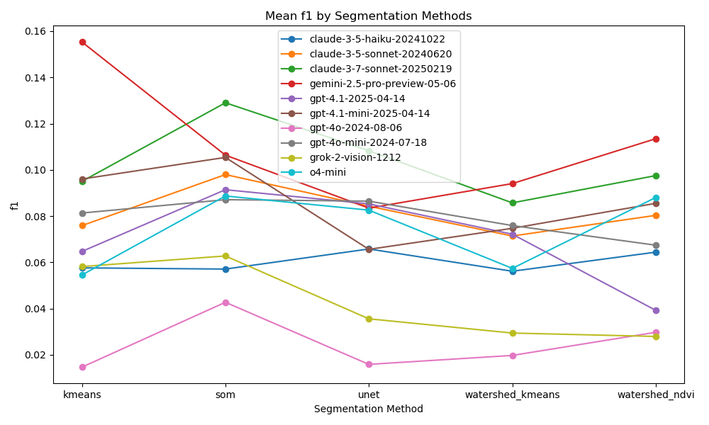

## Automated Insights (OpenAI GPT-4.1)

## Key Findings

### Best Performing Models and Methods
- The best performing model in terms of accuracy is **'gemini-2.5-pro-preview-05-06' with kmeans**, achieving an accuracy of **0.50911**. 
- In terms of IoU, the same model also leads with an IoU of **0.129682**.
- The highest F1 score is also from the **'gemini-2.5-pro-preview-05-06' with kmeans**, which scored **0.15531**.

### Performance Patterns and Trends
- There is a clear trend showing that models from the **'gemini'** series generally outperform those from other series, particularly in accuracy and IoU metrics.
- The **'claude-3-7-sonnet-20250219'** model also shows strong performance, particularly with the **'som'** method, indicating that newer models may have improved capabilities.
- The **'gpt-4o-2024-08-06'** series consistently underperformed across all metrics, indicating potential issues with this model version.

### Surprising Results or Anomalies
- The **'gpt-4.1-2025-04-14'** model performed relatively poorly overall, especially with the **'watershed_ndvi'** method, which had the lowest accuracy of **0.108676**.
- The **'grok-2-vision-1212'** series had mixed results, with the **'som'** method performing better than expected compared to other methods within the same model.

## Model Performance Analysis

### Top 3 Models by IoU
1. **'gemini-2.5-pro-preview-05-06' with kmeans**: IoU of **0.129682**
2. **'claude-3-7-sonnet-20250219' with som**: IoU of **0.0941263**
3. **'claude-3-7-sonnet-20250219' with watershed_ndvi**: IoU of **0.078398**

### Top 3 Models by Accuracy
1. **'gemini-2.5-pro-preview-05-06' with kmeans**: Accuracy of **0.50911**
2. **'claude-3-7-sonnet-20250219' with som**: Accuracy of **0.461425**
3. **'claude-3-7-sonnet-20250219' with watershed_ndvi**: Accuracy of **0.379993**

### Consistency Across Different Methods
- The **'gemini-2.5-pro-preview-05-06'** model consistently performed well across all segmentation methods, particularly with kmeans.
- The **'claude-3-7-sonnet-20250219'** model also showed strong performance across different methods, especially with the **'som'** method.
- In contrast, the **'gpt-4o-2024-08-06'** series showed a lack of consistency, with all methods performing poorly.

## Method Performance Analysis

### Best Segmentation Methods
1. **Kmeans**: Highest overall performance across models, particularly with the **'gemini'** series.
2. **Som**: Strong performance with newer models like **'claude-3-7-sonnet-20250219'**.
3. **Watershed_ndvi**: Moderate performance, showing potential in certain models but generally lower than kmeans and som.

### Method-Specific Strengths and Weaknesses
- **Kmeans**: Strong accuracy and IoU across multiple models, indicating it is a reliable choice for segmentation.
- **Som**: Shows promise, especially in newer models, but may not perform as consistently across older models.
- **Watershed methods**: Generally lower performance, indicating they may need refinement or are less suited for the current models.

### Method-Model Combinations
- The combination of **'gemini-2.5-pro-preview-05-06' with kmeans** is the standout performer across all metrics.
- **'claude-3-7-sonnet-20250219' with som** also shows strong results, suggesting that this combination could be beneficial for specific applications.

## Recommendations

### For Production Use
- **Deploy the 'gemini-2.5-pro-preview-05-06' with kmeans** as it has the best overall performance metrics.
- Consider using **'claude-3-7-sonnet-20250219' with som** for applications where newer model capabilities are advantageous.

### For Research Purposes
- Investigate the **'claude-3-7-sonnet-20250219'** series further, especially the **'som'** method, to understand its strengths and potential improvements.
- Explore the **'gpt-4o'** series to identify the reasons for its underperformance and potential areas for enhancement.

### Areas for Improvement
- Focus on enhancing the **watershed methods**, as they consistently underperformed compared to kmeans and som.
- Investigate the **'gpt-4o'** series for potential model architecture improvements or retraining with updated datasets to improve performance metrics.

---

## Tile 0
### Source Images
| Type | Image |
|------|-------|
| TCI (RGB) |  |
| WorldCover Ground Truth |  |

### kmeans  Segmentation Masks
| Type | Image |
|------|-------|
| Segmentation Mask |  |

### som  Segmentation Masks
| Type | Image |
|------|-------|
| Segmentation Mask |  |

### unet  Segmentation Masks
| Type | Image |
|------|-------|
| Segmentation Mask |  |

### watershed_kmeans  Segmentation Masks
| Type | Image |
|------|-------|
| Segmentation Mask |  |

### watershed_ndvi  Segmentation Masks
| Type | Image |
|------|-------|
| Segmentation Mask |  |

### kmeans  claude-3-5-haiku-20241022
| Metric | Value |
|--------|-------|
| accuracy | 0.2642 |
| iou | 0.0519 |
| f1 | 0.0859 |
| kappa | 0.0439 |
| Mask |  |
| Legend |  |
| JSON | [json](tile_0/kmeans_mask_claude-3-5-haiku-20241022_vlm_categories.json) |

#### Per-class metrics

| Class Code | Class Name (EN) | IoU | Precision | Recall | F1 | Pixel Acc | Support True | Support Pred |
|------------|----------------|-----|-----------|--------|----|-----------|-------------|-------------|
| 10 | Tree cover | 0.0000 | 0.0000 | 0.0000 | 0.0000 |  |  |  |
| 20 | Shrubland | 0.0000 | 0.0000 | 0.0000 | 0.0000 |  |  |  |
| 30 | Grassland | 0.1829 | 0.2340 | 0.4560 | 0.3093 |  |  |  |
| 40 | Cropland | 0.2300 | 0.8742 | 0.2378 | 0.3740 |  |  |  |
| 50 | Built-up | 0.0020 | 0.0021 | 0.0400 | 0.0039 |  |  |  |
| 60 | Bare / sparse vegetation | 0.0000 | 0.0000 | 0.0000 | 0.0000 |  |  |  |
| 80 | Permanent water bodies | 0.0000 | 0.0000 | 0.0000 | 0.0000 |  |  |  |
| 90 | Herbaceous wetland | 0.0000 | 0.0000 | 0.0000 | 0.0000 |  |  |  |

### kmeans  claude-3-5-sonnet-20240620
| Metric | Value |
|--------|-------|
| accuracy | 0.2050 |
| iou | 0.0315 |
| f1 | 0.0522 |
| kappa | 0.0121 |
| Mask |  |
| Legend |  |
| JSON | [json](tile_0/kmeans_mask_claude-3-5-sonnet-20240620_vlm_categories.json) |

#### Per-class metrics

| Class Code | Class Name (EN) | IoU | Precision | Recall | F1 | Pixel Acc | Support True | Support Pred |
|------------|----------------|-----|-----------|--------|----|-----------|-------------|-------------|
| 10 | Tree cover | 0.0184 | 0.0190 | 0.3736 | 0.0362 |  |  |  |
| 20 | Shrubland | 0.0000 | 0.0000 | 0.0000 | 0.0000 |  |  |  |
| 30 | Grassland | 0.0000 | 0.0000 | 0.0000 | 0.0000 |  |  |  |
| 40 | Cropland | 0.2300 | 0.8742 | 0.2378 | 0.3740 |  |  |  |
| 50 | Built-up | 0.0039 | 0.0040 | 0.1768 | 0.0079 |  |  |  |
| 60 | Bare / sparse vegetation | 0.0000 | 0.0000 | 0.0000 | 0.0000 |  |  |  |
| 80 | Permanent water bodies | 0.0000 | 0.0000 | 0.0000 | 0.0000 |  |  |  |
| 90 | Herbaceous wetland | 0.0000 | 0.0000 | 0.0000 | 0.0000 |  |  |  |

### kmeans  claude-3-7-sonnet-20250219
| Metric | Value |
|--------|-------|
| accuracy | 0.3441 |
| iou | 0.0652 |
| f1 | 0.1006 |
| kappa | -0.0975 |
| Mask |  |
| Legend |  |
| JSON | [json](tile_0/kmeans_mask_claude-3-7-sonnet-20250219_vlm_categories.json) |

#### Per-class metrics

| Class Code | Class Name (EN) | IoU | Precision | Recall | F1 | Pixel Acc | Support True | Support Pred |
|------------|----------------|-----|-----------|--------|----|-----------|-------------|-------------|
| 10 | Tree cover | 0.0000 | 0.0000 | 0.0000 | 0.0000 |  |  |  |
| 30 | Grassland | 0.0361 | 0.0606 | 0.0819 | 0.0697 |  |  |  |
| 40 | Cropland | 0.3446 | 0.7364 | 0.3931 | 0.5126 |  |  |  |
| 50 | Built-up | 0.0108 | 0.0108 | 0.7179 | 0.0213 |  |  |  |
| 80 | Permanent water bodies | 0.0000 | 0.0000 | 0.0000 | 0.0000 |  |  |  |
| 90 | Herbaceous wetland | 0.0000 | 0.0000 | 0.0000 | 0.0000 |  |  |  |

### kmeans  gemini-2.5-pro-preview-05-06
| Metric | Value |
|--------|-------|
| accuracy | 0.5077 |
| iou | 0.0882 |
| f1 | 0.1164 |
| kappa | -0.0586 |
| Mask |  |
| Legend |  |
| JSON | [json](tile_0/kmeans_mask_gemini-2.5-pro-preview-05-06_vlm_categories.json) |

#### Per-class metrics

| Class Code | Class Name (EN) | IoU | Precision | Recall | F1 | Pixel Acc | Support True | Support Pred |
|------------|----------------|-----|-----------|--------|----|-----------|-------------|-------------|
| 10 | Tree cover | 0.0000 | 0.0000 | 0.0000 | 0.0000 |  |  |  |
| 30 | Grassland | 0.0000 | 0.0000 | 0.0000 | 0.0000 |  |  |  |
| 40 | Cropland | 0.5237 | 0.7931 | 0.6066 | 0.6874 |  |  |  |
| 50 | Built-up | 0.0054 | 0.0056 | 0.1368 | 0.0107 |  |  |  |
| 80 | Permanent water bodies | 0.0001 | 0.0001 | 0.1231 | 0.0003 |  |  |  |
| 90 | Herbaceous wetland | 0.0000 | 0.0000 | 0.0000 | 0.0000 |  |  |  |

### kmeans  gpt-4.1-2025-04-14
| Metric | Value |
|--------|-------|
| accuracy | 0.0728 |
| iou | 0.0143 |
| f1 | 0.0272 |
| kappa | -0.0112 |
| Mask |  |
| Legend |  |
| JSON | [json](tile_0/kmeans_mask_gpt-4.1-2025-04-14_vlm_categories.json) |

#### Per-class metrics

| Class Code | Class Name (EN) | IoU | Precision | Recall | F1 | Pixel Acc | Support True | Support Pred |
|------------|----------------|-----|-----------|--------|----|-----------|-------------|-------------|
| 10 | Tree cover | 0.0057 | 0.0060 | 0.0961 | 0.0113 |  |  |  |
| 20 | Shrubland | 0.0000 | 0.0000 | 0.0000 | 0.0000 |  |  |  |
| 30 | Grassland | 0.0361 | 0.0606 | 0.0819 | 0.0697 |  |  |  |
| 40 | Cropland | 0.0711 | 0.9626 | 0.0712 | 0.1327 |  |  |  |
| 50 | Built-up | 0.0020 | 0.0021 | 0.0400 | 0.0039 |  |  |  |
| 60 | Bare / sparse vegetation | 0.0000 | 0.0000 | 0.0000 | 0.0000 |  |  |  |
| 80 | Permanent water bodies | 0.0000 | 0.0000 | 0.0000 | 0.0000 |  |  |  |
| 90 | Herbaceous wetland | 0.0000 | 0.0000 | 0.0000 | 0.0000 |  |  |  |

### kmeans  gpt-4.1-mini-2025-04-14
| Metric | Value |
|--------|-------|
| accuracy | 0.2160 |
| iou | 0.0358 |
| f1 | 0.0605 |
| kappa | -0.0079 |
| Mask |  |
| Legend |  |
| JSON | [json](tile_0/kmeans_mask_gpt-4.1-mini-2025-04-14_vlm_categories.json) |

#### Per-class metrics

| Class Code | Class Name (EN) | IoU | Precision | Recall | F1 | Pixel Acc | Support True | Support Pred |
|------------|----------------|-----|-----------|--------|----|-----------|-------------|-------------|
| 10 | Tree cover | 0.0184 | 0.0190 | 0.3736 | 0.0362 |  |  |  |
| 20 | Shrubland | 0.0000 | 0.0000 | 0.0000 | 0.0000 |  |  |  |
| 30 | Grassland | 0.0361 | 0.0606 | 0.0819 | 0.0697 |  |  |  |
| 40 | Cropland | 0.2300 | 0.8742 | 0.2378 | 0.3740 |  |  |  |
| 50 | Built-up | 0.0020 | 0.0021 | 0.0400 | 0.0039 |  |  |  |
| 60 | Bare / sparse vegetation | 0.0000 | 0.0000 | 0.0000 | 0.0000 |  |  |  |
| 80 | Permanent water bodies | 0.0000 | 0.0000 | 0.0000 | 0.0000 |  |  |  |
| 90 | Herbaceous wetland | 0.0000 | 0.0000 | 0.0000 | 0.0000 |  |  |  |

### kmeans  gpt-4o-2024-08-06
| Metric | Value |
|--------|-------|
| accuracy | 0.0000 |
| iou | 0.0000 |
| f1 | 0.0000 |
| kappa | 0.0000 |
| Mask |  |
| Legend |  |
| JSON | [json](tile_0/kmeans_mask_gpt-4o-2024-08-06_vlm_categories.json) |

#### Per-class metrics

| Class Code | Class Name (EN) | IoU | Precision | Recall | F1 | Pixel Acc | Support True | Support Pred |
|------------|----------------|-----|-----------|--------|----|-----------|-------------|-------------|
| 0 | Unknown | 0.0000 | 0.0000 | 0.0000 | 0.0000 |  |  |  |
| 10 | Tree cover | 0.0000 | 0.0000 | 0.0000 | 0.0000 |  |  |  |
| 30 | Grassland | 0.0000 | 0.0000 | 0.0000 | 0.0000 |  |  |  |
| 40 | Cropland | 0.0000 | 0.0000 | 0.0000 | 0.0000 |  |  |  |
| 50 | Built-up | 0.0000 | 0.0000 | 0.0000 | 0.0000 |  |  |  |
| 80 | Permanent water bodies | 0.0000 | 0.0000 | 0.0000 | 0.0000 |  |  |  |
| 90 | Herbaceous wetland | 0.0000 | 0.0000 | 0.0000 | 0.0000 |  |  |  |

### kmeans  gpt-4o-mini-2024-07-18
| Metric | Value |
|--------|-------|
| accuracy | 0.2112 |
| iou | 0.0340 |
| f1 | 0.0569 |
| kappa | -0.0102 |
| Mask |  |
| Legend |  |
| JSON | [json](tile_0/kmeans_mask_gpt-4o-mini-2024-07-18_vlm_categories.json) |

#### Per-class metrics

| Class Code | Class Name (EN) | IoU | Precision | Recall | F1 | Pixel Acc | Support True | Support Pred |
|------------|----------------|-----|-----------|--------|----|-----------|-------------|-------------|
| 10 | Tree cover | 0.0003 | 0.0004 | 0.0016 | 0.0006 |  |  |  |
| 20 | Shrubland | 0.0000 | 0.0000 | 0.0000 | 0.0000 |  |  |  |
| 30 | Grassland | 0.0361 | 0.0606 | 0.0819 | 0.0697 |  |  |  |
| 40 | Cropland | 0.2300 | 0.8742 | 0.2378 | 0.3740 |  |  |  |
| 50 | Built-up | 0.0054 | 0.0056 | 0.1368 | 0.0107 |  |  |  |
| 60 | Bare / sparse vegetation | 0.0000 | 0.0000 | 0.0000 | 0.0000 |  |  |  |
| 80 | Permanent water bodies | 0.0000 | 0.0000 | 0.0000 | 0.0000 |  |  |  |
| 90 | Herbaceous wetland | 0.0000 | 0.0000 | 0.0000 | 0.0000 |  |  |  |

### kmeans  grok-2-vision-1212
| Metric | Value |
|--------|-------|
| accuracy | 0.0240 |
| iou | 0.0099 |
| f1 | 0.0185 |
| kappa | -0.0088 |
| Mask |  |
| Legend |  |
| JSON | [json](tile_0/kmeans_mask_grok-2-vision-1212_vlm_categories.json) |

#### Per-class metrics

| Class Code | Class Name (EN) | IoU | Precision | Recall | F1 | Pixel Acc | Support True | Support Pred |
|------------|----------------|-----|-----------|--------|----|-----------|-------------|-------------|
| 0 | Unknown | 0.0000 | 0.0000 | 0.0000 | 0.0000 |  |  |  |
| 10 | Tree cover | 0.0000 | 0.0000 | 0.0000 | 0.0000 |  |  |  |
| 30 | Grassland | 0.0693 | 0.1056 | 0.1680 | 0.1297 |  |  |  |
| 40 | Cropland | 0.0000 | 0.0000 | 0.0000 | 0.0000 |  |  |  |
| 50 | Built-up | 0.0000 | 0.0000 | 0.0000 | 0.0000 |  |  |  |
| 80 | Permanent water bodies | 0.0000 | 0.0000 | 0.0000 | 0.0000 |  |  |  |
| 90 | Herbaceous wetland | 0.0000 | 0.0000 | 0.0000 | 0.0000 |  |  |  |

### kmeans  o4-mini
| Metric | Value |
|--------|-------|
| accuracy | 0.2052 |
| iou | 0.0360 |
| f1 | 0.0596 |
| kappa | 0.0118 |
| Mask |  |
| Legend |  |
| JSON | [json](tile_0/kmeans_mask_o4-mini_vlm_categories.json) |

#### Per-class metrics

| Class Code | Class Name (EN) | IoU | Precision | Recall | F1 | Pixel Acc | Support True | Support Pred |
|------------|----------------|-----|-----------|--------|----|-----------|-------------|-------------|
| 10 | Tree cover | 0.0184 | 0.0190 | 0.3736 | 0.0362 |  |  |  |
| 30 | Grassland | 0.0000 | 0.0000 | 0.0000 | 0.0000 |  |  |  |
| 40 | Cropland | 0.2300 | 0.8742 | 0.2378 | 0.3740 |  |  |  |
| 50 | Built-up | 0.0035 | 0.0035 | 0.2126 | 0.0070 |  |  |  |
| 60 | Bare / sparse vegetation | 0.0000 | 0.0000 | 0.0000 | 0.0000 |  |  |  |
| 80 | Permanent water bodies | 0.0000 | 0.0000 | 0.0000 | 0.0000 |  |  |  |
| 90 | Herbaceous wetland | 0.0000 | 0.0000 | 0.0000 | 0.0000 |  |  |  |

### som  claude-3-5-haiku-20241022
| Metric | Value |
|--------|-------|
| accuracy | 0.1825 |
| iou | 0.0431 |
| f1 | 0.0749 |
| kappa | 0.0361 |
| Mask |  |
| Legend |  |
| JSON | [json](tile_0/som_mask_claude-3-5-haiku-20241022_vlm_categories.json) |

#### Per-class metrics

| Class Code | Class Name (EN) | IoU | Precision | Recall | F1 | Pixel Acc | Support True | Support Pred |
|------------|----------------|-----|-----------|--------|----|-----------|-------------|-------------|
| 10 | Tree cover | 0.0224 | 0.0237 | 0.2957 | 0.0439 |  |  |  |
| 20 | Shrubland | 0.0000 | 0.0000 | 0.0000 | 0.0000 |  |  |  |
| 30 | Grassland | 0.1713 | 0.2489 | 0.3546 | 0.2925 |  |  |  |
| 40 | Cropland | 0.1497 | 0.8905 | 0.1525 | 0.2603 |  |  |  |
| 50 | Built-up | 0.0014 | 0.0015 | 0.0351 | 0.0028 |  |  |  |
| 60 | Bare / sparse vegetation | 0.0000 | 0.0000 | 0.0000 | 0.0000 |  |  |  |
| 80 | Permanent water bodies | 0.0000 | 0.0000 | 0.0000 | 0.0000 |  |  |  |
| 90 | Herbaceous wetland | 0.0000 | 0.0000 | 0.0000 | 0.0000 |  |  |  |

### som  claude-3-5-sonnet-20240620
| Metric | Value |
|--------|-------|
| accuracy | 0.1598 |
| iou | 0.0384 |
| f1 | 0.0690 |
| kappa | 0.0126 |
| Mask |  |
| Legend |  |
| JSON | [json](tile_0/som_mask_claude-3-5-sonnet-20240620_vlm_categories.json) |

#### Per-class metrics

| Class Code | Class Name (EN) | IoU | Precision | Recall | F1 | Pixel Acc | Support True | Support Pred |
|------------|----------------|-----|-----------|--------|----|-----------|-------------|-------------|
| 10 | Tree cover | 0.0224 | 0.0237 | 0.2957 | 0.0439 |  |  |  |
| 30 | Grassland | 0.0901 | 0.1481 | 0.1872 | 0.1653 |  |  |  |
| 40 | Cropland | 0.1497 | 0.8905 | 0.1525 | 0.2603 |  |  |  |
| 50 | Built-up | 0.0066 | 0.0067 | 0.2512 | 0.0131 |  |  |  |
| 60 | Bare / sparse vegetation | 0.0000 | 0.0000 | 0.0000 | 0.0000 |  |  |  |
| 80 | Permanent water bodies | 0.0003 | 0.0003 | 0.1692 | 0.0005 |  |  |  |
| 90 | Herbaceous wetland | 0.0000 | 0.0000 | 0.0000 | 0.0000 |  |  |  |

### som  claude-3-7-sonnet-20250219
| Metric | Value |
|--------|-------|
| accuracy | 0.5691 |
| iou | 0.0987 |
| f1 | 0.1255 |
| kappa | -0.0546 |
| Mask |  |
| Legend |  |
| JSON | [json](tile_0/som_mask_claude-3-7-sonnet-20250219_vlm_categories.json) |

#### Per-class metrics

| Class Code | Class Name (EN) | IoU | Precision | Recall | F1 | Pixel Acc | Support True | Support Pred |
|------------|----------------|-----|-----------|--------|----|-----------|-------------|-------------|
| 10 | Tree cover | 0.0064 | 0.0068 | 0.0808 | 0.0126 |  |  |  |
| 30 | Grassland | 0.0000 | 0.0000 | 0.0000 | 0.0000 |  |  |  |
| 40 | Cropland | 0.5842 | 0.8065 | 0.6794 | 0.7375 |  |  |  |
| 50 | Built-up | 0.0014 | 0.0015 | 0.0351 | 0.0028 |  |  |  |
| 80 | Permanent water bodies | 0.0000 | 0.0000 | 0.0000 | 0.0000 |  |  |  |
| 90 | Herbaceous wetland | 0.0000 | 0.0000 | 0.0000 | 0.0000 |  |  |  |

### som  gemini-2.5-pro-preview-05-06
| Metric | Value |
|--------|-------|
| accuracy | 0.3143 |
| iou | 0.0586 |
| f1 | 0.0928 |
| kappa | -0.0087 |
| Mask |  |
| Legend |  |
| JSON | [json](tile_0/som_mask_gemini-2.5-pro-preview-05-06_vlm_categories.json) |

#### Per-class metrics

| Class Code | Class Name (EN) | IoU | Precision | Recall | F1 | Pixel Acc | Support True | Support Pred |
|------------|----------------|-----|-----------|--------|----|-----------|-------------|-------------|
| 10 | Tree cover | 0.0048 | 0.0053 | 0.0531 | 0.0096 |  |  |  |
| 30 | Grassland | 0.0718 | 0.1412 | 0.1273 | 0.1339 |  |  |  |
| 40 | Cropland | 0.3269 | 0.8226 | 0.3517 | 0.4928 |  |  |  |
| 50 | Built-up | 0.0066 | 0.0067 | 0.2512 | 0.0131 |  |  |  |
| 60 | Bare / sparse vegetation | 0.0000 | 0.0000 | 0.0000 | 0.0000 |  |  |  |
| 80 | Permanent water bodies | 0.0000 | 0.0000 | 0.0000 | 0.0000 |  |  |  |
| 90 | Herbaceous wetland | 0.0000 | 0.0000 | 0.0000 | 0.0000 |  |  |  |

### som  gpt-4.1-2025-04-14
| Metric | Value |
|--------|-------|
| accuracy | 0.1341 |
| iou | 0.0265 |
| f1 | 0.0472 |
| kappa | 0.0121 |
| Mask |  |
| Legend |  |
| JSON | [json](tile_0/som_mask_gpt-4.1-2025-04-14_vlm_categories.json) |

#### Per-class metrics

| Class Code | Class Name (EN) | IoU | Precision | Recall | F1 | Pixel Acc | Support True | Support Pred |
|------------|----------------|-----|-----------|--------|----|-----------|-------------|-------------|
| 10 | Tree cover | 0.0224 | 0.0237 | 0.2957 | 0.0439 |  |  |  |
| 30 | Grassland | 0.0000 | 0.0000 | 0.0000 | 0.0000 |  |  |  |
| 40 | Cropland | 0.1497 | 0.8905 | 0.1525 | 0.2603 |  |  |  |
| 50 | Built-up | 0.0066 | 0.0067 | 0.2512 | 0.0131 |  |  |  |
| 60 | Bare / sparse vegetation | 0.0000 | 0.0000 | 0.0000 | 0.0000 |  |  |  |
| 80 | Permanent water bodies | 0.0009 | 0.0009 | 0.4923 | 0.0019 |  |  |  |
| 90 | Herbaceous wetland | 0.0058 | 0.0058 | 0.6309 | 0.0114 |  |  |  |

### som  gpt-4.1-mini-2025-04-14
| Metric | Value |
|--------|-------|
| accuracy | 0.2895 |
| iou | 0.0429 |
| f1 | 0.0648 |
| kappa | 0.0352 |
| Mask |  |
| Legend |  |
| JSON | [json](tile_0/som_mask_gpt-4.1-mini-2025-04-14_vlm_categories.json) |

#### Per-class metrics

| Class Code | Class Name (EN) | IoU | Precision | Recall | F1 | Pixel Acc | Support True | Support Pred |
|------------|----------------|-----|-----------|--------|----|-----------|-------------|-------------|
| 10 | Tree cover | 0.0094 | 0.0097 | 0.2120 | 0.0186 |  |  |  |
| 20 | Shrubland | 0.0000 | 0.0000 | 0.0000 | 0.0000 |  |  |  |
| 30 | Grassland | 0.0000 | 0.0000 | 0.0000 | 0.0000 |  |  |  |
| 40 | Cropland | 0.3334 | 0.9238 | 0.3429 | 0.5001 |  |  |  |
| 50 | Built-up | 0.0000 | 0.0000 | 0.0000 | 0.0000 |  |  |  |
| 60 | Bare / sparse vegetation | 0.0000 | 0.0000 | 0.0000 | 0.0000 |  |  |  |
| 80 | Permanent water bodies | 0.0000 | 0.0000 | 0.0000 | 0.0000 |  |  |  |
| 90 | Herbaceous wetland | 0.0000 | 0.0000 | 0.0000 | 0.0000 |  |  |  |

### som  gpt-4o-2024-08-06
| Metric | Value |
|--------|-------|
| accuracy | 0.1601 |
| iou | 0.0384 |
| f1 | 0.0688 |
| kappa | 0.0127 |
| Mask |  |
| Legend |  |
| JSON | [json](tile_0/som_mask_gpt-4o-2024-08-06_vlm_categories.json) |

#### Per-class metrics

| Class Code | Class Name (EN) | IoU | Precision | Recall | F1 | Pixel Acc | Support True | Support Pred |
|------------|----------------|-----|-----------|--------|----|-----------|-------------|-------------|
| 10 | Tree cover | 0.0239 | 0.0249 | 0.3585 | 0.0466 |  |  |  |
| 30 | Grassland | 0.0901 | 0.1481 | 0.1872 | 0.1653 |  |  |  |
| 40 | Cropland | 0.1497 | 0.8905 | 0.1525 | 0.2603 |  |  |  |
| 50 | Built-up | 0.0039 | 0.0040 | 0.1298 | 0.0077 |  |  |  |
| 60 | Bare / sparse vegetation | 0.0000 | 0.0000 | 0.0000 | 0.0000 |  |  |  |
| 80 | Permanent water bodies | 0.0009 | 0.0009 | 0.4923 | 0.0019 |  |  |  |
| 90 | Herbaceous wetland | 0.0000 | 0.0000 | 0.0000 | 0.0000 |  |  |  |

### som  gpt-4o-mini-2024-07-18
| Metric | Value |
|--------|-------|
| accuracy | 0.1382 |
| iou | 0.0281 |
| f1 | 0.0503 |
| kappa | -0.0104 |
| Mask |  |
| Legend |  |
| JSON | [json](tile_0/som_mask_gpt-4o-mini-2024-07-18_vlm_categories.json) |

#### Per-class metrics

| Class Code | Class Name (EN) | IoU | Precision | Recall | F1 | Pixel Acc | Support True | Support Pred |
|------------|----------------|-----|-----------|--------|----|-----------|-------------|-------------|
| 10 | Tree cover | 0.0224 | 0.0237 | 0.2957 | 0.0439 |  |  |  |
| 30 | Grassland | 0.0169 | 0.0308 | 0.0360 | 0.0332 |  |  |  |
| 40 | Cropland | 0.1497 | 0.8905 | 0.1525 | 0.2603 |  |  |  |
| 50 | Built-up | 0.0066 | 0.0067 | 0.2512 | 0.0131 |  |  |  |
| 60 | Bare / sparse vegetation | 0.0000 | 0.0000 | 0.0000 | 0.0000 |  |  |  |
| 80 | Permanent water bodies | 0.0009 | 0.0009 | 0.4923 | 0.0019 |  |  |  |
| 90 | Herbaceous wetland | 0.0000 | 0.0000 | 0.0000 | 0.0000 |  |  |  |

### som  grok-2-vision-1212
| Metric | Value |
|--------|-------|
| accuracy | 0.3358 |
| iou | 0.0658 |
| f1 | 0.1041 |
| kappa | 0.0437 |
| Mask |  |
| Legend |  |
| JSON | [json](tile_0/som_mask_grok-2-vision-1212_vlm_categories.json) |

#### Per-class metrics

| Class Code | Class Name (EN) | IoU | Precision | Recall | F1 | Pixel Acc | Support True | Support Pred |
|------------|----------------|-----|-----------|--------|----|-----------|-------------|-------------|
| 10 | Tree cover | 0.0081 | 0.0087 | 0.1107 | 0.0161 |  |  |  |
| 30 | Grassland | 0.1191 | 0.1562 | 0.3340 | 0.2128 |  |  |  |
| 40 | Cropland | 0.3334 | 0.9238 | 0.3429 | 0.5001 |  |  |  |
| 50 | Built-up | 0.0000 | 0.0000 | 0.0000 | 0.0000 |  |  |  |
| 60 | Bare / sparse vegetation | 0.0000 | 0.0000 | 0.0000 | 0.0000 |  |  |  |
| 80 | Permanent water bodies | 0.0000 | 0.0000 | 0.0000 | 0.0000 |  |  |  |
| 90 | Herbaceous wetland | 0.0000 | 0.0000 | 0.0000 | 0.0000 |  |  |  |

### som  o4-mini
| Metric | Value |
|--------|-------|
| accuracy | 0.1613 |
| iou | 0.0310 |
| f1 | 0.0542 |
| kappa | -0.0204 |
| Mask |  |
| Legend |  |
| JSON | [json](tile_0/som_mask_o4-mini_vlm_categories.json) |

#### Per-class metrics

| Class Code | Class Name (EN) | IoU | Precision | Recall | F1 | Pixel Acc | Support True | Support Pred |
|------------|----------------|-----|-----------|--------|----|-----------|-------------|-------------|
| 10 | Tree cover | 0.0224 | 0.0237 | 0.2957 | 0.0439 |  |  |  |
| 30 | Grassland | 0.0169 | 0.0308 | 0.0360 | 0.0332 |  |  |  |
| 40 | Cropland | 0.1755 | 0.8400 | 0.1815 | 0.2986 |  |  |  |
| 50 | Built-up | 0.0014 | 0.0015 | 0.0351 | 0.0028 |  |  |  |
| 60 | Bare / sparse vegetation | 0.0000 | 0.0000 | 0.0000 | 0.0000 |  |  |  |
| 80 | Permanent water bodies | 0.0005 | 0.0005 | 0.2615 | 0.0009 |  |  |  |
| 90 | Herbaceous wetland | 0.0000 | 0.0000 | 0.0000 | 0.0000 |  |  |  |

### unet  claude-3-5-haiku-20241022
| Metric | Value |
|--------|-------|
| accuracy | 0.3161 |
| iou | 0.0521 |
| f1 | 0.0763 |
| kappa | 0.0365 |
| Mask |  |
| Legend |  |
| JSON | [json](tile_0/unet_mask_claude-3-5-haiku-20241022_vlm_categories.json) |

#### Per-class metrics

| Class Code | Class Name (EN) | IoU | Precision | Recall | F1 | Pixel Acc | Support True | Support Pred |
|------------|----------------|-----|-----------|--------|----|-----------|-------------|-------------|
| 0 | Unknown | 0.0000 | 0.0000 | 0.0000 | 0.0000 |  |  |  |
| 10 | Tree cover | 0.0000 | 0.0000 | 0.0000 | 0.0000 |  |  |  |
| 30 | Grassland | 0.0000 | 0.0000 | 0.0000 | 0.0000 |  |  |  |
| 40 | Cropland | 0.3646 | 0.9103 | 0.3782 | 0.5344 |  |  |  |
| 50 | Built-up | 0.0000 | 0.0000 | 0.0000 | 0.0000 |  |  |  |
| 80 | Permanent water bodies | 0.0000 | 0.0000 | 0.0000 | 0.0000 |  |  |  |
| 90 | Herbaceous wetland | 0.0000 | 0.0000 | 0.0000 | 0.0000 |  |  |  |

### unet  claude-3-5-sonnet-20240620
| Metric | Value |
|--------|-------|
| accuracy | 0.3231 |
| iou | 0.0658 |
| f1 | 0.0989 |
| kappa | 0.0388 |
| Mask |  |
| Legend |  |
| JSON | [json](tile_0/unet_mask_claude-3-5-sonnet-20240620_vlm_categories.json) |

#### Per-class metrics

| Class Code | Class Name (EN) | IoU | Precision | Recall | F1 | Pixel Acc | Support True | Support Pred |
|------------|----------------|-----|-----------|--------|----|-----------|-------------|-------------|
| 10 | Tree cover | 0.0238 | 0.0251 | 0.3097 | 0.0465 |  |  |  |
| 30 | Grassland | 0.0011 | 0.0420 | 0.0011 | 0.0022 |  |  |  |
| 40 | Cropland | 0.3646 | 0.9103 | 0.3782 | 0.5344 |  |  |  |
| 50 | Built-up | 0.0052 | 0.0052 | 0.4533 | 0.0103 |  |  |  |
| 80 | Permanent water bodies | 0.0000 | 0.0000 | 0.0000 | 0.0000 |  |  |  |
| 90 | Herbaceous wetland | 0.0000 | 0.0000 | 0.0000 | 0.0000 |  |  |  |

### unet  claude-3-7-sonnet-20250219
| Metric | Value |
|--------|-------|
| accuracy | 0.4589 |
| iou | 0.0685 |
| f1 | 0.0938 |
| kappa | -0.0690 |
| Mask |  |
| Legend |  |
| JSON | [json](tile_0/unet_mask_claude-3-7-sonnet-20250219_vlm_categories.json) |

#### Per-class metrics

| Class Code | Class Name (EN) | IoU | Precision | Recall | F1 | Pixel Acc | Support True | Support Pred |
|------------|----------------|-----|-----------|--------|----|-----------|-------------|-------------|
| 10 | Tree cover | 0.0003 | 0.0003 | 0.0013 | 0.0005 |  |  |  |
| 30 | Grassland | 0.0000 | 0.0000 | 0.0000 | 0.0000 |  |  |  |
| 40 | Cropland | 0.4719 | 0.7765 | 0.5460 | 0.6412 |  |  |  |
| 50 | Built-up | 0.0075 | 0.0075 | 0.4800 | 0.0148 |  |  |  |
| 60 | Bare / sparse vegetation | 0.0000 | 0.0000 | 0.0000 | 0.0000 |  |  |  |
| 80 | Permanent water bodies | 0.0000 | 0.0000 | 0.0000 | 0.0000 |  |  |  |
| 90 | Herbaceous wetland | 0.0000 | 0.0000 | 0.0000 | 0.0000 |  |  |  |

### unet  gemini-2.5-pro-preview-05-06
| Metric | Value |
|--------|-------|
| accuracy | 0.3974 |
| iou | 0.0771 |
| f1 | 0.1113 |
| kappa | -0.0072 |
| Mask |  |
| Legend |  |
| JSON | [json](tile_0/unet_mask_gemini-2.5-pro-preview-05-06_vlm_categories.json) |

#### Per-class metrics

| Class Code | Class Name (EN) | IoU | Precision | Recall | F1 | Pixel Acc | Support True | Support Pred |
|------------|----------------|-----|-----------|--------|----|-----------|-------------|-------------|
| 10 | Tree cover | 0.0355 | 0.0386 | 0.3084 | 0.0686 |  |  |  |
| 30 | Grassland | 0.0000 | 0.0000 | 0.0000 | 0.0000 |  |  |  |
| 40 | Cropland | 0.4268 | 0.8218 | 0.4703 | 0.5982 |  |  |  |
| 50 | Built-up | 0.0005 | 0.0006 | 0.0063 | 0.0010 |  |  |  |
| 80 | Permanent water bodies | 0.0000 | 0.0000 | 0.0308 | 0.0000 |  |  |  |
| 90 | Herbaceous wetland | 0.0000 | 0.0000 | 0.0000 | 0.0000 |  |  |  |

### unet  gpt-4.1-2025-04-14
| Metric | Value |
|--------|-------|
| accuracy | 0.3256 |
| iou | 0.0596 |
| f1 | 0.0909 |
| kappa | 0.0131 |
| Mask |  |
| Legend |  |
| JSON | [json](tile_0/unet_mask_gpt-4.1-2025-04-14_vlm_categories.json) |

#### Per-class metrics

| Class Code | Class Name (EN) | IoU | Precision | Recall | F1 | Pixel Acc | Support True | Support Pred |
|------------|----------------|-----|-----------|--------|----|-----------|-------------|-------------|
| 10 | Tree cover | 0.0355 | 0.0386 | 0.3084 | 0.0686 |  |  |  |
| 30 | Grassland | 0.0094 | 0.0175 | 0.0199 | 0.0186 |  |  |  |
| 40 | Cropland | 0.3646 | 0.9103 | 0.3782 | 0.5344 |  |  |  |
| 50 | Built-up | 0.0075 | 0.0075 | 0.4316 | 0.0148 |  |  |  |
| 60 | Bare / sparse vegetation | 0.0000 | 0.0000 | 0.0000 | 0.0000 |  |  |  |
| 80 | Permanent water bodies | 0.0000 | 0.0000 | 0.0000 | 0.0000 |  |  |  |
| 90 | Herbaceous wetland | 0.0000 | 0.0000 | 0.0000 | 0.0000 |  |  |  |

### unet  gpt-4.1-mini-2025-04-14
| Metric | Value |
|--------|-------|
| accuracy | 0.3902 |
| iou | 0.0553 |
| f1 | 0.0794 |
| kappa | 0.0010 |
| Mask |  |
| Legend |  |
| JSON | [json](tile_0/unet_mask_gpt-4.1-mini-2025-04-14_vlm_categories.json) |

#### Per-class metrics

| Class Code | Class Name (EN) | IoU | Precision | Recall | F1 | Pixel Acc | Support True | Support Pred |
|------------|----------------|-----|-----------|--------|----|-----------|-------------|-------------|
| 10 | Tree cover | 0.0222 | 0.0227 | 0.4991 | 0.0434 |  |  |  |
| 20 | Shrubland | 0.0000 | 0.0000 | 0.0000 | 0.0000 |  |  |  |
| 30 | Grassland | 0.0000 | 0.0000 | 0.0000 | 0.0000 |  |  |  |
| 40 | Cropland | 0.4195 | 0.8320 | 0.4584 | 0.5911 |  |  |  |
| 50 | Built-up | 0.0005 | 0.0006 | 0.0063 | 0.0010 |  |  |  |
| 60 | Bare / sparse vegetation | 0.0000 | 0.0000 | 0.0000 | 0.0000 |  |  |  |
| 80 | Permanent water bodies | 0.0000 | 0.0000 | 0.0000 | 0.0000 |  |  |  |
| 90 | Herbaceous wetland | 0.0000 | 0.0000 | 0.0000 | 0.0000 |  |  |  |

### unet  gpt-4o-2024-08-06
| Metric | Value |
|--------|-------|
| accuracy | 0.0000 |
| iou | 0.0000 |
| f1 | 0.0000 |
| kappa | 0.0000 |
| Mask |  |
| Legend |  |
| JSON | [json](tile_0/unet_mask_gpt-4o-2024-08-06_vlm_categories.json) |

#### Per-class metrics

| Class Code | Class Name (EN) | IoU | Precision | Recall | F1 | Pixel Acc | Support True | Support Pred |
|------------|----------------|-----|-----------|--------|----|-----------|-------------|-------------|
| 0 | Unknown | 0.0000 | 0.0000 | 0.0000 | 0.0000 |  |  |  |
| 10 | Tree cover | 0.0000 | 0.0000 | 0.0000 | 0.0000 |  |  |  |
| 30 | Grassland | 0.0000 | 0.0000 | 0.0000 | 0.0000 |  |  |  |
| 40 | Cropland | 0.0000 | 0.0000 | 0.0000 | 0.0000 |  |  |  |
| 50 | Built-up | 0.0000 | 0.0000 | 0.0000 | 0.0000 |  |  |  |
| 80 | Permanent water bodies | 0.0000 | 0.0000 | 0.0000 | 0.0000 |  |  |  |
| 90 | Herbaceous wetland | 0.0000 | 0.0000 | 0.0000 | 0.0000 |  |  |  |

### unet  gpt-4o-mini-2024-07-18
| Metric | Value |
|--------|-------|
| accuracy | 0.3875 |
| iou | 0.0789 |
| f1 | 0.1218 |
| kappa | 0.0761 |
| Mask |  |
| Legend |  |
| JSON | [json](tile_0/unet_mask_gpt-4o-mini-2024-07-18_vlm_categories.json) |

#### Per-class metrics

| Class Code | Class Name (EN) | IoU | Precision | Recall | F1 | Pixel Acc | Support True | Support Pred |
|------------|----------------|-----|-----------|--------|----|-----------|-------------|-------------|
| 10 | Tree cover | 0.0025 | 0.0027 | 0.0315 | 0.0050 |  |  |  |
| 20 | Shrubland | 0.0000 | 0.0000 | 0.0000 | 0.0000 |  |  |  |
| 30 | Grassland | 0.1850 | 0.2277 | 0.4968 | 0.3123 |  |  |  |
| 40 | Cropland | 0.3646 | 0.9103 | 0.3782 | 0.5344 |  |  |  |
| 50 | Built-up | 0.0004 | 0.0010 | 0.0007 | 0.0008 |  |  |  |
| 80 | Permanent water bodies | 0.0000 | 0.0000 | 0.0000 | 0.0000 |  |  |  |
| 90 | Herbaceous wetland | 0.0000 | 0.0000 | 0.0000 | 0.0000 |  |  |  |

### unet  grok-2-vision-1212
| Metric | Value |
|--------|-------|
| accuracy | 0.5241 |
| iou | 0.1032 |
| f1 | 0.1455 |
| kappa | 0.1261 |
| Mask |  |
| Legend |  |
| JSON | [json](tile_0/unet_mask_grok-2-vision-1212_vlm_categories.json) |

#### Per-class metrics

| Class Code | Class Name (EN) | IoU | Precision | Recall | F1 | Pixel Acc | Support True | Support Pred |
|------------|----------------|-----|-----------|--------|----|-----------|-------------|-------------|
| 10 | Tree cover | 0.0222 | 0.0227 | 0.4991 | 0.0434 |  |  |  |
| 30 | Grassland | 0.1565 | 0.2461 | 0.3005 | 0.2706 |  |  |  |
| 40 | Cropland | 0.5440 | 0.9299 | 0.5673 | 0.7047 |  |  |  |
| 50 | Built-up | 0.0000 | 0.0000 | 0.0000 | 0.0000 |  |  |  |
| 60 | Bare / sparse vegetation | 0.0000 | 0.0000 | 0.0000 | 0.0000 |  |  |  |
| 80 | Permanent water bodies | 0.0000 | 0.0000 | 0.0000 | 0.0000 |  |  |  |
| 90 | Herbaceous wetland | 0.0000 | 0.0000 | 0.0000 | 0.0000 |  |  |  |

### unet  o4-mini
| Metric | Value |
|--------|-------|
| accuracy | 0.3916 |
| iou | 0.0614 |
| f1 | 0.0868 |
| kappa | -0.0169 |
| Mask |  |
| Legend |  |
| JSON | [json](tile_0/unet_mask_o4-mini_vlm_categories.json) |

#### Per-class metrics

| Class Code | Class Name (EN) | IoU | Precision | Recall | F1 | Pixel Acc | Support True | Support Pred |
|------------|----------------|-----|-----------|--------|----|-----------|-------------|-------------|
| 10 | Tree cover | 0.0063 | 0.0065 | 0.1592 | 0.0125 |  |  |  |
| 30 | Grassland | 0.0000 | 0.0000 | 0.0000 | 0.0000 |  |  |  |
| 40 | Cropland | 0.4228 | 0.8207 | 0.4658 | 0.5943 |  |  |  |
| 50 | Built-up | 0.0005 | 0.0006 | 0.0070 | 0.0011 |  |  |  |
| 60 | Bare / sparse vegetation | 0.0000 | 0.0000 | 0.0000 | 0.0000 |  |  |  |
| 80 | Permanent water bodies | 0.0000 | 0.0000 | 0.0000 | 0.0000 |  |  |  |
| 90 | Herbaceous wetland | 0.0000 | 0.0000 | 0.0000 | 0.0000 |  |  |  |

### watershed_kmeans  claude-3-5-haiku-20241022
| Metric | Value |
|--------|-------|
| accuracy | 0.0060 |
| iou | 0.0034 |
| f1 | 0.0066 |
| kappa | -0.0090 |
| Mask |  |
| Legend |  |
| JSON | [json](tile_0/watershed_kmeans_mask_claude-3-5-haiku-20241022_vlm_categories.json) |

#### Per-class metrics

| Class Code | Class Name (EN) | IoU | Precision | Recall | F1 | Pixel Acc | Support True | Support Pred |
|------------|----------------|-----|-----------|--------|----|-----------|-------------|-------------|
| 0 | Unknown | 0.0000 | 0.0000 | 0.0000 | 0.0000 |  |  |  |
| 10 | Tree cover | 0.0240 | 0.0253 | 0.3245 | 0.0469 |  |  |  |
| 20 | Shrubland | 0.0000 | 0.0000 | 0.0000 | 0.0000 |  |  |  |
| 30 | Grassland | 0.0062 | 0.0164 | 0.0099 | 0.0124 |  |  |  |
| 40 | Cropland | 0.0000 | 0.0000 | 0.0000 | 0.0000 |  |  |  |
| 50 | Built-up | 0.0000 | 0.0000 | 0.0000 | 0.0000 |  |  |  |
| 60 | Bare / sparse vegetation | 0.0000 | 0.0000 | 0.0000 | 0.0000 |  |  |  |
| 80 | Permanent water bodies | 0.0000 | 0.0000 | 0.0000 | 0.0000 |  |  |  |
| 90 | Herbaceous wetland | 0.0000 | 0.0000 | 0.0000 | 0.0000 |  |  |  |

### watershed_kmeans  claude-3-5-sonnet-20240620
| Metric | Value |
|--------|-------|
| accuracy | 0.0997 |
| iou | 0.0174 |
| f1 | 0.0319 |
| kappa | 0.0035 |
| Mask |  |
| Legend |  |
| JSON | [json](tile_0/watershed_kmeans_mask_claude-3-5-sonnet-20240620_vlm_categories.json) |

#### Per-class metrics

| Class Code | Class Name (EN) | IoU | Precision | Recall | F1 | Pixel Acc | Support True | Support Pred |
|------------|----------------|-----|-----------|--------|----|-----------|-------------|-------------|
| 10 | Tree cover | 0.0128 | 0.0134 | 0.2163 | 0.0252 |  |  |  |
| 20 | Shrubland | 0.0000 | 0.0000 | 0.0000 | 0.0000 |  |  |  |
| 30 | Grassland | 0.0062 | 0.0164 | 0.0099 | 0.0124 |  |  |  |
| 40 | Cropland | 0.1104 | 0.9745 | 0.1107 | 0.1989 |  |  |  |
| 50 | Built-up | 0.0096 | 0.0097 | 0.4828 | 0.0190 |  |  |  |
| 60 | Bare / sparse vegetation | 0.0000 | 0.0000 | 0.0000 | 0.0000 |  |  |  |
| 80 | Permanent water bodies | 0.0000 | 0.0000 | 0.0000 | 0.0000 |  |  |  |
| 90 | Herbaceous wetland | 0.0000 | 0.0000 | 0.0000 | 0.0000 |  |  |  |

### watershed_kmeans  claude-3-7-sonnet-20250219
| Metric | Value |
|--------|-------|
| accuracy | 0.1309 |
| iou | 0.0232 |
| f1 | 0.0404 |
| kappa | 0.0182 |
| Mask |  |
| Legend |  |
| JSON | [json](tile_0/watershed_kmeans_mask_claude-3-7-sonnet-20250219_vlm_categories.json) |

#### Per-class metrics

| Class Code | Class Name (EN) | IoU | Precision | Recall | F1 | Pixel Acc | Support True | Support Pred |
|------------|----------------|-----|-----------|--------|----|-----------|-------------|-------------|
| 0 | Unknown | 0.0000 | 0.0000 | 0.0000 | 0.0000 |  |  |  |
| 10 | Tree cover | 0.0064 | 0.0068 | 0.0959 | 0.0128 |  |  |  |
| 30 | Grassland | 0.0000 | 0.0000 | 0.0000 | 0.0000 |  |  |  |
| 40 | Cropland | 0.1540 | 0.9720 | 0.1547 | 0.2670 |  |  |  |
| 50 | Built-up | 0.0016 | 0.0016 | 0.0484 | 0.0032 |  |  |  |
| 80 | Permanent water bodies | 0.0000 | 0.0000 | 0.0000 | 0.0000 |  |  |  |
| 90 | Herbaceous wetland | 0.0000 | 0.0000 | 0.0000 | 0.0000 |  |  |  |

### watershed_kmeans  gemini-2.5-pro-preview-05-06
| Metric | Value |
|--------|-------|
| accuracy | 0.5160 |
| iou | 0.0792 |
| f1 | 0.1022 |
| kappa | 0.0053 |
| Mask |  |
| Legend |  |
| JSON | [json](tile_0/watershed_kmeans_mask_gemini-2.5-pro-preview-05-06_vlm_categories.json) |

#### Per-class metrics

| Class Code | Class Name (EN) | IoU | Precision | Recall | F1 | Pixel Acc | Support True | Support Pred |
|------------|----------------|-----|-----------|--------|----|-----------|-------------|-------------|
| 10 | Tree cover | 0.0000 | 0.0000 | 0.0000 | 0.0000 |  |  |  |
| 30 | Grassland | 0.0000 | 0.0000 | 0.0000 | 0.0000 |  |  |  |
| 40 | Cropland | 0.5527 | 0.8412 | 0.6170 | 0.7119 |  |  |  |
| 50 | Built-up | 0.0016 | 0.0017 | 0.0639 | 0.0033 |  |  |  |
| 60 | Bare / sparse vegetation | 0.0000 | 0.0000 | 0.0000 | 0.0000 |  |  |  |
| 80 | Permanent water bodies | 0.0000 | 0.0000 | 0.0000 | 0.0000 |  |  |  |
| 90 | Herbaceous wetland | 0.0000 | 0.0000 | 0.0000 | 0.0000 |  |  |  |

### watershed_kmeans  gpt-4.1-2025-04-14
| Metric | Value |
|--------|-------|
| accuracy | 0.1779 |
| iou | 0.0194 |
| f1 | 0.0324 |
| kappa | -0.0015 |
| Mask |  |
| Legend |  |
| JSON | [json](tile_0/watershed_kmeans_mask_gpt-4.1-2025-04-14_vlm_categories.json) |

#### Per-class metrics

| Class Code | Class Name (EN) | IoU | Precision | Recall | F1 | Pixel Acc | Support True | Support Pred |
|------------|----------------|-----|-----------|--------|----|-----------|-------------|-------------|
| 10 | Tree cover | 0.0000 | 0.0000 | 0.0000 | 0.0000 |  |  |  |
| 20 | Shrubland | 0.0000 | 0.0000 | 0.0000 | 0.0000 |  |  |  |
| 30 | Grassland | 0.0062 | 0.0164 | 0.0099 | 0.0124 |  |  |  |
| 40 | Cropland | 0.2053 | 0.8883 | 0.2108 | 0.3407 |  |  |  |
| 50 | Built-up | 0.0012 | 0.0013 | 0.0316 | 0.0024 |  |  |  |
| 60 | Bare / sparse vegetation | 0.0000 | 0.0000 | 0.0000 | 0.0000 |  |  |  |
| 70 | Snow and ice | 0.0000 | 0.0000 | 0.0000 | 0.0000 |  |  |  |
| 80 | Permanent water bodies | 0.0000 | 0.0000 | 0.0000 | 0.0000 |  |  |  |
| 90 | Herbaceous wetland | 0.0007 | 0.0007 | 0.0848 | 0.0014 |  |  |  |
| 95 | Mangroves | 0.0000 | 0.0000 | 0.0000 | 0.0000 |  |  |  |
| 100 | Moss and lichen | 0.0000 | 0.0000 | 0.0000 | 0.0000 |  |  |  |

### watershed_kmeans  gpt-4.1-mini-2025-04-14
| Metric | Value |
|--------|-------|
| accuracy | 0.0063 |
| iou | 0.0029 |
| f1 | 0.0058 |
| kappa | -0.0240 |
| Mask |  |
| Legend |  |
| JSON | [json](tile_0/watershed_kmeans_mask_gpt-4.1-mini-2025-04-14_vlm_categories.json) |

#### Per-class metrics

| Class Code | Class Name (EN) | IoU | Precision | Recall | F1 | Pixel Acc | Support True | Support Pred |
|------------|----------------|-----|-----------|--------|----|-----------|-------------|-------------|
| 10 | Tree cover | 0.0047 | 0.0051 | 0.0555 | 0.0094 |  |  |  |
| 20 | Shrubland | 0.0000 | 0.0000 | 0.0000 | 0.0000 |  |  |  |
| 30 | Grassland | 0.0091 | 0.0161 | 0.0205 | 0.0180 |  |  |  |
| 40 | Cropland | 0.0000 | 0.0000 | 0.0000 | 0.0000 |  |  |  |
| 50 | Built-up | 0.0096 | 0.0097 | 0.4828 | 0.0190 |  |  |  |
| 60 | Bare / sparse vegetation | 0.0000 | 0.0000 | 0.0000 | 0.0000 |  |  |  |
| 80 | Permanent water bodies | 0.0000 | 0.0000 | 0.0000 | 0.0000 |  |  |  |
| 90 | Herbaceous wetland | 0.0000 | 0.0000 | 0.0000 | 0.0000 |  |  |  |

### watershed_kmeans  gpt-4o-2024-08-06
| Metric | Value |
|--------|-------|
| accuracy | 0.0000 |
| iou | 0.0000 |
| f1 | 0.0000 |
| kappa | 0.0000 |
| Mask |  |
| Legend |  |
| JSON | [json](tile_0/watershed_kmeans_mask_gpt-4o-2024-08-06_vlm_categories.json) |

#### Per-class metrics

| Class Code | Class Name (EN) | IoU | Precision | Recall | F1 | Pixel Acc | Support True | Support Pred |
|------------|----------------|-----|-----------|--------|----|-----------|-------------|-------------|
| 0 | Unknown | 0.0000 | 0.0000 | 0.0000 | 0.0000 |  |  |  |
| 10 | Tree cover | 0.0000 | 0.0000 | 0.0000 | 0.0000 |  |  |  |
| 30 | Grassland | 0.0000 | 0.0000 | 0.0000 | 0.0000 |  |  |  |
| 40 | Cropland | 0.0000 | 0.0000 | 0.0000 | 0.0000 |  |  |  |
| 50 | Built-up | 0.0000 | 0.0000 | 0.0000 | 0.0000 |  |  |  |
| 80 | Permanent water bodies | 0.0000 | 0.0000 | 0.0000 | 0.0000 |  |  |  |
| 90 | Herbaceous wetland | 0.0000 | 0.0000 | 0.0000 | 0.0000 |  |  |  |

### watershed_kmeans  gpt-4o-mini-2024-07-18
| Metric | Value |
|--------|-------|
| accuracy | 0.3017 |
| iou | 0.0588 |
| f1 | 0.0954 |
| kappa | 0.0526 |
| Mask |  |
| Legend |  |
| JSON | [json](tile_0/watershed_kmeans_mask_gpt-4o-mini-2024-07-18_vlm_categories.json) |

#### Per-class metrics

| Class Code | Class Name (EN) | IoU | Precision | Recall | F1 | Pixel Acc | Support True | Support Pred |
|------------|----------------|-----|-----------|--------|----|-----------|-------------|-------------|
| 10 | Tree cover | 0.0035 | 0.0037 | 0.0654 | 0.0071 |  |  |  |
| 20 | Shrubland | 0.0000 | 0.0000 | 0.0000 | 0.0000 |  |  |  |
| 30 | Grassland | 0.1776 | 0.2429 | 0.3979 | 0.3017 |  |  |  |
| 40 | Cropland | 0.2827 | 0.9016 | 0.2916 | 0.4407 |  |  |  |
| 50 | Built-up | 0.0000 | 0.0000 | 0.0000 | 0.0000 |  |  |  |
| 60 | Bare / sparse vegetation | 0.0000 | 0.0000 | 0.0000 | 0.0000 |  |  |  |
| 80 | Permanent water bodies | 0.0068 | 0.0069 | 0.7077 | 0.0136 |  |  |  |
| 90 | Herbaceous wetland | 0.0000 | 0.0000 | 0.0000 | 0.0000 |  |  |  |

### watershed_kmeans  grok-2-vision-1212
| Metric | Value |
|--------|-------|
| accuracy | 0.1819 |
| iou | 0.0242 |
| f1 | 0.0406 |
| kappa | 0.0034 |
| Mask |  |
| Legend |  |
| JSON | [json](tile_0/watershed_kmeans_mask_grok-2-vision-1212_vlm_categories.json) |

#### Per-class metrics

| Class Code | Class Name (EN) | IoU | Precision | Recall | F1 | Pixel Acc | Support True | Support Pred |
|------------|----------------|-----|-----------|--------|----|-----------|-------------|-------------|
| 0 | Unknown | 0.0000 | 0.0000 | 0.0000 | 0.0000 |  |  |  |
| 10 | Tree cover | 0.0116 | 0.0121 | 0.2171 | 0.0229 |  |  |  |
| 20 | Shrubland | 0.0000 | 0.0000 | 0.0000 | 0.0000 |  |  |  |
| 30 | Grassland | 0.0000 | 0.0000 | 0.0000 | 0.0000 |  |  |  |
| 40 | Cropland | 0.2063 | 0.8516 | 0.2140 | 0.3421 |  |  |  |
| 50 | Built-up | 0.0000 | 0.0000 | 0.0000 | 0.0000 |  |  |  |
| 60 | Bare / sparse vegetation | 0.0000 | 0.0000 | 0.0000 | 0.0000 |  |  |  |
| 80 | Permanent water bodies | 0.0000 | 0.0000 | 0.0000 | 0.0000 |  |  |  |
| 90 | Herbaceous wetland | 0.0000 | 0.0000 | 0.0000 | 0.0000 |  |  |  |

### watershed_kmeans  o4-mini
| Metric | Value |
|--------|-------|
| accuracy | 0.2480 |
| iou | 0.0417 |
| f1 | 0.0670 |
| kappa | -0.0430 |
| Mask |  |
| Legend |  |
| JSON | [json](tile_0/watershed_kmeans_mask_o4-mini_vlm_categories.json) |

#### Per-class metrics

| Class Code | Class Name (EN) | IoU | Precision | Recall | F1 | Pixel Acc | Support True | Support Pred |
|------------|----------------|-----|-----------|--------|----|-----------|-------------|-------------|
| 10 | Tree cover | 0.0158 | 0.0167 | 0.2155 | 0.0310 |  |  |  |
| 30 | Grassland | 0.0064 | 0.0159 | 0.0105 | 0.0127 |  |  |  |
| 40 | Cropland | 0.2685 | 0.7749 | 0.2912 | 0.4234 |  |  |  |
| 50 | Built-up | 0.0007 | 0.0008 | 0.0070 | 0.0015 |  |  |  |
| 60 | Bare / sparse vegetation | 0.0000 | 0.0000 | 0.0000 | 0.0000 |  |  |  |
| 80 | Permanent water bodies | 0.0002 | 0.0002 | 0.0769 | 0.0004 |  |  |  |
| 90 | Herbaceous wetland | 0.0001 | 0.0001 | 0.0025 | 0.0001 |  |  |  |

### watershed_ndvi  claude-3-5-haiku-20241022
| Metric | Value |
|--------|-------|
| accuracy | 0.5370 |
| iou | 0.1275 |
| f1 | 0.1806 |
| kappa | 0.1068 |
| Mask |  |
| Legend |  |
| JSON | [json](tile_0/watershed_ndvi_mask_claude-3-5-haiku-20241022_vlm_categories.json) |

#### Per-class metrics

| Class Code | Class Name (EN) | IoU | Precision | Recall | F1 | Pixel Acc | Support True | Support Pred |
|------------|----------------|-----|-----------|--------|----|-----------|-------------|-------------|
| 10 | Tree cover | 0.0020 | 0.0022 | 0.0366 | 0.0041 |  |  |  |
| 30 | Grassland | 0.2540 | 0.3303 | 0.5238 | 0.4051 |  |  |  |
| 40 | Cropland | 0.5087 | 0.8652 | 0.5524 | 0.6743 |  |  |  |
| 50 | Built-up | 0.0000 | 0.0000 | 0.0000 | 0.0000 |  |  |  |
| 80 | Permanent water bodies | 0.0000 | 0.0000 | 0.0000 | 0.0000 |  |  |  |
| 90 | Herbaceous wetland | 0.0000 | 0.0000 | 0.0000 | 0.0000 |  |  |  |

### watershed_ndvi  claude-3-5-sonnet-20240620
| Metric | Value |
|--------|-------|
| accuracy | 0.4617 |
| iou | 0.0636 |
| f1 | 0.0843 |
| kappa | 0.0284 |
| Mask |  |
| Legend |  |
| JSON | [json](tile_0/watershed_ndvi_mask_claude-3-5-sonnet-20240620_vlm_categories.json) |

#### Per-class metrics

| Class Code | Class Name (EN) | IoU | Precision | Recall | F1 | Pixel Acc | Support True | Support Pred |
|------------|----------------|-----|-----------|--------|----|-----------|-------------|-------------|
| 10 | Tree cover | 0.0000 | 0.0000 | 0.0000 | 0.0000 |  |  |  |
| 20 | Shrubland | 0.0000 | 0.0000 | 0.0000 | 0.0000 |  |  |  |
| 30 | Grassland | 0.0000 | 0.0000 | 0.0000 | 0.0000 |  |  |  |
| 40 | Cropland | 0.5087 | 0.8652 | 0.5524 | 0.6743 |  |  |  |
| 50 | Built-up | 0.0000 | 0.0000 | 0.0000 | 0.0000 |  |  |  |
| 60 | Bare / sparse vegetation | 0.0000 | 0.0000 | 0.0000 | 0.0000 |  |  |  |
| 80 | Permanent water bodies | 0.0000 | 0.0000 | 0.0000 | 0.0000 |  |  |  |
| 90 | Herbaceous wetland | 0.0000 | 0.0000 | 0.0000 | 0.0000 |  |  |  |

### watershed_ndvi  claude-3-7-sonnet-20250219
| Metric | Value |
|--------|-------|
| accuracy | 0.5366 |
| iou | 0.1272 |
| f1 | 0.1800 |
| kappa | 0.1116 |
| Mask |  |
| Legend |  |
| JSON | [json](tile_0/watershed_ndvi_mask_claude-3-7-sonnet-20250219_vlm_categories.json) |

#### Per-class metrics

| Class Code | Class Name (EN) | IoU | Precision | Recall | F1 | Pixel Acc | Support True | Support Pred |
|------------|----------------|-----|-----------|--------|----|-----------|-------------|-------------|
| 10 | Tree cover | 0.0000 | 0.0000 | 0.0000 | 0.0000 |  |  |  |
| 30 | Grassland | 0.2540 | 0.3303 | 0.5238 | 0.4051 |  |  |  |
| 40 | Cropland | 0.5087 | 0.8652 | 0.5524 | 0.6743 |  |  |  |
| 50 | Built-up | 0.0000 | 0.0000 | 0.0000 | 0.0000 |  |  |  |
| 80 | Permanent water bodies | 0.0004 | 0.0004 | 0.3538 | 0.0007 |  |  |  |
| 90 | Herbaceous wetland | 0.0000 | 0.0000 | 0.0000 | 0.0000 |  |  |  |

### watershed_ndvi  gemini-2.5-pro-preview-05-06
| Metric | Value |
|--------|-------|
| accuracy | 0.2356 |
| iou | 0.0470 |
| f1 | 0.0742 |
| kappa | 0.0405 |
| Mask |  |
| Legend |  |
| JSON | [json](tile_0/watershed_ndvi_mask_gemini-2.5-pro-preview-05-06_vlm_categories.json) |

#### Per-class metrics

| Class Code | Class Name (EN) | IoU | Precision | Recall | F1 | Pixel Acc | Support True | Support Pred |
|------------|----------------|-----|-----------|--------|----|-----------|-------------|-------------|
| 10 | Tree cover | 0.0000 | 0.0000 | 0.0000 | 0.0000 |  |  |  |
| 30 | Grassland | 0.0000 | 0.0000 | 0.0000 | 0.0000 |  |  |  |
| 40 | Cropland | 0.2753 | 0.9684 | 0.2778 | 0.4318 |  |  |  |
| 50 | Built-up | 0.0062 | 0.0062 | 0.6077 | 0.0123 |  |  |  |
| 80 | Permanent water bodies | 0.0006 | 0.0006 | 0.5231 | 0.0011 |  |  |  |
| 90 | Herbaceous wetland | 0.0000 | 0.0000 | 0.0000 | 0.0000 |  |  |  |

### watershed_ndvi  gpt-4.1-2025-04-14
| Metric | Value |
|--------|-------|
| accuracy | 0.0060 |
| iou | 0.0020 |
| f1 | 0.0039 |
| kappa | -0.0029 |
| Mask |  |
| Legend |  |
| JSON | [json](tile_0/watershed_ndvi_mask_gpt-4.1-2025-04-14_vlm_categories.json) |

#### Per-class metrics

| Class Code | Class Name (EN) | IoU | Precision | Recall | F1 | Pixel Acc | Support True | Support Pred |
|------------|----------------|-----|-----------|--------|----|-----------|-------------|-------------|
| 10 | Tree cover | 0.0089 | 0.0091 | 0.3423 | 0.0177 |  |  |  |
| 30 | Grassland | 0.0000 | 0.0000 | 0.0000 | 0.0000 |  |  |  |
| 40 | Cropland | 0.0000 | 0.0000 | 0.0000 | 0.0000 |  |  |  |
| 50 | Built-up | 0.0049 | 0.0049 | 0.2182 | 0.0097 |  |  |  |
| 60 | Bare / sparse vegetation | 0.0000 | 0.0000 | 0.0000 | 0.0000 |  |  |  |
| 80 | Permanent water bodies | 0.0000 | 0.0000 | 0.0000 | 0.0000 |  |  |  |
| 90 | Herbaceous wetland | 0.0000 | 0.0000 | 0.0000 | 0.0000 |  |  |  |

### watershed_ndvi  gpt-4.1-mini-2025-04-14
| Metric | Value |
|--------|-------|
| accuracy | 0.2410 |
| iou | 0.0447 |
| f1 | 0.0721 |
| kappa | 0.0469 |
| Mask |  |
| Legend |  |
| JSON | [json](tile_0/watershed_ndvi_mask_gpt-4.1-mini-2025-04-14_vlm_categories.json) |

#### Per-class metrics

| Class Code | Class Name (EN) | IoU | Precision | Recall | F1 | Pixel Acc | Support True | Support Pred |
|------------|----------------|-----|-----------|--------|----|-----------|-------------|-------------|
| 10 | Tree cover | 0.0379 | 0.0388 | 0.6211 | 0.0731 |  |  |  |
| 30 | Grassland | 0.0000 | 0.0000 | 0.0000 | 0.0000 |  |  |  |
| 40 | Cropland | 0.2753 | 0.9684 | 0.2778 | 0.4318 |  |  |  |
| 50 | Built-up | 0.0000 | 0.0000 | 0.0000 | 0.0000 |  |  |  |
| 60 | Bare / sparse vegetation | 0.0000 | 0.0000 | 0.0000 | 0.0000 |  |  |  |
| 80 | Permanent water bodies | 0.0000 | 0.0000 | 0.0000 | 0.0000 |  |  |  |
| 90 | Herbaceous wetland | 0.0000 | 0.0000 | 0.0000 | 0.0000 |  |  |  |

### watershed_ndvi  gpt-4o-2024-08-06
| Metric | Value |
|--------|-------|
| accuracy | 0.0000 |
| iou | 0.0000 |
| f1 | 0.0000 |
| kappa | 0.0000 |
| Mask |  |
| Legend |  |
| JSON | [json](tile_0/watershed_ndvi_mask_gpt-4o-2024-08-06_vlm_categories.json) |

#### Per-class metrics

| Class Code | Class Name (EN) | IoU | Precision | Recall | F1 | Pixel Acc | Support True | Support Pred |
|------------|----------------|-----|-----------|--------|----|-----------|-------------|-------------|
| 0 | Unknown | 0.0000 | 0.0000 | 0.0000 | 0.0000 |  |  |  |
| 10 | Tree cover | 0.0000 | 0.0000 | 0.0000 | 0.0000 |  |  |  |
| 30 | Grassland | 0.0000 | 0.0000 | 0.0000 | 0.0000 |  |  |  |
| 40 | Cropland | 0.0000 | 0.0000 | 0.0000 | 0.0000 |  |  |  |
| 50 | Built-up | 0.0000 | 0.0000 | 0.0000 | 0.0000 |  |  |  |
| 80 | Permanent water bodies | 0.0000 | 0.0000 | 0.0000 | 0.0000 |  |  |  |
| 90 | Herbaceous wetland | 0.0000 | 0.0000 | 0.0000 | 0.0000 |  |  |  |

### watershed_ndvi  gpt-4o-mini-2024-07-18
| Metric | Value |
|--------|-------|
| accuracy | 0.0760 |
| iou | 0.0370 |
| f1 | 0.0593 |
| kappa | 0.0438 |
| Mask |  |
| Legend |  |
| JSON | [json](tile_0/watershed_ndvi_mask_gpt-4o-mini-2024-07-18_vlm_categories.json) |

#### Per-class metrics

| Class Code | Class Name (EN) | IoU | Precision | Recall | F1 | Pixel Acc | Support True | Support Pred |
|------------|----------------|-----|-----------|--------|----|-----------|-------------|-------------|
| 10 | Tree cover | 0.0000 | 0.0000 | 0.0000 | 0.0000 |  |  |  |
| 20 | Shrubland | 0.0000 | 0.0000 | 0.0000 | 0.0000 |  |  |  |
| 30 | Grassland | 0.2540 | 0.3303 | 0.5238 | 0.4051 |  |  |  |
| 40 | Cropland | 0.0000 | 0.0000 | 0.0000 | 0.0000 |  |  |  |
| 50 | Built-up | 0.0049 | 0.0049 | 0.2182 | 0.0097 |  |  |  |
| 80 | Permanent water bodies | 0.0000 | 0.0000 | 0.0000 | 0.0000 |  |  |  |
| 90 | Herbaceous wetland | 0.0000 | 0.0000 | 0.0000 | 0.0000 |  |  |  |

### watershed_ndvi  grok-2-vision-1212
| Metric | Value |
|--------|-------|
| accuracy | 0.1467 |
| iou | 0.0233 |
| f1 | 0.0407 |
| kappa | -0.0626 |
| Mask |  |
| Legend |  |
| JSON | [json](tile_0/watershed_ndvi_mask_grok-2-vision-1212_vlm_categories.json) |

#### Per-class metrics

| Class Code | Class Name (EN) | IoU | Precision | Recall | F1 | Pixel Acc | Support True | Support Pred |
|------------|----------------|-----|-----------|--------|----|-----------|-------------|-------------|
| 0 | Unknown | 0.0000 | 0.0000 | 0.0000 | 0.0000 |  |  |  |
| 10 | Tree cover | 0.0089 | 0.0091 | 0.3423 | 0.0177 |  |  |  |
| 30 | Grassland | 0.0000 | 0.0000 | 0.0000 | 0.0000 |  |  |  |
| 40 | Cropland | 0.1541 | 0.6260 | 0.1698 | 0.2671 |  |  |  |
| 50 | Built-up | 0.0000 | 0.0000 | 0.0000 | 0.0000 |  |  |  |
| 80 | Permanent water bodies | 0.0000 | 0.0000 | 0.0000 | 0.0000 |  |  |  |
| 90 | Herbaceous wetland | 0.0000 | 0.0000 | 0.0000 | 0.0000 |  |  |  |

### watershed_ndvi  o4-mini
| Metric | Value |
|--------|-------|
| accuracy | 0.1422 |
| iou | 0.0221 |
| f1 | 0.0383 |
| kappa | -0.0593 |
| Mask |  |
| Legend |  |
| JSON | [json](tile_0/watershed_ndvi_mask_o4-mini_vlm_categories.json) |

#### Per-class metrics

| Class Code | Class Name (EN) | IoU | Precision | Recall | F1 | Pixel Acc | Support True | Support Pred |
|------------|----------------|-----|-----------|--------|----|-----------|-------------|-------------|
| 10 | Tree cover | 0.0000 | 0.0000 | 0.0000 | 0.0000 |  |  |  |
| 30 | Grassland | 0.0000 | 0.0000 | 0.0000 | 0.0000 |  |  |  |
| 40 | Cropland | 0.1541 | 0.6260 | 0.1698 | 0.2671 |  |  |  |
| 50 | Built-up | 0.0000 | 0.0000 | 0.0000 | 0.0000 |  |  |  |
| 60 | Bare / sparse vegetation | 0.0000 | 0.0000 | 0.0000 | 0.0000 |  |  |  |
| 80 | Permanent water bodies | 0.0000 | 0.0000 | 0.0000 | 0.0000 |  |  |  |
| 90 | Herbaceous wetland | 0.0007 | 0.0007 | 0.2294 | 0.0013 |  |  |  |

---

## Tile 1
### Source Images
| Type | Image |
|------|-------|
| TCI (RGB) |  |
| WorldCover Ground Truth |  |

### kmeans  Segmentation Masks
| Type | Image |
|------|-------|
| Segmentation Mask |  |

### som  Segmentation Masks
| Type | Image |
|------|-------|
| Segmentation Mask |  |

### unet  Segmentation Masks
| Type | Image |
|------|-------|
| Segmentation Mask |  |

### watershed_kmeans  Segmentation Masks
| Type | Image |
|------|-------|
| Segmentation Mask |  |

### watershed_ndvi  Segmentation Masks
| Type | Image |
|------|-------|
| Segmentation Mask |  |

### kmeans  claude-3-5-haiku-20241022
| Metric | Value |
|--------|-------|
| accuracy | 0.0237 |
| iou | 0.0084 |
| f1 | 0.0158 |
| kappa | 0.0028 |
| Mask |  |
| Legend |  |
| JSON | [json](tile_1/kmeans_mask_claude-3-5-haiku-20241022_vlm_categories.json) |

#### Per-class metrics

| Class Code | Class Name (EN) | IoU | Precision | Recall | F1 | Pixel Acc | Support True | Support Pred |
|------------|----------------|-----|-----------|--------|----|-----------|-------------|-------------|
| 0 | Unknown | 0.0000 | 0.0000 | 0.0000 | 0.0000 |  |  |  |
| 10 | Tree cover | 0.0000 | 0.0000 | 0.0000 | 0.0000 |  |  |  |
| 30 | Grassland | 0.0000 | 0.0000 | 0.0000 | 0.0000 |  |  |  |
| 40 | Cropland | 0.0000 | 0.0000 | 0.0000 | 0.0000 |  |  |  |
| 50 | Built-up | 0.0674 | 0.0773 | 0.3466 | 0.1264 |  |  |  |
| 60 | Bare / sparse vegetation | 0.0000 | 0.0000 | 0.0000 | 0.0000 |  |  |  |
| 80 | Permanent water bodies | 0.0000 | 0.0000 | 0.0000 | 0.0000 |  |  |  |
| 90 | Herbaceous wetland | 0.0000 | 0.0000 | 0.0000 | 0.0000 |  |  |  |

### kmeans  claude-3-5-sonnet-20240620
| Metric | Value |
|--------|-------|
| accuracy | 0.3696 |
| iou | 0.0687 |
| f1 | 0.1021 |
| kappa | 0.0116 |
| Mask |  |
| Legend |  |
| JSON | [json](tile_1/kmeans_mask_claude-3-5-sonnet-20240620_vlm_categories.json) |

#### Per-class metrics

| Class Code | Class Name (EN) | IoU | Precision | Recall | F1 | Pixel Acc | Support True | Support Pred |
|------------|----------------|-----|-----------|--------|----|-----------|-------------|-------------|
| 10 | Tree cover | 0.0126 | 0.0260 | 0.0238 | 0.0249 |  |  |  |
| 30 | Grassland | 0.0000 | 0.0000 | 0.0000 | 0.0000 |  |  |  |
| 40 | Cropland | 0.4119 | 0.7524 | 0.4765 | 0.5835 |  |  |  |
| 50 | Built-up | 0.0562 | 0.0614 | 0.3986 | 0.1064 |  |  |  |
| 60 | Bare / sparse vegetation | 0.0000 | 0.0000 | 0.0000 | 0.0000 |  |  |  |
| 80 | Permanent water bodies | 0.0000 | 0.0000 | 0.0000 | 0.0000 |  |  |  |
| 90 | Herbaceous wetland | 0.0000 | 0.0000 | 0.0000 | 0.0000 |  |  |  |

### kmeans  claude-3-7-sonnet-20250219
| Metric | Value |
|--------|-------|
| accuracy | 0.3237 |
| iou | 0.0607 |
| f1 | 0.0933 |
| kappa | -0.0049 |
| Mask |  |
| Legend |  |
| JSON | [json](tile_1/kmeans_mask_claude-3-7-sonnet-20250219_vlm_categories.json) |

#### Per-class metrics

| Class Code | Class Name (EN) | IoU | Precision | Recall | F1 | Pixel Acc | Support True | Support Pred |
|------------|----------------|-----|-----------|--------|----|-----------|-------------|-------------|
| 10 | Tree cover | 0.0000 | 0.0000 | 0.0000 | 0.0000 |  |  |  |
| 30 | Grassland | 0.0000 | 0.0000 | 0.0000 | 0.0000 |  |  |  |
| 40 | Cropland | 0.3578 | 0.7059 | 0.4204 | 0.5270 |  |  |  |
| 50 | Built-up | 0.0674 | 0.0773 | 0.3466 | 0.1264 |  |  |  |
| 60 | Bare / sparse vegetation | 0.0000 | 0.0000 | 0.0000 | 0.0000 |  |  |  |
| 80 | Permanent water bodies | 0.0000 | 0.0000 | 0.0000 | 0.0000 |  |  |  |
| 90 | Herbaceous wetland | 0.0000 | 0.0000 | 0.0000 | 0.0000 |  |  |  |

### kmeans  gemini-2.5-pro-preview-05-06
| Metric | Value |
|--------|-------|
| accuracy | 0.3036 |
| iou | 0.0573 |
| f1 | 0.0904 |
| kappa | -0.0184 |
| Mask |  |
| Legend |  |
| JSON | [json](tile_1/kmeans_mask_gemini-2.5-pro-preview-05-06_vlm_categories.json) |

#### Per-class metrics

| Class Code | Class Name (EN) | IoU | Precision | Recall | F1 | Pixel Acc | Support True | Support Pred |
|------------|----------------|-----|-----------|--------|----|-----------|-------------|-------------|
| 10 | Tree cover | 0.0122 | 0.1263 | 0.0133 | 0.0241 |  |  |  |
| 30 | Grassland | 0.0000 | 0.0000 | 0.0000 | 0.0000 |  |  |  |
| 40 | Cropland | 0.3291 | 0.6891 | 0.3864 | 0.4952 |  |  |  |
| 50 | Built-up | 0.0589 | 0.0650 | 0.3852 | 0.1112 |  |  |  |
| 60 | Bare / sparse vegetation | 0.0000 | 0.0000 | 0.0000 | 0.0000 |  |  |  |
| 80 | Permanent water bodies | 0.0011 | 0.0011 | 0.0199 | 0.0022 |  |  |  |
| 90 | Herbaceous wetland | 0.0000 | 0.0000 | 0.0000 | 0.0000 |  |  |  |

### kmeans  gpt-4.1-2025-04-14
| Metric | Value |
|--------|-------|
| accuracy | 0.3383 |
| iou | 0.0656 |
| f1 | 0.1009 |
| kappa | 0.0014 |
| Mask |  |
| Legend |  |
| JSON | [json](tile_1/kmeans_mask_gpt-4.1-2025-04-14_vlm_categories.json) |

#### Per-class metrics

| Class Code | Class Name (EN) | IoU | Precision | Recall | F1 | Pixel Acc | Support True | Support Pred |
|------------|----------------|-----|-----------|--------|----|-----------|-------------|-------------|
| 10 | Tree cover | 0.0000 | 0.0000 | 0.0000 | 0.0000 |  |  |  |
| 30 | Grassland | 0.0000 | 0.0000 | 0.0000 | 0.0000 |  |  |  |
| 40 | Cropland | 0.3723 | 0.7071 | 0.4402 | 0.5426 |  |  |  |
| 50 | Built-up | 0.0726 | 0.0850 | 0.3333 | 0.1354 |  |  |  |
| 60 | Bare / sparse vegetation | 0.0130 | 0.0131 | 0.6730 | 0.0258 |  |  |  |
| 80 | Permanent water bodies | 0.0011 | 0.0011 | 0.0199 | 0.0022 |  |  |  |
| 90 | Herbaceous wetland | 0.0000 | 0.0000 | 0.0000 | 0.0000 |  |  |  |

### kmeans  gpt-4.1-mini-2025-04-14
| Metric | Value |
|--------|-------|
| accuracy | 0.4908 |
| iou | 0.1852 |
| f1 | 0.2373 |
| kappa | 0.0285 |
| Mask |  |
| Legend |  |
| JSON | [json](tile_1/kmeans_mask_gpt-4.1-mini-2025-04-14_vlm_categories.json) |

#### Per-class metrics

| Class Code | Class Name (EN) | IoU | Precision | Recall | F1 | Pixel Acc | Support True | Support Pred |
|------------|----------------|-----|-----------|--------|----|-----------|-------------|-------------|
| 10 | Tree cover | 0.0126 | 0.0260 | 0.0238 | 0.0249 |  |  |  |
| 30 | Grassland | 0.0000 | 0.0000 | 0.0000 | 0.0000 |  |  |  |
| 40 | Cropland | 0.5166 | 0.7277 | 0.6403 | 0.6812 |  |  |  |
| 50 | Built-up | 0.0726 | 0.0850 | 0.3333 | 0.1354 |  |  |  |
| 60 | Bare / sparse vegetation | 0.0000 | 0.0000 | 0.0000 | 0.0000 |  |  |  |
| 80 | Permanent water bodies | 0.6945 | 0.8116 | 0.8280 | 0.8197 |  |  |  |
| 90 | Herbaceous wetland | 0.0000 | 0.0000 | 0.0000 | 0.0000 |  |  |  |

### kmeans  gpt-4o-2024-08-06
| Metric | Value |
|--------|-------|
| accuracy | 0.0000 |
| iou | 0.0000 |
| f1 | 0.0000 |
| kappa | 0.0000 |
| Mask |  |
| Legend |  |
| JSON | [json](tile_1/kmeans_mask_gpt-4o-2024-08-06_vlm_categories.json) |

#### Per-class metrics

| Class Code | Class Name (EN) | IoU | Precision | Recall | F1 | Pixel Acc | Support True | Support Pred |
|------------|----------------|-----|-----------|--------|----|-----------|-------------|-------------|
| 0 | Unknown | 0.0000 | 0.0000 | 0.0000 | 0.0000 |  |  |  |
| 10 | Tree cover | 0.0000 | 0.0000 | 0.0000 | 0.0000 |  |  |  |
| 30 | Grassland | 0.0000 | 0.0000 | 0.0000 | 0.0000 |  |  |  |
| 40 | Cropland | 0.0000 | 0.0000 | 0.0000 | 0.0000 |  |  |  |
| 50 | Built-up | 0.0000 | 0.0000 | 0.0000 | 0.0000 |  |  |  |
| 60 | Bare / sparse vegetation | 0.0000 | 0.0000 | 0.0000 | 0.0000 |  |  |  |
| 80 | Permanent water bodies | 0.0000 | 0.0000 | 0.0000 | 0.0000 |  |  |  |
| 90 | Herbaceous wetland | 0.0000 | 0.0000 | 0.0000 | 0.0000 |  |  |  |

### kmeans  gpt-4o-mini-2024-07-18
| Metric | Value |
|--------|-------|
| accuracy | 0.3818 |
| iou | 0.1859 |
| f1 | 0.2567 |
| kappa | 0.0284 |
| Mask |  |
| Legend |  |
| JSON | [json](tile_1/kmeans_mask_gpt-4o-mini-2024-07-18_vlm_categories.json) |

#### Per-class metrics

| Class Code | Class Name (EN) | IoU | Precision | Recall | F1 | Pixel Acc | Support True | Support Pred |
|------------|----------------|-----|-----------|--------|----|-----------|-------------|-------------|
| 10 | Tree cover | 0.0833 | 0.1196 | 0.2153 | 0.1538 |  |  |  |
| 30 | Grassland | 0.0783 | 0.1533 | 0.1378 | 0.1452 |  |  |  |
| 40 | Cropland | 0.3723 | 0.7071 | 0.4402 | 0.5426 |  |  |  |
| 50 | Built-up | 0.0726 | 0.0850 | 0.3333 | 0.1354 |  |  |  |
| 60 | Bare / sparse vegetation | 0.0000 | 0.0000 | 0.0000 | 0.0000 |  |  |  |
| 80 | Permanent water bodies | 0.6945 | 0.8116 | 0.8280 | 0.8197 |  |  |  |
| 90 | Herbaceous wetland | 0.0000 | 0.0000 | 0.0000 | 0.0000 |  |  |  |

### kmeans  grok-2-vision-1212
| Metric | Value |
|--------|-------|
| accuracy | 0.3793 |
| iou | 0.0814 |
| f1 | 0.1256 |
| kappa | 0.0387 |
| Mask |  |
| Legend |  |
| JSON | [json](tile_1/kmeans_mask_grok-2-vision-1212_vlm_categories.json) |

#### Per-class metrics

| Class Code | Class Name (EN) | IoU | Precision | Recall | F1 | Pixel Acc | Support True | Support Pred |
|------------|----------------|-----|-----------|--------|----|-----------|-------------|-------------|
| 10 | Tree cover | 0.0122 | 0.1263 | 0.0133 | 0.0241 |  |  |  |
| 30 | Grassland | 0.0783 | 0.1533 | 0.1378 | 0.1452 |  |  |  |
| 40 | Cropland | 0.4119 | 0.7524 | 0.4765 | 0.5835 |  |  |  |
| 50 | Built-up | 0.0674 | 0.0773 | 0.3466 | 0.1264 |  |  |  |
| 60 | Bare / sparse vegetation | 0.0001 | 0.0001 | 0.0042 | 0.0001 |  |  |  |
| 80 | Permanent water bodies | 0.0000 | 0.0000 | 0.0000 | 0.0000 |  |  |  |
| 90 | Herbaceous wetland | 0.0000 | 0.0000 | 0.0000 | 0.0000 |  |  |  |

### kmeans  o4-mini
| Metric | Value |
|--------|-------|
| accuracy | 0.2487 |
| iou | 0.0546 |
| f1 | 0.0933 |
| kappa | 0.0091 |
| Mask |  |
| Legend |  |
| JSON | [json](tile_1/kmeans_mask_o4-mini_vlm_categories.json) |

#### Per-class metrics

| Class Code | Class Name (EN) | IoU | Precision | Recall | F1 | Pixel Acc | Support True | Support Pred |
|------------|----------------|-----|-----------|--------|----|-----------|-------------|-------------|
| 10 | Tree cover | 0.0896 | 0.1096 | 0.3298 | 0.1645 |  |  |  |
| 20 | Shrubland | 0.0000 | 0.0000 | 0.0000 | 0.0000 |  |  |  |
| 30 | Grassland | 0.0783 | 0.1533 | 0.1378 | 0.1452 |  |  |  |
| 40 | Cropland | 0.2514 | 0.7350 | 0.2764 | 0.4018 |  |  |  |
| 50 | Built-up | 0.0176 | 0.0259 | 0.0520 | 0.0346 |  |  |  |
| 60 | Bare / sparse vegetation | 0.0000 | 0.0000 | 0.0000 | 0.0000 |  |  |  |
| 80 | Permanent water bodies | 0.0000 | 0.0000 | 0.0000 | 0.0000 |  |  |  |
| 90 | Herbaceous wetland | 0.0000 | 0.0000 | 0.0000 | 0.0000 |  |  |  |

### som  claude-3-5-haiku-20241022
| Metric | Value |
|--------|-------|
| accuracy | 0.0150 |
| iou | 0.0072 |
| f1 | 0.0136 |
| kappa | 0.0008 |
| Mask |  |
| Legend |  |
| JSON | [json](tile_1/som_mask_claude-3-5-haiku-20241022_vlm_categories.json) |

#### Per-class metrics

| Class Code | Class Name (EN) | IoU | Precision | Recall | F1 | Pixel Acc | Support True | Support Pred |
|------------|----------------|-----|-----------|--------|----|-----------|-------------|-------------|
| 0 | Unknown | 0.0000 | 0.0000 | 0.0000 | 0.0000 |  |  |  |
| 10 | Tree cover | 0.0000 | 0.0000 | 0.0000 | 0.0000 |  |  |  |
| 30 | Grassland | 0.0000 | 0.0000 | 0.0000 | 0.0000 |  |  |  |
| 40 | Cropland | 0.0000 | 0.0000 | 0.0000 | 0.0000 |  |  |  |
| 50 | Built-up | 0.0576 | 0.0724 | 0.2193 | 0.1089 |  |  |  |
| 60 | Bare / sparse vegetation | 0.0000 | 0.0000 | 0.0000 | 0.0000 |  |  |  |
| 80 | Permanent water bodies | 0.0000 | 0.0000 | 0.0000 | 0.0000 |  |  |  |
| 90 | Herbaceous wetland | 0.0000 | 0.0000 | 0.0000 | 0.0000 |  |  |  |

### som  claude-3-5-sonnet-20240620
| Metric | Value |
|--------|-------|
| accuracy | 0.2370 |
| iou | 0.0524 |
| f1 | 0.0896 |
| kappa | -0.0237 |
| Mask |  |
| Legend |  |
| JSON | [json](tile_1/som_mask_claude-3-5-sonnet-20240620_vlm_categories.json) |

#### Per-class metrics

| Class Code | Class Name (EN) | IoU | Precision | Recall | F1 | Pixel Acc | Support True | Support Pred |
|------------|----------------|-----|-----------|--------|----|-----------|-------------|-------------|
| 10 | Tree cover | 0.0673 | 0.0915 | 0.2030 | 0.1262 |  |  |  |
| 30 | Grassland | 0.0000 | 0.0000 | 0.0000 | 0.0000 |  |  |  |
| 40 | Cropland | 0.2368 | 0.6631 | 0.2692 | 0.3829 |  |  |  |
| 50 | Built-up | 0.0624 | 0.0704 | 0.3538 | 0.1174 |  |  |  |
| 60 | Bare / sparse vegetation | 0.0000 | 0.0000 | 0.0000 | 0.0000 |  |  |  |
| 80 | Permanent water bodies | 0.0005 | 0.0005 | 0.0065 | 0.0009 |  |  |  |
| 90 | Herbaceous wetland | 0.0000 | 0.0000 | 0.0000 | 0.0000 |  |  |  |

### som  claude-3-7-sonnet-20250219
| Metric | Value |
|--------|-------|
| accuracy | 0.4778 |
| iou | 0.0847 |
| f1 | 0.1177 |
| kappa | 0.0101 |
| Mask |  |
| Legend |  |
| JSON | [json](tile_1/som_mask_claude-3-7-sonnet-20250219_vlm_categories.json) |

#### Per-class metrics

| Class Code | Class Name (EN) | IoU | Precision | Recall | F1 | Pixel Acc | Support True | Support Pred |
|------------|----------------|-----|-----------|--------|----|-----------|-------------|-------------|
| 10 | Tree cover | 0.0000 | 0.0000 | 0.0000 | 0.0000 |  |  |  |
| 30 | Grassland | 0.0000 | 0.0000 | 0.0000 | 0.0000 |  |  |  |
| 40 | Cropland | 0.5159 | 0.7168 | 0.6480 | 0.6807 |  |  |  |
| 50 | Built-up | 0.0760 | 0.1033 | 0.2233 | 0.1413 |  |  |  |
| 60 | Bare / sparse vegetation | 0.0000 | 0.0000 | 0.0000 | 0.0000 |  |  |  |
| 80 | Permanent water bodies | 0.0009 | 0.0010 | 0.0196 | 0.0019 |  |  |  |
| 90 | Herbaceous wetland | 0.0000 | 0.0000 | 0.0000 | 0.0000 |  |  |  |

### som  gemini-2.5-pro-preview-05-06
| Metric | Value |
|--------|-------|
| accuracy | 0.6375 |
| iou | 0.1058 |
| f1 | 0.1362 |
| kappa | 0.0388 |
| Mask |  |
| Legend |  |
| JSON | [json](tile_1/som_mask_gemini-2.5-pro-preview-05-06_vlm_categories.json) |

#### Per-class metrics

| Class Code | Class Name (EN) | IoU | Precision | Recall | F1 | Pixel Acc | Support True | Support Pred |
|------------|----------------|-----|-----------|--------|----|-----------|-------------|-------------|
| 10 | Tree cover | 0.0000 | 0.0000 | 0.0000 | 0.0000 |  |  |  |
| 30 | Grassland | 0.0000 | 0.0000 | 0.0000 | 0.0000 |  |  |  |
| 40 | Cropland | 0.6511 | 0.7216 | 0.8694 | 0.7887 |  |  |  |
| 50 | Built-up | 0.0897 | 0.1224 | 0.2512 | 0.1646 |  |  |  |
| 60 | Bare / sparse vegetation | 0.0000 | 0.0000 | 0.0000 | 0.0000 |  |  |  |
| 80 | Permanent water bodies | 0.0000 | 0.0000 | 0.0000 | 0.0000 |  |  |  |
| 90 | Herbaceous wetland | 0.0000 | 0.0000 | 0.0000 | 0.0000 |  |  |  |

### som  gpt-4.1-2025-04-14
| Metric | Value |
|--------|-------|
| accuracy | 0.1815 |
| iou | 0.0450 |
| f1 | 0.0784 |
| kappa | 0.0086 |
| Mask |  |
| Legend |  |
| JSON | [json](tile_1/som_mask_gpt-4.1-2025-04-14_vlm_categories.json) |

#### Per-class metrics

| Class Code | Class Name (EN) | IoU | Precision | Recall | F1 | Pixel Acc | Support True | Support Pred |
|------------|----------------|-----|-----------|--------|----|-----------|-------------|-------------|
| 10 | Tree cover | 0.0577 | 0.0922 | 0.1337 | 0.1092 |  |  |  |
| 30 | Grassland | 0.0000 | 0.0000 | 0.0000 | 0.0000 |  |  |  |
| 40 | Cropland | 0.2074 | 0.7632 | 0.2216 | 0.3435 |  |  |  |
| 50 | Built-up | 0.0470 | 0.0673 | 0.1346 | 0.0897 |  |  |  |
| 60 | Bare / sparse vegetation | 0.0004 | 0.0004 | 0.0776 | 0.0008 |  |  |  |
| 80 | Permanent water bodies | 0.0028 | 0.0030 | 0.0406 | 0.0056 |  |  |  |
| 90 | Herbaceous wetland | 0.0000 | 0.0000 | 0.0000 | 0.0000 |  |  |  |

### som  gpt-4.1-mini-2025-04-14
| Metric | Value |
|--------|-------|
| accuracy | 0.3679 |
| iou | 0.0699 |
| f1 | 0.1047 |
| kappa | -0.0156 |
| Mask |  |
| Legend |  |
| JSON | [json](tile_1/som_mask_gpt-4.1-mini-2025-04-14_vlm_categories.json) |

#### Per-class metrics

| Class Code | Class Name (EN) | IoU | Precision | Recall | F1 | Pixel Acc | Support True | Support Pred |
|------------|----------------|-----|-----------|--------|----|-----------|-------------|-------------|
| 10 | Tree cover | 0.0577 | 0.0922 | 0.1337 | 0.1092 |  |  |  |
| 30 | Grassland | 0.0000 | 0.0000 | 0.0000 | 0.0000 |  |  |  |
| 40 | Cropland | 0.4102 | 0.7194 | 0.4884 | 0.5818 |  |  |  |
| 50 | Built-up | 0.0186 | 0.0238 | 0.0787 | 0.0366 |  |  |  |
| 60 | Bare / sparse vegetation | 0.0000 | 0.0000 | 0.0000 | 0.0000 |  |  |  |
| 80 | Permanent water bodies | 0.0028 | 0.0030 | 0.0406 | 0.0056 |  |  |  |
| 90 | Herbaceous wetland | 0.0000 | 0.0000 | 0.0000 | 0.0000 |  |  |  |

### som  gpt-4o-2024-08-06
| Metric | Value |
|--------|-------|
| accuracy | 0.2100 |
| iou | 0.0633 |
| f1 | 0.1126 |
| kappa | 0.0252 |
| Mask |  |
| Legend |  |
| JSON | [json](tile_1/som_mask_gpt-4o-2024-08-06_vlm_categories.json) |

#### Per-class metrics

| Class Code | Class Name (EN) | IoU | Precision | Recall | F1 | Pixel Acc | Support True | Support Pred |
|------------|----------------|-----|-----------|--------|----|-----------|-------------|-------------|
| 10 | Tree cover | 0.0642 | 0.1041 | 0.1434 | 0.1206 |  |  |  |
| 30 | Grassland | 0.0581 | 0.0950 | 0.1299 | 0.1098 |  |  |  |
| 40 | Cropland | 0.2074 | 0.7632 | 0.2216 | 0.3435 |  |  |  |
| 50 | Built-up | 0.0760 | 0.1033 | 0.2233 | 0.1413 |  |  |  |
| 60 | Bare / sparse vegetation | 0.0011 | 0.0011 | 0.0839 | 0.0022 |  |  |  |
| 80 | Permanent water bodies | 0.0367 | 0.0370 | 0.7944 | 0.0708 |  |  |  |
| 90 | Herbaceous wetland | 0.0000 | 0.0000 | 0.0000 | 0.0000 |  |  |  |

### som  gpt-4o-mini-2024-07-18
| Metric | Value |
|--------|-------|
| accuracy | 0.1207 |
| iou | 0.0299 |
| f1 | 0.0553 |
| kappa | -0.0207 |
| Mask |  |
| Legend |  |
| JSON | [json](tile_1/som_mask_gpt-4o-mini-2024-07-18_vlm_categories.json) |

#### Per-class metrics

| Class Code | Class Name (EN) | IoU | Precision | Recall | F1 | Pixel Acc | Support True | Support Pred |
|------------|----------------|-----|-----------|--------|----|-----------|-------------|-------------|
| 10 | Tree cover | 0.0338 | 0.0488 | 0.0992 | 0.0654 |  |  |  |
| 20 | Shrubland | 0.0000 | 0.0000 | 0.0000 | 0.0000 |  |  |  |
| 30 | Grassland | 0.0000 | 0.0000 | 0.0000 | 0.0000 |  |  |  |
| 40 | Cropland | 0.1210 | 0.6291 | 0.1303 | 0.2159 |  |  |  |
| 50 | Built-up | 0.0470 | 0.0673 | 0.1346 | 0.0897 |  |  |  |
| 60 | Bare / sparse vegetation | 0.0004 | 0.0004 | 0.0314 | 0.0008 |  |  |  |
| 80 | Permanent water bodies | 0.0367 | 0.0370 | 0.7944 | 0.0708 |  |  |  |
| 90 | Herbaceous wetland | 0.0000 | 0.0000 | 0.0000 | 0.0000 |  |  |  |

### som  grok-2-vision-1212
| Metric | Value |
|--------|-------|
| accuracy | 0.2430 |
| iou | 0.0651 |
| f1 | 0.1129 |
| kappa | -0.0090 |
| Mask |  |
| Legend |  |
| JSON | [json](tile_1/som_mask_grok-2-vision-1212_vlm_categories.json) |

#### Per-class metrics

| Class Code | Class Name (EN) | IoU | Precision | Recall | F1 | Pixel Acc | Support True | Support Pred |
|------------|----------------|-----|-----------|--------|----|-----------|-------------|-------------|
| 10 | Tree cover | 0.0940 | 0.1500 | 0.2011 | 0.1718 |  |  |  |
| 30 | Grassland | 0.0671 | 0.1093 | 0.1480 | 0.1257 |  |  |  |
| 40 | Cropland | 0.2368 | 0.6631 | 0.2692 | 0.3829 |  |  |  |
| 50 | Built-up | 0.0576 | 0.0724 | 0.2193 | 0.1089 |  |  |  |
| 60 | Bare / sparse vegetation | 0.0004 | 0.0004 | 0.0461 | 0.0007 |  |  |  |
| 80 | Permanent water bodies | 0.0000 | 0.0000 | 0.0000 | 0.0000 |  |  |  |
| 90 | Herbaceous wetland | 0.0000 | 0.0000 | 0.0000 | 0.0000 |  |  |  |

### som  o4-mini
| Metric | Value |
|--------|-------|
| accuracy | 0.4526 |
| iou | 0.0766 |
| f1 | 0.1067 |
| kappa | -0.0220 |
| Mask |  |
| Legend |  |
| JSON | [json](tile_1/som_mask_o4-mini_vlm_categories.json) |

#### Per-class metrics

| Class Code | Class Name (EN) | IoU | Precision | Recall | F1 | Pixel Acc | Support True | Support Pred |
|------------|----------------|-----|-----------|--------|----|-----------|-------------|-------------|
| 10 | Tree cover | 0.0000 | 0.0000 | 0.0000 | 0.0000 |  |  |  |
| 30 | Grassland | 0.0000 | 0.0000 | 0.0000 | 0.0000 |  |  |  |
| 40 | Cropland | 0.4886 | 0.6957 | 0.6213 | 0.6564 |  |  |  |
| 50 | Built-up | 0.0470 | 0.0673 | 0.1346 | 0.0897 |  |  |  |
| 60 | Bare / sparse vegetation | 0.0004 | 0.0004 | 0.0461 | 0.0007 |  |  |  |
| 80 | Permanent water bodies | 0.0000 | 0.0000 | 0.0000 | 0.0000 |  |  |  |
| 90 | Herbaceous wetland | 0.0000 | 0.0000 | 0.0000 | 0.0000 |  |  |  |

### unet  claude-3-5-haiku-20241022
| Metric | Value |
|--------|-------|
| accuracy | 0.3761 |
| iou | 0.0729 |
| f1 | 0.1128 |
| kappa | -0.0545 |
| Mask |  |
| Legend |  |
| JSON | [json](tile_1/unet_mask_claude-3-5-haiku-20241022_vlm_categories.json) |

#### Per-class metrics

| Class Code | Class Name (EN) | IoU | Precision | Recall | F1 | Pixel Acc | Support True | Support Pred |
|------------|----------------|-----|-----------|--------|----|-----------|-------------|-------------|
| 10 | Tree cover | 0.0633 | 0.0832 | 0.2095 | 0.1191 |  |  |  |
| 30 | Grassland | 0.0309 | 0.0606 | 0.0592 | 0.0599 |  |  |  |
| 40 | Cropland | 0.3916 | 0.6765 | 0.4819 | 0.5628 |  |  |  |
| 50 | Built-up | 0.0244 | 0.0360 | 0.0705 | 0.0477 |  |  |  |
| 60 | Bare / sparse vegetation | 0.0000 | 0.0000 | 0.0000 | 0.0000 |  |  |  |
| 80 | Permanent water bodies | 0.0000 | 0.0000 | 0.0000 | 0.0000 |  |  |  |
| 90 | Herbaceous wetland | 0.0000 | 0.0000 | 0.0000 | 0.0000 |  |  |  |

### unet  claude-3-5-sonnet-20240620
| Metric | Value |
|--------|-------|
| accuracy | 0.2944 |
| iou | 0.0506 |
| f1 | 0.0791 |
| kappa | -0.0188 |
| Mask |  |
| Legend |  |
| JSON | [json](tile_1/unet_mask_claude-3-5-sonnet-20240620_vlm_categories.json) |

#### Per-class metrics

| Class Code | Class Name (EN) | IoU | Precision | Recall | F1 | Pixel Acc | Support True | Support Pred |
|------------|----------------|-----|-----------|--------|----|-----------|-------------|-------------|
| 10 | Tree cover | 0.0307 | 0.0416 | 0.1049 | 0.0596 |  |  |  |
| 20 | Shrubland | 0.0000 | 0.0000 | 0.0000 | 0.0000 |  |  |  |
| 30 | Grassland | 0.0000 | 0.0000 | 0.0000 | 0.0000 |  |  |  |
| 40 | Cropland | 0.3411 | 0.7190 | 0.3936 | 0.5087 |  |  |  |
| 50 | Built-up | 0.0328 | 0.1268 | 0.0423 | 0.0635 |  |  |  |
| 60 | Bare / sparse vegetation | 0.0000 | 0.0000 | 0.0000 | 0.0000 |  |  |  |
| 80 | Permanent water bodies | 0.0005 | 0.0006 | 0.0058 | 0.0011 |  |  |  |
| 90 | Herbaceous wetland | 0.0000 | 0.0000 | 0.0000 | 0.0000 |  |  |  |

### unet  claude-3-7-sonnet-20250219
| Metric | Value |
|--------|-------|
| accuracy | 0.4750 |
| iou | 0.0840 |
| f1 | 0.1193 |
| kappa | -0.0029 |
| Mask |  |
| Legend |  |
| JSON | [json](tile_1/unet_mask_claude-3-7-sonnet-20250219_vlm_categories.json) |

#### Per-class metrics

| Class Code | Class Name (EN) | IoU | Precision | Recall | F1 | Pixel Acc | Support True | Support Pred |
|------------|----------------|-----|-----------|--------|----|-----------|-------------|-------------|
| 10 | Tree cover | 0.0000 | 0.0000 | 0.0000 | 0.0000 |  |  |  |
| 30 | Grassland | 0.0000 | 0.0000 | 0.0000 | 0.0000 |  |  |  |
| 40 | Cropland | 0.4912 | 0.6956 | 0.6257 | 0.6588 |  |  |  |
| 50 | Built-up | 0.0961 | 0.1110 | 0.4169 | 0.1753 |  |  |  |
| 60 | Bare / sparse vegetation | 0.0000 | 0.0000 | 0.0000 | 0.0000 |  |  |  |
| 80 | Permanent water bodies | 0.0005 | 0.0006 | 0.0058 | 0.0011 |  |  |  |
| 90 | Herbaceous wetland | 0.0000 | 0.0000 | 0.0000 | 0.0000 |  |  |  |

### unet  gemini-2.5-pro-preview-05-06
| Metric | Value |
|--------|-------|
| accuracy | 0.2000 |
| iou | 0.0393 |
| f1 | 0.0646 |
| kappa | -0.0037 |
| Mask |  |
| Legend |  |
| JSON | [json](tile_1/unet_mask_gemini-2.5-pro-preview-05-06_vlm_categories.json) |

#### Per-class metrics

| Class Code | Class Name (EN) | IoU | Precision | Recall | F1 | Pixel Acc | Support True | Support Pred |
|------------|----------------|-----|-----------|--------|----|-----------|-------------|-------------|
| 10 | Tree cover | 0.0000 | 0.0000 | 0.0000 | 0.0000 |  |  |  |
| 30 | Grassland | 0.0000 | 0.0000 | 0.0000 | 0.0000 |  |  |  |
| 40 | Cropland | 0.2457 | 0.7426 | 0.2686 | 0.3945 |  |  |  |
| 50 | Built-up | 0.0245 | 0.0310 | 0.1036 | 0.0477 |  |  |  |
| 60 | Bare / sparse vegetation | 0.0049 | 0.0049 | 0.6897 | 0.0097 |  |  |  |
| 80 | Permanent water bodies | 0.0001 | 0.0001 | 0.0014 | 0.0001 |  |  |  |
| 90 | Herbaceous wetland | 0.0000 | 0.0000 | 0.0000 | 0.0000 |  |  |  |

### unet  gpt-4.1-2025-04-14
| Metric | Value |
|--------|-------|
| accuracy | 0.1352 |
| iou | 0.0375 |
| f1 | 0.0674 |
| kappa | 0.0009 |
| Mask |  |
| Legend |  |
| JSON | [json](tile_1/unet_mask_gpt-4.1-2025-04-14_vlm_categories.json) |

#### Per-class metrics

| Class Code | Class Name (EN) | IoU | Precision | Recall | F1 | Pixel Acc | Support True | Support Pred |
|------------|----------------|-----|-----------|--------|----|-----------|-------------|-------------|
| 10 | Tree cover | 0.0162 | 0.0869 | 0.0195 | 0.0318 |  |  |  |
| 30 | Grassland | 0.1188 | 0.1491 | 0.3692 | 0.2124 |  |  |  |
| 40 | Cropland | 0.1252 | 0.7038 | 0.1321 | 0.2225 |  |  |  |
| 50 | Built-up | 0.0005 | 0.0008 | 0.0012 | 0.0010 |  |  |  |
| 60 | Bare / sparse vegetation | 0.0018 | 0.0018 | 0.2495 | 0.0035 |  |  |  |
| 80 | Permanent water bodies | 0.0003 | 0.0003 | 0.0069 | 0.0006 |  |  |  |
| 90 | Herbaceous wetland | 0.0000 | 0.0000 | 0.0000 | 0.0000 |  |  |  |

### unet  gpt-4.1-mini-2025-04-14
| Metric | Value |
|--------|-------|
| accuracy | 0.2168 |
| iou | 0.0474 |
| f1 | 0.0809 |
| kappa | 0.0073 |
| Mask |  |
| Legend |  |
| JSON | [json](tile_1/unet_mask_gpt-4.1-mini-2025-04-14_vlm_categories.json) |

#### Per-class metrics

| Class Code | Class Name (EN) | IoU | Precision | Recall | F1 | Pixel Acc | Support True | Support Pred |
|------------|----------------|-----|-----------|--------|----|-----------|-------------|-------------|
| 10 | Tree cover | 0.1213 | 0.1564 | 0.3504 | 0.2163 |  |  |  |
| 20 | Shrubland | 0.0000 | 0.0000 | 0.0000 | 0.0000 |  |  |  |
| 30 | Grassland | 0.0000 | 0.0000 | 0.0000 | 0.0000 |  |  |  |
| 40 | Cropland | 0.2249 | 0.6934 | 0.2497 | 0.3672 |  |  |  |
| 50 | Built-up | 0.0328 | 0.1268 | 0.0423 | 0.0635 |  |  |  |
| 60 | Bare / sparse vegetation | 0.0000 | 0.0000 | 0.0000 | 0.0000 |  |  |  |
| 80 | Permanent water bodies | 0.0001 | 0.0001 | 0.0014 | 0.0001 |  |  |  |
| 90 | Herbaceous wetland | 0.0000 | 0.0000 | 0.0000 | 0.0000 |  |  |  |

### unet  gpt-4o-2024-08-06
| Metric | Value |
|--------|-------|
| accuracy | 0.0000 |
| iou | 0.0000 |
| f1 | 0.0000 |
| kappa | 0.0000 |
| Mask |  |
| Legend |  |
| JSON | [json](tile_1/unet_mask_gpt-4o-2024-08-06_vlm_categories.json) |

#### Per-class metrics

| Class Code | Class Name (EN) | IoU | Precision | Recall | F1 | Pixel Acc | Support True | Support Pred |
|------------|----------------|-----|-----------|--------|----|-----------|-------------|-------------|
| 0 | Unknown | 0.0000 | 0.0000 | 0.0000 | 0.0000 |  |  |  |
| 10 | Tree cover | 0.0000 | 0.0000 | 0.0000 | 0.0000 |  |  |  |
| 30 | Grassland | 0.0000 | 0.0000 | 0.0000 | 0.0000 |  |  |  |
| 40 | Cropland | 0.0000 | 0.0000 | 0.0000 | 0.0000 |  |  |  |
| 50 | Built-up | 0.0000 | 0.0000 | 0.0000 | 0.0000 |  |  |  |
| 60 | Bare / sparse vegetation | 0.0000 | 0.0000 | 0.0000 | 0.0000 |  |  |  |
| 80 | Permanent water bodies | 0.0000 | 0.0000 | 0.0000 | 0.0000 |  |  |  |
| 90 | Herbaceous wetland | 0.0000 | 0.0000 | 0.0000 | 0.0000 |  |  |  |

### unet  gpt-4o-mini-2024-07-18
| Metric | Value |
|--------|-------|
| accuracy | 0.2189 |
| iou | 0.0454 |
| f1 | 0.0760 |
| kappa | 0.0311 |
| Mask |  |
| Legend |  |
| JSON | [json](tile_1/unet_mask_gpt-4o-mini-2024-07-18_vlm_categories.json) |

#### Per-class metrics

| Class Code | Class Name (EN) | IoU | Precision | Recall | F1 | Pixel Acc | Support True | Support Pred |
|------------|----------------|-----|-----------|--------|----|-----------|-------------|-------------|
| 10 | Tree cover | 0.1213 | 0.1564 | 0.3504 | 0.2163 |  |  |  |
| 20 | Shrubland | 0.0000 | 0.0000 | 0.0000 | 0.0000 |  |  |  |
| 30 | Grassland | 0.0000 | 0.0000 | 0.0000 | 0.0000 |  |  |  |
| 40 | Cropland | 0.2392 | 0.7785 | 0.2567 | 0.3861 |  |  |  |
| 50 | Built-up | 0.0000 | 0.0000 | 0.0000 | 0.0000 |  |  |  |
| 60 | Bare / sparse vegetation | 0.0029 | 0.0032 | 0.0398 | 0.0059 |  |  |  |
| 80 | Permanent water bodies | 0.0001 | 0.0001 | 0.0014 | 0.0001 |  |  |  |
| 90 | Herbaceous wetland | 0.0000 | 0.0000 | 0.0000 | 0.0000 |  |  |  |

### unet  grok-2-vision-1212
| Metric | Value |
|--------|-------|
| accuracy | 0.0048 |
| iou | 0.0031 |
| f1 | 0.0060 |
| kappa | -0.0044 |
| Mask |  |
| Legend |  |
| JSON | [json](tile_1/unet_mask_grok-2-vision-1212_vlm_categories.json) |

#### Per-class metrics

| Class Code | Class Name (EN) | IoU | Precision | Recall | F1 | Pixel Acc | Support True | Support Pred |
|------------|----------------|-----|-----------|--------|----|-----------|-------------|-------------|
| 0 | Unknown | 0.0000 | 0.0000 | 0.0000 | 0.0000 |  |  |  |
| 10 | Tree cover | 0.0000 | 0.0000 | 0.0000 | 0.0000 |  |  |  |
| 30 | Grassland | 0.0000 | 0.0000 | 0.0000 | 0.0000 |  |  |  |
| 40 | Cropland | 0.0000 | 0.0000 | 0.0000 | 0.0000 |  |  |  |
| 50 | Built-up | 0.0244 | 0.0360 | 0.0705 | 0.0477 |  |  |  |
| 60 | Bare / sparse vegetation | 0.0000 | 0.0000 | 0.0000 | 0.0000 |  |  |  |
| 80 | Permanent water bodies | 0.0000 | 0.0000 | 0.0000 | 0.0000 |  |  |  |
| 90 | Herbaceous wetland | 0.0000 | 0.0000 | 0.0000 | 0.0000 |  |  |  |

### unet  o4-mini
| Metric | Value |
|--------|-------|
| accuracy | 0.2967 |
| iou | 0.0606 |
| f1 | 0.0967 |
| kappa | -0.0180 |
| Mask |  |
| Legend |  |
| JSON | [json](tile_1/unet_mask_o4-mini_vlm_categories.json) |

#### Per-class metrics

| Class Code | Class Name (EN) | IoU | Precision | Recall | F1 | Pixel Acc | Support True | Support Pred |
|------------|----------------|-----|-----------|--------|----|-----------|-------------|-------------|
| 10 | Tree cover | 0.0633 | 0.0832 | 0.2095 | 0.1191 |  |  |  |
| 30 | Grassland | 0.0000 | 0.0000 | 0.0000 | 0.0000 |  |  |  |
| 40 | Cropland | 0.3275 | 0.6970 | 0.3818 | 0.4934 |  |  |  |
| 50 | Built-up | 0.0328 | 0.1268 | 0.0423 | 0.0635 |  |  |  |
| 60 | Bare / sparse vegetation | 0.0000 | 0.0000 | 0.0000 | 0.0000 |  |  |  |
| 80 | Permanent water bodies | 0.0003 | 0.0003 | 0.0069 | 0.0006 |  |  |  |
| 90 | Herbaceous wetland | 0.0000 | 0.0000 | 0.0000 | 0.0000 |  |  |  |

### watershed_kmeans  claude-3-5-haiku-20241022
| Metric | Value |
|--------|-------|
| accuracy | 0.2279 |
| iou | 0.0459 |
| f1 | 0.0771 |
| kappa | 0.0020 |
| Mask |  |
| Legend |  |
| JSON | [json](tile_1/watershed_kmeans_mask_claude-3-5-haiku-20241022_vlm_categories.json) |

#### Per-class metrics

| Class Code | Class Name (EN) | IoU | Precision | Recall | F1 | Pixel Acc | Support True | Support Pred |
|------------|----------------|-----|-----------|--------|----|-----------|-------------|-------------|
| 0 | Unknown | 0.0000 | 0.0000 | 0.0000 | 0.0000 |  |  |  |
| 10 | Tree cover | 0.0000 | 0.0000 | 0.0000 | 0.0000 |  |  |  |
| 30 | Grassland | 0.0692 | 0.2062 | 0.0944 | 0.1295 |  |  |  |
| 40 | Cropland | 0.2572 | 0.7246 | 0.2851 | 0.4092 |  |  |  |
| 50 | Built-up | 0.0406 | 0.0476 | 0.2152 | 0.0780 |  |  |  |
| 60 | Bare / sparse vegetation | 0.0000 | 0.0000 | 0.0000 | 0.0000 |  |  |  |
| 80 | Permanent water bodies | 0.0000 | 0.0000 | 0.0000 | 0.0000 |  |  |  |
| 90 | Herbaceous wetland | 0.0000 | 0.0000 | 0.0000 | 0.0000 |  |  |  |

### watershed_kmeans  claude-3-5-sonnet-20240620
| Metric | Value |
|--------|-------|
| accuracy | 0.2384 |
| iou | 0.0733 |
| f1 | 0.1266 |
| kappa | 0.0282 |
| Mask |  |
| Legend |  |
| JSON | [json](tile_1/watershed_kmeans_mask_claude-3-5-sonnet-20240620_vlm_categories.json) |

#### Per-class metrics

| Class Code | Class Name (EN) | IoU | Precision | Recall | F1 | Pixel Acc | Support True | Support Pred |
|------------|----------------|-----|-----------|--------|----|-----------|-------------|-------------|
| 10 | Tree cover | 0.1028 | 0.1615 | 0.2205 | 0.1865 |  |  |  |
| 20 | Shrubland | 0.0000 | 0.0000 | 0.0000 | 0.0000 |  |  |  |
| 30 | Grassland | 0.0189 | 0.0566 | 0.0275 | 0.0370 |  |  |  |
| 40 | Cropland | 0.2363 | 0.7197 | 0.2603 | 0.3823 |  |  |  |
| 50 | Built-up | 0.0833 | 0.1071 | 0.2729 | 0.1538 |  |  |  |
| 60 | Bare / sparse vegetation | 0.0002 | 0.0002 | 0.0126 | 0.0004 |  |  |  |
| 80 | Permanent water bodies | 0.1446 | 0.1494 | 0.8190 | 0.2527 |  |  |  |
| 90 | Herbaceous wetland | 0.0000 | 0.0000 | 0.0000 | 0.0000 |  |  |  |

### watershed_kmeans  claude-3-7-sonnet-20250219
| Metric | Value |
|--------|-------|
| accuracy | 0.5997 |
| iou | 0.0910 |
| f1 | 0.1140 |
| kappa | -0.0323 |
| Mask |  |
| Legend |  |
| JSON | [json](tile_1/watershed_kmeans_mask_claude-3-7-sonnet-20250219_vlm_categories.json) |

#### Per-class metrics

| Class Code | Class Name (EN) | IoU | Precision | Recall | F1 | Pixel Acc | Support True | Support Pred |
|------------|----------------|-----|-----------|--------|----|-----------|-------------|-------------|
| 10 | Tree cover | 0.0000 | 0.0000 | 0.0000 | 0.0000 |  |  |  |
| 30 | Grassland | 0.0000 | 0.0000 | 0.0000 | 0.0000 |  |  |  |
| 40 | Cropland | 0.6207 | 0.7071 | 0.8356 | 0.7660 |  |  |  |
| 50 | Built-up | 0.0161 | 0.0228 | 0.0522 | 0.0317 |  |  |  |
| 60 | Bare / sparse vegetation | 0.0000 | 0.0000 | 0.0000 | 0.0000 |  |  |  |
| 80 | Permanent water bodies | 0.0000 | 0.0000 | 0.0000 | 0.0000 |  |  |  |
| 90 | Herbaceous wetland | 0.0000 | 0.0000 | 0.0000 | 0.0000 |  |  |  |

### watershed_kmeans  gemini-2.5-pro-preview-05-06
| Metric | Value |
|--------|-------|
| accuracy | 0.0000 |
| iou | 0.0000 |
| f1 | 0.0000 |
| kappa | 0.0000 |
| Mask |  |
| Legend |  |
| JSON | [json](tile_1/watershed_kmeans_mask_gemini-2.5-pro-preview-05-06_vlm_categories.json) |

#### Per-class metrics

| Class Code | Class Name (EN) | IoU | Precision | Recall | F1 | Pixel Acc | Support True | Support Pred |
|------------|----------------|-----|-----------|--------|----|-----------|-------------|-------------|
| 0 | Unknown | 0.0000 | 0.0000 | 0.0000 | 0.0000 |  |  |  |
| 10 | Tree cover | 0.0000 | 0.0000 | 0.0000 | 0.0000 |  |  |  |
| 30 | Grassland | 0.0000 | 0.0000 | 0.0000 | 0.0000 |  |  |  |
| 40 | Cropland | 0.0000 | 0.0000 | 0.0000 | 0.0000 |  |  |  |
| 50 | Built-up | 0.0000 | 0.0000 | 0.0000 | 0.0000 |  |  |  |
| 60 | Bare / sparse vegetation | 0.0000 | 0.0000 | 0.0000 | 0.0000 |  |  |  |
| 80 | Permanent water bodies | 0.0000 | 0.0000 | 0.0000 | 0.0000 |  |  |  |
| 90 | Herbaceous wetland | 0.0000 | 0.0000 | 0.0000 | 0.0000 |  |  |  |

### watershed_kmeans  gpt-4.1-2025-04-14
| Metric | Value |
|--------|-------|
| accuracy | 0.0345 |
| iou | 0.0178 |
| f1 | 0.0336 |
| kappa | -0.0117 |
| Mask |  |
| Legend |  |
| JSON | [json](tile_1/watershed_kmeans_mask_gpt-4.1-2025-04-14_vlm_categories.json) |

#### Per-class metrics

| Class Code | Class Name (EN) | IoU | Precision | Recall | F1 | Pixel Acc | Support True | Support Pred |
|------------|----------------|-----|-----------|--------|----|-----------|-------------|-------------|
| 10 | Tree cover | 0.0122 | 0.0380 | 0.0177 | 0.0242 |  |  |  |
| 20 | Shrubland | 0.0000 | 0.0000 | 0.0000 | 0.0000 |  |  |  |
| 30 | Grassland | 0.0724 | 0.1029 | 0.1964 | 0.1351 |  |  |  |
| 40 | Cropland | 0.0000 | 0.0000 | 0.0000 | 0.0000 |  |  |  |
| 50 | Built-up | 0.0577 | 0.0783 | 0.1801 | 0.1091 |  |  |  |
| 60 | Bare / sparse vegetation | 0.0001 | 0.0001 | 0.0147 | 0.0002 |  |  |  |
| 80 | Permanent water bodies | 0.0000 | 0.0000 | 0.0004 | 0.0000 |  |  |  |
| 90 | Herbaceous wetland | 0.0001 | 0.0001 | 0.2083 | 0.0003 |  |  |  |

### watershed_kmeans  gpt-4.1-mini-2025-04-14
| Metric | Value |
|--------|-------|
| accuracy | 0.2143 |
| iou | 0.0558 |
| f1 | 0.0958 |
| kappa | 0.0246 |
| Mask |  |
| Legend |  |
| JSON | [json](tile_1/watershed_kmeans_mask_gpt-4.1-mini-2025-04-14_vlm_categories.json) |

#### Per-class metrics

| Class Code | Class Name (EN) | IoU | Precision | Recall | F1 | Pixel Acc | Support True | Support Pred |
|------------|----------------|-----|-----------|--------|----|-----------|-------------|-------------|
| 10 | Tree cover | 0.1398 | 0.2403 | 0.2507 | 0.2454 |  |  |  |
| 20 | Shrubland | 0.0000 | 0.0000 | 0.0000 | 0.0000 |  |  |  |
| 30 | Grassland | 0.0694 | 0.1226 | 0.1377 | 0.1298 |  |  |  |
| 40 | Cropland | 0.2247 | 0.7768 | 0.2402 | 0.3669 |  |  |  |
| 50 | Built-up | 0.0096 | 0.0127 | 0.0376 | 0.0190 |  |  |  |
| 60 | Bare / sparse vegetation | 0.0028 | 0.0028 | 0.2600 | 0.0056 |  |  |  |
| 80 | Permanent water bodies | 0.0000 | 0.0000 | 0.0000 | 0.0000 |  |  |  |
| 90 | Herbaceous wetland | 0.0000 | 0.0000 | 0.0000 | 0.0000 |  |  |  |

### watershed_kmeans  gpt-4o-2024-08-06
| Metric | Value |
|--------|-------|
| accuracy | 0.0958 |
| iou | 0.0212 |
| f1 | 0.0393 |
| kappa | -0.0043 |
| Mask |  |
| Legend |  |
| JSON | [json](tile_1/watershed_kmeans_mask_gpt-4o-2024-08-06_vlm_categories.json) |

#### Per-class metrics

| Class Code | Class Name (EN) | IoU | Precision | Recall | F1 | Pixel Acc | Support True | Support Pred |
|------------|----------------|-----|-----------|--------|----|-----------|-------------|-------------|
| 10 | Tree cover | 0.0122 | 0.0380 | 0.0177 | 0.0242 |  |  |  |
| 20 | Shrubland | 0.0000 | 0.0000 | 0.0000 | 0.0000 |  |  |  |
| 30 | Grassland | 0.0189 | 0.0566 | 0.0275 | 0.0370 |  |  |  |
| 40 | Cropland | 0.0968 | 0.6804 | 0.1015 | 0.1766 |  |  |  |
| 50 | Built-up | 0.0833 | 0.1071 | 0.2729 | 0.1538 |  |  |  |
| 60 | Bare / sparse vegetation | 0.0002 | 0.0002 | 0.0126 | 0.0004 |  |  |  |
| 70 | Snow and ice | 0.0000 | 0.0000 | 0.0000 | 0.0000 |  |  |  |
| 80 | Permanent water bodies | 0.0006 | 0.0006 | 0.0087 | 0.0011 |  |  |  |
| 90 | Herbaceous wetland | 0.0001 | 0.0001 | 0.2083 | 0.0003 |  |  |  |
| 100 | Moss and lichen | 0.0000 | 0.0000 | 0.0000 | 0.0000 |  |  |  |

### watershed_kmeans  gpt-4o-mini-2024-07-18
| Metric | Value |
|--------|-------|
| accuracy | 0.1879 |
| iou | 0.0331 |
| f1 | 0.0554 |
| kappa | -0.0107 |
| Mask |  |
| Legend |  |
| JSON | [json](tile_1/watershed_kmeans_mask_gpt-4o-mini-2024-07-18_vlm_categories.json) |

#### Per-class metrics

| Class Code | Class Name (EN) | IoU | Precision | Recall | F1 | Pixel Acc | Support True | Support Pred |
|------------|----------------|-----|-----------|--------|----|-----------|-------------|-------------|
| 10 | Tree cover | 0.0304 | 0.0486 | 0.0750 | 0.0590 |  |  |  |
| 20 | Shrubland | 0.0000 | 0.0000 | 0.0000 | 0.0000 |  |  |  |
| 30 | Grassland | 0.0000 | 0.0000 | 0.0000 | 0.0000 |  |  |  |
| 40 | Cropland | 0.2292 | 0.7195 | 0.2517 | 0.3730 |  |  |  |
| 50 | Built-up | 0.0039 | 0.0300 | 0.0045 | 0.0079 |  |  |  |
| 60 | Bare / sparse vegetation | 0.0014 | 0.0014 | 0.1656 | 0.0027 |  |  |  |
| 80 | Permanent water bodies | 0.0002 | 0.0002 | 0.0018 | 0.0003 |  |  |  |
| 90 | Herbaceous wetland | 0.0001 | 0.0001 | 0.2083 | 0.0003 |  |  |  |

### watershed_kmeans  grok-2-vision-1212
| Metric | Value |
|--------|-------|
| accuracy | 0.0000 |
| iou | 0.0000 |
| f1 | 0.0000 |
| kappa | 0.0000 |
| Mask |  |
| Legend |  |
| JSON | [json](tile_1/watershed_kmeans_mask_grok-2-vision-1212_vlm_categories.json) |

#### Per-class metrics

| Class Code | Class Name (EN) | IoU | Precision | Recall | F1 | Pixel Acc | Support True | Support Pred |
|------------|----------------|-----|-----------|--------|----|-----------|-------------|-------------|
| 0 | Unknown | 0.0000 | 0.0000 | 0.0000 | 0.0000 |  |  |  |
| 10 | Tree cover | 0.0000 | 0.0000 | 0.0000 | 0.0000 |  |  |  |
| 30 | Grassland | 0.0000 | 0.0000 | 0.0000 | 0.0000 |  |  |  |
| 40 | Cropland | 0.0000 | 0.0000 | 0.0000 | 0.0000 |  |  |  |
| 50 | Built-up | 0.0000 | 0.0000 | 0.0000 | 0.0000 |  |  |  |
| 60 | Bare / sparse vegetation | 0.0000 | 0.0000 | 0.0000 | 0.0000 |  |  |  |
| 80 | Permanent water bodies | 0.0000 | 0.0000 | 0.0000 | 0.0000 |  |  |  |
| 90 | Herbaceous wetland | 0.0000 | 0.0000 | 0.0000 | 0.0000 |  |  |  |

### watershed_kmeans  o4-mini
| Metric | Value |
|--------|-------|
| accuracy | 0.1302 |
| iou | 0.0259 |
| f1 | 0.0460 |
| kappa | 0.0110 |
| Mask |  |
| Legend |  |
| JSON | [json](tile_1/watershed_kmeans_mask_o4-mini_vlm_categories.json) |

#### Per-class metrics

| Class Code | Class Name (EN) | IoU | Precision | Recall | F1 | Pixel Acc | Support True | Support Pred |
|------------|----------------|-----|-----------|--------|----|-----------|-------------|-------------|
| 0 | Unknown | 0.0000 | 0.0000 | 0.0000 | 0.0000 |  |  |  |
| 10 | Tree cover | 0.0000 | 0.0000 | 0.0000 | 0.0000 |  |  |  |
| 20 | Shrubland | 0.0000 | 0.0000 | 0.0000 | 0.0000 |  |  |  |
| 30 | Grassland | 0.0000 | 0.0000 | 0.0000 | 0.0000 |  |  |  |
| 40 | Cropland | 0.1507 | 0.7473 | 0.1588 | 0.2620 |  |  |  |
| 50 | Built-up | 0.0824 | 0.1099 | 0.2472 | 0.1522 |  |  |  |
| 60 | Bare / sparse vegetation | 0.0000 | 0.0000 | 0.0000 | 0.0000 |  |  |  |
| 80 | Permanent water bodies | 0.0000 | 0.0000 | 0.0004 | 0.0000 |  |  |  |
| 90 | Herbaceous wetland | 0.0000 | 0.0000 | 0.0000 | 0.0000 |  |  |  |

### watershed_ndvi  claude-3-5-haiku-20241022
| Metric | Value |
|--------|-------|
| accuracy | 0.2538 |
| iou | 0.0451 |
| f1 | 0.0704 |
| kappa | -0.0329 |
| Mask |  |
| Legend |  |
| JSON | [json](tile_1/watershed_ndvi_mask_claude-3-5-haiku-20241022_vlm_categories.json) |

#### Per-class metrics

| Class Code | Class Name (EN) | IoU | Precision | Recall | F1 | Pixel Acc | Support True | Support Pred |
|------------|----------------|-----|-----------|--------|----|-----------|-------------|-------------|
| 10 | Tree cover | 0.0000 | 0.0000 | 0.0000 | 0.0000 |  |  |  |
| 30 | Grassland | 0.0000 | 0.0000 | 0.0000 | 0.0000 |  |  |  |
| 40 | Cropland | 0.2998 | 0.6817 | 0.3486 | 0.4613 |  |  |  |
| 50 | Built-up | 0.0141 | 0.0178 | 0.0634 | 0.0278 |  |  |  |
| 60 | Bare / sparse vegetation | 0.0020 | 0.0020 | 0.4298 | 0.0040 |  |  |  |
| 80 | Permanent water bodies | 0.0000 | 0.0000 | 0.0000 | 0.0000 |  |  |  |
| 90 | Herbaceous wetland | 0.0000 | 0.0000 | 0.0000 | 0.0000 |  |  |  |

### watershed_ndvi  claude-3-5-sonnet-20240620
| Metric | Value |
|--------|-------|
| accuracy | 0.5345 |
| iou | 0.0826 |
| f1 | 0.1070 |
| kappa | -0.0498 |
| Mask |  |
| Legend |  |
| JSON | [json](tile_1/watershed_ndvi_mask_claude-3-5-sonnet-20240620_vlm_categories.json) |

#### Per-class metrics

| Class Code | Class Name (EN) | IoU | Precision | Recall | F1 | Pixel Acc | Support True | Support Pred |
|------------|----------------|-----|-----------|--------|----|-----------|-------------|-------------|
| 10 | Tree cover | 0.0000 | 0.0000 | 0.0000 | 0.0000 |  |  |  |
| 30 | Grassland | 0.0000 | 0.0000 | 0.0000 | 0.0000 |  |  |  |
| 40 | Cropland | 0.5640 | 0.7005 | 0.7431 | 0.7212 |  |  |  |
| 50 | Built-up | 0.0141 | 0.0178 | 0.0634 | 0.0278 |  |  |  |
| 60 | Bare / sparse vegetation | 0.0000 | 0.0000 | 0.0000 | 0.0000 |  |  |  |
| 80 | Permanent water bodies | 0.0000 | 0.0000 | 0.0000 | 0.0000 |  |  |  |
| 90 | Herbaceous wetland | 0.0000 | 0.0000 | 0.0000 | 0.0000 |  |  |  |

### watershed_ndvi  claude-3-7-sonnet-20250219
| Metric | Value |
|--------|-------|
| accuracy | 0.3102 |
| iou | 0.0590 |
| f1 | 0.0918 |
| kappa | 0.0044 |
| Mask |  |
| Legend |  |
| JSON | [json](tile_1/watershed_ndvi_mask_claude-3-7-sonnet-20250219_vlm_categories.json) |

#### Per-class metrics

| Class Code | Class Name (EN) | IoU | Precision | Recall | F1 | Pixel Acc | Support True | Support Pred |
|------------|----------------|-----|-----------|--------|----|-----------|-------------|-------------|
| 10 | Tree cover | 0.0000 | 0.0000 | 0.0000 | 0.0000 |  |  |  |
| 30 | Grassland | 0.0000 | 0.0000 | 0.0000 | 0.0000 |  |  |  |
| 40 | Cropland | 0.3416 | 0.7180 | 0.3945 | 0.5093 |  |  |  |
| 50 | Built-up | 0.0704 | 0.0781 | 0.4166 | 0.1316 |  |  |  |
| 60 | Bare / sparse vegetation | 0.0000 | 0.0000 | 0.0000 | 0.0000 |  |  |  |
| 80 | Permanent water bodies | 0.0009 | 0.0010 | 0.0224 | 0.0019 |  |  |  |
| 90 | Herbaceous wetland | 0.0000 | 0.0000 | 0.0000 | 0.0000 |  |  |  |

### watershed_ndvi  gemini-2.5-pro-preview-05-06
| Metric | Value |
|--------|-------|
| accuracy | 0.5345 |
| iou | 0.0826 |
| f1 | 0.1070 |
| kappa | -0.0498 |
| Mask |  |
| Legend |  |
| JSON | [json](tile_1/watershed_ndvi_mask_gemini-2.5-pro-preview-05-06_vlm_categories.json) |

#### Per-class metrics

| Class Code | Class Name (EN) | IoU | Precision | Recall | F1 | Pixel Acc | Support True | Support Pred |
|------------|----------------|-----|-----------|--------|----|-----------|-------------|-------------|
| 10 | Tree cover | 0.0000 | 0.0000 | 0.0000 | 0.0000 |  |  |  |
| 30 | Grassland | 0.0000 | 0.0000 | 0.0000 | 0.0000 |  |  |  |
| 40 | Cropland | 0.5640 | 0.7005 | 0.7431 | 0.7212 |  |  |  |
| 50 | Built-up | 0.0141 | 0.0178 | 0.0634 | 0.0278 |  |  |  |
| 60 | Bare / sparse vegetation | 0.0000 | 0.0000 | 0.0000 | 0.0000 |  |  |  |
| 80 | Permanent water bodies | 0.0000 | 0.0000 | 0.0000 | 0.0000 |  |  |  |
| 90 | Herbaceous wetland | 0.0000 | 0.0000 | 0.0000 | 0.0000 |  |  |  |

### watershed_ndvi  gpt-4.1-2025-04-14
| Metric | Value |
|--------|-------|
| accuracy | 0.0354 |
| iou | 0.0133 |
| f1 | 0.0250 |
| kappa | 0.0065 |
| Mask |  |
| Legend |  |
| JSON | [json](tile_1/watershed_ndvi_mask_gpt-4.1-2025-04-14_vlm_categories.json) |

#### Per-class metrics

| Class Code | Class Name (EN) | IoU | Precision | Recall | F1 | Pixel Acc | Support True | Support Pred |
|------------|----------------|-----|-----------|--------|----|-----------|-------------|-------------|
| 10 | Tree cover | 0.0000 | 0.0000 | 0.0000 | 0.0000 |  |  |  |
| 20 | Shrubland | 0.0000 | 0.0000 | 0.0000 | 0.0000 |  |  |  |
| 30 | Grassland | 0.0800 | 0.1057 | 0.2478 | 0.1482 |  |  |  |
| 40 | Cropland | 0.0000 | 0.0000 | 0.0000 | 0.0000 |  |  |  |
| 50 | Built-up | 0.0000 | 0.0000 | 0.0000 | 0.0000 |  |  |  |
| 60 | Bare / sparse vegetation | 0.0000 | 0.0000 | 0.0000 | 0.0000 |  |  |  |
| 80 | Permanent water bodies | 0.0264 | 0.0265 | 0.9164 | 0.0514 |  |  |  |
| 90 | Herbaceous wetland | 0.0000 | 0.0000 | 0.0000 | 0.0000 |  |  |  |

### watershed_ndvi  gpt-4.1-mini-2025-04-14
| Metric | Value |
|--------|-------|
| accuracy | 0.3120 |
| iou | 0.0625 |
| f1 | 0.0979 |
| kappa | 0.0098 |
| Mask |  |
| Legend |  |
| JSON | [json](tile_1/watershed_ndvi_mask_gpt-4.1-mini-2025-04-14_vlm_categories.json) |

#### Per-class metrics

| Class Code | Class Name (EN) | IoU | Precision | Recall | F1 | Pixel Acc | Support True | Support Pred |
|------------|----------------|-----|-----------|--------|----|-----------|-------------|-------------|
| 10 | Tree cover | 0.0935 | 0.1213 | 0.2893 | 0.1710 |  |  |  |
| 30 | Grassland | 0.0000 | 0.0000 | 0.0000 | 0.0000 |  |  |  |
| 40 | Cropland | 0.3416 | 0.7180 | 0.3945 | 0.5093 |  |  |  |
| 50 | Built-up | 0.0000 | 0.0000 | 0.0000 | 0.0000 |  |  |  |
| 60 | Bare / sparse vegetation | 0.0027 | 0.0027 | 0.5451 | 0.0054 |  |  |  |
| 80 | Permanent water bodies | 0.0000 | 0.0000 | 0.0000 | 0.0000 |  |  |  |
| 90 | Herbaceous wetland | 0.0000 | 0.0000 | 0.0000 | 0.0000 |  |  |  |

### watershed_ndvi  gpt-4o-2024-08-06
| Metric | Value |
|--------|-------|
| accuracy | 0.0000 |
| iou | 0.0000 |
| f1 | 0.0000 |
| kappa | 0.0000 |
| Mask |  |
| Legend |  |
| JSON | [json](tile_1/watershed_ndvi_mask_gpt-4o-2024-08-06_vlm_categories.json) |

#### Per-class metrics

| Class Code | Class Name (EN) | IoU | Precision | Recall | F1 | Pixel Acc | Support True | Support Pred |
|------------|----------------|-----|-----------|--------|----|-----------|-------------|-------------|
| 0 | Unknown | 0.0000 | 0.0000 | 0.0000 | 0.0000 |  |  |  |
| 10 | Tree cover | 0.0000 | 0.0000 | 0.0000 | 0.0000 |  |  |  |
| 30 | Grassland | 0.0000 | 0.0000 | 0.0000 | 0.0000 |  |  |  |
| 40 | Cropland | 0.0000 | 0.0000 | 0.0000 | 0.0000 |  |  |  |
| 50 | Built-up | 0.0000 | 0.0000 | 0.0000 | 0.0000 |  |  |  |
| 60 | Bare / sparse vegetation | 0.0000 | 0.0000 | 0.0000 | 0.0000 |  |  |  |
| 80 | Permanent water bodies | 0.0000 | 0.0000 | 0.0000 | 0.0000 |  |  |  |
| 90 | Herbaceous wetland | 0.0000 | 0.0000 | 0.0000 | 0.0000 |  |  |  |

### watershed_ndvi  gpt-4o-mini-2024-07-18
| Metric | Value |
|--------|-------|
| accuracy | 0.1929 |
| iou | 0.0329 |
| f1 | 0.0543 |
| kappa | 0.0189 |
| Mask |  |
| Legend |  |
| JSON | [json](tile_1/watershed_ndvi_mask_gpt-4o-mini-2024-07-18_vlm_categories.json) |

#### Per-class metrics

| Class Code | Class Name (EN) | IoU | Precision | Recall | F1 | Pixel Acc | Support True | Support Pred |
|------------|----------------|-----|-----------|--------|----|-----------|-------------|-------------|
| 10 | Tree cover | 0.0000 | 0.0000 | 0.0000 | 0.0000 |  |  |  |
| 20 | Shrubland | 0.0000 | 0.0000 | 0.0000 | 0.0000 |  |  |  |
| 30 | Grassland | 0.0000 | 0.0000 | 0.0000 | 0.0000 |  |  |  |
| 40 | Cropland | 0.2370 | 0.7536 | 0.2569 | 0.3831 |  |  |  |
| 50 | Built-up | 0.0000 | 0.0000 | 0.0000 | 0.0000 |  |  |  |
| 60 | Bare / sparse vegetation | 0.0000 | 0.0000 | 0.0000 | 0.0000 |  |  |  |
| 80 | Permanent water bodies | 0.0264 | 0.0265 | 0.9164 | 0.0514 |  |  |  |
| 90 | Herbaceous wetland | 0.0000 | 0.0000 | 0.0000 | 0.0000 |  |  |  |

### watershed_ndvi  grok-2-vision-1212
| Metric | Value |
|--------|-------|
| accuracy | 0.0000 |
| iou | 0.0000 |
| f1 | 0.0000 |
| kappa | 0.0000 |
| Mask |  |
| Legend |  |
| JSON | [json](tile_1/watershed_ndvi_mask_grok-2-vision-1212_vlm_categories.json) |

#### Per-class metrics

| Class Code | Class Name (EN) | IoU | Precision | Recall | F1 | Pixel Acc | Support True | Support Pred |
|------------|----------------|-----|-----------|--------|----|-----------|-------------|-------------|
| 0 | Unknown | 0.0000 | 0.0000 | 0.0000 | 0.0000 |  |  |  |
| 10 | Tree cover | 0.0000 | 0.0000 | 0.0000 | 0.0000 |  |  |  |
| 30 | Grassland | 0.0000 | 0.0000 | 0.0000 | 0.0000 |  |  |  |
| 40 | Cropland | 0.0000 | 0.0000 | 0.0000 | 0.0000 |  |  |  |
| 50 | Built-up | 0.0000 | 0.0000 | 0.0000 | 0.0000 |  |  |  |
| 60 | Bare / sparse vegetation | 0.0000 | 0.0000 | 0.0000 | 0.0000 |  |  |  |
| 80 | Permanent water bodies | 0.0000 | 0.0000 | 0.0000 | 0.0000 |  |  |  |
| 90 | Herbaceous wetland | 0.0000 | 0.0000 | 0.0000 | 0.0000 |  |  |  |

### watershed_ndvi  o4-mini
| Metric | Value |
|--------|-------|
| accuracy | 0.3100 |
| iou | 0.0589 |
| f1 | 0.0916 |
| kappa | 0.0071 |
| Mask |  |
| Legend |  |
| JSON | [json](tile_1/watershed_ndvi_mask_o4-mini_vlm_categories.json) |

#### Per-class metrics

| Class Code | Class Name (EN) | IoU | Precision | Recall | F1 | Pixel Acc | Support True | Support Pred |
|------------|----------------|-----|-----------|--------|----|-----------|-------------|-------------|
| 10 | Tree cover | 0.0000 | 0.0000 | 0.0000 | 0.0000 |  |  |  |
| 30 | Grassland | 0.0000 | 0.0000 | 0.0000 | 0.0000 |  |  |  |
| 40 | Cropland | 0.3416 | 0.7180 | 0.3945 | 0.5093 |  |  |  |
| 50 | Built-up | 0.0704 | 0.0781 | 0.4166 | 0.1316 |  |  |  |
| 60 | Bare / sparse vegetation | 0.0002 | 0.0002 | 0.0252 | 0.0004 |  |  |  |
| 80 | Permanent water bodies | 0.0000 | 0.0000 | 0.0000 | 0.0000 |  |  |  |
| 90 | Herbaceous wetland | 0.0000 | 0.0000 | 0.0000 | 0.0000 |  |  |  |

---

## Tile 2
### Source Images
| Type | Image |
|------|-------|
| TCI (RGB) |  |
| WorldCover Ground Truth |  |

### kmeans  Segmentation Masks
| Type | Image |
|------|-------|
| Segmentation Mask |  |

### som  Segmentation Masks
| Type | Image |
|------|-------|
| Segmentation Mask |  |

### unet  Segmentation Masks
| Type | Image |
|------|-------|
| Segmentation Mask |  |

### watershed_kmeans  Segmentation Masks
| Type | Image |
|------|-------|
| Segmentation Mask |  |

### watershed_ndvi  Segmentation Masks
| Type | Image |
|------|-------|
| Segmentation Mask |  |

### kmeans  claude-3-5-haiku-20241022
| Metric | Value |
|--------|-------|
| accuracy | 0.0745 |
| iou | 0.0699 |
| f1 | 0.1143 |
| kappa | -0.1782 |
| Mask |  |
| Legend |  |
| JSON | [json](tile_2/kmeans_mask_claude-3-5-haiku-20241022_vlm_categories.json) |

#### Per-class metrics

| Class Code | Class Name (EN) | IoU | Precision | Recall | F1 | Pixel Acc | Support True | Support Pred |
|------------|----------------|-----|-----------|--------|----|-----------|-------------|-------------|
| 10 | Tree cover | 0.0202 | 0.0282 | 0.0660 | 0.0395 |  |  |  |
| 30 | Grassland | 0.2433 | 0.2987 | 0.5674 | 0.3914 |  |  |  |
| 40 | Cropland | 0.0000 | 0.0000 | 0.0000 | 0.0000 |  |  |  |
| 50 | Built-up | 0.2252 | 0.2938 | 0.4909 | 0.3676 |  |  |  |
| 60 | Bare / sparse vegetation | 0.0000 | 0.0000 | 0.0000 | 0.0000 |  |  |  |
| 80 | Permanent water bodies | 0.0006 | 0.0055 | 0.0007 | 0.0013 |  |  |  |
| 90 | Herbaceous wetland | 0.0000 | 0.0000 | 0.0000 | 0.0000 |  |  |  |

### kmeans  claude-3-5-sonnet-20240620
| Metric | Value |
|--------|-------|
| accuracy | 0.0489 |
| iou | 0.0527 |
| f1 | 0.0907 |
| kappa | -0.2081 |
| Mask |  |
| Legend |  |
| JSON | [json](tile_2/kmeans_mask_claude-3-5-sonnet-20240620_vlm_categories.json) |

#### Per-class metrics

| Class Code | Class Name (EN) | IoU | Precision | Recall | F1 | Pixel Acc | Support True | Support Pred |
|------------|----------------|-----|-----------|--------|----|-----------|-------------|-------------|
| 10 | Tree cover | 0.0920 | 0.1103 | 0.3566 | 0.1685 |  |  |  |
| 30 | Grassland | 0.0512 | 0.0842 | 0.1156 | 0.0974 |  |  |  |
| 40 | Cropland | 0.0000 | 0.0000 | 0.0000 | 0.0000 |  |  |  |
| 50 | Built-up | 0.2252 | 0.2938 | 0.4909 | 0.3676 |  |  |  |
| 60 | Bare / sparse vegetation | 0.0001 | 0.0001 | 0.1111 | 0.0002 |  |  |  |
| 80 | Permanent water bodies | 0.0006 | 0.0055 | 0.0007 | 0.0013 |  |  |  |
| 90 | Herbaceous wetland | 0.0000 | 0.0000 | 0.0000 | 0.0000 |  |  |  |

### kmeans  claude-3-7-sonnet-20250219
| Metric | Value |
|--------|-------|
| accuracy | 0.1512 |
| iou | 0.0587 |
| f1 | 0.1003 |
| kappa | -0.1539 |
| Mask |  |
| Legend |  |
| JSON | [json](tile_2/kmeans_mask_claude-3-7-sonnet-20250219_vlm_categories.json) |

#### Per-class metrics

| Class Code | Class Name (EN) | IoU | Precision | Recall | F1 | Pixel Acc | Support True | Support Pred |
|------------|----------------|-----|-----------|--------|----|-----------|-------------|-------------|
| 10 | Tree cover | 0.0000 | 0.0000 | 0.0000 | 0.0000 |  |  |  |
| 30 | Grassland | 0.0512 | 0.0842 | 0.1156 | 0.0974 |  |  |  |
| 40 | Cropland | 0.1338 | 0.1639 | 0.4210 | 0.2360 |  |  |  |
| 50 | Built-up | 0.2252 | 0.2938 | 0.4909 | 0.3676 |  |  |  |
| 60 | Bare / sparse vegetation | 0.0000 | 0.0000 | 0.0000 | 0.0000 |  |  |  |
| 80 | Permanent water bodies | 0.0006 | 0.0055 | 0.0007 | 0.0013 |  |  |  |
| 90 | Herbaceous wetland | 0.0000 | 0.0000 | 0.0000 | 0.0000 |  |  |  |

### kmeans  gemini-2.5-pro-preview-05-06
| Metric | Value |
|--------|-------|
| accuracy | 0.1572 |
| iou | 0.0611 |
| f1 | 0.0864 |
| kappa | 0.0316 |
| Mask |  |
| Legend |  |
| JSON | [json](tile_2/kmeans_mask_gemini-2.5-pro-preview-05-06_vlm_categories.json) |

#### Per-class metrics

| Class Code | Class Name (EN) | IoU | Precision | Recall | F1 | Pixel Acc | Support True | Support Pred |
|------------|----------------|-----|-----------|--------|----|-----------|-------------|-------------|
| 10 | Tree cover | 0.0000 | 0.0000 | 0.0000 | 0.0000 |  |  |  |
| 30 | Grassland | 0.0000 | 0.0000 | 0.0000 | 0.0000 |  |  |  |
| 40 | Cropland | 0.4218 | 0.6724 | 0.5309 | 0.5933 |  |  |  |
| 50 | Built-up | 0.0050 | 0.0052 | 0.0955 | 0.0099 |  |  |  |
| 60 | Bare / sparse vegetation | 0.0000 | 0.0000 | 0.0000 | 0.0000 |  |  |  |
| 80 | Permanent water bodies | 0.0006 | 0.0055 | 0.0007 | 0.0013 |  |  |  |
| 90 | Herbaceous wetland | 0.0000 | 0.0000 | 0.0000 | 0.0000 |  |  |  |

### kmeans  gpt-4.1-2025-04-14
| Metric | Value |
|--------|-------|
| accuracy | 0.0261 |
| iou | 0.0154 |
| f1 | 0.0288 |
| kappa | -0.2257 |
| Mask |  |
| Legend |  |
| JSON | [json](tile_2/kmeans_mask_gpt-4.1-2025-04-14_vlm_categories.json) |

#### Per-class metrics

| Class Code | Class Name (EN) | IoU | Precision | Recall | F1 | Pixel Acc | Support True | Support Pred |
|------------|----------------|-----|-----------|--------|----|-----------|-------------|-------------|
| 10 | Tree cover | 0.0202 | 0.0282 | 0.0660 | 0.0395 |  |  |  |
| 30 | Grassland | 0.0000 | 0.0000 | 0.0000 | 0.0000 |  |  |  |
| 40 | Cropland | 0.0000 | 0.0000 | 0.0000 | 0.0000 |  |  |  |
| 50 | Built-up | 0.0872 | 0.0932 | 0.5751 | 0.1604 |  |  |  |
| 60 | Bare / sparse vegetation | 0.0001 | 0.0001 | 0.1111 | 0.0002 |  |  |  |
| 80 | Permanent water bodies | 0.0006 | 0.0055 | 0.0007 | 0.0013 |  |  |  |
| 90 | Herbaceous wetland | 0.0000 | 0.0000 | 0.0000 | 0.0000 |  |  |  |

### kmeans  gpt-4.1-mini-2025-04-14
| Metric | Value |
|--------|-------|
| accuracy | 0.0258 |
| iou | 0.0252 |
| f1 | 0.0466 |
| kappa | -0.2349 |
| Mask |  |
| Legend |  |
| JSON | [json](tile_2/kmeans_mask_gpt-4.1-mini-2025-04-14_vlm_categories.json) |

#### Per-class metrics

| Class Code | Class Name (EN) | IoU | Precision | Recall | F1 | Pixel Acc | Support True | Support Pred |
|------------|----------------|-----|-----------|--------|----|-----------|-------------|-------------|
| 10 | Tree cover | 0.1092 | 0.1804 | 0.2166 | 0.1969 |  |  |  |
| 30 | Grassland | 0.0512 | 0.0842 | 0.1156 | 0.0974 |  |  |  |
| 40 | Cropland | 0.0000 | 0.0000 | 0.0000 | 0.0000 |  |  |  |
| 50 | Built-up | 0.0156 | 0.0187 | 0.0843 | 0.0306 |  |  |  |
| 60 | Bare / sparse vegetation | 0.0001 | 0.0001 | 0.1111 | 0.0002 |  |  |  |
| 80 | Permanent water bodies | 0.0006 | 0.0055 | 0.0007 | 0.0013 |  |  |  |
| 90 | Herbaceous wetland | 0.0000 | 0.0000 | 0.0000 | 0.0000 |  |  |  |

### kmeans  gpt-4o-2024-08-06
| Metric | Value |
|--------|-------|
| accuracy | 0.0000 |
| iou | 0.0000 |
| f1 | 0.0000 |
| kappa | 0.0000 |
| Mask |  |
| Legend |  |
| JSON | [json](tile_2/kmeans_mask_gpt-4o-2024-08-06_vlm_categories.json) |

#### Per-class metrics

| Class Code | Class Name (EN) | IoU | Precision | Recall | F1 | Pixel Acc | Support True | Support Pred |
|------------|----------------|-----|-----------|--------|----|-----------|-------------|-------------|
| 0 | Unknown | 0.0000 | 0.0000 | 0.0000 | 0.0000 |  |  |  |
| 10 | Tree cover | 0.0000 | 0.0000 | 0.0000 | 0.0000 |  |  |  |
| 30 | Grassland | 0.0000 | 0.0000 | 0.0000 | 0.0000 |  |  |  |
| 40 | Cropland | 0.0000 | 0.0000 | 0.0000 | 0.0000 |  |  |  |
| 50 | Built-up | 0.0000 | 0.0000 | 0.0000 | 0.0000 |  |  |  |
| 60 | Bare / sparse vegetation | 0.0000 | 0.0000 | 0.0000 | 0.0000 |  |  |  |
| 80 | Permanent water bodies | 0.0000 | 0.0000 | 0.0000 | 0.0000 |  |  |  |
| 90 | Herbaceous wetland | 0.0000 | 0.0000 | 0.0000 | 0.0000 |  |  |  |

### kmeans  gpt-4o-mini-2024-07-18
| Metric | Value |
|--------|-------|
| accuracy | 0.1120 |
| iou | 0.0269 |
| f1 | 0.0485 |
| kappa | -0.1695 |
| Mask |  |
| Legend |  |
| JSON | [json](tile_2/kmeans_mask_gpt-4o-mini-2024-07-18_vlm_categories.json) |

#### Per-class metrics

| Class Code | Class Name (EN) | IoU | Precision | Recall | F1 | Pixel Acc | Support True | Support Pred |
|------------|----------------|-----|-----------|--------|----|-----------|-------------|-------------|
| 10 | Tree cover | 0.0000 | 0.0000 | 0.0000 | 0.0000 |  |  |  |
| 20 | Shrubland | 0.0000 | 0.0000 | 0.0000 | 0.0000 |  |  |  |
| 30 | Grassland | 0.0000 | 0.0000 | 0.0000 | 0.0000 |  |  |  |
| 40 | Cropland | 0.1097 | 0.1395 | 0.3397 | 0.1978 |  |  |  |
| 50 | Built-up | 0.1050 | 0.1288 | 0.3622 | 0.1900 |  |  |  |
| 60 | Bare / sparse vegetation | 0.0000 | 0.0000 | 0.0000 | 0.0000 |  |  |  |
| 80 | Permanent water bodies | 0.0001 | 0.0013 | 0.0002 | 0.0003 |  |  |  |
| 90 | Herbaceous wetland | 0.0000 | 0.0000 | 0.0000 | 0.0000 |  |  |  |

### kmeans  grok-2-vision-1212
| Metric | Value |
|--------|-------|
| accuracy | 0.0598 |
| iou | 0.0433 |
| f1 | 0.0733 |
| kappa | -0.1271 |
| Mask |  |
| Legend |  |
| JSON | [json](tile_2/kmeans_mask_grok-2-vision-1212_vlm_categories.json) |

#### Per-class metrics

| Class Code | Class Name (EN) | IoU | Precision | Recall | F1 | Pixel Acc | Support True | Support Pred |
|------------|----------------|-----|-----------|--------|----|-----------|-------------|-------------|
| 10 | Tree cover | 0.0000 | 0.0000 | 0.0000 | 0.0000 |  |  |  |
| 20 | Shrubland | 0.0000 | 0.0000 | 0.0000 | 0.0000 |  |  |  |
| 30 | Grassland | 0.0037 | 0.0043 | 0.0269 | 0.0074 |  |  |  |
| 40 | Cropland | 0.1163 | 0.5339 | 0.1294 | 0.2083 |  |  |  |
| 50 | Built-up | 0.2252 | 0.2938 | 0.4909 | 0.3676 |  |  |  |
| 60 | Bare / sparse vegetation | 0.0000 | 0.0000 | 0.0000 | 0.0000 |  |  |  |
| 80 | Permanent water bodies | 0.0016 | 0.0064 | 0.0021 | 0.0031 |  |  |  |
| 90 | Herbaceous wetland | 0.0000 | 0.0000 | 0.0000 | 0.0000 |  |  |  |

### kmeans  o4-mini
| Metric | Value |
|--------|-------|
| accuracy | 0.0243 |
| iou | 0.0368 |
| f1 | 0.0617 |
| kappa | -0.2231 |
| Mask |  |
| Legend |  |
| JSON | [json](tile_2/kmeans_mask_o4-mini_vlm_categories.json) |

#### Per-class metrics

| Class Code | Class Name (EN) | IoU | Precision | Recall | F1 | Pixel Acc | Support True | Support Pred |
|------------|----------------|-----|-----------|--------|----|-----------|-------------|-------------|
| 10 | Tree cover | 0.0202 | 0.0282 | 0.0660 | 0.0395 |  |  |  |
| 30 | Grassland | 0.0119 | 0.0397 | 0.0167 | 0.0235 |  |  |  |
| 40 | Cropland | 0.0000 | 0.0000 | 0.0000 | 0.0000 |  |  |  |
| 50 | Built-up | 0.2252 | 0.2938 | 0.4909 | 0.3676 |  |  |  |
| 60 | Bare / sparse vegetation | 0.0000 | 0.0000 | 0.0000 | 0.0000 |  |  |  |
| 80 | Permanent water bodies | 0.0006 | 0.0055 | 0.0007 | 0.0013 |  |  |  |
| 90 | Herbaceous wetland | 0.0000 | 0.0000 | 0.0179 | 0.0000 |  |  |  |

### som  claude-3-5-haiku-20241022
| Metric | Value |
|--------|-------|
| accuracy | 0.0494 |
| iou | 0.0237 |
| f1 | 0.0442 |
| kappa | -0.1434 |
| Mask |  |
| Legend |  |
| JSON | [json](tile_2/som_mask_claude-3-5-haiku-20241022_vlm_categories.json) |

#### Per-class metrics

| Class Code | Class Name (EN) | IoU | Precision | Recall | F1 | Pixel Acc | Support True | Support Pred |
|------------|----------------|-----|-----------|--------|----|-----------|-------------|-------------|
| 10 | Tree cover | 0.0000 | 0.0000 | 0.0000 | 0.0000 |  |  |  |
| 20 | Shrubland | 0.0000 | 0.0000 | 0.0000 | 0.0000 |  |  |  |
| 30 | Grassland | 0.0931 | 0.1835 | 0.1588 | 0.1703 |  |  |  |
| 40 | Cropland | 0.0311 | 0.0536 | 0.0689 | 0.0603 |  |  |  |
| 50 | Built-up | 0.0630 | 0.0712 | 0.3537 | 0.1186 |  |  |  |
| 60 | Bare / sparse vegetation | 0.0000 | 0.0000 | 0.1111 | 0.0000 |  |  |  |
| 80 | Permanent water bodies | 0.0023 | 0.0159 | 0.0027 | 0.0046 |  |  |  |
| 90 | Herbaceous wetland | 0.0000 | 0.0000 | 0.0000 | 0.0000 |  |  |  |

### som  claude-3-5-sonnet-20240620
| Metric | Value |
|--------|-------|
| accuracy | 0.4583 |
| iou | 0.1451 |
| f1 | 0.2048 |
| kappa | 0.2591 |
| Mask |  |
| Legend |  |
| JSON | [json](tile_2/som_mask_claude-3-5-sonnet-20240620_vlm_categories.json) |

#### Per-class metrics

| Class Code | Class Name (EN) | IoU | Precision | Recall | F1 | Pixel Acc | Support True | Support Pred |
|------------|----------------|-----|-----------|--------|----|-----------|-------------|-------------|
| 10 | Tree cover | 0.0921 | 0.1417 | 0.2086 | 0.1687 |  |  |  |
| 30 | Grassland | 0.0013 | 0.0024 | 0.0028 | 0.0026 |  |  |  |
| 40 | Cropland | 0.3730 | 0.6817 | 0.4517 | 0.5434 |  |  |  |
| 50 | Built-up | 0.0086 | 0.0122 | 0.0282 | 0.0170 |  |  |  |
| 60 | Bare / sparse vegetation | 0.0000 | 0.0000 | 0.1111 | 0.0000 |  |  |  |
| 80 | Permanent water bodies | 0.5403 | 0.8500 | 0.5973 | 0.7016 |  |  |  |
| 90 | Herbaceous wetland | 0.0000 | 0.0000 | 0.0000 | 0.0000 |  |  |  |

### som  claude-3-7-sonnet-20250219
| Metric | Value |
|--------|-------|
| accuracy | 0.5744 |
| iou | 0.1533 |
| f1 | 0.2006 |
| kappa | 0.3392 |
| Mask |  |
| Legend |  |
| JSON | [json](tile_2/som_mask_claude-3-7-sonnet-20250219_vlm_categories.json) |

#### Per-class metrics

| Class Code | Class Name (EN) | IoU | Precision | Recall | F1 | Pixel Acc | Support True | Support Pred |
|------------|----------------|-----|-----------|--------|----|-----------|-------------|-------------|
| 10 | Tree cover | 0.0000 | 0.0000 | 0.0000 | 0.0000 |  |  |  |
| 30 | Grassland | 0.0000 | 0.0000 | 0.0000 | 0.0000 |  |  |  |
| 40 | Cropland | 0.2873 | 0.4193 | 0.4772 | 0.4464 |  |  |  |
| 50 | Built-up | 0.0630 | 0.0712 | 0.3537 | 0.1186 |  |  |  |
| 60 | Bare / sparse vegetation | 0.0000 | 0.0000 | 0.0000 | 0.0000 |  |  |  |
| 80 | Permanent water bodies | 0.7225 | 0.8804 | 0.8012 | 0.8389 |  |  |  |
| 90 | Herbaceous wetland | 0.0000 | 0.0000 | 0.0000 | 0.0000 |  |  |  |

### som  gemini-2.5-pro-preview-05-06
| Metric | Value |
|--------|-------|
| accuracy | 0.4096 |
| iou | 0.0827 |
| f1 | 0.1267 |
| kappa | -0.0131 |
| Mask |  |
| Legend |  |
| JSON | [json](tile_2/som_mask_gemini-2.5-pro-preview-05-06_vlm_categories.json) |

#### Per-class metrics

| Class Code | Class Name (EN) | IoU | Precision | Recall | F1 | Pixel Acc | Support True | Support Pred |
|------------|----------------|-----|-----------|--------|----|-----------|-------------|-------------|
| 10 | Tree cover | 0.0000 | 0.0000 | 0.0000 | 0.0000 |  |  |  |
| 30 | Grassland | 0.0000 | 0.0000 | 0.0000 | 0.0000 |  |  |  |
| 40 | Cropland | 0.2049 | 0.3751 | 0.3111 | 0.3401 |  |  |  |
| 50 | Built-up | 0.0026 | 0.0035 | 0.0099 | 0.0052 |  |  |  |
| 60 | Bare / sparse vegetation | 0.0000 | 0.0000 | 0.0000 | 0.0000 |  |  |  |
| 80 | Permanent water bodies | 0.3715 | 0.4905 | 0.6048 | 0.5417 |  |  |  |
| 90 | Herbaceous wetland | 0.0000 | 0.0000 | 0.0000 | 0.0000 |  |  |  |

### som  gpt-4.1-2025-04-14
| Metric | Value |
|--------|-------|
| accuracy | 0.4877 |
| iou | 0.1143 |
| f1 | 0.1567 |
| kappa | 0.2673 |
| Mask |  |
| Legend |  |
| JSON | [json](tile_2/som_mask_gpt-4.1-2025-04-14_vlm_categories.json) |

#### Per-class metrics

| Class Code | Class Name (EN) | IoU | Precision | Recall | F1 | Pixel Acc | Support True | Support Pred |
|------------|----------------|-----|-----------|--------|----|-----------|-------------|-------------|
| 10 | Tree cover | 0.0000 | 0.0000 | 0.0000 | 0.0000 |  |  |  |
| 30 | Grassland | 0.0000 | 0.0000 | 0.0000 | 0.0000 |  |  |  |
| 40 | Cropland | 0.3652 | 0.4870 | 0.5935 | 0.5350 |  |  |  |
| 50 | Built-up | 0.0086 | 0.0122 | 0.0282 | 0.0170 |  |  |  |
| 60 | Bare / sparse vegetation | 0.0000 | 0.0000 | 0.0000 | 0.0000 |  |  |  |
| 70 | Snow and ice | 0.0000 | 0.0000 | 0.0000 | 0.0000 |  |  |  |
| 80 | Permanent water bodies | 0.5403 | 0.8500 | 0.5973 | 0.7016 |  |  |  |
| 90 | Herbaceous wetland | 0.0000 | 0.0000 | 0.0000 | 0.0000 |  |  |  |

### som  gpt-4.1-mini-2025-04-14
| Metric | Value |
|--------|-------|
| accuracy | 0.4638 |
| iou | 0.1497 |
| f1 | 0.2125 |
| kappa | 0.2634 |
| Mask |  |
| Legend |  |
| JSON | [json](tile_2/som_mask_gpt-4.1-mini-2025-04-14_vlm_categories.json) |

#### Per-class metrics

| Class Code | Class Name (EN) | IoU | Precision | Recall | F1 | Pixel Acc | Support True | Support Pred |
|------------|----------------|-----|-----------|--------|----|-----------|-------------|-------------|
| 10 | Tree cover | 0.1211 | 0.1730 | 0.2876 | 0.2161 |  |  |  |
| 30 | Grassland | 0.0013 | 0.0024 | 0.0028 | 0.0026 |  |  |  |
| 40 | Cropland | 0.3730 | 0.6817 | 0.4517 | 0.5434 |  |  |  |
| 50 | Built-up | 0.0120 | 0.0147 | 0.0615 | 0.0238 |  |  |  |
| 60 | Bare / sparse vegetation | 0.0000 | 0.0000 | 0.0000 | 0.0000 |  |  |  |
| 80 | Permanent water bodies | 0.5403 | 0.8500 | 0.5973 | 0.7016 |  |  |  |
| 90 | Herbaceous wetland | 0.0000 | 0.0000 | 0.0000 | 0.0000 |  |  |  |

### som  gpt-4o-2024-08-06
| Metric | Value |
|--------|-------|
| accuracy | 0.0584 |
| iou | 0.0343 |
| f1 | 0.0643 |
| kappa | -0.1487 |
| Mask |  |
| Legend |  |
| JSON | [json](tile_2/som_mask_gpt-4o-2024-08-06_vlm_categories.json) |

#### Per-class metrics

| Class Code | Class Name (EN) | IoU | Precision | Recall | F1 | Pixel Acc | Support True | Support Pred |
|------------|----------------|-----|-----------|--------|----|-----------|-------------|-------------|
| 10 | Tree cover | 0.0921 | 0.1417 | 0.2086 | 0.1687 |  |  |  |
| 30 | Grassland | 0.0513 | 0.0766 | 0.1348 | 0.0977 |  |  |  |
| 40 | Cropland | 0.0311 | 0.0536 | 0.0689 | 0.0603 |  |  |  |
| 50 | Built-up | 0.0630 | 0.0712 | 0.3537 | 0.1186 |  |  |  |
| 60 | Bare / sparse vegetation | 0.0000 | 0.0000 | 0.0000 | 0.0000 |  |  |  |
| 80 | Permanent water bodies | 0.0023 | 0.0159 | 0.0027 | 0.0046 |  |  |  |
| 90 | Herbaceous wetland | 0.0000 | 0.0000 | 0.0000 | 0.0000 |  |  |  |

### som  gpt-4o-mini-2024-07-18
| Metric | Value |
|--------|-------|
| accuracy | 0.2615 |
| iou | 0.1033 |
| f1 | 0.1651 |
| kappa | 0.1093 |
| Mask |  |
| Legend |  |
| JSON | [json](tile_2/som_mask_gpt-4o-mini-2024-07-18_vlm_categories.json) |

#### Per-class metrics

| Class Code | Class Name (EN) | IoU | Precision | Recall | F1 | Pixel Acc | Support True | Support Pred |
|------------|----------------|-----|-----------|--------|----|-----------|-------------|-------------|
| 10 | Tree cover | 0.0171 | 0.0193 | 0.1337 | 0.0337 |  |  |  |
| 30 | Grassland | 0.1477 | 0.2604 | 0.2544 | 0.2573 |  |  |  |
| 40 | Cropland | 0.3730 | 0.6817 | 0.4517 | 0.5434 |  |  |  |
| 50 | Built-up | 0.0176 | 0.0257 | 0.0526 | 0.0345 |  |  |  |
| 60 | Bare / sparse vegetation | 0.0000 | 0.0000 | 0.0000 | 0.0000 |  |  |  |
| 80 | Permanent water bodies | 0.1676 | 0.6161 | 0.1871 | 0.2870 |  |  |  |
| 90 | Herbaceous wetland | 0.0000 | 0.0000 | 0.0000 | 0.0000 |  |  |  |

### som  grok-2-vision-1212
| Metric | Value |
|--------|-------|
| accuracy | 0.3155 |
| iou | 0.0675 |
| f1 | 0.0877 |
| kappa | 0.1486 |
| Mask |  |
| Legend |  |
| JSON | [json](tile_2/som_mask_grok-2-vision-1212_vlm_categories.json) |

#### Per-class metrics

| Class Code | Class Name (EN) | IoU | Precision | Recall | F1 | Pixel Acc | Support True | Support Pred |
|------------|----------------|-----|-----------|--------|----|-----------|-------------|-------------|
| 0 | Unknown | 0.0000 | 0.0000 | 0.0000 | 0.0000 |  |  |  |
| 10 | Tree cover | 0.0000 | 0.0000 | 0.0000 | 0.0000 |  |  |  |
| 30 | Grassland | 0.0000 | 0.0000 | 0.0000 | 0.0000 |  |  |  |
| 40 | Cropland | 0.0000 | 0.0000 | 0.0000 | 0.0000 |  |  |  |
| 50 | Built-up | 0.0000 | 0.0000 | 0.0000 | 0.0000 |  |  |  |
| 60 | Bare / sparse vegetation | 0.0000 | 0.0000 | 0.0000 | 0.0000 |  |  |  |
| 80 | Permanent water bodies | 0.5403 | 0.8500 | 0.5973 | 0.7016 |  |  |  |
| 90 | Herbaceous wetland | 0.0000 | 0.0000 | 0.0000 | 0.0000 |  |  |  |

### som  o4-mini
| Metric | Value |
|--------|-------|
| accuracy | 0.3360 |
| iou | 0.0954 |
| f1 | 0.1439 |
| kappa | 0.1618 |
| Mask |  |
| Legend |  |
| JSON | [json](tile_2/som_mask_o4-mini_vlm_categories.json) |

#### Per-class metrics

| Class Code | Class Name (EN) | IoU | Precision | Recall | F1 | Pixel Acc | Support True | Support Pred |
|------------|----------------|-----|-----------|--------|----|-----------|-------------|-------------|
| 10 | Tree cover | 0.0171 | 0.0193 | 0.1337 | 0.0337 |  |  |  |
| 30 | Grassland | 0.0000 | 0.0000 | 0.0000 | 0.0000 |  |  |  |
| 40 | Cropland | 0.4297 | 0.4974 | 0.7596 | 0.6011 |  |  |  |
| 50 | Built-up | 0.0176 | 0.0257 | 0.0526 | 0.0345 |  |  |  |
| 60 | Bare / sparse vegetation | 0.0000 | 0.0000 | 0.0000 | 0.0000 |  |  |  |
| 80 | Permanent water bodies | 0.2032 | 0.9835 | 0.2039 | 0.3377 |  |  |  |
| 90 | Herbaceous wetland | 0.0000 | 0.0000 | 0.0000 | 0.0000 |  |  |  |

### unet  claude-3-5-haiku-20241022
| Metric | Value |
|--------|-------|
| accuracy | 0.0487 |
| iou | 0.0303 |
| f1 | 0.0496 |
| kappa | -0.1925 |
| Mask |  |
| Legend |  |
| JSON | [json](tile_2/unet_mask_claude-3-5-haiku-20241022_vlm_categories.json) |

#### Per-class metrics

| Class Code | Class Name (EN) | IoU | Precision | Recall | F1 | Pixel Acc | Support True | Support Pred |
|------------|----------------|-----|-----------|--------|----|-----------|-------------|-------------|
| 10 | Tree cover | 0.0000 | 0.0000 | 0.0000 | 0.0000 |  |  |  |
| 20 | Shrubland | 0.0000 | 0.0000 | 0.0000 | 0.0000 |  |  |  |
| 30 | Grassland | 0.2320 | 0.2929 | 0.5276 | 0.3767 |  |  |  |
| 40 | Cropland | 0.0002 | 0.0003 | 0.0006 | 0.0004 |  |  |  |
| 50 | Built-up | 0.0101 | 0.0622 | 0.0119 | 0.0200 |  |  |  |
| 60 | Bare / sparse vegetation | 0.0000 | 0.0000 | 0.0000 | 0.0000 |  |  |  |
| 80 | Permanent water bodies | 0.0000 | 0.0002 | 0.0000 | 0.0000 |  |  |  |
| 90 | Herbaceous wetland | 0.0000 | 0.0000 | 0.0000 | 0.0000 |  |  |  |

### unet  claude-3-5-sonnet-20240620
| Metric | Value |
|--------|-------|
| accuracy | 0.0608 |
| iou | 0.0403 |
| f1 | 0.0678 |
| kappa | -0.1841 |
| Mask |  |
| Legend |  |
| JSON | [json](tile_2/unet_mask_claude-3-5-sonnet-20240620_vlm_categories.json) |

#### Per-class metrics

| Class Code | Class Name (EN) | IoU | Precision | Recall | F1 | Pixel Acc | Support True | Support Pred |
|------------|----------------|-----|-----------|--------|----|-----------|-------------|-------------|
| 10 | Tree cover | 0.0014 | 0.0119 | 0.0016 | 0.0029 |  |  |  |
| 20 | Shrubland | 0.0000 | 0.0000 | 0.0000 | 0.0000 |  |  |  |
| 30 | Grassland | 0.2320 | 0.2929 | 0.5276 | 0.3767 |  |  |  |
| 40 | Cropland | 0.0002 | 0.0003 | 0.0006 | 0.0004 |  |  |  |
| 50 | Built-up | 0.0884 | 0.1085 | 0.3234 | 0.1625 |  |  |  |
| 60 | Bare / sparse vegetation | 0.0000 | 0.0000 | 0.0000 | 0.0000 |  |  |  |
| 80 | Permanent water bodies | 0.0000 | 0.0002 | 0.0000 | 0.0000 |  |  |  |
| 90 | Herbaceous wetland | 0.0000 | 0.0000 | 0.0000 | 0.0000 |  |  |  |

### unet  claude-3-7-sonnet-20250219
| Metric | Value |
|--------|-------|
| accuracy | 0.1152 |
| iou | 0.0327 |
| f1 | 0.0600 |
| kappa | -0.1756 |
| Mask |  |
| Legend |  |
| JSON | [json](tile_2/unet_mask_claude-3-7-sonnet-20250219_vlm_categories.json) |

#### Per-class metrics

| Class Code | Class Name (EN) | IoU | Precision | Recall | F1 | Pixel Acc | Support True | Support Pred |
|------------|----------------|-----|-----------|--------|----|-----------|-------------|-------------|
| 10 | Tree cover | 0.0312 | 0.0439 | 0.0975 | 0.0606 |  |  |  |
| 30 | Grassland | 0.0000 | 0.0000 | 0.0000 | 0.0000 |  |  |  |
| 40 | Cropland | 0.1092 | 0.1388 | 0.3379 | 0.1968 |  |  |  |
| 50 | Built-up | 0.0884 | 0.1085 | 0.3234 | 0.1625 |  |  |  |
| 60 | Bare / sparse vegetation | 0.0000 | 0.0000 | 0.0000 | 0.0000 |  |  |  |
| 80 | Permanent water bodies | 0.0000 | 0.0002 | 0.0000 | 0.0000 |  |  |  |
| 90 | Herbaceous wetland | 0.0000 | 0.0000 | 0.0000 | 0.0000 |  |  |  |

### unet  gemini-2.5-pro-preview-05-06
| Metric | Value |
|--------|-------|
| accuracy | 0.1099 |
| iou | 0.0282 |
| f1 | 0.0514 |
| kappa | -0.1726 |
| Mask |  |
| Legend |  |
| JSON | [json](tile_2/unet_mask_gemini-2.5-pro-preview-05-06_vlm_categories.json) |

#### Per-class metrics

| Class Code | Class Name (EN) | IoU | Precision | Recall | F1 | Pixel Acc | Support True | Support Pred |
|------------|----------------|-----|-----------|--------|----|-----------|-------------|-------------|
| 10 | Tree cover | 0.0000 | 0.0000 | 0.0000 | 0.0000 |  |  |  |
| 30 | Grassland | 0.0000 | 0.0000 | 0.0000 | 0.0000 |  |  |  |
| 40 | Cropland | 0.1092 | 0.1388 | 0.3379 | 0.1968 |  |  |  |
| 50 | Built-up | 0.0884 | 0.1085 | 0.3234 | 0.1625 |  |  |  |
| 60 | Bare / sparse vegetation | 0.0001 | 0.0001 | 0.2222 | 0.0001 |  |  |  |
| 80 | Permanent water bodies | 0.0000 | 0.0002 | 0.0000 | 0.0000 |  |  |  |
| 90 | Herbaceous wetland | 0.0000 | 0.0000 | 0.0000 | 0.0000 |  |  |  |

### unet  gpt-4.1-2025-04-14
| Metric | Value |
|--------|-------|
| accuracy | 0.0197 |
| iou | 0.0185 |
| f1 | 0.0331 |
| kappa | -0.2256 |
| Mask |  |
| Legend |  |
| JSON | [json](tile_2/unet_mask_gpt-4.1-2025-04-14_vlm_categories.json) |

#### Per-class metrics

| Class Code | Class Name (EN) | IoU | Precision | Recall | F1 | Pixel Acc | Support True | Support Pred |
|------------|----------------|-----|-----------|--------|----|-----------|-------------|-------------|
| 10 | Tree cover | 0.1227 | 0.1604 | 0.3434 | 0.2186 |  |  |  |
| 30 | Grassland | 0.0010 | 0.0135 | 0.0011 | 0.0020 |  |  |  |
| 40 | Cropland | 0.0002 | 0.0003 | 0.0006 | 0.0004 |  |  |  |
| 50 | Built-up | 0.0052 | 0.0064 | 0.0272 | 0.0103 |  |  |  |
| 60 | Bare / sparse vegetation | 0.0001 | 0.0001 | 0.2222 | 0.0001 |  |  |  |
| 80 | Permanent water bodies | 0.0000 | 0.0002 | 0.0000 | 0.0000 |  |  |  |
| 90 | Herbaceous wetland | 0.0000 | 0.0000 | 0.0000 | 0.0000 |  |  |  |

### unet  gpt-4.1-mini-2025-04-14
| Metric | Value |
|--------|-------|
| accuracy | 0.0359 |
| iou | 0.0298 |
| f1 | 0.0539 |
| kappa | -0.2065 |
| Mask |  |
| Legend |  |
| JSON | [json](tile_2/unet_mask_gpt-4.1-mini-2025-04-14_vlm_categories.json) |

#### Per-class metrics

| Class Code | Class Name (EN) | IoU | Precision | Recall | F1 | Pixel Acc | Support True | Support Pred |
|------------|----------------|-----|-----------|--------|----|-----------|-------------|-------------|
| 10 | Tree cover | 0.1188 | 0.1409 | 0.4320 | 0.2124 |  |  |  |
| 30 | Grassland | 0.0010 | 0.0135 | 0.0011 | 0.0020 |  |  |  |
| 40 | Cropland | 0.0002 | 0.0003 | 0.0006 | 0.0004 |  |  |  |
| 50 | Built-up | 0.0884 | 0.1085 | 0.3234 | 0.1625 |  |  |  |
| 60 | Bare / sparse vegetation | 0.0001 | 0.0001 | 0.2222 | 0.0001 |  |  |  |
| 80 | Permanent water bodies | 0.0000 | 0.0002 | 0.0000 | 0.0000 |  |  |  |
| 90 | Herbaceous wetland | 0.0000 | 0.0000 | 0.0000 | 0.0000 |  |  |  |

### unet  gpt-4o-2024-08-06
| Metric | Value |
|--------|-------|
| accuracy | 0.0013 |
| iou | 0.0010 |
| f1 | 0.0020 |
| kappa | -0.2387 |
| Mask |  |
| Legend |  |
| JSON | [json](tile_2/unet_mask_gpt-4o-2024-08-06_vlm_categories.json) |

#### Per-class metrics

| Class Code | Class Name (EN) | IoU | Precision | Recall | F1 | Pixel Acc | Support True | Support Pred |
|------------|----------------|-----|-----------|--------|----|-----------|-------------|-------------|
| 10 | Tree cover | 0.0014 | 0.0119 | 0.0016 | 0.0029 |  |  |  |
| 30 | Grassland | 0.0000 | 0.0000 | 0.0000 | 0.0000 |  |  |  |
| 40 | Cropland | 0.0002 | 0.0003 | 0.0006 | 0.0004 |  |  |  |
| 50 | Built-up | 0.0052 | 0.0064 | 0.0272 | 0.0103 |  |  |  |
| 60 | Bare / sparse vegetation | 0.0001 | 0.0001 | 0.2222 | 0.0001 |  |  |  |
| 80 | Permanent water bodies | 0.0000 | 0.0002 | 0.0000 | 0.0000 |  |  |  |
| 90 | Herbaceous wetland | 0.0001 | 0.0001 | 0.0536 | 0.0002 |  |  |  |

### unet  gpt-4o-mini-2024-07-18
| Metric | Value |
|--------|-------|
| accuracy | 0.0412 |
| iou | 0.0178 |
| f1 | 0.0327 |
| kappa | -0.0085 |
| Mask |  |
| Legend |  |
| JSON | [json](tile_2/unet_mask_gpt-4o-mini-2024-07-18_vlm_categories.json) |

#### Per-class metrics

| Class Code | Class Name (EN) | IoU | Precision | Recall | F1 | Pixel Acc | Support True | Support Pred |
|------------|----------------|-----|-----------|--------|----|-----------|-------------|-------------|
| 10 | Tree cover | 0.0312 | 0.0439 | 0.0975 | 0.0606 |  |  |  |
| 20 | Shrubland | 0.0000 | 0.0000 | 0.0000 | 0.0000 |  |  |  |
| 30 | Grassland | 0.0000 | 0.0000 | 0.0000 | 0.0000 |  |  |  |
| 40 | Cropland | 0.1091 | 0.5386 | 0.1203 | 0.1967 |  |  |  |
| 50 | Built-up | 0.0022 | 0.0024 | 0.0324 | 0.0044 |  |  |  |
| 60 | Bare / sparse vegetation | 0.0000 | 0.0000 | 0.1111 | 0.0001 |  |  |  |
| 80 | Permanent water bodies | 0.0000 | 0.0000 | 0.0000 | 0.0000 |  |  |  |
| 90 | Herbaceous wetland | 0.0000 | 0.0000 | 0.0000 | 0.0000 |  |  |  |

### unet  grok-2-vision-1212
| Metric | Value |
|--------|-------|
| accuracy | 0.0347 |
| iou | 0.0136 |
| f1 | 0.0246 |
| kappa | 0.0164 |
| Mask |  |
| Legend |  |
| JSON | [json](tile_2/unet_mask_grok-2-vision-1212_vlm_categories.json) |

#### Per-class metrics

| Class Code | Class Name (EN) | IoU | Precision | Recall | F1 | Pixel Acc | Support True | Support Pred |
|------------|----------------|-----|-----------|--------|----|-----------|-------------|-------------|
| 0 | Unknown | 0.0000 | 0.0000 | 0.0000 | 0.0000 |  |  |  |
| 10 | Tree cover | 0.0000 | 0.0000 | 0.0000 | 0.0000 |  |  |  |
| 30 | Grassland | 0.0000 | 0.0000 | 0.0000 | 0.0000 |  |  |  |
| 40 | Cropland | 0.1091 | 0.5386 | 0.1203 | 0.1967 |  |  |  |
| 50 | Built-up | 0.0000 | 0.0000 | 0.0000 | 0.0000 |  |  |  |
| 60 | Bare / sparse vegetation | 0.0000 | 0.0000 | 0.0000 | 0.0000 |  |  |  |
| 80 | Permanent water bodies | 0.0000 | 0.0000 | 0.0000 | 0.0000 |  |  |  |
| 90 | Herbaceous wetland | 0.0000 | 0.0000 | 0.0000 | 0.0000 |  |  |  |

### unet  o4-mini
| Metric | Value |
|--------|-------|
| accuracy | 0.0707 |
| iou | 0.0467 |
| f1 | 0.0804 |
| kappa | 0.0469 |
| Mask |  |
| Legend |  |
| JSON | [json](tile_2/unet_mask_o4-mini_vlm_categories.json) |

#### Per-class metrics

| Class Code | Class Name (EN) | IoU | Precision | Recall | F1 | Pixel Acc | Support True | Support Pred |
|------------|----------------|-----|-----------|--------|----|-----------|-------------|-------------|
| 10 | Tree cover | 0.0301 | 0.0535 | 0.0643 | 0.0584 |  |  |  |
| 20 | Shrubland | 0.0000 | 0.0000 | 0.0000 | 0.0000 |  |  |  |
| 30 | Grassland | 0.2320 | 0.2929 | 0.5276 | 0.3767 |  |  |  |
| 40 | Cropland | 0.0232 | 0.9119 | 0.0233 | 0.0454 |  |  |  |
| 50 | Built-up | 0.0884 | 0.1085 | 0.3234 | 0.1625 |  |  |  |
| 60 | Bare / sparse vegetation | 0.0001 | 0.0001 | 0.2222 | 0.0001 |  |  |  |
| 80 | Permanent water bodies | 0.0000 | 0.0000 | 0.0000 | 0.0000 |  |  |  |
| 90 | Herbaceous wetland | 0.0000 | 0.0000 | 0.0000 | 0.0000 |  |  |  |

### watershed_kmeans  claude-3-5-haiku-20241022
| Metric | Value |
|--------|-------|
| accuracy | 0.0763 |
| iou | 0.0335 |
| f1 | 0.0578 |
| kappa | 0.0197 |
| Mask |  |
| Legend |  |
| JSON | [json](tile_2/watershed_kmeans_mask_claude-3-5-haiku-20241022_vlm_categories.json) |

#### Per-class metrics

| Class Code | Class Name (EN) | IoU | Precision | Recall | F1 | Pixel Acc | Support True | Support Pred |
|------------|----------------|-----|-----------|--------|----|-----------|-------------|-------------|
| 0 | Unknown | 0.0000 | 0.0000 | 0.0000 | 0.0000 |  |  |  |
| 10 | Tree cover | 0.0679 | 0.0972 | 0.1835 | 0.1271 |  |  |  |
| 30 | Grassland | 0.0000 | 0.0000 | 0.0000 | 0.0000 |  |  |  |
| 40 | Cropland | 0.1978 | 0.5945 | 0.2287 | 0.3303 |  |  |  |
| 50 | Built-up | 0.0007 | 0.0008 | 0.0105 | 0.0014 |  |  |  |
| 60 | Bare / sparse vegetation | 0.0000 | 0.0000 | 0.0000 | 0.0000 |  |  |  |
| 80 | Permanent water bodies | 0.0000 | 0.0000 | 0.0000 | 0.0000 |  |  |  |
| 90 | Herbaceous wetland | 0.0019 | 0.0019 | 0.6250 | 0.0037 |  |  |  |

### watershed_kmeans  claude-3-5-sonnet-20240620
| Metric | Value |
|--------|-------|
| accuracy | 0.0325 |
| iou | 0.0183 |
| f1 | 0.0346 |
| kappa | -0.0156 |
| Mask |  |
| Legend |  |
| JSON | [json](tile_2/watershed_kmeans_mask_claude-3-5-sonnet-20240620_vlm_categories.json) |

#### Per-class metrics

| Class Code | Class Name (EN) | IoU | Precision | Recall | F1 | Pixel Acc | Support True | Support Pred |
|------------|----------------|-----|-----------|--------|----|-----------|-------------|-------------|
| 0 | Unknown | 0.0000 | 0.0000 | 0.0000 | 0.0000 |  |  |  |
| 10 | Tree cover | 0.0679 | 0.0972 | 0.1835 | 0.1271 |  |  |  |
| 30 | Grassland | 0.0173 | 0.0466 | 0.0268 | 0.0341 |  |  |  |
| 40 | Cropland | 0.0606 | 0.3391 | 0.0687 | 0.1143 |  |  |  |
| 50 | Built-up | 0.0007 | 0.0008 | 0.0105 | 0.0014 |  |  |  |
| 60 | Bare / sparse vegetation | 0.0001 | 0.0001 | 0.1111 | 0.0001 |  |  |  |
| 80 | Permanent water bodies | 0.0000 | 0.0000 | 0.0000 | 0.0000 |  |  |  |
| 90 | Herbaceous wetland | 0.0000 | 0.0000 | 0.0000 | 0.0000 |  |  |  |

### watershed_kmeans  claude-3-7-sonnet-20250219
| Metric | Value |
|--------|-------|
| accuracy | 0.0502 |
| iou | 0.0338 |
| f1 | 0.0612 |
| kappa | 0.0011 |
| Mask |  |
| Legend |  |
| JSON | [json](tile_2/watershed_kmeans_mask_claude-3-7-sonnet-20250219_vlm_categories.json) |

#### Per-class metrics

| Class Code | Class Name (EN) | IoU | Precision | Recall | F1 | Pixel Acc | Support True | Support Pred |
|------------|----------------|-----|-----------|--------|----|-----------|-------------|-------------|
| 0 | Unknown | 0.0000 | 0.0000 | 0.0000 | 0.0000 |  |  |  |
| 10 | Tree cover | 0.0679 | 0.0972 | 0.1835 | 0.1271 |  |  |  |
| 30 | Grassland | 0.1409 | 0.2798 | 0.2210 | 0.2470 |  |  |  |
| 40 | Cropland | 0.0606 | 0.3391 | 0.0687 | 0.1143 |  |  |  |
| 50 | Built-up | 0.0007 | 0.0008 | 0.0105 | 0.0014 |  |  |  |
| 60 | Bare / sparse vegetation | 0.0000 | 0.0000 | 0.0000 | 0.0000 |  |  |  |
| 80 | Permanent water bodies | 0.0000 | 0.0000 | 0.0000 | 0.0000 |  |  |  |
| 90 | Herbaceous wetland | 0.0000 | 0.0000 | 0.0000 | 0.0000 |  |  |  |

### watershed_kmeans  gemini-2.5-pro-preview-05-06
| Metric | Value |
|--------|-------|
| accuracy | 0.1393 |
| iou | 0.0270 |
| f1 | 0.0481 |
| kappa | -0.1051 |
| Mask |  |
| Legend |  |
| JSON | [json](tile_2/watershed_kmeans_mask_gemini-2.5-pro-preview-05-06_vlm_categories.json) |

#### Per-class metrics

| Class Code | Class Name (EN) | IoU | Precision | Recall | F1 | Pixel Acc | Support True | Support Pred |
|------------|----------------|-----|-----------|--------|----|-----------|-------------|-------------|
| 10 | Tree cover | 0.0200 | 0.0431 | 0.0359 | 0.0392 |  |  |  |
| 30 | Grassland | 0.0000 | 0.0000 | 0.0000 | 0.0000 |  |  |  |
| 40 | Cropland | 0.1501 | 0.1804 | 0.4719 | 0.2610 |  |  |  |
| 50 | Built-up | 0.0186 | 0.0428 | 0.0319 | 0.0366 |  |  |  |
| 60 | Bare / sparse vegetation | 0.0001 | 0.0001 | 0.3333 | 0.0002 |  |  |  |
| 80 | Permanent water bodies | 0.0000 | 0.0000 | 0.0000 | 0.0000 |  |  |  |
| 90 | Herbaceous wetland | 0.0000 | 0.0000 | 0.0000 | 0.0000 |  |  |  |

### watershed_kmeans  gpt-4.1-2025-04-14
| Metric | Value |
|--------|-------|
| accuracy | 0.0589 |
| iou | 0.0164 |
| f1 | 0.0282 |
| kappa | -0.0345 |
| Mask |  |
| Legend |  |
| JSON | [json](tile_2/watershed_kmeans_mask_gpt-4.1-2025-04-14_vlm_categories.json) |

#### Per-class metrics

| Class Code | Class Name (EN) | IoU | Precision | Recall | F1 | Pixel Acc | Support True | Support Pred |
|------------|----------------|-----|-----------|--------|----|-----------|-------------|-------------|
| 10 | Tree cover | 0.0000 | 0.0000 | 0.0000 | 0.0000 |  |  |  |
| 20 | Shrubland | 0.0000 | 0.0000 | 0.0000 | 0.0000 |  |  |  |
| 30 | Grassland | 0.0014 | 0.0016 | 0.0094 | 0.0028 |  |  |  |
| 40 | Cropland | 0.1728 | 0.5676 | 0.1990 | 0.2947 |  |  |  |
| 50 | Built-up | 0.0060 | 0.0104 | 0.0142 | 0.0120 |  |  |  |
| 60 | Bare / sparse vegetation | 0.0001 | 0.0001 | 0.1111 | 0.0001 |  |  |  |
| 70 | Snow and ice | 0.0000 | 0.0000 | 0.0000 | 0.0000 |  |  |  |
| 80 | Permanent water bodies | 0.0001 | 0.0037 | 0.0001 | 0.0003 |  |  |  |
| 90 | Herbaceous wetland | 0.0000 | 0.0000 | 0.0000 | 0.0000 |  |  |  |
| 95 | Mangroves | 0.0000 | 0.0000 | 0.0000 | 0.0000 |  |  |  |
| 100 | Moss and lichen | 0.0000 | 0.0000 | 0.0000 | 0.0000 |  |  |  |

### watershed_kmeans  gpt-4.1-mini-2025-04-14
| Metric | Value |
|--------|-------|
| accuracy | 0.0826 |
| iou | 0.0447 |
| f1 | 0.0771 |
| kappa | 0.0135 |
| Mask |  |
| Legend |  |
| JSON | [json](tile_2/watershed_kmeans_mask_gpt-4.1-mini-2025-04-14_vlm_categories.json) |

#### Per-class metrics

| Class Code | Class Name (EN) | IoU | Precision | Recall | F1 | Pixel Acc | Support True | Support Pred |
|------------|----------------|-----|-----------|--------|----|-----------|-------------|-------------|
| 10 | Tree cover | 0.0052 | 0.0057 | 0.0563 | 0.0103 |  |  |  |
| 20 | Shrubland | 0.0000 | 0.0000 | 0.0000 | 0.0000 |  |  |  |
| 30 | Grassland | 0.2004 | 0.3175 | 0.3521 | 0.3339 |  |  |  |
| 40 | Cropland | 0.1318 | 0.4424 | 0.1581 | 0.2329 |  |  |  |
| 50 | Built-up | 0.0172 | 0.0259 | 0.0485 | 0.0338 |  |  |  |
| 60 | Bare / sparse vegetation | 0.0006 | 0.0006 | 0.4444 | 0.0012 |  |  |  |
| 80 | Permanent water bodies | 0.0000 | 0.0000 | 0.0000 | 0.0000 |  |  |  |
| 90 | Herbaceous wetland | 0.0022 | 0.0022 | 0.2143 | 0.0044 |  |  |  |

### watershed_kmeans  gpt-4o-2024-08-06
| Metric | Value |
|--------|-------|
| accuracy | 0.5492 |
| iou | 0.1108 |
| f1 | 0.1285 |
| kappa | 0.3635 |
| Mask |  |
| Legend |  |
| JSON | [json](tile_2/watershed_kmeans_mask_gpt-4o-2024-08-06_vlm_categories.json) |

#### Per-class metrics

| Class Code | Class Name (EN) | IoU | Precision | Recall | F1 | Pixel Acc | Support True | Support Pred |
|------------|----------------|-----|-----------|--------|----|-----------|-------------|-------------|
| 10 | Tree cover | 0.0679 | 0.0972 | 0.1835 | 0.1271 |  |  |  |
| 20 | Shrubland | 0.0000 | 0.0000 | 0.0000 | 0.0000 |  |  |  |
| 30 | Grassland | 0.0173 | 0.0466 | 0.0268 | 0.0341 |  |  |  |
| 40 | Cropland | 0.0000 | 0.0000 | 0.0000 | 0.0000 |  |  |  |
| 50 | Built-up | 0.1460 | 0.2113 | 0.3210 | 0.2548 |  |  |  |
| 60 | Bare / sparse vegetation | 0.0005 | 0.0005 | 0.1111 | 0.0009 |  |  |  |
| 70 | Snow and ice | 0.0000 | 0.0000 | 0.0000 | 0.0000 |  |  |  |
| 80 | Permanent water bodies | 0.9851 | 0.9918 | 0.9932 | 0.9925 |  |  |  |
| 90 | Herbaceous wetland | 0.0022 | 0.0022 | 0.2143 | 0.0044 |  |  |  |
| 95 | Mangroves | 0.0000 | 0.0000 | 0.0000 | 0.0000 |  |  |  |
| 100 | Moss and lichen | 0.0000 | 0.0000 | 0.0000 | 0.0000 |  |  |  |

### watershed_kmeans  gpt-4o-mini-2024-07-18
| Metric | Value |
|--------|-------|
| accuracy | 0.0445 |
| iou | 0.0368 |
| f1 | 0.0634 |
| kappa | -0.1604 |
| Mask |  |
| Legend |  |
| JSON | [json](tile_2/watershed_kmeans_mask_gpt-4o-mini-2024-07-18_vlm_categories.json) |

#### Per-class metrics

| Class Code | Class Name (EN) | IoU | Precision | Recall | F1 | Pixel Acc | Support True | Support Pred |
|------------|----------------|-----|-----------|--------|----|-----------|-------------|-------------|
| 10 | Tree cover | 0.0017 | 0.0132 | 0.0020 | 0.0035 |  |  |  |
| 20 | Shrubland | 0.0000 | 0.0000 | 0.0000 | 0.0000 |  |  |  |
| 30 | Grassland | 0.0014 | 0.0016 | 0.0094 | 0.0028 |  |  |  |
| 40 | Cropland | 0.0836 | 0.3709 | 0.0974 | 0.1543 |  |  |  |
| 50 | Built-up | 0.2036 | 0.3151 | 0.3652 | 0.3383 |  |  |  |
| 60 | Bare / sparse vegetation | 0.0001 | 0.0001 | 0.1111 | 0.0001 |  |  |  |
| 80 | Permanent water bodies | 0.0019 | 0.0069 | 0.0026 | 0.0037 |  |  |  |
| 90 | Herbaceous wetland | 0.0022 | 0.0022 | 0.2143 | 0.0044 |  |  |  |

### watershed_kmeans  grok-2-vision-1212
| Metric | Value |
|--------|-------|
| accuracy | 0.0000 |
| iou | 0.0000 |
| f1 | 0.0000 |
| kappa | 0.0000 |
| Mask |  |
| Legend |  |
| JSON | [json](tile_2/watershed_kmeans_mask_grok-2-vision-1212_vlm_categories.json) |

#### Per-class metrics

| Class Code | Class Name (EN) | IoU | Precision | Recall | F1 | Pixel Acc | Support True | Support Pred |
|------------|----------------|-----|-----------|--------|----|-----------|-------------|-------------|
| 0 | Unknown | 0.0000 | 0.0000 | 0.0000 | 0.0000 |  |  |  |
| 10 | Tree cover | 0.0000 | 0.0000 | 0.0000 | 0.0000 |  |  |  |
| 30 | Grassland | 0.0000 | 0.0000 | 0.0000 | 0.0000 |  |  |  |
| 40 | Cropland | 0.0000 | 0.0000 | 0.0000 | 0.0000 |  |  |  |
| 50 | Built-up | 0.0000 | 0.0000 | 0.0000 | 0.0000 |  |  |  |
| 60 | Bare / sparse vegetation | 0.0000 | 0.0000 | 0.0000 | 0.0000 |  |  |  |
| 80 | Permanent water bodies | 0.0000 | 0.0000 | 0.0000 | 0.0000 |  |  |  |
| 90 | Herbaceous wetland | 0.0000 | 0.0000 | 0.0000 | 0.0000 |  |  |  |

### watershed_kmeans  o4-mini
| Metric | Value |
|--------|-------|
| accuracy | 0.0791 |
| iou | 0.0409 |
| f1 | 0.0730 |
| kappa | 0.0029 |
| Mask |  |
| Legend |  |
| JSON | [json](tile_2/watershed_kmeans_mask_o4-mini_vlm_categories.json) |

#### Per-class metrics

| Class Code | Class Name (EN) | IoU | Precision | Recall | F1 | Pixel Acc | Support True | Support Pred |
|------------|----------------|-----|-----------|--------|----|-----------|-------------|-------------|
| 10 | Tree cover | 0.0541 | 0.0653 | 0.2408 | 0.1027 |  |  |  |
| 20 | Shrubland | 0.0000 | 0.0000 | 0.0000 | 0.0000 |  |  |  |
| 30 | Grassland | 0.1409 | 0.2798 | 0.2210 | 0.2470 |  |  |  |
| 40 | Cropland | 0.1318 | 0.4424 | 0.1581 | 0.2329 |  |  |  |
| 50 | Built-up | 0.0007 | 0.0008 | 0.0105 | 0.0014 |  |  |  |
| 60 | Bare / sparse vegetation | 0.0000 | 0.0000 | 0.0000 | 0.0000 |  |  |  |
| 80 | Permanent water bodies | 0.0000 | 0.0009 | 0.0000 | 0.0001 |  |  |  |
| 90 | Herbaceous wetland | 0.0000 | 0.0000 | 0.0000 | 0.0000 |  |  |  |

### watershed_ndvi  claude-3-5-haiku-20241022
| Metric | Value |
|--------|-------|
| accuracy | 0.0000 |
| iou | 0.0000 |
| f1 | 0.0000 |
| kappa | 0.0000 |
| Mask |  |
| Legend |  |
| JSON | [json](tile_2/watershed_ndvi_mask_claude-3-5-haiku-20241022_vlm_categories.json) |

#### Per-class metrics

| Class Code | Class Name (EN) | IoU | Precision | Recall | F1 | Pixel Acc | Support True | Support Pred |
|------------|----------------|-----|-----------|--------|----|-----------|-------------|-------------|
| 0 | Unknown | 0.0000 | 0.0000 | 0.0000 | 0.0000 |  |  |  |
| 10 | Tree cover | 0.0000 | 0.0000 | 0.0000 | 0.0000 |  |  |  |
| 30 | Grassland | 0.0000 | 0.0000 | 0.0000 | 0.0000 |  |  |  |
| 40 | Cropland | 0.0000 | 0.0000 | 0.0000 | 0.0000 |  |  |  |
| 50 | Built-up | 0.0000 | 0.0000 | 0.0000 | 0.0000 |  |  |  |
| 60 | Bare / sparse vegetation | 0.0000 | 0.0000 | 0.0000 | 0.0000 |  |  |  |
| 80 | Permanent water bodies | 0.0000 | 0.0000 | 0.0000 | 0.0000 |  |  |  |
| 90 | Herbaceous wetland | 0.0000 | 0.0000 | 0.0000 | 0.0000 |  |  |  |

### watershed_ndvi  claude-3-5-sonnet-20240620
| Metric | Value |
|--------|-------|
| accuracy | 0.1269 |
| iou | 0.0461 |
| f1 | 0.0738 |
| kappa | 0.0291 |
| Mask |  |
| Legend |  |
| JSON | [json](tile_2/watershed_ndvi_mask_claude-3-5-sonnet-20240620_vlm_categories.json) |

#### Per-class metrics

| Class Code | Class Name (EN) | IoU | Precision | Recall | F1 | Pixel Acc | Support True | Support Pred |
|------------|----------------|-----|-----------|--------|----|-----------|-------------|-------------|
| 10 | Tree cover | 0.0370 | 0.0438 | 0.1931 | 0.0714 |  |  |  |
| 30 | Grassland | 0.0000 | 0.0000 | 0.0000 | 0.0000 |  |  |  |
| 40 | Cropland | 0.2851 | 0.4944 | 0.4024 | 0.4437 |  |  |  |
| 50 | Built-up | 0.0008 | 0.0009 | 0.0124 | 0.0017 |  |  |  |
| 60 | Bare / sparse vegetation | 0.0000 | 0.0000 | 0.0000 | 0.0000 |  |  |  |
| 80 | Permanent water bodies | 0.0000 | 0.0000 | 0.0000 | 0.0000 |  |  |  |
| 90 | Herbaceous wetland | 0.0000 | 0.0000 | 0.0000 | 0.0000 |  |  |  |

### watershed_ndvi  claude-3-7-sonnet-20250219
| Metric | Value |
|--------|-------|
| accuracy | 0.0012 |
| iou | 0.0002 |
| f1 | 0.0004 |
| kappa | -0.1402 |
| Mask |  |
| Legend |  |
| JSON | [json](tile_2/watershed_ndvi_mask_claude-3-7-sonnet-20250219_vlm_categories.json) |

#### Per-class metrics

| Class Code | Class Name (EN) | IoU | Precision | Recall | F1 | Pixel Acc | Support True | Support Pred |
|------------|----------------|-----|-----------|--------|----|-----------|-------------|-------------|
| 0 | Unknown | 0.0000 | 0.0000 | 0.0000 | 0.0000 |  |  |  |
| 10 | Tree cover | 0.0000 | 0.0000 | 0.0000 | 0.0000 |  |  |  |
| 30 | Grassland | 0.0000 | 0.0000 | 0.0000 | 0.0000 |  |  |  |
| 40 | Cropland | 0.0000 | 0.0000 | 0.0000 | 0.0000 |  |  |  |
| 50 | Built-up | 0.0000 | 0.0000 | 0.0000 | 0.0000 |  |  |  |
| 60 | Bare / sparse vegetation | 0.0000 | 0.0000 | 0.0000 | 0.0000 |  |  |  |
| 80 | Permanent water bodies | 0.0015 | 0.0050 | 0.0022 | 0.0031 |  |  |  |
| 90 | Herbaceous wetland | 0.0000 | 0.0000 | 0.0000 | 0.0000 |  |  |  |

### watershed_ndvi  gemini-2.5-pro-preview-05-06
| Metric | Value |
|--------|-------|
| accuracy | 0.5372 |
| iou | 0.1475 |
| f1 | 0.1548 |
| kappa | 0.3494 |
| Mask |  |
| Legend |  |
| JSON | [json](tile_2/watershed_ndvi_mask_gemini-2.5-pro-preview-05-06_vlm_categories.json) |

#### Per-class metrics

| Class Code | Class Name (EN) | IoU | Precision | Recall | F1 | Pixel Acc | Support True | Support Pred |
|------------|----------------|-----|-----------|--------|----|-----------|-------------|-------------|
| 10 | Tree cover | 0.0000 | 0.0000 | 0.0000 | 0.0000 |  |  |  |
| 30 | Grassland | 0.0000 | 0.0000 | 0.0000 | 0.0000 |  |  |  |
| 40 | Cropland | 0.0000 | 0.0000 | 0.0000 | 0.0000 |  |  |  |
| 50 | Built-up | 0.0479 | 0.0532 | 0.3242 | 0.0913 |  |  |  |
| 60 | Bare / sparse vegetation | 0.0000 | 0.0000 | 0.3333 | 0.0001 |  |  |  |
| 80 | Permanent water bodies | 0.9848 | 0.9912 | 0.9935 | 0.9924 |  |  |  |
| 90 | Herbaceous wetland | 0.0000 | 0.0000 | 0.0000 | 0.0000 |  |  |  |

### watershed_ndvi  gpt-4.1-2025-04-14
| Metric | Value |
|--------|-------|
| accuracy | 0.1165 |
| iou | 0.0408 |
| f1 | 0.0636 |
| kappa | 0.0311 |
| Mask |  |
| Legend |  |
| JSON | [json](tile_2/watershed_ndvi_mask_gpt-4.1-2025-04-14_vlm_categories.json) |

#### Per-class metrics

| Class Code | Class Name (EN) | IoU | Precision | Recall | F1 | Pixel Acc | Support True | Support Pred |
|------------|----------------|-----|-----------|--------|----|-----------|-------------|-------------|
| 10 | Tree cover | 0.0000 | 0.0000 | 0.0000 | 0.0000 |  |  |  |
| 30 | Grassland | 0.0000 | 0.0000 | 0.0000 | 0.0000 |  |  |  |
| 40 | Cropland | 0.2851 | 0.4944 | 0.4024 | 0.4437 |  |  |  |
| 50 | Built-up | 0.0008 | 0.0009 | 0.0124 | 0.0017 |  |  |  |
| 60 | Bare / sparse vegetation | 0.0000 | 0.0000 | 0.0000 | 0.0000 |  |  |  |
| 80 | Permanent water bodies | 0.0000 | 0.0000 | 0.0000 | 0.0000 |  |  |  |
| 90 | Herbaceous wetland | 0.0000 | 0.0000 | 0.0000 | 0.0000 |  |  |  |

### watershed_ndvi  gpt-4.1-mini-2025-04-14
| Metric | Value |
|--------|-------|
| accuracy | 0.1165 |
| iou | 0.0357 |
| f1 | 0.0557 |
| kappa | 0.0312 |
| Mask | 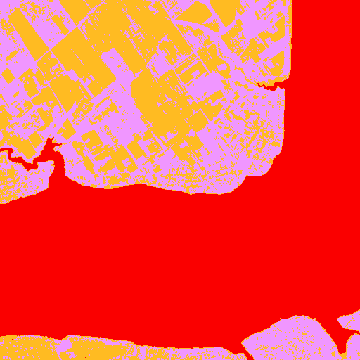 |
| Legend |  |
| JSON | [json](tile_2/watershed_ndvi_mask_gpt-4.1-mini-2025-04-14_vlm_categories.json) |

#### Per-class metrics

| Class Code | Class Name (EN) | IoU | Precision | Recall | F1 | Pixel Acc | Support True | Support Pred |
|------------|----------------|-----|-----------|--------|----|-----------|-------------|-------------|
| 10 | Tree cover | 0.0000 | 0.0000 | 0.0000 | 0.0000 |  |  |  |
| 20 | Shrubland | 0.0000 | 0.0000 | 0.0000 | 0.0000 |  |  |  |
| 30 | Grassland | 0.0000 | 0.0000 | 0.0000 | 0.0000 |  |  |  |
| 40 | Cropland | 0.2851 | 0.4944 | 0.4024 | 0.4437 |  |  |  |
| 50 | Built-up | 0.0008 | 0.0009 | 0.0124 | 0.0017 |  |  |  |
| 60 | Bare / sparse vegetation | 0.0000 | 0.0000 | 0.0000 | 0.0000 |  |  |  |
| 80 | Permanent water bodies | 0.0000 | 0.0000 | 0.0000 | 0.0000 |  |  |  |
| 90 | Herbaceous wetland | 0.0000 | 0.0000 | 0.0000 | 0.0000 |  |  |  |

### watershed_ndvi  gpt-4o-2024-08-06
| Metric | Value |
|--------|-------|
| accuracy | 0.0428 |
| iou | 0.0236 |
| f1 | 0.0408 |
| kappa | -0.1362 |
| Mask |  |
| Legend |  |
| JSON | [json](tile_2/watershed_ndvi_mask_gpt-4o-2024-08-06_vlm_categories.json) |

#### Per-class metrics

| Class Code | Class Name (EN) | IoU | Precision | Recall | F1 | Pixel Acc | Support True | Support Pred |
|------------|----------------|-----|-----------|--------|----|-----------|-------------|-------------|
| 10 | Tree cover | 0.1615 | 0.1707 | 0.7484 | 0.2780 |  |  |  |
| 30 | Grassland | 0.0000 | 0.0000 | 0.0000 | 0.0000 |  |  |  |
| 40 | Cropland | 0.0000 | 0.0000 | 0.0000 | 0.0000 |  |  |  |
| 50 | Built-up | 0.0008 | 0.0009 | 0.0124 | 0.0017 |  |  |  |
| 60 | Bare / sparse vegetation | 0.0000 | 0.0000 | 0.0000 | 0.0000 |  |  |  |
| 80 | Permanent water bodies | 0.0030 | 0.0096 | 0.0043 | 0.0059 |  |  |  |
| 90 | Herbaceous wetland | 0.0000 | 0.0000 | 0.0000 | 0.0000 |  |  |  |

### watershed_ndvi  gpt-4o-mini-2024-07-18
| Metric | Value |
|--------|-------|
| accuracy | 0.0675 |
| iou | 0.0360 |
| f1 | 0.0579 |
| kappa | -0.1186 |
| Mask |  |
| Legend |  |
| JSON | [json](tile_2/watershed_ndvi_mask_gpt-4o-mini-2024-07-18_vlm_categories.json) |

#### Per-class metrics

| Class Code | Class Name (EN) | IoU | Precision | Recall | F1 | Pixel Acc | Support True | Support Pred |
|------------|----------------|-----|-----------|--------|----|-----------|-------------|-------------|
| 10 | Tree cover | 0.0000 | 0.0000 | 0.0000 | 0.0000 |  |  |  |
| 30 | Grassland | 0.2480 | 0.2759 | 0.7105 | 0.3975 |  |  |  |
| 40 | Cropland | 0.0000 | 0.0000 | 0.0000 | 0.0000 |  |  |  |
| 50 | Built-up | 0.0008 | 0.0009 | 0.0124 | 0.0017 |  |  |  |
| 60 | Bare / sparse vegetation | 0.0000 | 0.0000 | 0.0000 | 0.0000 |  |  |  |
| 80 | Permanent water bodies | 0.0030 | 0.0096 | 0.0043 | 0.0059 |  |  |  |
| 90 | Herbaceous wetland | 0.0000 | 0.0000 | 0.0000 | 0.0000 |  |  |  |

### watershed_ndvi  grok-2-vision-1212
| Metric | Value |
|--------|-------|
| accuracy | 0.5372 |
| iou | 0.1291 |
| f1 | 0.1355 |
| kappa | 0.3494 |
| Mask |  |
| Legend |  |
| JSON | [json](tile_2/watershed_ndvi_mask_grok-2-vision-1212_vlm_categories.json) |

#### Per-class metrics

| Class Code | Class Name (EN) | IoU | Precision | Recall | F1 | Pixel Acc | Support True | Support Pred |
|------------|----------------|-----|-----------|--------|----|-----------|-------------|-------------|
| 0 | Unknown | 0.0000 | 0.0000 | 0.0000 | 0.0000 |  |  |  |
| 10 | Tree cover | 0.0000 | 0.0000 | 0.0000 | 0.0000 |  |  |  |
| 30 | Grassland | 0.0000 | 0.0000 | 0.0000 | 0.0000 |  |  |  |
| 40 | Cropland | 0.0000 | 0.0000 | 0.0000 | 0.0000 |  |  |  |
| 50 | Built-up | 0.0479 | 0.0532 | 0.3242 | 0.0913 |  |  |  |
| 60 | Bare / sparse vegetation | 0.0000 | 0.0000 | 0.0000 | 0.0000 |  |  |  |
| 80 | Permanent water bodies | 0.9848 | 0.9912 | 0.9935 | 0.9924 |  |  |  |
| 90 | Herbaceous wetland | 0.0000 | 0.0000 | 0.0000 | 0.0000 |  |  |  |

### watershed_ndvi  o4-mini
| Metric | Value |
|--------|-------|
| accuracy | 0.5475 |
| iou | 0.1528 |
| f1 | 0.1650 |
| kappa | 0.3525 |
| Mask |  |
| Legend |  |
| JSON | [json](tile_2/watershed_ndvi_mask_o4-mini_vlm_categories.json) |

#### Per-class metrics

| Class Code | Class Name (EN) | IoU | Precision | Recall | F1 | Pixel Acc | Support True | Support Pred |
|------------|----------------|-----|-----------|--------|----|-----------|-------------|-------------|
| 10 | Tree cover | 0.0370 | 0.0438 | 0.1931 | 0.0714 |  |  |  |
| 30 | Grassland | 0.0000 | 0.0000 | 0.0000 | 0.0000 |  |  |  |
| 40 | Cropland | 0.0000 | 0.0000 | 0.0000 | 0.0000 |  |  |  |
| 50 | Built-up | 0.0479 | 0.0532 | 0.3242 | 0.0913 |  |  |  |
| 60 | Bare / sparse vegetation | 0.0000 | 0.0000 | 0.0000 | 0.0000 |  |  |  |
| 80 | Permanent water bodies | 0.9848 | 0.9912 | 0.9935 | 0.9924 |  |  |  |
| 90 | Herbaceous wetland | 0.0000 | 0.0000 | 0.0000 | 0.0000 |  |  |  |

---

## Tile 3
### Source Images
| Type | Image |
|------|-------|
| TCI (RGB) |  |
| WorldCover Ground Truth |  |

### kmeans  Segmentation Masks
| Type | Image |
|------|-------|
| Segmentation Mask |  |

### som  Segmentation Masks
| Type | Image |
|------|-------|
| Segmentation Mask |  |

### unet  Segmentation Masks
| Type | Image |
|------|-------|
| Segmentation Mask |  |

### watershed_kmeans  Segmentation Masks
| Type | Image |
|------|-------|
| Segmentation Mask |  |

### watershed_ndvi  Segmentation Masks
| Type | Image |
|------|-------|
| Segmentation Mask |  |

### kmeans  claude-3-5-haiku-20241022
| Metric | Value |
|--------|-------|
| accuracy | 0.0325 |
| iou | 0.0115 |
| f1 | 0.0217 |
| kappa | -0.1045 |
| Mask |  |
| Legend |  |
| JSON | [json](tile_3/kmeans_mask_claude-3-5-haiku-20241022_vlm_categories.json) |

#### Per-class metrics

| Class Code | Class Name (EN) | IoU | Precision | Recall | F1 | Pixel Acc | Support True | Support Pred |
|------------|----------------|-----|-----------|--------|----|-----------|-------------|-------------|
| 10 | Tree cover | 0.0145 | 0.0662 | 0.0182 | 0.0286 |  |  |  |
| 30 | Grassland | 0.0659 | 0.1882 | 0.0920 | 0.1236 |  |  |  |
| 40 | Cropland | 0.0000 | 0.0000 | 0.0000 | 0.0000 |  |  |  |
| 50 | Built-up | 0.0000 | 0.0000 | 0.0000 | 0.0000 |  |  |  |
| 60 | Bare / sparse vegetation | 0.0000 | 0.0000 | 0.0000 | 0.0000 |  |  |  |
| 80 | Permanent water bodies | 0.0000 | 0.0000 | 0.0000 | 0.0000 |  |  |  |
| 90 | Herbaceous wetland | 0.0000 | 0.0000 | 0.0000 | 0.0000 |  |  |  |

### kmeans  claude-3-5-sonnet-20240620
| Metric | Value |
|--------|-------|
| accuracy | 0.0156 |
| iou | 0.0078 |
| f1 | 0.0153 |
| kappa | -0.0952 |
| Mask |  |
| Legend |  |
| JSON | [json](tile_3/kmeans_mask_claude-3-5-sonnet-20240620_vlm_categories.json) |

#### Per-class metrics

| Class Code | Class Name (EN) | IoU | Precision | Recall | F1 | Pixel Acc | Support True | Support Pred |
|------------|----------------|-----|-----------|--------|----|-----------|-------------|-------------|
| 10 | Tree cover | 0.0145 | 0.0662 | 0.0182 | 0.0286 |  |  |  |
| 30 | Grassland | 0.0000 | 0.0000 | 0.0000 | 0.0000 |  |  |  |
| 40 | Cropland | 0.0000 | 0.0000 | 0.0000 | 0.0000 |  |  |  |
| 50 | Built-up | 0.0111 | 0.0135 | 0.0585 | 0.0219 |  |  |  |
| 60 | Bare / sparse vegetation | 0.0000 | 0.0000 | 0.0000 | 0.0000 |  |  |  |
| 80 | Permanent water bodies | 0.0000 | 0.0000 | 0.0000 | 0.0000 |  |  |  |
| 90 | Herbaceous wetland | 0.0292 | 0.0655 | 0.0501 | 0.0568 |  |  |  |

### kmeans  claude-3-7-sonnet-20250219
| Metric | Value |
|--------|-------|
| accuracy | 0.0293 |
| iou | 0.0309 |
| f1 | 0.0532 |
| kappa | -0.0235 |
| Mask |  |
| Legend |  |
| JSON | [json](tile_3/kmeans_mask_claude-3-7-sonnet-20250219_vlm_categories.json) |

#### Per-class metrics

| Class Code | Class Name (EN) | IoU | Precision | Recall | F1 | Pixel Acc | Support True | Support Pred |
|------------|----------------|-----|-----------|--------|----|-----------|-------------|-------------|
| 10 | Tree cover | 0.0000 | 0.0000 | 0.0000 | 0.0000 |  |  |  |
| 30 | Grassland | 0.0000 | 0.0000 | 0.0000 | 0.0000 |  |  |  |
| 40 | Cropland | 0.0000 | 0.0000 | 0.0000 | 0.0000 |  |  |  |
| 50 | Built-up | 0.1872 | 0.1988 | 0.7616 | 0.3153 |  |  |  |
| 60 | Bare / sparse vegetation | 0.0000 | 0.0000 | 0.0000 | 0.0000 |  |  |  |
| 80 | Permanent water bodies | 0.0000 | 0.0000 | 0.0000 | 0.0000 |  |  |  |
| 90 | Herbaceous wetland | 0.0292 | 0.0655 | 0.0501 | 0.0568 |  |  |  |

### kmeans  gemini-2.5-pro-preview-05-06
| Metric | Value |
|--------|-------|
| accuracy | 0.2463 |
| iou | 0.1902 |
| f1 | 0.2459 |
| kappa | 0.1192 |
| Mask | 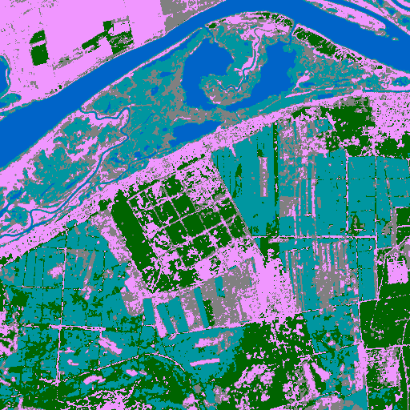 |
| Legend |  |
| JSON | [json](tile_3/kmeans_mask_gemini-2.5-pro-preview-05-06_vlm_categories.json) |

#### Per-class metrics

| Class Code | Class Name (EN) | IoU | Precision | Recall | F1 | Pixel Acc | Support True | Support Pred |
|------------|----------------|-----|-----------|--------|----|-----------|-------------|-------------|
| 10 | Tree cover | 0.0690 | 0.1998 | 0.0953 | 0.1290 |  |  |  |
| 30 | Grassland | 0.0000 | 0.0000 | 0.0000 | 0.0000 |  |  |  |
| 40 | Cropland | 0.1866 | 0.1977 | 0.7696 | 0.3145 |  |  |  |
| 50 | Built-up | 0.0000 | 0.0000 | 0.0000 | 0.0000 |  |  |  |
| 60 | Bare / sparse vegetation | 0.0000 | 0.0000 | 0.0000 | 0.0000 |  |  |  |
| 80 | Permanent water bodies | 0.8634 | 0.9152 | 0.9384 | 0.9267 |  |  |  |
| 90 | Herbaceous wetland | 0.2127 | 0.2510 | 0.5823 | 0.3508 |  |  |  |

### kmeans  gpt-4.1-2025-04-14
| Metric | Value |
|--------|-------|
| accuracy | 0.0761 |
| iou | 0.0236 |
| f1 | 0.0412 |
| kappa | -0.0260 |
| Mask |  |
| Legend |  |
| JSON | [json](tile_3/kmeans_mask_gpt-4.1-2025-04-14_vlm_categories.json) |

#### Per-class metrics

| Class Code | Class Name (EN) | IoU | Precision | Recall | F1 | Pixel Acc | Support True | Support Pred |
|------------|----------------|-----|-----------|--------|----|-----------|-------------|-------------|
| 10 | Tree cover | 0.1538 | 0.5614 | 0.1749 | 0.2667 |  |  |  |
| 30 | Grassland | 0.0000 | 0.0000 | 0.0000 | 0.0000 |  |  |  |
| 40 | Cropland | 0.0000 | 0.0000 | 0.0000 | 0.0000 |  |  |  |
| 50 | Built-up | 0.0109 | 0.0127 | 0.0723 | 0.0216 |  |  |  |
| 60 | Bare / sparse vegetation | 0.0000 | 0.0000 | 0.0000 | 0.0000 |  |  |  |
| 80 | Permanent water bodies | 0.0000 | 0.0000 | 0.0000 | 0.0000 |  |  |  |
| 90 | Herbaceous wetland | 0.0001 | 0.0002 | 0.0002 | 0.0002 |  |  |  |

### kmeans  gpt-4.1-mini-2025-04-14
| Metric | Value |
|--------|-------|
| accuracy | 0.0104 |
| iou | 0.0061 |
| f1 | 0.0120 |
| kappa | -0.0872 |
| Mask |  |
| Legend |  |
| JSON | [json](tile_3/kmeans_mask_gpt-4.1-mini-2025-04-14_vlm_categories.json) |

#### Per-class metrics

| Class Code | Class Name (EN) | IoU | Precision | Recall | F1 | Pixel Acc | Support True | Support Pred |
|------------|----------------|-----|-----------|--------|----|-----------|-------------|-------------|
| 10 | Tree cover | 0.0010 | 0.0053 | 0.0012 | 0.0019 |  |  |  |
| 30 | Grassland | 0.0000 | 0.0000 | 0.0000 | 0.0000 |  |  |  |
| 40 | Cropland | 0.0000 | 0.0000 | 0.0000 | 0.0000 |  |  |  |
| 50 | Built-up | 0.0109 | 0.0127 | 0.0723 | 0.0216 |  |  |  |
| 60 | Bare / sparse vegetation | 0.0000 | 0.0000 | 0.0426 | 0.0001 |  |  |  |
| 80 | Permanent water bodies | 0.0000 | 0.0001 | 0.0001 | 0.0001 |  |  |  |
| 90 | Herbaceous wetland | 0.0311 | 0.0581 | 0.0625 | 0.0602 |  |  |  |

### kmeans  gpt-4o-2024-08-06
| Metric | Value |
|--------|-------|
| accuracy | 0.0165 |
| iou | 0.0069 |
| f1 | 0.0135 |
| kappa | -0.1484 |
| Mask |  |
| Legend |  |
| JSON | [json](tile_3/kmeans_mask_gpt-4o-2024-08-06_vlm_categories.json) |

#### Per-class metrics

| Class Code | Class Name (EN) | IoU | Precision | Recall | F1 | Pixel Acc | Support True | Support Pred |
|------------|----------------|-----|-----------|--------|----|-----------|-------------|-------------|
| 10 | Tree cover | 0.0010 | 0.0053 | 0.0012 | 0.0019 |  |  |  |
| 20 | Shrubland | 0.0000 | 0.0000 | 0.0000 | 0.0000 |  |  |  |
| 30 | Grassland | 0.0108 | 0.0207 | 0.0219 | 0.0213 |  |  |  |
| 40 | Cropland | 0.0323 | 0.0412 | 0.1304 | 0.0626 |  |  |  |
| 50 | Built-up | 0.0111 | 0.0135 | 0.0585 | 0.0219 |  |  |  |
| 60 | Bare / sparse vegetation | 0.0000 | 0.0000 | 0.0000 | 0.0000 |  |  |  |
| 80 | Permanent water bodies | 0.0000 | 0.0001 | 0.0001 | 0.0001 |  |  |  |
| 90 | Herbaceous wetland | 0.0000 | 0.0000 | 0.0000 | 0.0000 |  |  |  |

### kmeans  gpt-4o-mini-2024-07-18
| Metric | Value |
|--------|-------|
| accuracy | 0.0425 |
| iou | 0.0100 |
| f1 | 0.0188 |
| kappa | -0.0723 |
| Mask |  |
| Legend |  |
| JSON | [json](tile_3/kmeans_mask_gpt-4o-mini-2024-07-18_vlm_categories.json) |

#### Per-class metrics

| Class Code | Class Name (EN) | IoU | Precision | Recall | F1 | Pixel Acc | Support True | Support Pred |
|------------|----------------|-----|-----------|--------|----|-----------|-------------|-------------|
| 10 | Tree cover | 0.0690 | 0.1998 | 0.0953 | 0.1290 |  |  |  |
| 20 | Shrubland | 0.0000 | 0.0000 | 0.0000 | 0.0000 |  |  |  |
| 30 | Grassland | 0.0000 | 0.0000 | 0.0000 | 0.0000 |  |  |  |
| 40 | Cropland | 0.0000 | 0.0000 | 0.0000 | 0.0000 |  |  |  |
| 50 | Built-up | 0.0109 | 0.0127 | 0.0723 | 0.0216 |  |  |  |
| 60 | Bare / sparse vegetation | 0.0000 | 0.0000 | 0.0000 | 0.0000 |  |  |  |
| 80 | Permanent water bodies | 0.0000 | 0.0001 | 0.0001 | 0.0001 |  |  |  |
| 90 | Herbaceous wetland | 0.0000 | 0.0000 | 0.0000 | 0.0000 |  |  |  |

### kmeans  grok-2-vision-1212
| Metric | Value |
|--------|-------|
| accuracy | 0.0000 |
| iou | 0.0000 |
| f1 | 0.0000 |
| kappa | -0.0188 |
| Mask |  |
| Legend |  |
| JSON | [json](tile_3/kmeans_mask_grok-2-vision-1212_vlm_categories.json) |

#### Per-class metrics

| Class Code | Class Name (EN) | IoU | Precision | Recall | F1 | Pixel Acc | Support True | Support Pred |
|------------|----------------|-----|-----------|--------|----|-----------|-------------|-------------|
| 0 | Unknown | 0.0000 | 0.0000 | 0.0000 | 0.0000 |  |  |  |
| 10 | Tree cover | 0.0000 | 0.0000 | 0.0000 | 0.0000 |  |  |  |
| 30 | Grassland | 0.0000 | 0.0000 | 0.0000 | 0.0000 |  |  |  |
| 40 | Cropland | 0.0000 | 0.0000 | 0.0000 | 0.0000 |  |  |  |
| 50 | Built-up | 0.0000 | 0.0000 | 0.0000 | 0.0000 |  |  |  |
| 60 | Bare / sparse vegetation | 0.0000 | 0.0000 | 0.0000 | 0.0000 |  |  |  |
| 80 | Permanent water bodies | 0.0000 | 0.0000 | 0.0000 | 0.0000 |  |  |  |
| 90 | Herbaceous wetland | 0.0000 | 0.0000 | 0.0000 | 0.0000 |  |  |  |

### kmeans  o4-mini
| Metric | Value |
|--------|-------|
| accuracy | 0.1084 |
| iou | 0.0361 |
| f1 | 0.0649 |
| kappa | -0.0491 |
| Mask |  |
| Legend |  |
| JSON | [json](tile_3/kmeans_mask_o4-mini_vlm_categories.json) |

#### Per-class metrics

| Class Code | Class Name (EN) | IoU | Precision | Recall | F1 | Pixel Acc | Support True | Support Pred |
|------------|----------------|-----|-----------|--------|----|-----------|-------------|-------------|
| 10 | Tree cover | 0.1538 | 0.5614 | 0.1749 | 0.2667 |  |  |  |
| 30 | Grassland | 0.0682 | 0.1633 | 0.1048 | 0.1277 |  |  |  |
| 40 | Cropland | 0.0000 | 0.0000 | 0.0000 | 0.0000 |  |  |  |
| 50 | Built-up | 0.0000 | 0.0000 | 0.0000 | 0.0000 |  |  |  |
| 60 | Bare / sparse vegetation | 0.0015 | 0.0015 | 0.9574 | 0.0029 |  |  |  |
| 80 | Permanent water bodies | 0.0000 | 0.0000 | 0.0000 | 0.0000 |  |  |  |
| 90 | Herbaceous wetland | 0.0292 | 0.0655 | 0.0501 | 0.0568 |  |  |  |

### som  claude-3-5-haiku-20241022
| Metric | Value |
|--------|-------|
| accuracy | 0.1257 |
| iou | 0.0572 |
| f1 | 0.0980 |
| kappa | 0.0199 |
| Mask |  |
| Legend |  |
| JSON | [json](tile_3/som_mask_claude-3-5-haiku-20241022_vlm_categories.json) |

#### Per-class metrics

| Class Code | Class Name (EN) | IoU | Precision | Recall | F1 | Pixel Acc | Support True | Support Pred |
|------------|----------------|-----|-----------|--------|----|-----------|-------------|-------------|
| 10 | Tree cover | 0.0226 | 0.1219 | 0.0270 | 0.0442 |  |  |  |
| 30 | Grassland | 0.0839 | 0.3578 | 0.0988 | 0.1549 |  |  |  |
| 40 | Cropland | 0.0312 | 0.0374 | 0.1582 | 0.0605 |  |  |  |
| 50 | Built-up | 0.0146 | 0.0170 | 0.0938 | 0.0288 |  |  |  |
| 60 | Bare / sparse vegetation | 0.0000 | 0.0000 | 0.0213 | 0.0001 |  |  |  |
| 80 | Permanent water bodies | 0.2480 | 0.2624 | 0.8182 | 0.3974 |  |  |  |
| 90 | Herbaceous wetland | 0.0000 | 0.0000 | 0.0000 | 0.0000 |  |  |  |

### som  claude-3-5-sonnet-20240620
| Metric | Value |
|--------|-------|
| accuracy | 0.2095 |
| iou | 0.0649 |
| f1 | 0.1073 |
| kappa | 0.0529 |
| Mask |  |
| Legend |  |
| JSON | [json](tile_3/som_mask_claude-3-5-sonnet-20240620_vlm_categories.json) |

#### Per-class metrics

| Class Code | Class Name (EN) | IoU | Precision | Recall | F1 | Pixel Acc | Support True | Support Pred |
|------------|----------------|-----|-----------|--------|----|-----------|-------------|-------------|
| 10 | Tree cover | 0.2180 | 0.4599 | 0.2930 | 0.3579 |  |  |  |
| 20 | Shrubland | 0.0000 | 0.0000 | 0.0000 | 0.0000 |  |  |  |
| 30 | Grassland | 0.0000 | 0.0000 | 0.0000 | 0.0000 |  |  |  |
| 40 | Cropland | 0.0343 | 0.0457 | 0.1202 | 0.0662 |  |  |  |
| 50 | Built-up | 0.0108 | 0.0136 | 0.0493 | 0.0213 |  |  |  |
| 60 | Bare / sparse vegetation | 0.0000 | 0.0000 | 0.0000 | 0.0000 |  |  |  |
| 80 | Permanent water bodies | 0.2480 | 0.2624 | 0.8182 | 0.3974 |  |  |  |
| 90 | Herbaceous wetland | 0.0080 | 0.0183 | 0.0140 | 0.0158 |  |  |  |

### som  claude-3-7-sonnet-20250219
| Metric | Value |
|--------|-------|
| accuracy | 0.1136 |
| iou | 0.0618 |
| f1 | 0.1054 |
| kappa | 0.0287 |
| Mask |  |
| Legend |  |
| JSON | [json](tile_3/som_mask_claude-3-7-sonnet-20250219_vlm_categories.json) |

#### Per-class metrics

| Class Code | Class Name (EN) | IoU | Precision | Recall | F1 | Pixel Acc | Support True | Support Pred |
|------------|----------------|-----|-----------|--------|----|-----------|-------------|-------------|
| 10 | Tree cover | 0.0256 | 0.1667 | 0.0293 | 0.0499 |  |  |  |
| 30 | Grassland | 0.0000 | 0.0000 | 0.0000 | 0.0000 |  |  |  |
| 40 | Cropland | 0.1193 | 0.1791 | 0.2635 | 0.2132 |  |  |  |
| 50 | Built-up | 0.0108 | 0.0136 | 0.0493 | 0.0213 |  |  |  |
| 60 | Bare / sparse vegetation | 0.0000 | 0.0000 | 0.0426 | 0.0001 |  |  |  |
| 80 | Permanent water bodies | 0.2480 | 0.2624 | 0.8182 | 0.3974 |  |  |  |
| 90 | Herbaceous wetland | 0.0287 | 0.0483 | 0.0661 | 0.0558 |  |  |  |

### som  gemini-2.5-pro-preview-05-06
| Metric | Value |
|--------|-------|
| accuracy | 0.1093 |
| iou | 0.0659 |
| f1 | 0.1104 |
| kappa | 0.0448 |
| Mask |  |
| Legend |  |
| JSON | [json](tile_3/som_mask_gemini-2.5-pro-preview-05-06_vlm_categories.json) |

#### Per-class metrics

| Class Code | Class Name (EN) | IoU | Precision | Recall | F1 | Pixel Acc | Support True | Support Pred |
|------------|----------------|-----|-----------|--------|----|-----------|-------------|-------------|
| 10 | Tree cover | 0.0000 | 0.0000 | 0.0000 | 0.0000 |  |  |  |
| 30 | Grassland | 0.0000 | 0.0000 | 0.0000 | 0.0000 |  |  |  |
| 40 | Cropland | 0.0367 | 0.0406 | 0.2783 | 0.0709 |  |  |  |
| 50 | Built-up | 0.1686 | 0.2032 | 0.4975 | 0.2886 |  |  |  |
| 60 | Bare / sparse vegetation | 0.0000 | 0.0000 | 0.0213 | 0.0001 |  |  |  |
| 80 | Permanent water bodies | 0.2480 | 0.2624 | 0.8182 | 0.3974 |  |  |  |
| 90 | Herbaceous wetland | 0.0080 | 0.0183 | 0.0140 | 0.0158 |  |  |  |

### som  gpt-4.1-2025-04-14
| Metric | Value |
|--------|-------|
| accuracy | 0.1936 |
| iou | 0.1029 |
| f1 | 0.1762 |
| kappa | 0.0679 |
| Mask |  |
| Legend |  |
| JSON | [json](tile_3/som_mask_gpt-4.1-2025-04-14_vlm_categories.json) |

#### Per-class metrics

| Class Code | Class Name (EN) | IoU | Precision | Recall | F1 | Pixel Acc | Support True | Support Pred |
|------------|----------------|-----|-----------|--------|----|-----------|-------------|-------------|
| 10 | Tree cover | 0.1254 | 0.3926 | 0.1555 | 0.2228 |  |  |  |
| 30 | Grassland | 0.0590 | 0.1918 | 0.0786 | 0.1115 |  |  |  |
| 40 | Cropland | 0.1193 | 0.1791 | 0.2635 | 0.2132 |  |  |  |
| 50 | Built-up | 0.1686 | 0.2032 | 0.4975 | 0.2886 |  |  |  |
| 60 | Bare / sparse vegetation | 0.0000 | 0.0000 | 0.0426 | 0.0001 |  |  |  |
| 80 | Permanent water bodies | 0.2480 | 0.2624 | 0.8182 | 0.3974 |  |  |  |
| 90 | Herbaceous wetland | 0.0000 | 0.0000 | 0.0000 | 0.0000 |  |  |  |

### som  gpt-4.1-mini-2025-04-14
| Metric | Value |
|--------|-------|
| accuracy | 0.1036 |
| iou | 0.0359 |
| f1 | 0.0658 |
| kappa | -0.0231 |
| Mask |  |
| Legend |  |
| JSON | [json](tile_3/som_mask_gpt-4.1-mini-2025-04-14_vlm_categories.json) |

#### Per-class metrics

| Class Code | Class Name (EN) | IoU | Precision | Recall | F1 | Pixel Acc | Support True | Support Pred |
|------------|----------------|-----|-----------|--------|----|-----------|-------------|-------------|
| 10 | Tree cover | 0.1254 | 0.3926 | 0.1555 | 0.2228 |  |  |  |
| 30 | Grassland | 0.0839 | 0.3578 | 0.0988 | 0.1549 |  |  |  |
| 40 | Cropland | 0.0235 | 0.0281 | 0.1256 | 0.0459 |  |  |  |
| 50 | Built-up | 0.0108 | 0.0136 | 0.0493 | 0.0213 |  |  |  |
| 60 | Bare / sparse vegetation | 0.0000 | 0.0000 | 0.0426 | 0.0001 |  |  |  |
| 80 | Permanent water bodies | 0.0000 | 0.0000 | 0.0000 | 0.0000 |  |  |  |
| 90 | Herbaceous wetland | 0.0080 | 0.0183 | 0.0140 | 0.0158 |  |  |  |

### som  gpt-4o-2024-08-06
| Metric | Value |
|--------|-------|
| accuracy | 0.0000 |
| iou | 0.0000 |
| f1 | 0.0000 |
| kappa | 0.0000 |
| Mask |  |
| Legend |  |
| JSON | [json](tile_3/som_mask_gpt-4o-2024-08-06_vlm_categories.json) |

#### Per-class metrics

| Class Code | Class Name (EN) | IoU | Precision | Recall | F1 | Pixel Acc | Support True | Support Pred |
|------------|----------------|-----|-----------|--------|----|-----------|-------------|-------------|
| 0 | Unknown | 0.0000 | 0.0000 | 0.0000 | 0.0000 |  |  |  |
| 10 | Tree cover | 0.0000 | 0.0000 | 0.0000 | 0.0000 |  |  |  |
| 30 | Grassland | 0.0000 | 0.0000 | 0.0000 | 0.0000 |  |  |  |
| 40 | Cropland | 0.0000 | 0.0000 | 0.0000 | 0.0000 |  |  |  |
| 50 | Built-up | 0.0000 | 0.0000 | 0.0000 | 0.0000 |  |  |  |
| 60 | Bare / sparse vegetation | 0.0000 | 0.0000 | 0.0000 | 0.0000 |  |  |  |
| 80 | Permanent water bodies | 0.0000 | 0.0000 | 0.0000 | 0.0000 |  |  |  |
| 90 | Herbaceous wetland | 0.0000 | 0.0000 | 0.0000 | 0.0000 |  |  |  |

### som  gpt-4o-mini-2024-07-18
| Metric | Value |
|--------|-------|
| accuracy | 0.2245 |
| iou | 0.0789 |
| f1 | 0.1288 |
| kappa | 0.0857 |
| Mask |  |
| Legend |  |
| JSON | [json](tile_3/som_mask_gpt-4o-mini-2024-07-18_vlm_categories.json) |

#### Per-class metrics

| Class Code | Class Name (EN) | IoU | Precision | Recall | F1 | Pixel Acc | Support True | Support Pred |
|------------|----------------|-----|-----------|--------|----|-----------|-------------|-------------|
| 10 | Tree cover | 0.3131 | 0.5921 | 0.3992 | 0.4769 |  |  |  |
| 20 | Shrubland | 0.0000 | 0.0000 | 0.0000 | 0.0000 |  |  |  |
| 30 | Grassland | 0.0000 | 0.0000 | 0.0000 | 0.0000 |  |  |  |
| 40 | Cropland | 0.1193 | 0.1791 | 0.2635 | 0.2132 |  |  |  |
| 50 | Built-up | 0.0146 | 0.0170 | 0.0938 | 0.0288 |  |  |  |
| 60 | Bare / sparse vegetation | 0.0000 | 0.0000 | 0.0000 | 0.0000 |  |  |  |
| 80 | Permanent water bodies | 0.0007 | 0.0016 | 0.0013 | 0.0015 |  |  |  |
| 90 | Herbaceous wetland | 0.1832 | 0.3267 | 0.2944 | 0.3097 |  |  |  |

### som  grok-2-vision-1212
| Metric | Value |
|--------|-------|
| accuracy | 0.0748 |
| iou | 0.0310 |
| f1 | 0.0497 |
| kappa | 0.0500 |
| Mask |  |
| Legend |  |
| JSON | [json](tile_3/som_mask_grok-2-vision-1212_vlm_categories.json) |

#### Per-class metrics

| Class Code | Class Name (EN) | IoU | Precision | Recall | F1 | Pixel Acc | Support True | Support Pred |
|------------|----------------|-----|-----------|--------|----|-----------|-------------|-------------|
| 0 | Unknown | 0.0000 | 0.0000 | 0.0000 | 0.0000 |  |  |  |
| 10 | Tree cover | 0.0000 | 0.0000 | 0.0000 | 0.0000 |  |  |  |
| 30 | Grassland | 0.0000 | 0.0000 | 0.0000 | 0.0000 |  |  |  |
| 40 | Cropland | 0.0000 | 0.0000 | 0.0000 | 0.0000 |  |  |  |
| 50 | Built-up | 0.0000 | 0.0000 | 0.0000 | 0.0000 |  |  |  |
| 60 | Bare / sparse vegetation | 0.0000 | 0.0000 | 0.0000 | 0.0000 |  |  |  |
| 80 | Permanent water bodies | 0.2480 | 0.2624 | 0.8182 | 0.3974 |  |  |  |
| 90 | Herbaceous wetland | 0.0000 | 0.0000 | 0.0000 | 0.0000 |  |  |  |

### som  o4-mini
| Metric | Value |
|--------|-------|
| accuracy | 0.2437 |
| iou | 0.0624 |
| f1 | 0.1015 |
| kappa | 0.0464 |
| Mask |  |
| Legend |  |
| JSON | [json](tile_3/som_mask_o4-mini_vlm_categories.json) |

#### Per-class metrics

| Class Code | Class Name (EN) | IoU | Precision | Recall | F1 | Pixel Acc | Support True | Support Pred |
|------------|----------------|-----|-----------|--------|----|-----------|-------------|-------------|
| 10 | Tree cover | 0.3131 | 0.5921 | 0.3992 | 0.4769 |  |  |  |
| 20 | Shrubland | 0.0000 | 0.0000 | 0.0000 | 0.0000 |  |  |  |
| 30 | Grassland | 0.1390 | 0.2441 | 0.2441 | 0.2441 |  |  |  |
| 40 | Cropland | 0.0343 | 0.0457 | 0.1202 | 0.0662 |  |  |  |
| 50 | Built-up | 0.0108 | 0.0136 | 0.0493 | 0.0213 |  |  |  |
| 60 | Bare / sparse vegetation | 0.0017 | 0.0017 | 0.7234 | 0.0035 |  |  |  |
| 80 | Permanent water bodies | 0.0000 | 0.0000 | 0.0000 | 0.0000 |  |  |  |
| 90 | Herbaceous wetland | 0.0000 | 0.0000 | 0.0000 | 0.0000 |  |  |  |

### unet  claude-3-5-haiku-20241022
| Metric | Value |
|--------|-------|
| accuracy | 0.2329 |
| iou | 0.0788 |
| f1 | 0.1220 |
| kappa | 0.0377 |
| Mask |  |
| Legend |  |
| JSON | [json](tile_3/unet_mask_claude-3-5-haiku-20241022_vlm_categories.json) |

#### Per-class metrics

| Class Code | Class Name (EN) | IoU | Precision | Recall | F1 | Pixel Acc | Support True | Support Pred |
|------------|----------------|-----|-----------|--------|----|-----------|-------------|-------------|
| 10 | Tree cover | 0.3850 | 0.6742 | 0.4730 | 0.5559 |  |  |  |
| 30 | Grassland | 0.0251 | 0.0586 | 0.0419 | 0.0489 |  |  |  |
| 40 | Cropland | 0.0017 | 0.0028 | 0.0041 | 0.0033 |  |  |  |
| 50 | Built-up | 0.1380 | 0.1466 | 0.7002 | 0.2425 |  |  |  |
| 60 | Bare / sparse vegetation | 0.0016 | 0.0016 | 0.9362 | 0.0032 |  |  |  |
| 80 | Permanent water bodies | 0.0000 | 0.0000 | 0.0000 | 0.0000 |  |  |  |
| 90 | Herbaceous wetland | 0.0000 | 0.0000 | 0.0000 | 0.0000 |  |  |  |

### unet  claude-3-5-sonnet-20240620
| Metric | Value |
|--------|-------|
| accuracy | 0.0446 |
| iou | 0.0180 |
| f1 | 0.0344 |
| kappa | -0.0833 |
| Mask |  |
| Legend |  |
| JSON | [json](tile_3/unet_mask_claude-3-5-sonnet-20240620_vlm_categories.json) |

#### Per-class metrics

| Class Code | Class Name (EN) | IoU | Precision | Recall | F1 | Pixel Acc | Support True | Support Pred |
|------------|----------------|-----|-----------|--------|----|-----------|-------------|-------------|
| 10 | Tree cover | 0.0570 | 0.2108 | 0.0724 | 0.1078 |  |  |  |
| 30 | Grassland | 0.0000 | 0.0000 | 0.0000 | 0.0000 |  |  |  |
| 40 | Cropland | 0.0017 | 0.0028 | 0.0041 | 0.0033 |  |  |  |
| 50 | Built-up | 0.0478 | 0.0587 | 0.2049 | 0.0912 |  |  |  |
| 60 | Bare / sparse vegetation | 0.0000 | 0.0000 | 0.0000 | 0.0000 |  |  |  |
| 80 | Permanent water bodies | 0.0196 | 0.0252 | 0.0817 | 0.0385 |  |  |  |
| 90 | Herbaceous wetland | 0.0001 | 0.0001 | 0.0002 | 0.0001 |  |  |  |

### unet  claude-3-7-sonnet-20250219
| Metric | Value |
|--------|-------|
| accuracy | 0.1219 |
| iou | 0.0517 |
| f1 | 0.0857 |
| kappa | 0.0402 |
| Mask |  |
| Legend |  |
| JSON | [json](tile_3/unet_mask_claude-3-7-sonnet-20250219_vlm_categories.json) |

#### Per-class metrics

| Class Code | Class Name (EN) | IoU | Precision | Recall | F1 | Pixel Acc | Support True | Support Pred |
|------------|----------------|-----|-----------|--------|----|-----------|-------------|-------------|
| 10 | Tree cover | 0.0000 | 0.0000 | 0.0000 | 0.0000 |  |  |  |
| 20 | Shrubland | 0.0000 | 0.0000 | 0.0000 | 0.0000 |  |  |  |
| 30 | Grassland | 0.2687 | 0.7492 | 0.2953 | 0.4236 |  |  |  |
| 40 | Cropland | 0.0017 | 0.0028 | 0.0041 | 0.0033 |  |  |  |
| 50 | Built-up | 0.0000 | 0.0000 | 0.0000 | 0.0000 |  |  |  |
| 60 | Bare / sparse vegetation | 0.0001 | 0.0001 | 0.0638 | 0.0002 |  |  |  |
| 80 | Permanent water bodies | 0.0196 | 0.0252 | 0.0817 | 0.0385 |  |  |  |
| 90 | Herbaceous wetland | 0.1236 | 0.1799 | 0.2833 | 0.2200 |  |  |  |

### unet  gemini-2.5-pro-preview-05-06
| Metric | Value |
|--------|-------|
| accuracy | 0.0313 |
| iou | 0.0098 |
| f1 | 0.0190 |
| kappa | -0.0380 |
| Mask |  |
| Legend |  |
| JSON | [json](tile_3/unet_mask_gemini-2.5-pro-preview-05-06_vlm_categories.json) |

#### Per-class metrics

| Class Code | Class Name (EN) | IoU | Precision | Recall | F1 | Pixel Acc | Support True | Support Pred |
|------------|----------------|-----|-----------|--------|----|-----------|-------------|-------------|
| 10 | Tree cover | 0.0000 | 0.0000 | 0.0000 | 0.0000 |  |  |  |
| 30 | Grassland | 0.0000 | 0.0000 | 0.0000 | 0.0000 |  |  |  |
| 40 | Cropland | 0.0423 | 0.0451 | 0.4038 | 0.0812 |  |  |  |
| 50 | Built-up | 0.0005 | 0.0006 | 0.0038 | 0.0010 |  |  |  |
| 60 | Bare / sparse vegetation | 0.0000 | 0.0000 | 0.0000 | 0.0000 |  |  |  |
| 80 | Permanent water bodies | 0.0002 | 0.0003 | 0.0005 | 0.0004 |  |  |  |
| 90 | Herbaceous wetland | 0.0257 | 0.0584 | 0.0440 | 0.0502 |  |  |  |

### unet  gpt-4.1-2025-04-14
| Metric | Value |
|--------|-------|
| accuracy | 0.2582 |
| iou | 0.1594 |
| f1 | 0.1949 |
| kappa | 0.0836 |
| Mask |  |
| Legend |  |
| JSON | [json](tile_3/unet_mask_gpt-4.1-2025-04-14_vlm_categories.json) |

#### Per-class metrics

| Class Code | Class Name (EN) | IoU | Precision | Recall | F1 | Pixel Acc | Support True | Support Pred |
|------------|----------------|-----|-----------|--------|----|-----------|-------------|-------------|
| 10 | Tree cover | 0.2988 | 0.5178 | 0.4140 | 0.4601 |  |  |  |
| 30 | Grassland | 0.0000 | 0.0000 | 0.0000 | 0.0000 |  |  |  |
| 40 | Cropland | 0.0019 | 0.0023 | 0.0105 | 0.0037 |  |  |  |
| 50 | Built-up | 0.0000 | 0.0000 | 0.0000 | 0.0000 |  |  |  |
| 60 | Bare / sparse vegetation | 0.0016 | 0.0016 | 0.9362 | 0.0032 |  |  |  |
| 80 | Permanent water bodies | 0.8136 | 0.8927 | 0.9018 | 0.8972 |  |  |  |
| 90 | Herbaceous wetland | 0.0001 | 0.0001 | 0.0002 | 0.0001 |  |  |  |

### unet  gpt-4.1-mini-2025-04-14
| Metric | Value |
|--------|-------|
| accuracy | 0.0019 |
| iou | 0.0007 |
| f1 | 0.0014 |
| kappa | -0.0806 |
| Mask |  |
| Legend |  |
| JSON | [json](tile_3/unet_mask_gpt-4.1-mini-2025-04-14_vlm_categories.json) |

#### Per-class metrics

| Class Code | Class Name (EN) | IoU | Precision | Recall | F1 | Pixel Acc | Support True | Support Pred |
|------------|----------------|-----|-----------|--------|----|-----------|-------------|-------------|
| 10 | Tree cover | 0.0015 | 0.0072 | 0.0018 | 0.0029 |  |  |  |
| 30 | Grassland | 0.0000 | 0.0000 | 0.0000 | 0.0000 |  |  |  |
| 40 | Cropland | 0.0032 | 0.0039 | 0.0175 | 0.0064 |  |  |  |
| 50 | Built-up | 0.0000 | 0.0000 | 0.0000 | 0.0000 |  |  |  |
| 60 | Bare / sparse vegetation | 0.0000 | 0.0000 | 0.0000 | 0.0000 |  |  |  |
| 80 | Permanent water bodies | 0.0002 | 0.0003 | 0.0005 | 0.0004 |  |  |  |
| 90 | Herbaceous wetland | 0.0000 | 0.0000 | 0.0000 | 0.0000 |  |  |  |

### unet  gpt-4o-2024-08-06
| Metric | Value |
|--------|-------|
| accuracy | 0.0000 |
| iou | 0.0000 |
| f1 | 0.0000 |
| kappa | 0.0000 |
| Mask |  |
| Legend |  |
| JSON | [json](tile_3/unet_mask_gpt-4o-2024-08-06_vlm_categories.json) |

#### Per-class metrics

| Class Code | Class Name (EN) | IoU | Precision | Recall | F1 | Pixel Acc | Support True | Support Pred |
|------------|----------------|-----|-----------|--------|----|-----------|-------------|-------------|
| 0 | Unknown | 0.0000 | 0.0000 | 0.0000 | 0.0000 |  |  |  |
| 10 | Tree cover | 0.0000 | 0.0000 | 0.0000 | 0.0000 |  |  |  |
| 30 | Grassland | 0.0000 | 0.0000 | 0.0000 | 0.0000 |  |  |  |
| 40 | Cropland | 0.0000 | 0.0000 | 0.0000 | 0.0000 |  |  |  |
| 50 | Built-up | 0.0000 | 0.0000 | 0.0000 | 0.0000 |  |  |  |
| 60 | Bare / sparse vegetation | 0.0000 | 0.0000 | 0.0000 | 0.0000 |  |  |  |
| 80 | Permanent water bodies | 0.0000 | 0.0000 | 0.0000 | 0.0000 |  |  |  |
| 90 | Herbaceous wetland | 0.0000 | 0.0000 | 0.0000 | 0.0000 |  |  |  |

### unet  gpt-4o-mini-2024-07-18
| Metric | Value |
|--------|-------|
| accuracy | 0.2003 |
| iou | 0.0484 |
| f1 | 0.0700 |
| kappa | 0.0627 |
| Mask |  |
| Legend |  |
| JSON | [json](tile_3/unet_mask_gpt-4o-mini-2024-07-18_vlm_categories.json) |

#### Per-class metrics

| Class Code | Class Name (EN) | IoU | Precision | Recall | F1 | Pixel Acc | Support True | Support Pred |
|------------|----------------|-----|-----------|--------|----|-----------|-------------|-------------|
| 10 | Tree cover | 0.3850 | 0.6742 | 0.4730 | 0.5559 |  |  |  |
| 20 | Shrubland | 0.0000 | 0.0000 | 0.0000 | 0.0000 |  |  |  |
| 30 | Grassland | 0.0000 | 0.0000 | 0.0000 | 0.0000 |  |  |  |
| 40 | Cropland | 0.0017 | 0.0028 | 0.0041 | 0.0033 |  |  |  |
| 50 | Built-up | 0.0005 | 0.0006 | 0.0038 | 0.0010 |  |  |  |
| 60 | Bare / sparse vegetation | 0.0000 | 0.0000 | 0.0000 | 0.0000 |  |  |  |
| 80 | Permanent water bodies | 0.0000 | 0.0000 | 0.0000 | 0.0000 |  |  |  |
| 90 | Herbaceous wetland | 0.0000 | 0.0000 | 0.0000 | 0.0000 |  |  |  |

### unet  grok-2-vision-1212
| Metric | Value |
|--------|-------|
| accuracy | 0.0331 |
| iou | 0.0092 |
| f1 | 0.0174 |
| kappa | -0.0996 |
| Mask |  |
| Legend |  |
| JSON | [json](tile_3/unet_mask_grok-2-vision-1212_vlm_categories.json) |

#### Per-class metrics

| Class Code | Class Name (EN) | IoU | Precision | Recall | F1 | Pixel Acc | Support True | Support Pred |
|------------|----------------|-----|-----------|--------|----|-----------|-------------|-------------|
| 10 | Tree cover | 0.0570 | 0.2108 | 0.0724 | 0.1078 |  |  |  |
| 30 | Grassland | 0.0048 | 0.0186 | 0.0064 | 0.0095 |  |  |  |
| 40 | Cropland | 0.0019 | 0.0023 | 0.0105 | 0.0037 |  |  |  |
| 50 | Built-up | 0.0005 | 0.0006 | 0.0038 | 0.0010 |  |  |  |
| 60 | Bare / sparse vegetation | 0.0000 | 0.0000 | 0.0000 | 0.0000 |  |  |  |
| 80 | Permanent water bodies | 0.0000 | 0.0000 | 0.0000 | 0.0000 |  |  |  |
| 90 | Herbaceous wetland | 0.0000 | 0.0000 | 0.0000 | 0.0000 |  |  |  |

### unet  o4-mini
| Metric | Value |
|--------|-------|
| accuracy | 0.0098 |
| iou | 0.0039 |
| f1 | 0.0078 |
| kappa | -0.1021 |
| Mask |  |
| Legend |  |
| JSON | [json](tile_3/unet_mask_o4-mini_vlm_categories.json) |

#### Per-class metrics

| Class Code | Class Name (EN) | IoU | Precision | Recall | F1 | Pixel Acc | Support True | Support Pred |
|------------|----------------|-----|-----------|--------|----|-----------|-------------|-------------|
| 10 | Tree cover | 0.0015 | 0.0072 | 0.0018 | 0.0029 |  |  |  |
| 30 | Grassland | 0.0000 | 0.0000 | 0.0000 | 0.0000 |  |  |  |
| 40 | Cropland | 0.0017 | 0.0028 | 0.0041 | 0.0033 |  |  |  |
| 50 | Built-up | 0.0005 | 0.0006 | 0.0038 | 0.0010 |  |  |  |
| 60 | Bare / sparse vegetation | 0.0000 | 0.0000 | 0.0000 | 0.0000 |  |  |  |
| 80 | Permanent water bodies | 0.0196 | 0.0252 | 0.0817 | 0.0385 |  |  |  |
| 90 | Herbaceous wetland | 0.0043 | 0.0079 | 0.0094 | 0.0086 |  |  |  |

### watershed_kmeans  claude-3-5-haiku-20241022
| Metric | Value |
|--------|-------|
| accuracy | 0.1029 |
| iou | 0.0458 |
| f1 | 0.0801 |
| kappa | 0.0411 |
| Mask |  |
| Legend |  |
| JSON | [json](tile_3/watershed_kmeans_mask_claude-3-5-haiku-20241022_vlm_categories.json) |

#### Per-class metrics

| Class Code | Class Name (EN) | IoU | Precision | Recall | F1 | Pixel Acc | Support True | Support Pred |
|------------|----------------|-----|-----------|--------|----|-----------|-------------|-------------|
| 0 | Unknown | 0.0000 | 0.0000 | 0.0000 | 0.0000 |  |  |  |
| 10 | Tree cover | 0.0668 | 0.5037 | 0.0715 | 0.1253 |  |  |  |
| 30 | Grassland | 0.1968 | 0.5778 | 0.2298 | 0.3289 |  |  |  |
| 40 | Cropland | 0.1030 | 0.2086 | 0.1691 | 0.1868 |  |  |  |
| 50 | Built-up | 0.0001 | 0.0001 | 0.0006 | 0.0001 |  |  |  |
| 60 | Bare / sparse vegetation | 0.0000 | 0.0000 | 0.0000 | 0.0000 |  |  |  |
| 80 | Permanent water bodies | 0.0000 | 0.0000 | 0.0000 | 0.0000 |  |  |  |
| 90 | Herbaceous wetland | 0.0000 | 0.0000 | 0.0000 | 0.0000 |  |  |  |

### watershed_kmeans  claude-3-5-sonnet-20240620
| Metric | Value |
|--------|-------|
| accuracy | 0.0930 |
| iou | 0.0438 |
| f1 | 0.0768 |
| kappa | -0.0028 |
| Mask |  |
| Legend |  |
| JSON | [json](tile_3/watershed_kmeans_mask_claude-3-5-sonnet-20240620_vlm_categories.json) |

#### Per-class metrics

| Class Code | Class Name (EN) | IoU | Precision | Recall | F1 | Pixel Acc | Support True | Support Pred |
|------------|----------------|-----|-----------|--------|----|-----------|-------------|-------------|
| 10 | Tree cover | 0.0032 | 0.0292 | 0.0036 | 0.0064 |  |  |  |
| 20 | Shrubland | 0.0000 | 0.0000 | 0.0000 | 0.0000 |  |  |  |
| 30 | Grassland | 0.1056 | 0.3658 | 0.1292 | 0.1910 |  |  |  |
| 40 | Cropland | 0.0017 | 0.0020 | 0.0109 | 0.0034 |  |  |  |
| 50 | Built-up | 0.0468 | 0.0574 | 0.2024 | 0.0894 |  |  |  |
| 60 | Bare / sparse vegetation | 0.0000 | 0.0000 | 0.0000 | 0.0000 |  |  |  |
| 80 | Permanent water bodies | 0.0000 | 0.0000 | 0.0000 | 0.0000 |  |  |  |
| 90 | Herbaceous wetland | 0.1934 | 0.2693 | 0.4068 | 0.3241 |  |  |  |

### watershed_kmeans  claude-3-7-sonnet-20250219
| Metric | Value |
|--------|-------|
| accuracy | 0.1940 |
| iou | 0.0728 |
| f1 | 0.1174 |
| kappa | 0.0688 |
| Mask |  |
| Legend |  |
| JSON | [json](tile_3/watershed_kmeans_mask_claude-3-7-sonnet-20250219_vlm_categories.json) |

#### Per-class metrics

| Class Code | Class Name (EN) | IoU | Precision | Recall | F1 | Pixel Acc | Support True | Support Pred |
|------------|----------------|-----|-----------|--------|----|-----------|-------------|-------------|
| 0 | Unknown | 0.0000 | 0.0000 | 0.0000 | 0.0000 |  |  |  |
| 10 | Tree cover | 0.3442 | 0.7313 | 0.3941 | 0.5121 |  |  |  |
| 30 | Grassland | 0.0035 | 0.0134 | 0.0046 | 0.0069 |  |  |  |
| 40 | Cropland | 0.1054 | 0.1966 | 0.1852 | 0.1907 |  |  |  |
| 50 | Built-up | 0.1294 | 0.1512 | 0.4734 | 0.2292 |  |  |  |
| 60 | Bare / sparse vegetation | 0.0000 | 0.0000 | 0.0213 | 0.0001 |  |  |  |
| 80 | Permanent water bodies | 0.0000 | 0.0000 | 0.0000 | 0.0000 |  |  |  |
| 90 | Herbaceous wetland | 0.0000 | 0.0000 | 0.0000 | 0.0000 |  |  |  |

### watershed_kmeans  gemini-2.5-pro-preview-05-06
| Metric | Value |
|--------|-------|
| accuracy | 0.1862 |
| iou | 0.0670 |
| f1 | 0.1149 |
| kappa | 0.0610 |
| Mask |  |
| Legend |  |
| JSON | [json](tile_3/watershed_kmeans_mask_gemini-2.5-pro-preview-05-06_vlm_categories.json) |

#### Per-class metrics

| Class Code | Class Name (EN) | IoU | Precision | Recall | F1 | Pixel Acc | Support True | Support Pred |
|------------|----------------|-----|-----------|--------|----|-----------|-------------|-------------|
| 10 | Tree cover | 0.2189 | 0.8097 | 0.2308 | 0.3592 |  |  |  |
| 30 | Grassland | 0.0075 | 0.0293 | 0.0100 | 0.0149 |  |  |  |
| 40 | Cropland | 0.0854 | 0.0934 | 0.5006 | 0.1574 |  |  |  |
| 50 | Built-up | 0.0023 | 0.0034 | 0.0068 | 0.0046 |  |  |  |
| 60 | Bare / sparse vegetation | 0.0000 | 0.0000 | 0.0213 | 0.0001 |  |  |  |
| 80 | Permanent water bodies | 0.0000 | 0.0000 | 0.0000 | 0.0000 |  |  |  |
| 90 | Herbaceous wetland | 0.1550 | 0.1930 | 0.4406 | 0.2684 |  |  |  |

### watershed_kmeans  gpt-4.1-2025-04-14
| Metric | Value |
|--------|-------|
| accuracy | 0.0806 |
| iou | 0.0349 |
| f1 | 0.0608 |
| kappa | -0.0007 |
| Mask |  |
| Legend |  |
| JSON | [json](tile_3/watershed_kmeans_mask_gpt-4.1-2025-04-14_vlm_categories.json) |

#### Per-class metrics

| Class Code | Class Name (EN) | IoU | Precision | Recall | F1 | Pixel Acc | Support True | Support Pred |
|------------|----------------|-----|-----------|--------|----|-----------|-------------|-------------|
| 10 | Tree cover | 0.0032 | 0.0292 | 0.0036 | 0.0064 |  |  |  |
| 20 | Shrubland | 0.0000 | 0.0000 | 0.0000 | 0.0000 |  |  |  |
| 30 | Grassland | 0.1968 | 0.5778 | 0.2298 | 0.3289 |  |  |  |
| 40 | Cropland | 0.0164 | 0.0249 | 0.0460 | 0.0323 |  |  |  |
| 50 | Built-up | 0.0000 | 0.0000 | 0.0001 | 0.0001 |  |  |  |
| 60 | Bare / sparse vegetation | 0.0000 | 0.0000 | 0.0000 | 0.0000 |  |  |  |
| 80 | Permanent water bodies | 0.0012 | 0.0031 | 0.0020 | 0.0024 |  |  |  |
| 90 | Herbaceous wetland | 0.0617 | 0.1171 | 0.1152 | 0.1162 |  |  |  |

### watershed_kmeans  gpt-4.1-mini-2025-04-14
| Metric | Value |
|--------|-------|
| accuracy | 0.0455 |
| iou | 0.0157 |
| f1 | 0.0301 |
| kappa | -0.0656 |
| Mask |  |
| Legend |  |
| JSON | [json](tile_3/watershed_kmeans_mask_gpt-4.1-mini-2025-04-14_vlm_categories.json) |

#### Per-class metrics

| Class Code | Class Name (EN) | IoU | Precision | Recall | F1 | Pixel Acc | Support True | Support Pred |
|------------|----------------|-----|-----------|--------|----|-----------|-------------|-------------|
| 10 | Tree cover | 0.0622 | 0.3426 | 0.0706 | 0.1171 |  |  |  |
| 20 | Shrubland | 0.0000 | 0.0000 | 0.0000 | 0.0000 |  |  |  |
| 30 | Grassland | 0.0198 | 0.0627 | 0.0281 | 0.0388 |  |  |  |
| 40 | Cropland | 0.0000 | 0.0000 | 0.0000 | 0.0000 |  |  |  |
| 50 | Built-up | 0.0140 | 0.0174 | 0.0672 | 0.0276 |  |  |  |
| 60 | Bare / sparse vegetation | 0.0000 | 0.0000 | 0.0213 | 0.0000 |  |  |  |
| 80 | Permanent water bodies | 0.0012 | 0.0031 | 0.0020 | 0.0024 |  |  |  |
| 90 | Herbaceous wetland | 0.0282 | 0.0635 | 0.0484 | 0.0549 |  |  |  |

### watershed_kmeans  gpt-4o-2024-08-06
| Metric | Value |
|--------|-------|
| accuracy | 0.0000 |
| iou | 0.0000 |
| f1 | 0.0000 |
| kappa | 0.0000 |
| Mask |  |
| Legend |  |
| JSON | [json](tile_3/watershed_kmeans_mask_gpt-4o-2024-08-06_vlm_categories.json) |

#### Per-class metrics

| Class Code | Class Name (EN) | IoU | Precision | Recall | F1 | Pixel Acc | Support True | Support Pred |
|------------|----------------|-----|-----------|--------|----|-----------|-------------|-------------|
| 0 | Unknown | 0.0000 | 0.0000 | 0.0000 | 0.0000 |  |  |  |
| 10 | Tree cover | 0.0000 | 0.0000 | 0.0000 | 0.0000 |  |  |  |
| 30 | Grassland | 0.0000 | 0.0000 | 0.0000 | 0.0000 |  |  |  |
| 40 | Cropland | 0.0000 | 0.0000 | 0.0000 | 0.0000 |  |  |  |
| 50 | Built-up | 0.0000 | 0.0000 | 0.0000 | 0.0000 |  |  |  |
| 60 | Bare / sparse vegetation | 0.0000 | 0.0000 | 0.0000 | 0.0000 |  |  |  |
| 80 | Permanent water bodies | 0.0000 | 0.0000 | 0.0000 | 0.0000 |  |  |  |
| 90 | Herbaceous wetland | 0.0000 | 0.0000 | 0.0000 | 0.0000 |  |  |  |

### watershed_kmeans  gpt-4o-mini-2024-07-18
| Metric | Value |
|--------|-------|
| accuracy | 0.0467 |
| iou | 0.0133 |
| f1 | 0.0248 |
| kappa | -0.1194 |
| Mask |  |
| Legend |  |
| JSON | [json](tile_3/watershed_kmeans_mask_gpt-4o-mini-2024-07-18_vlm_categories.json) |

#### Per-class metrics

| Class Code | Class Name (EN) | IoU | Precision | Recall | F1 | Pixel Acc | Support True | Support Pred |
|------------|----------------|-----|-----------|--------|----|-----------|-------------|-------------|
| 10 | Tree cover | 0.0147 | 0.0506 | 0.0202 | 0.0289 |  |  |  |
| 20 | Shrubland | 0.0000 | 0.0000 | 0.0000 | 0.0000 |  |  |  |
| 30 | Grassland | 0.0896 | 0.2008 | 0.1392 | 0.1644 |  |  |  |
| 40 | Cropland | 0.0025 | 0.0032 | 0.0109 | 0.0050 |  |  |  |
| 50 | Built-up | 0.0000 | 0.0000 | 0.0000 | 0.0000 |  |  |  |
| 60 | Bare / sparse vegetation | 0.0000 | 0.0000 | 0.0000 | 0.0000 |  |  |  |
| 80 | Permanent water bodies | 0.0000 | 0.0000 | 0.0000 | 0.0000 |  |  |  |
| 90 | Herbaceous wetland | 0.0000 | 0.0000 | 0.0000 | 0.0000 |  |  |  |

### watershed_kmeans  grok-2-vision-1212
| Metric | Value |
|--------|-------|
| accuracy | 0.0000 |
| iou | 0.0000 |
| f1 | 0.0000 |
| kappa | 0.0000 |
| Mask |  |
| Legend |  |
| JSON | [json](tile_3/watershed_kmeans_mask_grok-2-vision-1212_vlm_categories.json) |

#### Per-class metrics

| Class Code | Class Name (EN) | IoU | Precision | Recall | F1 | Pixel Acc | Support True | Support Pred |
|------------|----------------|-----|-----------|--------|----|-----------|-------------|-------------|
| 0 | Unknown | 0.0000 | 0.0000 | 0.0000 | 0.0000 |  |  |  |
| 10 | Tree cover | 0.0000 | 0.0000 | 0.0000 | 0.0000 |  |  |  |
| 30 | Grassland | 0.0000 | 0.0000 | 0.0000 | 0.0000 |  |  |  |
| 40 | Cropland | 0.0000 | 0.0000 | 0.0000 | 0.0000 |  |  |  |
| 50 | Built-up | 0.0000 | 0.0000 | 0.0000 | 0.0000 |  |  |  |
| 60 | Bare / sparse vegetation | 0.0000 | 0.0000 | 0.0000 | 0.0000 |  |  |  |
| 80 | Permanent water bodies | 0.0000 | 0.0000 | 0.0000 | 0.0000 |  |  |  |
| 90 | Herbaceous wetland | 0.0000 | 0.0000 | 0.0000 | 0.0000 |  |  |  |

### watershed_kmeans  o4-mini
| Metric | Value |
|--------|-------|
| accuracy | 0.0294 |
| iou | 0.0158 |
| f1 | 0.0292 |
| kappa | -0.0708 |
| Mask |  |
| Legend |  |
| JSON | [json](tile_3/watershed_kmeans_mask_o4-mini_vlm_categories.json) |

#### Per-class metrics

| Class Code | Class Name (EN) | IoU | Precision | Recall | F1 | Pixel Acc | Support True | Support Pred |
|------------|----------------|-----|-----------|--------|----|-----------|-------------|-------------|
| 10 | Tree cover | 0.0000 | 0.0000 | 0.0000 | 0.0000 |  |  |  |
| 20 | Shrubland | 0.0000 | 0.0000 | 0.0000 | 0.0000 |  |  |  |
| 30 | Grassland | 0.0070 | 0.0152 | 0.0128 | 0.0139 |  |  |  |
| 40 | Cropland | 0.1054 | 0.1966 | 0.1852 | 0.1907 |  |  |  |
| 50 | Built-up | 0.0000 | 0.0000 | 0.0000 | 0.0000 |  |  |  |
| 60 | Bare / sparse vegetation | 0.0000 | 0.0000 | 0.0213 | 0.0001 |  |  |  |
| 70 | Snow and ice | 0.0000 | 0.0000 | 0.0000 | 0.0000 |  |  |  |
| 80 | Permanent water bodies | 0.0000 | 0.0000 | 0.0000 | 0.0000 |  |  |  |
| 90 | Herbaceous wetland | 0.0617 | 0.1171 | 0.1152 | 0.1162 |  |  |  |
| 95 | Mangroves | 0.0000 | 0.0000 | 0.0000 | 0.0000 |  |  |  |
| 100 | Moss and lichen | 0.0000 | 0.0000 | 0.0000 | 0.0000 |  |  |  |

### watershed_ndvi  claude-3-5-haiku-20241022
| Metric | Value |
|--------|-------|
| accuracy | 0.1689 |
| iou | 0.1316 |
| f1 | 0.1633 |
| kappa | 0.0401 |
| Mask |  |
| Legend |  |
| JSON | [json](tile_3/watershed_ndvi_mask_claude-3-5-haiku-20241022_vlm_categories.json) |

#### Per-class metrics

| Class Code | Class Name (EN) | IoU | Precision | Recall | F1 | Pixel Acc | Support True | Support Pred |
|------------|----------------|-----|-----------|--------|----|-----------|-------------|-------------|
| 10 | Tree cover | 0.0000 | 0.0000 | 0.0000 | 0.0000 |  |  |  |
| 30 | Grassland | 0.1296 | 0.2088 | 0.2548 | 0.2295 |  |  |  |
| 40 | Cropland | 0.0227 | 0.0247 | 0.2185 | 0.0444 |  |  |  |
| 50 | Built-up | 0.0000 | 0.0000 | 0.0000 | 0.0000 |  |  |  |
| 60 | Bare / sparse vegetation | 0.0000 | 0.0000 | 0.0000 | 0.0000 |  |  |  |
| 80 | Permanent water bodies | 0.7688 | 0.8045 | 0.9455 | 0.8693 |  |  |  |
| 90 | Herbaceous wetland | 0.0000 | 0.0000 | 0.0000 | 0.0000 |  |  |  |

### watershed_ndvi  claude-3-5-sonnet-20240620
| Metric | Value |
|--------|-------|
| accuracy | 0.0537 |
| iou | 0.0216 |
| f1 | 0.0379 |
| kappa | -0.0203 |
| Mask |  |
| Legend |  |
| JSON | [json](tile_3/watershed_ndvi_mask_claude-3-5-sonnet-20240620_vlm_categories.json) |

#### Per-class metrics

| Class Code | Class Name (EN) | IoU | Precision | Recall | F1 | Pixel Acc | Support True | Support Pred |
|------------|----------------|-----|-----------|--------|----|-----------|-------------|-------------|
| 10 | Tree cover | 0.0000 | 0.0000 | 0.0000 | 0.0000 |  |  |  |
| 30 | Grassland | 0.0000 | 0.0000 | 0.0000 | 0.0000 |  |  |  |
| 40 | Cropland | 0.1453 | 0.1514 | 0.7814 | 0.2537 |  |  |  |
| 50 | Built-up | 0.0000 | 0.0000 | 0.0000 | 0.0000 |  |  |  |
| 60 | Bare / sparse vegetation | 0.0000 | 0.0000 | 0.0000 | 0.0000 |  |  |  |
| 80 | Permanent water bodies | 0.0060 | 0.0069 | 0.0427 | 0.0119 |  |  |  |
| 90 | Herbaceous wetland | 0.0000 | 0.0000 | 0.0000 | 0.0000 |  |  |  |

### watershed_ndvi  claude-3-7-sonnet-20250219
| Metric | Value |
|--------|-------|
| accuracy | 0.0140 |
| iou | 0.0029 |
| f1 | 0.0056 |
| kappa | -0.0228 |
| Mask |  |
| Legend |  |
| JSON | [json](tile_3/watershed_ndvi_mask_claude-3-7-sonnet-20250219_vlm_categories.json) |

#### Per-class metrics

| Class Code | Class Name (EN) | IoU | Precision | Recall | F1 | Pixel Acc | Support True | Support Pred |
|------------|----------------|-----|-----------|--------|----|-----------|-------------|-------------|
| 10 | Tree cover | 0.0000 | 0.0000 | 0.0000 | 0.0000 |  |  |  |
| 20 | Shrubland | 0.0000 | 0.0000 | 0.0000 | 0.0000 |  |  |  |
| 30 | Grassland | 0.0000 | 0.0000 | 0.0000 | 0.0000 |  |  |  |
| 40 | Cropland | 0.0227 | 0.0247 | 0.2185 | 0.0444 |  |  |  |
| 50 | Built-up | 0.0000 | 0.0000 | 0.0000 | 0.0000 |  |  |  |
| 60 | Bare / sparse vegetation | 0.0004 | 0.0004 | 0.6809 | 0.0007 |  |  |  |
| 80 | Permanent water bodies | 0.0000 | 0.0000 | 0.0000 | 0.0000 |  |  |  |
| 90 | Herbaceous wetland | 0.0000 | 0.0000 | 0.0000 | 0.0000 |  |  |  |

### watershed_ndvi  gemini-2.5-pro-preview-05-06
| Metric | Value |
|--------|-------|
| accuracy | 0.0011 |
| iou | 0.0004 |
| f1 | 0.0008 |
| kappa | -0.0372 |
| Mask |  |
| Legend |  |
| JSON | [json](tile_3/watershed_ndvi_mask_gemini-2.5-pro-preview-05-06_vlm_categories.json) |

#### Per-class metrics

| Class Code | Class Name (EN) | IoU | Precision | Recall | F1 | Pixel Acc | Support True | Support Pred |
|------------|----------------|-----|-----------|--------|----|-----------|-------------|-------------|
| 10 | Tree cover | 0.0000 | 0.0000 | 0.0000 | 0.0000 |  |  |  |
| 30 | Grassland | 0.0000 | 0.0000 | 0.0000 | 0.0000 |  |  |  |
| 40 | Cropland | 0.0000 | 0.0000 | 0.0001 | 0.0000 |  |  |  |
| 50 | Built-up | 0.0000 | 0.0000 | 0.0000 | 0.0000 |  |  |  |
| 60 | Bare / sparse vegetation | 0.0001 | 0.0001 | 0.3191 | 0.0002 |  |  |  |
| 80 | Permanent water bodies | 0.0026 | 0.0033 | 0.0119 | 0.0052 |  |  |  |
| 90 | Herbaceous wetland | 0.0000 | 0.0000 | 0.0000 | 0.0000 |  |  |  |

### watershed_ndvi  gpt-4.1-2025-04-14
| Metric | Value |
|--------|-------|
| accuracy | 0.0226 |
| iou | 0.0056 |
| f1 | 0.0111 |
| kappa | -0.0639 |
| Mask |  |
| Legend |  |
| JSON | [json](tile_3/watershed_ndvi_mask_gpt-4.1-2025-04-14_vlm_categories.json) |

#### Per-class metrics

| Class Code | Class Name (EN) | IoU | Precision | Recall | F1 | Pixel Acc | Support True | Support Pred |
|------------|----------------|-----|-----------|--------|----|-----------|-------------|-------------|
| 10 | Tree cover | 0.0165 | 0.0800 | 0.0203 | 0.0324 |  |  |  |
| 30 | Grassland | 0.0000 | 0.0000 | 0.0000 | 0.0000 |  |  |  |
| 40 | Cropland | 0.0227 | 0.0247 | 0.2185 | 0.0444 |  |  |  |
| 50 | Built-up | 0.0000 | 0.0000 | 0.0000 | 0.0000 |  |  |  |
| 60 | Bare / sparse vegetation | 0.0004 | 0.0004 | 0.6809 | 0.0007 |  |  |  |
| 80 | Permanent water bodies | 0.0000 | 0.0000 | 0.0000 | 0.0000 |  |  |  |
| 90 | Herbaceous wetland | 0.0000 | 0.0000 | 0.0000 | 0.0000 |  |  |  |

### watershed_ndvi  gpt-4.1-mini-2025-04-14
| Metric | Value |
|--------|-------|
| accuracy | 0.1761 |
| iou | 0.0426 |
| f1 | 0.0680 |
| kappa | 0.0015 |
| Mask |  |
| Legend |  |
| JSON | [json](tile_3/watershed_ndvi_mask_gpt-4.1-mini-2025-04-14_vlm_categories.json) |

#### Per-class metrics

| Class Code | Class Name (EN) | IoU | Precision | Recall | F1 | Pixel Acc | Support True | Support Pred |
|------------|----------------|-----|-----------|--------|----|-----------|-------------|-------------|
| 10 | Tree cover | 0.2753 | 0.4934 | 0.3837 | 0.4317 |  |  |  |
| 30 | Grassland | 0.0000 | 0.0000 | 0.0000 | 0.0000 |  |  |  |
| 40 | Cropland | 0.0227 | 0.0247 | 0.2185 | 0.0444 |  |  |  |
| 50 | Built-up | 0.0000 | 0.0000 | 0.0000 | 0.0000 |  |  |  |
| 60 | Bare / sparse vegetation | 0.0000 | 0.0000 | 0.0000 | 0.0000 |  |  |  |
| 80 | Permanent water bodies | 0.0000 | 0.0000 | 0.0000 | 0.0000 |  |  |  |
| 90 | Herbaceous wetland | 0.0000 | 0.0000 | 0.0000 | 0.0000 |  |  |  |

### watershed_ndvi  gpt-4o-2024-08-06
| Metric | Value |
|--------|-------|
| accuracy | 0.0000 |
| iou | 0.0000 |
| f1 | 0.0000 |
| kappa | 0.0000 |
| Mask |  |
| Legend |  |
| JSON | [json](tile_3/watershed_ndvi_mask_gpt-4o-2024-08-06_vlm_categories.json) |

#### Per-class metrics

| Class Code | Class Name (EN) | IoU | Precision | Recall | F1 | Pixel Acc | Support True | Support Pred |
|------------|----------------|-----|-----------|--------|----|-----------|-------------|-------------|
| 0 | Unknown | 0.0000 | 0.0000 | 0.0000 | 0.0000 |  |  |  |
| 10 | Tree cover | 0.0000 | 0.0000 | 0.0000 | 0.0000 |  |  |  |
| 30 | Grassland | 0.0000 | 0.0000 | 0.0000 | 0.0000 |  |  |  |
| 40 | Cropland | 0.0000 | 0.0000 | 0.0000 | 0.0000 |  |  |  |
| 50 | Built-up | 0.0000 | 0.0000 | 0.0000 | 0.0000 |  |  |  |
| 60 | Bare / sparse vegetation | 0.0000 | 0.0000 | 0.0000 | 0.0000 |  |  |  |
| 80 | Permanent water bodies | 0.0000 | 0.0000 | 0.0000 | 0.0000 |  |  |  |
| 90 | Herbaceous wetland | 0.0000 | 0.0000 | 0.0000 | 0.0000 |  |  |  |

### watershed_ndvi  gpt-4o-mini-2024-07-18
| Metric | Value |
|--------|-------|
| accuracy | 0.0140 |
| iou | 0.0033 |
| f1 | 0.0064 |
| kappa | -0.0262 |
| Mask |  |
| Legend |  |
| JSON | [json](tile_3/watershed_ndvi_mask_gpt-4o-mini-2024-07-18_vlm_categories.json) |

#### Per-class metrics

| Class Code | Class Name (EN) | IoU | Precision | Recall | F1 | Pixel Acc | Support True | Support Pred |
|------------|----------------|-----|-----------|--------|----|-----------|-------------|-------------|
| 10 | Tree cover | 0.0000 | 0.0000 | 0.0000 | 0.0000 |  |  |  |
| 30 | Grassland | 0.0000 | 0.0000 | 0.0000 | 0.0000 |  |  |  |
| 40 | Cropland | 0.0227 | 0.0247 | 0.2185 | 0.0444 |  |  |  |
| 50 | Built-up | 0.0000 | 0.0000 | 0.0000 | 0.0000 |  |  |  |
| 60 | Bare / sparse vegetation | 0.0004 | 0.0004 | 0.6809 | 0.0007 |  |  |  |
| 80 | Permanent water bodies | 0.0000 | 0.0000 | 0.0000 | 0.0000 |  |  |  |
| 90 | Herbaceous wetland | 0.0000 | 0.0000 | 0.0000 | 0.0000 |  |  |  |

### watershed_ndvi  grok-2-vision-1212
| Metric | Value |
|--------|-------|
| accuracy | 0.0000 |
| iou | 0.0000 |
| f1 | 0.0000 |
| kappa | 0.0000 |
| Mask |  |
| Legend |  |
| JSON | [json](tile_3/watershed_ndvi_mask_grok-2-vision-1212_vlm_categories.json) |

#### Per-class metrics

| Class Code | Class Name (EN) | IoU | Precision | Recall | F1 | Pixel Acc | Support True | Support Pred |
|------------|----------------|-----|-----------|--------|----|-----------|-------------|-------------|
| 0 | Unknown | 0.0000 | 0.0000 | 0.0000 | 0.0000 |  |  |  |
| 10 | Tree cover | 0.0000 | 0.0000 | 0.0000 | 0.0000 |  |  |  |
| 30 | Grassland | 0.0000 | 0.0000 | 0.0000 | 0.0000 |  |  |  |
| 40 | Cropland | 0.0000 | 0.0000 | 0.0000 | 0.0000 |  |  |  |
| 50 | Built-up | 0.0000 | 0.0000 | 0.0000 | 0.0000 |  |  |  |
| 60 | Bare / sparse vegetation | 0.0000 | 0.0000 | 0.0000 | 0.0000 |  |  |  |
| 80 | Permanent water bodies | 0.0000 | 0.0000 | 0.0000 | 0.0000 |  |  |  |
| 90 | Herbaceous wetland | 0.0000 | 0.0000 | 0.0000 | 0.0000 |  |  |  |

### watershed_ndvi  o4-mini
| Metric | Value |
|--------|-------|
| accuracy | 0.3103 |
| iou | 0.0753 |
| f1 | 0.1200 |
| kappa | 0.0521 |
| Mask |  |
| Legend |  |
| JSON | [json](tile_3/watershed_ndvi_mask_o4-mini_vlm_categories.json) |

#### Per-class metrics

| Class Code | Class Name (EN) | IoU | Precision | Recall | F1 | Pixel Acc | Support True | Support Pred |
|------------|----------------|-----|-----------|--------|----|-----------|-------------|-------------|
| 10 | Tree cover | 0.3428 | 0.4466 | 0.5959 | 0.5106 |  |  |  |
| 30 | Grassland | 0.0000 | 0.0000 | 0.0000 | 0.0000 |  |  |  |
| 40 | Cropland | 0.1453 | 0.1514 | 0.7814 | 0.2537 |  |  |  |
| 50 | Built-up | 0.0000 | 0.0000 | 0.0000 | 0.0000 |  |  |  |
| 60 | Bare / sparse vegetation | 0.0000 | 0.0000 | 0.0000 | 0.0000 |  |  |  |
| 80 | Permanent water bodies | 0.0000 | 0.0000 | 0.0000 | 0.0000 |  |  |  |
| 90 | Herbaceous wetland | 0.0393 | 0.0809 | 0.0710 | 0.0757 |  |  |  |

---

## Tile 4
### Source Images
| Type | Image |
|------|-------|
| TCI (RGB) |  |
| WorldCover Ground Truth |  |

### kmeans  Segmentation Masks
| Type | Image |
|------|-------|
| Segmentation Mask |  |

### som  Segmentation Masks
| Type | Image |
|------|-------|
| Segmentation Mask |  |

### unet  Segmentation Masks
| Type | Image |
|------|-------|
| Segmentation Mask |  |

### watershed_kmeans  Segmentation Masks
| Type | Image |
|------|-------|
| Segmentation Mask |  |

### watershed_ndvi  Segmentation Masks
| Type | Image |
|------|-------|
| Segmentation Mask |  |

### kmeans  claude-3-5-haiku-20241022
| Metric | Value |
|--------|-------|
| accuracy | 0.2719 |
| iou | 0.0559 |
| f1 | 0.0911 |
| kappa | -0.0035 |
| Mask |  |
| Legend |  |
| JSON | [json](tile_4/kmeans_mask_claude-3-5-haiku-20241022_vlm_categories.json) |

#### Per-class metrics

| Class Code | Class Name (EN) | IoU | Precision | Recall | F1 | Pixel Acc | Support True | Support Pred |
|------------|----------------|-----|-----------|--------|----|-----------|-------------|-------------|
| 10 | Tree cover | 0.0314 | 0.0420 | 0.1112 | 0.0609 |  |  |  |
| 30 | Grassland | 0.0186 | 0.0201 | 0.1949 | 0.0365 |  |  |  |
| 40 | Cropland | 0.2785 | 0.9224 | 0.2852 | 0.4357 |  |  |  |
| 50 | Built-up | 0.0068 | 0.0087 | 0.0307 | 0.0135 |  |  |  |
| 60 | Bare / sparse vegetation | 0.0000 | 0.0000 | 0.0000 | 0.0000 |  |  |  |
| 80 | Permanent water bodies | 0.0000 | 0.0000 | 0.0000 | 0.0000 |  |  |  |

### kmeans  claude-3-5-sonnet-20240620
| Metric | Value |
|--------|-------|
| accuracy | 0.6323 |
| iou | 0.1144 |
| f1 | 0.1408 |
| kappa | 0.0665 |
| Mask |  |
| Legend |  |
| JSON | [json](tile_4/kmeans_mask_claude-3-5-sonnet-20240620_vlm_categories.json) |

#### Per-class metrics

| Class Code | Class Name (EN) | IoU | Precision | Recall | F1 | Pixel Acc | Support True | Support Pred |
|------------|----------------|-----|-----------|--------|----|-----------|-------------|-------------|
| 10 | Tree cover | 0.0000 | 0.0000 | 0.0000 | 0.0000 |  |  |  |
| 30 | Grassland | 0.0000 | 0.0000 | 0.0000 | 0.0000 |  |  |  |
| 40 | Cropland | 0.6612 | 0.9537 | 0.6831 | 0.7960 |  |  |  |
| 50 | Built-up | 0.0248 | 0.0262 | 0.3277 | 0.0485 |  |  |  |
| 60 | Bare / sparse vegetation | 0.0001 | 0.0001 | 0.3636 | 0.0003 |  |  |  |
| 80 | Permanent water bodies | 0.0000 | 0.0000 | 0.0000 | 0.0000 |  |  |  |

### kmeans  claude-3-7-sonnet-20250219
| Metric | Value |
|--------|-------|
| accuracy | 0.7192 |
| iou | 0.1276 |
| f1 | 0.1499 |
| kappa | 0.0637 |
| Mask |  |
| Legend |  |
| JSON | [json](tile_4/kmeans_mask_claude-3-7-sonnet-20250219_vlm_categories.json) |

#### Per-class metrics

| Class Code | Class Name (EN) | IoU | Precision | Recall | F1 | Pixel Acc | Support True | Support Pred |
|------------|----------------|-----|-----------|--------|----|-----------|-------------|-------------|
| 10 | Tree cover | 0.0000 | 0.0000 | 0.0000 | 0.0000 |  |  |  |
| 30 | Grassland | 0.0000 | 0.0000 | 0.0000 | 0.0000 |  |  |  |
| 40 | Cropland | 0.7407 | 0.9394 | 0.7779 | 0.8511 |  |  |  |
| 50 | Built-up | 0.0248 | 0.0262 | 0.3277 | 0.0485 |  |  |  |
| 60 | Bare / sparse vegetation | 0.0000 | 0.0000 | 0.0000 | 0.0000 |  |  |  |
| 80 | Permanent water bodies | 0.0000 | 0.0000 | 0.0000 | 0.0000 |  |  |  |

### kmeans  gemini-2.5-pro-preview-05-06
| Metric | Value |
|--------|-------|
| accuracy | 0.7129 |
| iou | 0.1235 |
| f1 | 0.1418 |
| kappa | 0.0572 |
| Mask |  |
| Legend |  |
| JSON | [json](tile_4/kmeans_mask_gemini-2.5-pro-preview-05-06_vlm_categories.json) |

#### Per-class metrics

| Class Code | Class Name (EN) | IoU | Precision | Recall | F1 | Pixel Acc | Support True | Support Pred |
|------------|----------------|-----|-----------|--------|----|-----------|-------------|-------------|
| 10 | Tree cover | 0.0000 | 0.0000 | 0.0000 | 0.0000 |  |  |  |
| 30 | Grassland | 0.0000 | 0.0000 | 0.0000 | 0.0000 |  |  |  |
| 40 | Cropland | 0.7407 | 0.9394 | 0.7779 | 0.8511 |  |  |  |
| 50 | Built-up | 0.0000 | 0.0000 | 0.0000 | 0.0000 |  |  |  |
| 60 | Bare / sparse vegetation | 0.0000 | 0.0000 | 0.0000 | 0.0000 |  |  |  |
| 80 | Permanent water bodies | 0.0000 | 0.0000 | 0.0000 | 0.0000 |  |  |  |

### kmeans  gpt-4.1-2025-04-14
| Metric | Value |
|--------|-------|
| accuracy | 0.2705 |
| iou | 0.0661 |
| f1 | 0.1109 |
| kappa | 0.0269 |
| Mask |  |
| Legend |  |
| JSON | [json](tile_4/kmeans_mask_gpt-4.1-2025-04-14_vlm_categories.json) |

#### Per-class metrics

| Class Code | Class Name (EN) | IoU | Precision | Recall | F1 | Pixel Acc | Support True | Support Pred |
|------------|----------------|-----|-----------|--------|----|-----------|-------------|-------------|
| 10 | Tree cover | 0.0546 | 0.0582 | 0.4663 | 0.1035 |  |  |  |
| 30 | Grassland | 0.0027 | 0.0040 | 0.0081 | 0.0054 |  |  |  |
| 40 | Cropland | 0.2669 | 0.9516 | 0.2705 | 0.4213 |  |  |  |
| 50 | Built-up | 0.0727 | 0.0805 | 0.4285 | 0.1355 |  |  |  |
| 60 | Bare / sparse vegetation | 0.0000 | 0.0000 | 0.0000 | 0.0000 |  |  |  |
| 80 | Permanent water bodies | 0.0000 | 0.0000 | 0.0000 | 0.0000 |  |  |  |

### kmeans  gpt-4.1-mini-2025-04-14
| Metric | Value |
|--------|-------|
| accuracy | 0.8501 |
| iou | 0.1429 |
| f1 | 0.1555 |
| kappa | -0.0356 |
| Mask |  |
| Legend |  |
| JSON | [json](tile_4/kmeans_mask_gpt-4.1-mini-2025-04-14_vlm_categories.json) |

#### Per-class metrics

| Class Code | Class Name (EN) | IoU | Precision | Recall | F1 | Pixel Acc | Support True | Support Pred |
|------------|----------------|-----|-----------|--------|----|-----------|-------------|-------------|
| 10 | Tree cover | 0.0000 | 0.0000 | 0.0000 | 0.0000 |  |  |  |
| 30 | Grassland | 0.0000 | 0.0000 | 0.0000 | 0.0000 |  |  |  |
| 40 | Cropland | 0.8506 | 0.9116 | 0.9271 | 0.9193 |  |  |  |
| 50 | Built-up | 0.0068 | 0.0087 | 0.0307 | 0.0135 |  |  |  |
| 60 | Bare / sparse vegetation | 0.0000 | 0.0000 | 0.0000 | 0.0000 |  |  |  |
| 80 | Permanent water bodies | 0.0000 | 0.0000 | 0.0000 | 0.0000 |  |  |  |

### kmeans  gpt-4o-2024-08-06
| Metric | Value |
|--------|-------|
| accuracy | 0.0000 |
| iou | 0.0000 |
| f1 | 0.0000 |
| kappa | 0.0000 |
| Mask |  |
| Legend |  |
| JSON | [json](tile_4/kmeans_mask_gpt-4o-2024-08-06_vlm_categories.json) |

#### Per-class metrics

| Class Code | Class Name (EN) | IoU | Precision | Recall | F1 | Pixel Acc | Support True | Support Pred |
|------------|----------------|-----|-----------|--------|----|-----------|-------------|-------------|
| 0 | Unknown | 0.0000 | 0.0000 | 0.0000 | 0.0000 |  |  |  |
| 10 | Tree cover | 0.0000 | 0.0000 | 0.0000 | 0.0000 |  |  |  |
| 30 | Grassland | 0.0000 | 0.0000 | 0.0000 | 0.0000 |  |  |  |
| 40 | Cropland | 0.0000 | 0.0000 | 0.0000 | 0.0000 |  |  |  |
| 50 | Built-up | 0.0000 | 0.0000 | 0.0000 | 0.0000 |  |  |  |
| 60 | Bare / sparse vegetation | 0.0000 | 0.0000 | 0.0000 | 0.0000 |  |  |  |
| 80 | Permanent water bodies | 0.0000 | 0.0000 | 0.0000 | 0.0000 |  |  |  |

### kmeans  gpt-4o-mini-2024-07-18
| Metric | Value |
|--------|-------|
| accuracy | 0.2817 |
| iou | 0.0717 |
| f1 | 0.1215 |
| kappa | 0.0310 |
| Mask |  |
| Legend |  |
| JSON | [json](tile_4/kmeans_mask_gpt-4o-mini-2024-07-18_vlm_categories.json) |

#### Per-class metrics

| Class Code | Class Name (EN) | IoU | Precision | Recall | F1 | Pixel Acc | Support True | Support Pred |
|------------|----------------|-----|-----------|--------|----|-----------|-------------|-------------|
| 10 | Tree cover | 0.0236 | 0.0252 | 0.2742 | 0.0461 |  |  |  |
| 30 | Grassland | 0.0670 | 0.0716 | 0.5101 | 0.1255 |  |  |  |
| 40 | Cropland | 0.2669 | 0.9516 | 0.2705 | 0.4213 |  |  |  |
| 50 | Built-up | 0.0727 | 0.0805 | 0.4285 | 0.1355 |  |  |  |
| 60 | Bare / sparse vegetation | 0.0004 | 0.0004 | 0.6364 | 0.0008 |  |  |  |
| 80 | Permanent water bodies | 0.0000 | 0.0000 | 0.0000 | 0.0000 |  |  |  |

### kmeans  grok-2-vision-1212
| Metric | Value |
|--------|-------|
| accuracy | 0.1744 |
| iou | 0.0270 |
| f1 | 0.0454 |
| kappa | 0.0105 |
| Mask |  |
| Legend |  |
| JSON | [json](tile_4/kmeans_mask_grok-2-vision-1212_vlm_categories.json) |

#### Per-class metrics

| Class Code | Class Name (EN) | IoU | Precision | Recall | F1 | Pixel Acc | Support True | Support Pred |
|------------|----------------|-----|-----------|--------|----|-----------|-------------|-------------|
| 0 | Unknown | 0.0000 | 0.0000 | 0.0000 | 0.0000 |  |  |  |
| 10 | Tree cover | 0.0000 | 0.0000 | 0.0000 | 0.0000 |  |  |  |
| 30 | Grassland | 0.0000 | 0.0000 | 0.0000 | 0.0000 |  |  |  |
| 40 | Cropland | 0.1891 | 0.9648 | 0.1904 | 0.3180 |  |  |  |
| 50 | Built-up | 0.0000 | 0.0000 | 0.0000 | 0.0000 |  |  |  |
| 60 | Bare / sparse vegetation | 0.0000 | 0.0000 | 0.0000 | 0.0000 |  |  |  |
| 80 | Permanent water bodies | 0.0000 | 0.0000 | 0.0000 | 0.0000 |  |  |  |

### kmeans  o4-mini
| Metric | Value |
|--------|-------|
| accuracy | 0.2288 |
| iou | 0.0417 |
| f1 | 0.0676 |
| kappa | -0.0053 |
| Mask |  |
| Legend |  |
| JSON | [json](tile_4/kmeans_mask_o4-mini_vlm_categories.json) |

#### Per-class metrics

| Class Code | Class Name (EN) | IoU | Precision | Recall | F1 | Pixel Acc | Support True | Support Pred |
|------------|----------------|-----|-----------|--------|----|-----------|-------------|-------------|
| 10 | Tree cover | 0.0000 | 0.0000 | 0.0000 | 0.0000 |  |  |  |
| 30 | Grassland | 0.0000 | 0.0000 | 0.0000 | 0.0000 |  |  |  |
| 40 | Cropland | 0.2418 | 0.9076 | 0.2479 | 0.3894 |  |  |  |
| 50 | Built-up | 0.0082 | 0.0090 | 0.0846 | 0.0163 |  |  |  |
| 60 | Bare / sparse vegetation | 0.0000 | 0.0000 | 0.0000 | 0.0000 |  |  |  |
| 80 | Permanent water bodies | 0.0000 | 0.0000 | 0.0000 | 0.0000 |  |  |  |

### som  claude-3-5-haiku-20241022
| Metric | Value |
|--------|-------|
| accuracy | 0.1913 |
| iou | 0.0363 |
| f1 | 0.0631 |
| kappa | -0.0079 |
| Mask |  |
| Legend |  |
| JSON | [json](tile_4/som_mask_claude-3-5-haiku-20241022_vlm_categories.json) |

#### Per-class metrics

| Class Code | Class Name (EN) | IoU | Precision | Recall | F1 | Pixel Acc | Support True | Support Pred |
|------------|----------------|-----|-----------|--------|----|-----------|-------------|-------------|
| 10 | Tree cover | 0.0138 | 0.0154 | 0.1143 | 0.0271 |  |  |  |
| 20 | Shrubland | 0.0000 | 0.0000 | 0.0000 | 0.0000 |  |  |  |
| 30 | Grassland | 0.0450 | 0.0540 | 0.2125 | 0.0862 |  |  |  |
| 40 | Cropland | 0.1924 | 0.8960 | 0.1968 | 0.3227 |  |  |  |
| 50 | Built-up | 0.0028 | 0.0034 | 0.0176 | 0.0056 |  |  |  |
| 60 | Bare / sparse vegetation | 0.0000 | 0.0000 | 0.0000 | 0.0000 |  |  |  |
| 80 | Permanent water bodies | 0.0000 | 0.0000 | 0.0000 | 0.0000 |  |  |  |

### som  claude-3-5-sonnet-20240620
| Metric | Value |
|--------|-------|
| accuracy | 0.4069 |
| iou | 0.0782 |
| f1 | 0.1146 |
| kappa | 0.0133 |
| Mask |  |
| Legend |  |
| JSON | [json](tile_4/som_mask_claude-3-5-sonnet-20240620_vlm_categories.json) |

#### Per-class metrics

| Class Code | Class Name (EN) | IoU | Precision | Recall | F1 | Pixel Acc | Support True | Support Pred |
|------------|----------------|-----|-----------|--------|----|-----------|-------------|-------------|
| 10 | Tree cover | 0.0319 | 0.0401 | 0.1346 | 0.0618 |  |  |  |
| 30 | Grassland | 0.0000 | 0.0000 | 0.0000 | 0.0000 |  |  |  |
| 40 | Cropland | 0.4200 | 0.9337 | 0.4329 | 0.5915 |  |  |  |
| 50 | Built-up | 0.0175 | 0.0181 | 0.3211 | 0.0343 |  |  |  |
| 60 | Bare / sparse vegetation | 0.0000 | 0.0000 | 0.0000 | 0.0000 |  |  |  |
| 80 | Permanent water bodies | 0.0000 | 0.0000 | 0.0000 | 0.0000 |  |  |  |

### som  claude-3-7-sonnet-20250219
| Metric | Value |
|--------|-------|
| accuracy | 0.6982 |
| iou | 0.1207 |
| f1 | 0.1433 |
| kappa | -0.0015 |
| Mask |  |
| Legend |  |
| JSON | [json](tile_4/som_mask_claude-3-7-sonnet-20250219_vlm_categories.json) |

#### Per-class metrics

| Class Code | Class Name (EN) | IoU | Precision | Recall | F1 | Pixel Acc | Support True | Support Pred |
|------------|----------------|-----|-----------|--------|----|-----------|-------------|-------------|
| 10 | Tree cover | 0.0000 | 0.0000 | 0.0000 | 0.0000 |  |  |  |
| 30 | Grassland | 0.0000 | 0.0000 | 0.0000 | 0.0000 |  |  |  |
| 40 | Cropland | 0.7088 | 0.9167 | 0.7576 | 0.8296 |  |  |  |
| 50 | Built-up | 0.0153 | 0.0163 | 0.2052 | 0.0302 |  |  |  |
| 60 | Bare / sparse vegetation | 0.0000 | 0.0000 | 0.0000 | 0.0000 |  |  |  |
| 80 | Permanent water bodies | 0.0000 | 0.0000 | 0.0000 | 0.0000 |  |  |  |

### som  gemini-2.5-pro-preview-05-06
| Metric | Value |
|--------|-------|
| accuracy | 0.7360 |
| iou | 0.1253 |
| f1 | 0.1431 |
| kappa | 0.0153 |
| Mask |  |
| Legend |  |
| JSON | [json](tile_4/som_mask_gemini-2.5-pro-preview-05-06_vlm_categories.json) |

#### Per-class metrics

| Class Code | Class Name (EN) | IoU | Precision | Recall | F1 | Pixel Acc | Support True | Support Pred |
|------------|----------------|-----|-----------|--------|----|-----------|-------------|-------------|
| 10 | Tree cover | 0.0000 | 0.0000 | 0.0000 | 0.0000 |  |  |  |
| 30 | Grassland | 0.0000 | 0.0000 | 0.0000 | 0.0000 |  |  |  |
| 40 | Cropland | 0.7518 | 0.9215 | 0.8032 | 0.8583 |  |  |  |
| 50 | Built-up | 0.0000 | 0.0000 | 0.0000 | 0.0000 |  |  |  |
| 60 | Bare / sparse vegetation | 0.0000 | 0.0000 | 0.0909 | 0.0000 |  |  |  |
| 80 | Permanent water bodies | 0.0000 | 0.0000 | 0.0000 | 0.0000 |  |  |  |

### som  gpt-4.1-2025-04-14
| Metric | Value |
|--------|-------|
| accuracy | 0.1899 |
| iou | 0.0362 |
| f1 | 0.0630 |
| kappa | -0.0017 |
| Mask |  |
| Legend |  |
| JSON | [json](tile_4/som_mask_gpt-4.1-2025-04-14_vlm_categories.json) |

#### Per-class metrics

| Class Code | Class Name (EN) | IoU | Precision | Recall | F1 | Pixel Acc | Support True | Support Pred |
|------------|----------------|-----|-----------|--------|----|-----------|-------------|-------------|
| 10 | Tree cover | 0.0289 | 0.0340 | 0.1601 | 0.0561 |  |  |  |
| 20 | Shrubland | 0.0000 | 0.0000 | 0.0000 | 0.0000 |  |  |  |
| 30 | Grassland | 0.0000 | 0.0000 | 0.0000 | 0.0000 |  |  |  |
| 40 | Cropland | 0.1924 | 0.8960 | 0.1968 | 0.3227 |  |  |  |
| 50 | Built-up | 0.0319 | 0.0354 | 0.2447 | 0.0619 |  |  |  |
| 60 | Bare / sparse vegetation | 0.0001 | 0.0001 | 0.9091 | 0.0002 |  |  |  |
| 80 | Permanent water bodies | 0.0000 | 0.0000 | 0.0000 | 0.0000 |  |  |  |

### som  gpt-4.1-mini-2025-04-14
| Metric | Value |
|--------|-------|
| accuracy | 0.8226 |
| iou | 0.1385 |
| f1 | 0.1519 |
| kappa | -0.0180 |
| Mask |  |
| Legend |  |
| JSON | [json](tile_4/som_mask_gpt-4.1-mini-2025-04-14_vlm_categories.json) |

#### Per-class metrics

| Class Code | Class Name (EN) | IoU | Precision | Recall | F1 | Pixel Acc | Support True | Support Pred |
|------------|----------------|-----|-----------|--------|----|-----------|-------------|-------------|
| 10 | Tree cover | 0.0000 | 0.0000 | 0.0000 | 0.0000 |  |  |  |
| 30 | Grassland | 0.0000 | 0.0000 | 0.0000 | 0.0000 |  |  |  |
| 40 | Cropland | 0.8280 | 0.9147 | 0.8973 | 0.9059 |  |  |  |
| 50 | Built-up | 0.0028 | 0.0034 | 0.0176 | 0.0056 |  |  |  |
| 60 | Bare / sparse vegetation | 0.0000 | 0.0000 | 0.0000 | 0.0000 |  |  |  |
| 80 | Permanent water bodies | 0.0000 | 0.0000 | 0.0000 | 0.0000 |  |  |  |

### som  gpt-4o-2024-08-06
| Metric | Value |
|--------|-------|
| accuracy | 0.0000 |
| iou | 0.0000 |
| f1 | 0.0000 |
| kappa | 0.0000 |
| Mask |  |
| Legend |  |
| JSON | [json](tile_4/som_mask_gpt-4o-2024-08-06_vlm_categories.json) |

#### Per-class metrics

| Class Code | Class Name (EN) | IoU | Precision | Recall | F1 | Pixel Acc | Support True | Support Pred |
|------------|----------------|-----|-----------|--------|----|-----------|-------------|-------------|
| 0 | Unknown | 0.0000 | 0.0000 | 0.0000 | 0.0000 |  |  |  |
| 10 | Tree cover | 0.0000 | 0.0000 | 0.0000 | 0.0000 |  |  |  |
| 30 | Grassland | 0.0000 | 0.0000 | 0.0000 | 0.0000 |  |  |  |
| 40 | Cropland | 0.0000 | 0.0000 | 0.0000 | 0.0000 |  |  |  |
| 50 | Built-up | 0.0000 | 0.0000 | 0.0000 | 0.0000 |  |  |  |
| 60 | Bare / sparse vegetation | 0.0000 | 0.0000 | 0.0000 | 0.0000 |  |  |  |
| 80 | Permanent water bodies | 0.0000 | 0.0000 | 0.0000 | 0.0000 |  |  |  |

### som  gpt-4o-mini-2024-07-18
| Metric | Value |
|--------|-------|
| accuracy | 0.4066 |
| iou | 0.0800 |
| f1 | 0.1181 |
| kappa | 0.0096 |
| Mask |  |
| Legend |  |
| JSON | [json](tile_4/som_mask_gpt-4o-mini-2024-07-18_vlm_categories.json) |

#### Per-class metrics

| Class Code | Class Name (EN) | IoU | Precision | Recall | F1 | Pixel Acc | Support True | Support Pred |
|------------|----------------|-----|-----------|--------|----|-----------|-------------|-------------|
| 10 | Tree cover | 0.0289 | 0.0340 | 0.1601 | 0.0561 |  |  |  |
| 30 | Grassland | 0.0191 | 0.0250 | 0.0745 | 0.0374 |  |  |  |
| 40 | Cropland | 0.4200 | 0.9337 | 0.4329 | 0.5915 |  |  |  |
| 50 | Built-up | 0.0119 | 0.0129 | 0.1335 | 0.0235 |  |  |  |
| 60 | Bare / sparse vegetation | 0.0000 | 0.0000 | 0.0000 | 0.0000 |  |  |  |
| 80 | Permanent water bodies | 0.0000 | 0.0000 | 0.0000 | 0.0000 |  |  |  |

### som  grok-2-vision-1212
| Metric | Value |
|--------|-------|
| accuracy | 0.1804 |
| iou | 0.0275 |
| f1 | 0.0461 |
| kappa | -0.0050 |
| Mask |  |
| Legend |  |
| JSON | [json](tile_4/som_mask_grok-2-vision-1212_vlm_categories.json) |

#### Per-class metrics

| Class Code | Class Name (EN) | IoU | Precision | Recall | F1 | Pixel Acc | Support True | Support Pred |
|------------|----------------|-----|-----------|--------|----|-----------|-------------|-------------|
| 0 | Unknown | 0.0000 | 0.0000 | 0.0000 | 0.0000 |  |  |  |
| 10 | Tree cover | 0.0000 | 0.0000 | 0.0000 | 0.0000 |  |  |  |
| 30 | Grassland | 0.0000 | 0.0000 | 0.0000 | 0.0000 |  |  |  |
| 40 | Cropland | 0.1924 | 0.8960 | 0.1968 | 0.3227 |  |  |  |
| 50 | Built-up | 0.0000 | 0.0000 | 0.0000 | 0.0000 |  |  |  |
| 60 | Bare / sparse vegetation | 0.0000 | 0.0000 | 0.0000 | 0.0000 |  |  |  |
| 80 | Permanent water bodies | 0.0000 | 0.0000 | 0.0000 | 0.0000 |  |  |  |

### som  o4-mini
| Metric | Value |
|--------|-------|
| accuracy | 0.1954 |
| iou | 0.0466 |
| f1 | 0.0821 |
| kappa | -0.0021 |
| Mask |  |
| Legend |  |
| JSON | [json](tile_4/som_mask_o4-mini_vlm_categories.json) |

#### Per-class metrics

| Class Code | Class Name (EN) | IoU | Precision | Recall | F1 | Pixel Acc | Support True | Support Pred |
|------------|----------------|-----|-----------|--------|----|-----------|-------------|-------------|
| 10 | Tree cover | 0.0319 | 0.0401 | 0.1346 | 0.0618 |  |  |  |
| 30 | Grassland | 0.0324 | 0.0367 | 0.2162 | 0.0627 |  |  |  |
| 40 | Cropland | 0.1924 | 0.8960 | 0.1968 | 0.3227 |  |  |  |
| 50 | Built-up | 0.0230 | 0.0255 | 0.1876 | 0.0449 |  |  |  |
| 60 | Bare / sparse vegetation | 0.0002 | 0.0002 | 0.9091 | 0.0003 |  |  |  |
| 80 | Permanent water bodies | 0.0000 | 0.0000 | 0.0095 | 0.0001 |  |  |  |

### unet  claude-3-5-haiku-20241022
| Metric | Value |
|--------|-------|
| accuracy | 0.0623 |
| iou | 0.0170 |
| f1 | 0.0326 |
| kappa | -0.0043 |
| Mask |  |
| Legend |  |
| JSON | [json](tile_4/unet_mask_claude-3-5-haiku-20241022_vlm_categories.json) |

#### Per-class metrics

| Class Code | Class Name (EN) | IoU | Precision | Recall | F1 | Pixel Acc | Support True | Support Pred |
|------------|----------------|-----|-----------|--------|----|-----------|-------------|-------------|
| 10 | Tree cover | 0.0383 | 0.0480 | 0.1590 | 0.0737 |  |  |  |
| 20 | Shrubland | 0.0000 | 0.0000 | 0.0000 | 0.0000 |  |  |  |
| 30 | Grassland | 0.0110 | 0.0119 | 0.1245 | 0.0218 |  |  |  |
| 40 | Cropland | 0.0558 | 0.9633 | 0.0559 | 0.1057 |  |  |  |
| 50 | Built-up | 0.0137 | 0.0155 | 0.1090 | 0.0271 |  |  |  |
| 60 | Bare / sparse vegetation | 0.0000 | 0.0000 | 0.0000 | 0.0000 |  |  |  |
| 80 | Permanent water bodies | 0.0000 | 0.0000 | 0.0000 | 0.0000 |  |  |  |

### unet  claude-3-5-sonnet-20240620
| Metric | Value |
|--------|-------|
| accuracy | 0.3911 |
| iou | 0.0704 |
| f1 | 0.1033 |
| kappa | -0.0329 |
| Mask |  |
| Legend |  |
| JSON | [json](tile_4/unet_mask_claude-3-5-sonnet-20240620_vlm_categories.json) |

#### Per-class metrics

| Class Code | Class Name (EN) | IoU | Precision | Recall | F1 | Pixel Acc | Support True | Support Pred |
|------------|----------------|-----|-----------|--------|----|-----------|-------------|-------------|
| 10 | Tree cover | 0.0000 | 0.0000 | 0.0000 | 0.0000 |  |  |  |
| 30 | Grassland | 0.0000 | 0.0000 | 0.0000 | 0.0000 |  |  |  |
| 40 | Cropland | 0.3951 | 0.8681 | 0.4203 | 0.5664 |  |  |  |
| 50 | Built-up | 0.0274 | 0.0292 | 0.3084 | 0.0534 |  |  |  |
| 60 | Bare / sparse vegetation | 0.0000 | 0.0000 | 0.0000 | 0.0000 |  |  |  |
| 80 | Permanent water bodies | 0.0000 | 0.0000 | 0.0000 | 0.0000 |  |  |  |

### unet  claude-3-7-sonnet-20250219
| Metric | Value |
|--------|-------|
| accuracy | 0.7299 |
| iou | 0.1303 |
| f1 | 0.1561 |
| kappa | -0.0058 |
| Mask |  |
| Legend |  |
| JSON | [json](tile_4/unet_mask_claude-3-7-sonnet-20250219_vlm_categories.json) |

#### Per-class metrics

| Class Code | Class Name (EN) | IoU | Precision | Recall | F1 | Pixel Acc | Support True | Support Pred |
|------------|----------------|-----|-----------|--------|----|-----------|-------------|-------------|
| 10 | Tree cover | 0.0000 | 0.0000 | 0.0000 | 0.0000 |  |  |  |
| 30 | Grassland | 0.0000 | 0.0000 | 0.0000 | 0.0000 |  |  |  |
| 40 | Cropland | 0.7355 | 0.9112 | 0.7923 | 0.8476 |  |  |  |
| 50 | Built-up | 0.0463 | 0.0569 | 0.1995 | 0.0885 |  |  |  |
| 60 | Bare / sparse vegetation | 0.0002 | 0.0002 | 0.5455 | 0.0003 |  |  |  |
| 80 | Permanent water bodies | 0.0000 | 0.0000 | 0.0000 | 0.0000 |  |  |  |

### unet  gemini-2.5-pro-preview-05-06
| Metric | Value |
|--------|-------|
| accuracy | 0.6982 |
| iou | 0.1202 |
| f1 | 0.1426 |
| kappa | -0.0146 |
| Mask |  |
| Legend |  |
| JSON | [json](tile_4/unet_mask_gemini-2.5-pro-preview-05-06_vlm_categories.json) |

#### Per-class metrics

| Class Code | Class Name (EN) | IoU | Precision | Recall | F1 | Pixel Acc | Support True | Support Pred |
|------------|----------------|-----|-----------|--------|----|-----------|-------------|-------------|
| 10 | Tree cover | 0.0000 | 0.0000 | 0.0000 | 0.0000 |  |  |  |
| 30 | Grassland | 0.0000 | 0.0000 | 0.0000 | 0.0000 |  |  |  |
| 40 | Cropland | 0.7077 | 0.9111 | 0.7602 | 0.8289 |  |  |  |
| 50 | Built-up | 0.0133 | 0.0156 | 0.0810 | 0.0262 |  |  |  |
| 60 | Bare / sparse vegetation | 0.0002 | 0.0002 | 0.5455 | 0.0003 |  |  |  |
| 80 | Permanent water bodies | 0.0000 | 0.0000 | 0.0000 | 0.0000 |  |  |  |

### unet  gpt-4.1-2025-04-14
| Metric | Value |
|--------|-------|
| accuracy | 0.3575 |
| iou | 0.0618 |
| f1 | 0.0908 |
| kappa | -0.0429 |
| Mask |  |
| Legend |  |
| JSON | [json](tile_4/unet_mask_gpt-4.1-2025-04-14_vlm_categories.json) |

#### Per-class metrics

| Class Code | Class Name (EN) | IoU | Precision | Recall | F1 | Pixel Acc | Support True | Support Pred |
|------------|----------------|-----|-----------|--------|----|-----------|-------------|-------------|
| 10 | Tree cover | 0.0000 | 0.0000 | 0.0000 | 0.0000 |  |  |  |
| 30 | Grassland | 0.0000 | 0.0000 | 0.0000 | 0.0000 |  |  |  |
| 40 | Cropland | 0.3660 | 0.8646 | 0.3883 | 0.5359 |  |  |  |
| 50 | Built-up | 0.0045 | 0.0047 | 0.0858 | 0.0089 |  |  |  |
| 60 | Bare / sparse vegetation | 0.0001 | 0.0001 | 0.5455 | 0.0002 |  |  |  |
| 80 | Permanent water bodies | 0.0000 | 0.0000 | 0.0000 | 0.0000 |  |  |  |

### unet  gpt-4.1-mini-2025-04-14
| Metric | Value |
|--------|-------|
| accuracy | 0.3331 |
| iou | 0.0594 |
| f1 | 0.0883 |
| kappa | -0.0002 |
| Mask |  |
| Legend |  |
| JSON | [json](tile_4/unet_mask_gpt-4.1-mini-2025-04-14_vlm_categories.json) |

#### Per-class metrics

| Class Code | Class Name (EN) | IoU | Precision | Recall | F1 | Pixel Acc | Support True | Support Pred |
|------------|----------------|-----|-----------|--------|----|-----------|-------------|-------------|
| 10 | Tree cover | 0.0000 | 0.0000 | 0.0000 | 0.0000 |  |  |  |
| 30 | Grassland | 0.0000 | 0.0000 | 0.0000 | 0.0000 |  |  |  |
| 40 | Cropland | 0.3522 | 0.9305 | 0.3617 | 0.5209 |  |  |  |
| 50 | Built-up | 0.0045 | 0.0047 | 0.0858 | 0.0089 |  |  |  |
| 60 | Bare / sparse vegetation | 0.0000 | 0.0000 | 0.0000 | 0.0000 |  |  |  |
| 80 | Permanent water bodies | 0.0000 | 0.0000 | 0.0000 | 0.0000 |  |  |  |

### unet  gpt-4o-2024-08-06
| Metric | Value |
|--------|-------|
| accuracy | 0.1495 |
| iou | 0.0304 |
| f1 | 0.0540 |
| kappa | -0.0046 |
| Mask |  |
| Legend |  |
| JSON | [json](tile_4/unet_mask_gpt-4o-2024-08-06_vlm_categories.json) |

#### Per-class metrics

| Class Code | Class Name (EN) | IoU | Precision | Recall | F1 | Pixel Acc | Support True | Support Pred |
|------------|----------------|-----|-----------|--------|----|-----------|-------------|-------------|
| 10 | Tree cover | 0.0169 | 0.0180 | 0.2112 | 0.0332 |  |  |  |
| 30 | Grassland | 0.0000 | 0.0000 | 0.0000 | 0.0000 |  |  |  |
| 40 | Cropland | 0.1520 | 0.9224 | 0.1539 | 0.2638 |  |  |  |
| 50 | Built-up | 0.0137 | 0.0155 | 0.1090 | 0.0271 |  |  |  |
| 60 | Bare / sparse vegetation | 0.0000 | 0.0000 | 0.0000 | 0.0000 |  |  |  |
| 80 | Permanent water bodies | 0.0000 | 0.0000 | 0.0000 | 0.0000 |  |  |  |

### unet  gpt-4o-mini-2024-07-18
| Metric | Value |
|--------|-------|
| accuracy | 0.6239 |
| iou | 0.1174 |
| f1 | 0.1496 |
| kappa | 0.0694 |
| Mask |  |
| Legend |  |
| JSON | [json](tile_4/unet_mask_gpt-4o-mini-2024-07-18_vlm_categories.json) |

#### Per-class metrics

| Class Code | Class Name (EN) | IoU | Precision | Recall | F1 | Pixel Acc | Support True | Support Pred |
|------------|----------------|-----|-----------|--------|----|-----------|-------------|-------------|
| 10 | Tree cover | 0.0000 | 0.0000 | 0.0000 | 0.0000 |  |  |  |
| 30 | Grassland | 0.0261 | 0.0381 | 0.0761 | 0.0508 |  |  |  |
| 40 | Cropland | 0.6466 | 0.9535 | 0.6676 | 0.7854 |  |  |  |
| 50 | Built-up | 0.0318 | 0.0329 | 0.4960 | 0.0616 |  |  |  |
| 60 | Bare / sparse vegetation | 0.0000 | 0.0000 | 0.0000 | 0.0000 |  |  |  |
| 80 | Permanent water bodies | 0.0000 | 0.0000 | 0.0000 | 0.0000 |  |  |  |

### unet  grok-2-vision-1212
| Metric | Value |
|--------|-------|
| accuracy | 0.0513 |
| iou | 0.0080 |
| f1 | 0.0151 |
| kappa | 0.0026 |
| Mask |  |
| Legend |  |
| JSON | [json](tile_4/unet_mask_grok-2-vision-1212_vlm_categories.json) |

#### Per-class metrics

| Class Code | Class Name (EN) | IoU | Precision | Recall | F1 | Pixel Acc | Support True | Support Pred |
|------------|----------------|-----|-----------|--------|----|-----------|-------------|-------------|
| 0 | Unknown | 0.0000 | 0.0000 | 0.0000 | 0.0000 |  |  |  |
| 10 | Tree cover | 0.0000 | 0.0000 | 0.0000 | 0.0000 |  |  |  |
| 30 | Grassland | 0.0000 | 0.0000 | 0.0000 | 0.0000 |  |  |  |
| 40 | Cropland | 0.0558 | 0.9633 | 0.0559 | 0.1057 |  |  |  |
| 50 | Built-up | 0.0000 | 0.0000 | 0.0000 | 0.0000 |  |  |  |
| 60 | Bare / sparse vegetation | 0.0000 | 0.0000 | 0.0000 | 0.0000 |  |  |  |
| 80 | Permanent water bodies | 0.0000 | 0.0000 | 0.0000 | 0.0000 |  |  |  |

### unet  o4-mini
| Metric | Value |
|--------|-------|
| accuracy | 0.3873 |
| iou | 0.0681 |
| f1 | 0.0989 |
| kappa | -0.0372 |
| Mask |  |
| Legend |  |
| JSON | [json](tile_4/unet_mask_o4-mini_vlm_categories.json) |

#### Per-class metrics

| Class Code | Class Name (EN) | IoU | Precision | Recall | F1 | Pixel Acc | Support True | Support Pred |
|------------|----------------|-----|-----------|--------|----|-----------|-------------|-------------|
| 10 | Tree cover | 0.0000 | 0.0000 | 0.0000 | 0.0000 |  |  |  |
| 30 | Grassland | 0.0000 | 0.0000 | 0.0000 | 0.0000 |  |  |  |
| 40 | Cropland | 0.3951 | 0.8681 | 0.4203 | 0.5664 |  |  |  |
| 50 | Built-up | 0.0137 | 0.0155 | 0.1090 | 0.0271 |  |  |  |
| 60 | Bare / sparse vegetation | 0.0000 | 0.0000 | 0.0000 | 0.0000 |  |  |  |
| 80 | Permanent water bodies | 0.0000 | 0.0000 | 0.0000 | 0.0000 |  |  |  |

### watershed_kmeans  claude-3-5-haiku-20241022
| Metric | Value |
|--------|-------|
| accuracy | 0.0000 |
| iou | 0.0000 |
| f1 | 0.0000 |
| kappa | 0.0000 |
| Mask |  |
| Legend |  |
| JSON | [json](tile_4/watershed_kmeans_mask_claude-3-5-haiku-20241022_vlm_categories.json) |

#### Per-class metrics

| Class Code | Class Name (EN) | IoU | Precision | Recall | F1 | Pixel Acc | Support True | Support Pred |
|------------|----------------|-----|-----------|--------|----|-----------|-------------|-------------|
| 0 | Unknown | 0.0000 | 0.0000 | 0.0000 | 0.0000 |  |  |  |
| 10 | Tree cover | 0.0000 | 0.0000 | 0.0000 | 0.0000 |  |  |  |
| 30 | Grassland | 0.0000 | 0.0000 | 0.0000 | 0.0000 |  |  |  |
| 40 | Cropland | 0.0000 | 0.0000 | 0.0000 | 0.0000 |  |  |  |
| 50 | Built-up | 0.0000 | 0.0000 | 0.0000 | 0.0000 |  |  |  |
| 60 | Bare / sparse vegetation | 0.0000 | 0.0000 | 0.0000 | 0.0000 |  |  |  |
| 80 | Permanent water bodies | 0.0000 | 0.0000 | 0.0000 | 0.0000 |  |  |  |

### watershed_kmeans  claude-3-5-sonnet-20240620
| Metric | Value |
|--------|-------|
| accuracy | 0.1857 |
| iou | 0.0365 |
| f1 | 0.0642 |
| kappa | -0.0122 |
| Mask |  |
| Legend |  |
| JSON | [json](tile_4/watershed_kmeans_mask_claude-3-5-sonnet-20240620_vlm_categories.json) |

#### Per-class metrics

| Class Code | Class Name (EN) | IoU | Precision | Recall | F1 | Pixel Acc | Support True | Support Pred |
|------------|----------------|-----|-----------|--------|----|-----------|-------------|-------------|
| 10 | Tree cover | 0.0087 | 0.0106 | 0.0473 | 0.0173 |  |  |  |
| 20 | Shrubland | 0.0000 | 0.0000 | 0.0000 | 0.0000 |  |  |  |
| 30 | Grassland | 0.0642 | 0.0699 | 0.4419 | 0.1207 |  |  |  |
| 40 | Cropland | 0.1783 | 0.8479 | 0.1842 | 0.3027 |  |  |  |
| 50 | Built-up | 0.0044 | 0.0053 | 0.0246 | 0.0087 |  |  |  |
| 60 | Bare / sparse vegetation | 0.0000 | 0.0000 | 0.0000 | 0.0000 |  |  |  |
| 80 | Permanent water bodies | 0.0000 | 0.0000 | 0.0000 | 0.0000 |  |  |  |

### watershed_kmeans  claude-3-7-sonnet-20250219
| Metric | Value |
|--------|-------|
| accuracy | 0.2952 |
| iou | 0.0455 |
| f1 | 0.0695 |
| kappa | 0.0054 |
| Mask |  |
| Legend |  |
| JSON | [json](tile_4/watershed_kmeans_mask_claude-3-7-sonnet-20250219_vlm_categories.json) |

#### Per-class metrics

| Class Code | Class Name (EN) | IoU | Precision | Recall | F1 | Pixel Acc | Support True | Support Pred |
|------------|----------------|-----|-----------|--------|----|-----------|-------------|-------------|
| 0 | Unknown | 0.0000 | 0.0000 | 0.0000 | 0.0000 |  |  |  |
| 10 | Tree cover | 0.0000 | 0.0000 | 0.0000 | 0.0000 |  |  |  |
| 30 | Grassland | 0.0000 | 0.0000 | 0.0000 | 0.0000 |  |  |  |
| 40 | Cropland | 0.3143 | 0.9308 | 0.3219 | 0.4783 |  |  |  |
| 50 | Built-up | 0.0040 | 0.0054 | 0.0149 | 0.0079 |  |  |  |
| 60 | Bare / sparse vegetation | 0.0000 | 0.0000 | 0.0000 | 0.0000 |  |  |  |
| 80 | Permanent water bodies | 0.0000 | 0.0000 | 0.0000 | 0.0000 |  |  |  |

### watershed_kmeans  gemini-2.5-pro-preview-05-06
| Metric | Value |
|--------|-------|
| accuracy | 0.7416 |
| iou | 0.1312 |
| f1 | 0.1526 |
| kappa | 0.0619 |
| Mask |  |
| Legend |  |
| JSON | [json](tile_4/watershed_kmeans_mask_gemini-2.5-pro-preview-05-06_vlm_categories.json) |

#### Per-class metrics

| Class Code | Class Name (EN) | IoU | Precision | Recall | F1 | Pixel Acc | Support True | Support Pred |
|------------|----------------|-----|-----------|--------|----|-----------|-------------|-------------|
| 10 | Tree cover | 0.0000 | 0.0000 | 0.0000 | 0.0000 |  |  |  |
| 30 | Grassland | 0.0000 | 0.0000 | 0.0000 | 0.0000 |  |  |  |
| 40 | Cropland | 0.7607 | 0.9356 | 0.8027 | 0.8641 |  |  |  |
| 50 | Built-up | 0.0266 | 0.0282 | 0.3134 | 0.0518 |  |  |  |
| 60 | Bare / sparse vegetation | 0.0000 | 0.0000 | 0.0000 | 0.0000 |  |  |  |
| 80 | Permanent water bodies | 0.0000 | 0.0000 | 0.0000 | 0.0000 |  |  |  |

### watershed_kmeans  gpt-4.1-2025-04-14
| Metric | Value |
|--------|-------|
| accuracy | 0.4168 |
| iou | 0.0749 |
| f1 | 0.1041 |
| kappa | 0.0290 |
| Mask |  |
| Legend |  |
| JSON | [json](tile_4/watershed_kmeans_mask_gpt-4.1-2025-04-14_vlm_categories.json) |

#### Per-class metrics

| Class Code | Class Name (EN) | IoU | Precision | Recall | F1 | Pixel Acc | Support True | Support Pred |
|------------|----------------|-----|-----------|--------|----|-----------|-------------|-------------|
| 10 | Tree cover | 0.0000 | 0.0000 | 0.0000 | 0.0000 |  |  |  |
| 30 | Grassland | 0.0000 | 0.0000 | 0.0000 | 0.0000 |  |  |  |
| 40 | Cropland | 0.4457 | 0.9582 | 0.4545 | 0.6166 |  |  |  |
| 50 | Built-up | 0.0040 | 0.0054 | 0.0149 | 0.0079 |  |  |  |
| 60 | Bare / sparse vegetation | 0.0000 | 0.0000 | 0.0909 | 0.0000 |  |  |  |
| 80 | Permanent water bodies | 0.0000 | 0.0000 | 0.0000 | 0.0000 |  |  |  |

### watershed_kmeans  gpt-4.1-mini-2025-04-14
| Metric | Value |
|--------|-------|
| accuracy | 0.6072 |
| iou | 0.1086 |
| f1 | 0.1353 |
| kappa | 0.0453 |
| Mask |  |
| Legend |  |
| JSON | [json](tile_4/watershed_kmeans_mask_gpt-4.1-mini-2025-04-14_vlm_categories.json) |

#### Per-class metrics

| Class Code | Class Name (EN) | IoU | Precision | Recall | F1 | Pixel Acc | Support True | Support Pred |
|------------|----------------|-----|-----------|--------|----|-----------|-------------|-------------|
| 10 | Tree cover | 0.0000 | 0.0000 | 0.0000 | 0.0000 |  |  |  |
| 30 | Grassland | 0.0000 | 0.0000 | 0.0000 | 0.0000 |  |  |  |
| 40 | Cropland | 0.6328 | 0.9456 | 0.6568 | 0.7751 |  |  |  |
| 50 | Built-up | 0.0185 | 0.0195 | 0.2795 | 0.0364 |  |  |  |
| 60 | Bare / sparse vegetation | 0.0000 | 0.0000 | 0.0909 | 0.0001 |  |  |  |
| 80 | Permanent water bodies | 0.0000 | 0.0000 | 0.0000 | 0.0000 |  |  |  |

### watershed_kmeans  gpt-4o-2024-08-06
| Metric | Value |
|--------|-------|
| accuracy | 0.0080 |
| iou | 0.0056 |
| f1 | 0.0108 |
| kappa | 0.0011 |
| Mask |  |
| Legend |  |
| JSON | [json](tile_4/watershed_kmeans_mask_gpt-4o-2024-08-06_vlm_categories.json) |

#### Per-class metrics

| Class Code | Class Name (EN) | IoU | Precision | Recall | F1 | Pixel Acc | Support True | Support Pred |
|------------|----------------|-----|-----------|--------|----|-----------|-------------|-------------|
| 10 | Tree cover | 0.0501 | 0.0605 | 0.2256 | 0.0954 |  |  |  |
| 20 | Shrubland | 0.0000 | 0.0000 | 0.0000 | 0.0000 |  |  |  |
| 30 | Grassland | 0.0015 | 0.0024 | 0.0037 | 0.0029 |  |  |  |
| 40 | Cropland | 0.0000 | 0.0000 | 0.0000 | 0.0000 |  |  |  |
| 50 | Built-up | 0.0104 | 0.0126 | 0.0580 | 0.0207 |  |  |  |
| 60 | Bare / sparse vegetation | 0.0000 | 0.0000 | 0.0000 | 0.0000 |  |  |  |
| 70 | Snow and ice | 0.0000 | 0.0000 | 0.0000 | 0.0000 |  |  |  |
| 80 | Permanent water bodies | 0.0000 | 0.0000 | 0.0000 | 0.0000 |  |  |  |
| 90 | Herbaceous wetland | 0.0000 | 0.0000 | 0.0000 | 0.0000 |  |  |  |
| 95 | Mangroves | 0.0000 | 0.0000 | 0.0000 | 0.0000 |  |  |  |
| 100 | Moss and lichen | 0.0000 | 0.0000 | 0.0000 | 0.0000 |  |  |  |

### watershed_kmeans  gpt-4o-mini-2024-07-18
| Metric | Value |
|--------|-------|
| accuracy | 0.1996 |
| iou | 0.0347 |
| f1 | 0.0599 |
| kappa | -0.0055 |
| Mask |  |
| Legend |  |
| JSON | [json](tile_4/watershed_kmeans_mask_gpt-4o-mini-2024-07-18_vlm_categories.json) |

#### Per-class metrics

| Class Code | Class Name (EN) | IoU | Precision | Recall | F1 | Pixel Acc | Support True | Support Pred |
|------------|----------------|-----|-----------|--------|----|-----------|-------------|-------------|
| 10 | Tree cover | 0.0441 | 0.0457 | 0.5650 | 0.0846 |  |  |  |
| 20 | Shrubland | 0.0000 | 0.0000 | 0.0000 | 0.0000 |  |  |  |
| 30 | Grassland | 0.0048 | 0.0056 | 0.0368 | 0.0096 |  |  |  |
| 40 | Cropland | 0.1935 | 0.8970 | 0.1979 | 0.3243 |  |  |  |
| 50 | Built-up | 0.0000 | 0.0000 | 0.0000 | 0.0000 |  |  |  |
| 60 | Bare / sparse vegetation | 0.0003 | 0.0003 | 0.5455 | 0.0005 |  |  |  |
| 80 | Permanent water bodies | 0.0000 | 0.0000 | 0.0000 | 0.0000 |  |  |  |

### watershed_kmeans  grok-2-vision-1212
| Metric | Value |
|--------|-------|
| accuracy | 0.0000 |
| iou | 0.0000 |
| f1 | 0.0000 |
| kappa | 0.0000 |
| Mask |  |
| Legend |  |
| JSON | [json](tile_4/watershed_kmeans_mask_grok-2-vision-1212_vlm_categories.json) |

#### Per-class metrics

| Class Code | Class Name (EN) | IoU | Precision | Recall | F1 | Pixel Acc | Support True | Support Pred |
|------------|----------------|-----|-----------|--------|----|-----------|-------------|-------------|
| 0 | Unknown | 0.0000 | 0.0000 | 0.0000 | 0.0000 |  |  |  |
| 10 | Tree cover | 0.0000 | 0.0000 | 0.0000 | 0.0000 |  |  |  |
| 30 | Grassland | 0.0000 | 0.0000 | 0.0000 | 0.0000 |  |  |  |
| 40 | Cropland | 0.0000 | 0.0000 | 0.0000 | 0.0000 |  |  |  |
| 50 | Built-up | 0.0000 | 0.0000 | 0.0000 | 0.0000 |  |  |  |
| 60 | Bare / sparse vegetation | 0.0000 | 0.0000 | 0.0000 | 0.0000 |  |  |  |
| 80 | Permanent water bodies | 0.0000 | 0.0000 | 0.0000 | 0.0000 |  |  |  |

### watershed_kmeans  o4-mini
| Metric | Value |
|--------|-------|
| accuracy | 0.0593 |
| iou | 0.0113 |
| f1 | 0.0217 |
| kappa | 0.0068 |
| Mask |  |
| Legend |  |
| JSON | [json](tile_4/watershed_kmeans_mask_o4-mini_vlm_categories.json) |

#### Per-class metrics

| Class Code | Class Name (EN) | IoU | Precision | Recall | F1 | Pixel Acc | Support True | Support Pred |
|------------|----------------|-----|-----------|--------|----|-----------|-------------|-------------|
| 10 | Tree cover | 0.0000 | 0.0000 | 0.0000 | 0.0000 |  |  |  |
| 20 | Shrubland | 0.0000 | 0.0000 | 0.0000 | 0.0000 |  |  |  |
| 30 | Grassland | 0.0417 | 0.0521 | 0.1730 | 0.0801 |  |  |  |
| 40 | Cropland | 0.0571 | 0.9880 | 0.0571 | 0.1080 |  |  |  |
| 50 | Built-up | 0.0259 | 0.0436 | 0.0598 | 0.0504 |  |  |  |
| 60 | Bare / sparse vegetation | 0.0000 | 0.0000 | 0.0000 | 0.0000 |  |  |  |
| 70 | Snow and ice | 0.0000 | 0.0000 | 0.0000 | 0.0000 |  |  |  |
| 80 | Permanent water bodies | 0.0000 | 0.0000 | 0.0000 | 0.0000 |  |  |  |
| 90 | Herbaceous wetland | 0.0000 | 0.0000 | 0.0000 | 0.0000 |  |  |  |
| 95 | Mangroves | 0.0000 | 0.0000 | 0.0000 | 0.0000 |  |  |  |
| 100 | Moss and lichen | 0.0000 | 0.0000 | 0.0000 | 0.0000 |  |  |  |

### watershed_ndvi  claude-3-5-haiku-20241022
| Metric | Value |
|--------|-------|
| accuracy | 0.0269 |
| iou | 0.0107 |
| f1 | 0.0208 |
| kappa | -0.0034 |
| Mask |  |
| Legend |  |
| JSON | [json](tile_4/watershed_ndvi_mask_claude-3-5-haiku-20241022_vlm_categories.json) |

#### Per-class metrics

| Class Code | Class Name (EN) | IoU | Precision | Recall | F1 | Pixel Acc | Support True | Support Pred |
|------------|----------------|-----|-----------|--------|----|-----------|-------------|-------------|
| 10 | Tree cover | 0.0091 | 0.0099 | 0.0941 | 0.0180 |  |  |  |
| 30 | Grassland | 0.0376 | 0.0386 | 0.6090 | 0.0725 |  |  |  |
| 40 | Cropland | 0.0000 | 0.0000 | 0.0000 | 0.0000 |  |  |  |
| 50 | Built-up | 0.0175 | 0.0191 | 0.1791 | 0.0345 |  |  |  |
| 60 | Bare / sparse vegetation | 0.0000 | 0.0000 | 0.0000 | 0.0000 |  |  |  |
| 80 | Permanent water bodies | 0.0000 | 0.0000 | 0.0000 | 0.0000 |  |  |  |

### watershed_ndvi  claude-3-5-sonnet-20240620
| Metric | Value |
|--------|-------|
| accuracy | 0.2783 |
| iou | 0.0524 |
| f1 | 0.0820 |
| kappa | 0.0184 |
| Mask |  |
| Legend |  |
| JSON | [json](tile_4/watershed_ndvi_mask_claude-3-5-sonnet-20240620_vlm_categories.json) |

#### Per-class metrics

| Class Code | Class Name (EN) | IoU | Precision | Recall | F1 | Pixel Acc | Support True | Support Pred |
|------------|----------------|-----|-----------|--------|----|-----------|-------------|-------------|
| 10 | Tree cover | 0.0000 | 0.0000 | 0.0000 | 0.0000 |  |  |  |
| 30 | Grassland | 0.0000 | 0.0000 | 0.0000 | 0.0000 |  |  |  |
| 40 | Cropland | 0.2966 | 0.9639 | 0.2999 | 0.4575 |  |  |  |
| 50 | Built-up | 0.0175 | 0.0191 | 0.1791 | 0.0345 |  |  |  |
| 60 | Bare / sparse vegetation | 0.0000 | 0.0000 | 0.0909 | 0.0000 |  |  |  |
| 80 | Permanent water bodies | 0.0000 | 0.0000 | 0.0000 | 0.0000 |  |  |  |

### watershed_ndvi  claude-3-7-sonnet-20250219
| Metric | Value |
|--------|-------|
| accuracy | 0.9164 |
| iou | 0.1527 |
| f1 | 0.1594 |
| kappa | 0.0000 |
| Mask |  |
| Legend |  |
| JSON | [json](tile_4/watershed_ndvi_mask_claude-3-7-sonnet-20250219_vlm_categories.json) |

#### Per-class metrics

| Class Code | Class Name (EN) | IoU | Precision | Recall | F1 | Pixel Acc | Support True | Support Pred |
|------------|----------------|-----|-----------|--------|----|-----------|-------------|-------------|
| 10 | Tree cover | 0.0000 | 0.0000 | 0.0000 | 0.0000 |  |  |  |
| 30 | Grassland | 0.0000 | 0.0000 | 0.0000 | 0.0000 |  |  |  |
| 40 | Cropland | 0.9164 | 0.9164 | 1.0000 | 0.9564 |  |  |  |
| 50 | Built-up | 0.0000 | 0.0000 | 0.0000 | 0.0000 |  |  |  |
| 60 | Bare / sparse vegetation | 0.0000 | 0.0000 | 0.0000 | 0.0000 |  |  |  |
| 80 | Permanent water bodies | 0.0000 | 0.0000 | 0.0000 | 0.0000 |  |  |  |

### watershed_ndvi  gemini-2.5-pro-preview-05-06
| Metric | Value |
|--------|-------|
| accuracy | 0.7621 |
| iou | 0.1323 |
| f1 | 0.1514 |
| kappa | 0.0318 |
| Mask |  |
| Legend |  |
| JSON | [json](tile_4/watershed_ndvi_mask_gemini-2.5-pro-preview-05-06_vlm_categories.json) |

#### Per-class metrics

| Class Code | Class Name (EN) | IoU | Precision | Recall | F1 | Pixel Acc | Support True | Support Pred |
|------------|----------------|-----|-----------|--------|----|-----------|-------------|-------------|
| 10 | Tree cover | 0.0000 | 0.0000 | 0.0000 | 0.0000 |  |  |  |
| 30 | Grassland | 0.0000 | 0.0000 | 0.0000 | 0.0000 |  |  |  |
| 40 | Cropland | 0.7765 | 0.9260 | 0.8279 | 0.8742 |  |  |  |
| 50 | Built-up | 0.0175 | 0.0191 | 0.1791 | 0.0345 |  |  |  |
| 60 | Bare / sparse vegetation | 0.0000 | 0.0000 | 0.0000 | 0.0000 |  |  |  |
| 80 | Permanent water bodies | 0.0000 | 0.0000 | 0.0000 | 0.0000 |  |  |  |

### watershed_ndvi  gpt-4.1-2025-04-14
| Metric | Value |
|--------|-------|
| accuracy | 0.0220 |
| iou | 0.0120 |
| f1 | 0.0230 |
| kappa | 0.0057 |
| Mask |  |
| Legend |  |
| JSON | [json](tile_4/watershed_ndvi_mask_gpt-4.1-2025-04-14_vlm_categories.json) |

#### Per-class metrics

| Class Code | Class Name (EN) | IoU | Precision | Recall | F1 | Pixel Acc | Support True | Support Pred |
|------------|----------------|-----|-----------|--------|----|-----------|-------------|-------------|
| 10 | Tree cover | 0.0000 | 0.0000 | 0.0000 | 0.0000 |  |  |  |
| 30 | Grassland | 0.0502 | 0.0567 | 0.3030 | 0.0956 |  |  |  |
| 40 | Cropland | 0.0000 | 0.0000 | 0.0000 | 0.0000 |  |  |  |
| 50 | Built-up | 0.0217 | 0.0220 | 0.6092 | 0.0424 |  |  |  |
| 60 | Bare / sparse vegetation | 0.0001 | 0.0001 | 0.9091 | 0.0003 |  |  |  |
| 80 | Permanent water bodies | 0.0000 | 0.0000 | 0.0000 | 0.0000 |  |  |  |

### watershed_ndvi  gpt-4.1-mini-2025-04-14
| Metric | Value |
|--------|-------|
| accuracy | 0.2989 |
| iou | 0.0586 |
| f1 | 0.0941 |
| kappa | 0.0224 |
| Mask |  |
| Legend |  |
| JSON | [json](tile_4/watershed_ndvi_mask_gpt-4.1-mini-2025-04-14_vlm_categories.json) |

#### Per-class metrics

| Class Code | Class Name (EN) | IoU | Precision | Recall | F1 | Pixel Acc | Support True | Support Pred |
|------------|----------------|-----|-----------|--------|----|-----------|-------------|-------------|
| 10 | Tree cover | 0.0000 | 0.0000 | 0.0000 | 0.0000 |  |  |  |
| 30 | Grassland | 0.0376 | 0.0386 | 0.6090 | 0.0725 |  |  |  |
| 40 | Cropland | 0.2966 | 0.9639 | 0.2999 | 0.4575 |  |  |  |
| 50 | Built-up | 0.0175 | 0.0191 | 0.1791 | 0.0345 |  |  |  |
| 60 | Bare / sparse vegetation | 0.0000 | 0.0000 | 0.0000 | 0.0000 |  |  |  |
| 80 | Permanent water bodies | 0.0000 | 0.0000 | 0.0000 | 0.0000 |  |  |  |

### watershed_ndvi  gpt-4o-2024-08-06
| Metric | Value |
|--------|-------|
| accuracy | 0.0247 |
| iou | 0.0085 |
| f1 | 0.0166 |
| kappa | 0.0011 |
| Mask |  |
| Legend |  |
| JSON | [json](tile_4/watershed_ndvi_mask_gpt-4o-2024-08-06_vlm_categories.json) |

#### Per-class metrics

| Class Code | Class Name (EN) | IoU | Precision | Recall | F1 | Pixel Acc | Support True | Support Pred |
|------------|----------------|-----|-----------|--------|----|-----------|-------------|-------------|
| 10 | Tree cover | 0.0000 | 0.0000 | 0.0000 | 0.0000 |  |  |  |
| 30 | Grassland | 0.0376 | 0.0386 | 0.6090 | 0.0725 |  |  |  |
| 40 | Cropland | 0.0000 | 0.0000 | 0.0000 | 0.0000 |  |  |  |
| 50 | Built-up | 0.0136 | 0.0143 | 0.2118 | 0.0268 |  |  |  |
| 60 | Bare / sparse vegetation | 0.0000 | 0.0000 | 0.0000 | 0.0000 |  |  |  |
| 80 | Permanent water bodies | 0.0000 | 0.0000 | 0.0000 | 0.0000 |  |  |  |

### watershed_ndvi  gpt-4o-mini-2024-07-18
| Metric | Value |
|--------|-------|
| accuracy | 0.7621 |
| iou | 0.1323 |
| f1 | 0.1514 |
| kappa | 0.0318 |
| Mask |  |
| Legend |  |
| JSON | [json](tile_4/watershed_ndvi_mask_gpt-4o-mini-2024-07-18_vlm_categories.json) |

#### Per-class metrics

| Class Code | Class Name (EN) | IoU | Precision | Recall | F1 | Pixel Acc | Support True | Support Pred |
|------------|----------------|-----|-----------|--------|----|-----------|-------------|-------------|
| 10 | Tree cover | 0.0000 | 0.0000 | 0.0000 | 0.0000 |  |  |  |
| 30 | Grassland | 0.0000 | 0.0000 | 0.0000 | 0.0000 |  |  |  |
| 40 | Cropland | 0.7765 | 0.9260 | 0.8279 | 0.8742 |  |  |  |
| 50 | Built-up | 0.0175 | 0.0191 | 0.1791 | 0.0345 |  |  |  |
| 60 | Bare / sparse vegetation | 0.0000 | 0.0000 | 0.0000 | 0.0000 |  |  |  |
| 80 | Permanent water bodies | 0.0000 | 0.0000 | 0.0000 | 0.0000 |  |  |  |

### watershed_ndvi  grok-2-vision-1212
| Metric | Value |
|--------|-------|
| accuracy | 0.0000 |
| iou | 0.0000 |
| f1 | 0.0000 |
| kappa | 0.0000 |
| Mask |  |
| Legend |  |
| JSON | [json](tile_4/watershed_ndvi_mask_grok-2-vision-1212_vlm_categories.json) |

#### Per-class metrics

| Class Code | Class Name (EN) | IoU | Precision | Recall | F1 | Pixel Acc | Support True | Support Pred |
|------------|----------------|-----|-----------|--------|----|-----------|-------------|-------------|
| 0 | Unknown | 0.0000 | 0.0000 | 0.0000 | 0.0000 |  |  |  |
| 10 | Tree cover | 0.0000 | 0.0000 | 0.0000 | 0.0000 |  |  |  |
| 30 | Grassland | 0.0000 | 0.0000 | 0.0000 | 0.0000 |  |  |  |
| 40 | Cropland | 0.0000 | 0.0000 | 0.0000 | 0.0000 |  |  |  |
| 50 | Built-up | 0.0000 | 0.0000 | 0.0000 | 0.0000 |  |  |  |
| 60 | Bare / sparse vegetation | 0.0000 | 0.0000 | 0.0000 | 0.0000 |  |  |  |
| 80 | Permanent water bodies | 0.0000 | 0.0000 | 0.0000 | 0.0000 |  |  |  |

### watershed_ndvi  o4-mini
| Metric | Value |
|--------|-------|
| accuracy | 0.1695 |
| iou | 0.0316 |
| f1 | 0.0550 |
| kappa | -0.0077 |
| Mask |  |
| Legend |  |
| JSON | [json](tile_4/watershed_ndvi_mask_o4-mini_vlm_categories.json) |

#### Per-class metrics

| Class Code | Class Name (EN) | IoU | Precision | Recall | F1 | Pixel Acc | Support True | Support Pred |
|------------|----------------|-----|-----------|--------|----|-----------|-------------|-------------|
| 10 | Tree cover | 0.0000 | 0.0000 | 0.0000 | 0.0000 |  |  |  |
| 30 | Grassland | 0.0000 | 0.0000 | 0.0000 | 0.0000 |  |  |  |
| 40 | Cropland | 0.1679 | 0.8729 | 0.1721 | 0.2875 |  |  |  |
| 50 | Built-up | 0.0217 | 0.0220 | 0.6092 | 0.0424 |  |  |  |
| 60 | Bare / sparse vegetation | 0.0001 | 0.0001 | 0.9091 | 0.0003 |  |  |  |
| 80 | Permanent water bodies | 0.0000 | 0.0000 | 0.0000 | 0.0000 |  |  |  |

---

## Tile 5
### Source Images
| Type | Image |
|------|-------|
| TCI (RGB) |  |
| WorldCover Ground Truth | 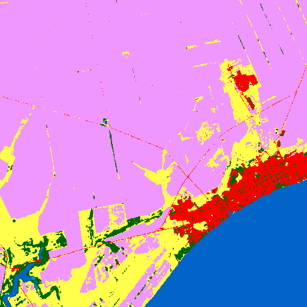 |

### kmeans  Segmentation Masks
| Type | Image |
|------|-------|
| Segmentation Mask |  |

### som  Segmentation Masks
| Type | Image |
|------|-------|
| Segmentation Mask |  |

### unet  Segmentation Masks
| Type | Image |
|------|-------|
| Segmentation Mask |  |

### watershed_kmeans  Segmentation Masks
| Type | Image |
|------|-------|
| Segmentation Mask |  |

### watershed_ndvi  Segmentation Masks
| Type | Image |
|------|-------|
| Segmentation Mask |  |

### kmeans  claude-3-5-haiku-20241022
| Metric | Value |
|--------|-------|
| accuracy | 0.1367 |
| iou | 0.0382 |
| f1 | 0.0683 |
| kappa | -0.0551 |
| Mask |  |
| Legend |  |
| JSON | [json](tile_5/kmeans_mask_claude-3-5-haiku-20241022_vlm_categories.json) |

#### Per-class metrics

| Class Code | Class Name (EN) | IoU | Precision | Recall | F1 | Pixel Acc | Support True | Support Pred |
|------------|----------------|-----|-----------|--------|----|-----------|-------------|-------------|
| 10 | Tree cover | 0.0020 | 0.0024 | 0.0109 | 0.0039 |  |  |  |
| 30 | Grassland | 0.0944 | 0.1601 | 0.1869 | 0.1725 |  |  |  |
| 40 | Cropland | 0.1515 | 0.6758 | 0.1634 | 0.2632 |  |  |  |
| 50 | Built-up | 0.0175 | 0.0210 | 0.0949 | 0.0344 |  |  |  |
| 60 | Bare / sparse vegetation | 0.0000 | 0.0000 | 0.0000 | 0.0000 |  |  |  |
| 80 | Permanent water bodies | 0.0019 | 0.0028 | 0.0063 | 0.0039 |  |  |  |
| 90 | Herbaceous wetland | 0.0000 | 0.0000 | 0.0000 | 0.0000 |  |  |  |

### kmeans  claude-3-5-sonnet-20240620
| Metric | Value |
|--------|-------|
| accuracy | 0.2161 |
| iou | 0.0754 |
| f1 | 0.1157 |
| kappa | 0.0540 |
| Mask |  |
| Legend |  |
| JSON | [json](tile_5/kmeans_mask_claude-3-5-sonnet-20240620_vlm_categories.json) |

#### Per-class metrics

| Class Code | Class Name (EN) | IoU | Precision | Recall | F1 | Pixel Acc | Support True | Support Pred |
|------------|----------------|-----|-----------|--------|----|-----------|-------------|-------------|
| 10 | Tree cover | 0.0000 | 0.0000 | 0.0000 | 0.0000 |  |  |  |
| 20 | Shrubland | 0.0000 | 0.0000 | 0.0000 | 0.0000 |  |  |  |
| 30 | Grassland | 0.0005 | 0.0010 | 0.0010 | 0.0010 |  |  |  |
| 40 | Cropland | 0.2730 | 0.8396 | 0.2880 | 0.4289 |  |  |  |
| 50 | Built-up | 0.3298 | 0.3848 | 0.6977 | 0.4960 |  |  |  |
| 60 | Bare / sparse vegetation | 0.0000 | 0.0000 | 0.0000 | 0.0000 |  |  |  |
| 80 | Permanent water bodies | 0.0000 | 0.0000 | 0.0000 | 0.0000 |  |  |  |
| 90 | Herbaceous wetland | 0.0000 | 0.0000 | 0.0000 | 0.0000 |  |  |  |

### kmeans  claude-3-7-sonnet-20250219
| Metric | Value |
|--------|-------|
| accuracy | 0.3521 |
| iou | 0.0568 |
| f1 | 0.0838 |
| kappa | -0.1142 |
| Mask |  |
| Legend |  |
| JSON | [json](tile_5/kmeans_mask_claude-3-7-sonnet-20250219_vlm_categories.json) |

#### Per-class metrics

| Class Code | Class Name (EN) | IoU | Precision | Recall | F1 | Pixel Acc | Support True | Support Pred |
|------------|----------------|-----|-----------|--------|----|-----------|-------------|-------------|
| 10 | Tree cover | 0.0000 | 0.0000 | 0.0000 | 0.0000 |  |  |  |
| 30 | Grassland | 0.0000 | 0.0000 | 0.0000 | 0.0000 |  |  |  |
| 40 | Cropland | 0.3795 | 0.5518 | 0.5486 | 0.5502 |  |  |  |
| 50 | Built-up | 0.0175 | 0.0210 | 0.0949 | 0.0344 |  |  |  |
| 60 | Bare / sparse vegetation | 0.0008 | 0.0008 | 0.2879 | 0.0017 |  |  |  |
| 80 | Permanent water bodies | 0.0000 | 0.0000 | 0.0000 | 0.0000 |  |  |  |
| 90 | Herbaceous wetland | 0.0000 | 0.0000 | 0.0000 | 0.0000 |  |  |  |

### kmeans  gemini-2.5-pro-preview-05-06
| Metric | Value |
|--------|-------|
| accuracy | 0.5656 |
| iou | 0.2220 |
| f1 | 0.2494 |
| kappa | 0.3017 |
| Mask |  |
| Legend |  |
| JSON | [json](tile_5/kmeans_mask_gemini-2.5-pro-preview-05-06_vlm_categories.json) |

#### Per-class metrics

| Class Code | Class Name (EN) | IoU | Precision | Recall | F1 | Pixel Acc | Support True | Support Pred |
|------------|----------------|-----|-----------|--------|----|-----------|-------------|-------------|
| 10 | Tree cover | 0.0000 | 0.0000 | 0.0000 | 0.0000 |  |  |  |
| 30 | Grassland | 0.0000 | 0.0000 | 0.0000 | 0.0000 |  |  |  |
| 40 | Cropland | 0.5553 | 0.7746 | 0.6623 | 0.7141 |  |  |  |
| 50 | Built-up | 0.0225 | 0.0253 | 0.1680 | 0.0440 |  |  |  |
| 60 | Bare / sparse vegetation | 0.0000 | 0.0000 | 0.0000 | 0.0000 |  |  |  |
| 80 | Permanent water bodies | 0.9764 | 0.9961 | 0.9801 | 0.9881 |  |  |  |
| 90 | Herbaceous wetland | 0.0000 | 0.0000 | 0.0000 | 0.0000 |  |  |  |

### kmeans  gpt-4.1-2025-04-14
| Metric | Value |
|--------|-------|
| accuracy | 0.0237 |
| iou | 0.0156 |
| f1 | 0.0299 |
| kappa | -0.1165 |
| Mask |  |
| Legend |  |
| JSON | [json](tile_5/kmeans_mask_gpt-4.1-2025-04-14_vlm_categories.json) |

#### Per-class metrics

| Class Code | Class Name (EN) | IoU | Precision | Recall | F1 | Pixel Acc | Support True | Support Pred |
|------------|----------------|-----|-----------|--------|----|-----------|-------------|-------------|
| 10 | Tree cover | 0.0436 | 0.0492 | 0.2775 | 0.0835 |  |  |  |
| 30 | Grassland | 0.0478 | 0.1221 | 0.0728 | 0.0912 |  |  |  |
| 40 | Cropland | 0.0000 | 0.0000 | 0.0000 | 0.0000 |  |  |  |
| 50 | Built-up | 0.0175 | 0.0210 | 0.0949 | 0.0344 |  |  |  |
| 60 | Bare / sparse vegetation | 0.0000 | 0.0000 | 0.0303 | 0.0000 |  |  |  |
| 80 | Permanent water bodies | 0.0000 | 0.0000 | 0.0000 | 0.0000 |  |  |  |
| 90 | Herbaceous wetland | 0.0000 | 0.0000 | 0.0000 | 0.0000 |  |  |  |

### kmeans  gpt-4.1-mini-2025-04-14
| Metric | Value |
|--------|-------|
| accuracy | 0.2181 |
| iou | 0.1430 |
| f1 | 0.1624 |
| kappa | 0.1460 |
| Mask |  |
| Legend |  |
| JSON | [json](tile_5/kmeans_mask_gpt-4.1-mini-2025-04-14_vlm_categories.json) |

#### Per-class metrics

| Class Code | Class Name (EN) | IoU | Precision | Recall | F1 | Pixel Acc | Support True | Support Pred |
|------------|----------------|-----|-----------|--------|----|-----------|-------------|-------------|
| 10 | Tree cover | 0.0000 | 0.0000 | 0.0000 | 0.0000 |  |  |  |
| 20 | Shrubland | 0.0000 | 0.0000 | 0.0000 | 0.0000 |  |  |  |
| 30 | Grassland | 0.0478 | 0.1221 | 0.0728 | 0.0912 |  |  |  |
| 40 | Cropland | 0.1023 | 0.9864 | 0.1024 | 0.1856 |  |  |  |
| 50 | Built-up | 0.0175 | 0.0210 | 0.0949 | 0.0344 |  |  |  |
| 60 | Bare / sparse vegetation | 0.0000 | 0.0000 | 0.0000 | 0.0000 |  |  |  |
| 80 | Permanent water bodies | 0.9764 | 0.9961 | 0.9801 | 0.9881 |  |  |  |
| 90 | Herbaceous wetland | 0.0000 | 0.0000 | 0.0000 | 0.0000 |  |  |  |

### kmeans  gpt-4o-2024-08-06
| Metric | Value |
|--------|-------|
| accuracy | 0.0000 |
| iou | 0.0000 |
| f1 | 0.0000 |
| kappa | 0.0000 |
| Mask |  |
| Legend |  |
| JSON | [json](tile_5/kmeans_mask_gpt-4o-2024-08-06_vlm_categories.json) |

#### Per-class metrics

| Class Code | Class Name (EN) | IoU | Precision | Recall | F1 | Pixel Acc | Support True | Support Pred |
|------------|----------------|-----|-----------|--------|----|-----------|-------------|-------------|
| 0 | Unknown | 0.0000 | 0.0000 | 0.0000 | 0.0000 |  |  |  |
| 10 | Tree cover | 0.0000 | 0.0000 | 0.0000 | 0.0000 |  |  |  |
| 30 | Grassland | 0.0000 | 0.0000 | 0.0000 | 0.0000 |  |  |  |
| 40 | Cropland | 0.0000 | 0.0000 | 0.0000 | 0.0000 |  |  |  |
| 50 | Built-up | 0.0000 | 0.0000 | 0.0000 | 0.0000 |  |  |  |
| 60 | Bare / sparse vegetation | 0.0000 | 0.0000 | 0.0000 | 0.0000 |  |  |  |
| 80 | Permanent water bodies | 0.0000 | 0.0000 | 0.0000 | 0.0000 |  |  |  |
| 90 | Herbaceous wetland | 0.0000 | 0.0000 | 0.0000 | 0.0000 |  |  |  |

### kmeans  gpt-4o-mini-2024-07-18
| Metric | Value |
|--------|-------|
| accuracy | 0.2498 |
| iou | 0.0543 |
| f1 | 0.0800 |
| kappa | 0.0170 |
| Mask |  |
| Legend |  |
| JSON | [json](tile_5/kmeans_mask_gpt-4o-mini-2024-07-18_vlm_categories.json) |

#### Per-class metrics

| Class Code | Class Name (EN) | IoU | Precision | Recall | F1 | Pixel Acc | Support True | Support Pred |
|------------|----------------|-----|-----------|--------|----|-----------|-------------|-------------|
| 10 | Tree cover | 0.0020 | 0.0024 | 0.0109 | 0.0039 |  |  |  |
| 30 | Grassland | 0.0000 | 0.0000 | 0.0000 | 0.0000 |  |  |  |
| 40 | Cropland | 0.3696 | 0.8737 | 0.3904 | 0.5397 |  |  |  |
| 50 | Built-up | 0.0055 | 0.0070 | 0.0249 | 0.0109 |  |  |  |
| 60 | Bare / sparse vegetation | 0.0008 | 0.0008 | 0.2879 | 0.0017 |  |  |  |
| 80 | Permanent water bodies | 0.0019 | 0.0028 | 0.0063 | 0.0039 |  |  |  |
| 90 | Herbaceous wetland | 0.0000 | 0.0000 | 0.0000 | 0.0000 |  |  |  |

### kmeans  grok-2-vision-1212
| Metric | Value |
|--------|-------|
| accuracy | 0.0649 |
| iou | 0.0128 |
| f1 | 0.0232 |
| kappa | 0.0242 |
| Mask |  |
| Legend |  |
| JSON | [json](tile_5/kmeans_mask_grok-2-vision-1212_vlm_categories.json) |

#### Per-class metrics

| Class Code | Class Name (EN) | IoU | Precision | Recall | F1 | Pixel Acc | Support True | Support Pred |
|------------|----------------|-----|-----------|--------|----|-----------|-------------|-------------|
| 0 | Unknown | 0.0000 | 0.0000 | 0.0000 | 0.0000 |  |  |  |
| 10 | Tree cover | 0.0000 | 0.0000 | 0.0000 | 0.0000 |  |  |  |
| 30 | Grassland | 0.0000 | 0.0000 | 0.0000 | 0.0000 |  |  |  |
| 40 | Cropland | 0.1023 | 0.9864 | 0.1024 | 0.1856 |  |  |  |
| 50 | Built-up | 0.0000 | 0.0000 | 0.0000 | 0.0000 |  |  |  |
| 60 | Bare / sparse vegetation | 0.0000 | 0.0000 | 0.0000 | 0.0000 |  |  |  |
| 80 | Permanent water bodies | 0.0000 | 0.0000 | 0.0000 | 0.0000 |  |  |  |
| 90 | Herbaceous wetland | 0.0000 | 0.0000 | 0.0000 | 0.0000 |  |  |  |

### kmeans  o4-mini
| Metric | Value |
|--------|-------|
| accuracy | 0.0469 |
| iou | 0.0100 |
| f1 | 0.0191 |
| kappa | -0.0510 |
| Mask |  |
| Legend |  |
| JSON | [json](tile_5/kmeans_mask_o4-mini_vlm_categories.json) |

#### Per-class metrics

| Class Code | Class Name (EN) | IoU | Precision | Recall | F1 | Pixel Acc | Support True | Support Pred |
|------------|----------------|-----|-----------|--------|----|-----------|-------------|-------------|
| 10 | Tree cover | 0.0002 | 0.0003 | 0.0008 | 0.0005 |  |  |  |
| 20 | Shrubland | 0.0000 | 0.0000 | 0.0000 | 0.0000 |  |  |  |
| 30 | Grassland | 0.0005 | 0.0010 | 0.0010 | 0.0010 |  |  |  |
| 40 | Cropland | 0.0566 | 0.4420 | 0.0610 | 0.1072 |  |  |  |
| 50 | Built-up | 0.0225 | 0.0253 | 0.1680 | 0.0440 |  |  |  |
| 60 | Bare / sparse vegetation | 0.0000 | 0.0000 | 0.0000 | 0.0000 |  |  |  |
| 80 | Permanent water bodies | 0.0000 | 0.0000 | 0.0000 | 0.0000 |  |  |  |
| 90 | Herbaceous wetland | 0.0000 | 0.0000 | 0.0000 | 0.0000 |  |  |  |

### som  claude-3-5-haiku-20241022
| Metric | Value |
|--------|-------|
| accuracy | 0.0904 |
| iou | 0.0166 |
| f1 | 0.0293 |
| kappa | 0.0032 |
| Mask | 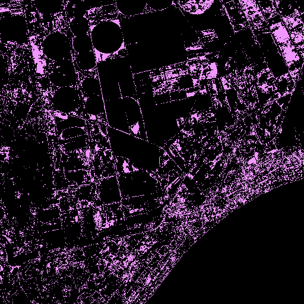 |
| Legend |  |
| JSON | [json](tile_5/som_mask_claude-3-5-haiku-20241022_vlm_categories.json) |

#### Per-class metrics

| Class Code | Class Name (EN) | IoU | Precision | Recall | F1 | Pixel Acc | Support True | Support Pred |
|------------|----------------|-----|-----------|--------|----|-----------|-------------|-------------|
| 0 | Unknown | 0.0000 | 0.0000 | 0.0000 | 0.0000 |  |  |  |
| 10 | Tree cover | 0.0000 | 0.0000 | 0.0000 | 0.0000 |  |  |  |
| 30 | Grassland | 0.0000 | 0.0000 | 0.0000 | 0.0000 |  |  |  |
| 40 | Cropland | 0.1327 | 0.6543 | 0.1427 | 0.2343 |  |  |  |
| 50 | Built-up | 0.0000 | 0.0000 | 0.0000 | 0.0000 |  |  |  |
| 60 | Bare / sparse vegetation | 0.0000 | 0.0000 | 0.0000 | 0.0000 |  |  |  |
| 80 | Permanent water bodies | 0.0000 | 0.0000 | 0.0000 | 0.0000 |  |  |  |
| 90 | Herbaceous wetland | 0.0000 | 0.0000 | 0.0000 | 0.0000 |  |  |  |

### som  claude-3-5-sonnet-20240620
| Metric | Value |
|--------|-------|
| accuracy | 0.1569 |
| iou | 0.0463 |
| f1 | 0.0822 |
| kappa | -0.0956 |
| Mask |  |
| Legend |  |
| JSON | [json](tile_5/som_mask_claude-3-5-sonnet-20240620_vlm_categories.json) |

#### Per-class metrics

| Class Code | Class Name (EN) | IoU | Precision | Recall | F1 | Pixel Acc | Support True | Support Pred |
|------------|----------------|-----|-----------|--------|----|-----------|-------------|-------------|
| 10 | Tree cover | 0.0267 | 0.0308 | 0.1640 | 0.0519 |  |  |  |
| 30 | Grassland | 0.1504 | 0.2453 | 0.2798 | 0.2614 |  |  |  |
| 40 | Cropland | 0.1356 | 0.3984 | 0.1704 | 0.2387 |  |  |  |
| 50 | Built-up | 0.0063 | 0.0078 | 0.0334 | 0.0126 |  |  |  |
| 60 | Bare / sparse vegetation | 0.0006 | 0.0006 | 0.1364 | 0.0012 |  |  |  |
| 80 | Permanent water bodies | 0.0048 | 0.0096 | 0.0094 | 0.0095 |  |  |  |
| 90 | Herbaceous wetland | 0.0000 | 0.0000 | 0.0000 | 0.0000 |  |  |  |

### som  claude-3-7-sonnet-20250219
| Metric | Value |
|--------|-------|
| accuracy | 0.4257 |
| iou | 0.0887 |
| f1 | 0.1242 |
| kappa | 0.0736 |
| Mask |  |
| Legend |  |
| JSON | [json](tile_5/som_mask_claude-3-7-sonnet-20250219_vlm_categories.json) |

#### Per-class metrics

| Class Code | Class Name (EN) | IoU | Precision | Recall | F1 | Pixel Acc | Support True | Support Pred |
|------------|----------------|-----|-----------|--------|----|-----------|-------------|-------------|
| 10 | Tree cover | 0.0000 | 0.0000 | 0.0000 | 0.0000 |  |  |  |
| 30 | Grassland | 0.0569 | 0.1976 | 0.0740 | 0.1076 |  |  |  |
| 40 | Cropland | 0.5270 | 0.7529 | 0.6372 | 0.6903 |  |  |  |
| 50 | Built-up | 0.0321 | 0.0366 | 0.2059 | 0.0622 |  |  |  |
| 60 | Bare / sparse vegetation | 0.0000 | 0.0000 | 0.0000 | 0.0000 |  |  |  |
| 80 | Permanent water bodies | 0.0048 | 0.0096 | 0.0094 | 0.0095 |  |  |  |
| 90 | Herbaceous wetland | 0.0000 | 0.0000 | 0.0000 | 0.0000 |  |  |  |

### som  gemini-2.5-pro-preview-05-06
| Metric | Value |
|--------|-------|
| accuracy | 0.2890 |
| iou | 0.0530 |
| f1 | 0.0812 |
| kappa | -0.0622 |
| Mask |  |
| Legend |  |
| JSON | [json](tile_5/som_mask_gemini-2.5-pro-preview-05-06_vlm_categories.json) |

#### Per-class metrics

| Class Code | Class Name (EN) | IoU | Precision | Recall | F1 | Pixel Acc | Support True | Support Pred |
|------------|----------------|-----|-----------|--------|----|-----------|-------------|-------------|
| 10 | Tree cover | 0.0000 | 0.0000 | 0.0000 | 0.0000 |  |  |  |
| 30 | Grassland | 0.0000 | 0.0000 | 0.0000 | 0.0000 |  |  |  |
| 40 | Cropland | 0.3401 | 0.5897 | 0.4455 | 0.5075 |  |  |  |
| 50 | Built-up | 0.0260 | 0.0327 | 0.1134 | 0.0507 |  |  |  |
| 60 | Bare / sparse vegetation | 0.0002 | 0.0002 | 0.1970 | 0.0005 |  |  |  |
| 80 | Permanent water bodies | 0.0048 | 0.0096 | 0.0094 | 0.0095 |  |  |  |
| 90 | Herbaceous wetland | 0.0000 | 0.0000 | 0.0000 | 0.0000 |  |  |  |

### som  gpt-4.1-2025-04-14
| Metric | Value |
|--------|-------|
| accuracy | 0.1464 |
| iou | 0.0453 |
| f1 | 0.0803 |
| kappa | -0.0187 |
| Mask |  |
| Legend |  |
| JSON | [json](tile_5/som_mask_gpt-4.1-2025-04-14_vlm_categories.json) |

#### Per-class metrics

| Class Code | Class Name (EN) | IoU | Precision | Recall | F1 | Pixel Acc | Support True | Support Pred |
|------------|----------------|-----|-----------|--------|----|-----------|-------------|-------------|
| 10 | Tree cover | 0.0000 | 0.0000 | 0.0000 | 0.0000 |  |  |  |
| 30 | Grassland | 0.1504 | 0.2453 | 0.2798 | 0.2614 |  |  |  |
| 40 | Cropland | 0.1327 | 0.6543 | 0.1427 | 0.2343 |  |  |  |
| 50 | Built-up | 0.0283 | 0.0306 | 0.2743 | 0.0550 |  |  |  |
| 60 | Bare / sparse vegetation | 0.0006 | 0.0006 | 0.1364 | 0.0012 |  |  |  |
| 80 | Permanent water bodies | 0.0051 | 0.0085 | 0.0126 | 0.0102 |  |  |  |
| 90 | Herbaceous wetland | 0.0000 | 0.0000 | 0.0000 | 0.0000 |  |  |  |

### som  gpt-4.1-mini-2025-04-14
| Metric | Value |
|--------|-------|
| accuracy | 0.2914 |
| iou | 0.0699 |
| f1 | 0.1099 |
| kappa | 0.0314 |
| Mask |  |
| Legend |  |
| JSON | [json](tile_5/som_mask_gpt-4.1-mini-2025-04-14_vlm_categories.json) |

#### Per-class metrics

| Class Code | Class Name (EN) | IoU | Precision | Recall | F1 | Pixel Acc | Support True | Support Pred |
|------------|----------------|-----|-----------|--------|----|-----------|-------------|-------------|
| 10 | Tree cover | 0.0267 | 0.0308 | 0.1640 | 0.0519 |  |  |  |
| 30 | Grassland | 0.0569 | 0.1976 | 0.0740 | 0.1076 |  |  |  |
| 40 | Cropland | 0.3703 | 0.7655 | 0.4177 | 0.5405 |  |  |  |
| 50 | Built-up | 0.0321 | 0.0366 | 0.2059 | 0.0622 |  |  |  |
| 60 | Bare / sparse vegetation | 0.0000 | 0.0000 | 0.0000 | 0.0000 |  |  |  |
| 80 | Permanent water bodies | 0.0036 | 0.0066 | 0.0079 | 0.0072 |  |  |  |
| 90 | Herbaceous wetland | 0.0000 | 0.0000 | 0.0000 | 0.0000 |  |  |  |

### som  gpt-4o-2024-08-06
| Metric | Value |
|--------|-------|
| accuracy | 0.0000 |
| iou | 0.0000 |
| f1 | 0.0000 |
| kappa | 0.0000 |
| Mask |  |
| Legend |  |
| JSON | [json](tile_5/som_mask_gpt-4o-2024-08-06_vlm_categories.json) |

#### Per-class metrics

| Class Code | Class Name (EN) | IoU | Precision | Recall | F1 | Pixel Acc | Support True | Support Pred |
|------------|----------------|-----|-----------|--------|----|-----------|-------------|-------------|
| 0 | Unknown | 0.0000 | 0.0000 | 0.0000 | 0.0000 |  |  |  |
| 10 | Tree cover | 0.0000 | 0.0000 | 0.0000 | 0.0000 |  |  |  |
| 30 | Grassland | 0.0000 | 0.0000 | 0.0000 | 0.0000 |  |  |  |
| 40 | Cropland | 0.0000 | 0.0000 | 0.0000 | 0.0000 |  |  |  |
| 50 | Built-up | 0.0000 | 0.0000 | 0.0000 | 0.0000 |  |  |  |
| 60 | Bare / sparse vegetation | 0.0000 | 0.0000 | 0.0000 | 0.0000 |  |  |  |
| 80 | Permanent water bodies | 0.0000 | 0.0000 | 0.0000 | 0.0000 |  |  |  |
| 90 | Herbaceous wetland | 0.0000 | 0.0000 | 0.0000 | 0.0000 |  |  |  |

### som  gpt-4o-mini-2024-07-18
| Metric | Value |
|--------|-------|
| accuracy | 0.2143 |
| iou | 0.0408 |
| f1 | 0.0664 |
| kappa | 0.0086 |
| Mask |  |
| Legend |  |
| JSON | [json](tile_5/som_mask_gpt-4o-mini-2024-07-18_vlm_categories.json) |

#### Per-class metrics

| Class Code | Class Name (EN) | IoU | Precision | Recall | F1 | Pixel Acc | Support True | Support Pred |
|------------|----------------|-----|-----------|--------|----|-----------|-------------|-------------|
| 10 | Tree cover | 0.0339 | 0.0376 | 0.2573 | 0.0656 |  |  |  |
| 20 | Shrubland | 0.0000 | 0.0000 | 0.0000 | 0.0000 |  |  |  |
| 30 | Grassland | 0.0000 | 0.0000 | 0.0000 | 0.0000 |  |  |  |
| 40 | Cropland | 0.2763 | 0.6653 | 0.3208 | 0.4329 |  |  |  |
| 50 | Built-up | 0.0160 | 0.0204 | 0.0684 | 0.0315 |  |  |  |
| 60 | Bare / sparse vegetation | 0.0006 | 0.0006 | 0.1364 | 0.0012 |  |  |  |
| 80 | Permanent water bodies | 0.0000 | 0.0000 | 0.0000 | 0.0000 |  |  |  |
| 90 | Herbaceous wetland | 0.0000 | 0.0000 | 0.0000 | 0.0000 |  |  |  |

### som  grok-2-vision-1212
| Metric | Value |
|--------|-------|
| accuracy | 0.3166 |
| iou | 0.0766 |
| f1 | 0.1236 |
| kappa | -0.0493 |
| Mask |  |
| Legend |  |
| JSON | [json](tile_5/som_mask_grok-2-vision-1212_vlm_categories.json) |

#### Per-class metrics

| Class Code | Class Name (EN) | IoU | Precision | Recall | F1 | Pixel Acc | Support True | Support Pred |
|------------|----------------|-----|-----------|--------|----|-----------|-------------|-------------|
| 10 | Tree cover | 0.0000 | 0.0000 | 0.0000 | 0.0000 |  |  |  |
| 30 | Grassland | 0.0929 | 0.1753 | 0.1652 | 0.1701 |  |  |  |
| 40 | Cropland | 0.3401 | 0.5897 | 0.4455 | 0.5075 |  |  |  |
| 50 | Built-up | 0.1001 | 0.1710 | 0.1947 | 0.1821 |  |  |  |
| 60 | Bare / sparse vegetation | 0.0001 | 0.0001 | 0.0455 | 0.0001 |  |  |  |
| 80 | Permanent water bodies | 0.0028 | 0.0052 | 0.0060 | 0.0056 |  |  |  |
| 90 | Herbaceous wetland | 0.0000 | 0.0000 | 0.0000 | 0.0000 |  |  |  |

### som  o4-mini
| Metric | Value |
|--------|-------|
| accuracy | 0.1899 |
| iou | 0.0562 |
| f1 | 0.0941 |
| kappa | 0.0373 |
| Mask |  |
| Legend |  |
| JSON | [json](tile_5/som_mask_o4-mini_vlm_categories.json) |

#### Per-class metrics

| Class Code | Class Name (EN) | IoU | Precision | Recall | F1 | Pixel Acc | Support True | Support Pred |
|------------|----------------|-----|-----------|--------|----|-----------|-------------|-------------|
| 10 | Tree cover | 0.0267 | 0.0308 | 0.1640 | 0.0519 |  |  |  |
| 30 | Grassland | 0.0000 | 0.0000 | 0.0000 | 0.0000 |  |  |  |
| 40 | Cropland | 0.2613 | 0.8395 | 0.2750 | 0.4143 |  |  |  |
| 50 | Built-up | 0.1001 | 0.1710 | 0.1947 | 0.1821 |  |  |  |
| 60 | Bare / sparse vegetation | 0.0001 | 0.0001 | 0.0455 | 0.0001 |  |  |  |
| 80 | Permanent water bodies | 0.0048 | 0.0096 | 0.0094 | 0.0095 |  |  |  |
| 90 | Herbaceous wetland | 0.0003 | 0.0003 | 0.1429 | 0.0005 |  |  |  |

### unet  claude-3-5-haiku-20241022
| Metric | Value |
|--------|-------|
| accuracy | 0.2367 |
| iou | 0.0380 |
| f1 | 0.0583 |
| kappa | -0.0069 |
| Mask | 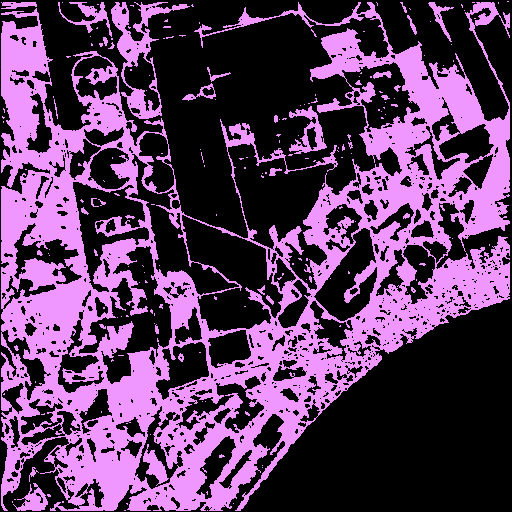 |
| Legend |  |
| JSON | [json](tile_5/unet_mask_claude-3-5-haiku-20241022_vlm_categories.json) |

#### Per-class metrics

| Class Code | Class Name (EN) | IoU | Precision | Recall | F1 | Pixel Acc | Support True | Support Pred |
|------------|----------------|-----|-----------|--------|----|-----------|-------------|-------------|
| 0 | Unknown | 0.0000 | 0.0000 | 0.0000 | 0.0000 |  |  |  |
| 10 | Tree cover | 0.0000 | 0.0000 | 0.0000 | 0.0000 |  |  |  |
| 30 | Grassland | 0.0000 | 0.0000 | 0.0000 | 0.0000 |  |  |  |
| 40 | Cropland | 0.3039 | 0.6196 | 0.3737 | 0.4662 |  |  |  |
| 50 | Built-up | 0.0000 | 0.0000 | 0.0000 | 0.0000 |  |  |  |
| 60 | Bare / sparse vegetation | 0.0000 | 0.0000 | 0.0000 | 0.0000 |  |  |  |
| 80 | Permanent water bodies | 0.0000 | 0.0000 | 0.0000 | 0.0000 |  |  |  |
| 90 | Herbaceous wetland | 0.0000 | 0.0000 | 0.0000 | 0.0000 |  |  |  |

### unet  claude-3-5-sonnet-20240620
| Metric | Value |
|--------|-------|
| accuracy | 0.0378 |
| iou | 0.0175 |
| f1 | 0.0318 |
| kappa | -0.1646 |
| Mask |  |
| Legend |  |
| JSON | [json](tile_5/unet_mask_claude-3-5-sonnet-20240620_vlm_categories.json) |

#### Per-class metrics

| Class Code | Class Name (EN) | IoU | Precision | Recall | F1 | Pixel Acc | Support True | Support Pred |
|------------|----------------|-----|-----------|--------|----|-----------|-------------|-------------|
| 10 | Tree cover | 0.0000 | 0.0000 | 0.0000 | 0.0000 |  |  |  |
| 30 | Grassland | 0.1101 | 0.1803 | 0.2206 | 0.1984 |  |  |  |
| 40 | Cropland | 0.0058 | 0.0313 | 0.0071 | 0.0115 |  |  |  |
| 50 | Built-up | 0.0054 | 0.0095 | 0.0124 | 0.0108 |  |  |  |
| 60 | Bare / sparse vegetation | 0.0005 | 0.0005 | 0.4697 | 0.0010 |  |  |  |
| 80 | Permanent water bodies | 0.0006 | 0.0008 | 0.0021 | 0.0011 |  |  |  |
| 90 | Herbaceous wetland | 0.0000 | 0.0000 | 0.0000 | 0.0000 |  |  |  |

### unet  claude-3-7-sonnet-20250219
| Metric | Value |
|--------|-------|
| accuracy | 0.3358 |
| iou | 0.0569 |
| f1 | 0.0822 |
| kappa | -0.1226 |
| Mask |  |
| Legend |  |
| JSON | [json](tile_5/unet_mask_claude-3-7-sonnet-20250219_vlm_categories.json) |

#### Per-class metrics

| Class Code | Class Name (EN) | IoU | Precision | Recall | F1 | Pixel Acc | Support True | Support Pred |
|------------|----------------|-----|-----------|--------|----|-----------|-------------|-------------|
| 10 | Tree cover | 0.0000 | 0.0000 | 0.0000 | 0.0000 |  |  |  |
| 30 | Grassland | 0.0000 | 0.0000 | 0.0000 | 0.0000 |  |  |  |
| 40 | Cropland | 0.3924 | 0.6034 | 0.5288 | 0.5636 |  |  |  |
| 50 | Built-up | 0.0054 | 0.0095 | 0.0124 | 0.0108 |  |  |  |
| 60 | Bare / sparse vegetation | 0.0000 | 0.0000 | 0.0000 | 0.0000 |  |  |  |
| 80 | Permanent water bodies | 0.0006 | 0.0008 | 0.0021 | 0.0011 |  |  |  |
| 90 | Herbaceous wetland | 0.0000 | 0.0000 | 0.0000 | 0.0000 |  |  |  |

### unet  gemini-2.5-pro-preview-05-06
| Metric | Value |
|--------|-------|
| accuracy | 0.2668 |
| iou | 0.0495 |
| f1 | 0.0763 |
| kappa | -0.1114 |
| Mask |  |
| Legend |  |
| JSON | [json](tile_5/unet_mask_gemini-2.5-pro-preview-05-06_vlm_categories.json) |

#### Per-class metrics

| Class Code | Class Name (EN) | IoU | Precision | Recall | F1 | Pixel Acc | Support True | Support Pred |
|------------|----------------|-----|-----------|--------|----|-----------|-------------|-------------|
| 10 | Tree cover | 0.0000 | 0.0000 | 0.0000 | 0.0000 |  |  |  |
| 30 | Grassland | 0.0000 | 0.0000 | 0.0000 | 0.0000 |  |  |  |
| 40 | Cropland | 0.3223 | 0.5956 | 0.4126 | 0.4875 |  |  |  |
| 50 | Built-up | 0.0233 | 0.0289 | 0.1076 | 0.0456 |  |  |  |
| 60 | Bare / sparse vegetation | 0.0000 | 0.0000 | 0.0000 | 0.0000 |  |  |  |
| 80 | Permanent water bodies | 0.0006 | 0.0008 | 0.0021 | 0.0011 |  |  |  |
| 90 | Herbaceous wetland | 0.0000 | 0.0000 | 0.0000 | 0.0000 |  |  |  |

### unet  gpt-4.1-2025-04-14
| Metric | Value |
|--------|-------|
| accuracy | 0.2725 |
| iou | 0.0607 |
| f1 | 0.0981 |
| kappa | -0.0536 |
| Mask |  |
| Legend |  |
| JSON | [json](tile_5/unet_mask_gpt-4.1-2025-04-14_vlm_categories.json) |

#### Per-class metrics

| Class Code | Class Name (EN) | IoU | Precision | Recall | F1 | Pixel Acc | Support True | Support Pred |
|------------|----------------|-----|-----------|--------|----|-----------|-------------|-------------|
| 10 | Tree cover | 0.0014 | 0.0021 | 0.0043 | 0.0028 |  |  |  |
| 30 | Grassland | 0.1101 | 0.1803 | 0.2206 | 0.1984 |  |  |  |
| 40 | Cropland | 0.3039 | 0.6196 | 0.3737 | 0.4662 |  |  |  |
| 50 | Built-up | 0.0009 | 0.0012 | 0.0034 | 0.0018 |  |  |  |
| 60 | Bare / sparse vegetation | 0.0000 | 0.0000 | 0.0000 | 0.0000 |  |  |  |
| 80 | Permanent water bodies | 0.0088 | 0.0140 | 0.0231 | 0.0174 |  |  |  |
| 90 | Herbaceous wetland | 0.0000 | 0.0000 | 0.0000 | 0.0000 |  |  |  |

### unet  gpt-4.1-mini-2025-04-14
| Metric | Value |
|--------|-------|
| accuracy | 0.2425 |
| iou | 0.0414 |
| f1 | 0.0649 |
| kappa | -0.0175 |
| Mask |  |
| Legend |  |
| JSON | [json](tile_5/unet_mask_gpt-4.1-mini-2025-04-14_vlm_categories.json) |

#### Per-class metrics

| Class Code | Class Name (EN) | IoU | Precision | Recall | F1 | Pixel Acc | Support True | Support Pred |
|------------|----------------|-----|-----------|--------|----|-----------|-------------|-------------|
| 10 | Tree cover | 0.0008 | 0.0010 | 0.0047 | 0.0017 |  |  |  |
| 20 | Shrubland | 0.0000 | 0.0000 | 0.0000 | 0.0000 |  |  |  |
| 30 | Grassland | 0.0000 | 0.0000 | 0.0000 | 0.0000 |  |  |  |
| 40 | Cropland | 0.3039 | 0.6196 | 0.3737 | 0.4662 |  |  |  |
| 50 | Built-up | 0.0233 | 0.0289 | 0.1076 | 0.0456 |  |  |  |
| 60 | Bare / sparse vegetation | 0.0005 | 0.0005 | 0.4697 | 0.0010 |  |  |  |
| 80 | Permanent water bodies | 0.0025 | 0.0782 | 0.0026 | 0.0051 |  |  |  |
| 90 | Herbaceous wetland | 0.0000 | 0.0000 | 0.0000 | 0.0000 |  |  |  |

### unet  gpt-4o-2024-08-06
| Metric | Value |
|--------|-------|
| accuracy | 0.0000 |
| iou | 0.0000 |
| f1 | 0.0000 |
| kappa | 0.0000 |
| Mask |  |
| Legend |  |
| JSON | [json](tile_5/unet_mask_gpt-4o-2024-08-06_vlm_categories.json) |

#### Per-class metrics

| Class Code | Class Name (EN) | IoU | Precision | Recall | F1 | Pixel Acc | Support True | Support Pred |
|------------|----------------|-----|-----------|--------|----|-----------|-------------|-------------|
| 0 | Unknown | 0.0000 | 0.0000 | 0.0000 | 0.0000 |  |  |  |
| 10 | Tree cover | 0.0000 | 0.0000 | 0.0000 | 0.0000 |  |  |  |
| 30 | Grassland | 0.0000 | 0.0000 | 0.0000 | 0.0000 |  |  |  |
| 40 | Cropland | 0.0000 | 0.0000 | 0.0000 | 0.0000 |  |  |  |
| 50 | Built-up | 0.0000 | 0.0000 | 0.0000 | 0.0000 |  |  |  |
| 60 | Bare / sparse vegetation | 0.0000 | 0.0000 | 0.0000 | 0.0000 |  |  |  |
| 80 | Permanent water bodies | 0.0000 | 0.0000 | 0.0000 | 0.0000 |  |  |  |
| 90 | Herbaceous wetland | 0.0000 | 0.0000 | 0.0000 | 0.0000 |  |  |  |

### unet  gpt-4o-mini-2024-07-18
| Metric | Value |
|--------|-------|
| accuracy | 0.2494 |
| iou | 0.0434 |
| f1 | 0.0685 |
| kappa | -0.0151 |
| Mask |  |
| Legend |  |
| JSON | [json](tile_5/unet_mask_gpt-4o-mini-2024-07-18_vlm_categories.json) |

#### Per-class metrics

| Class Code | Class Name (EN) | IoU | Precision | Recall | F1 | Pixel Acc | Support True | Support Pred |
|------------|----------------|-----|-----------|--------|----|-----------|-------------|-------------|
| 10 | Tree cover | 0.0161 | 0.0179 | 0.1372 | 0.0317 |  |  |  |
| 20 | Shrubland | 0.0000 | 0.0000 | 0.0000 | 0.0000 |  |  |  |
| 30 | Grassland | 0.0000 | 0.0000 | 0.0000 | 0.0000 |  |  |  |
| 40 | Cropland | 0.3078 | 0.6208 | 0.3791 | 0.4707 |  |  |  |
| 50 | Built-up | 0.0233 | 0.0289 | 0.1076 | 0.0456 |  |  |  |
| 60 | Bare / sparse vegetation | 0.0001 | 0.0001 | 0.0152 | 0.0001 |  |  |  |
| 80 | Permanent water bodies | 0.0000 | 0.0000 | 0.0000 | 0.0000 |  |  |  |
| 90 | Herbaceous wetland | 0.0000 | 0.0000 | 0.0000 | 0.0000 |  |  |  |

### unet  grok-2-vision-1212
| Metric | Value |
|--------|-------|
| accuracy | 0.0877 |
| iou | 0.0249 |
| f1 | 0.0415 |
| kappa | 0.0336 |
| Mask |  |
| Legend |  |
| JSON | [json](tile_5/unet_mask_grok-2-vision-1212_vlm_categories.json) |

#### Per-class metrics

| Class Code | Class Name (EN) | IoU | Precision | Recall | F1 | Pixel Acc | Support True | Support Pred |
|------------|----------------|-----|-----------|--------|----|-----------|-------------|-------------|
| 0 | Unknown | 0.0000 | 0.0000 | 0.0000 | 0.0000 |  |  |  |
| 10 | Tree cover | 0.0000 | 0.0000 | 0.0000 | 0.0000 |  |  |  |
| 30 | Grassland | 0.1990 | 0.2297 | 0.5984 | 0.3319 |  |  |  |
| 40 | Cropland | 0.0000 | 0.0000 | 0.0000 | 0.0000 |  |  |  |
| 50 | Built-up | 0.0000 | 0.0000 | 0.0000 | 0.0000 |  |  |  |
| 60 | Bare / sparse vegetation | 0.0000 | 0.0000 | 0.0000 | 0.0000 |  |  |  |
| 80 | Permanent water bodies | 0.0000 | 0.0000 | 0.0000 | 0.0000 |  |  |  |
| 90 | Herbaceous wetland | 0.0000 | 0.0000 | 0.0000 | 0.0000 |  |  |  |

### unet  o4-mini
| Metric | Value |
|--------|-------|
| accuracy | 0.4319 |
| iou | 0.0756 |
| f1 | 0.0990 |
| kappa | 0.0292 |
| Mask |  |
| Legend |  |
| JSON | [json](tile_5/unet_mask_o4-mini_vlm_categories.json) |

#### Per-class metrics

| Class Code | Class Name (EN) | IoU | Precision | Recall | F1 | Pixel Acc | Support True | Support Pred |
|------------|----------------|-----|-----------|--------|----|-----------|-------------|-------------|
| 10 | Tree cover | 0.0000 | 0.0000 | 0.0000 | 0.0000 |  |  |  |
| 30 | Grassland | 0.0000 | 0.0000 | 0.0000 | 0.0000 |  |  |  |
| 40 | Cropland | 0.5289 | 0.7024 | 0.6817 | 0.6919 |  |  |  |
| 50 | Built-up | 0.0001 | 0.0016 | 0.0002 | 0.0003 |  |  |  |
| 60 | Bare / sparse vegetation | 0.0000 | 0.0000 | 0.0000 | 0.0000 |  |  |  |
| 80 | Permanent water bodies | 0.0005 | 0.0009 | 0.0011 | 0.0010 |  |  |  |
| 90 | Herbaceous wetland | 0.0000 | 0.0000 | 0.0000 | 0.0000 |  |  |  |

### watershed_kmeans  claude-3-5-haiku-20241022
| Metric | Value |
|--------|-------|
| accuracy | 0.1746 |
| iou | 0.0381 |
| f1 | 0.0648 |
| kappa | -0.0027 |
| Mask |  |
| Legend |  |
| JSON | [json](tile_5/watershed_kmeans_mask_claude-3-5-haiku-20241022_vlm_categories.json) |

#### Per-class metrics

| Class Code | Class Name (EN) | IoU | Precision | Recall | F1 | Pixel Acc | Support True | Support Pred |
|------------|----------------|-----|-----------|--------|----|-----------|-------------|-------------|
| 0 | Unknown | 0.0000 | 0.0000 | 0.0000 | 0.0000 |  |  |  |
| 10 | Tree cover | 0.0000 | 0.0000 | 0.0000 | 0.0000 |  |  |  |
| 30 | Grassland | 0.0804 | 0.1598 | 0.1393 | 0.1488 |  |  |  |
| 40 | Cropland | 0.2206 | 0.7157 | 0.2418 | 0.3615 |  |  |  |
| 50 | Built-up | 0.0002 | 0.0003 | 0.0010 | 0.0005 |  |  |  |
| 60 | Bare / sparse vegetation | 0.0000 | 0.0000 | 0.0000 | 0.0000 |  |  |  |
| 80 | Permanent water bodies | 0.0038 | 0.0086 | 0.0069 | 0.0076 |  |  |  |
| 90 | Herbaceous wetland | 0.0000 | 0.0000 | 0.0000 | 0.0000 |  |  |  |

### watershed_kmeans  claude-3-5-sonnet-20240620
| Metric | Value |
|--------|-------|
| accuracy | 0.1829 |
| iou | 0.0381 |
| f1 | 0.0647 |
| kappa | 0.0106 |
| Mask |  |
| Legend |  |
| JSON | [json](tile_5/watershed_kmeans_mask_claude-3-5-sonnet-20240620_vlm_categories.json) |

#### Per-class metrics

| Class Code | Class Name (EN) | IoU | Precision | Recall | F1 | Pixel Acc | Support True | Support Pred |
|------------|----------------|-----|-----------|--------|----|-----------|-------------|-------------|
| 10 | Tree cover | 0.0102 | 0.0128 | 0.0478 | 0.0203 |  |  |  |
| 20 | Shrubland | 0.0000 | 0.0000 | 0.0000 | 0.0000 |  |  |  |
| 30 | Grassland | 0.0310 | 0.0963 | 0.0438 | 0.0602 |  |  |  |
| 40 | Cropland | 0.2331 | 0.7250 | 0.2557 | 0.3781 |  |  |  |
| 50 | Built-up | 0.0297 | 0.0322 | 0.2698 | 0.0576 |  |  |  |
| 60 | Bare / sparse vegetation | 0.0006 | 0.0006 | 0.1667 | 0.0013 |  |  |  |
| 80 | Permanent water bodies | 0.0000 | 0.0000 | 0.0000 | 0.0000 |  |  |  |
| 90 | Herbaceous wetland | 0.0000 | 0.0000 | 0.0000 | 0.0000 |  |  |  |

### watershed_kmeans  claude-3-7-sonnet-20250219
| Metric | Value |
|--------|-------|
| accuracy | 0.2361 |
| iou | 0.0486 |
| f1 | 0.0792 |
| kappa | -0.0007 |
| Mask |  |
| Legend |  |
| JSON | [json](tile_5/watershed_kmeans_mask_claude-3-7-sonnet-20250219_vlm_categories.json) |

#### Per-class metrics

| Class Code | Class Name (EN) | IoU | Precision | Recall | F1 | Pixel Acc | Support True | Support Pred |
|------------|----------------|-----|-----------|--------|----|-----------|-------------|-------------|
| 10 | Tree cover | 0.0428 | 0.0592 | 0.1334 | 0.0820 |  |  |  |
| 20 | Shrubland | 0.0000 | 0.0000 | 0.0000 | 0.0000 |  |  |  |
| 30 | Grassland | 0.0375 | 0.0831 | 0.0640 | 0.0723 |  |  |  |
| 40 | Cropland | 0.2986 | 0.6868 | 0.3456 | 0.4598 |  |  |  |
| 50 | Built-up | 0.0100 | 0.0113 | 0.0785 | 0.0197 |  |  |  |
| 60 | Bare / sparse vegetation | 0.0000 | 0.0000 | 0.0000 | 0.0000 |  |  |  |
| 80 | Permanent water bodies | 0.0000 | 0.0000 | 0.0000 | 0.0000 |  |  |  |
| 90 | Herbaceous wetland | 0.0000 | 0.0000 | 0.0000 | 0.0000 |  |  |  |

### watershed_kmeans  gemini-2.5-pro-preview-05-06
| Metric | Value |
|--------|-------|
| accuracy | 0.3036 |
| iou | 0.0552 |
| f1 | 0.0838 |
| kappa | -0.0893 |
| Mask |  |
| Legend |  |
| JSON | [json](tile_5/watershed_kmeans_mask_gemini-2.5-pro-preview-05-06_vlm_categories.json) |

#### Per-class metrics

| Class Code | Class Name (EN) | IoU | Precision | Recall | F1 | Pixel Acc | Support True | Support Pred |
|------------|----------------|-----|-----------|--------|----|-----------|-------------|-------------|
| 10 | Tree cover | 0.0308 | 0.0435 | 0.0955 | 0.0597 |  |  |  |
| 30 | Grassland | 0.0000 | 0.0000 | 0.0000 | 0.0000 |  |  |  |
| 40 | Cropland | 0.3537 | 0.5831 | 0.4734 | 0.5226 |  |  |  |
| 50 | Built-up | 0.0000 | 0.0000 | 0.0000 | 0.0000 |  |  |  |
| 60 | Bare / sparse vegetation | 0.0000 | 0.0000 | 0.0000 | 0.0000 |  |  |  |
| 80 | Permanent water bodies | 0.0022 | 0.0035 | 0.0059 | 0.0044 |  |  |  |
| 90 | Herbaceous wetland | 0.0000 | 0.0000 | 0.0000 | 0.0000 |  |  |  |

### watershed_kmeans  gpt-4.1-2025-04-14
| Metric | Value |
|--------|-------|
| accuracy | 0.1975 |
| iou | 0.0461 |
| f1 | 0.0804 |
| kappa | 0.0174 |
| Mask |  |
| Legend |  |
| JSON | [json](tile_5/watershed_kmeans_mask_gpt-4.1-2025-04-14_vlm_categories.json) |

#### Per-class metrics

| Class Code | Class Name (EN) | IoU | Precision | Recall | F1 | Pixel Acc | Support True | Support Pred |
|------------|----------------|-----|-----------|--------|----|-----------|-------------|-------------|
| 10 | Tree cover | 0.0442 | 0.0524 | 0.2207 | 0.0846 |  |  |  |
| 20 | Shrubland | 0.0000 | 0.0000 | 0.0000 | 0.0000 |  |  |  |
| 30 | Grassland | 0.1442 | 0.1750 | 0.4507 | 0.2521 |  |  |  |
| 40 | Cropland | 0.1796 | 0.6728 | 0.1968 | 0.3045 |  |  |  |
| 50 | Built-up | 0.0002 | 0.0003 | 0.0010 | 0.0005 |  |  |  |
| 60 | Bare / sparse vegetation | 0.0006 | 0.0006 | 0.1667 | 0.0013 |  |  |  |
| 80 | Permanent water bodies | 0.0000 | 0.0000 | 0.0000 | 0.0000 |  |  |  |
| 90 | Herbaceous wetland | 0.0000 | 0.0000 | 0.0000 | 0.0000 |  |  |  |

### watershed_kmeans  gpt-4.1-mini-2025-04-14
| Metric | Value |
|--------|-------|
| accuracy | 0.1887 |
| iou | 0.0474 |
| f1 | 0.0828 |
| kappa | 0.0122 |
| Mask |  |
| Legend |  |
| JSON | [json](tile_5/watershed_kmeans_mask_gpt-4.1-mini-2025-04-14_vlm_categories.json) |

#### Per-class metrics

| Class Code | Class Name (EN) | IoU | Precision | Recall | F1 | Pixel Acc | Support True | Support Pred |
|------------|----------------|-----|-----------|--------|----|-----------|-------------|-------------|
| 10 | Tree cover | 0.0308 | 0.0435 | 0.0955 | 0.0597 |  |  |  |
| 20 | Shrubland | 0.0000 | 0.0000 | 0.0000 | 0.0000 |  |  |  |
| 30 | Grassland | 0.0864 | 0.1500 | 0.1692 | 0.1590 |  |  |  |
| 40 | Cropland | 0.2187 | 0.7581 | 0.2351 | 0.3589 |  |  |  |
| 50 | Built-up | 0.0384 | 0.0440 | 0.2314 | 0.0739 |  |  |  |
| 60 | Bare / sparse vegetation | 0.0014 | 0.0015 | 0.1667 | 0.0029 |  |  |  |
| 80 | Permanent water bodies | 0.0038 | 0.0086 | 0.0069 | 0.0076 |  |  |  |
| 90 | Herbaceous wetland | 0.0000 | 0.0000 | 0.0000 | 0.0000 |  |  |  |

### watershed_kmeans  gpt-4o-2024-08-06
| Metric | Value |
|--------|-------|
| accuracy | 0.0000 |
| iou | 0.0000 |
| f1 | 0.0000 |
| kappa | 0.0000 |
| Mask |  |
| Legend |  |
| JSON | [json](tile_5/watershed_kmeans_mask_gpt-4o-2024-08-06_vlm_categories.json) |

#### Per-class metrics

| Class Code | Class Name (EN) | IoU | Precision | Recall | F1 | Pixel Acc | Support True | Support Pred |
|------------|----------------|-----|-----------|--------|----|-----------|-------------|-------------|
| 0 | Unknown | 0.0000 | 0.0000 | 0.0000 | 0.0000 |  |  |  |
| 10 | Tree cover | 0.0000 | 0.0000 | 0.0000 | 0.0000 |  |  |  |
| 30 | Grassland | 0.0000 | 0.0000 | 0.0000 | 0.0000 |  |  |  |
| 40 | Cropland | 0.0000 | 0.0000 | 0.0000 | 0.0000 |  |  |  |
| 50 | Built-up | 0.0000 | 0.0000 | 0.0000 | 0.0000 |  |  |  |
| 60 | Bare / sparse vegetation | 0.0000 | 0.0000 | 0.0000 | 0.0000 |  |  |  |
| 80 | Permanent water bodies | 0.0000 | 0.0000 | 0.0000 | 0.0000 |  |  |  |
| 90 | Herbaceous wetland | 0.0000 | 0.0000 | 0.0000 | 0.0000 |  |  |  |

### watershed_kmeans  gpt-4o-mini-2024-07-18
| Metric | Value |
|--------|-------|
| accuracy | 0.1743 |
| iou | 0.0383 |
| f1 | 0.0667 |
| kappa | -0.0006 |
| Mask |  |
| Legend |  |
| JSON | [json](tile_5/watershed_kmeans_mask_gpt-4o-mini-2024-07-18_vlm_categories.json) |

#### Per-class metrics

| Class Code | Class Name (EN) | IoU | Precision | Recall | F1 | Pixel Acc | Support True | Support Pred |
|------------|----------------|-----|-----------|--------|----|-----------|-------------|-------------|
| 10 | Tree cover | 0.0082 | 0.0096 | 0.0555 | 0.0163 |  |  |  |
| 20 | Shrubland | 0.0000 | 0.0000 | 0.0000 | 0.0000 |  |  |  |
| 30 | Grassland | 0.1173 | 0.1547 | 0.3264 | 0.2100 |  |  |  |
| 40 | Cropland | 0.1796 | 0.6728 | 0.1968 | 0.3045 |  |  |  |
| 50 | Built-up | 0.0014 | 0.0037 | 0.0022 | 0.0028 |  |  |  |
| 60 | Bare / sparse vegetation | 0.0001 | 0.0001 | 0.0152 | 0.0001 |  |  |  |
| 80 | Permanent water bodies | 0.0000 | 0.0001 | 0.0000 | 0.0000 |  |  |  |
| 90 | Herbaceous wetland | 0.0000 | 0.0000 | 0.0000 | 0.0000 |  |  |  |

### watershed_kmeans  grok-2-vision-1212
| Metric | Value |
|--------|-------|
| accuracy | 0.0000 |
| iou | 0.0000 |
| f1 | 0.0000 |
| kappa | 0.0000 |
| Mask |  |
| Legend |  |
| JSON | [json](tile_5/watershed_kmeans_mask_grok-2-vision-1212_vlm_categories.json) |

#### Per-class metrics

| Class Code | Class Name (EN) | IoU | Precision | Recall | F1 | Pixel Acc | Support True | Support Pred |
|------------|----------------|-----|-----------|--------|----|-----------|-------------|-------------|
| 0 | Unknown | 0.0000 | 0.0000 | 0.0000 | 0.0000 |  |  |  |
| 10 | Tree cover | 0.0000 | 0.0000 | 0.0000 | 0.0000 |  |  |  |
| 30 | Grassland | 0.0000 | 0.0000 | 0.0000 | 0.0000 |  |  |  |
| 40 | Cropland | 0.0000 | 0.0000 | 0.0000 | 0.0000 |  |  |  |
| 50 | Built-up | 0.0000 | 0.0000 | 0.0000 | 0.0000 |  |  |  |
| 60 | Bare / sparse vegetation | 0.0000 | 0.0000 | 0.0000 | 0.0000 |  |  |  |
| 80 | Permanent water bodies | 0.0000 | 0.0000 | 0.0000 | 0.0000 |  |  |  |
| 90 | Herbaceous wetland | 0.0000 | 0.0000 | 0.0000 | 0.0000 |  |  |  |

### watershed_kmeans  o4-mini
| Metric | Value |
|--------|-------|
| accuracy | 0.1758 |
| iou | 0.0401 |
| f1 | 0.0680 |
| kappa | -0.0131 |
| Mask |  |
| Legend |  |
| JSON | [json](tile_5/watershed_kmeans_mask_o4-mini_vlm_categories.json) |

#### Per-class metrics

| Class Code | Class Name (EN) | IoU | Precision | Recall | F1 | Pixel Acc | Support True | Support Pred |
|------------|----------------|-----|-----------|--------|----|-----------|-------------|-------------|
| 10 | Tree cover | 0.0000 | 0.0000 | 0.0000 | 0.0000 |  |  |  |
| 20 | Shrubland | 0.0000 | 0.0000 | 0.0000 | 0.0000 |  |  |  |
| 30 | Grassland | 0.0926 | 0.2669 | 0.1243 | 0.1696 |  |  |  |
| 40 | Cropland | 0.2231 | 0.7011 | 0.2466 | 0.3649 |  |  |  |
| 50 | Built-up | 0.0014 | 0.0037 | 0.0022 | 0.0028 |  |  |  |
| 60 | Bare / sparse vegetation | 0.0003 | 0.0003 | 0.2424 | 0.0006 |  |  |  |
| 80 | Permanent water bodies | 0.0033 | 0.0052 | 0.0088 | 0.0065 |  |  |  |
| 90 | Herbaceous wetland | 0.0000 | 0.0000 | 0.0000 | 0.0000 |  |  |  |

### watershed_ndvi  claude-3-5-haiku-20241022
| Metric | Value |
|--------|-------|
| accuracy | 0.3339 |
| iou | 0.0670 |
| f1 | 0.1012 |
| kappa | 0.0266 |
| Mask |  |
| Legend |  |
| JSON | [json](tile_5/watershed_ndvi_mask_claude-3-5-haiku-20241022_vlm_categories.json) |

#### Per-class metrics

| Class Code | Class Name (EN) | IoU | Precision | Recall | F1 | Pixel Acc | Support True | Support Pred |
|------------|----------------|-----|-----------|--------|----|-----------|-------------|-------------|
| 10 | Tree cover | 0.0000 | 0.0000 | 0.0000 | 0.0000 |  |  |  |
| 30 | Grassland | 0.0005 | 0.0010 | 0.0010 | 0.0010 |  |  |  |
| 40 | Cropland | 0.3888 | 0.6886 | 0.4717 | 0.5599 |  |  |  |
| 50 | Built-up | 0.0795 | 0.0819 | 0.7270 | 0.1472 |  |  |  |
| 60 | Bare / sparse vegetation | 0.0000 | 0.0000 | 0.0000 | 0.0000 |  |  |  |
| 80 | Permanent water bodies | 0.0000 | 0.0000 | 0.0000 | 0.0000 |  |  |  |
| 90 | Herbaceous wetland | 0.0000 | 0.0000 | 0.0000 | 0.0000 |  |  |  |

### watershed_ndvi  claude-3-5-sonnet-20240620
| Metric | Value |
|--------|-------|
| accuracy | 0.3348 |
| iou | 0.0659 |
| f1 | 0.0903 |
| kappa | 0.0791 |
| Mask |  |
| Legend |  |
| JSON | [json](tile_5/watershed_ndvi_mask_claude-3-5-sonnet-20240620_vlm_categories.json) |

#### Per-class metrics

| Class Code | Class Name (EN) | IoU | Precision | Recall | F1 | Pixel Acc | Support True | Support Pred |
|------------|----------------|-----|-----------|--------|----|-----------|-------------|-------------|
| 10 | Tree cover | 0.0000 | 0.0000 | 0.0000 | 0.0000 |  |  |  |
| 30 | Grassland | 0.0000 | 0.0000 | 0.0000 | 0.0000 |  |  |  |
| 40 | Cropland | 0.4607 | 0.7825 | 0.5283 | 0.6308 |  |  |  |
| 50 | Built-up | 0.0007 | 0.0009 | 0.0027 | 0.0014 |  |  |  |
| 60 | Bare / sparse vegetation | 0.0001 | 0.0001 | 0.1212 | 0.0001 |  |  |  |
| 80 | Permanent water bodies | 0.0000 | 0.0000 | 0.0000 | 0.0000 |  |  |  |
| 90 | Herbaceous wetland | 0.0000 | 0.0000 | 0.0000 | 0.0000 |  |  |  |

### watershed_ndvi  claude-3-7-sonnet-20250219
| Metric | Value |
|--------|-------|
| accuracy | 0.0361 |
| iou | 0.0116 |
| f1 | 0.0216 |
| kappa | -0.1606 |
| Mask |  |
| Legend |  |
| JSON | [json](tile_5/watershed_ndvi_mask_claude-3-7-sonnet-20250219_vlm_categories.json) |

#### Per-class metrics

| Class Code | Class Name (EN) | IoU | Precision | Recall | F1 | Pixel Acc | Support True | Support Pred |
|------------|----------------|-----|-----------|--------|----|-----------|-------------|-------------|
| 10 | Tree cover | 0.0000 | 0.0000 | 0.0000 | 0.0000 |  |  |  |
| 30 | Grassland | 0.0000 | 0.0000 | 0.0000 | 0.0000 |  |  |  |
| 40 | Cropland | 0.0000 | 0.0000 | 0.0000 | 0.0000 |  |  |  |
| 50 | Built-up | 0.0795 | 0.0819 | 0.7270 | 0.1472 |  |  |  |
| 60 | Bare / sparse vegetation | 0.0000 | 0.0000 | 0.0000 | 0.0000 |  |  |  |
| 80 | Permanent water bodies | 0.0018 | 0.0024 | 0.0074 | 0.0036 |  |  |  |
| 90 | Herbaceous wetland | 0.0000 | 0.0000 | 0.0000 | 0.0000 |  |  |  |

### watershed_ndvi  gemini-2.5-pro-preview-05-06
| Metric | Value |
|--------|-------|
| accuracy | 0.3356 |
| iou | 0.0578 |
| f1 | 0.0793 |
| kappa | 0.0056 |
| Mask |  |
| Legend |  |
| JSON | [json](tile_5/watershed_ndvi_mask_gemini-2.5-pro-preview-05-06_vlm_categories.json) |

#### Per-class metrics

| Class Code | Class Name (EN) | IoU | Precision | Recall | F1 | Pixel Acc | Support True | Support Pred |
|------------|----------------|-----|-----------|--------|----|-----------|-------------|-------------|
| 0 | Unknown | 0.0000 | 0.0000 | 0.0000 | 0.0000 |  |  |  |
| 10 | Tree cover | 0.0000 | 0.0000 | 0.0000 | 0.0000 |  |  |  |
| 30 | Grassland | 0.0000 | 0.0000 | 0.0000 | 0.0000 |  |  |  |
| 40 | Cropland | 0.4607 | 0.7825 | 0.5283 | 0.6308 |  |  |  |
| 50 | Built-up | 0.0000 | 0.0000 | 0.0000 | 0.0000 |  |  |  |
| 60 | Bare / sparse vegetation | 0.0000 | 0.0000 | 0.0000 | 0.0000 |  |  |  |
| 80 | Permanent water bodies | 0.0018 | 0.0024 | 0.0074 | 0.0036 |  |  |  |
| 90 | Herbaceous wetland | 0.0000 | 0.0000 | 0.0000 | 0.0000 |  |  |  |

### watershed_ndvi  gpt-4.1-2025-04-14
| Metric | Value |
|--------|-------|
| accuracy | 0.3478 |
| iou | 0.0698 |
| f1 | 0.0980 |
| kappa | 0.0519 |
| Mask |  |
| Legend |  |
| JSON | [json](tile_5/watershed_ndvi_mask_gpt-4.1-2025-04-14_vlm_categories.json) |

#### Per-class metrics

| Class Code | Class Name (EN) | IoU | Precision | Recall | F1 | Pixel Acc | Support True | Support Pred |
|------------|----------------|-----|-----------|--------|----|-----------|-------------|-------------|
| 10 | Tree cover | 0.0000 | 0.0000 | 0.0000 | 0.0000 |  |  |  |
| 30 | Grassland | 0.0005 | 0.0010 | 0.0010 | 0.0010 |  |  |  |
| 40 | Cropland | 0.4607 | 0.7825 | 0.5283 | 0.6308 |  |  |  |
| 50 | Built-up | 0.0278 | 0.0300 | 0.2703 | 0.0540 |  |  |  |
| 60 | Bare / sparse vegetation | 0.0000 | 0.0000 | 0.0000 | 0.0000 |  |  |  |
| 80 | Permanent water bodies | 0.0000 | 0.0000 | 0.0000 | 0.0000 |  |  |  |
| 90 | Herbaceous wetland | 0.0000 | 0.0000 | 0.0000 | 0.0000 |  |  |  |

### watershed_ndvi  gpt-4.1-mini-2025-04-14
| Metric | Value |
|--------|-------|
| accuracy | 0.4856 |
| iou | 0.2092 |
| f1 | 0.2390 |
| kappa | 0.2532 |
| Mask |  |
| Legend |  |
| JSON | [json](tile_5/watershed_ndvi_mask_gpt-4.1-mini-2025-04-14_vlm_categories.json) |

#### Per-class metrics

| Class Code | Class Name (EN) | IoU | Precision | Recall | F1 | Pixel Acc | Support True | Support Pred |
|------------|----------------|-----|-----------|--------|----|-----------|-------------|-------------|
| 10 | Tree cover | 0.0000 | 0.0000 | 0.0000 | 0.0000 |  |  |  |
| 30 | Grassland | 0.0000 | 0.0000 | 0.0000 | 0.0000 |  |  |  |
| 40 | Cropland | 0.4607 | 0.7825 | 0.5283 | 0.6308 |  |  |  |
| 50 | Built-up | 0.0278 | 0.0300 | 0.2703 | 0.0540 |  |  |  |
| 60 | Bare / sparse vegetation | 0.0000 | 0.0000 | 0.0000 | 0.0000 |  |  |  |
| 80 | Permanent water bodies | 0.9761 | 0.9958 | 0.9801 | 0.9879 |  |  |  |
| 90 | Herbaceous wetland | 0.0000 | 0.0000 | 0.0000 | 0.0000 |  |  |  |

### watershed_ndvi  gpt-4o-2024-08-06
| Metric | Value |
|--------|-------|
| accuracy | 0.1591 |
| iou | 0.1460 |
| f1 | 0.1539 |
| kappa | 0.1116 |
| Mask |  |
| Legend |  |
| JSON | [json](tile_5/watershed_ndvi_mask_gpt-4o-2024-08-06_vlm_categories.json) |

#### Per-class metrics

| Class Code | Class Name (EN) | IoU | Precision | Recall | F1 | Pixel Acc | Support True | Support Pred |
|------------|----------------|-----|-----------|--------|----|-----------|-------------|-------------|
| 10 | Tree cover | 0.0178 | 0.0188 | 0.2648 | 0.0351 |  |  |  |
| 30 | Grassland | 0.0000 | 0.0000 | 0.0000 | 0.0000 |  |  |  |
| 40 | Cropland | 0.0000 | 0.0000 | 0.0000 | 0.0000 |  |  |  |
| 50 | Built-up | 0.0278 | 0.0300 | 0.2703 | 0.0540 |  |  |  |
| 60 | Bare / sparse vegetation | 0.0000 | 0.0000 | 0.0000 | 0.0000 |  |  |  |
| 80 | Permanent water bodies | 0.9761 | 0.9958 | 0.9801 | 0.9879 |  |  |  |
| 90 | Herbaceous wetland | 0.0000 | 0.0000 | 0.0000 | 0.0000 |  |  |  |

### watershed_ndvi  gpt-4o-mini-2024-07-18
| Metric | Value |
|--------|-------|
| accuracy | 0.0570 |
| iou | 0.0185 |
| f1 | 0.0346 |
| kappa | 0.0240 |
| Mask |  |
| Legend |  |
| JSON | [json](tile_5/watershed_ndvi_mask_gpt-4o-mini-2024-07-18_vlm_categories.json) |

#### Per-class metrics

| Class Code | Class Name (EN) | IoU | Precision | Recall | F1 | Pixel Acc | Support True | Support Pred |
|------------|----------------|-----|-----------|--------|----|-----------|-------------|-------------|
| 10 | Tree cover | 0.0497 | 0.0507 | 0.7249 | 0.0947 |  |  |  |
| 30 | Grassland | 0.0000 | 0.0000 | 0.0000 | 0.0000 |  |  |  |
| 40 | Cropland | 0.0000 | 0.0000 | 0.0000 | 0.0000 |  |  |  |
| 50 | Built-up | 0.0795 | 0.0819 | 0.7270 | 0.1472 |  |  |  |
| 60 | Bare / sparse vegetation | 0.0000 | 0.0000 | 0.0000 | 0.0000 |  |  |  |
| 80 | Permanent water bodies | 0.0000 | 0.0000 | 0.0000 | 0.0000 |  |  |  |
| 90 | Herbaceous wetland | 0.0000 | 0.0000 | 0.0000 | 0.0000 |  |  |  |

### watershed_ndvi  grok-2-vision-1212
| Metric | Value |
|--------|-------|
| accuracy | 0.0000 |
| iou | 0.0000 |
| f1 | 0.0000 |
| kappa | 0.0000 |
| Mask |  |
| Legend |  |
| JSON | [json](tile_5/watershed_ndvi_mask_grok-2-vision-1212_vlm_categories.json) |

#### Per-class metrics

| Class Code | Class Name (EN) | IoU | Precision | Recall | F1 | Pixel Acc | Support True | Support Pred |
|------------|----------------|-----|-----------|--------|----|-----------|-------------|-------------|
| 0 | Unknown | 0.0000 | 0.0000 | 0.0000 | 0.0000 |  |  |  |
| 10 | Tree cover | 0.0000 | 0.0000 | 0.0000 | 0.0000 |  |  |  |
| 30 | Grassland | 0.0000 | 0.0000 | 0.0000 | 0.0000 |  |  |  |
| 40 | Cropland | 0.0000 | 0.0000 | 0.0000 | 0.0000 |  |  |  |
| 50 | Built-up | 0.0000 | 0.0000 | 0.0000 | 0.0000 |  |  |  |
| 60 | Bare / sparse vegetation | 0.0000 | 0.0000 | 0.0000 | 0.0000 |  |  |  |
| 80 | Permanent water bodies | 0.0000 | 0.0000 | 0.0000 | 0.0000 |  |  |  |
| 90 | Herbaceous wetland | 0.0000 | 0.0000 | 0.0000 | 0.0000 |  |  |  |

### watershed_ndvi  o4-mini
| Metric | Value |
|--------|-------|
| accuracy | 0.4718 |
| iou | 0.2063 |
| f1 | 0.2421 |
| kappa | 0.2290 |
| Mask |  |
| Legend |  |
| JSON | [json](tile_5/watershed_ndvi_mask_o4-mini_vlm_categories.json) |

#### Per-class metrics

| Class Code | Class Name (EN) | IoU | Precision | Recall | F1 | Pixel Acc | Support True | Support Pred |
|------------|----------------|-----|-----------|--------|----|-----------|-------------|-------------|
| 10 | Tree cover | 0.0000 | 0.0000 | 0.0000 | 0.0000 |  |  |  |
| 30 | Grassland | 0.0000 | 0.0000 | 0.0000 | 0.0000 |  |  |  |
| 40 | Cropland | 0.3888 | 0.6886 | 0.4717 | 0.5599 |  |  |  |
| 50 | Built-up | 0.0795 | 0.0819 | 0.7270 | 0.1472 |  |  |  |
| 60 | Bare / sparse vegetation | 0.0000 | 0.0000 | 0.0000 | 0.0000 |  |  |  |
| 80 | Permanent water bodies | 0.9761 | 0.9958 | 0.9801 | 0.9879 |  |  |  |
| 90 | Herbaceous wetland | 0.0000 | 0.0000 | 0.0000 | 0.0000 |  |  |  |

---

## Tile 6
### Source Images
| Type | Image |
|------|-------|
| TCI (RGB) |  |
| WorldCover Ground Truth |  |

### kmeans  Segmentation Masks
| Type | Image |
|------|-------|
| Segmentation Mask |  |

### som  Segmentation Masks
| Type | Image |
|------|-------|
| Segmentation Mask |  |

### unet  Segmentation Masks
| Type | Image |
|------|-------|
| Segmentation Mask |  |

### watershed_kmeans  Segmentation Masks
| Type | Image |
|------|-------|
| Segmentation Mask |  |

### watershed_ndvi  Segmentation Masks
| Type | Image |
|------|-------|
| Segmentation Mask |  |

### kmeans  claude-3-5-haiku-20241022
| Metric | Value |
|--------|-------|
| accuracy | 0.1516 |
| iou | 0.0335 |
| f1 | 0.0600 |
| kappa | -0.0077 |
| Mask |  |
| Legend |  |
| JSON | [json](tile_6/kmeans_mask_claude-3-5-haiku-20241022_vlm_categories.json) |

#### Per-class metrics

| Class Code | Class Name (EN) | IoU | Precision | Recall | F1 | Pixel Acc | Support True | Support Pred |
|------------|----------------|-----|-----------|--------|----|-----------|-------------|-------------|
| 10 | Tree cover | 0.0139 | 0.0141 | 0.4747 | 0.0274 |  |  |  |
| 30 | Grassland | 0.0355 | 0.0486 | 0.1166 | 0.0686 |  |  |  |
| 40 | Cropland | 0.1506 | 0.9008 | 0.1531 | 0.2617 |  |  |  |
| 50 | Built-up | 0.0013 | 0.0014 | 0.0184 | 0.0025 |  |  |  |
| 60 | Bare / sparse vegetation | 0.0000 | 0.0000 | 0.0000 | 0.0000 |  |  |  |
| 80 | Permanent water bodies | 0.0000 | 0.0000 | 0.0000 | 0.0000 |  |  |  |

### kmeans  claude-3-5-sonnet-20240620
| Metric | Value |
|--------|-------|
| accuracy | 0.5543 |
| iou | 0.0957 |
| f1 | 0.1248 |
| kappa | -0.0504 |
| Mask |  |
| Legend |  |
| JSON | [json](tile_6/kmeans_mask_claude-3-5-sonnet-20240620_vlm_categories.json) |

#### Per-class metrics

| Class Code | Class Name (EN) | IoU | Precision | Recall | F1 | Pixel Acc | Support True | Support Pred |
|------------|----------------|-----|-----------|--------|----|-----------|-------------|-------------|
| 10 | Tree cover | 0.0093 | 0.0099 | 0.1412 | 0.0185 |  |  |  |
| 30 | Grassland | 0.0058 | 0.0073 | 0.0278 | 0.0115 |  |  |  |
| 40 | Cropland | 0.5578 | 0.9127 | 0.5893 | 0.7162 |  |  |  |
| 50 | Built-up | 0.0012 | 0.0014 | 0.0124 | 0.0025 |  |  |  |
| 60 | Bare / sparse vegetation | 0.0000 | 0.0000 | 0.0000 | 0.0000 |  |  |  |
| 80 | Permanent water bodies | 0.0000 | 0.0000 | 0.0000 | 0.0000 |  |  |  |

### kmeans  claude-3-7-sonnet-20250219
| Metric | Value |
|--------|-------|
| accuracy | 0.4349 |
| iou | 0.0744 |
| f1 | 0.1040 |
| kappa | -0.0525 |
| Mask |  |
| Legend |  |
| JSON | [json](tile_6/kmeans_mask_claude-3-7-sonnet-20250219_vlm_categories.json) |

#### Per-class metrics

| Class Code | Class Name (EN) | IoU | Precision | Recall | F1 | Pixel Acc | Support True | Support Pred |
|------------|----------------|-----|-----------|--------|----|-----------|-------------|-------------|
| 10 | Tree cover | 0.0000 | 0.0000 | 0.0000 | 0.0000 |  |  |  |
| 30 | Grassland | 0.0058 | 0.0073 | 0.0278 | 0.0115 |  |  |  |
| 40 | Cropland | 0.4390 | 0.8956 | 0.4627 | 0.6102 |  |  |  |
| 50 | Built-up | 0.0013 | 0.0014 | 0.0184 | 0.0025 |  |  |  |
| 60 | Bare / sparse vegetation | 0.0000 | 0.0000 | 0.0000 | 0.0000 |  |  |  |
| 80 | Permanent water bodies | 0.0000 | 0.0000 | 0.0000 | 0.0000 |  |  |  |

### kmeans  gemini-2.5-pro-preview-05-06
| Metric | Value |
|--------|-------|
| accuracy | 0.9367 |
| iou | 0.1561 |
| f1 | 0.1612 |
| kappa | 0.0000 |
| Mask |  |
| Legend |  |
| JSON | [json](tile_6/kmeans_mask_gemini-2.5-pro-preview-05-06_vlm_categories.json) |

#### Per-class metrics

| Class Code | Class Name (EN) | IoU | Precision | Recall | F1 | Pixel Acc | Support True | Support Pred |
|------------|----------------|-----|-----------|--------|----|-----------|-------------|-------------|
| 10 | Tree cover | 0.0000 | 0.0000 | 0.0000 | 0.0000 |  |  |  |
| 30 | Grassland | 0.0000 | 0.0000 | 0.0000 | 0.0000 |  |  |  |
| 40 | Cropland | 0.9367 | 0.9367 | 1.0000 | 0.9673 |  |  |  |
| 50 | Built-up | 0.0000 | 0.0000 | 0.0000 | 0.0000 |  |  |  |
| 60 | Bare / sparse vegetation | 0.0000 | 0.0000 | 0.0000 | 0.0000 |  |  |  |
| 80 | Permanent water bodies | 0.0000 | 0.0000 | 0.0000 | 0.0000 |  |  |  |

### kmeans  gpt-4.1-2025-04-14
| Metric | Value |
|--------|-------|
| accuracy | 0.3000 |
| iou | 0.0594 |
| f1 | 0.0952 |
| kappa | 0.0050 |
| Mask |  |
| Legend |  |
| JSON | [json](tile_6/kmeans_mask_gpt-4.1-2025-04-14_vlm_categories.json) |

#### Per-class metrics

| Class Code | Class Name (EN) | IoU | Precision | Recall | F1 | Pixel Acc | Support True | Support Pred |
|------------|----------------|-----|-----------|--------|----|-----------|-------------|-------------|
| 10 | Tree cover | 0.0000 | 0.0000 | 0.0000 | 0.0000 |  |  |  |
| 30 | Grassland | 0.0291 | 0.0335 | 0.1808 | 0.0565 |  |  |  |
| 40 | Cropland | 0.3001 | 0.9438 | 0.3056 | 0.4617 |  |  |  |
| 50 | Built-up | 0.0268 | 0.0280 | 0.3999 | 0.0523 |  |  |  |
| 60 | Bare / sparse vegetation | 0.0005 | 0.0005 | 0.9429 | 0.0010 |  |  |  |
| 80 | Permanent water bodies | 0.0000 | 0.0000 | 0.0000 | 0.0000 |  |  |  |

### kmeans  gpt-4.1-mini-2025-04-14
| Metric | Value |
|--------|-------|
| accuracy | 0.9367 |
| iou | 0.1561 |
| f1 | 0.1612 |
| kappa | 0.0000 |
| Mask |  |
| Legend |  |
| JSON | [json](tile_6/kmeans_mask_gpt-4.1-mini-2025-04-14_vlm_categories.json) |

#### Per-class metrics

| Class Code | Class Name (EN) | IoU | Precision | Recall | F1 | Pixel Acc | Support True | Support Pred |
|------------|----------------|-----|-----------|--------|----|-----------|-------------|-------------|
| 10 | Tree cover | 0.0000 | 0.0000 | 0.0000 | 0.0000 |  |  |  |
| 30 | Grassland | 0.0000 | 0.0000 | 0.0000 | 0.0000 |  |  |  |
| 40 | Cropland | 0.9367 | 0.9367 | 1.0000 | 0.9673 |  |  |  |
| 50 | Built-up | 0.0000 | 0.0000 | 0.0000 | 0.0000 |  |  |  |
| 60 | Bare / sparse vegetation | 0.0000 | 0.0000 | 0.0000 | 0.0000 |  |  |  |
| 80 | Permanent water bodies | 0.0000 | 0.0000 | 0.0000 | 0.0000 |  |  |  |

### kmeans  gpt-4o-2024-08-06
| Metric | Value |
|--------|-------|
| accuracy | 0.0000 |
| iou | 0.0000 |
| f1 | 0.0000 |
| kappa | 0.0000 |
| Mask |  |
| Legend |  |
| JSON | [json](tile_6/kmeans_mask_gpt-4o-2024-08-06_vlm_categories.json) |

#### Per-class metrics

| Class Code | Class Name (EN) | IoU | Precision | Recall | F1 | Pixel Acc | Support True | Support Pred |
|------------|----------------|-----|-----------|--------|----|-----------|-------------|-------------|
| 0 | Unknown | 0.0000 | 0.0000 | 0.0000 | 0.0000 |  |  |  |
| 10 | Tree cover | 0.0000 | 0.0000 | 0.0000 | 0.0000 |  |  |  |
| 30 | Grassland | 0.0000 | 0.0000 | 0.0000 | 0.0000 |  |  |  |
| 40 | Cropland | 0.0000 | 0.0000 | 0.0000 | 0.0000 |  |  |  |
| 50 | Built-up | 0.0000 | 0.0000 | 0.0000 | 0.0000 |  |  |  |
| 60 | Bare / sparse vegetation | 0.0000 | 0.0000 | 0.0000 | 0.0000 |  |  |  |
| 80 | Permanent water bodies | 0.0000 | 0.0000 | 0.0000 | 0.0000 |  |  |  |

### kmeans  gpt-4o-mini-2024-07-18
| Metric | Value |
|--------|-------|
| accuracy | 0.4338 |
| iou | 0.0630 |
| f1 | 0.0878 |
| kappa | -0.0378 |
| Mask |  |
| Legend |  |
| JSON | [json](tile_6/kmeans_mask_gpt-4o-mini-2024-07-18_vlm_categories.json) |

#### Per-class metrics

| Class Code | Class Name (EN) | IoU | Precision | Recall | F1 | Pixel Acc | Support True | Support Pred |
|------------|----------------|-----|-----------|--------|----|-----------|-------------|-------------|
| 10 | Tree cover | 0.0021 | 0.0022 | 0.0506 | 0.0043 |  |  |  |
| 20 | Shrubland | 0.0000 | 0.0000 | 0.0000 | 0.0000 |  |  |  |
| 30 | Grassland | 0.0000 | 0.0000 | 0.0000 | 0.0000 |  |  |  |
| 40 | Cropland | 0.4390 | 0.8956 | 0.4627 | 0.6102 |  |  |  |
| 50 | Built-up | 0.0000 | 0.0000 | 0.0000 | 0.0000 |  |  |  |
| 60 | Bare / sparse vegetation | 0.0000 | 0.0000 | 0.0000 | 0.0000 |  |  |  |
| 80 | Permanent water bodies | 0.0000 | 0.0000 | 0.0000 | 0.0000 |  |  |  |

### kmeans  grok-2-vision-1212
| Metric | Value |
|--------|-------|
| accuracy | 0.2080 |
| iou | 0.0358 |
| f1 | 0.0611 |
| kappa | -0.0204 |
| Mask |  |
| Legend |  |
| JSON | [json](tile_6/kmeans_mask_grok-2-vision-1212_vlm_categories.json) |

#### Per-class metrics

| Class Code | Class Name (EN) | IoU | Precision | Recall | F1 | Pixel Acc | Support True | Support Pred |
|------------|----------------|-----|-----------|--------|----|-----------|-------------|-------------|
| 10 | Tree cover | 0.0033 | 0.0034 | 0.1085 | 0.0066 |  |  |  |
| 20 | Shrubland | 0.0000 | 0.0000 | 0.0000 | 0.0000 |  |  |  |
| 30 | Grassland | 0.0389 | 0.0469 | 0.1851 | 0.0748 |  |  |  |
| 40 | Cropland | 0.2066 | 0.8747 | 0.2129 | 0.3425 |  |  |  |
| 50 | Built-up | 0.0012 | 0.0014 | 0.0124 | 0.0025 |  |  |  |
| 60 | Bare / sparse vegetation | 0.0008 | 0.0008 | 0.9429 | 0.0016 |  |  |  |
| 80 | Permanent water bodies | 0.0000 | 0.0000 | 0.0000 | 0.0000 |  |  |  |

### kmeans  o4-mini
| Metric | Value |
|--------|-------|
| accuracy | 0.2351 |
| iou | 0.0415 |
| f1 | 0.0670 |
| kappa | -0.0113 |
| Mask |  |
| Legend |  |
| JSON | [json](tile_6/kmeans_mask_o4-mini_vlm_categories.json) |

#### Per-class metrics

| Class Code | Class Name (EN) | IoU | Precision | Recall | F1 | Pixel Acc | Support True | Support Pred |
|------------|----------------|-----|-----------|--------|----|-----------|-------------|-------------|
| 10 | Tree cover | 0.0033 | 0.0034 | 0.1085 | 0.0066 |  |  |  |
| 30 | Grassland | 0.0000 | 0.0000 | 0.0000 | 0.0000 |  |  |  |
| 40 | Cropland | 0.2441 | 0.9143 | 0.2498 | 0.3924 |  |  |  |
| 50 | Built-up | 0.0012 | 0.0014 | 0.0124 | 0.0025 |  |  |  |
| 60 | Bare / sparse vegetation | 0.0003 | 0.0003 | 0.9429 | 0.0007 |  |  |  |
| 80 | Permanent water bodies | 0.0000 | 0.0000 | 0.0000 | 0.0000 |  |  |  |

### som  claude-3-5-haiku-20241022
| Metric | Value |
|--------|-------|
| accuracy | 0.1781 |
| iou | 0.0333 |
| f1 | 0.0589 |
| kappa | 0.0041 |
| Mask |  |
| Legend |  |
| JSON | [json](tile_6/som_mask_claude-3-5-haiku-20241022_vlm_categories.json) |

#### Per-class metrics

| Class Code | Class Name (EN) | IoU | Precision | Recall | F1 | Pixel Acc | Support True | Support Pred |
|------------|----------------|-----|-----------|--------|----|-----------|-------------|-------------|
| 10 | Tree cover | 0.0071 | 0.0072 | 0.3020 | 0.0141 |  |  |  |
| 20 | Shrubland | 0.0000 | 0.0000 | 0.0000 | 0.0000 |  |  |  |
| 30 | Grassland | 0.0267 | 0.0315 | 0.1493 | 0.0520 |  |  |  |
| 40 | Cropland | 0.1742 | 0.9528 | 0.1757 | 0.2967 |  |  |  |
| 50 | Built-up | 0.0253 | 0.0265 | 0.3439 | 0.0493 |  |  |  |
| 60 | Bare / sparse vegetation | 0.0000 | 0.0000 | 0.0000 | 0.0000 |  |  |  |
| 80 | Permanent water bodies | 0.0000 | 0.0000 | 0.0000 | 0.0000 |  |  |  |

### som  claude-3-5-sonnet-20240620
| Metric | Value |
|--------|-------|
| accuracy | 0.3602 |
| iou | 0.0689 |
| f1 | 0.1052 |
| kappa | -0.0078 |
| Mask |  |
| Legend |  |
| JSON | [json](tile_6/som_mask_claude-3-5-sonnet-20240620_vlm_categories.json) |

#### Per-class metrics

| Class Code | Class Name (EN) | IoU | Precision | Recall | F1 | Pixel Acc | Support True | Support Pred |
|------------|----------------|-----|-----------|--------|----|-----------|-------------|-------------|
| 10 | Tree cover | 0.0055 | 0.0058 | 0.0951 | 0.0109 |  |  |  |
| 30 | Grassland | 0.0259 | 0.0322 | 0.1164 | 0.0505 |  |  |  |
| 40 | Cropland | 0.3638 | 0.9253 | 0.3748 | 0.5335 |  |  |  |
| 50 | Built-up | 0.0183 | 0.0194 | 0.2327 | 0.0359 |  |  |  |
| 60 | Bare / sparse vegetation | 0.0002 | 0.0002 | 0.2857 | 0.0004 |  |  |  |
| 80 | Permanent water bodies | 0.0000 | 0.0000 | 0.0000 | 0.0000 |  |  |  |

### som  claude-3-7-sonnet-20250219
| Metric | Value |
|--------|-------|
| accuracy | 0.6168 |
| iou | 0.1089 |
| f1 | 0.1369 |
| kappa | 0.0174 |
| Mask |  |
| Legend |  |
| JSON | [json](tile_6/som_mask_claude-3-7-sonnet-20250219_vlm_categories.json) |

#### Per-class metrics

| Class Code | Class Name (EN) | IoU | Precision | Recall | F1 | Pixel Acc | Support True | Support Pred |
|------------|----------------|-----|-----------|--------|----|-----------|-------------|-------------|
| 10 | Tree cover | 0.0000 | 0.0000 | 0.0000 | 0.0000 |  |  |  |
| 30 | Grassland | 0.0000 | 0.0000 | 0.0000 | 0.0000 |  |  |  |
| 40 | Cropland | 0.6282 | 0.9438 | 0.6526 | 0.7717 |  |  |  |
| 50 | Built-up | 0.0253 | 0.0265 | 0.3439 | 0.0493 |  |  |  |
| 60 | Bare / sparse vegetation | 0.0001 | 0.0001 | 0.1429 | 0.0003 |  |  |  |
| 80 | Permanent water bodies | 0.0000 | 0.0000 | 0.0000 | 0.0000 |  |  |  |

### som  gemini-2.5-pro-preview-05-06
| Metric | Value |
|--------|-------|
| accuracy | 0.7994 |
| iou | 0.1355 |
| f1 | 0.1516 |
| kappa | -0.0167 |
| Mask |  |
| Legend |  |
| JSON | [json](tile_6/som_mask_gemini-2.5-pro-preview-05-06_vlm_categories.json) |

#### Per-class metrics

| Class Code | Class Name (EN) | IoU | Precision | Recall | F1 | Pixel Acc | Support True | Support Pred |
|------------|----------------|-----|-----------|--------|----|-----------|-------------|-------------|
| 10 | Tree cover | 0.0000 | 0.0000 | 0.0000 | 0.0000 |  |  |  |
| 30 | Grassland | 0.0000 | 0.0000 | 0.0000 | 0.0000 |  |  |  |
| 40 | Cropland | 0.8032 | 0.9338 | 0.8517 | 0.8909 |  |  |  |
| 50 | Built-up | 0.0095 | 0.0105 | 0.0957 | 0.0189 |  |  |  |
| 60 | Bare / sparse vegetation | 0.0000 | 0.0000 | 0.0000 | 0.0000 |  |  |  |
| 80 | Permanent water bodies | 0.0000 | 0.0000 | 0.0000 | 0.0000 |  |  |  |

### som  gpt-4.1-2025-04-14
| Metric | Value |
|--------|-------|
| accuracy | 0.3585 |
| iou | 0.0674 |
| f1 | 0.1021 |
| kappa | -0.0088 |
| Mask |  |
| Legend |  |
| JSON | [json](tile_6/som_mask_gpt-4.1-2025-04-14_vlm_categories.json) |

#### Per-class metrics

| Class Code | Class Name (EN) | IoU | Precision | Recall | F1 | Pixel Acc | Support True | Support Pred |
|------------|----------------|-----|-----------|--------|----|-----------|-------------|-------------|
| 10 | Tree cover | 0.0000 | 0.0000 | 0.0000 | 0.0000 |  |  |  |
| 30 | Grassland | 0.0259 | 0.0322 | 0.1164 | 0.0505 |  |  |  |
| 40 | Cropland | 0.3638 | 0.9253 | 0.3748 | 0.5335 |  |  |  |
| 50 | Built-up | 0.0145 | 0.0156 | 0.1689 | 0.0285 |  |  |  |
| 60 | Bare / sparse vegetation | 0.0000 | 0.0000 | 0.0571 | 0.0001 |  |  |  |
| 80 | Permanent water bodies | 0.0000 | 0.0000 | 0.0000 | 0.0000 |  |  |  |

### som  gpt-4.1-mini-2025-04-14
| Metric | Value |
|--------|-------|
| accuracy | 0.4920 |
| iou | 0.0862 |
| f1 | 0.1161 |
| kappa | -0.0058 |
| Mask |  |
| Legend |  |
| JSON | [json](tile_6/som_mask_gpt-4.1-mini-2025-04-14_vlm_categories.json) |

#### Per-class metrics

| Class Code | Class Name (EN) | IoU | Precision | Recall | F1 | Pixel Acc | Support True | Support Pred |
|------------|----------------|-----|-----------|--------|----|-----------|-------------|-------------|
| 10 | Tree cover | 0.0044 | 0.0045 | 0.1265 | 0.0087 |  |  |  |
| 30 | Grassland | 0.0000 | 0.0000 | 0.0000 | 0.0000 |  |  |  |
| 40 | Cropland | 0.5042 | 0.9333 | 0.5231 | 0.6704 |  |  |  |
| 50 | Built-up | 0.0086 | 0.0097 | 0.0677 | 0.0170 |  |  |  |
| 60 | Bare / sparse vegetation | 0.0002 | 0.0002 | 0.2857 | 0.0004 |  |  |  |
| 80 | Permanent water bodies | 0.0000 | 0.0000 | 0.0000 | 0.0000 |  |  |  |

### som  gpt-4o-2024-08-06
| Metric | Value |
|--------|-------|
| accuracy | 0.1737 |
| iou | 0.0364 |
| f1 | 0.0639 |
| kappa | 0.0006 |
| Mask |  |
| Legend |  |
| JSON | [json](tile_6/som_mask_gpt-4o-2024-08-06_vlm_categories.json) |

#### Per-class metrics

| Class Code | Class Name (EN) | IoU | Precision | Recall | F1 | Pixel Acc | Support True | Support Pred |
|------------|----------------|-----|-----------|--------|----|-----------|-------------|-------------|
| 10 | Tree cover | 0.0030 | 0.0031 | 0.0664 | 0.0059 |  |  |  |
| 30 | Grassland | 0.0267 | 0.0315 | 0.1493 | 0.0520 |  |  |  |
| 40 | Cropland | 0.1742 | 0.9528 | 0.1757 | 0.2967 |  |  |  |
| 50 | Built-up | 0.0145 | 0.0156 | 0.1689 | 0.0285 |  |  |  |
| 60 | Bare / sparse vegetation | 0.0000 | 0.0000 | 0.0000 | 0.0000 |  |  |  |
| 80 | Permanent water bodies | 0.0000 | 0.0000 | 0.0000 | 0.0000 |  |  |  |

### som  gpt-4o-mini-2024-07-18
| Metric | Value |
|--------|-------|
| accuracy | 0.5114 |
| iou | 0.0772 |
| f1 | 0.1023 |
| kappa | 0.0149 |
| Mask |  |
| Legend |  |
| JSON | [json](tile_6/som_mask_gpt-4o-mini-2024-07-18_vlm_categories.json) |

#### Per-class metrics

| Class Code | Class Name (EN) | IoU | Precision | Recall | F1 | Pixel Acc | Support True | Support Pred |
|------------|----------------|-----|-----------|--------|----|-----------|-------------|-------------|
| 10 | Tree cover | 0.0128 | 0.0130 | 0.3965 | 0.0252 |  |  |  |
| 20 | Shrubland | 0.0000 | 0.0000 | 0.0000 | 0.0000 |  |  |  |
| 30 | Grassland | 0.0000 | 0.0000 | 0.0000 | 0.0000 |  |  |  |
| 40 | Cropland | 0.5274 | 0.9481 | 0.5430 | 0.6906 |  |  |  |
| 50 | Built-up | 0.0000 | 0.0000 | 0.0000 | 0.0000 |  |  |  |
| 60 | Bare / sparse vegetation | 0.0001 | 0.0001 | 0.1429 | 0.0003 |  |  |  |
| 80 | Permanent water bodies | 0.0000 | 0.0000 | 0.0000 | 0.0000 |  |  |  |

### som  grok-2-vision-1212
| Metric | Value |
|--------|-------|
| accuracy | 0.1646 |
| iou | 0.0249 |
| f1 | 0.0424 |
| kappa | 0.0033 |
| Mask |  |
| Legend |  |
| JSON | [json](tile_6/som_mask_grok-2-vision-1212_vlm_categories.json) |

#### Per-class metrics

| Class Code | Class Name (EN) | IoU | Precision | Recall | F1 | Pixel Acc | Support True | Support Pred |
|------------|----------------|-----|-----------|--------|----|-----------|-------------|-------------|
| 0 | Unknown | 0.0000 | 0.0000 | 0.0000 | 0.0000 |  |  |  |
| 10 | Tree cover | 0.0000 | 0.0000 | 0.0000 | 0.0000 |  |  |  |
| 30 | Grassland | 0.0000 | 0.0000 | 0.0000 | 0.0000 |  |  |  |
| 40 | Cropland | 0.1742 | 0.9528 | 0.1757 | 0.2967 |  |  |  |
| 50 | Built-up | 0.0000 | 0.0000 | 0.0000 | 0.0000 |  |  |  |
| 60 | Bare / sparse vegetation | 0.0000 | 0.0000 | 0.0000 | 0.0000 |  |  |  |
| 80 | Permanent water bodies | 0.0000 | 0.0000 | 0.0000 | 0.0000 |  |  |  |

### som  o4-mini
| Metric | Value |
|--------|-------|
| accuracy | 0.5329 |
| iou | 0.0927 |
| f1 | 0.1214 |
| kappa | -0.0087 |
| Mask |  |
| Legend |  |
| JSON | [json](tile_6/som_mask_o4-mini_vlm_categories.json) |

#### Per-class metrics

| Class Code | Class Name (EN) | IoU | Precision | Recall | F1 | Pixel Acc | Support True | Support Pred |
|------------|----------------|-----|-----------|--------|----|-----------|-------------|-------------|
| 10 | Tree cover | 0.0030 | 0.0031 | 0.0664 | 0.0059 |  |  |  |
| 30 | Grassland | 0.0000 | 0.0000 | 0.0000 | 0.0000 |  |  |  |
| 40 | Cropland | 0.5446 | 0.9318 | 0.5673 | 0.7052 |  |  |  |
| 50 | Built-up | 0.0086 | 0.0097 | 0.0677 | 0.0170 |  |  |  |
| 60 | Bare / sparse vegetation | 0.0002 | 0.0002 | 0.2857 | 0.0004 |  |  |  |
| 80 | Permanent water bodies | 0.0000 | 0.0000 | 0.0000 | 0.0000 |  |  |  |

### unet  claude-3-5-haiku-20241022
| Metric | Value |
|--------|-------|
| accuracy | 0.1222 |
| iou | 0.0208 |
| f1 | 0.0377 |
| kappa | -0.0186 |
| Mask |  |
| Legend |  |
| JSON | [json](tile_6/unet_mask_claude-3-5-haiku-20241022_vlm_categories.json) |

#### Per-class metrics

| Class Code | Class Name (EN) | IoU | Precision | Recall | F1 | Pixel Acc | Support True | Support Pred |
|------------|----------------|-----|-----------|--------|----|-----------|-------------|-------------|
| 10 | Tree cover | 0.0013 | 0.0013 | 0.0562 | 0.0026 |  |  |  |
| 20 | Shrubland | 0.0000 | 0.0000 | 0.0000 | 0.0000 |  |  |  |
| 30 | Grassland | 0.0226 | 0.0266 | 0.1323 | 0.0443 |  |  |  |
| 40 | Cropland | 0.1217 | 0.8523 | 0.1243 | 0.2170 |  |  |  |
| 50 | Built-up | 0.0000 | 0.0000 | 0.0000 | 0.0000 |  |  |  |
| 60 | Bare / sparse vegetation | 0.0000 | 0.0000 | 0.0000 | 0.0000 |  |  |  |
| 80 | Permanent water bodies | 0.0000 | 0.0000 | 0.0000 | 0.0000 |  |  |  |

### unet  claude-3-5-sonnet-20240620
| Metric | Value |
|--------|-------|
| accuracy | 0.1239 |
| iou | 0.0224 |
| f1 | 0.0408 |
| kappa | -0.0176 |
| Mask | 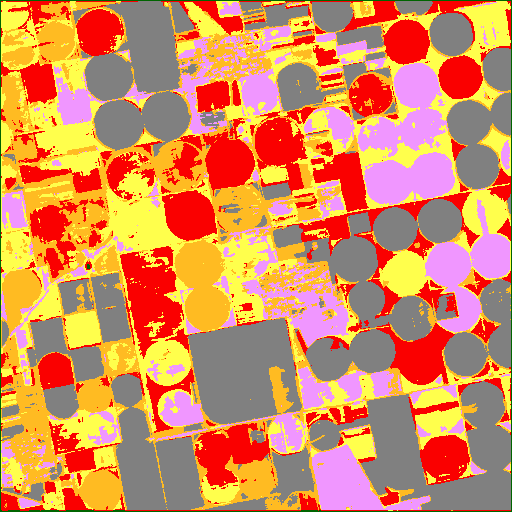 |
| Legend |  |
| JSON | [json](tile_6/unet_mask_claude-3-5-sonnet-20240620_vlm_categories.json) |

#### Per-class metrics

| Class Code | Class Name (EN) | IoU | Precision | Recall | F1 | Pixel Acc | Support True | Support Pred |
|------------|----------------|-----|-----------|--------|----|-----------|-------------|-------------|
| 10 | Tree cover | 0.0025 | 0.0046 | 0.0056 | 0.0051 |  |  |  |
| 20 | Shrubland | 0.0000 | 0.0000 | 0.0000 | 0.0000 |  |  |  |
| 30 | Grassland | 0.0318 | 0.0373 | 0.1778 | 0.0617 |  |  |  |
| 40 | Cropland | 0.1217 | 0.8523 | 0.1243 | 0.2170 |  |  |  |
| 50 | Built-up | 0.0006 | 0.0007 | 0.0086 | 0.0013 |  |  |  |
| 60 | Bare / sparse vegetation | 0.0003 | 0.0003 | 0.7143 | 0.0007 |  |  |  |
| 80 | Permanent water bodies | 0.0000 | 0.0000 | 0.0000 | 0.0000 |  |  |  |

### unet  claude-3-7-sonnet-20250219
| Metric | Value |
|--------|-------|
| accuracy | 0.7777 |
| iou | 0.1328 |
| f1 | 0.1478 |
| kappa | 0.0509 |
| Mask |  |
| Legend |  |
| JSON | [json](tile_6/unet_mask_claude-3-7-sonnet-20250219_vlm_categories.json) |

#### Per-class metrics

| Class Code | Class Name (EN) | IoU | Precision | Recall | F1 | Pixel Acc | Support True | Support Pred |
|------------|----------------|-----|-----------|--------|----|-----------|-------------|-------------|
| 10 | Tree cover | 0.0000 | 0.0000 | 0.0000 | 0.0000 |  |  |  |
| 30 | Grassland | 0.0000 | 0.0000 | 0.0000 | 0.0000 |  |  |  |
| 40 | Cropland | 0.7965 | 0.9515 | 0.8302 | 0.8867 |  |  |  |
| 50 | Built-up | 0.0000 | 0.0000 | 0.0000 | 0.0000 |  |  |  |
| 60 | Bare / sparse vegetation | 0.0000 | 0.0000 | 0.0571 | 0.0001 |  |  |  |
| 80 | Permanent water bodies | 0.0000 | 0.0000 | 0.0000 | 0.0000 |  |  |  |

### unet  gemini-2.5-pro-preview-05-06
| Metric | Value |
|--------|-------|
| accuracy | 0.5964 |
| iou | 0.1032 |
| f1 | 0.1281 |
| kappa | 0.0179 |
| Mask |  |
| Legend |  |
| JSON | [json](tile_6/unet_mask_gemini-2.5-pro-preview-05-06_vlm_categories.json) |

#### Per-class metrics

| Class Code | Class Name (EN) | IoU | Precision | Recall | F1 | Pixel Acc | Support True | Support Pred |
|------------|----------------|-----|-----------|--------|----|-----------|-------------|-------------|
| 10 | Tree cover | 0.0000 | 0.0000 | 0.0000 | 0.0000 |  |  |  |
| 30 | Grassland | 0.0000 | 0.0000 | 0.0000 | 0.0000 |  |  |  |
| 40 | Cropland | 0.6164 | 0.9525 | 0.6360 | 0.7627 |  |  |  |
| 50 | Built-up | 0.0030 | 0.0032 | 0.0385 | 0.0059 |  |  |  |
| 60 | Bare / sparse vegetation | 0.0000 | 0.0000 | 0.0571 | 0.0001 |  |  |  |
| 80 | Permanent water bodies | 0.0000 | 0.0000 | 0.0000 | 0.0000 |  |  |  |

### unet  gpt-4.1-2025-04-14
| Metric | Value |
|--------|-------|
| accuracy | 0.1294 |
| iou | 0.0304 |
| f1 | 0.0555 |
| kappa | -0.0121 |
| Mask |  |
| Legend |  |
| JSON | [json](tile_6/unet_mask_gpt-4.1-2025-04-14_vlm_categories.json) |

#### Per-class metrics

| Class Code | Class Name (EN) | IoU | Precision | Recall | F1 | Pixel Acc | Support True | Support Pred |
|------------|----------------|-----|-----------|--------|----|-----------|-------------|-------------|
| 10 | Tree cover | 0.0000 | 0.0000 | 0.0000 | 0.0000 |  |  |  |
| 30 | Grassland | 0.0559 | 0.0651 | 0.2820 | 0.1058 |  |  |  |
| 40 | Cropland | 0.1217 | 0.8523 | 0.1243 | 0.2170 |  |  |  |
| 50 | Built-up | 0.0050 | 0.0052 | 0.0973 | 0.0099 |  |  |  |
| 60 | Bare / sparse vegetation | 0.0000 | 0.0000 | 0.0286 | 0.0000 |  |  |  |
| 80 | Permanent water bodies | 0.0000 | 0.0000 | 0.0000 | 0.0000 |  |  |  |

### unet  gpt-4.1-mini-2025-04-14
| Metric | Value |
|--------|-------|
| accuracy | 0.4628 |
| iou | 0.0672 |
| f1 | 0.0916 |
| kappa | -0.0361 |
| Mask |  |
| Legend |  |
| JSON | [json](tile_6/unet_mask_gpt-4.1-mini-2025-04-14_vlm_categories.json) |

#### Per-class metrics

| Class Code | Class Name (EN) | IoU | Precision | Recall | F1 | Pixel Acc | Support True | Support Pred |
|------------|----------------|-----|-----------|--------|----|-----------|-------------|-------------|
| 10 | Tree cover | 0.0013 | 0.0013 | 0.0562 | 0.0026 |  |  |  |
| 20 | Shrubland | 0.0000 | 0.0000 | 0.0000 | 0.0000 |  |  |  |
| 30 | Grassland | 0.0000 | 0.0000 | 0.0000 | 0.0000 |  |  |  |
| 40 | Cropland | 0.4689 | 0.9035 | 0.4936 | 0.6384 |  |  |  |
| 50 | Built-up | 0.0000 | 0.0000 | 0.0000 | 0.0000 |  |  |  |
| 60 | Bare / sparse vegetation | 0.0000 | 0.0000 | 0.0000 | 0.0000 |  |  |  |
| 80 | Permanent water bodies | 0.0000 | 0.0000 | 0.0000 | 0.0000 |  |  |  |

### unet  gpt-4o-2024-08-06
| Metric | Value |
|--------|-------|
| accuracy | 0.4037 |
| iou | 0.0719 |
| f1 | 0.1026 |
| kappa | 0.0024 |
| Mask |  |
| Legend |  |
| JSON | [json](tile_6/unet_mask_gpt-4o-2024-08-06_vlm_categories.json) |

#### Per-class metrics

| Class Code | Class Name (EN) | IoU | Precision | Recall | F1 | Pixel Acc | Support True | Support Pred |
|------------|----------------|-----|-----------|--------|----|-----------|-------------|-------------|
| 10 | Tree cover | 0.0125 | 0.0129 | 0.3307 | 0.0248 |  |  |  |
| 30 | Grassland | 0.0000 | 0.0000 | 0.0000 | 0.0000 |  |  |  |
| 40 | Cropland | 0.4180 | 0.9449 | 0.4285 | 0.5896 |  |  |  |
| 50 | Built-up | 0.0006 | 0.0007 | 0.0086 | 0.0013 |  |  |  |
| 60 | Bare / sparse vegetation | 0.0000 | 0.0000 | 0.0000 | 0.0000 |  |  |  |
| 80 | Permanent water bodies | 0.0000 | 0.0000 | 0.0000 | 0.0000 |  |  |  |

### unet  gpt-4o-mini-2024-07-18
| Metric | Value |
|--------|-------|
| accuracy | 0.5558 |
| iou | 0.0979 |
| f1 | 0.1283 |
| kappa | -0.0237 |
| Mask | 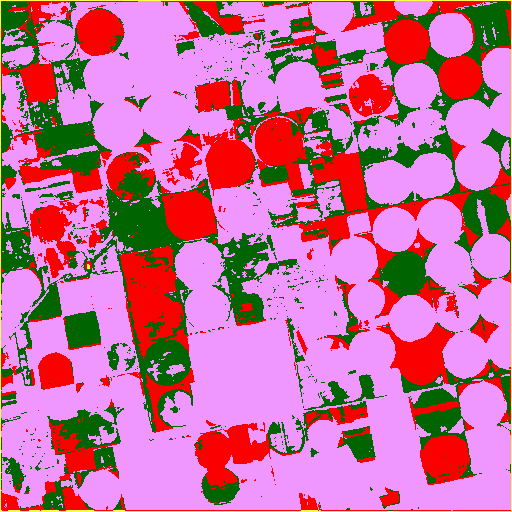 |
| Legend |  |
| JSON | [json](tile_6/unet_mask_gpt-4o-mini-2024-07-18_vlm_categories.json) |

#### Per-class metrics

| Class Code | Class Name (EN) | IoU | Precision | Recall | F1 | Pixel Acc | Support True | Support Pred |
|------------|----------------|-----|-----------|--------|----|-----------|-------------|-------------|
| 10 | Tree cover | 0.0108 | 0.0111 | 0.3133 | 0.0214 |  |  |  |
| 30 | Grassland | 0.0137 | 0.0797 | 0.0163 | 0.0270 |  |  |  |
| 40 | Cropland | 0.5625 | 0.9228 | 0.5903 | 0.7200 |  |  |  |
| 50 | Built-up | 0.0006 | 0.0007 | 0.0086 | 0.0013 |  |  |  |
| 60 | Bare / sparse vegetation | 0.0000 | 0.0000 | 0.0000 | 0.0000 |  |  |  |
| 80 | Permanent water bodies | 0.0000 | 0.0000 | 0.0000 | 0.0000 |  |  |  |

### unet  grok-2-vision-1212
| Metric | Value |
|--------|-------|
| accuracy | 0.3063 |
| iou | 0.0481 |
| f1 | 0.0753 |
| kappa | -0.0185 |
| Mask |  |
| Legend |  |
| JSON | [json](tile_6/unet_mask_grok-2-vision-1212_vlm_categories.json) |

#### Per-class metrics

| Class Code | Class Name (EN) | IoU | Precision | Recall | F1 | Pixel Acc | Support True | Support Pred |
|------------|----------------|-----|-----------|--------|----|-----------|-------------|-------------|
| 10 | Tree cover | 0.0056 | 0.0057 | 0.3870 | 0.0112 |  |  |  |
| 20 | Shrubland | 0.0000 | 0.0000 | 0.0000 | 0.0000 |  |  |  |
| 30 | Grassland | 0.0226 | 0.0266 | 0.1323 | 0.0443 |  |  |  |
| 40 | Cropland | 0.3086 | 0.9084 | 0.3185 | 0.4717 |  |  |  |
| 50 | Built-up | 0.0000 | 0.0000 | 0.0000 | 0.0000 |  |  |  |
| 60 | Bare / sparse vegetation | 0.0000 | 0.0000 | 0.0000 | 0.0000 |  |  |  |
| 80 | Permanent water bodies | 0.0000 | 0.0000 | 0.0000 | 0.0000 |  |  |  |

### unet  o4-mini
| Metric | Value |
|--------|-------|
| accuracy | 0.5964 |
| iou | 0.1032 |
| f1 | 0.1281 |
| kappa | 0.0179 |
| Mask |  |
| Legend |  |
| JSON | [json](tile_6/unet_mask_o4-mini_vlm_categories.json) |

#### Per-class metrics

| Class Code | Class Name (EN) | IoU | Precision | Recall | F1 | Pixel Acc | Support True | Support Pred |
|------------|----------------|-----|-----------|--------|----|-----------|-------------|-------------|
| 10 | Tree cover | 0.0000 | 0.0000 | 0.0000 | 0.0000 |  |  |  |
| 30 | Grassland | 0.0000 | 0.0000 | 0.0000 | 0.0000 |  |  |  |
| 40 | Cropland | 0.6164 | 0.9525 | 0.6360 | 0.7627 |  |  |  |
| 50 | Built-up | 0.0030 | 0.0032 | 0.0385 | 0.0059 |  |  |  |
| 60 | Bare / sparse vegetation | 0.0000 | 0.0000 | 0.0571 | 0.0001 |  |  |  |
| 80 | Permanent water bodies | 0.0000 | 0.0000 | 0.0000 | 0.0000 |  |  |  |

### watershed_kmeans  claude-3-5-haiku-20241022
| Metric | Value |
|--------|-------|
| accuracy | 0.0728 |
| iou | 0.0151 |
| f1 | 0.0286 |
| kappa | -0.0017 |
| Mask |  |
| Legend |  |
| JSON | [json](tile_6/watershed_kmeans_mask_claude-3-5-haiku-20241022_vlm_categories.json) |

#### Per-class metrics

| Class Code | Class Name (EN) | IoU | Precision | Recall | F1 | Pixel Acc | Support True | Support Pred |
|------------|----------------|-----|-----------|--------|----|-----------|-------------|-------------|
| 0 | Unknown | 0.0000 | 0.0000 | 0.0000 | 0.0000 |  |  |  |
| 10 | Tree cover | 0.0157 | 0.0164 | 0.2649 | 0.0308 |  |  |  |
| 30 | Grassland | 0.0159 | 0.0233 | 0.0480 | 0.0314 |  |  |  |
| 40 | Cropland | 0.0733 | 0.9459 | 0.0736 | 0.1366 |  |  |  |
| 50 | Built-up | 0.0008 | 0.0009 | 0.0069 | 0.0016 |  |  |  |
| 60 | Bare / sparse vegetation | 0.0000 | 0.0000 | 0.0000 | 0.0000 |  |  |  |
| 80 | Permanent water bodies | 0.0000 | 0.0000 | 0.0000 | 0.0000 |  |  |  |

### watershed_kmeans  claude-3-5-sonnet-20240620
| Metric | Value |
|--------|-------|
| accuracy | 0.2858 |
| iou | 0.0478 |
| f1 | 0.0767 |
| kappa | -0.0154 |
| Mask |  |
| Legend |  |
| JSON | [json](tile_6/watershed_kmeans_mask_claude-3-5-sonnet-20240620_vlm_categories.json) |

#### Per-class metrics

| Class Code | Class Name (EN) | IoU | Precision | Recall | F1 | Pixel Acc | Support True | Support Pred |
|------------|----------------|-----|-----------|--------|----|-----------|-------------|-------------|
| 10 | Tree cover | 0.0027 | 0.0029 | 0.0478 | 0.0054 |  |  |  |
| 20 | Shrubland | 0.0000 | 0.0000 | 0.0000 | 0.0000 |  |  |  |
| 30 | Grassland | 0.0424 | 0.0556 | 0.1513 | 0.0813 |  |  |  |
| 40 | Cropland | 0.2889 | 0.9038 | 0.2981 | 0.4483 |  |  |  |
| 50 | Built-up | 0.0008 | 0.0009 | 0.0069 | 0.0016 |  |  |  |
| 60 | Bare / sparse vegetation | 0.0001 | 0.0001 | 0.0857 | 0.0001 |  |  |  |
| 80 | Permanent water bodies | 0.0000 | 0.0000 | 0.0000 | 0.0000 |  |  |  |

### watershed_kmeans  claude-3-7-sonnet-20250219
| Metric | Value |
|--------|-------|
| accuracy | 0.3714 |
| iou | 0.0557 |
| f1 | 0.0803 |
| kappa | 0.0104 |
| Mask |  |
| Legend |  |
| JSON | [json](tile_6/watershed_kmeans_mask_claude-3-7-sonnet-20250219_vlm_categories.json) |

#### Per-class metrics

| Class Code | Class Name (EN) | IoU | Precision | Recall | F1 | Pixel Acc | Support True | Support Pred |
|------------|----------------|-----|-----------|--------|----|-----------|-------------|-------------|
| 0 | Unknown | 0.0000 | 0.0000 | 0.0000 | 0.0000 |  |  |  |
| 10 | Tree cover | 0.0000 | 0.0000 | 0.0000 | 0.0000 |  |  |  |
| 30 | Grassland | 0.0000 | 0.0000 | 0.0000 | 0.0000 |  |  |  |
| 40 | Cropland | 0.3896 | 0.9574 | 0.3965 | 0.5607 |  |  |  |
| 50 | Built-up | 0.0006 | 0.0007 | 0.0038 | 0.0011 |  |  |  |
| 60 | Bare / sparse vegetation | 0.0000 | 0.0000 | 0.0000 | 0.0000 |  |  |  |
| 80 | Permanent water bodies | 0.0000 | 0.0000 | 0.0000 | 0.0000 |  |  |  |

### watershed_kmeans  gemini-2.5-pro-preview-05-06
| Metric | Value |
|--------|-------|
| accuracy | 0.5659 |
| iou | 0.0987 |
| f1 | 0.1251 |
| kappa | 0.0230 |
| Mask |  |
| Legend |  |
| JSON | [json](tile_6/watershed_kmeans_mask_gemini-2.5-pro-preview-05-06_vlm_categories.json) |

#### Per-class metrics

| Class Code | Class Name (EN) | IoU | Precision | Recall | F1 | Pixel Acc | Support True | Support Pred |
|------------|----------------|-----|-----------|--------|----|-----------|-------------|-------------|
| 10 | Tree cover | 0.0000 | 0.0000 | 0.0000 | 0.0000 |  |  |  |
| 30 | Grassland | 0.0000 | 0.0000 | 0.0000 | 0.0000 |  |  |  |
| 40 | Cropland | 0.5871 | 0.9559 | 0.6034 | 0.7398 |  |  |  |
| 50 | Built-up | 0.0053 | 0.0061 | 0.0419 | 0.0106 |  |  |  |
| 60 | Bare / sparse vegetation | 0.0000 | 0.0000 | 0.0000 | 0.0000 |  |  |  |
| 80 | Permanent water bodies | 0.0000 | 0.0000 | 0.0000 | 0.0000 |  |  |  |

### watershed_kmeans  gpt-4.1-2025-04-14
| Metric | Value |
|--------|-------|
| accuracy | 0.3418 |
| iou | 0.0706 |
| f1 | 0.1096 |
| kappa | 0.0310 |
| Mask |  |
| Legend |  |
| JSON | [json](tile_6/watershed_kmeans_mask_gpt-4.1-2025-04-14_vlm_categories.json) |

#### Per-class metrics

| Class Code | Class Name (EN) | IoU | Precision | Recall | F1 | Pixel Acc | Support True | Support Pred |
|------------|----------------|-----|-----------|--------|----|-----------|-------------|-------------|
| 10 | Tree cover | 0.0000 | 0.0000 | 0.0000 | 0.0000 |  |  |  |
| 30 | Grassland | 0.0717 | 0.0836 | 0.3348 | 0.1338 |  |  |  |
| 40 | Cropland | 0.3477 | 0.9815 | 0.3500 | 0.5160 |  |  |  |
| 50 | Built-up | 0.0039 | 0.0047 | 0.0215 | 0.0077 |  |  |  |
| 60 | Bare / sparse vegetation | 0.0000 | 0.0000 | 0.0286 | 0.0000 |  |  |  |
| 80 | Permanent water bodies | 0.0001 | 0.0001 | 0.1538 | 0.0002 |  |  |  |

### watershed_kmeans  gpt-4.1-mini-2025-04-14
| Metric | Value |
|--------|-------|
| accuracy | 0.6044 |
| iou | 0.1043 |
| f1 | 0.1299 |
| kappa | -0.0129 |
| Mask |  |
| Legend |  |
| JSON | [json](tile_6/watershed_kmeans_mask_gpt-4.1-mini-2025-04-14_vlm_categories.json) |

#### Per-class metrics

| Class Code | Class Name (EN) | IoU | Precision | Recall | F1 | Pixel Acc | Support True | Support Pred |
|------------|----------------|-----|-----------|--------|----|-----------|-------------|-------------|
| 10 | Tree cover | 0.0000 | 0.0000 | 0.0000 | 0.0000 |  |  |  |
| 30 | Grassland | 0.0027 | 0.0036 | 0.0110 | 0.0054 |  |  |  |
| 40 | Cropland | 0.6176 | 0.9376 | 0.6440 | 0.7636 |  |  |  |
| 50 | Built-up | 0.0053 | 0.0061 | 0.0419 | 0.0106 |  |  |  |
| 60 | Bare / sparse vegetation | 0.0000 | 0.0000 | 0.0000 | 0.0000 |  |  |  |
| 80 | Permanent water bodies | 0.0000 | 0.0000 | 0.0000 | 0.0000 |  |  |  |

### watershed_kmeans  gpt-4o-2024-08-06
| Metric | Value |
|--------|-------|
| accuracy | 0.0000 |
| iou | 0.0000 |
| f1 | 0.0000 |
| kappa | 0.0000 |
| Mask |  |
| Legend |  |
| JSON | [json](tile_6/watershed_kmeans_mask_gpt-4o-2024-08-06_vlm_categories.json) |

#### Per-class metrics

| Class Code | Class Name (EN) | IoU | Precision | Recall | F1 | Pixel Acc | Support True | Support Pred |
|------------|----------------|-----|-----------|--------|----|-----------|-------------|-------------|
| 0 | Unknown | 0.0000 | 0.0000 | 0.0000 | 0.0000 |  |  |  |
| 10 | Tree cover | 0.0000 | 0.0000 | 0.0000 | 0.0000 |  |  |  |
| 30 | Grassland | 0.0000 | 0.0000 | 0.0000 | 0.0000 |  |  |  |
| 40 | Cropland | 0.0000 | 0.0000 | 0.0000 | 0.0000 |  |  |  |
| 50 | Built-up | 0.0000 | 0.0000 | 0.0000 | 0.0000 |  |  |  |
| 60 | Bare / sparse vegetation | 0.0000 | 0.0000 | 0.0000 | 0.0000 |  |  |  |
| 80 | Permanent water bodies | 0.0000 | 0.0000 | 0.0000 | 0.0000 |  |  |  |

### watershed_kmeans  gpt-4o-mini-2024-07-18
| Metric | Value |
|--------|-------|
| accuracy | 0.1725 |
| iou | 0.0271 |
| f1 | 0.0465 |
| kappa | -0.0091 |
| Mask |  |
| Legend |  |
| JSON | [json](tile_6/watershed_kmeans_mask_gpt-4o-mini-2024-07-18_vlm_categories.json) |

#### Per-class metrics

| Class Code | Class Name (EN) | IoU | Precision | Recall | F1 | Pixel Acc | Support True | Support Pred |
|------------|----------------|-----|-----------|--------|----|-----------|-------------|-------------|
| 10 | Tree cover | 0.0057 | 0.0058 | 0.2272 | 0.0113 |  |  |  |
| 20 | Shrubland | 0.0000 | 0.0000 | 0.0000 | 0.0000 |  |  |  |
| 30 | Grassland | 0.0038 | 0.0049 | 0.0157 | 0.0075 |  |  |  |
| 40 | Cropland | 0.1792 | 0.9315 | 0.1816 | 0.3040 |  |  |  |
| 50 | Built-up | 0.0014 | 0.0015 | 0.0110 | 0.0027 |  |  |  |
| 60 | Bare / sparse vegetation | 0.0000 | 0.0000 | 0.0000 | 0.0000 |  |  |  |
| 80 | Permanent water bodies | 0.0000 | 0.0000 | 0.0000 | 0.0000 |  |  |  |

### watershed_kmeans  grok-2-vision-1212
| Metric | Value |
|--------|-------|
| accuracy | 0.1933 |
| iou | 0.0283 |
| f1 | 0.0480 |
| kappa | 0.0057 |
| Mask |  |
| Legend |  |
| JSON | [json](tile_6/watershed_kmeans_mask_grok-2-vision-1212_vlm_categories.json) |

#### Per-class metrics

| Class Code | Class Name (EN) | IoU | Precision | Recall | F1 | Pixel Acc | Support True | Support Pred |
|------------|----------------|-----|-----------|--------|----|-----------|-------------|-------------|
| 0 | Unknown | 0.0000 | 0.0000 | 0.0000 | 0.0000 |  |  |  |
| 10 | Tree cover | 0.0027 | 0.0029 | 0.0478 | 0.0054 |  |  |  |
| 20 | Shrubland | 0.0000 | 0.0000 | 0.0000 | 0.0000 |  |  |  |
| 30 | Grassland | 0.0159 | 0.0233 | 0.0480 | 0.0314 |  |  |  |
| 40 | Cropland | 0.2022 | 0.9759 | 0.2033 | 0.3364 |  |  |  |
| 50 | Built-up | 0.0053 | 0.0061 | 0.0419 | 0.0106 |  |  |  |
| 60 | Bare / sparse vegetation | 0.0000 | 0.0000 | 0.0000 | 0.0000 |  |  |  |
| 80 | Permanent water bodies | 0.0000 | 0.0000 | 0.0000 | 0.0000 |  |  |  |

### watershed_kmeans  o4-mini
| Metric | Value |
|--------|-------|
| accuracy | 0.3063 |
| iou | 0.0627 |
| f1 | 0.0994 |
| kappa | 0.0161 |
| Mask |  |
| Legend |  |
| JSON | [json](tile_6/watershed_kmeans_mask_o4-mini_vlm_categories.json) |

#### Per-class metrics

| Class Code | Class Name (EN) | IoU | Precision | Recall | F1 | Pixel Acc | Support True | Support Pred |
|------------|----------------|-----|-----------|--------|----|-----------|-------------|-------------|
| 10 | Tree cover | 0.0122 | 0.0127 | 0.2503 | 0.0241 |  |  |  |
| 30 | Grassland | 0.0478 | 0.0655 | 0.1500 | 0.0912 |  |  |  |
| 40 | Cropland | 0.3152 | 0.9677 | 0.3186 | 0.4793 |  |  |  |
| 50 | Built-up | 0.0006 | 0.0007 | 0.0038 | 0.0011 |  |  |  |
| 60 | Bare / sparse vegetation | 0.0004 | 0.0004 | 0.9714 | 0.0008 |  |  |  |
| 80 | Permanent water bodies | 0.0000 | 0.0000 | 0.0000 | 0.0000 |  |  |  |

### watershed_ndvi  claude-3-5-haiku-20241022
| Metric | Value |
|--------|-------|
| accuracy | 0.0131 |
| iou | 0.0061 |
| f1 | 0.0120 |
| kappa | 0.0049 |
| Mask | 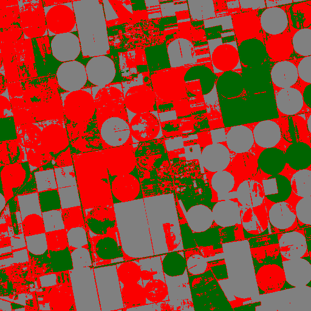 |
| Legend |  |
| JSON | [json](tile_6/watershed_ndvi_mask_claude-3-5-haiku-20241022_vlm_categories.json) |

#### Per-class metrics

| Class Code | Class Name (EN) | IoU | Precision | Recall | F1 | Pixel Acc | Support True | Support Pred |
|------------|----------------|-----|-----------|--------|----|-----------|-------------|-------------|
| 10 | Tree cover | 0.0130 | 0.0132 | 0.4258 | 0.0256 |  |  |  |
| 30 | Grassland | 0.0000 | 0.0000 | 0.0000 | 0.0000 |  |  |  |
| 40 | Cropland | 0.0000 | 0.0000 | 0.0000 | 0.0000 |  |  |  |
| 50 | Built-up | 0.0236 | 0.0240 | 0.6326 | 0.0462 |  |  |  |
| 60 | Bare / sparse vegetation | 0.0002 | 0.0002 | 0.6571 | 0.0005 |  |  |  |
| 80 | Permanent water bodies | 0.0000 | 0.0000 | 0.0000 | 0.0000 |  |  |  |

### watershed_ndvi  claude-3-5-sonnet-20240620
| Metric | Value |
|--------|-------|
| accuracy | 0.1998 |
| iou | 0.0359 |
| f1 | 0.0604 |
| kappa | -0.0177 |
| Mask |  |
| Legend |  |
| JSON | [json](tile_6/watershed_ndvi_mask_claude-3-5-sonnet-20240620_vlm_categories.json) |

#### Per-class metrics

| Class Code | Class Name (EN) | IoU | Precision | Recall | F1 | Pixel Acc | Support True | Support Pred |
|------------|----------------|-----|-----------|--------|----|-----------|-------------|-------------|
| 10 | Tree cover | 0.0073 | 0.0073 | 0.4544 | 0.0144 |  |  |  |
| 30 | Grassland | 0.0000 | 0.0000 | 0.0000 | 0.0000 |  |  |  |
| 40 | Cropland | 0.2025 | 0.8888 | 0.2078 | 0.3368 |  |  |  |
| 50 | Built-up | 0.0056 | 0.0058 | 0.1301 | 0.0110 |  |  |  |
| 60 | Bare / sparse vegetation | 0.0000 | 0.0000 | 0.0000 | 0.0000 |  |  |  |
| 80 | Permanent water bodies | 0.0000 | 0.0000 | 0.0000 | 0.0000 |  |  |  |

### watershed_ndvi  claude-3-7-sonnet-20250219
| Metric | Value |
|--------|-------|
| accuracy | 0.5578 |
| iou | 0.0983 |
| f1 | 0.1282 |
| kappa | 0.0196 |
| Mask |  |
| Legend |  |
| JSON | [json](tile_6/watershed_ndvi_mask_claude-3-7-sonnet-20250219_vlm_categories.json) |

#### Per-class metrics

| Class Code | Class Name (EN) | IoU | Precision | Recall | F1 | Pixel Acc | Support True | Support Pred |
|------------|----------------|-----|-----------|--------|----|-----------|-------------|-------------|
| 10 | Tree cover | 0.0000 | 0.0000 | 0.0000 | 0.0000 |  |  |  |
| 30 | Grassland | 0.0000 | 0.0000 | 0.0000 | 0.0000 |  |  |  |
| 40 | Cropland | 0.5659 | 0.9462 | 0.5847 | 0.7228 |  |  |  |
| 50 | Built-up | 0.0236 | 0.0240 | 0.6326 | 0.0462 |  |  |  |
| 60 | Bare / sparse vegetation | 0.0000 | 0.0000 | 0.0000 | 0.0000 |  |  |  |
| 80 | Permanent water bodies | 0.0000 | 0.0000 | 0.0000 | 0.0000 |  |  |  |

### watershed_ndvi  gemini-2.5-pro-preview-05-06
| Metric | Value |
|--------|-------|
| accuracy | 0.9367 |
| iou | 0.1561 |
| f1 | 0.1612 |
| kappa | 0.0000 |
| Mask |  |
| Legend |  |
| JSON | [json](tile_6/watershed_ndvi_mask_gemini-2.5-pro-preview-05-06_vlm_categories.json) |

#### Per-class metrics

| Class Code | Class Name (EN) | IoU | Precision | Recall | F1 | Pixel Acc | Support True | Support Pred |
|------------|----------------|-----|-----------|--------|----|-----------|-------------|-------------|
| 10 | Tree cover | 0.0000 | 0.0000 | 0.0000 | 0.0000 |  |  |  |
| 30 | Grassland | 0.0000 | 0.0000 | 0.0000 | 0.0000 |  |  |  |
| 40 | Cropland | 0.9367 | 0.9367 | 1.0000 | 0.9673 |  |  |  |
| 50 | Built-up | 0.0000 | 0.0000 | 0.0000 | 0.0000 |  |  |  |
| 60 | Bare / sparse vegetation | 0.0000 | 0.0000 | 0.0000 | 0.0000 |  |  |  |
| 80 | Permanent water bodies | 0.0000 | 0.0000 | 0.0000 | 0.0000 |  |  |  |

### watershed_ndvi  gpt-4.1-2025-04-14
| Metric | Value |
|--------|-------|
| accuracy | 0.0052 |
| iou | 0.0022 |
| f1 | 0.0043 |
| kappa | -0.0035 |
| Mask |  |
| Legend |  |
| JSON | [json](tile_6/watershed_ndvi_mask_gpt-4.1-2025-04-14_vlm_categories.json) |

#### Per-class metrics

| Class Code | Class Name (EN) | IoU | Precision | Recall | F1 | Pixel Acc | Support True | Support Pred |
|------------|----------------|-----|-----------|--------|----|-----------|-------------|-------------|
| 10 | Tree cover | 0.0073 | 0.0073 | 0.4544 | 0.0144 |  |  |  |
| 30 | Grassland | 0.0000 | 0.0000 | 0.0000 | 0.0000 |  |  |  |
| 40 | Cropland | 0.0000 | 0.0000 | 0.0000 | 0.0000 |  |  |  |
| 50 | Built-up | 0.0056 | 0.0058 | 0.1301 | 0.0110 |  |  |  |
| 60 | Bare / sparse vegetation | 0.0002 | 0.0002 | 0.2571 | 0.0003 |  |  |  |
| 80 | Permanent water bodies | 0.0000 | 0.0000 | 0.0000 | 0.0000 |  |  |  |

### watershed_ndvi  gpt-4.1-mini-2025-04-14
| Metric | Value |
|--------|-------|
| accuracy | 0.9367 |
| iou | 0.1561 |
| f1 | 0.1612 |
| kappa | 0.0000 |
| Mask |  |
| Legend |  |
| JSON | [json](tile_6/watershed_ndvi_mask_gpt-4.1-mini-2025-04-14_vlm_categories.json) |

#### Per-class metrics

| Class Code | Class Name (EN) | IoU | Precision | Recall | F1 | Pixel Acc | Support True | Support Pred |
|------------|----------------|-----|-----------|--------|----|-----------|-------------|-------------|
| 10 | Tree cover | 0.0000 | 0.0000 | 0.0000 | 0.0000 |  |  |  |
| 30 | Grassland | 0.0000 | 0.0000 | 0.0000 | 0.0000 |  |  |  |
| 40 | Cropland | 0.9367 | 0.9367 | 1.0000 | 0.9673 |  |  |  |
| 50 | Built-up | 0.0000 | 0.0000 | 0.0000 | 0.0000 |  |  |  |
| 60 | Bare / sparse vegetation | 0.0000 | 0.0000 | 0.0000 | 0.0000 |  |  |  |
| 80 | Permanent water bodies | 0.0000 | 0.0000 | 0.0000 | 0.0000 |  |  |  |

### watershed_ndvi  gpt-4o-2024-08-06
| Metric | Value |
|--------|-------|
| accuracy | 0.0000 |
| iou | 0.0000 |
| f1 | 0.0000 |
| kappa | 0.0000 |
| Mask |  |
| Legend |  |
| JSON | [json](tile_6/watershed_ndvi_mask_gpt-4o-2024-08-06_vlm_categories.json) |

#### Per-class metrics

| Class Code | Class Name (EN) | IoU | Precision | Recall | F1 | Pixel Acc | Support True | Support Pred |
|------------|----------------|-----|-----------|--------|----|-----------|-------------|-------------|
| 0 | Unknown | 0.0000 | 0.0000 | 0.0000 | 0.0000 |  |  |  |
| 10 | Tree cover | 0.0000 | 0.0000 | 0.0000 | 0.0000 |  |  |  |
| 30 | Grassland | 0.0000 | 0.0000 | 0.0000 | 0.0000 |  |  |  |
| 40 | Cropland | 0.0000 | 0.0000 | 0.0000 | 0.0000 |  |  |  |
| 50 | Built-up | 0.0000 | 0.0000 | 0.0000 | 0.0000 |  |  |  |
| 60 | Bare / sparse vegetation | 0.0000 | 0.0000 | 0.0000 | 0.0000 |  |  |  |
| 80 | Permanent water bodies | 0.0000 | 0.0000 | 0.0000 | 0.0000 |  |  |  |

### watershed_ndvi  gpt-4o-mini-2024-07-18
| Metric | Value |
|--------|-------|
| accuracy | 0.1978 |
| iou | 0.0350 |
| f1 | 0.0586 |
| kappa | -0.0129 |
| Mask |  |
| Legend |  |
| JSON | [json](tile_6/watershed_ndvi_mask_gpt-4o-mini-2024-07-18_vlm_categories.json) |

#### Per-class metrics

| Class Code | Class Name (EN) | IoU | Precision | Recall | F1 | Pixel Acc | Support True | Support Pred |
|------------|----------------|-----|-----------|--------|----|-----------|-------------|-------------|
| 10 | Tree cover | 0.0073 | 0.0073 | 0.4544 | 0.0144 |  |  |  |
| 30 | Grassland | 0.0000 | 0.0000 | 0.0000 | 0.0000 |  |  |  |
| 40 | Cropland | 0.2025 | 0.8888 | 0.2078 | 0.3368 |  |  |  |
| 50 | Built-up | 0.0000 | 0.0000 | 0.0000 | 0.0000 |  |  |  |
| 60 | Bare / sparse vegetation | 0.0002 | 0.0002 | 0.6571 | 0.0005 |  |  |  |
| 80 | Permanent water bodies | 0.0000 | 0.0000 | 0.0000 | 0.0000 |  |  |  |

### watershed_ndvi  grok-2-vision-1212
| Metric | Value |
|--------|-------|
| accuracy | 0.5477 |
| iou | 0.0808 |
| f1 | 0.1033 |
| kappa | 0.0120 |
| Mask |  |
| Legend |  |
| JSON | [json](tile_6/watershed_ndvi_mask_grok-2-vision-1212_vlm_categories.json) |

#### Per-class metrics

| Class Code | Class Name (EN) | IoU | Precision | Recall | F1 | Pixel Acc | Support True | Support Pred |
|------------|----------------|-----|-----------|--------|----|-----------|-------------|-------------|
| 0 | Unknown | 0.0000 | 0.0000 | 0.0000 | 0.0000 |  |  |  |
| 10 | Tree cover | 0.0000 | 0.0000 | 0.0000 | 0.0000 |  |  |  |
| 30 | Grassland | 0.0000 | 0.0000 | 0.0000 | 0.0000 |  |  |  |
| 40 | Cropland | 0.5659 | 0.9462 | 0.5847 | 0.7228 |  |  |  |
| 50 | Built-up | 0.0000 | 0.0000 | 0.0000 | 0.0000 |  |  |  |
| 60 | Bare / sparse vegetation | 0.0000 | 0.0000 | 0.0000 | 0.0000 |  |  |  |
| 80 | Permanent water bodies | 0.0000 | 0.0000 | 0.0000 | 0.0000 |  |  |  |

### watershed_ndvi  o4-mini
| Metric | Value |
|--------|-------|
| accuracy | 0.0052 |
| iou | 0.0022 |
| f1 | 0.0043 |
| kappa | -0.0035 |
| Mask |  |
| Legend |  |
| JSON | [json](tile_6/watershed_ndvi_mask_o4-mini_vlm_categories.json) |

#### Per-class metrics

| Class Code | Class Name (EN) | IoU | Precision | Recall | F1 | Pixel Acc | Support True | Support Pred |
|------------|----------------|-----|-----------|--------|----|-----------|-------------|-------------|
| 10 | Tree cover | 0.0073 | 0.0073 | 0.4544 | 0.0144 |  |  |  |
| 30 | Grassland | 0.0000 | 0.0000 | 0.0000 | 0.0000 |  |  |  |
| 40 | Cropland | 0.0000 | 0.0000 | 0.0000 | 0.0000 |  |  |  |
| 50 | Built-up | 0.0056 | 0.0058 | 0.1301 | 0.0110 |  |  |  |
| 60 | Bare / sparse vegetation | 0.0002 | 0.0002 | 0.2571 | 0.0003 |  |  |  |
| 80 | Permanent water bodies | 0.0000 | 0.0000 | 0.0000 | 0.0000 |  |  |  |

---

## Tile 7
### Source Images
| Type | Image |
|------|-------|
| TCI (RGB) |  |
| WorldCover Ground Truth |  |

### kmeans  Segmentation Masks
| Type | Image |
|------|-------|
| Segmentation Mask |  |

### som  Segmentation Masks
| Type | Image |
|------|-------|
| Segmentation Mask |  |

### unet  Segmentation Masks
| Type | Image |
|------|-------|
| Segmentation Mask |  |

### watershed_kmeans  Segmentation Masks
| Type | Image |
|------|-------|
| Segmentation Mask |  |

### watershed_ndvi  Segmentation Masks
| Type | Image |
|------|-------|
| Segmentation Mask |  |

### kmeans  claude-3-5-haiku-20241022
| Metric | Value |
|--------|-------|
| accuracy | 0.1829 |
| iou | 0.0439 |
| f1 | 0.0762 |
| kappa | 0.0153 |
| Mask |  |
| Legend |  |
| JSON | [json](tile_7/kmeans_mask_claude-3-5-haiku-20241022_vlm_categories.json) |

#### Per-class metrics

| Class Code | Class Name (EN) | IoU | Precision | Recall | F1 | Pixel Acc | Support True | Support Pred |
|------------|----------------|-----|-----------|--------|----|-----------|-------------|-------------|
| 10 | Tree cover | 0.1289 | 0.1369 | 0.6881 | 0.2283 |  |  |  |
| 30 | Grassland | 0.0000 | 0.0000 | 0.0000 | 0.0000 |  |  |  |
| 40 | Cropland | 0.1734 | 0.8648 | 0.1783 | 0.2956 |  |  |  |
| 50 | Built-up | 0.0045 | 0.0052 | 0.0331 | 0.0090 |  |  |  |
| 60 | Bare / sparse vegetation | 0.0002 | 0.0002 | 0.5714 | 0.0005 |  |  |  |
| 80 | Permanent water bodies | 0.0000 | 0.0000 | 0.0004 | 0.0000 |  |  |  |
| 90 | Herbaceous wetland | 0.0000 | 0.0000 | 0.0000 | 0.0000 |  |  |  |

### kmeans  claude-3-5-sonnet-20240620
| Metric | Value |
|--------|-------|
| accuracy | 0.1577 |
| iou | 0.0300 |
| f1 | 0.0526 |
| kappa | -0.0185 |
| Mask | 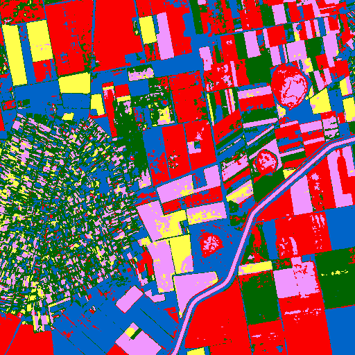 |
| Legend |  |
| JSON | [json](tile_7/kmeans_mask_claude-3-5-sonnet-20240620_vlm_categories.json) |

#### Per-class metrics

| Class Code | Class Name (EN) | IoU | Precision | Recall | F1 | Pixel Acc | Support True | Support Pred |
|------------|----------------|-----|-----------|--------|----|-----------|-------------|-------------|
| 10 | Tree cover | 0.0240 | 0.0282 | 0.1366 | 0.0468 |  |  |  |
| 30 | Grassland | 0.0065 | 0.0115 | 0.0150 | 0.0130 |  |  |  |
| 40 | Cropland | 0.1734 | 0.8648 | 0.1783 | 0.2956 |  |  |  |
| 50 | Built-up | 0.0045 | 0.0052 | 0.0331 | 0.0090 |  |  |  |
| 60 | Bare / sparse vegetation | 0.0000 | 0.0000 | 0.0000 | 0.0000 |  |  |  |
| 80 | Permanent water bodies | 0.0018 | 0.0019 | 0.0460 | 0.0036 |  |  |  |
| 90 | Herbaceous wetland | 0.0000 | 0.0000 | 0.0000 | 0.0000 |  |  |  |

### kmeans  claude-3-7-sonnet-20250219
| Metric | Value |
|--------|-------|
| accuracy | 0.5901 |
| iou | 0.0911 |
| f1 | 0.1123 |
| kappa | 0.0216 |
| Mask |  |
| Legend |  |
| JSON | [json](tile_7/kmeans_mask_claude-3-7-sonnet-20250219_vlm_categories.json) |

#### Per-class metrics

| Class Code | Class Name (EN) | IoU | Precision | Recall | F1 | Pixel Acc | Support True | Support Pred |
|------------|----------------|-----|-----------|--------|----|-----------|-------------|-------------|
| 10 | Tree cover | 0.0063 | 0.0109 | 0.0145 | 0.0124 |  |  |  |
| 30 | Grassland | 0.0000 | 0.0000 | 0.0000 | 0.0000 |  |  |  |
| 40 | Cropland | 0.6311 | 0.8533 | 0.7079 | 0.7738 |  |  |  |
| 50 | Built-up | 0.0000 | 0.0000 | 0.0000 | 0.0000 |  |  |  |
| 60 | Bare / sparse vegetation | 0.0000 | 0.0000 | 0.0000 | 0.0000 |  |  |  |
| 80 | Permanent water bodies | 0.0000 | 0.0000 | 0.0004 | 0.0000 |  |  |  |
| 90 | Herbaceous wetland | 0.0000 | 0.0000 | 0.0000 | 0.0000 |  |  |  |

### kmeans  gemini-2.5-pro-preview-05-06
| Metric | Value |
|--------|-------|
| accuracy | 0.6245 |
| iou | 0.0918 |
| f1 | 0.1118 |
| kappa | -0.0394 |
| Mask |  |
| Legend |  |
| JSON | [json](tile_7/kmeans_mask_gemini-2.5-pro-preview-05-06_vlm_categories.json) |

#### Per-class metrics

| Class Code | Class Name (EN) | IoU | Precision | Recall | F1 | Pixel Acc | Support True | Support Pred |
|------------|----------------|-----|-----------|--------|----|-----------|-------------|-------------|
| 10 | Tree cover | 0.0000 | 0.0000 | 0.0000 | 0.0000 |  |  |  |
| 30 | Grassland | 0.0000 | 0.0000 | 0.0000 | 0.0000 |  |  |  |
| 40 | Cropland | 0.6421 | 0.8168 | 0.7501 | 0.7820 |  |  |  |
| 50 | Built-up | 0.0000 | 0.0000 | 0.0000 | 0.0000 |  |  |  |
| 60 | Bare / sparse vegetation | 0.0002 | 0.0002 | 0.5714 | 0.0005 |  |  |  |
| 80 | Permanent water bodies | 0.0000 | 0.0000 | 0.0000 | 0.0000 |  |  |  |
| 90 | Herbaceous wetland | 0.0000 | 0.0000 | 0.0000 | 0.0000 |  |  |  |

### kmeans  gpt-4.1-2025-04-14
| Metric | Value |
|--------|-------|
| accuracy | 0.1913 |
| iou | 0.0601 |
| f1 | 0.1053 |
| kappa | 0.0409 |
| Mask |  |
| Legend |  |
| JSON | [json](tile_7/kmeans_mask_gpt-4.1-2025-04-14_vlm_categories.json) |

#### Per-class metrics

| Class Code | Class Name (EN) | IoU | Precision | Recall | F1 | Pixel Acc | Support True | Support Pred |
|------------|----------------|-----|-----------|--------|----|-----------|-------------|-------------|
| 10 | Tree cover | 0.1289 | 0.1369 | 0.6881 | 0.2283 |  |  |  |
| 30 | Grassland | 0.0000 | 0.0000 | 0.0000 | 0.0000 |  |  |  |
| 40 | Cropland | 0.1759 | 0.9409 | 0.1778 | 0.2991 |  |  |  |
| 50 | Built-up | 0.0045 | 0.0052 | 0.0331 | 0.0090 |  |  |  |
| 60 | Bare / sparse vegetation | 0.0000 | 0.0000 | 0.1429 | 0.0000 |  |  |  |
| 80 | Permanent water bodies | 0.1113 | 0.1127 | 0.8984 | 0.2003 |  |  |  |
| 90 | Herbaceous wetland | 0.0000 | 0.0000 | 0.0000 | 0.0000 |  |  |  |

### kmeans  gpt-4.1-mini-2025-04-14
| Metric | Value |
|--------|-------|
| accuracy | 0.3420 |
| iou | 0.0590 |
| f1 | 0.0888 |
| kappa | 0.0038 |
| Mask |  |
| Legend |  |
| JSON | [json](tile_7/kmeans_mask_gpt-4.1-mini-2025-04-14_vlm_categories.json) |

#### Per-class metrics

| Class Code | Class Name (EN) | IoU | Precision | Recall | F1 | Pixel Acc | Support True | Support Pred |
|------------|----------------|-----|-----------|--------|----|-----------|-------------|-------------|
| 10 | Tree cover | 0.0000 | 0.0000 | 0.0000 | 0.0000 |  |  |  |
| 30 | Grassland | 0.0000 | 0.0000 | 0.0000 | 0.0000 |  |  |  |
| 40 | Cropland | 0.3722 | 0.8524 | 0.3978 | 0.5425 |  |  |  |
| 50 | Built-up | 0.0045 | 0.0052 | 0.0331 | 0.0090 |  |  |  |
| 60 | Bare / sparse vegetation | 0.0002 | 0.0002 | 0.5714 | 0.0005 |  |  |  |
| 80 | Permanent water bodies | 0.0362 | 0.0363 | 0.9443 | 0.0700 |  |  |  |
| 90 | Herbaceous wetland | 0.0000 | 0.0000 | 0.0000 | 0.0000 |  |  |  |

### kmeans  gpt-4o-2024-08-06
| Metric | Value |
|--------|-------|
| accuracy | 0.0000 |
| iou | 0.0000 |
| f1 | 0.0000 |
| kappa | 0.0000 |
| Mask |  |
| Legend |  |
| JSON | [json](tile_7/kmeans_mask_gpt-4o-2024-08-06_vlm_categories.json) |

#### Per-class metrics

| Class Code | Class Name (EN) | IoU | Precision | Recall | F1 | Pixel Acc | Support True | Support Pred |
|------------|----------------|-----|-----------|--------|----|-----------|-------------|-------------|
| 0 | Unknown | 0.0000 | 0.0000 | 0.0000 | 0.0000 |  |  |  |
| 10 | Tree cover | 0.0000 | 0.0000 | 0.0000 | 0.0000 |  |  |  |
| 30 | Grassland | 0.0000 | 0.0000 | 0.0000 | 0.0000 |  |  |  |
| 40 | Cropland | 0.0000 | 0.0000 | 0.0000 | 0.0000 |  |  |  |
| 50 | Built-up | 0.0000 | 0.0000 | 0.0000 | 0.0000 |  |  |  |
| 60 | Bare / sparse vegetation | 0.0000 | 0.0000 | 0.0000 | 0.0000 |  |  |  |
| 80 | Permanent water bodies | 0.0000 | 0.0000 | 0.0000 | 0.0000 |  |  |  |
| 90 | Herbaceous wetland | 0.0000 | 0.0000 | 0.0000 | 0.0000 |  |  |  |

### kmeans  gpt-4o-mini-2024-07-18
| Metric | Value |
|--------|-------|
| accuracy | 0.1821 |
| iou | 0.0430 |
| f1 | 0.0755 |
| kappa | 0.0254 |
| Mask |  |
| Legend |  |
| JSON | [json](tile_7/kmeans_mask_gpt-4o-mini-2024-07-18_vlm_categories.json) |

#### Per-class metrics

| Class Code | Class Name (EN) | IoU | Precision | Recall | F1 | Pixel Acc | Support True | Support Pred |
|------------|----------------|-----|-----------|--------|----|-----------|-------------|-------------|
| 10 | Tree cover | 0.0181 | 0.0207 | 0.1266 | 0.0355 |  |  |  |
| 30 | Grassland | 0.1070 | 0.1163 | 0.5718 | 0.1933 |  |  |  |
| 40 | Cropland | 0.1759 | 0.9409 | 0.1778 | 0.2991 |  |  |  |
| 50 | Built-up | 0.0000 | 0.0000 | 0.0000 | 0.0000 |  |  |  |
| 60 | Bare / sparse vegetation | 0.0002 | 0.0002 | 0.5714 | 0.0005 |  |  |  |
| 80 | Permanent water bodies | 0.0000 | 0.0000 | 0.0000 | 0.0000 |  |  |  |
| 90 | Herbaceous wetland | 0.0001 | 0.0001 | 0.0021 | 0.0002 |  |  |  |

### kmeans  grok-2-vision-1212
| Metric | Value |
|--------|-------|
| accuracy | 0.2692 |
| iou | 0.0393 |
| f1 | 0.0598 |
| kappa | 0.0334 |
| Mask |  |
| Legend |  |
| JSON | [json](tile_7/kmeans_mask_grok-2-vision-1212_vlm_categories.json) |

#### Per-class metrics

| Class Code | Class Name (EN) | IoU | Precision | Recall | F1 | Pixel Acc | Support True | Support Pred |
|------------|----------------|-----|-----------|--------|----|-----------|-------------|-------------|
| 0 | Unknown | 0.0000 | 0.0000 | 0.0000 | 0.0000 |  |  |  |
| 10 | Tree cover | 0.0000 | 0.0000 | 0.0000 | 0.0000 |  |  |  |
| 30 | Grassland | 0.0000 | 0.0000 | 0.0000 | 0.0000 |  |  |  |
| 40 | Cropland | 0.3144 | 0.9187 | 0.3234 | 0.4784 |  |  |  |
| 50 | Built-up | 0.0000 | 0.0000 | 0.0000 | 0.0000 |  |  |  |
| 60 | Bare / sparse vegetation | 0.0000 | 0.0000 | 0.0000 | 0.0000 |  |  |  |
| 80 | Permanent water bodies | 0.0000 | 0.0000 | 0.0000 | 0.0000 |  |  |  |
| 90 | Herbaceous wetland | 0.0000 | 0.0000 | 0.0000 | 0.0000 |  |  |  |

### kmeans  o4-mini
| Metric | Value |
|--------|-------|
| accuracy | 0.0027 |
| iou | 0.0014 |
| f1 | 0.0029 |
| kappa | -0.0283 |
| Mask |  |
| Legend |  |
| JSON | [json](tile_7/kmeans_mask_o4-mini_vlm_categories.json) |

#### Per-class metrics

| Class Code | Class Name (EN) | IoU | Precision | Recall | F1 | Pixel Acc | Support True | Support Pred |
|------------|----------------|-----|-----------|--------|----|-----------|-------------|-------------|
| 10 | Tree cover | 0.0000 | 0.0000 | 0.0000 | 0.0000 |  |  |  |
| 20 | Shrubland | 0.0000 | 0.0000 | 0.0000 | 0.0000 |  |  |  |
| 30 | Grassland | 0.0065 | 0.0115 | 0.0150 | 0.0130 |  |  |  |
| 40 | Cropland | 0.0005 | 0.0269 | 0.0005 | 0.0009 |  |  |  |
| 50 | Built-up | 0.0045 | 0.0052 | 0.0331 | 0.0090 |  |  |  |
| 60 | Bare / sparse vegetation | 0.0000 | 0.0000 | 0.1429 | 0.0000 |  |  |  |
| 80 | Permanent water bodies | 0.0000 | 0.0000 | 0.0000 | 0.0000 |  |  |  |
| 90 | Herbaceous wetland | 0.0000 | 0.0000 | 0.0000 | 0.0000 |  |  |  |

### som  claude-3-5-haiku-20241022
| Metric | Value |
|--------|-------|
| accuracy | 0.3233 |
| iou | 0.0533 |
| f1 | 0.0802 |
| kappa | -0.0261 |
| Mask |  |
| Legend |  |
| JSON | [json](tile_7/som_mask_claude-3-5-haiku-20241022_vlm_categories.json) |

#### Per-class metrics

| Class Code | Class Name (EN) | IoU | Precision | Recall | F1 | Pixel Acc | Support True | Support Pred |
|------------|----------------|-----|-----------|--------|----|-----------|-------------|-------------|
| 10 | Tree cover | 0.0097 | 0.0122 | 0.0449 | 0.0192 |  |  |  |
| 30 | Grassland | 0.0000 | 0.0000 | 0.0000 | 0.0000 |  |  |  |
| 40 | Cropland | 0.3538 | 0.8208 | 0.3834 | 0.5227 |  |  |  |
| 50 | Built-up | 0.0096 | 0.0123 | 0.0426 | 0.0191 |  |  |  |
| 60 | Bare / sparse vegetation | 0.0001 | 0.0001 | 0.4286 | 0.0001 |  |  |  |
| 80 | Permanent water bodies | 0.0001 | 0.0001 | 0.0012 | 0.0002 |  |  |  |
| 90 | Herbaceous wetland | 0.0000 | 0.0000 | 0.0000 | 0.0000 |  |  |  |

### som  claude-3-5-sonnet-20240620
| Metric | Value |
|--------|-------|
| accuracy | 0.1747 |
| iou | 0.0509 |
| f1 | 0.0919 |
| kappa | 0.0207 |
| Mask |  |
| Legend |  |
| JSON | [json](tile_7/som_mask_claude-3-5-sonnet-20240620_vlm_categories.json) |

#### Per-class metrics

| Class Code | Class Name (EN) | IoU | Precision | Recall | F1 | Pixel Acc | Support True | Support Pred |
|------------|----------------|-----|-----------|--------|----|-----------|-------------|-------------|
| 10 | Tree cover | 0.0751 | 0.0875 | 0.3458 | 0.1397 |  |  |  |
| 30 | Grassland | 0.0482 | 0.0696 | 0.1352 | 0.0919 |  |  |  |
| 40 | Cropland | 0.1591 | 0.8498 | 0.1637 | 0.2745 |  |  |  |
| 50 | Built-up | 0.0734 | 0.0864 | 0.3295 | 0.1368 |  |  |  |
| 60 | Bare / sparse vegetation | 0.0001 | 0.0001 | 0.4286 | 0.0001 |  |  |  |
| 80 | Permanent water bodies | 0.0002 | 0.0002 | 0.0051 | 0.0005 |  |  |  |
| 90 | Herbaceous wetland | 0.0000 | 0.0000 | 0.0000 | 0.0000 |  |  |  |

### som  claude-3-7-sonnet-20250219
| Metric | Value |
|--------|-------|
| accuracy | 0.4069 |
| iou | 0.0826 |
| f1 | 0.1283 |
| kappa | 0.0289 |
| Mask |  |
| Legend |  |
| JSON | [json](tile_7/som_mask_claude-3-7-sonnet-20250219_vlm_categories.json) |

#### Per-class metrics

| Class Code | Class Name (EN) | IoU | Precision | Recall | F1 | Pixel Acc | Support True | Support Pred |
|------------|----------------|-----|-----------|--------|----|-----------|-------------|-------------|
| 10 | Tree cover | 0.0450 | 0.0534 | 0.2232 | 0.0861 |  |  |  |
| 30 | Grassland | 0.0000 | 0.0000 | 0.0000 | 0.0000 |  |  |  |
| 40 | Cropland | 0.4117 | 0.8383 | 0.4473 | 0.5833 |  |  |  |
| 50 | Built-up | 0.0734 | 0.0864 | 0.3295 | 0.1368 |  |  |  |
| 60 | Bare / sparse vegetation | 0.0000 | 0.0000 | 0.0000 | 0.0000 |  |  |  |
| 80 | Permanent water bodies | 0.0481 | 0.0484 | 0.8863 | 0.0917 |  |  |  |
| 90 | Herbaceous wetland | 0.0000 | 0.0000 | 0.0000 | 0.0000 |  |  |  |

### som  gemini-2.5-pro-preview-05-06
| Metric | Value |
|--------|-------|
| accuracy | 0.4732 |
| iou | 0.0809 |
| f1 | 0.1134 |
| kappa | 0.0277 |
| Mask |  |
| Legend |  |
| JSON | [json](tile_7/som_mask_gemini-2.5-pro-preview-05-06_vlm_categories.json) |

#### Per-class metrics

| Class Code | Class Name (EN) | IoU | Precision | Recall | F1 | Pixel Acc | Support True | Support Pred |
|------------|----------------|-----|-----------|--------|----|-----------|-------------|-------------|
| 10 | Tree cover | 0.0000 | 0.0000 | 0.0000 | 0.0000 |  |  |  |
| 30 | Grassland | 0.0000 | 0.0000 | 0.0000 | 0.0000 |  |  |  |
| 40 | Cropland | 0.5007 | 0.8512 | 0.5488 | 0.6673 |  |  |  |
| 50 | Built-up | 0.0337 | 0.0406 | 0.1658 | 0.0652 |  |  |  |
| 60 | Bare / sparse vegetation | 0.0000 | 0.0000 | 0.0000 | 0.0000 |  |  |  |
| 80 | Permanent water bodies | 0.0316 | 0.0317 | 0.8875 | 0.0612 |  |  |  |
| 90 | Herbaceous wetland | 0.0000 | 0.0000 | 0.0000 | 0.0000 |  |  |  |

### som  gpt-4.1-2025-04-14
| Metric | Value |
|--------|-------|
| accuracy | 0.2345 |
| iou | 0.0465 |
| f1 | 0.0772 |
| kappa | 0.0120 |
| Mask |  |
| Legend |  |
| JSON | [json](tile_7/som_mask_gpt-4.1-2025-04-14_vlm_categories.json) |

#### Per-class metrics

| Class Code | Class Name (EN) | IoU | Precision | Recall | F1 | Pixel Acc | Support True | Support Pred |
|------------|----------------|-----|-----------|--------|----|-----------|-------------|-------------|
| 10 | Tree cover | 0.0751 | 0.0875 | 0.3458 | 0.1397 |  |  |  |
| 30 | Grassland | 0.0000 | 0.0000 | 0.0000 | 0.0000 |  |  |  |
| 40 | Cropland | 0.2505 | 0.8537 | 0.2618 | 0.4007 |  |  |  |
| 50 | Built-up | 0.0000 | 0.0000 | 0.0000 | 0.0000 |  |  |  |
| 60 | Bare / sparse vegetation | 0.0001 | 0.0001 | 0.4286 | 0.0001 |  |  |  |
| 80 | Permanent water bodies | 0.0001 | 0.0001 | 0.0051 | 0.0003 |  |  |  |
| 90 | Herbaceous wetland | 0.0000 | 0.0000 | 0.0000 | 0.0000 |  |  |  |

### som  gpt-4.1-mini-2025-04-14
| Metric | Value |
|--------|-------|
| accuracy | 0.3066 |
| iou | 0.0541 |
| f1 | 0.0850 |
| kappa | -0.0278 |
| Mask |  |
| Legend |  |
| JSON | [json](tile_7/som_mask_gpt-4.1-mini-2025-04-14_vlm_categories.json) |

#### Per-class metrics

| Class Code | Class Name (EN) | IoU | Precision | Recall | F1 | Pixel Acc | Support True | Support Pred |
|------------|----------------|-----|-----------|--------|----|-----------|-------------|-------------|
| 10 | Tree cover | 0.0450 | 0.0534 | 0.2232 | 0.0861 |  |  |  |
| 30 | Grassland | 0.0000 | 0.0000 | 0.0000 | 0.0000 |  |  |  |
| 40 | Cropland | 0.3242 | 0.7981 | 0.3532 | 0.4896 |  |  |  |
| 50 | Built-up | 0.0096 | 0.0123 | 0.0426 | 0.0191 |  |  |  |
| 60 | Bare / sparse vegetation | 0.0000 | 0.0000 | 0.0000 | 0.0000 |  |  |  |
| 80 | Permanent water bodies | 0.0000 | 0.0000 | 0.0000 | 0.0000 |  |  |  |
| 90 | Herbaceous wetland | 0.0000 | 0.0000 | 0.0000 | 0.0000 |  |  |  |

### som  gpt-4o-2024-08-06
| Metric | Value |
|--------|-------|
| accuracy | 0.0000 |
| iou | 0.0000 |
| f1 | 0.0000 |
| kappa | 0.0000 |
| Mask |  |
| Legend |  |
| JSON | [json](tile_7/som_mask_gpt-4o-2024-08-06_vlm_categories.json) |

#### Per-class metrics

| Class Code | Class Name (EN) | IoU | Precision | Recall | F1 | Pixel Acc | Support True | Support Pred |
|------------|----------------|-----|-----------|--------|----|-----------|-------------|-------------|
| 0 | Unknown | 0.0000 | 0.0000 | 0.0000 | 0.0000 |  |  |  |
| 10 | Tree cover | 0.0000 | 0.0000 | 0.0000 | 0.0000 |  |  |  |
| 30 | Grassland | 0.0000 | 0.0000 | 0.0000 | 0.0000 |  |  |  |
| 40 | Cropland | 0.0000 | 0.0000 | 0.0000 | 0.0000 |  |  |  |
| 50 | Built-up | 0.0000 | 0.0000 | 0.0000 | 0.0000 |  |  |  |
| 60 | Bare / sparse vegetation | 0.0000 | 0.0000 | 0.0000 | 0.0000 |  |  |  |
| 80 | Permanent water bodies | 0.0000 | 0.0000 | 0.0000 | 0.0000 |  |  |  |
| 90 | Herbaceous wetland | 0.0000 | 0.0000 | 0.0000 | 0.0000 |  |  |  |

### som  gpt-4o-mini-2024-07-18
| Metric | Value |
|--------|-------|
| accuracy | 0.1644 |
| iou | 0.0283 |
| f1 | 0.0495 |
| kappa | -0.0134 |
| Mask |  |
| Legend |  |
| JSON | [json](tile_7/som_mask_gpt-4o-mini-2024-07-18_vlm_categories.json) |

#### Per-class metrics

| Class Code | Class Name (EN) | IoU | Precision | Recall | F1 | Pixel Acc | Support True | Support Pred |
|------------|----------------|-----|-----------|--------|----|-----------|-------------|-------------|
| 10 | Tree cover | 0.0336 | 0.0422 | 0.1416 | 0.0650 |  |  |  |
| 20 | Shrubland | 0.0000 | 0.0000 | 0.0000 | 0.0000 |  |  |  |
| 30 | Grassland | 0.0143 | 0.0180 | 0.0651 | 0.0282 |  |  |  |
| 40 | Cropland | 0.1781 | 0.8175 | 0.1855 | 0.3024 |  |  |  |
| 50 | Built-up | 0.0000 | 0.0000 | 0.0000 | 0.0000 |  |  |  |
| 60 | Bare / sparse vegetation | 0.0001 | 0.0001 | 0.4286 | 0.0001 |  |  |  |
| 80 | Permanent water bodies | 0.0002 | 0.0002 | 0.0051 | 0.0005 |  |  |  |
| 90 | Herbaceous wetland | 0.0000 | 0.0000 | 0.0000 | 0.0000 |  |  |  |

### som  grok-2-vision-1212
| Metric | Value |
|--------|-------|
| accuracy | 0.0020 |
| iou | 0.0012 |
| f1 | 0.0024 |
| kappa | -0.0055 |
| Mask |  |
| Legend |  |
| JSON | [json](tile_7/som_mask_grok-2-vision-1212_vlm_categories.json) |

#### Per-class metrics

| Class Code | Class Name (EN) | IoU | Precision | Recall | F1 | Pixel Acc | Support True | Support Pred |
|------------|----------------|-----|-----------|--------|----|-----------|-------------|-------------|
| 0 | Unknown | 0.0000 | 0.0000 | 0.0000 | 0.0000 |  |  |  |
| 10 | Tree cover | 0.0000 | 0.0000 | 0.0000 | 0.0000 |  |  |  |
| 30 | Grassland | 0.0000 | 0.0000 | 0.0000 | 0.0000 |  |  |  |
| 40 | Cropland | 0.0000 | 0.0000 | 0.0000 | 0.0000 |  |  |  |
| 50 | Built-up | 0.0096 | 0.0123 | 0.0426 | 0.0191 |  |  |  |
| 60 | Bare / sparse vegetation | 0.0000 | 0.0000 | 0.0000 | 0.0000 |  |  |  |
| 80 | Permanent water bodies | 0.0000 | 0.0000 | 0.0000 | 0.0000 |  |  |  |
| 90 | Herbaceous wetland | 0.0000 | 0.0000 | 0.0000 | 0.0000 |  |  |  |

### som  o4-mini
| Metric | Value |
|--------|-------|
| accuracy | 0.2597 |
| iou | 0.0486 |
| f1 | 0.0788 |
| kappa | 0.0034 |
| Mask |  |
| Legend |  |
| JSON | [json](tile_7/som_mask_o4-mini_vlm_categories.json) |

#### Per-class metrics

| Class Code | Class Name (EN) | IoU | Precision | Recall | F1 | Pixel Acc | Support True | Support Pred |
|------------|----------------|-----|-----------|--------|----|-----------|-------------|-------------|
| 10 | Tree cover | 0.0000 | 0.0000 | 0.0000 | 0.0000 |  |  |  |
| 30 | Grassland | 0.0000 | 0.0000 | 0.0000 | 0.0000 |  |  |  |
| 40 | Cropland | 0.2797 | 0.8356 | 0.2960 | 0.4371 |  |  |  |
| 50 | Built-up | 0.0574 | 0.0683 | 0.2652 | 0.1086 |  |  |  |
| 60 | Bare / sparse vegetation | 0.0000 | 0.0000 | 0.1429 | 0.0000 |  |  |  |
| 80 | Permanent water bodies | 0.0029 | 0.0030 | 0.1075 | 0.0059 |  |  |  |
| 90 | Herbaceous wetland | 0.0000 | 0.0000 | 0.0000 | 0.0000 |  |  |  |

### unet  claude-3-5-haiku-20241022
| Metric | Value |
|--------|-------|
| accuracy | 0.0047 |
| iou | 0.0028 |
| f1 | 0.0054 |
| kappa | -0.0034 |
| Mask |  |
| Legend |  |
| JSON | [json](tile_7/unet_mask_claude-3-5-haiku-20241022_vlm_categories.json) |

#### Per-class metrics

| Class Code | Class Name (EN) | IoU | Precision | Recall | F1 | Pixel Acc | Support True | Support Pred |
|------------|----------------|-----|-----------|--------|----|-----------|-------------|-------------|
| 0 | Unknown | 0.0000 | 0.0000 | 0.0000 | 0.0000 |  |  |  |
| 10 | Tree cover | 0.0222 | 0.0279 | 0.0989 | 0.0435 |  |  |  |
| 30 | Grassland | 0.0000 | 0.0000 | 0.0000 | 0.0000 |  |  |  |
| 40 | Cropland | 0.0000 | 0.0000 | 0.0000 | 0.0000 |  |  |  |
| 50 | Built-up | 0.0000 | 0.0000 | 0.0000 | 0.0000 |  |  |  |
| 60 | Bare / sparse vegetation | 0.0000 | 0.0000 | 0.0000 | 0.0000 |  |  |  |
| 80 | Permanent water bodies | 0.0000 | 0.0000 | 0.0000 | 0.0000 |  |  |  |
| 90 | Herbaceous wetland | 0.0000 | 0.0000 | 0.0000 | 0.0000 |  |  |  |

### unet  claude-3-5-sonnet-20240620
| Metric | Value |
|--------|-------|
| accuracy | 0.1744 |
| iou | 0.0494 |
| f1 | 0.0881 |
| kappa | 0.0135 |
| Mask |  |
| Legend |  |
| JSON | [json](tile_7/unet_mask_claude-3-5-sonnet-20240620_vlm_categories.json) |

#### Per-class metrics

| Class Code | Class Name (EN) | IoU | Precision | Recall | F1 | Pixel Acc | Support True | Support Pred |
|------------|----------------|-----|-----------|--------|----|-----------|-------------|-------------|
| 10 | Tree cover | 0.1165 | 0.1309 | 0.5146 | 0.2087 |  |  |  |
| 30 | Grassland | 0.0696 | 0.0819 | 0.3173 | 0.1302 |  |  |  |
| 40 | Cropland | 0.1539 | 0.7881 | 0.1605 | 0.2667 |  |  |  |
| 50 | Built-up | 0.0040 | 0.0111 | 0.0061 | 0.0079 |  |  |  |
| 60 | Bare / sparse vegetation | 0.0001 | 0.0001 | 0.7143 | 0.0002 |  |  |  |
| 80 | Permanent water bodies | 0.0014 | 0.0015 | 0.0389 | 0.0028 |  |  |  |
| 90 | Herbaceous wetland | 0.0000 | 0.0000 | 0.0000 | 0.0000 |  |  |  |

### unet  claude-3-7-sonnet-20250219
| Metric | Value |
|--------|-------|
| accuracy | 0.3054 |
| iou | 0.0495 |
| f1 | 0.0743 |
| kappa | -0.0150 |
| Mask |  |
| Legend |  |
| JSON | [json](tile_7/unet_mask_claude-3-7-sonnet-20250219_vlm_categories.json) |

#### Per-class metrics

| Class Code | Class Name (EN) | IoU | Precision | Recall | F1 | Pixel Acc | Support True | Support Pred |
|------------|----------------|-----|-----------|--------|----|-----------|-------------|-------------|
| 10 | Tree cover | 0.0000 | 0.0000 | 0.0000 | 0.0000 |  |  |  |
| 30 | Grassland | 0.0000 | 0.0000 | 0.0000 | 0.0000 |  |  |  |
| 40 | Cropland | 0.3400 | 0.8351 | 0.3645 | 0.5075 |  |  |  |
| 50 | Built-up | 0.0045 | 0.0056 | 0.0227 | 0.0090 |  |  |  |
| 60 | Bare / sparse vegetation | 0.0000 | 0.0000 | 0.0000 | 0.0000 |  |  |  |
| 80 | Permanent water bodies | 0.0019 | 0.0020 | 0.0896 | 0.0038 |  |  |  |
| 90 | Herbaceous wetland | 0.0000 | 0.0000 | 0.0000 | 0.0000 |  |  |  |

### unet  gemini-2.5-pro-preview-05-06
| Metric | Value |
|--------|-------|
| accuracy | 0.5646 |
| iou | 0.1039 |
| f1 | 0.1404 |
| kappa | 0.0885 |
| Mask |  |
| Legend |  |
| JSON | [json](tile_7/unet_mask_gemini-2.5-pro-preview-05-06_vlm_categories.json) |

#### Per-class metrics

| Class Code | Class Name (EN) | IoU | Precision | Recall | F1 | Pixel Acc | Support True | Support Pred |
|------------|----------------|-----|-----------|--------|----|-----------|-------------|-------------|
| 10 | Tree cover | 0.0000 | 0.0000 | 0.0000 | 0.0000 |  |  |  |
| 30 | Grassland | 0.0000 | 0.0000 | 0.0000 | 0.0000 |  |  |  |
| 40 | Cropland | 0.5926 | 0.8753 | 0.6473 | 0.7442 |  |  |  |
| 50 | Built-up | 0.1321 | 0.1485 | 0.5445 | 0.2333 |  |  |  |
| 60 | Bare / sparse vegetation | 0.0000 | 0.0000 | 0.0000 | 0.0000 |  |  |  |
| 80 | Permanent water bodies | 0.0025 | 0.0026 | 0.0506 | 0.0050 |  |  |  |
| 90 | Herbaceous wetland | 0.0000 | 0.0000 | 0.0000 | 0.0000 |  |  |  |

### unet  gpt-4.1-2025-04-14
| Metric | Value |
|--------|-------|
| accuracy | 0.2693 |
| iou | 0.0622 |
| f1 | 0.1023 |
| kappa | 0.0430 |
| Mask | 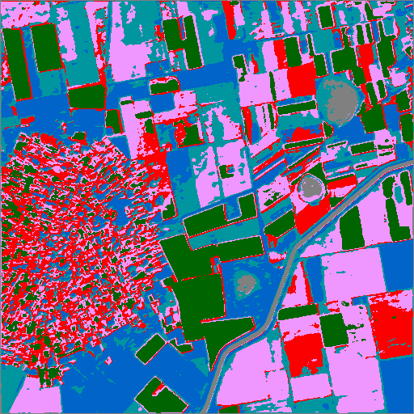 |
| Legend |  |
| JSON | [json](tile_7/unet_mask_gpt-4.1-2025-04-14_vlm_categories.json) |

#### Per-class metrics

| Class Code | Class Name (EN) | IoU | Precision | Recall | F1 | Pixel Acc | Support True | Support Pred |
|------------|----------------|-----|-----------|--------|----|-----------|-------------|-------------|
| 10 | Tree cover | 0.0031 | 0.0040 | 0.0140 | 0.0062 |  |  |  |
| 30 | Grassland | 0.0000 | 0.0000 | 0.0000 | 0.0000 |  |  |  |
| 40 | Cropland | 0.2811 | 0.9240 | 0.2878 | 0.4389 |  |  |  |
| 50 | Built-up | 0.1321 | 0.1485 | 0.5445 | 0.2333 |  |  |  |
| 60 | Bare / sparse vegetation | 0.0000 | 0.0000 | 0.0000 | 0.0000 |  |  |  |
| 80 | Permanent water bodies | 0.0008 | 0.0009 | 0.0171 | 0.0017 |  |  |  |
| 90 | Herbaceous wetland | 0.0183 | 0.0194 | 0.2486 | 0.0359 |  |  |  |

### unet  gpt-4.1-mini-2025-04-14
| Metric | Value |
|--------|-------|
| accuracy | 0.2732 |
| iou | 0.0792 |
| f1 | 0.1299 |
| kappa | 0.0426 |
| Mask |  |
| Legend |  |
| JSON | [json](tile_7/unet_mask_gpt-4.1-mini-2025-04-14_vlm_categories.json) |

#### Per-class metrics

| Class Code | Class Name (EN) | IoU | Precision | Recall | F1 | Pixel Acc | Support True | Support Pred |
|------------|----------------|-----|-----------|--------|----|-----------|-------------|-------------|
| 10 | Tree cover | 0.0031 | 0.0040 | 0.0140 | 0.0062 |  |  |  |
| 30 | Grassland | 0.0000 | 0.0000 | 0.0000 | 0.0000 |  |  |  |
| 40 | Cropland | 0.2811 | 0.9240 | 0.2878 | 0.4389 |  |  |  |
| 50 | Built-up | 0.0695 | 0.0734 | 0.5672 | 0.1299 |  |  |  |
| 60 | Bare / sparse vegetation | 0.0000 | 0.0000 | 0.0000 | 0.0000 |  |  |  |
| 80 | Permanent water bodies | 0.0000 | 0.0000 | 0.0000 | 0.0000 |  |  |  |
| 90 | Herbaceous wetland | 0.2005 | 0.2641 | 0.4543 | 0.3340 |  |  |  |

### unet  gpt-4o-2024-08-06
| Metric | Value |
|--------|-------|
| accuracy | 0.0000 |
| iou | 0.0000 |
| f1 | 0.0000 |
| kappa | 0.0000 |
| Mask |  |
| Legend |  |
| JSON | [json](tile_7/unet_mask_gpt-4o-2024-08-06_vlm_categories.json) |

#### Per-class metrics

| Class Code | Class Name (EN) | IoU | Precision | Recall | F1 | Pixel Acc | Support True | Support Pred |
|------------|----------------|-----|-----------|--------|----|-----------|-------------|-------------|
| 0 | Unknown | 0.0000 | 0.0000 | 0.0000 | 0.0000 |  |  |  |
| 10 | Tree cover | 0.0000 | 0.0000 | 0.0000 | 0.0000 |  |  |  |
| 30 | Grassland | 0.0000 | 0.0000 | 0.0000 | 0.0000 |  |  |  |
| 40 | Cropland | 0.0000 | 0.0000 | 0.0000 | 0.0000 |  |  |  |
| 50 | Built-up | 0.0000 | 0.0000 | 0.0000 | 0.0000 |  |  |  |
| 60 | Bare / sparse vegetation | 0.0000 | 0.0000 | 0.0000 | 0.0000 |  |  |  |
| 80 | Permanent water bodies | 0.0000 | 0.0000 | 0.0000 | 0.0000 |  |  |  |
| 90 | Herbaceous wetland | 0.0000 | 0.0000 | 0.0000 | 0.0000 |  |  |  |

### unet  gpt-4o-mini-2024-07-18
| Metric | Value |
|--------|-------|
| accuracy | 0.2461 |
| iou | 0.0386 |
| f1 | 0.0617 |
| kappa | 0.0246 |
| Mask |  |
| Legend |  |
| JSON | [json](tile_7/unet_mask_gpt-4o-mini-2024-07-18_vlm_categories.json) |

#### Per-class metrics

| Class Code | Class Name (EN) | IoU | Precision | Recall | F1 | Pixel Acc | Support True | Support Pred |
|------------|----------------|-----|-----------|--------|----|-----------|-------------|-------------|
| 10 | Tree cover | 0.0253 | 0.0308 | 0.1254 | 0.0494 |  |  |  |
| 20 | Shrubland | 0.0000 | 0.0000 | 0.0000 | 0.0000 |  |  |  |
| 30 | Grassland | 0.0000 | 0.0000 | 0.0000 | 0.0000 |  |  |  |
| 40 | Cropland | 0.2811 | 0.9240 | 0.2878 | 0.4389 |  |  |  |
| 50 | Built-up | 0.0000 | 0.0000 | 0.0000 | 0.0000 |  |  |  |
| 60 | Bare / sparse vegetation | 0.0000 | 0.0000 | 0.0000 | 0.0000 |  |  |  |
| 80 | Permanent water bodies | 0.0025 | 0.0026 | 0.0506 | 0.0050 |  |  |  |
| 90 | Herbaceous wetland | 0.0000 | 0.0000 | 0.0000 | 0.0000 |  |  |  |

### unet  grok-2-vision-1212
| Metric | Value |
|--------|-------|
| accuracy | 0.0252 |
| iou | 0.0165 |
| f1 | 0.0292 |
| kappa | 0.0175 |
| Mask |  |
| Legend |  |
| JSON | [json](tile_7/unet_mask_grok-2-vision-1212_vlm_categories.json) |

#### Per-class metrics

| Class Code | Class Name (EN) | IoU | Precision | Recall | F1 | Pixel Acc | Support True | Support Pred |
|------------|----------------|-----|-----------|--------|----|-----------|-------------|-------------|
| 0 | Unknown | 0.0000 | 0.0000 | 0.0000 | 0.0000 |  |  |  |
| 10 | Tree cover | 0.0000 | 0.0000 | 0.0000 | 0.0000 |  |  |  |
| 30 | Grassland | 0.0000 | 0.0000 | 0.0000 | 0.0000 |  |  |  |
| 40 | Cropland | 0.0000 | 0.0000 | 0.0000 | 0.0000 |  |  |  |
| 50 | Built-up | 0.1321 | 0.1485 | 0.5445 | 0.2333 |  |  |  |
| 60 | Bare / sparse vegetation | 0.0000 | 0.0000 | 0.0000 | 0.0000 |  |  |  |
| 80 | Permanent water bodies | 0.0000 | 0.0000 | 0.0000 | 0.0000 |  |  |  |
| 90 | Herbaceous wetland | 0.0000 | 0.0000 | 0.0000 | 0.0000 |  |  |  |

### unet  o4-mini
| Metric | Value |
|--------|-------|
| accuracy | 0.3737 |
| iou | 0.0607 |
| f1 | 0.0858 |
| kappa | 0.0187 |
| Mask |  |
| Legend |  |
| JSON | [json](tile_7/unet_mask_o4-mini_vlm_categories.json) |

#### Per-class metrics

| Class Code | Class Name (EN) | IoU | Precision | Recall | F1 | Pixel Acc | Support True | Support Pred |
|------------|----------------|-----|-----------|--------|----|-----------|-------------|-------------|
| 10 | Tree cover | 0.0000 | 0.0000 | 0.0000 | 0.0000 |  |  |  |
| 30 | Grassland | 0.0000 | 0.0000 | 0.0000 | 0.0000 |  |  |  |
| 40 | Cropland | 0.4202 | 0.8702 | 0.4483 | 0.5917 |  |  |  |
| 50 | Built-up | 0.0040 | 0.0111 | 0.0061 | 0.0079 |  |  |  |
| 60 | Bare / sparse vegetation | 0.0000 | 0.0000 | 0.0000 | 0.0000 |  |  |  |
| 80 | Permanent water bodies | 0.0005 | 0.0005 | 0.0171 | 0.0009 |  |  |  |
| 90 | Herbaceous wetland | 0.0000 | 0.0000 | 0.0000 | 0.0000 |  |  |  |

### watershed_kmeans  claude-3-5-haiku-20241022
| Metric | Value |
|--------|-------|
| accuracy | 0.3946 |
| iou | 0.0562 |
| f1 | 0.0792 |
| kappa | 0.0148 |
| Mask |  |
| Legend |  |
| JSON | [json](tile_7/watershed_kmeans_mask_claude-3-5-haiku-20241022_vlm_categories.json) |

#### Per-class metrics

| Class Code | Class Name (EN) | IoU | Precision | Recall | F1 | Pixel Acc | Support True | Support Pred |
|------------|----------------|-----|-----------|--------|----|-----------|-------------|-------------|
| 0 | Unknown | 0.0000 | 0.0000 | 0.0000 | 0.0000 |  |  |  |
| 10 | Tree cover | 0.0098 | 0.0422 | 0.0125 | 0.0193 |  |  |  |
| 30 | Grassland | 0.0000 | 0.0000 | 0.0000 | 0.0000 |  |  |  |
| 40 | Cropland | 0.4376 | 0.8546 | 0.4728 | 0.6088 |  |  |  |
| 50 | Built-up | 0.0000 | 0.0000 | 0.0000 | 0.0000 |  |  |  |
| 60 | Bare / sparse vegetation | 0.0000 | 0.0000 | 0.0000 | 0.0000 |  |  |  |
| 80 | Permanent water bodies | 0.0025 | 0.0027 | 0.0389 | 0.0051 |  |  |  |
| 90 | Herbaceous wetland | 0.0000 | 0.0000 | 0.0000 | 0.0000 |  |  |  |

### watershed_kmeans  claude-3-5-sonnet-20240620
| Metric | Value |
|--------|-------|
| accuracy | 0.0697 |
| iou | 0.0898 |
| f1 | 0.1251 |
| kappa | 0.0111 |
| Mask |  |
| Legend |  |
| JSON | [json](tile_7/watershed_kmeans_mask_claude-3-5-sonnet-20240620_vlm_categories.json) |

#### Per-class metrics

| Class Code | Class Name (EN) | IoU | Precision | Recall | F1 | Pixel Acc | Support True | Support Pred |
|------------|----------------|-----|-----------|--------|----|-----------|-------------|-------------|
| 10 | Tree cover | 0.0168 | 0.0184 | 0.1563 | 0.0330 |  |  |  |
| 20 | Shrubland | 0.0000 | 0.0000 | 0.0000 | 0.0000 |  |  |  |
| 30 | Grassland | 0.0125 | 0.0196 | 0.0330 | 0.0246 |  |  |  |
| 40 | Cropland | 0.0301 | 0.9578 | 0.0301 | 0.0584 |  |  |  |
| 50 | Built-up | 0.0836 | 0.0890 | 0.5783 | 0.1542 |  |  |  |
| 60 | Bare / sparse vegetation | 0.0000 | 0.0000 | 0.0000 | 0.0000 |  |  |  |
| 80 | Permanent water bodies | 0.5753 | 0.6176 | 0.8937 | 0.7304 |  |  |  |
| 90 | Herbaceous wetland | 0.0000 | 0.0000 | 0.0000 | 0.0000 |  |  |  |

### watershed_kmeans  claude-3-7-sonnet-20250219
| Metric | Value |
|--------|-------|
| accuracy | 0.3702 |
| iou | 0.0536 |
| f1 | 0.0778 |
| kappa | -0.0054 |
| Mask |  |
| Legend |  |
| JSON | [json](tile_7/watershed_kmeans_mask_claude-3-7-sonnet-20250219_vlm_categories.json) |

#### Per-class metrics

| Class Code | Class Name (EN) | IoU | Precision | Recall | F1 | Pixel Acc | Support True | Support Pred |
|------------|----------------|-----|-----------|--------|----|-----------|-------------|-------------|
| 0 | Unknown | 0.0000 | 0.0000 | 0.0000 | 0.0000 |  |  |  |
| 10 | Tree cover | 0.0098 | 0.0422 | 0.0125 | 0.0193 |  |  |  |
| 30 | Grassland | 0.0000 | 0.0000 | 0.0000 | 0.0000 |  |  |  |
| 40 | Cropland | 0.4061 | 0.8335 | 0.4419 | 0.5776 |  |  |  |
| 50 | Built-up | 0.0128 | 0.0197 | 0.0351 | 0.0252 |  |  |  |
| 60 | Bare / sparse vegetation | 0.0000 | 0.0000 | 0.0000 | 0.0000 |  |  |  |
| 80 | Permanent water bodies | 0.0000 | 0.0000 | 0.0000 | 0.0000 |  |  |  |
| 90 | Herbaceous wetland | 0.0000 | 0.0000 | 0.0000 | 0.0000 |  |  |  |

### watershed_kmeans  gemini-2.5-pro-preview-05-06
| Metric | Value |
|--------|-------|
| accuracy | 0.3868 |
| iou | 0.0605 |
| f1 | 0.0858 |
| kappa | -0.0359 |
| Mask |  |
| Legend |  |
| JSON | [json](tile_7/watershed_kmeans_mask_gemini-2.5-pro-preview-05-06_vlm_categories.json) |

#### Per-class metrics

| Class Code | Class Name (EN) | IoU | Precision | Recall | F1 | Pixel Acc | Support True | Support Pred |
|------------|----------------|-----|-----------|--------|----|-----------|-------------|-------------|
| 10 | Tree cover | 0.0036 | 0.0056 | 0.0097 | 0.0071 |  |  |  |
| 30 | Grassland | 0.0000 | 0.0000 | 0.0000 | 0.0000 |  |  |  |
| 40 | Cropland | 0.4182 | 0.8104 | 0.4636 | 0.5898 |  |  |  |
| 50 | Built-up | 0.0019 | 0.0025 | 0.0077 | 0.0038 |  |  |  |
| 60 | Bare / sparse vegetation | 0.0000 | 0.0000 | 0.0000 | 0.0000 |  |  |  |
| 80 | Permanent water bodies | 0.0001 | 0.0001 | 0.0008 | 0.0001 |  |  |  |
| 90 | Herbaceous wetland | 0.0000 | 0.0000 | 0.0000 | 0.0000 |  |  |  |

### watershed_kmeans  gpt-4.1-2025-04-14
| Metric | Value |
|--------|-------|
| accuracy | 0.1120 |
| iou | 0.0170 |
| f1 | 0.0310 |
| kappa | -0.0149 |
| Mask |  |
| Legend |  |
| JSON | [json](tile_7/watershed_kmeans_mask_gpt-4.1-2025-04-14_vlm_categories.json) |

#### Per-class metrics

| Class Code | Class Name (EN) | IoU | Precision | Recall | F1 | Pixel Acc | Support True | Support Pred |
|------------|----------------|-----|-----------|--------|----|-----------|-------------|-------------|
| 10 | Tree cover | 0.0000 | 0.0000 | 0.0000 | 0.0000 |  |  |  |
| 20 | Shrubland | 0.0000 | 0.0000 | 0.0000 | 0.0000 |  |  |  |
| 30 | Grassland | 0.0663 | 0.0885 | 0.2098 | 0.1244 |  |  |  |
| 40 | Cropland | 0.1159 | 0.7191 | 0.1214 | 0.2078 |  |  |  |
| 50 | Built-up | 0.0000 | 0.0000 | 0.0000 | 0.0000 |  |  |  |
| 60 | Bare / sparse vegetation | 0.0000 | 0.0000 | 0.1429 | 0.0000 |  |  |  |
| 70 | Snow and ice | 0.0000 | 0.0000 | 0.0000 | 0.0000 |  |  |  |
| 80 | Permanent water bodies | 0.0045 | 0.0048 | 0.0650 | 0.0090 |  |  |  |
| 90 | Herbaceous wetland | 0.0000 | 0.0000 | 0.0000 | 0.0000 |  |  |  |
| 95 | Mangroves | 0.0000 | 0.0000 | 0.0000 | 0.0000 |  |  |  |
| 100 | Moss and lichen | 0.0000 | 0.0000 | 0.0000 | 0.0000 |  |  |  |

### watershed_kmeans  gpt-4.1-mini-2025-04-14
| Metric | Value |
|--------|-------|
| accuracy | 0.2325 |
| iou | 0.0529 |
| f1 | 0.0902 |
| kappa | 0.0457 |
| Mask |  |
| Legend |  |
| JSON | [json](tile_7/watershed_kmeans_mask_gpt-4.1-mini-2025-04-14_vlm_categories.json) |

#### Per-class metrics

| Class Code | Class Name (EN) | IoU | Precision | Recall | F1 | Pixel Acc | Support True | Support Pred |
|------------|----------------|-----|-----------|--------|----|-----------|-------------|-------------|
| 10 | Tree cover | 0.1136 | 0.1367 | 0.4020 | 0.2040 |  |  |  |
| 20 | Shrubland | 0.0000 | 0.0000 | 0.0000 | 0.0000 |  |  |  |
| 30 | Grassland | 0.0663 | 0.0885 | 0.2098 | 0.1244 |  |  |  |
| 40 | Cropland | 0.2410 | 0.9600 | 0.2434 | 0.3884 |  |  |  |
| 50 | Built-up | 0.0021 | 0.0029 | 0.0083 | 0.0043 |  |  |  |
| 60 | Bare / sparse vegetation | 0.0001 | 0.0001 | 0.4286 | 0.0002 |  |  |  |
| 80 | Permanent water bodies | 0.0000 | 0.0000 | 0.0000 | 0.0000 |  |  |  |
| 90 | Herbaceous wetland | 0.0000 | 0.0000 | 0.0000 | 0.0000 |  |  |  |

### watershed_kmeans  gpt-4o-2024-08-06
| Metric | Value |
|--------|-------|
| accuracy | 0.0000 |
| iou | 0.0000 |
| f1 | 0.0000 |
| kappa | 0.0000 |
| Mask |  |
| Legend |  |
| JSON | [json](tile_7/watershed_kmeans_mask_gpt-4o-2024-08-06_vlm_categories.json) |

#### Per-class metrics

| Class Code | Class Name (EN) | IoU | Precision | Recall | F1 | Pixel Acc | Support True | Support Pred |
|------------|----------------|-----|-----------|--------|----|-----------|-------------|-------------|
| 0 | Unknown | 0.0000 | 0.0000 | 0.0000 | 0.0000 |  |  |  |
| 10 | Tree cover | 0.0000 | 0.0000 | 0.0000 | 0.0000 |  |  |  |
| 30 | Grassland | 0.0000 | 0.0000 | 0.0000 | 0.0000 |  |  |  |
| 40 | Cropland | 0.0000 | 0.0000 | 0.0000 | 0.0000 |  |  |  |
| 50 | Built-up | 0.0000 | 0.0000 | 0.0000 | 0.0000 |  |  |  |
| 60 | Bare / sparse vegetation | 0.0000 | 0.0000 | 0.0000 | 0.0000 |  |  |  |
| 80 | Permanent water bodies | 0.0000 | 0.0000 | 0.0000 | 0.0000 |  |  |  |
| 90 | Herbaceous wetland | 0.0000 | 0.0000 | 0.0000 | 0.0000 |  |  |  |

### watershed_kmeans  gpt-4o-mini-2024-07-18
| Metric | Value |
|--------|-------|
| accuracy | 0.2446 |
| iou | 0.0556 |
| f1 | 0.0908 |
| kappa | -0.0148 |
| Mask |  |
| Legend |  |
| JSON | [json](tile_7/watershed_kmeans_mask_gpt-4o-mini-2024-07-18_vlm_categories.json) |

#### Per-class metrics

| Class Code | Class Name (EN) | IoU | Precision | Recall | F1 | Pixel Acc | Support True | Support Pred |
|------------|----------------|-----|-----------|--------|----|-----------|-------------|-------------|
| 10 | Tree cover | 0.0062 | 0.0175 | 0.0096 | 0.0124 |  |  |  |
| 20 | Shrubland | 0.0000 | 0.0000 | 0.0000 | 0.0000 |  |  |  |
| 30 | Grassland | 0.0000 | 0.0000 | 0.0000 | 0.0000 |  |  |  |
| 40 | Cropland | 0.2678 | 0.7908 | 0.2882 | 0.4224 |  |  |  |
| 50 | Built-up | 0.0000 | 0.0000 | 0.0000 | 0.0000 |  |  |  |
| 60 | Bare / sparse vegetation | 0.0000 | 0.0000 | 0.0000 | 0.0000 |  |  |  |
| 80 | Permanent water bodies | 0.0000 | 0.0000 | 0.0000 | 0.0000 |  |  |  |
| 90 | Herbaceous wetland | 0.1708 | 0.2976 | 0.2862 | 0.2918 |  |  |  |

### watershed_kmeans  grok-2-vision-1212
| Metric | Value |
|--------|-------|
| accuracy | 0.2148 |
| iou | 0.0433 |
| f1 | 0.0750 |
| kappa | 0.0499 |
| Mask |  |
| Legend |  |
| JSON | [json](tile_7/watershed_kmeans_mask_grok-2-vision-1212_vlm_categories.json) |

#### Per-class metrics

| Class Code | Class Name (EN) | IoU | Precision | Recall | F1 | Pixel Acc | Support True | Support Pred |
|------------|----------------|-----|-----------|--------|----|-----------|-------------|-------------|
| 0 | Unknown | 0.0000 | 0.0000 | 0.0000 | 0.0000 |  |  |  |
| 10 | Tree cover | 0.1136 | 0.1367 | 0.4020 | 0.2040 |  |  |  |
| 20 | Shrubland | 0.0000 | 0.0000 | 0.0000 | 0.0000 |  |  |  |
| 30 | Grassland | 0.0647 | 0.0727 | 0.3688 | 0.1215 |  |  |  |
| 40 | Cropland | 0.2114 | 0.9603 | 0.2133 | 0.3490 |  |  |  |
| 50 | Built-up | 0.0000 | 0.0000 | 0.0000 | 0.0000 |  |  |  |
| 60 | Bare / sparse vegetation | 0.0001 | 0.0001 | 0.5714 | 0.0001 |  |  |  |
| 80 | Permanent water bodies | 0.0000 | 0.0000 | 0.0000 | 0.0000 |  |  |  |
| 90 | Herbaceous wetland | 0.0000 | 0.0000 | 0.0000 | 0.0000 |  |  |  |

### watershed_kmeans  o4-mini
| Metric | Value |
|--------|-------|
| accuracy | 0.3147 |
| iou | 0.0481 |
| f1 | 0.0745 |
| kappa | -0.0269 |
| Mask |  |
| Legend |  |
| JSON | [json](tile_7/watershed_kmeans_mask_o4-mini_vlm_categories.json) |

#### Per-class metrics

| Class Code | Class Name (EN) | IoU | Precision | Recall | F1 | Pixel Acc | Support True | Support Pred |
|------------|----------------|-----|-----------|--------|----|-----------|-------------|-------------|
| 10 | Tree cover | 0.0027 | 0.0042 | 0.0077 | 0.0054 |  |  |  |
| 20 | Shrubland | 0.0000 | 0.0000 | 0.0000 | 0.0000 |  |  |  |
| 30 | Grassland | 0.0449 | 0.0589 | 0.1590 | 0.0860 |  |  |  |
| 40 | Cropland | 0.3374 | 0.8010 | 0.3682 | 0.5045 |  |  |  |
| 50 | Built-up | 0.0000 | 0.0000 | 0.0000 | 0.0000 |  |  |  |
| 60 | Bare / sparse vegetation | 0.0000 | 0.0000 | 0.0000 | 0.0000 |  |  |  |
| 80 | Permanent water bodies | 0.0000 | 0.0000 | 0.0012 | 0.0001 |  |  |  |
| 90 | Herbaceous wetland | 0.0000 | 0.0000 | 0.0000 | 0.0000 |  |  |  |

### watershed_ndvi  claude-3-5-haiku-20241022
| Metric | Value |
|--------|-------|
| accuracy | 0.1788 |
| iou | 0.0290 |
| f1 | 0.0489 |
| kappa | -0.0578 |
| Mask |  |
| Legend |  |
| JSON | [json](tile_7/watershed_ndvi_mask_claude-3-5-haiku-20241022_vlm_categories.json) |

#### Per-class metrics

| Class Code | Class Name (EN) | IoU | Precision | Recall | F1 | Pixel Acc | Support True | Support Pred |
|------------|----------------|-----|-----------|--------|----|-----------|-------------|-------------|
| 10 | Tree cover | 0.0071 | 0.0081 | 0.0561 | 0.0141 |  |  |  |
| 30 | Grassland | 0.0000 | 0.0000 | 0.0000 | 0.0000 |  |  |  |
| 40 | Cropland | 0.1950 | 0.7183 | 0.2111 | 0.3263 |  |  |  |
| 50 | Built-up | 0.0000 | 0.0000 | 0.0000 | 0.0000 |  |  |  |
| 60 | Bare / sparse vegetation | 0.0000 | 0.0000 | 0.0000 | 0.0000 |  |  |  |
| 80 | Permanent water bodies | 0.0009 | 0.0009 | 0.0393 | 0.0018 |  |  |  |
| 90 | Herbaceous wetland | 0.0000 | 0.0000 | 0.0000 | 0.0000 |  |  |  |

### watershed_ndvi  claude-3-5-sonnet-20240620
| Metric | Value |
|--------|-------|
| accuracy | 0.1831 |
| iou | 0.0307 |
| f1 | 0.0522 |
| kappa | -0.0516 |
| Mask |  |
| Legend |  |
| JSON | [json](tile_7/watershed_ndvi_mask_claude-3-5-sonnet-20240620_vlm_categories.json) |

#### Per-class metrics

| Class Code | Class Name (EN) | IoU | Precision | Recall | F1 | Pixel Acc | Support True | Support Pred |
|------------|----------------|-----|-----------|--------|----|-----------|-------------|-------------|
| 10 | Tree cover | 0.0000 | 0.0000 | 0.0000 | 0.0000 |  |  |  |
| 30 | Grassland | 0.0000 | 0.0000 | 0.0000 | 0.0000 |  |  |  |
| 40 | Cropland | 0.1950 | 0.7183 | 0.2111 | 0.3263 |  |  |  |
| 50 | Built-up | 0.0188 | 0.0211 | 0.1511 | 0.0370 |  |  |  |
| 60 | Bare / sparse vegetation | 0.0000 | 0.0000 | 0.0000 | 0.0000 |  |  |  |
| 80 | Permanent water bodies | 0.0009 | 0.0009 | 0.0393 | 0.0018 |  |  |  |
| 90 | Herbaceous wetland | 0.0000 | 0.0000 | 0.0000 | 0.0000 |  |  |  |

### watershed_ndvi  claude-3-7-sonnet-20250219
| Metric | Value |
|--------|-------|
| accuracy | 0.5094 |
| iou | 0.0839 |
| f1 | 0.1172 |
| kappa | 0.0201 |
| Mask |  |
| Legend |  |
| JSON | [json](tile_7/watershed_ndvi_mask_claude-3-7-sonnet-20250219_vlm_categories.json) |

#### Per-class metrics

| Class Code | Class Name (EN) | IoU | Precision | Recall | F1 | Pixel Acc | Support True | Support Pred |
|------------|----------------|-----|-----------|--------|----|-----------|-------------|-------------|
| 10 | Tree cover | 0.0000 | 0.0000 | 0.0000 | 0.0000 |  |  |  |
| 30 | Grassland | 0.0000 | 0.0000 | 0.0000 | 0.0000 |  |  |  |
| 40 | Cropland | 0.5089 | 0.8245 | 0.5707 | 0.6745 |  |  |  |
| 50 | Built-up | 0.0786 | 0.0808 | 0.7409 | 0.1458 |  |  |  |
| 60 | Bare / sparse vegetation | 0.0000 | 0.0000 | 0.0000 | 0.0000 |  |  |  |
| 80 | Permanent water bodies | 0.0000 | 0.0000 | 0.0000 | 0.0000 |  |  |  |
| 90 | Herbaceous wetland | 0.0000 | 0.0000 | 0.0000 | 0.0000 |  |  |  |

### watershed_ndvi  gemini-2.5-pro-preview-05-06
| Metric | Value |
|--------|-------|
| accuracy | 0.5094 |
| iou | 0.0839 |
| f1 | 0.1172 |
| kappa | 0.0201 |
| Mask |  |
| Legend |  |
| JSON | [json](tile_7/watershed_ndvi_mask_gemini-2.5-pro-preview-05-06_vlm_categories.json) |

#### Per-class metrics

| Class Code | Class Name (EN) | IoU | Precision | Recall | F1 | Pixel Acc | Support True | Support Pred |
|------------|----------------|-----|-----------|--------|----|-----------|-------------|-------------|
| 10 | Tree cover | 0.0000 | 0.0000 | 0.0000 | 0.0000 |  |  |  |
| 30 | Grassland | 0.0000 | 0.0000 | 0.0000 | 0.0000 |  |  |  |
| 40 | Cropland | 0.5089 | 0.8245 | 0.5707 | 0.6745 |  |  |  |
| 50 | Built-up | 0.0786 | 0.0808 | 0.7409 | 0.1458 |  |  |  |
| 60 | Bare / sparse vegetation | 0.0000 | 0.0000 | 0.0000 | 0.0000 |  |  |  |
| 80 | Permanent water bodies | 0.0000 | 0.0000 | 0.0000 | 0.0000 |  |  |  |
| 90 | Herbaceous wetland | 0.0000 | 0.0000 | 0.0000 | 0.0000 |  |  |  |

### watershed_ndvi  gpt-4.1-2025-04-14
| Metric | Value |
|--------|-------|
| accuracy | 0.0375 |
| iou | 0.0169 |
| f1 | 0.0308 |
| kappa | 0.0185 |
| Mask |  |
| Legend |  |
| JSON | [json](tile_7/watershed_ndvi_mask_gpt-4.1-2025-04-14_vlm_categories.json) |

#### Per-class metrics

| Class Code | Class Name (EN) | IoU | Precision | Recall | F1 | Pixel Acc | Support True | Support Pred |
|------------|----------------|-----|-----------|--------|----|-----------|-------------|-------------|
| 10 | Tree cover | 0.0000 | 0.0000 | 0.0000 | 0.0000 |  |  |  |
| 30 | Grassland | 0.1055 | 0.1144 | 0.5730 | 0.1908 |  |  |  |
| 40 | Cropland | 0.0000 | 0.0000 | 0.0000 | 0.0000 |  |  |  |
| 50 | Built-up | 0.0000 | 0.0000 | 0.0000 | 0.0000 |  |  |  |
| 60 | Bare / sparse vegetation | 0.0000 | 0.0000 | 0.0000 | 0.0000 |  |  |  |
| 80 | Permanent water bodies | 0.0125 | 0.0126 | 0.9677 | 0.0248 |  |  |  |
| 90 | Herbaceous wetland | 0.0000 | 0.0000 | 0.0000 | 0.0000 |  |  |  |

### watershed_ndvi  gpt-4.1-mini-2025-04-14
| Metric | Value |
|--------|-------|
| accuracy | 0.1788 |
| iou | 0.0290 |
| f1 | 0.0489 |
| kappa | -0.0578 |
| Mask |  |
| Legend |  |
| JSON | [json](tile_7/watershed_ndvi_mask_gpt-4.1-mini-2025-04-14_vlm_categories.json) |

#### Per-class metrics

| Class Code | Class Name (EN) | IoU | Precision | Recall | F1 | Pixel Acc | Support True | Support Pred |
|------------|----------------|-----|-----------|--------|----|-----------|-------------|-------------|
| 10 | Tree cover | 0.0071 | 0.0081 | 0.0561 | 0.0141 |  |  |  |
| 30 | Grassland | 0.0000 | 0.0000 | 0.0000 | 0.0000 |  |  |  |
| 40 | Cropland | 0.1950 | 0.7183 | 0.2111 | 0.3263 |  |  |  |
| 50 | Built-up | 0.0000 | 0.0000 | 0.0000 | 0.0000 |  |  |  |
| 60 | Bare / sparse vegetation | 0.0000 | 0.0000 | 0.0000 | 0.0000 |  |  |  |
| 80 | Permanent water bodies | 0.0009 | 0.0009 | 0.0393 | 0.0018 |  |  |  |
| 90 | Herbaceous wetland | 0.0000 | 0.0000 | 0.0000 | 0.0000 |  |  |  |

### watershed_ndvi  gpt-4o-2024-08-06
| Metric | Value |
|--------|-------|
| accuracy | 0.0000 |
| iou | 0.0000 |
| f1 | 0.0000 |
| kappa | 0.0000 |
| Mask |  |
| Legend |  |
| JSON | [json](tile_7/watershed_ndvi_mask_gpt-4o-2024-08-06_vlm_categories.json) |

#### Per-class metrics

| Class Code | Class Name (EN) | IoU | Precision | Recall | F1 | Pixel Acc | Support True | Support Pred |
|------------|----------------|-----|-----------|--------|----|-----------|-------------|-------------|
| 0 | Unknown | 0.0000 | 0.0000 | 0.0000 | 0.0000 |  |  |  |
| 10 | Tree cover | 0.0000 | 0.0000 | 0.0000 | 0.0000 |  |  |  |
| 30 | Grassland | 0.0000 | 0.0000 | 0.0000 | 0.0000 |  |  |  |
| 40 | Cropland | 0.0000 | 0.0000 | 0.0000 | 0.0000 |  |  |  |
| 50 | Built-up | 0.0000 | 0.0000 | 0.0000 | 0.0000 |  |  |  |
| 60 | Bare / sparse vegetation | 0.0000 | 0.0000 | 0.0000 | 0.0000 |  |  |  |
| 80 | Permanent water bodies | 0.0000 | 0.0000 | 0.0000 | 0.0000 |  |  |  |
| 90 | Herbaceous wetland | 0.0000 | 0.0000 | 0.0000 | 0.0000 |  |  |  |

### watershed_ndvi  gpt-4o-mini-2024-07-18
| Metric | Value |
|--------|-------|
| accuracy | 0.3274 |
| iou | 0.0645 |
| f1 | 0.1007 |
| kappa | 0.0553 |
| Mask |  |
| Legend |  |
| JSON | [json](tile_7/watershed_ndvi_mask_gpt-4o-mini-2024-07-18_vlm_categories.json) |

#### Per-class metrics

| Class Code | Class Name (EN) | IoU | Precision | Recall | F1 | Pixel Acc | Support True | Support Pred |
|------------|----------------|-----|-----------|--------|----|-----------|-------------|-------------|
| 10 | Tree cover | 0.0000 | 0.0000 | 0.0000 | 0.0000 |  |  |  |
| 30 | Grassland | 0.1055 | 0.1144 | 0.5730 | 0.1908 |  |  |  |
| 40 | Cropland | 0.3462 | 0.9030 | 0.3596 | 0.5144 |  |  |  |
| 50 | Built-up | 0.0000 | 0.0000 | 0.0000 | 0.0000 |  |  |  |
| 60 | Bare / sparse vegetation | 0.0000 | 0.0000 | 0.7143 | 0.0001 |  |  |  |
| 80 | Permanent water bodies | 0.0000 | 0.0000 | 0.0000 | 0.0000 |  |  |  |
| 90 | Herbaceous wetland | 0.0000 | 0.0000 | 0.0000 | 0.0000 |  |  |  |

### watershed_ndvi  grok-2-vision-1212
| Metric | Value |
|--------|-------|
| accuracy | 0.0000 |
| iou | 0.0000 |
| f1 | 0.0000 |
| kappa | 0.0000 |
| Mask |  |
| Legend |  |
| JSON | [json](tile_7/watershed_ndvi_mask_grok-2-vision-1212_vlm_categories.json) |

#### Per-class metrics

| Class Code | Class Name (EN) | IoU | Precision | Recall | F1 | Pixel Acc | Support True | Support Pred |
|------------|----------------|-----|-----------|--------|----|-----------|-------------|-------------|
| 0 | Unknown | 0.0000 | 0.0000 | 0.0000 | 0.0000 |  |  |  |
| 10 | Tree cover | 0.0000 | 0.0000 | 0.0000 | 0.0000 |  |  |  |
| 30 | Grassland | 0.0000 | 0.0000 | 0.0000 | 0.0000 |  |  |  |
| 40 | Cropland | 0.0000 | 0.0000 | 0.0000 | 0.0000 |  |  |  |
| 50 | Built-up | 0.0000 | 0.0000 | 0.0000 | 0.0000 |  |  |  |
| 60 | Bare / sparse vegetation | 0.0000 | 0.0000 | 0.0000 | 0.0000 |  |  |  |
| 80 | Permanent water bodies | 0.0000 | 0.0000 | 0.0000 | 0.0000 |  |  |  |
| 90 | Herbaceous wetland | 0.0000 | 0.0000 | 0.0000 | 0.0000 |  |  |  |

### watershed_ndvi  o4-mini
| Metric | Value |
|--------|-------|
| accuracy | 0.3044 |
| iou | 0.0520 |
| f1 | 0.0784 |
| kappa | 0.0239 |
| Mask |  |
| Legend |  |
| JSON | [json](tile_7/watershed_ndvi_mask_o4-mini_vlm_categories.json) |

#### Per-class metrics

| Class Code | Class Name (EN) | IoU | Precision | Recall | F1 | Pixel Acc | Support True | Support Pred |
|------------|----------------|-----|-----------|--------|----|-----------|-------------|-------------|
| 10 | Tree cover | 0.0000 | 0.0000 | 0.0000 | 0.0000 |  |  |  |
| 30 | Grassland | 0.0000 | 0.0000 | 0.0000 | 0.0000 |  |  |  |
| 40 | Cropland | 0.3462 | 0.9030 | 0.3596 | 0.5144 |  |  |  |
| 50 | Built-up | 0.0175 | 0.0204 | 0.1080 | 0.0343 |  |  |  |
| 60 | Bare / sparse vegetation | 0.0000 | 0.0000 | 0.7143 | 0.0001 |  |  |  |
| 80 | Permanent water bodies | 0.0000 | 0.0000 | 0.0000 | 0.0000 |  |  |  |
| 90 | Herbaceous wetland | 0.0000 | 0.0000 | 0.0000 | 0.0000 |  |  |  |

---

## Tile 8
### Source Images
| Type | Image |
|------|-------|
| TCI (RGB) |  |
| WorldCover Ground Truth |  |

### kmeans  Segmentation Masks
| Type | Image |
|------|-------|
| Segmentation Mask |  |

### som  Segmentation Masks
| Type | Image |
|------|-------|
| Segmentation Mask |  |

### unet  Segmentation Masks
| Type | Image |
|------|-------|
| Segmentation Mask |  |

### watershed_kmeans  Segmentation Masks
| Type | Image |
|------|-------|
| Segmentation Mask |  |

### watershed_ndvi  Segmentation Masks
| Type | Image |
|------|-------|
| Segmentation Mask |  |

### kmeans  claude-3-5-haiku-20241022
| Metric | Value |
|--------|-------|
| accuracy | 0.0461 |
| iou | 0.0248 |
| f1 | 0.0427 |
| kappa | 0.0070 |
| Mask |  |
| Legend |  |
| JSON | [json](tile_8/kmeans_mask_claude-3-5-haiku-20241022_vlm_categories.json) |

#### Per-class metrics

| Class Code | Class Name (EN) | IoU | Precision | Recall | F1 | Pixel Acc | Support True | Support Pred |
|------------|----------------|-----|-----------|--------|----|-----------|-------------|-------------|
| 10 | Tree cover | 0.0000 | 0.0000 | 0.0000 | 0.0000 |  |  |  |
| 20 | Shrubland | 0.0000 | 0.0000 | 0.0000 | 0.0000 |  |  |  |
| 30 | Grassland | 0.1792 | 0.2191 | 0.4958 | 0.3039 |  |  |  |
| 40 | Cropland | 0.0002 | 0.0084 | 0.0002 | 0.0003 |  |  |  |
| 50 | Built-up | 0.0153 | 0.0155 | 0.6441 | 0.0302 |  |  |  |
| 60 | Bare / sparse vegetation | 0.0000 | 0.0000 | 0.0000 | 0.0000 |  |  |  |
| 80 | Permanent water bodies | 0.0036 | 0.0039 | 0.0507 | 0.0072 |  |  |  |
| 90 | Herbaceous wetland | 0.0000 | 0.0000 | 0.0000 | 0.0000 |  |  |  |

### kmeans  claude-3-5-sonnet-20240620
| Metric | Value |
|--------|-------|
| accuracy | 0.1514 |
| iou | 0.0250 |
| f1 | 0.0439 |
| kappa | -0.0525 |
| Mask |  |
| Legend |  |
| JSON | [json](tile_8/kmeans_mask_claude-3-5-sonnet-20240620_vlm_categories.json) |

#### Per-class metrics

| Class Code | Class Name (EN) | IoU | Precision | Recall | F1 | Pixel Acc | Support True | Support Pred |
|------------|----------------|-----|-----------|--------|----|-----------|-------------|-------------|
| 10 | Tree cover | 0.0003 | 0.0003 | 0.0198 | 0.0006 |  |  |  |
| 30 | Grassland | 0.0000 | 0.0000 | 0.0000 | 0.0000 |  |  |  |
| 40 | Cropland | 0.1557 | 0.7005 | 0.1668 | 0.2694 |  |  |  |
| 50 | Built-up | 0.0153 | 0.0155 | 0.6441 | 0.0302 |  |  |  |
| 60 | Bare / sparse vegetation | 0.0000 | 0.0000 | 0.0000 | 0.0000 |  |  |  |
| 80 | Permanent water bodies | 0.0036 | 0.0039 | 0.0507 | 0.0072 |  |  |  |
| 90 | Herbaceous wetland | 0.0000 | 0.0000 | 0.0000 | 0.0000 |  |  |  |

### kmeans  claude-3-7-sonnet-20250219
| Metric | Value |
|--------|-------|
| accuracy | 0.7296 |
| iou | 0.1062 |
| f1 | 0.1226 |
| kappa | -0.0310 |
| Mask |  |
| Legend |  |
| JSON | [json](tile_8/kmeans_mask_claude-3-7-sonnet-20250219_vlm_categories.json) |

#### Per-class metrics

| Class Code | Class Name (EN) | IoU | Precision | Recall | F1 | Pixel Acc | Support True | Support Pred |
|------------|----------------|-----|-----------|--------|----|-----------|-------------|-------------|
| 10 | Tree cover | 0.0000 | 0.0000 | 0.0000 | 0.0000 |  |  |  |
| 30 | Grassland | 0.0000 | 0.0000 | 0.0000 | 0.0000 |  |  |  |
| 40 | Cropland | 0.7395 | 0.8790 | 0.8233 | 0.8503 |  |  |  |
| 50 | Built-up | 0.0000 | 0.0000 | 0.0000 | 0.0000 |  |  |  |
| 60 | Bare / sparse vegetation | 0.0000 | 0.0000 | 0.0000 | 0.0000 |  |  |  |
| 80 | Permanent water bodies | 0.0040 | 0.0045 | 0.0348 | 0.0079 |  |  |  |
| 90 | Herbaceous wetland | 0.0000 | 0.0000 | 0.0000 | 0.0000 |  |  |  |

### kmeans  gemini-2.5-pro-preview-05-06
| Metric | Value |
|--------|-------|
| accuracy | 0.9029 |
| iou | 0.2435 |
| f1 | 0.2627 |
| kappa | 0.2556 |
| Mask |  |
| Legend |  |
| JSON | [json](tile_8/kmeans_mask_gemini-2.5-pro-preview-05-06_vlm_categories.json) |

#### Per-class metrics

| Class Code | Class Name (EN) | IoU | Precision | Recall | F1 | Pixel Acc | Support True | Support Pred |
|------------|----------------|-----|-----------|--------|----|-----------|-------------|-------------|
| 10 | Tree cover | 0.0000 | 0.0000 | 0.0000 | 0.0000 |  |  |  |
| 30 | Grassland | 0.0000 | 0.0000 | 0.0000 | 0.0000 |  |  |  |
| 40 | Cropland | 0.9012 | 0.9013 | 0.9998 | 0.9480 |  |  |  |
| 50 | Built-up | 0.0000 | 0.0000 | 0.0000 | 0.0000 |  |  |  |
| 60 | Bare / sparse vegetation | 0.0000 | 0.0000 | 0.0000 | 0.0000 |  |  |  |
| 80 | Permanent water bodies | 0.8033 | 0.9888 | 0.8106 | 0.8909 |  |  |  |
| 90 | Herbaceous wetland | 0.0000 | 0.0000 | 0.0000 | 0.0000 |  |  |  |

### kmeans  gpt-4.1-2025-04-14
| Metric | Value |
|--------|-------|
| accuracy | 0.2330 |
| iou | 0.0444 |
| f1 | 0.0755 |
| kappa | -0.0009 |
| Mask |  |
| Legend |  |
| JSON | [json](tile_8/kmeans_mask_gpt-4.1-2025-04-14_vlm_categories.json) |

#### Per-class metrics

| Class Code | Class Name (EN) | IoU | Precision | Recall | F1 | Pixel Acc | Support True | Support Pred |
|------------|----------------|-----|-----------|--------|----|-----------|-------------|-------------|
| 10 | Tree cover | 0.0000 | 0.0000 | 0.0000 | 0.0000 |  |  |  |
| 30 | Grassland | 0.0621 | 0.0759 | 0.2552 | 0.1170 |  |  |  |
| 40 | Cropland | 0.2286 | 0.8994 | 0.2346 | 0.3721 |  |  |  |
| 50 | Built-up | 0.0153 | 0.0155 | 0.6441 | 0.0302 |  |  |  |
| 60 | Bare / sparse vegetation | 0.0000 | 0.0000 | 0.0000 | 0.0000 |  |  |  |
| 80 | Permanent water bodies | 0.0045 | 0.0049 | 0.0432 | 0.0089 |  |  |  |
| 90 | Herbaceous wetland | 0.0000 | 0.0000 | 0.0000 | 0.0000 |  |  |  |

### kmeans  gpt-4.1-mini-2025-04-14
| Metric | Value |
|--------|-------|
| accuracy | 0.0115 |
| iou | 0.0061 |
| f1 | 0.0117 |
| kappa | -0.0228 |
| Mask |  |
| Legend |  |
| JSON | [json](tile_8/kmeans_mask_gpt-4.1-mini-2025-04-14_vlm_categories.json) |

#### Per-class metrics

| Class Code | Class Name (EN) | IoU | Precision | Recall | F1 | Pixel Acc | Support True | Support Pred |
|------------|----------------|-----|-----------|--------|----|-----------|-------------|-------------|
| 10 | Tree cover | 0.0008 | 0.0008 | 0.0969 | 0.0016 |  |  |  |
| 20 | Shrubland | 0.0000 | 0.0000 | 0.0000 | 0.0000 |  |  |  |
| 30 | Grassland | 0.0429 | 0.0616 | 0.1235 | 0.0822 |  |  |  |
| 40 | Cropland | 0.0002 | 0.0084 | 0.0002 | 0.0003 |  |  |  |
| 50 | Built-up | 0.0000 | 0.0000 | 0.0000 | 0.0000 |  |  |  |
| 60 | Bare / sparse vegetation | 0.0000 | 0.0000 | 0.0000 | 0.0000 |  |  |  |
| 80 | Permanent water bodies | 0.0050 | 0.0059 | 0.0316 | 0.0099 |  |  |  |
| 90 | Herbaceous wetland | 0.0000 | 0.0000 | 0.0000 | 0.0000 |  |  |  |

### kmeans  gpt-4o-2024-08-06
| Metric | Value |
|--------|-------|
| accuracy | 0.4104 |
| iou | 0.0608 |
| f1 | 0.0859 |
| kappa | -0.0605 |
| Mask |  |
| Legend |  |
| JSON | [json](tile_8/kmeans_mask_gpt-4o-2024-08-06_vlm_categories.json) |

#### Per-class metrics

| Class Code | Class Name (EN) | IoU | Precision | Recall | F1 | Pixel Acc | Support True | Support Pred |
|------------|----------------|-----|-----------|--------|----|-----------|-------------|-------------|
| 10 | Tree cover | 0.0003 | 0.0003 | 0.0198 | 0.0006 |  |  |  |
| 30 | Grassland | 0.0000 | 0.0000 | 0.0000 | 0.0000 |  |  |  |
| 40 | Cropland | 0.4210 | 0.8239 | 0.4627 | 0.5926 |  |  |  |
| 50 | Built-up | 0.0000 | 0.0000 | 0.0000 | 0.0000 |  |  |  |
| 60 | Bare / sparse vegetation | 0.0000 | 0.0000 | 0.0000 | 0.0000 |  |  |  |
| 80 | Permanent water bodies | 0.0040 | 0.0045 | 0.0348 | 0.0079 |  |  |  |
| 90 | Herbaceous wetland | 0.0000 | 0.0000 | 0.0000 | 0.0000 |  |  |  |

### kmeans  gpt-4o-mini-2024-07-18
| Metric | Value |
|--------|-------|
| accuracy | 0.1343 |
| iou | 0.0235 |
| f1 | 0.0427 |
| kappa | -0.0193 |
| Mask |  |
| Legend |  |
| JSON | [json](tile_8/kmeans_mask_gpt-4o-mini-2024-07-18_vlm_categories.json) |

#### Per-class metrics

| Class Code | Class Name (EN) | IoU | Precision | Recall | F1 | Pixel Acc | Support True | Support Pred |
|------------|----------------|-----|-----------|--------|----|-----------|-------------|-------------|
| 10 | Tree cover | 0.0000 | 0.0000 | 0.0000 | 0.0000 |  |  |  |
| 20 | Shrubland | 0.0000 | 0.0000 | 0.0000 | 0.0000 |  |  |  |
| 30 | Grassland | 0.0621 | 0.0759 | 0.2552 | 0.1170 |  |  |  |
| 40 | Cropland | 0.1229 | 0.8148 | 0.1264 | 0.2189 |  |  |  |
| 50 | Built-up | 0.0000 | 0.0000 | 0.0000 | 0.0000 |  |  |  |
| 60 | Bare / sparse vegetation | 0.0001 | 0.0001 | 0.6667 | 0.0002 |  |  |  |
| 80 | Permanent water bodies | 0.0027 | 0.0030 | 0.0291 | 0.0055 |  |  |  |
| 90 | Herbaceous wetland | 0.0000 | 0.0000 | 0.0000 | 0.0000 |  |  |  |

### kmeans  grok-2-vision-1212
| Metric | Value |
|--------|-------|
| accuracy | 0.1488 |
| iou | 0.0204 |
| f1 | 0.0354 |
| kappa | -0.0365 |
| Mask | 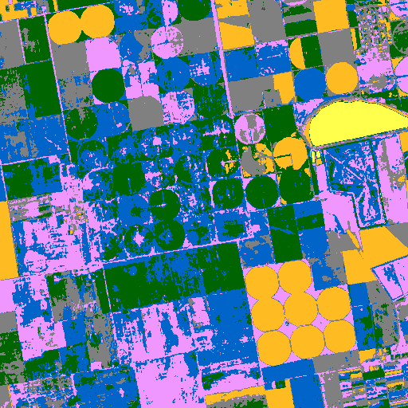 |
| Legend |  |
| JSON | [json](tile_8/kmeans_mask_grok-2-vision-1212_vlm_categories.json) |

#### Per-class metrics

| Class Code | Class Name (EN) | IoU | Precision | Recall | F1 | Pixel Acc | Support True | Support Pred |
|------------|----------------|-----|-----------|--------|----|-----------|-------------|-------------|
| 10 | Tree cover | 0.0008 | 0.0008 | 0.0969 | 0.0016 |  |  |  |
| 20 | Shrubland | 0.0000 | 0.0000 | 0.0000 | 0.0000 |  |  |  |
| 30 | Grassland | 0.0003 | 0.0019 | 0.0004 | 0.0007 |  |  |  |
| 40 | Cropland | 0.1585 | 0.7655 | 0.1666 | 0.2737 |  |  |  |
| 50 | Built-up | 0.0000 | 0.0000 | 0.0000 | 0.0000 |  |  |  |
| 60 | Bare / sparse vegetation | 0.0001 | 0.0001 | 0.6667 | 0.0002 |  |  |  |
| 80 | Permanent water bodies | 0.0036 | 0.0039 | 0.0507 | 0.0072 |  |  |  |
| 90 | Herbaceous wetland | 0.0000 | 0.0000 | 0.0000 | 0.0000 |  |  |  |

### kmeans  o4-mini
| Metric | Value |
|--------|-------|
| accuracy | 0.3561 |
| iou | 0.0539 |
| f1 | 0.0789 |
| kappa | -0.0383 |
| Mask |  |
| Legend |  |
| JSON | [json](tile_8/kmeans_mask_o4-mini_vlm_categories.json) |

#### Per-class metrics

| Class Code | Class Name (EN) | IoU | Precision | Recall | F1 | Pixel Acc | Support True | Support Pred |
|------------|----------------|-----|-----------|--------|----|-----------|-------------|-------------|
| 10 | Tree cover | 0.0000 | 0.0000 | 0.0000 | 0.0000 |  |  |  |
| 30 | Grassland | 0.0000 | 0.0000 | 0.0000 | 0.0000 |  |  |  |
| 40 | Cropland | 0.3724 | 0.8385 | 0.4012 | 0.5427 |  |  |  |
| 50 | Built-up | 0.0007 | 0.0007 | 0.0493 | 0.0014 |  |  |  |
| 60 | Bare / sparse vegetation | 0.0000 | 0.0000 | 0.0000 | 0.0000 |  |  |  |
| 80 | Permanent water bodies | 0.0040 | 0.0045 | 0.0348 | 0.0079 |  |  |  |
| 90 | Herbaceous wetland | 0.0000 | 0.0000 | 0.0000 | 0.0000 |  |  |  |

### som  claude-3-5-haiku-20241022
| Metric | Value |
|--------|-------|
| accuracy | 0.1961 |
| iou | 0.0473 |
| f1 | 0.0830 |
| kappa | 0.0259 |
| Mask |  |
| Legend |  |
| JSON | [json](tile_8/som_mask_claude-3-5-haiku-20241022_vlm_categories.json) |

#### Per-class metrics

| Class Code | Class Name (EN) | IoU | Precision | Recall | F1 | Pixel Acc | Support True | Support Pred |
|------------|----------------|-----|-----------|--------|----|-----------|-------------|-------------|
| 10 | Tree cover | 0.0023 | 0.0023 | 0.1366 | 0.0046 |  |  |  |
| 30 | Grassland | 0.0382 | 0.0667 | 0.0819 | 0.0736 |  |  |  |
| 40 | Cropland | 0.1891 | 0.9303 | 0.1918 | 0.3181 |  |  |  |
| 50 | Built-up | 0.0000 | 0.0000 | 0.0000 | 0.0000 |  |  |  |
| 60 | Bare / sparse vegetation | 0.0000 | 0.0000 | 0.0000 | 0.0000 |  |  |  |
| 80 | Permanent water bodies | 0.1017 | 0.1034 | 0.8653 | 0.1847 |  |  |  |
| 90 | Herbaceous wetland | 0.0000 | 0.0000 | 0.0000 | 0.0000 |  |  |  |

### som  claude-3-5-sonnet-20240620
| Metric | Value |
|--------|-------|
| accuracy | 0.1999 |
| iou | 0.0393 |
| f1 | 0.0687 |
| kappa | 0.0084 |
| Mask |  |
| Legend |  |
| JSON | [json](tile_8/som_mask_claude-3-5-sonnet-20240620_vlm_categories.json) |

#### Per-class metrics

| Class Code | Class Name (EN) | IoU | Precision | Recall | F1 | Pixel Acc | Support True | Support Pred |
|------------|----------------|-----|-----------|--------|----|-----------|-------------|-------------|
| 10 | Tree cover | 0.0023 | 0.0023 | 0.1366 | 0.0046 |  |  |  |
| 30 | Grassland | 0.0715 | 0.0838 | 0.3275 | 0.1334 |  |  |  |
| 40 | Cropland | 0.1891 | 0.9303 | 0.1918 | 0.3181 |  |  |  |
| 50 | Built-up | 0.0069 | 0.0070 | 0.3141 | 0.0137 |  |  |  |
| 60 | Bare / sparse vegetation | 0.0000 | 0.0000 | 0.0000 | 0.0000 |  |  |  |
| 80 | Permanent water bodies | 0.0055 | 0.0066 | 0.0313 | 0.0109 |  |  |  |
| 90 | Herbaceous wetland | 0.0000 | 0.0000 | 0.0000 | 0.0000 |  |  |  |

### som  claude-3-7-sonnet-20250219
| Metric | Value |
|--------|-------|
| accuracy | 0.5808 |
| iou | 0.1006 |
| f1 | 0.1349 |
| kappa | 0.0687 |
| Mask |  |
| Legend |  |
| JSON | [json](tile_8/som_mask_claude-3-7-sonnet-20250219_vlm_categories.json) |

#### Per-class metrics

| Class Code | Class Name (EN) | IoU | Precision | Recall | F1 | Pixel Acc | Support True | Support Pred |
|------------|----------------|-----|-----------|--------|----|-----------|-------------|-------------|
| 10 | Tree cover | 0.0000 | 0.0000 | 0.0000 | 0.0000 |  |  |  |
| 30 | Grassland | 0.0000 | 0.0000 | 0.0000 | 0.0000 |  |  |  |
| 40 | Cropland | 0.5967 | 0.9107 | 0.6338 | 0.7474 |  |  |  |
| 50 | Built-up | 0.0061 | 0.0063 | 0.1599 | 0.0121 |  |  |  |
| 60 | Bare / sparse vegetation | 0.0000 | 0.0000 | 0.0000 | 0.0000 |  |  |  |
| 80 | Permanent water bodies | 0.1017 | 0.1034 | 0.8653 | 0.1847 |  |  |  |
| 90 | Herbaceous wetland | 0.0000 | 0.0000 | 0.0000 | 0.0000 |  |  |  |

### som  gemini-2.5-pro-preview-05-06
| Metric | Value |
|--------|-------|
| accuracy | 0.0000 |
| iou | 0.0000 |
| f1 | 0.0000 |
| kappa | 0.0000 |
| Mask |  |
| Legend |  |
| JSON | [json](tile_8/som_mask_gemini-2.5-pro-preview-05-06_vlm_categories.json) |

#### Per-class metrics

| Class Code | Class Name (EN) | IoU | Precision | Recall | F1 | Pixel Acc | Support True | Support Pred |
|------------|----------------|-----|-----------|--------|----|-----------|-------------|-------------|
| 0 | Unknown | 0.0000 | 0.0000 | 0.0000 | 0.0000 |  |  |  |
| 10 | Tree cover | 0.0000 | 0.0000 | 0.0000 | 0.0000 |  |  |  |
| 30 | Grassland | 0.0000 | 0.0000 | 0.0000 | 0.0000 |  |  |  |
| 40 | Cropland | 0.0000 | 0.0000 | 0.0000 | 0.0000 |  |  |  |
| 50 | Built-up | 0.0000 | 0.0000 | 0.0000 | 0.0000 |  |  |  |
| 60 | Bare / sparse vegetation | 0.0000 | 0.0000 | 0.0000 | 0.0000 |  |  |  |
| 80 | Permanent water bodies | 0.0000 | 0.0000 | 0.0000 | 0.0000 |  |  |  |
| 90 | Herbaceous wetland | 0.0000 | 0.0000 | 0.0000 | 0.0000 |  |  |  |

### som  gpt-4.1-2025-04-14
| Metric | Value |
|--------|-------|
| accuracy | 0.1165 |
| iou | 0.0307 |
| f1 | 0.0557 |
| kappa | 0.0079 |
| Mask |  |
| Legend |  |
| JSON | [json](tile_8/som_mask_gpt-4.1-2025-04-14_vlm_categories.json) |

#### Per-class metrics

| Class Code | Class Name (EN) | IoU | Precision | Recall | F1 | Pixel Acc | Support True | Support Pred |
|------------|----------------|-----|-----------|--------|----|-----------|-------------|-------------|
| 10 | Tree cover | 0.0012 | 0.0012 | 0.0727 | 0.0024 |  |  |  |
| 30 | Grassland | 0.1102 | 0.1450 | 0.3144 | 0.1985 |  |  |  |
| 40 | Cropland | 0.0992 | 0.8835 | 0.1005 | 0.1805 |  |  |  |
| 50 | Built-up | 0.0020 | 0.0021 | 0.0474 | 0.0039 |  |  |  |
| 60 | Bare / sparse vegetation | 0.0000 | 0.0000 | 0.0000 | 0.0000 |  |  |  |
| 80 | Permanent water bodies | 0.0022 | 0.0025 | 0.0208 | 0.0045 |  |  |  |
| 90 | Herbaceous wetland | 0.0000 | 0.0000 | 0.0000 | 0.0000 |  |  |  |

### som  gpt-4.1-mini-2025-04-14
| Metric | Value |
|--------|-------|
| accuracy | 0.2675 |
| iou | 0.0471 |
| f1 | 0.0757 |
| kappa | 0.0004 |
| Mask |  |
| Legend |  |
| JSON | [json](tile_8/som_mask_gpt-4.1-mini-2025-04-14_vlm_categories.json) |

#### Per-class metrics

| Class Code | Class Name (EN) | IoU | Precision | Recall | F1 | Pixel Acc | Support True | Support Pred |
|------------|----------------|-----|-----------|--------|----|-----------|-------------|-------------|
| 10 | Tree cover | 0.0035 | 0.0035 | 0.3700 | 0.0069 |  |  |  |
| 30 | Grassland | 0.0382 | 0.0667 | 0.0819 | 0.0736 |  |  |  |
| 40 | Cropland | 0.2845 | 0.9136 | 0.2923 | 0.4429 |  |  |  |
| 50 | Built-up | 0.0000 | 0.0000 | 0.0000 | 0.0000 |  |  |  |
| 60 | Bare / sparse vegetation | 0.0000 | 0.0000 | 0.0000 | 0.0000 |  |  |  |
| 80 | Permanent water bodies | 0.0033 | 0.0035 | 0.0524 | 0.0065 |  |  |  |
| 90 | Herbaceous wetland | 0.0000 | 0.0000 | 0.0000 | 0.0000 |  |  |  |

### som  gpt-4o-2024-08-06
| Metric | Value |
|--------|-------|
| accuracy | 0.0000 |
| iou | 0.0000 |
| f1 | 0.0000 |
| kappa | 0.0000 |
| Mask |  |
| Legend |  |
| JSON | [json](tile_8/som_mask_gpt-4o-2024-08-06_vlm_categories.json) |

#### Per-class metrics

| Class Code | Class Name (EN) | IoU | Precision | Recall | F1 | Pixel Acc | Support True | Support Pred |
|------------|----------------|-----|-----------|--------|----|-----------|-------------|-------------|
| 0 | Unknown | 0.0000 | 0.0000 | 0.0000 | 0.0000 |  |  |  |
| 10 | Tree cover | 0.0000 | 0.0000 | 0.0000 | 0.0000 |  |  |  |
| 30 | Grassland | 0.0000 | 0.0000 | 0.0000 | 0.0000 |  |  |  |
| 40 | Cropland | 0.0000 | 0.0000 | 0.0000 | 0.0000 |  |  |  |
| 50 | Built-up | 0.0000 | 0.0000 | 0.0000 | 0.0000 |  |  |  |
| 60 | Bare / sparse vegetation | 0.0000 | 0.0000 | 0.0000 | 0.0000 |  |  |  |
| 80 | Permanent water bodies | 0.0000 | 0.0000 | 0.0000 | 0.0000 |  |  |  |
| 90 | Herbaceous wetland | 0.0000 | 0.0000 | 0.0000 | 0.0000 |  |  |  |

### som  gpt-4o-mini-2024-07-18
| Metric | Value |
|--------|-------|
| accuracy | 0.1820 |
| iou | 0.0257 |
| f1 | 0.0429 |
| kappa | 0.0018 |
| Mask |  |
| Legend |  |
| JSON | [json](tile_8/som_mask_gpt-4o-mini-2024-07-18_vlm_categories.json) |

#### Per-class metrics

| Class Code | Class Name (EN) | IoU | Precision | Recall | F1 | Pixel Acc | Support True | Support Pred |
|------------|----------------|-----|-----------|--------|----|-----------|-------------|-------------|
| 10 | Tree cover | 0.0012 | 0.0012 | 0.0727 | 0.0024 |  |  |  |
| 20 | Shrubland | 0.0000 | 0.0000 | 0.0000 | 0.0000 |  |  |  |
| 30 | Grassland | 0.0000 | 0.0000 | 0.0000 | 0.0000 |  |  |  |
| 40 | Cropland | 0.2008 | 0.9246 | 0.2042 | 0.3345 |  |  |  |
| 50 | Built-up | 0.0000 | 0.0000 | 0.0000 | 0.0000 |  |  |  |
| 60 | Bare / sparse vegetation | 0.0000 | 0.0000 | 0.3333 | 0.0001 |  |  |  |
| 80 | Permanent water bodies | 0.0033 | 0.0035 | 0.0524 | 0.0065 |  |  |  |
| 90 | Herbaceous wetland | 0.0000 | 0.0000 | 0.0000 | 0.0000 |  |  |  |

### som  grok-2-vision-1212
| Metric | Value |
|--------|-------|
| accuracy | 0.1987 |
| iou | 0.0337 |
| f1 | 0.0587 |
| kappa | 0.0075 |
| Mask |  |
| Legend |  |
| JSON | [json](tile_8/som_mask_grok-2-vision-1212_vlm_categories.json) |

#### Per-class metrics

| Class Code | Class Name (EN) | IoU | Precision | Recall | F1 | Pixel Acc | Support True | Support Pred |
|------------|----------------|-----|-----------|--------|----|-----------|-------------|-------------|
| 10 | Tree cover | 0.0023 | 0.0023 | 0.1366 | 0.0046 |  |  |  |
| 20 | Shrubland | 0.0000 | 0.0000 | 0.0000 | 0.0000 |  |  |  |
| 30 | Grassland | 0.0715 | 0.0838 | 0.3275 | 0.1334 |  |  |  |
| 40 | Cropland | 0.1891 | 0.9303 | 0.1918 | 0.3181 |  |  |  |
| 50 | Built-up | 0.0061 | 0.0063 | 0.1599 | 0.0121 |  |  |  |
| 60 | Bare / sparse vegetation | 0.0000 | 0.0000 | 0.0000 | 0.0000 |  |  |  |
| 80 | Permanent water bodies | 0.0006 | 0.0007 | 0.0031 | 0.0012 |  |  |  |
| 90 | Herbaceous wetland | 0.0000 | 0.0000 | 0.0000 | 0.0000 |  |  |  |

### som  o4-mini
| Metric | Value |
|--------|-------|
| accuracy | 0.1212 |
| iou | 0.0230 |
| f1 | 0.0424 |
| kappa | 0.0090 |
| Mask |  |
| Legend |  |
| JSON | [json](tile_8/som_mask_o4-mini_vlm_categories.json) |

#### Per-class metrics

| Class Code | Class Name (EN) | IoU | Precision | Recall | F1 | Pixel Acc | Support True | Support Pred |
|------------|----------------|-----|-----------|--------|----|-----------|-------------|-------------|
| 10 | Tree cover | 0.0023 | 0.0023 | 0.1366 | 0.0046 |  |  |  |
| 20 | Shrubland | 0.0000 | 0.0000 | 0.0000 | 0.0000 |  |  |  |
| 30 | Grassland | 0.0715 | 0.0838 | 0.3275 | 0.1334 |  |  |  |
| 40 | Cropland | 0.1033 | 0.9683 | 0.1037 | 0.1873 |  |  |  |
| 50 | Built-up | 0.0069 | 0.0070 | 0.3141 | 0.0137 |  |  |  |
| 60 | Bare / sparse vegetation | 0.0000 | 0.0000 | 0.1667 | 0.0001 |  |  |  |
| 80 | Permanent water bodies | 0.0000 | 0.0000 | 0.0000 | 0.0000 |  |  |  |
| 90 | Herbaceous wetland | 0.0000 | 0.0000 | 0.0000 | 0.0000 |  |  |  |

### unet  claude-3-5-haiku-20241022
| Metric | Value |
|--------|-------|
| accuracy | 0.3879 |
| iou | 0.0590 |
| f1 | 0.0863 |
| kappa | -0.0894 |
| Mask |  |
| Legend |  |
| JSON | [json](tile_8/unet_mask_claude-3-5-haiku-20241022_vlm_categories.json) |

#### Per-class metrics

| Class Code | Class Name (EN) | IoU | Precision | Recall | F1 | Pixel Acc | Support True | Support Pred |
|------------|----------------|-----|-----------|--------|----|-----------|-------------|-------------|
| 10 | Tree cover | 0.0000 | 0.0000 | 0.0000 | 0.0000 |  |  |  |
| 30 | Grassland | 0.0206 | 0.0244 | 0.1165 | 0.0404 |  |  |  |
| 40 | Cropland | 0.3925 | 0.8293 | 0.4270 | 0.5637 |  |  |  |
| 50 | Built-up | 0.0000 | 0.0000 | 0.0000 | 0.0000 |  |  |  |
| 60 | Bare / sparse vegetation | 0.0000 | 0.0000 | 0.0000 | 0.0000 |  |  |  |
| 80 | Permanent water bodies | 0.0000 | 0.0000 | 0.0000 | 0.0000 |  |  |  |
| 90 | Herbaceous wetland | 0.0000 | 0.0000 | 0.0000 | 0.0000 |  |  |  |

### unet  claude-3-5-sonnet-20240620
| Metric | Value |
|--------|-------|
| accuracy | 0.7869 |
| iou | 0.2086 |
| f1 | 0.2408 |
| kappa | 0.1044 |
| Mask |  |
| Legend |  |
| JSON | [json](tile_8/unet_mask_claude-3-5-sonnet-20240620_vlm_categories.json) |

#### Per-class metrics

| Class Code | Class Name (EN) | IoU | Precision | Recall | F1 | Pixel Acc | Support True | Support Pred |
|------------|----------------|-----|-----------|--------|----|-----------|-------------|-------------|
| 10 | Tree cover | 0.0003 | 0.0003 | 0.0198 | 0.0006 |  |  |  |
| 30 | Grassland | 0.0000 | 0.0000 | 0.0000 | 0.0000 |  |  |  |
| 40 | Cropland | 0.7883 | 0.8944 | 0.8691 | 0.8816 |  |  |  |
| 50 | Built-up | 0.0000 | 0.0000 | 0.0000 | 0.0000 |  |  |  |
| 60 | Bare / sparse vegetation | 0.0000 | 0.0000 | 0.0000 | 0.0000 |  |  |  |
| 80 | Permanent water bodies | 0.6718 | 0.8121 | 0.7954 | 0.8037 |  |  |  |
| 90 | Herbaceous wetland | 0.0000 | 0.0000 | 0.0000 | 0.0000 |  |  |  |

### unet  claude-3-7-sonnet-20250219
| Metric | Value |
|--------|-------|
| accuracy | 0.8801 |
| iou | 0.1309 |
| f1 | 0.1407 |
| kappa | 0.1179 |
| Mask |  |
| Legend |  |
| JSON | [json](tile_8/unet_mask_claude-3-7-sonnet-20250219_vlm_categories.json) |

#### Per-class metrics

| Class Code | Class Name (EN) | IoU | Precision | Recall | F1 | Pixel Acc | Support True | Support Pred |
|------------|----------------|-----|-----------|--------|----|-----------|-------------|-------------|
| 10 | Tree cover | 0.0000 | 0.0000 | 0.0000 | 0.0000 |  |  |  |
| 30 | Grassland | 0.0000 | 0.0000 | 0.0000 | 0.0000 |  |  |  |
| 40 | Cropland | 0.8961 | 0.9013 | 0.9936 | 0.9452 |  |  |  |
| 50 | Built-up | 0.0000 | 0.0000 | 0.0000 | 0.0000 |  |  |  |
| 60 | Bare / sparse vegetation | 0.0000 | 0.0000 | 0.0000 | 0.0000 |  |  |  |
| 80 | Permanent water bodies | 0.0204 | 0.1194 | 0.0240 | 0.0400 |  |  |  |
| 90 | Herbaceous wetland | 0.0000 | 0.0000 | 0.0000 | 0.0000 |  |  |  |

### unet  gemini-2.5-pro-preview-05-06
| Metric | Value |
|--------|-------|
| accuracy | 0.4899 |
| iou | 0.0740 |
| f1 | 0.1010 |
| kappa | -0.0702 |
| Mask |  |
| Legend |  |
| JSON | [json](tile_8/unet_mask_gemini-2.5-pro-preview-05-06_vlm_categories.json) |

#### Per-class metrics

| Class Code | Class Name (EN) | IoU | Precision | Recall | F1 | Pixel Acc | Support True | Support Pred |
|------------|----------------|-----|-----------|--------|----|-----------|-------------|-------------|
| 10 | Tree cover | 0.0000 | 0.0000 | 0.0000 | 0.0000 |  |  |  |
| 30 | Grassland | 0.0000 | 0.0000 | 0.0000 | 0.0000 |  |  |  |
| 40 | Cropland | 0.4953 | 0.8288 | 0.5517 | 0.6625 |  |  |  |
| 50 | Built-up | 0.0024 | 0.0024 | 0.2388 | 0.0048 |  |  |  |
| 60 | Bare / sparse vegetation | 0.0000 | 0.0000 | 0.0000 | 0.0000 |  |  |  |
| 80 | Permanent water bodies | 0.0204 | 0.1194 | 0.0240 | 0.0400 |  |  |  |
| 90 | Herbaceous wetland | 0.0000 | 0.0000 | 0.0000 | 0.0000 |  |  |  |

### unet  gpt-4.1-2025-04-14
| Metric | Value |
|--------|-------|
| accuracy | 0.3974 |
| iou | 0.0637 |
| f1 | 0.0888 |
| kappa | 0.0490 |
| Mask |  |
| Legend |  |
| JSON | [json](tile_8/unet_mask_gpt-4.1-2025-04-14_vlm_categories.json) |

#### Per-class metrics

| Class Code | Class Name (EN) | IoU | Precision | Recall | F1 | Pixel Acc | Support True | Support Pred |
|------------|----------------|-----|-----------|--------|----|-----------|-------------|-------------|
| 10 | Tree cover | 0.0000 | 0.0000 | 0.0000 | 0.0000 |  |  |  |
| 30 | Grassland | 0.0012 | 0.0527 | 0.0012 | 0.0024 |  |  |  |
| 40 | Cropland | 0.4413 | 0.9661 | 0.4483 | 0.6124 |  |  |  |
| 50 | Built-up | 0.0000 | 0.0000 | 0.0000 | 0.0000 |  |  |  |
| 60 | Bare / sparse vegetation | 0.0000 | 0.0000 | 1.0000 | 0.0001 |  |  |  |
| 80 | Permanent water bodies | 0.0035 | 0.0042 | 0.0223 | 0.0070 |  |  |  |
| 90 | Herbaceous wetland | 0.0000 | 0.0000 | 0.0000 | 0.0000 |  |  |  |

### unet  gpt-4.1-mini-2025-04-14
| Metric | Value |
|--------|-------|
| accuracy | 0.1179 |
| iou | 0.0168 |
| f1 | 0.0300 |
| kappa | -0.0015 |
| Mask |  |
| Legend |  |
| JSON | [json](tile_8/unet_mask_gpt-4.1-mini-2025-04-14_vlm_categories.json) |

#### Per-class metrics

| Class Code | Class Name (EN) | IoU | Precision | Recall | F1 | Pixel Acc | Support True | Support Pred |
|------------|----------------|-----|-----------|--------|----|-----------|-------------|-------------|
| 10 | Tree cover | 0.0010 | 0.0010 | 0.2291 | 0.0019 |  |  |  |
| 20 | Shrubland | 0.0000 | 0.0000 | 0.0000 | 0.0000 |  |  |  |
| 30 | Grassland | 0.0000 | 0.0000 | 0.0000 | 0.0000 |  |  |  |
| 40 | Cropland | 0.1294 | 0.9418 | 0.1305 | 0.2292 |  |  |  |
| 50 | Built-up | 0.0000 | 0.0000 | 0.0000 | 0.0000 |  |  |  |
| 60 | Bare / sparse vegetation | 0.0000 | 0.0000 | 0.0000 | 0.0000 |  |  |  |
| 80 | Permanent water bodies | 0.0043 | 0.0045 | 0.0910 | 0.0085 |  |  |  |
| 90 | Herbaceous wetland | 0.0000 | 0.0000 | 0.0000 | 0.0000 |  |  |  |

### unet  gpt-4o-2024-08-06
| Metric | Value |
|--------|-------|
| accuracy | 0.0000 |
| iou | 0.0000 |
| f1 | 0.0000 |
| kappa | 0.0000 |
| Mask |  |
| Legend |  |
| JSON | [json](tile_8/unet_mask_gpt-4o-2024-08-06_vlm_categories.json) |

#### Per-class metrics

| Class Code | Class Name (EN) | IoU | Precision | Recall | F1 | Pixel Acc | Support True | Support Pred |
|------------|----------------|-----|-----------|--------|----|-----------|-------------|-------------|
| 0 | Unknown | 0.0000 | 0.0000 | 0.0000 | 0.0000 |  |  |  |
| 10 | Tree cover | 0.0000 | 0.0000 | 0.0000 | 0.0000 |  |  |  |
| 30 | Grassland | 0.0000 | 0.0000 | 0.0000 | 0.0000 |  |  |  |
| 40 | Cropland | 0.0000 | 0.0000 | 0.0000 | 0.0000 |  |  |  |
| 50 | Built-up | 0.0000 | 0.0000 | 0.0000 | 0.0000 |  |  |  |
| 60 | Bare / sparse vegetation | 0.0000 | 0.0000 | 0.0000 | 0.0000 |  |  |  |
| 80 | Permanent water bodies | 0.0000 | 0.0000 | 0.0000 | 0.0000 |  |  |  |
| 90 | Herbaceous wetland | 0.0000 | 0.0000 | 0.0000 | 0.0000 |  |  |  |

### unet  gpt-4o-mini-2024-07-18
| Metric | Value |
|--------|-------|
| accuracy | 0.1175 |
| iou | 0.0167 |
| f1 | 0.0297 |
| kappa | -0.0011 |
| Mask |  |
| Legend |  |
| JSON | [json](tile_8/unet_mask_gpt-4o-mini-2024-07-18_vlm_categories.json) |

#### Per-class metrics

| Class Code | Class Name (EN) | IoU | Precision | Recall | F1 | Pixel Acc | Support True | Support Pred |
|------------|----------------|-----|-----------|--------|----|-----------|-------------|-------------|
| 10 | Tree cover | 0.0000 | 0.0000 | 0.0000 | 0.0000 |  |  |  |
| 20 | Shrubland | 0.0000 | 0.0000 | 0.0000 | 0.0000 |  |  |  |
| 30 | Grassland | 0.0000 | 0.0000 | 0.0000 | 0.0000 |  |  |  |
| 40 | Cropland | 0.1294 | 0.9418 | 0.1305 | 0.2292 |  |  |  |
| 50 | Built-up | 0.0000 | 0.0000 | 0.0000 | 0.0000 |  |  |  |
| 60 | Bare / sparse vegetation | 0.0000 | 0.0000 | 0.0000 | 0.0000 |  |  |  |
| 80 | Permanent water bodies | 0.0043 | 0.0045 | 0.0910 | 0.0085 |  |  |  |
| 90 | Herbaceous wetland | 0.0000 | 0.0000 | 0.0000 | 0.0000 |  |  |  |

### unet  grok-2-vision-1212
| Metric | Value |
|--------|-------|
| accuracy | 0.0036 |
| iou | 0.0005 |
| f1 | 0.0010 |
| kappa | -0.0003 |
| Mask |  |
| Legend |  |
| JSON | [json](tile_8/unet_mask_grok-2-vision-1212_vlm_categories.json) |

#### Per-class metrics

| Class Code | Class Name (EN) | IoU | Precision | Recall | F1 | Pixel Acc | Support True | Support Pred |
|------------|----------------|-----|-----------|--------|----|-----------|-------------|-------------|
| 0 | Unknown | 0.0000 | 0.0000 | 0.0000 | 0.0000 |  |  |  |
| 10 | Tree cover | 0.0000 | 0.0000 | 0.0000 | 0.0000 |  |  |  |
| 30 | Grassland | 0.0000 | 0.0000 | 0.0000 | 0.0000 |  |  |  |
| 40 | Cropland | 0.0040 | 0.8076 | 0.0041 | 0.0081 |  |  |  |
| 50 | Built-up | 0.0000 | 0.0000 | 0.0000 | 0.0000 |  |  |  |
| 60 | Bare / sparse vegetation | 0.0000 | 0.0000 | 0.0000 | 0.0000 |  |  |  |
| 80 | Permanent water bodies | 0.0000 | 0.0000 | 0.0000 | 0.0000 |  |  |  |
| 90 | Herbaceous wetland | 0.0000 | 0.0000 | 0.0000 | 0.0000 |  |  |  |

### unet  o4-mini
| Metric | Value |
|--------|-------|
| accuracy | 0.4849 |
| iou | 0.0716 |
| f1 | 0.0956 |
| kappa | -0.0368 |
| Mask |  |
| Legend |  |
| JSON | [json](tile_8/unet_mask_o4-mini_vlm_categories.json) |

#### Per-class metrics

| Class Code | Class Name (EN) | IoU | Precision | Recall | F1 | Pixel Acc | Support True | Support Pred |
|------------|----------------|-----|-----------|--------|----|-----------|-------------|-------------|
| 10 | Tree cover | 0.0010 | 0.0010 | 0.2291 | 0.0019 |  |  |  |
| 30 | Grassland | 0.0000 | 0.0000 | 0.0000 | 0.0000 |  |  |  |
| 40 | Cropland | 0.5003 | 0.8535 | 0.5473 | 0.6669 |  |  |  |
| 50 | Built-up | 0.0000 | 0.0000 | 0.0000 | 0.0000 |  |  |  |
| 60 | Bare / sparse vegetation | 0.0000 | 0.0000 | 0.0000 | 0.0000 |  |  |  |
| 80 | Permanent water bodies | 0.0000 | 0.0000 | 0.0000 | 0.0000 |  |  |  |
| 90 | Herbaceous wetland | 0.0000 | 0.0000 | 0.0000 | 0.0000 |  |  |  |

### watershed_kmeans  claude-3-5-haiku-20241022
| Metric | Value |
|--------|-------|
| accuracy | 0.1622 |
| iou | 0.1211 |
| f1 | 0.1476 |
| kappa | -0.0075 |
| Mask |  |
| Legend |  |
| JSON | [json](tile_8/watershed_kmeans_mask_claude-3-5-haiku-20241022_vlm_categories.json) |

#### Per-class metrics

| Class Code | Class Name (EN) | IoU | Precision | Recall | F1 | Pixel Acc | Support True | Support Pred |
|------------|----------------|-----|-----------|--------|----|-----------|-------------|-------------|
| 0 | Unknown | 0.0000 | 0.0000 | 0.0000 | 0.0000 |  |  |  |
| 10 | Tree cover | 0.0000 | 0.0000 | 0.0000 | 0.0000 |  |  |  |
| 30 | Grassland | 0.0114 | 0.0186 | 0.0283 | 0.0225 |  |  |  |
| 40 | Cropland | 0.1542 | 0.8003 | 0.1603 | 0.2671 |  |  |  |
| 50 | Built-up | 0.0000 | 0.0000 | 0.0000 | 0.0000 |  |  |  |
| 60 | Bare / sparse vegetation | 0.0000 | 0.0000 | 0.0000 | 0.0000 |  |  |  |
| 80 | Permanent water bodies | 0.8033 | 0.9899 | 0.8099 | 0.8909 |  |  |  |
| 90 | Herbaceous wetland | 0.0000 | 0.0000 | 0.0000 | 0.0000 |  |  |  |

### watershed_kmeans  claude-3-5-sonnet-20240620
| Metric | Value |
|--------|-------|
| accuracy | 0.2911 |
| iou | 0.0456 |
| f1 | 0.0708 |
| kappa | -0.0316 |
| Mask |  |
| Legend |  |
| JSON | [json](tile_8/watershed_kmeans_mask_claude-3-5-sonnet-20240620_vlm_categories.json) |

#### Per-class metrics

| Class Code | Class Name (EN) | IoU | Precision | Recall | F1 | Pixel Acc | Support True | Support Pred |
|------------|----------------|-----|-----------|--------|----|-----------|-------------|-------------|
| 10 | Tree cover | 0.0006 | 0.0006 | 0.0441 | 0.0012 |  |  |  |
| 30 | Grassland | 0.0000 | 0.0000 | 0.0000 | 0.0000 |  |  |  |
| 40 | Cropland | 0.3048 | 0.8292 | 0.3253 | 0.4672 |  |  |  |
| 50 | Built-up | 0.0064 | 0.0064 | 0.3857 | 0.0127 |  |  |  |
| 60 | Bare / sparse vegetation | 0.0000 | 0.0000 | 0.0000 | 0.0000 |  |  |  |
| 80 | Permanent water bodies | 0.0072 | 0.0079 | 0.0685 | 0.0142 |  |  |  |
| 90 | Herbaceous wetland | 0.0000 | 0.0000 | 0.0000 | 0.0000 |  |  |  |

### watershed_kmeans  claude-3-7-sonnet-20250219
| Metric | Value |
|--------|-------|
| accuracy | 0.2861 |
| iou | 0.1369 |
| f1 | 0.1680 |
| kappa | 0.0194 |
| Mask |  |
| Legend |  |
| JSON | [json](tile_8/watershed_kmeans_mask_claude-3-7-sonnet-20250219_vlm_categories.json) |

#### Per-class metrics

| Class Code | Class Name (EN) | IoU | Precision | Recall | F1 | Pixel Acc | Support True | Support Pred |
|------------|----------------|-----|-----------|--------|----|-----------|-------------|-------------|
| 0 | Unknown | 0.0000 | 0.0000 | 0.0000 | 0.0000 |  |  |  |
| 10 | Tree cover | 0.0000 | 0.0000 | 0.0000 | 0.0000 |  |  |  |
| 30 | Grassland | 0.0000 | 0.0000 | 0.0000 | 0.0000 |  |  |  |
| 40 | Cropland | 0.2903 | 0.8745 | 0.3030 | 0.4500 |  |  |  |
| 50 | Built-up | 0.0017 | 0.0020 | 0.0112 | 0.0034 |  |  |  |
| 60 | Bare / sparse vegetation | 0.0000 | 0.0000 | 0.0000 | 0.0000 |  |  |  |
| 80 | Permanent water bodies | 0.8033 | 0.9899 | 0.8099 | 0.8909 |  |  |  |
| 90 | Herbaceous wetland | 0.0000 | 0.0000 | 0.0000 | 0.0000 |  |  |  |

### watershed_kmeans  gemini-2.5-pro-preview-05-06
| Metric | Value |
|--------|-------|
| accuracy | 0.4508 |
| iou | 0.0697 |
| f1 | 0.0944 |
| kappa | 0.0160 |
| Mask |  |
| Legend |  |
| JSON | [json](tile_8/watershed_kmeans_mask_gemini-2.5-pro-preview-05-06_vlm_categories.json) |

#### Per-class metrics

| Class Code | Class Name (EN) | IoU | Precision | Recall | F1 | Pixel Acc | Support True | Support Pred |
|------------|----------------|-----|-----------|--------|----|-----------|-------------|-------------|
| 10 | Tree cover | 0.0000 | 0.0000 | 0.0000 | 0.0000 |  |  |  |
| 30 | Grassland | 0.0000 | 0.0000 | 0.0000 | 0.0000 |  |  |  |
| 40 | Cropland | 0.4834 | 0.9076 | 0.5084 | 0.6517 |  |  |  |
| 50 | Built-up | 0.0027 | 0.0028 | 0.1283 | 0.0054 |  |  |  |
| 60 | Bare / sparse vegetation | 0.0000 | 0.0000 | 0.0000 | 0.0000 |  |  |  |
| 80 | Permanent water bodies | 0.0018 | 0.0022 | 0.0099 | 0.0036 |  |  |  |
| 90 | Herbaceous wetland | 0.0000 | 0.0000 | 0.0000 | 0.0000 |  |  |  |

### watershed_kmeans  gpt-4.1-2025-04-14
| Metric | Value |
|--------|-------|
| accuracy | 0.2007 |
| iou | 0.1516 |
| f1 | 0.1922 |
| kappa | 0.0422 |
| Mask |  |
| Legend |  |
| JSON | [json](tile_8/watershed_kmeans_mask_gpt-4.1-2025-04-14_vlm_categories.json) |

#### Per-class metrics

| Class Code | Class Name (EN) | IoU | Precision | Recall | F1 | Pixel Acc | Support True | Support Pred |
|------------|----------------|-----|-----------|--------|----|-----------|-------------|-------------|
| 10 | Tree cover | 0.0016 | 0.0016 | 0.1894 | 0.0032 |  |  |  |
| 30 | Grassland | 0.0912 | 0.1039 | 0.4283 | 0.1672 |  |  |  |
| 40 | Cropland | 0.1637 | 0.9606 | 0.1648 | 0.2813 |  |  |  |
| 50 | Built-up | 0.0012 | 0.0013 | 0.0288 | 0.0025 |  |  |  |
| 60 | Bare / sparse vegetation | 0.0000 | 0.0000 | 0.1667 | 0.0000 |  |  |  |
| 80 | Permanent water bodies | 0.8033 | 0.9899 | 0.8099 | 0.8909 |  |  |  |
| 90 | Herbaceous wetland | 0.0000 | 0.0000 | 0.0000 | 0.0000 |  |  |  |

### watershed_kmeans  gpt-4.1-mini-2025-04-14
| Metric | Value |
|--------|-------|
| accuracy | 0.2279 |
| iou | 0.0349 |
| f1 | 0.0579 |
| kappa | -0.0154 |
| Mask |  |
| Legend |  |
| JSON | [json](tile_8/watershed_kmeans_mask_gpt-4.1-mini-2025-04-14_vlm_categories.json) |

#### Per-class metrics

| Class Code | Class Name (EN) | IoU | Precision | Recall | F1 | Pixel Acc | Support True | Support Pred |
|------------|----------------|-----|-----------|--------|----|-----------|-------------|-------------|
| 10 | Tree cover | 0.0005 | 0.0005 | 0.0374 | 0.0010 |  |  |  |
| 20 | Shrubland | 0.0000 | 0.0000 | 0.0000 | 0.0000 |  |  |  |
| 30 | Grassland | 0.0255 | 0.0480 | 0.0517 | 0.0498 |  |  |  |
| 40 | Cropland | 0.2412 | 0.8591 | 0.2511 | 0.3886 |  |  |  |
| 50 | Built-up | 0.0102 | 0.0106 | 0.2193 | 0.0201 |  |  |  |
| 60 | Bare / sparse vegetation | 0.0000 | 0.0000 | 0.0000 | 0.0000 |  |  |  |
| 80 | Permanent water bodies | 0.0018 | 0.0022 | 0.0099 | 0.0036 |  |  |  |
| 90 | Herbaceous wetland | 0.0000 | 0.0000 | 0.0000 | 0.0000 |  |  |  |

### watershed_kmeans  gpt-4o-2024-08-06
| Metric | Value |
|--------|-------|
| accuracy | 0.0704 |
| iou | 0.0100 |
| f1 | 0.0186 |
| kappa | -0.0026 |
| Mask | 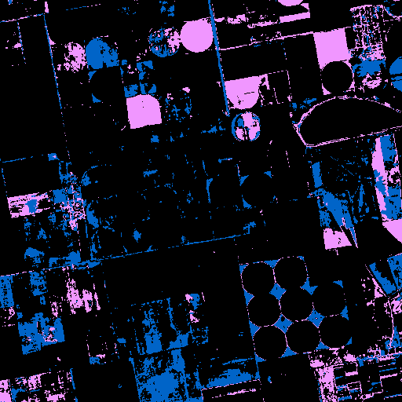 |
| Legend |  |
| JSON | [json](tile_8/watershed_kmeans_mask_gpt-4o-2024-08-06_vlm_categories.json) |

#### Per-class metrics

| Class Code | Class Name (EN) | IoU | Precision | Recall | F1 | Pixel Acc | Support True | Support Pred |
|------------|----------------|-----|-----------|--------|----|-----------|-------------|-------------|
| 0 | Unknown | 0.0000 | 0.0000 | 0.0000 | 0.0000 |  |  |  |
| 10 | Tree cover | 0.0000 | 0.0000 | 0.0000 | 0.0000 |  |  |  |
| 30 | Grassland | 0.0000 | 0.0000 | 0.0000 | 0.0000 |  |  |  |
| 40 | Cropland | 0.0784 | 0.8790 | 0.0793 | 0.1454 |  |  |  |
| 50 | Built-up | 0.0000 | 0.0000 | 0.0000 | 0.0000 |  |  |  |
| 60 | Bare / sparse vegetation | 0.0000 | 0.0000 | 0.0000 | 0.0000 |  |  |  |
| 80 | Permanent water bodies | 0.0018 | 0.0022 | 0.0099 | 0.0036 |  |  |  |
| 90 | Herbaceous wetland | 0.0000 | 0.0000 | 0.0000 | 0.0000 |  |  |  |

### watershed_kmeans  gpt-4o-mini-2024-07-18
| Metric | Value |
|--------|-------|
| accuracy | 0.1136 |
| iou | 0.1181 |
| f1 | 0.1444 |
| kappa | 0.0156 |
| Mask |  |
| Legend |  |
| JSON | [json](tile_8/watershed_kmeans_mask_gpt-4o-mini-2024-07-18_vlm_categories.json) |

#### Per-class metrics

| Class Code | Class Name (EN) | IoU | Precision | Recall | F1 | Pixel Acc | Support True | Support Pred |
|------------|----------------|-----|-----------|--------|----|-----------|-------------|-------------|
| 10 | Tree cover | 0.0038 | 0.0038 | 0.2159 | 0.0075 |  |  |  |
| 20 | Shrubland | 0.0000 | 0.0000 | 0.0000 | 0.0000 |  |  |  |
| 30 | Grassland | 0.0255 | 0.0480 | 0.0517 | 0.0498 |  |  |  |
| 40 | Cropland | 0.1000 | 0.8770 | 0.1014 | 0.1818 |  |  |  |
| 50 | Built-up | 0.0102 | 0.0106 | 0.2193 | 0.0201 |  |  |  |
| 60 | Bare / sparse vegetation | 0.0000 | 0.0000 | 0.0000 | 0.0000 |  |  |  |
| 80 | Permanent water bodies | 0.8033 | 0.9899 | 0.8099 | 0.8909 |  |  |  |
| 90 | Herbaceous wetland | 0.0024 | 0.0024 | 0.1729 | 0.0047 |  |  |  |

### watershed_kmeans  grok-2-vision-1212
| Metric | Value |
|--------|-------|
| accuracy | 0.0000 |
| iou | 0.0000 |
| f1 | 0.0000 |
| kappa | 0.0000 |
| Mask |  |
| Legend |  |
| JSON | [json](tile_8/watershed_kmeans_mask_grok-2-vision-1212_vlm_categories.json) |

#### Per-class metrics

| Class Code | Class Name (EN) | IoU | Precision | Recall | F1 | Pixel Acc | Support True | Support Pred |
|------------|----------------|-----|-----------|--------|----|-----------|-------------|-------------|
| 0 | Unknown | 0.0000 | 0.0000 | 0.0000 | 0.0000 |  |  |  |
| 10 | Tree cover | 0.0000 | 0.0000 | 0.0000 | 0.0000 |  |  |  |
| 30 | Grassland | 0.0000 | 0.0000 | 0.0000 | 0.0000 |  |  |  |
| 40 | Cropland | 0.0000 | 0.0000 | 0.0000 | 0.0000 |  |  |  |
| 50 | Built-up | 0.0000 | 0.0000 | 0.0000 | 0.0000 |  |  |  |
| 60 | Bare / sparse vegetation | 0.0000 | 0.0000 | 0.0000 | 0.0000 |  |  |  |
| 80 | Permanent water bodies | 0.0000 | 0.0000 | 0.0000 | 0.0000 |  |  |  |
| 90 | Herbaceous wetland | 0.0000 | 0.0000 | 0.0000 | 0.0000 |  |  |  |

### watershed_kmeans  o4-mini
| Metric | Value |
|--------|-------|
| accuracy | 0.1425 |
| iou | 0.0198 |
| f1 | 0.0345 |
| kappa | -0.0209 |
| Mask |  |
| Legend |  |
| JSON | [json](tile_8/watershed_kmeans_mask_o4-mini_vlm_categories.json) |

#### Per-class metrics

| Class Code | Class Name (EN) | IoU | Precision | Recall | F1 | Pixel Acc | Support True | Support Pred |
|------------|----------------|-----|-----------|--------|----|-----------|-------------|-------------|
| 0 | Unknown | 0.0000 | 0.0000 | 0.0000 | 0.0000 |  |  |  |
| 10 | Tree cover | 0.0000 | 0.0000 | 0.0000 | 0.0000 |  |  |  |
| 30 | Grassland | 0.0000 | 0.0000 | 0.0000 | 0.0000 |  |  |  |
| 40 | Cropland | 0.1542 | 0.8003 | 0.1603 | 0.2671 |  |  |  |
| 50 | Built-up | 0.0010 | 0.0011 | 0.0112 | 0.0020 |  |  |  |
| 60 | Bare / sparse vegetation | 0.0000 | 0.0000 | 0.0000 | 0.0000 |  |  |  |
| 80 | Permanent water bodies | 0.0034 | 0.0039 | 0.0230 | 0.0067 |  |  |  |
| 90 | Herbaceous wetland | 0.0000 | 0.0000 | 0.0000 | 0.0000 |  |  |  |

### watershed_ndvi  claude-3-5-haiku-20241022
| Metric | Value |
|--------|-------|
| accuracy | 0.0000 |
| iou | 0.0000 |
| f1 | 0.0000 |
| kappa | 0.0000 |
| Mask |  |
| Legend |  |
| JSON | [json](tile_8/watershed_ndvi_mask_claude-3-5-haiku-20241022_vlm_categories.json) |

#### Per-class metrics

| Class Code | Class Name (EN) | IoU | Precision | Recall | F1 | Pixel Acc | Support True | Support Pred |
|------------|----------------|-----|-----------|--------|----|-----------|-------------|-------------|
| 0 | Unknown | 0.0000 | 0.0000 | 0.0000 | 0.0000 |  |  |  |
| 10 | Tree cover | 0.0000 | 0.0000 | 0.0000 | 0.0000 |  |  |  |
| 30 | Grassland | 0.0000 | 0.0000 | 0.0000 | 0.0000 |  |  |  |
| 40 | Cropland | 0.0000 | 0.0000 | 0.0000 | 0.0000 |  |  |  |
| 50 | Built-up | 0.0000 | 0.0000 | 0.0000 | 0.0000 |  |  |  |
| 60 | Bare / sparse vegetation | 0.0000 | 0.0000 | 0.0000 | 0.0000 |  |  |  |
| 80 | Permanent water bodies | 0.0000 | 0.0000 | 0.0000 | 0.0000 |  |  |  |
| 90 | Herbaceous wetland | 0.0000 | 0.0000 | 0.0000 | 0.0000 |  |  |  |

### watershed_ndvi  claude-3-5-sonnet-20240620
| Metric | Value |
|--------|-------|
| accuracy | 0.3963 |
| iou | 0.1717 |
| f1 | 0.2086 |
| kappa | -0.0119 |
| Mask |  |
| Legend |  |
| JSON | [json](tile_8/watershed_ndvi_mask_claude-3-5-sonnet-20240620_vlm_categories.json) |

#### Per-class metrics

| Class Code | Class Name (EN) | IoU | Precision | Recall | F1 | Pixel Acc | Support True | Support Pred |
|------------|----------------|-----|-----------|--------|----|-----------|-------------|-------------|
| 10 | Tree cover | 0.0010 | 0.0010 | 0.2930 | 0.0019 |  |  |  |
| 30 | Grassland | 0.0000 | 0.0000 | 0.0000 | 0.0000 |  |  |  |
| 40 | Cropland | 0.3929 | 0.8317 | 0.4268 | 0.5641 |  |  |  |
| 50 | Built-up | 0.0000 | 0.0000 | 0.0000 | 0.0000 |  |  |  |
| 60 | Bare / sparse vegetation | 0.0000 | 0.0000 | 0.0000 | 0.0000 |  |  |  |
| 80 | Permanent water bodies | 0.8081 | 0.9872 | 0.8167 | 0.8939 |  |  |  |
| 90 | Herbaceous wetland | 0.0000 | 0.0000 | 0.0000 | 0.0000 |  |  |  |

### watershed_ndvi  claude-3-7-sonnet-20250219
| Metric | Value |
|--------|-------|
| accuracy | 0.9030 |
| iou | 0.2442 |
| f1 | 0.2631 |
| kappa | 0.2573 |
| Mask |  |
| Legend |  |
| JSON | [json](tile_8/watershed_ndvi_mask_claude-3-7-sonnet-20250219_vlm_categories.json) |

#### Per-class metrics

| Class Code | Class Name (EN) | IoU | Precision | Recall | F1 | Pixel Acc | Support True | Support Pred |
|------------|----------------|-----|-----------|--------|----|-----------|-------------|-------------|
| 10 | Tree cover | 0.0000 | 0.0000 | 0.0000 | 0.0000 |  |  |  |
| 30 | Grassland | 0.0000 | 0.0000 | 0.0000 | 0.0000 |  |  |  |
| 40 | Cropland | 0.9013 | 0.9015 | 0.9998 | 0.9481 |  |  |  |
| 50 | Built-up | 0.0000 | 0.0000 | 0.0000 | 0.0000 |  |  |  |
| 60 | Bare / sparse vegetation | 0.0000 | 0.0000 | 0.0000 | 0.0000 |  |  |  |
| 80 | Permanent water bodies | 0.8081 | 0.9872 | 0.8167 | 0.8939 |  |  |  |
| 90 | Herbaceous wetland | 0.0000 | 0.0000 | 0.0000 | 0.0000 |  |  |  |

### watershed_ndvi  gemini-2.5-pro-preview-05-06
| Metric | Value |
|--------|-------|
| accuracy | 0.9030 |
| iou | 0.2442 |
| f1 | 0.2631 |
| kappa | 0.2573 |
| Mask |  |
| Legend |  |
| JSON | [json](tile_8/watershed_ndvi_mask_gemini-2.5-pro-preview-05-06_vlm_categories.json) |

#### Per-class metrics

| Class Code | Class Name (EN) | IoU | Precision | Recall | F1 | Pixel Acc | Support True | Support Pred |
|------------|----------------|-----|-----------|--------|----|-----------|-------------|-------------|
| 10 | Tree cover | 0.0000 | 0.0000 | 0.0000 | 0.0000 |  |  |  |
| 30 | Grassland | 0.0000 | 0.0000 | 0.0000 | 0.0000 |  |  |  |
| 40 | Cropland | 0.9013 | 0.9015 | 0.9998 | 0.9481 |  |  |  |
| 50 | Built-up | 0.0000 | 0.0000 | 0.0000 | 0.0000 |  |  |  |
| 60 | Bare / sparse vegetation | 0.0000 | 0.0000 | 0.0000 | 0.0000 |  |  |  |
| 80 | Permanent water bodies | 0.8081 | 0.9872 | 0.8167 | 0.8939 |  |  |  |
| 90 | Herbaceous wetland | 0.0000 | 0.0000 | 0.0000 | 0.0000 |  |  |  |

### watershed_ndvi  gpt-4.1-2025-04-14
| Metric | Value |
|--------|-------|
| accuracy | 0.3792 |
| iou | 0.0554 |
| f1 | 0.0802 |
| kappa | -0.0889 |
| Mask |  |
| Legend |  |
| JSON | [json](tile_8/watershed_ndvi_mask_gpt-4.1-2025-04-14_vlm_categories.json) |

#### Per-class metrics

| Class Code | Class Name (EN) | IoU | Precision | Recall | F1 | Pixel Acc | Support True | Support Pred |
|------------|----------------|-----|-----------|--------|----|-----------|-------------|-------------|
| 10 | Tree cover | 0.0000 | 0.0000 | 0.0000 | 0.0000 |  |  |  |
| 30 | Grassland | 0.0000 | 0.0000 | 0.0000 | 0.0000 |  |  |  |
| 40 | Cropland | 0.3858 | 0.7999 | 0.4270 | 0.5568 |  |  |  |
| 50 | Built-up | 0.0000 | 0.0000 | 0.0000 | 0.0000 |  |  |  |
| 60 | Bare / sparse vegetation | 0.0000 | 0.0000 | 0.0000 | 0.0000 |  |  |  |
| 80 | Permanent water bodies | 0.0023 | 0.0024 | 0.0567 | 0.0046 |  |  |  |
| 90 | Herbaceous wetland | 0.0000 | 0.0000 | 0.0000 | 0.0000 |  |  |  |

### watershed_ndvi  gpt-4.1-mini-2025-04-14
| Metric | Value |
|--------|-------|
| accuracy | 0.0028 |
| iou | 0.0009 |
| f1 | 0.0017 |
| kappa | -0.0073 |
| Mask |  |
| Legend |  |
| JSON | [json](tile_8/watershed_ndvi_mask_gpt-4.1-mini-2025-04-14_vlm_categories.json) |

#### Per-class metrics

| Class Code | Class Name (EN) | IoU | Precision | Recall | F1 | Pixel Acc | Support True | Support Pred |
|------------|----------------|-----|-----------|--------|----|-----------|-------------|-------------|
| 10 | Tree cover | 0.0002 | 0.0002 | 0.0022 | 0.0004 |  |  |  |
| 30 | Grassland | 0.0000 | 0.0000 | 0.0000 | 0.0000 |  |  |  |
| 40 | Cropland | 0.0000 | 0.0000 | 0.0000 | 0.0000 |  |  |  |
| 50 | Built-up | 0.0000 | 0.0000 | 0.0000 | 0.0000 |  |  |  |
| 60 | Bare / sparse vegetation | 0.0000 | 0.0000 | 0.0000 | 0.0000 |  |  |  |
| 80 | Permanent water bodies | 0.0059 | 0.0061 | 0.1266 | 0.0117 |  |  |  |
| 90 | Herbaceous wetland | 0.0000 | 0.0000 | 0.0000 | 0.0000 |  |  |  |

### watershed_ndvi  gpt-4o-2024-08-06
| Metric | Value |
|--------|-------|
| accuracy | 0.0000 |
| iou | 0.0000 |
| f1 | 0.0000 |
| kappa | 0.0000 |
| Mask |  |
| Legend |  |
| JSON | [json](tile_8/watershed_ndvi_mask_gpt-4o-2024-08-06_vlm_categories.json) |

#### Per-class metrics

| Class Code | Class Name (EN) | IoU | Precision | Recall | F1 | Pixel Acc | Support True | Support Pred |
|------------|----------------|-----|-----------|--------|----|-----------|-------------|-------------|
| 0 | Unknown | 0.0000 | 0.0000 | 0.0000 | 0.0000 |  |  |  |
| 10 | Tree cover | 0.0000 | 0.0000 | 0.0000 | 0.0000 |  |  |  |
| 30 | Grassland | 0.0000 | 0.0000 | 0.0000 | 0.0000 |  |  |  |
| 40 | Cropland | 0.0000 | 0.0000 | 0.0000 | 0.0000 |  |  |  |
| 50 | Built-up | 0.0000 | 0.0000 | 0.0000 | 0.0000 |  |  |  |
| 60 | Bare / sparse vegetation | 0.0000 | 0.0000 | 0.0000 | 0.0000 |  |  |  |
| 80 | Permanent water bodies | 0.0000 | 0.0000 | 0.0000 | 0.0000 |  |  |  |
| 90 | Herbaceous wetland | 0.0000 | 0.0000 | 0.0000 | 0.0000 |  |  |  |

### watershed_ndvi  gpt-4o-mini-2024-07-18
| Metric | Value |
|--------|-------|
| accuracy | 0.0013 |
| iou | 0.0003 |
| f1 | 0.0006 |
| kappa | -0.0105 |
| Mask |  |
| Legend |  |
| JSON | [json](tile_8/watershed_ndvi_mask_gpt-4o-mini-2024-07-18_vlm_categories.json) |

#### Per-class metrics

| Class Code | Class Name (EN) | IoU | Precision | Recall | F1 | Pixel Acc | Support True | Support Pred |
|------------|----------------|-----|-----------|--------|----|-----------|-------------|-------------|
| 10 | Tree cover | 0.0000 | 0.0000 | 0.0000 | 0.0000 |  |  |  |
| 20 | Shrubland | 0.0000 | 0.0000 | 0.0000 | 0.0000 |  |  |  |
| 30 | Grassland | 0.0000 | 0.0000 | 0.0000 | 0.0000 |  |  |  |
| 40 | Cropland | 0.0000 | 0.0000 | 0.0000 | 0.0000 |  |  |  |
| 50 | Built-up | 0.0000 | 0.0000 | 0.0000 | 0.0000 |  |  |  |
| 60 | Bare / sparse vegetation | 0.0000 | 0.0000 | 0.0000 | 0.0000 |  |  |  |
| 80 | Permanent water bodies | 0.0023 | 0.0024 | 0.0567 | 0.0046 |  |  |  |
| 90 | Herbaceous wetland | 0.0000 | 0.0000 | 0.0000 | 0.0000 |  |  |  |

### watershed_ndvi  grok-2-vision-1212
| Metric | Value |
|--------|-------|
| accuracy | 0.0000 |
| iou | 0.0000 |
| f1 | 0.0000 |
| kappa | 0.0000 |
| Mask |  |
| Legend |  |
| JSON | [json](tile_8/watershed_ndvi_mask_grok-2-vision-1212_vlm_categories.json) |

#### Per-class metrics

| Class Code | Class Name (EN) | IoU | Precision | Recall | F1 | Pixel Acc | Support True | Support Pred |
|------------|----------------|-----|-----------|--------|----|-----------|-------------|-------------|
| 0 | Unknown | 0.0000 | 0.0000 | 0.0000 | 0.0000 |  |  |  |
| 10 | Tree cover | 0.0000 | 0.0000 | 0.0000 | 0.0000 |  |  |  |
| 30 | Grassland | 0.0000 | 0.0000 | 0.0000 | 0.0000 |  |  |  |
| 40 | Cropland | 0.0000 | 0.0000 | 0.0000 | 0.0000 |  |  |  |
| 50 | Built-up | 0.0000 | 0.0000 | 0.0000 | 0.0000 |  |  |  |
| 60 | Bare / sparse vegetation | 0.0000 | 0.0000 | 0.0000 | 0.0000 |  |  |  |
| 80 | Permanent water bodies | 0.0000 | 0.0000 | 0.0000 | 0.0000 |  |  |  |
| 90 | Herbaceous wetland | 0.0000 | 0.0000 | 0.0000 | 0.0000 |  |  |  |

### watershed_ndvi  o4-mini
| Metric | Value |
|--------|-------|
| accuracy | 0.3791 |
| iou | 0.0565 |
| f1 | 0.0812 |
| kappa | -0.0593 |
| Mask |  |
| Legend |  |
| JSON | [json](tile_8/watershed_ndvi_mask_o4-mini_vlm_categories.json) |

#### Per-class metrics

| Class Code | Class Name (EN) | IoU | Precision | Recall | F1 | Pixel Acc | Support True | Support Pred |
|------------|----------------|-----|-----------|--------|----|-----------|-------------|-------------|
| 10 | Tree cover | 0.0000 | 0.0000 | 0.0000 | 0.0000 |  |  |  |
| 30 | Grassland | 0.0000 | 0.0000 | 0.0000 | 0.0000 |  |  |  |
| 40 | Cropland | 0.3929 | 0.8317 | 0.4268 | 0.5641 |  |  |  |
| 50 | Built-up | 0.0000 | 0.0000 | 0.0000 | 0.0000 |  |  |  |
| 60 | Bare / sparse vegetation | 0.0000 | 0.0000 | 0.0000 | 0.0000 |  |  |  |
| 80 | Permanent water bodies | 0.0023 | 0.0024 | 0.0567 | 0.0046 |  |  |  |
| 90 | Herbaceous wetland | 0.0000 | 0.0000 | 0.0000 | 0.0000 |  |  |  |

---

## Tile 9
### Source Images
| Type | Image |
|------|-------|
| TCI (RGB) |  |
| WorldCover Ground Truth |  |

### kmeans  Segmentation Masks
| Type | Image |
|------|-------|
| Segmentation Mask |  |

### som  Segmentation Masks
| Type | Image |
|------|-------|
| Segmentation Mask |  |

### unet  Segmentation Masks
| Type | Image |
|------|-------|
| Segmentation Mask |  |

### watershed_kmeans  Segmentation Masks
| Type | Image |
|------|-------|
| Segmentation Mask |  |

### watershed_ndvi  Segmentation Masks
| Type | Image |
|------|-------|
| Segmentation Mask |  |

### kmeans  claude-3-5-haiku-20241022
| Metric | Value |
|--------|-------|
| accuracy | 0.0000 |
| iou | 0.0000 |
| f1 | 0.0000 |
| kappa | -0.0204 |
| Mask | 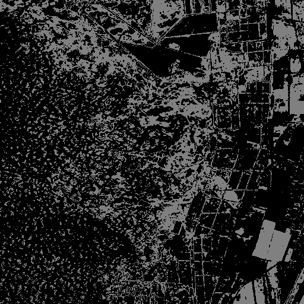 |
| Legend |  |
| JSON | [json](tile_9/kmeans_mask_claude-3-5-haiku-20241022_vlm_categories.json) |

#### Per-class metrics

| Class Code | Class Name (EN) | IoU | Precision | Recall | F1 | Pixel Acc | Support True | Support Pred |
|------------|----------------|-----|-----------|--------|----|-----------|-------------|-------------|
| 0 | Unknown | 0.0000 | 0.0000 | 0.0000 | 0.0000 |  |  |  |
| 10 | Tree cover | 0.0000 | 0.0000 | 0.0000 | 0.0000 |  |  |  |
| 30 | Grassland | 0.0000 | 0.0000 | 0.0000 | 0.0000 |  |  |  |
| 40 | Cropland | 0.0000 | 0.0000 | 0.0000 | 0.0000 |  |  |  |
| 50 | Built-up | 0.0000 | 0.0000 | 0.0000 | 0.0000 |  |  |  |
| 60 | Bare / sparse vegetation | 0.0001 | 0.0002 | 0.0007 | 0.0003 |  |  |  |
| 80 | Permanent water bodies | 0.0000 | 0.0000 | 0.0000 | 0.0000 |  |  |  |
| 90 | Herbaceous wetland | 0.0000 | 0.0000 | 0.0000 | 0.0000 |  |  |  |

### kmeans  claude-3-5-sonnet-20240620
| Metric | Value |
|--------|-------|
| accuracy | 0.0452 |
| iou | 0.0109 |
| f1 | 0.0207 |
| kappa | -0.0915 |
| Mask |  |
| Legend |  |
| JSON | [json](tile_9/kmeans_mask_claude-3-5-sonnet-20240620_vlm_categories.json) |

#### Per-class metrics

| Class Code | Class Name (EN) | IoU | Precision | Recall | F1 | Pixel Acc | Support True | Support Pred |
|------------|----------------|-----|-----------|--------|----|-----------|-------------|-------------|
| 10 | Tree cover | 0.0000 | 0.0000 | 0.0000 | 0.0000 |  |  |  |
| 20 | Shrubland | 0.0000 | 0.0000 | 0.0000 | 0.0000 |  |  |  |
| 30 | Grassland | 0.0625 | 0.2880 | 0.0739 | 0.1177 |  |  |  |
| 40 | Cropland | 0.0150 | 0.0239 | 0.0392 | 0.0296 |  |  |  |
| 50 | Built-up | 0.0091 | 0.0092 | 0.6253 | 0.0181 |  |  |  |
| 60 | Bare / sparse vegetation | 0.0001 | 0.0002 | 0.0007 | 0.0003 |  |  |  |
| 80 | Permanent water bodies | 0.0000 | 0.0000 | 0.0000 | 0.0000 |  |  |  |
| 90 | Herbaceous wetland | 0.0000 | 0.0000 | 0.0000 | 0.0000 |  |  |  |

### kmeans  claude-3-7-sonnet-20250219
| Metric | Value |
|--------|-------|
| accuracy | 0.0467 |
| iou | 0.0165 |
| f1 | 0.0303 |
| kappa | -0.0317 |
| Mask |  |
| Legend |  |
| JSON | [json](tile_9/kmeans_mask_claude-3-7-sonnet-20250219_vlm_categories.json) |

#### Per-class metrics

| Class Code | Class Name (EN) | IoU | Precision | Recall | F1 | Pixel Acc | Support True | Support Pred |
|------------|----------------|-----|-----------|--------|----|-----------|-------------|-------------|
| 10 | Tree cover | 0.0000 | 0.0000 | 0.0000 | 0.0000 |  |  |  |
| 20 | Shrubland | 0.0000 | 0.0000 | 0.0000 | 0.0000 |  |  |  |
| 30 | Grassland | 0.0000 | 0.0000 | 0.0000 | 0.0000 |  |  |  |
| 40 | Cropland | 0.1078 | 0.1307 | 0.3808 | 0.1946 |  |  |  |
| 50 | Built-up | 0.0000 | 0.0000 | 0.0000 | 0.0000 |  |  |  |
| 60 | Bare / sparse vegetation | 0.0001 | 0.0002 | 0.0007 | 0.0003 |  |  |  |
| 80 | Permanent water bodies | 0.0241 | 0.0278 | 0.1556 | 0.0471 |  |  |  |
| 90 | Herbaceous wetland | 0.0000 | 0.0000 | 0.0000 | 0.0000 |  |  |  |

### kmeans  gemini-2.5-pro-preview-05-06
| Metric | Value |
|--------|-------|
| accuracy | 0.1336 |
| iou | 0.0631 |
| f1 | 0.0871 |
| kappa | 0.0648 |
| Mask |  |
| Legend |  |
| JSON | [json](tile_9/kmeans_mask_gemini-2.5-pro-preview-05-06_vlm_categories.json) |

#### Per-class metrics

| Class Code | Class Name (EN) | IoU | Precision | Recall | F1 | Pixel Acc | Support True | Support Pred |
|------------|----------------|-----|-----------|--------|----|-----------|-------------|-------------|
| 10 | Tree cover | 0.4809 | 0.7290 | 0.5855 | 0.6494 |  |  |  |
| 20 | Shrubland | 0.0000 | 0.0000 | 0.0000 | 0.0000 |  |  |  |
| 30 | Grassland | 0.0000 | 0.0000 | 0.0000 | 0.0000 |  |  |  |
| 40 | Cropland | 0.0000 | 0.0000 | 0.0000 | 0.0000 |  |  |  |
| 50 | Built-up | 0.0000 | 0.0000 | 0.0000 | 0.0000 |  |  |  |
| 60 | Bare / sparse vegetation | 0.0001 | 0.0002 | 0.0007 | 0.0003 |  |  |  |
| 80 | Permanent water bodies | 0.0241 | 0.0278 | 0.1556 | 0.0471 |  |  |  |
| 90 | Herbaceous wetland | 0.0000 | 0.0000 | 0.0000 | 0.0000 |  |  |  |

### kmeans  gpt-4.1-2025-04-14
| Metric | Value |
|--------|-------|
| accuracy | 0.0463 |
| iou | 0.0186 |
| f1 | 0.0324 |
| kappa | -0.0162 |
| Mask |  |
| Legend |  |
| JSON | [json](tile_9/kmeans_mask_gpt-4.1-2025-04-14_vlm_categories.json) |

#### Per-class metrics

| Class Code | Class Name (EN) | IoU | Precision | Recall | F1 | Pixel Acc | Support True | Support Pred |
|------------|----------------|-----|-----------|--------|----|-----------|-------------|-------------|
| 10 | Tree cover | 0.0000 | 0.0000 | 0.0000 | 0.0000 |  |  |  |
| 20 | Shrubland | 0.0000 | 0.0000 | 0.0000 | 0.0000 |  |  |  |
| 30 | Grassland | 0.0000 | 0.0000 | 0.0000 | 0.0000 |  |  |  |
| 40 | Cropland | 0.1468 | 0.1831 | 0.4257 | 0.2560 |  |  |  |
| 50 | Built-up | 0.0000 | 0.0000 | 0.0000 | 0.0000 |  |  |  |
| 60 | Bare / sparse vegetation | 0.0017 | 0.0019 | 0.0145 | 0.0034 |  |  |  |
| 80 | Permanent water bodies | 0.0000 | 0.0000 | 0.0000 | 0.0000 |  |  |  |
| 90 | Herbaceous wetland | 0.0000 | 0.0000 | 0.0000 | 0.0000 |  |  |  |

### kmeans  gpt-4.1-mini-2025-04-14
| Metric | Value |
|--------|-------|
| accuracy | 0.0493 |
| iou | 0.0127 |
| f1 | 0.0243 |
| kappa | -0.0966 |
| Mask |  |
| Legend |  |
| JSON | [json](tile_9/kmeans_mask_gpt-4.1-mini-2025-04-14_vlm_categories.json) |

#### Per-class metrics

| Class Code | Class Name (EN) | IoU | Precision | Recall | F1 | Pixel Acc | Support True | Support Pred |
|------------|----------------|-----|-----------|--------|----|-----------|-------------|-------------|
| 10 | Tree cover | 0.0000 | 0.0000 | 0.0000 | 0.0000 |  |  |  |
| 20 | Shrubland | 0.0000 | 0.0000 | 0.0000 | 0.0000 |  |  |  |
| 30 | Grassland | 0.0625 | 0.2880 | 0.0739 | 0.1177 |  |  |  |
| 40 | Cropland | 0.0150 | 0.0239 | 0.0392 | 0.0296 |  |  |  |
| 50 | Built-up | 0.0000 | 0.0000 | 0.0000 | 0.0000 |  |  |  |
| 60 | Bare / sparse vegetation | 0.0001 | 0.0002 | 0.0007 | 0.0003 |  |  |  |
| 80 | Permanent water bodies | 0.0241 | 0.0278 | 0.1556 | 0.0471 |  |  |  |
| 90 | Herbaceous wetland | 0.0000 | 0.0000 | 0.0000 | 0.0000 |  |  |  |

### kmeans  gpt-4o-2024-08-06
| Metric | Value |
|--------|-------|
| accuracy | 0.0690 |
| iou | 0.0250 |
| f1 | 0.0474 |
| kappa | -0.0689 |
| Mask |  |
| Legend |  |
| JSON | [json](tile_9/kmeans_mask_gpt-4o-2024-08-06_vlm_categories.json) |

#### Per-class metrics

| Class Code | Class Name (EN) | IoU | Precision | Recall | F1 | Pixel Acc | Support True | Support Pred |
|------------|----------------|-----|-----------|--------|----|-----------|-------------|-------------|
| 10 | Tree cover | 0.0825 | 0.1327 | 0.1790 | 0.1524 |  |  |  |
| 30 | Grassland | 0.0258 | 0.2268 | 0.0283 | 0.0503 |  |  |  |
| 40 | Cropland | 0.0427 | 0.0797 | 0.0840 | 0.0818 |  |  |  |
| 50 | Built-up | 0.0001 | 0.0001 | 0.0060 | 0.0002 |  |  |  |
| 60 | Bare / sparse vegetation | 0.0000 | 0.0000 | 0.0000 | 0.0000 |  |  |  |
| 80 | Permanent water bodies | 0.0241 | 0.0278 | 0.1556 | 0.0471 |  |  |  |
| 90 | Herbaceous wetland | 0.0000 | 0.0000 | 0.0000 | 0.0000 |  |  |  |

### kmeans  gpt-4o-mini-2024-07-18
| Metric | Value |
|--------|-------|
| accuracy | 0.0575 |
| iou | 0.0131 |
| f1 | 0.0249 |
| kappa | -0.0953 |
| Mask |  |
| Legend |  |
| JSON | [json](tile_9/kmeans_mask_gpt-4o-mini-2024-07-18_vlm_categories.json) |

#### Per-class metrics

| Class Code | Class Name (EN) | IoU | Precision | Recall | F1 | Pixel Acc | Support True | Support Pred |
|------------|----------------|-----|-----------|--------|----|-----------|-------------|-------------|
| 10 | Tree cover | 0.0670 | 0.0964 | 0.1798 | 0.1255 |  |  |  |
| 20 | Shrubland | 0.0000 | 0.0000 | 0.0000 | 0.0000 |  |  |  |
| 30 | Grassland | 0.0000 | 0.0000 | 0.0000 | 0.0000 |  |  |  |
| 40 | Cropland | 0.0382 | 0.0468 | 0.1725 | 0.0737 |  |  |  |
| 50 | Built-up | 0.0000 | 0.0000 | 0.0000 | 0.0000 |  |  |  |
| 60 | Bare / sparse vegetation | 0.0000 | 0.0000 | 0.0000 | 0.0000 |  |  |  |
| 80 | Permanent water bodies | 0.0000 | 0.0000 | 0.0000 | 0.0000 |  |  |  |
| 90 | Herbaceous wetland | 0.0000 | 0.0000 | 0.0000 | 0.0000 |  |  |  |

### kmeans  grok-2-vision-1212
| Metric | Value |
|--------|-------|
| accuracy | 0.2206 |
| iou | 0.0950 |
| f1 | 0.1393 |
| kappa | 0.1007 |
| Mask |  |
| Legend |  |
| JSON | [json](tile_9/kmeans_mask_grok-2-vision-1212_vlm_categories.json) |

#### Per-class metrics

| Class Code | Class Name (EN) | IoU | Precision | Recall | F1 | Pixel Acc | Support True | Support Pred |
|------------|----------------|-----|-----------|--------|----|-----------|-------------|-------------|
| 10 | Tree cover | 0.4809 | 0.7290 | 0.5855 | 0.6494 |  |  |  |
| 30 | Grassland | 0.1560 | 0.7694 | 0.1636 | 0.2699 |  |  |  |
| 40 | Cropland | 0.0000 | 0.0000 | 0.0000 | 0.0000 |  |  |  |
| 50 | Built-up | 0.0041 | 0.0042 | 0.1766 | 0.0081 |  |  |  |
| 60 | Bare / sparse vegetation | 0.0001 | 0.0002 | 0.0007 | 0.0003 |  |  |  |
| 80 | Permanent water bodies | 0.0241 | 0.0278 | 0.1556 | 0.0471 |  |  |  |
| 90 | Herbaceous wetland | 0.0000 | 0.0000 | 0.0000 | 0.0000 |  |  |  |

### kmeans  o4-mini
| Metric | Value |
|--------|-------|
| accuracy | 0.0327 |
| iou | 0.0165 |
| f1 | 0.0307 |
| kappa | -0.0360 |
| Mask |  |
| Legend |  |
| JSON | [json](tile_9/kmeans_mask_o4-mini_vlm_categories.json) |

#### Per-class metrics

| Class Code | Class Name (EN) | IoU | Precision | Recall | F1 | Pixel Acc | Support True | Support Pred |
|------------|----------------|-----|-----------|--------|----|-----------|-------------|-------------|
| 10 | Tree cover | 0.0000 | 0.0000 | 0.0000 | 0.0000 |  |  |  |
| 20 | Shrubland | 0.0000 | 0.0000 | 0.0000 | 0.0000 |  |  |  |
| 30 | Grassland | 0.0000 | 0.0000 | 0.0000 | 0.0000 |  |  |  |
| 40 | Cropland | 0.0378 | 0.0501 | 0.1333 | 0.0729 |  |  |  |
| 50 | Built-up | 0.0000 | 0.0000 | 0.0000 | 0.0000 |  |  |  |
| 60 | Bare / sparse vegetation | 0.0001 | 0.0001 | 0.0007 | 0.0002 |  |  |  |
| 80 | Permanent water bodies | 0.0942 | 0.1052 | 0.4741 | 0.1722 |  |  |  |
| 90 | Herbaceous wetland | 0.0000 | 0.0000 | 0.0000 | 0.0000 |  |  |  |

### som  claude-3-5-haiku-20241022
| Metric | Value |
|--------|-------|
| accuracy | 0.0448 |
| iou | 0.0136 |
| f1 | 0.0257 |
| kappa | -0.0579 |
| Mask |  |
| Legend |  |
| JSON | [json](tile_9/som_mask_claude-3-5-haiku-20241022_vlm_categories.json) |

#### Per-class metrics

| Class Code | Class Name (EN) | IoU | Precision | Recall | F1 | Pixel Acc | Support True | Support Pred |
|------------|----------------|-----|-----------|--------|----|-----------|-------------|-------------|
| 10 | Tree cover | 0.0378 | 0.0873 | 0.0625 | 0.0728 |  |  |  |
| 20 | Shrubland | 0.0000 | 0.0000 | 0.0000 | 0.0000 |  |  |  |
| 30 | Grassland | 0.0000 | 0.0000 | 0.0000 | 0.0000 |  |  |  |
| 40 | Cropland | 0.0699 | 0.0844 | 0.2895 | 0.1307 |  |  |  |
| 50 | Built-up | 0.0000 | 0.0000 | 0.0000 | 0.0000 |  |  |  |
| 60 | Bare / sparse vegetation | 0.0009 | 0.0011 | 0.0056 | 0.0018 |  |  |  |
| 80 | Permanent water bodies | 0.0000 | 0.0000 | 0.0000 | 0.0000 |  |  |  |
| 90 | Herbaceous wetland | 0.0000 | 0.0000 | 0.0000 | 0.0000 |  |  |  |

### som  claude-3-5-sonnet-20240620
| Metric | Value |
|--------|-------|
| accuracy | 0.0536 |
| iou | 0.0259 |
| f1 | 0.0463 |
| kappa | -0.0112 |
| Mask |  |
| Legend |  |
| JSON | [json](tile_9/som_mask_claude-3-5-sonnet-20240620_vlm_categories.json) |

#### Per-class metrics

| Class Code | Class Name (EN) | IoU | Precision | Recall | F1 | Pixel Acc | Support True | Support Pred |
|------------|----------------|-----|-----------|--------|----|-----------|-------------|-------------|
| 10 | Tree cover | 0.0378 | 0.0873 | 0.0625 | 0.0728 |  |  |  |
| 20 | Shrubland | 0.0000 | 0.0000 | 0.0000 | 0.0000 |  |  |  |
| 30 | Grassland | 0.0000 | 0.0000 | 0.0000 | 0.0000 |  |  |  |
| 40 | Cropland | 0.1527 | 0.2099 | 0.3595 | 0.2650 |  |  |  |
| 50 | Built-up | 0.0137 | 0.0140 | 0.3938 | 0.0270 |  |  |  |
| 60 | Bare / sparse vegetation | 0.0003 | 0.0005 | 0.0006 | 0.0006 |  |  |  |
| 80 | Permanent water bodies | 0.0025 | 0.0033 | 0.0104 | 0.0050 |  |  |  |
| 90 | Herbaceous wetland | 0.0000 | 0.0000 | 0.0000 | 0.0000 |  |  |  |

### som  claude-3-7-sonnet-20250219
| Metric | Value |
|--------|-------|
| accuracy | 0.1509 |
| iou | 0.0413 |
| f1 | 0.0735 |
| kappa | 0.0045 |
| Mask |  |
| Legend |  |
| JSON | [json](tile_9/som_mask_claude-3-7-sonnet-20250219_vlm_categories.json) |

#### Per-class metrics

| Class Code | Class Name (EN) | IoU | Precision | Recall | F1 | Pixel Acc | Support True | Support Pred |
|------------|----------------|-----|-----------|--------|----|-----------|-------------|-------------|
| 10 | Tree cover | 0.0378 | 0.0873 | 0.0625 | 0.0728 |  |  |  |
| 20 | Shrubland | 0.0000 | 0.0000 | 0.0000 | 0.0000 |  |  |  |
| 30 | Grassland | 0.1854 | 0.8261 | 0.1929 | 0.3128 |  |  |  |
| 40 | Cropland | 0.0699 | 0.0844 | 0.2895 | 0.1307 |  |  |  |
| 50 | Built-up | 0.0000 | 0.0000 | 0.0000 | 0.0000 |  |  |  |
| 60 | Bare / sparse vegetation | 0.0003 | 0.0005 | 0.0006 | 0.0006 |  |  |  |
| 80 | Permanent water bodies | 0.0370 | 0.0511 | 0.1185 | 0.0714 |  |  |  |
| 90 | Herbaceous wetland | 0.0000 | 0.0000 | 0.0000 | 0.0000 |  |  |  |

### som  gemini-2.5-pro-preview-05-06
| Metric | Value |
|--------|-------|
| accuracy | 0.2519 |
| iou | 0.0652 |
| f1 | 0.1083 |
| kappa | 0.0057 |
| Mask |  |
| Legend |  |
| JSON | [json](tile_9/som_mask_gemini-2.5-pro-preview-05-06_vlm_categories.json) |

#### Per-class metrics

| Class Code | Class Name (EN) | IoU | Precision | Recall | F1 | Pixel Acc | Support True | Support Pred |
|------------|----------------|-----|-----------|--------|----|-----------|-------------|-------------|
| 10 | Tree cover | 0.0957 | 0.2986 | 0.1235 | 0.1747 |  |  |  |
| 30 | Grassland | 0.2881 | 0.5725 | 0.3670 | 0.4473 |  |  |  |
| 40 | Cropland | 0.0699 | 0.0844 | 0.2895 | 0.1307 |  |  |  |
| 50 | Built-up | 0.0000 | 0.0000 | 0.0000 | 0.0000 |  |  |  |
| 60 | Bare / sparse vegetation | 0.0003 | 0.0005 | 0.0006 | 0.0006 |  |  |  |
| 80 | Permanent water bodies | 0.0025 | 0.0033 | 0.0104 | 0.0050 |  |  |  |
| 90 | Herbaceous wetland | 0.0000 | 0.0000 | 0.0000 | 0.0000 |  |  |  |

### som  gpt-4.1-2025-04-14
| Metric | Value |
|--------|-------|
| accuracy | 0.1624 |
| iou | 0.0429 |
| f1 | 0.0773 |
| kappa | -0.0966 |
| Mask |  |
| Legend |  |
| JSON | [json](tile_9/som_mask_gpt-4.1-2025-04-14_vlm_categories.json) |

#### Per-class metrics

| Class Code | Class Name (EN) | IoU | Precision | Recall | F1 | Pixel Acc | Support True | Support Pred |
|------------|----------------|-----|-----------|--------|----|-----------|-------------|-------------|
| 10 | Tree cover | 0.0206 | 0.0734 | 0.0279 | 0.0405 |  |  |  |
| 20 | Shrubland | 0.0000 | 0.0000 | 0.0000 | 0.0000 |  |  |  |
| 30 | Grassland | 0.1636 | 0.3436 | 0.2379 | 0.2811 |  |  |  |
| 40 | Cropland | 0.0554 | 0.0883 | 0.1292 | 0.1049 |  |  |  |
| 50 | Built-up | 0.0137 | 0.0140 | 0.3938 | 0.0270 |  |  |  |
| 60 | Bare / sparse vegetation | 0.0898 | 0.1280 | 0.2311 | 0.1647 |  |  |  |
| 80 | Permanent water bodies | 0.0000 | 0.0000 | 0.0000 | 0.0000 |  |  |  |
| 90 | Herbaceous wetland | 0.0000 | 0.0000 | 0.0000 | 0.0000 |  |  |  |

### som  gpt-4.1-mini-2025-04-14
| Metric | Value |
|--------|-------|
| accuracy | 0.0850 |
| iou | 0.0362 |
| f1 | 0.0674 |
| kappa | 0.0071 |
| Mask |  |
| Legend |  |
| JSON | [json](tile_9/som_mask_gpt-4.1-mini-2025-04-14_vlm_categories.json) |

#### Per-class metrics

| Class Code | Class Name (EN) | IoU | Precision | Recall | F1 | Pixel Acc | Support True | Support Pred |
|------------|----------------|-----|-----------|--------|----|-----------|-------------|-------------|
| 10 | Tree cover | 0.0957 | 0.2986 | 0.1235 | 0.1747 |  |  |  |
| 20 | Shrubland | 0.0000 | 0.0000 | 0.0000 | 0.0000 |  |  |  |
| 30 | Grassland | 0.0000 | 0.0000 | 0.0000 | 0.0000 |  |  |  |
| 40 | Cropland | 0.0699 | 0.0844 | 0.2895 | 0.1307 |  |  |  |
| 50 | Built-up | 0.0000 | 0.0000 | 0.0000 | 0.0000 |  |  |  |
| 60 | Bare / sparse vegetation | 0.0612 | 0.0768 | 0.2318 | 0.1153 |  |  |  |
| 80 | Permanent water bodies | 0.0000 | 0.0000 | 0.0000 | 0.0000 |  |  |  |
| 90 | Herbaceous wetland | 0.0627 | 0.0733 | 0.3044 | 0.1181 |  |  |  |

### som  gpt-4o-2024-08-06
| Metric | Value |
|--------|-------|
| accuracy | 0.1610 |
| iou | 0.0663 |
| f1 | 0.1177 |
| kappa | 0.0325 |
| Mask |  |
| Legend |  |
| JSON | [json](tile_9/som_mask_gpt-4o-2024-08-06_vlm_categories.json) |

#### Per-class metrics

| Class Code | Class Name (EN) | IoU | Precision | Recall | F1 | Pixel Acc | Support True | Support Pred |
|------------|----------------|-----|-----------|--------|----|-----------|-------------|-------------|
| 10 | Tree cover | 0.0206 | 0.0734 | 0.0279 | 0.0405 |  |  |  |
| 30 | Grassland | 0.1634 | 0.6162 | 0.1820 | 0.2810 |  |  |  |
| 40 | Cropland | 0.1527 | 0.2099 | 0.3595 | 0.2650 |  |  |  |
| 50 | Built-up | 0.0005 | 0.0005 | 0.0597 | 0.0010 |  |  |  |
| 60 | Bare / sparse vegetation | 0.0898 | 0.1280 | 0.2311 | 0.1647 |  |  |  |
| 80 | Permanent water bodies | 0.0370 | 0.0511 | 0.1185 | 0.0714 |  |  |  |
| 90 | Herbaceous wetland | 0.0000 | 0.0000 | 0.0000 | 0.0000 |  |  |  |

### som  gpt-4o-mini-2024-07-18
| Metric | Value |
|--------|-------|
| accuracy | 0.1142 |
| iou | 0.0519 |
| f1 | 0.0922 |
| kappa | 0.0486 |
| Mask |  |
| Legend |  |
| JSON | [json](tile_9/som_mask_gpt-4o-mini-2024-07-18_vlm_categories.json) |

#### Per-class metrics

| Class Code | Class Name (EN) | IoU | Precision | Recall | F1 | Pixel Acc | Support True | Support Pred |
|------------|----------------|-----|-----------|--------|----|-----------|-------------|-------------|
| 10 | Tree cover | 0.0206 | 0.0734 | 0.0279 | 0.0405 |  |  |  |
| 20 | Shrubland | 0.0000 | 0.0000 | 0.0000 | 0.0000 |  |  |  |
| 30 | Grassland | 0.0000 | 0.0000 | 0.0000 | 0.0000 |  |  |  |
| 40 | Cropland | 0.1527 | 0.2099 | 0.3595 | 0.2650 |  |  |  |
| 50 | Built-up | 0.0010 | 0.0010 | 0.0382 | 0.0019 |  |  |  |
| 60 | Bare / sparse vegetation | 0.1316 | 0.1381 | 0.7391 | 0.2327 |  |  |  |
| 80 | Permanent water bodies | 0.1094 | 0.1232 | 0.4946 | 0.1972 |  |  |  |
| 90 | Herbaceous wetland | 0.0000 | 0.0000 | 0.0000 | 0.0000 |  |  |  |

### som  grok-2-vision-1212
| Metric | Value |
|--------|-------|
| accuracy | 0.0000 |
| iou | 0.0000 |
| f1 | 0.0001 |
| kappa | -0.0056 |
| Mask |  |
| Legend |  |
| JSON | [json](tile_9/som_mask_grok-2-vision-1212_vlm_categories.json) |

#### Per-class metrics

| Class Code | Class Name (EN) | IoU | Precision | Recall | F1 | Pixel Acc | Support True | Support Pred |
|------------|----------------|-----|-----------|--------|----|-----------|-------------|-------------|
| 0 | Unknown | 0.0000 | 0.0000 | 0.0000 | 0.0000 |  |  |  |
| 10 | Tree cover | 0.0000 | 0.0000 | 0.0000 | 0.0000 |  |  |  |
| 30 | Grassland | 0.0000 | 0.0000 | 0.0000 | 0.0000 |  |  |  |
| 40 | Cropland | 0.0000 | 0.0000 | 0.0000 | 0.0000 |  |  |  |
| 50 | Built-up | 0.0000 | 0.0000 | 0.0000 | 0.0000 |  |  |  |
| 60 | Bare / sparse vegetation | 0.0003 | 0.0005 | 0.0006 | 0.0006 |  |  |  |
| 80 | Permanent water bodies | 0.0000 | 0.0000 | 0.0000 | 0.0000 |  |  |  |
| 90 | Herbaceous wetland | 0.0000 | 0.0000 | 0.0000 | 0.0000 |  |  |  |

### som  o4-mini
| Metric | Value |
|--------|-------|
| accuracy | 0.0680 |
| iou | 0.0336 |
| f1 | 0.0619 |
| kappa | 0.0105 |
| Mask |  |
| Legend |  |
| JSON | [json](tile_9/som_mask_o4-mini_vlm_categories.json) |

#### Per-class metrics

| Class Code | Class Name (EN) | IoU | Precision | Recall | F1 | Pixel Acc | Support True | Support Pred |
|------------|----------------|-----|-----------|--------|----|-----------|-------------|-------------|
| 10 | Tree cover | 0.0957 | 0.2986 | 0.1235 | 0.1747 |  |  |  |
| 20 | Shrubland | 0.0000 | 0.0000 | 0.0000 | 0.0000 |  |  |  |
| 30 | Grassland | 0.0000 | 0.0000 | 0.0000 | 0.0000 |  |  |  |
| 40 | Cropland | 0.0167 | 0.0306 | 0.0354 | 0.0329 |  |  |  |
| 50 | Built-up | 0.0000 | 0.0000 | 0.0000 | 0.0000 |  |  |  |
| 60 | Bare / sparse vegetation | 0.0003 | 0.0005 | 0.0006 | 0.0006 |  |  |  |
| 80 | Permanent water bodies | 0.1094 | 0.1232 | 0.4946 | 0.1972 |  |  |  |
| 90 | Herbaceous wetland | 0.0471 | 0.0496 | 0.4829 | 0.0899 |  |  |  |

### unet  claude-3-5-haiku-20241022
| Metric | Value |
|--------|-------|
| accuracy | 0.1264 |
| iou | 0.0437 |
| f1 | 0.0767 |
| kappa | -0.0092 |
| Mask |  |
| Legend |  |
| JSON | [json](tile_9/unet_mask_claude-3-5-haiku-20241022_vlm_categories.json) |

#### Per-class metrics

| Class Code | Class Name (EN) | IoU | Precision | Recall | F1 | Pixel Acc | Support True | Support Pred |
|------------|----------------|-----|-----------|--------|----|-----------|-------------|-------------|
| 10 | Tree cover | 0.0418 | 0.0632 | 0.1097 | 0.0802 |  |  |  |
| 20 | Shrubland | 0.0000 | 0.0000 | 0.0000 | 0.0000 |  |  |  |
| 30 | Grassland | 0.0000 | 0.0000 | 0.0000 | 0.0000 |  |  |  |
| 40 | Cropland | 0.1426 | 0.1696 | 0.4729 | 0.2497 |  |  |  |
| 50 | Built-up | 0.0000 | 0.0000 | 0.0000 | 0.0000 |  |  |  |
| 60 | Bare / sparse vegetation | 0.1655 | 0.1744 | 0.7639 | 0.2840 |  |  |  |
| 80 | Permanent water bodies | 0.0000 | 0.0000 | 0.0000 | 0.0000 |  |  |  |
| 90 | Herbaceous wetland | 0.0000 | 0.0000 | 0.0000 | 0.0000 |  |  |  |

### unet  claude-3-5-sonnet-20240620
| Metric | Value |
|--------|-------|
| accuracy | 0.0901 |
| iou | 0.0315 |
| f1 | 0.0576 |
| kappa | -0.0311 |
| Mask |  |
| Legend |  |
| JSON | [json](tile_9/unet_mask_claude-3-5-sonnet-20240620_vlm_categories.json) |

#### Per-class metrics

| Class Code | Class Name (EN) | IoU | Precision | Recall | F1 | Pixel Acc | Support True | Support Pred |
|------------|----------------|-----|-----------|--------|----|-----------|-------------|-------------|
| 10 | Tree cover | 0.1283 | 0.2958 | 0.1848 | 0.2275 |  |  |  |
| 20 | Shrubland | 0.0000 | 0.0000 | 0.0000 | 0.0000 |  |  |  |
| 30 | Grassland | 0.0566 | 0.3863 | 0.0622 | 0.1071 |  |  |  |
| 40 | Cropland | 0.0645 | 0.1007 | 0.1522 | 0.1212 |  |  |  |
| 50 | Built-up | 0.0008 | 0.0009 | 0.0072 | 0.0016 |  |  |  |
| 60 | Bare / sparse vegetation | 0.0018 | 0.0021 | 0.0118 | 0.0036 |  |  |  |
| 80 | Permanent water bodies | 0.0000 | 0.0000 | 0.0000 | 0.0000 |  |  |  |
| 90 | Herbaceous wetland | 0.0000 | 0.0000 | 0.0000 | 0.0000 |  |  |  |

### unet  claude-3-7-sonnet-20250219
| Metric | Value |
|--------|-------|
| accuracy | 0.3430 |
| iou | 0.0820 |
| f1 | 0.1229 |
| kappa | 0.1110 |
| Mask |  |
| Legend |  |
| JSON | [json](tile_9/unet_mask_claude-3-7-sonnet-20250219_vlm_categories.json) |

#### Per-class metrics

| Class Code | Class Name (EN) | IoU | Precision | Recall | F1 | Pixel Acc | Support True | Support Pred |
|------------|----------------|-----|-----------|--------|----|-----------|-------------|-------------|
| 10 | Tree cover | 0.1283 | 0.2958 | 0.1848 | 0.2275 |  |  |  |
| 20 | Shrubland | 0.0000 | 0.0000 | 0.0000 | 0.0000 |  |  |  |
| 30 | Grassland | 0.4624 | 0.7577 | 0.5426 | 0.6324 |  |  |  |
| 40 | Cropland | 0.0645 | 0.1007 | 0.1522 | 0.1212 |  |  |  |
| 50 | Built-up | 0.0008 | 0.0009 | 0.0072 | 0.0016 |  |  |  |
| 60 | Bare / sparse vegetation | 0.0003 | 0.0004 | 0.0014 | 0.0007 |  |  |  |
| 80 | Permanent water bodies | 0.0000 | 0.0000 | 0.0000 | 0.0000 |  |  |  |
| 90 | Herbaceous wetland | 0.0000 | 0.0000 | 0.0000 | 0.0000 |  |  |  |

### unet  gemini-2.5-pro-preview-05-06
| Metric | Value |
|--------|-------|
| accuracy | 0.0000 |
| iou | 0.0000 |
| f1 | 0.0000 |
| kappa | 0.0000 |
| Mask |  |
| Legend |  |
| JSON | [json](tile_9/unet_mask_gemini-2.5-pro-preview-05-06_vlm_categories.json) |

#### Per-class metrics

| Class Code | Class Name (EN) | IoU | Precision | Recall | F1 | Pixel Acc | Support True | Support Pred |
|------------|----------------|-----|-----------|--------|----|-----------|-------------|-------------|
| 0 | Unknown | 0.0000 | 0.0000 | 0.0000 | 0.0000 |  |  |  |
| 10 | Tree cover | 0.0000 | 0.0000 | 0.0000 | 0.0000 |  |  |  |
| 30 | Grassland | 0.0000 | 0.0000 | 0.0000 | 0.0000 |  |  |  |
| 40 | Cropland | 0.0000 | 0.0000 | 0.0000 | 0.0000 |  |  |  |
| 50 | Built-up | 0.0000 | 0.0000 | 0.0000 | 0.0000 |  |  |  |
| 60 | Bare / sparse vegetation | 0.0000 | 0.0000 | 0.0000 | 0.0000 |  |  |  |
| 80 | Permanent water bodies | 0.0000 | 0.0000 | 0.0000 | 0.0000 |  |  |  |
| 90 | Herbaceous wetland | 0.0000 | 0.0000 | 0.0000 | 0.0000 |  |  |  |

### unet  gpt-4.1-2025-04-14
| Metric | Value |
|--------|-------|
| accuracy | 0.0604 |
| iou | 0.0168 |
| f1 | 0.0311 |
| kappa | -0.0249 |
| Mask |  |
| Legend |  |
| JSON | [json](tile_9/unet_mask_gpt-4.1-2025-04-14_vlm_categories.json) |

#### Per-class metrics

| Class Code | Class Name (EN) | IoU | Precision | Recall | F1 | Pixel Acc | Support True | Support Pred |
|------------|----------------|-----|-----------|--------|----|-----------|-------------|-------------|
| 10 | Tree cover | 0.0049 | 0.0461 | 0.0055 | 0.0098 |  |  |  |
| 30 | Grassland | 0.0000 | 0.0000 | 0.0000 | 0.0000 |  |  |  |
| 40 | Cropland | 0.0953 | 0.1042 | 0.5273 | 0.1741 |  |  |  |
| 50 | Built-up | 0.0000 | 0.0000 | 0.0000 | 0.0000 |  |  |  |
| 60 | Bare / sparse vegetation | 0.0003 | 0.0004 | 0.0014 | 0.0007 |  |  |  |
| 80 | Permanent water bodies | 0.0169 | 0.0213 | 0.0747 | 0.0332 |  |  |  |
| 90 | Herbaceous wetland | 0.0000 | 0.0000 | 0.0000 | 0.0000 |  |  |  |

### unet  gpt-4.1-mini-2025-04-14
| Metric | Value |
|--------|-------|
| accuracy | 0.0227 |
| iou | 0.0193 |
| f1 | 0.0359 |
| kappa | -0.0315 |
| Mask |  |
| Legend |  |
| JSON | [json](tile_9/unet_mask_gpt-4.1-mini-2025-04-14_vlm_categories.json) |

#### Per-class metrics

| Class Code | Class Name (EN) | IoU | Precision | Recall | F1 | Pixel Acc | Support True | Support Pred |
|------------|----------------|-----|-----------|--------|----|-----------|-------------|-------------|
| 10 | Tree cover | 0.0000 | 0.0000 | 0.0000 | 0.0000 |  |  |  |
| 20 | Shrubland | 0.0000 | 0.0000 | 0.0000 | 0.0000 |  |  |  |
| 30 | Grassland | 0.0000 | 0.0000 | 0.0000 | 0.0000 |  |  |  |
| 40 | Cropland | 0.0645 | 0.1007 | 0.1522 | 0.1212 |  |  |  |
| 50 | Built-up | 0.0035 | 0.0035 | 0.4189 | 0.0070 |  |  |  |
| 60 | Bare / sparse vegetation | 0.0003 | 0.0004 | 0.0014 | 0.0007 |  |  |  |
| 80 | Permanent water bodies | 0.0000 | 0.0000 | 0.0000 | 0.0000 |  |  |  |
| 90 | Herbaceous wetland | 0.0858 | 0.1934 | 0.1335 | 0.1580 |  |  |  |

### unet  gpt-4o-2024-08-06
| Metric | Value |
|--------|-------|
| accuracy | 0.0000 |
| iou | 0.0000 |
| f1 | 0.0000 |
| kappa | 0.0000 |
| Mask |  |
| Legend |  |
| JSON | [json](tile_9/unet_mask_gpt-4o-2024-08-06_vlm_categories.json) |

#### Per-class metrics

| Class Code | Class Name (EN) | IoU | Precision | Recall | F1 | Pixel Acc | Support True | Support Pred |
|------------|----------------|-----|-----------|--------|----|-----------|-------------|-------------|
| 0 | Unknown | 0.0000 | 0.0000 | 0.0000 | 0.0000 |  |  |  |
| 10 | Tree cover | 0.0000 | 0.0000 | 0.0000 | 0.0000 |  |  |  |
| 30 | Grassland | 0.0000 | 0.0000 | 0.0000 | 0.0000 |  |  |  |
| 40 | Cropland | 0.0000 | 0.0000 | 0.0000 | 0.0000 |  |  |  |
| 50 | Built-up | 0.0000 | 0.0000 | 0.0000 | 0.0000 |  |  |  |
| 60 | Bare / sparse vegetation | 0.0000 | 0.0000 | 0.0000 | 0.0000 |  |  |  |
| 80 | Permanent water bodies | 0.0000 | 0.0000 | 0.0000 | 0.0000 |  |  |  |
| 90 | Herbaceous wetland | 0.0000 | 0.0000 | 0.0000 | 0.0000 |  |  |  |

### unet  gpt-4o-mini-2024-07-18
| Metric | Value |
|--------|-------|
| accuracy | 0.1736 |
| iou | 0.0912 |
| f1 | 0.1263 |
| kappa | 0.0950 |
| Mask |  |
| Legend |  |
| JSON | [json](tile_9/unet_mask_gpt-4o-mini-2024-07-18_vlm_categories.json) |

#### Per-class metrics

| Class Code | Class Name (EN) | IoU | Precision | Recall | F1 | Pixel Acc | Support True | Support Pred |
|------------|----------------|-----|-----------|--------|----|-----------|-------------|-------------|
| 10 | Tree cover | 0.5441 | 0.7110 | 0.6986 | 0.7047 |  |  |  |
| 30 | Grassland | 0.0040 | 0.0842 | 0.0041 | 0.0079 |  |  |  |
| 40 | Cropland | 0.0006 | 0.0013 | 0.0010 | 0.0012 |  |  |  |
| 50 | Built-up | 0.0035 | 0.0035 | 0.4189 | 0.0070 |  |  |  |
| 60 | Bare / sparse vegetation | 0.0696 | 0.0926 | 0.2185 | 0.1301 |  |  |  |
| 80 | Permanent water bodies | 0.0169 | 0.0213 | 0.0747 | 0.0332 |  |  |  |
| 90 | Herbaceous wetland | 0.0000 | 0.0000 | 0.0000 | 0.0000 |  |  |  |

### unet  grok-2-vision-1212
| Metric | Value |
|--------|-------|
| accuracy | 0.0001 |
| iou | 0.0000 |
| f1 | 0.0001 |
| kappa | -0.0147 |
| Mask |  |
| Legend |  |
| JSON | [json](tile_9/unet_mask_grok-2-vision-1212_vlm_categories.json) |

#### Per-class metrics

| Class Code | Class Name (EN) | IoU | Precision | Recall | F1 | Pixel Acc | Support True | Support Pred |
|------------|----------------|-----|-----------|--------|----|-----------|-------------|-------------|
| 0 | Unknown | 0.0000 | 0.0000 | 0.0000 | 0.0000 |  |  |  |
| 10 | Tree cover | 0.0000 | 0.0000 | 0.0000 | 0.0000 |  |  |  |
| 30 | Grassland | 0.0000 | 0.0000 | 0.0000 | 0.0000 |  |  |  |
| 40 | Cropland | 0.0000 | 0.0000 | 0.0000 | 0.0000 |  |  |  |
| 50 | Built-up | 0.0000 | 0.0000 | 0.0000 | 0.0000 |  |  |  |
| 60 | Bare / sparse vegetation | 0.0003 | 0.0004 | 0.0014 | 0.0007 |  |  |  |
| 80 | Permanent water bodies | 0.0000 | 0.0000 | 0.0000 | 0.0000 |  |  |  |
| 90 | Herbaceous wetland | 0.0000 | 0.0000 | 0.0000 | 0.0000 |  |  |  |

### unet  o4-mini
| Metric | Value |
|--------|-------|
| accuracy | 0.0894 |
| iou | 0.0260 |
| f1 | 0.0467 |
| kappa | 0.0138 |
| Mask |  |
| Legend |  |
| JSON | [json](tile_9/unet_mask_o4-mini_vlm_categories.json) |

#### Per-class metrics

| Class Code | Class Name (EN) | IoU | Precision | Recall | F1 | Pixel Acc | Support True | Support Pred |
|------------|----------------|-----|-----------|--------|----|-----------|-------------|-------------|
| 10 | Tree cover | 0.0000 | 0.0000 | 0.0000 | 0.0000 |  |  |  |
| 20 | Shrubland | 0.0000 | 0.0000 | 0.0000 | 0.0000 |  |  |  |
| 30 | Grassland | 0.0000 | 0.0000 | 0.0000 | 0.0000 |  |  |  |
| 40 | Cropland | 0.1357 | 0.1442 | 0.6959 | 0.2390 |  |  |  |
| 50 | Built-up | 0.0000 | 0.0000 | 0.0000 | 0.0000 |  |  |  |
| 60 | Bare / sparse vegetation | 0.0003 | 0.0004 | 0.0014 | 0.0007 |  |  |  |
| 80 | Permanent water bodies | 0.0719 | 0.0810 | 0.3903 | 0.1342 |  |  |  |
| 90 | Herbaceous wetland | 0.0000 | 0.0000 | 0.0000 | 0.0000 |  |  |  |

### watershed_kmeans  claude-3-5-haiku-20241022
| Metric | Value |
|--------|-------|
| accuracy | 0.0206 |
| iou | 0.0106 |
| f1 | 0.0197 |
| kappa | -0.0284 |
| Mask |  |
| Legend |  |
| JSON | [json](tile_9/watershed_kmeans_mask_claude-3-5-haiku-20241022_vlm_categories.json) |

#### Per-class metrics

| Class Code | Class Name (EN) | IoU | Precision | Recall | F1 | Pixel Acc | Support True | Support Pred |
|------------|----------------|-----|-----------|--------|----|-----------|-------------|-------------|
| 0 | Unknown | 0.0000 | 0.0000 | 0.0000 | 0.0000 |  |  |  |
| 10 | Tree cover | 0.0111 | 0.0254 | 0.0195 | 0.0221 |  |  |  |
| 20 | Shrubland | 0.0000 | 0.0000 | 0.0000 | 0.0000 |  |  |  |
| 30 | Grassland | 0.0000 | 0.0000 | 0.0000 | 0.0000 |  |  |  |
| 40 | Cropland | 0.0843 | 0.1574 | 0.1535 | 0.1554 |  |  |  |
| 50 | Built-up | 0.0000 | 0.0000 | 0.0000 | 0.0000 |  |  |  |
| 60 | Bare / sparse vegetation | 0.0000 | 0.0000 | 0.0000 | 0.0000 |  |  |  |
| 80 | Permanent water bodies | 0.0000 | 0.0000 | 0.0000 | 0.0000 |  |  |  |
| 90 | Herbaceous wetland | 0.0000 | 0.0000 | 0.0000 | 0.0000 |  |  |  |

### watershed_kmeans  claude-3-5-sonnet-20240620
| Metric | Value |
|--------|-------|
| accuracy | 0.0736 |
| iou | 0.0245 |
| f1 | 0.0426 |
| kappa | -0.0486 |
| Mask |  |
| Legend |  |
| JSON | [json](tile_9/watershed_kmeans_mask_claude-3-5-sonnet-20240620_vlm_categories.json) |

#### Per-class metrics

| Class Code | Class Name (EN) | IoU | Precision | Recall | F1 | Pixel Acc | Support True | Support Pred |
|------------|----------------|-----|-----------|--------|----|-----------|-------------|-------------|
| 10 | Tree cover | 0.0035 | 0.0082 | 0.0060 | 0.0069 |  |  |  |
| 20 | Shrubland | 0.0000 | 0.0000 | 0.0000 | 0.0000 |  |  |  |
| 30 | Grassland | 0.0177 | 0.1610 | 0.0195 | 0.0348 |  |  |  |
| 40 | Cropland | 0.1720 | 0.1967 | 0.5785 | 0.2936 |  |  |  |
| 50 | Built-up | 0.0001 | 0.0001 | 0.0060 | 0.0002 |  |  |  |
| 60 | Bare / sparse vegetation | 0.0004 | 0.0006 | 0.0015 | 0.0008 |  |  |  |
| 80 | Permanent water bodies | 0.0022 | 0.0033 | 0.0063 | 0.0043 |  |  |  |
| 90 | Herbaceous wetland | 0.0000 | 0.0000 | 0.0000 | 0.0000 |  |  |  |

### watershed_kmeans  claude-3-7-sonnet-20250219
| Metric | Value |
|--------|-------|
| accuracy | 0.0386 |
| iou | 0.0296 |
| f1 | 0.0495 |
| kappa | -0.0222 |
| Mask |  |
| Legend |  |
| JSON | [json](tile_9/watershed_kmeans_mask_claude-3-7-sonnet-20250219_vlm_categories.json) |

#### Per-class metrics

| Class Code | Class Name (EN) | IoU | Precision | Recall | F1 | Pixel Acc | Support True | Support Pred |
|------------|----------------|-----|-----------|--------|----|-----------|-------------|-------------|
| 0 | Unknown | 0.0000 | 0.0000 | 0.0000 | 0.0000 |  |  |  |
| 10 | Tree cover | 0.0000 | 0.0000 | 0.0000 | 0.0000 |  |  |  |
| 20 | Shrubland | 0.0000 | 0.0000 | 0.0000 | 0.0000 |  |  |  |
| 30 | Grassland | 0.0177 | 0.1610 | 0.0195 | 0.0348 |  |  |  |
| 40 | Cropland | 0.0183 | 0.0272 | 0.0529 | 0.0360 |  |  |  |
| 50 | Built-up | 0.0000 | 0.0000 | 0.0000 | 0.0000 |  |  |  |
| 60 | Bare / sparse vegetation | 0.2307 | 0.4309 | 0.3318 | 0.3749 |  |  |  |
| 80 | Permanent water bodies | 0.0000 | 0.0000 | 0.0000 | 0.0000 |  |  |  |
| 90 | Herbaceous wetland | 0.0000 | 0.0000 | 0.0000 | 0.0000 |  |  |  |

### watershed_kmeans  gemini-2.5-pro-preview-05-06
| Metric | Value |
|--------|-------|
| accuracy | 0.1925 |
| iou | 0.0832 |
| f1 | 0.1336 |
| kappa | 0.0691 |
| Mask |  |
| Legend |  |
| JSON | [json](tile_9/watershed_kmeans_mask_gemini-2.5-pro-preview-05-06_vlm_categories.json) |

#### Per-class metrics

| Class Code | Class Name (EN) | IoU | Precision | Recall | F1 | Pixel Acc | Support True | Support Pred |
|------------|----------------|-----|-----------|--------|----|-----------|-------------|-------------|
| 10 | Tree cover | 0.0000 | 0.0000 | 0.0000 | 0.0000 |  |  |  |
| 20 | Shrubland | 0.0000 | 0.0000 | 0.0000 | 0.0000 |  |  |  |
| 30 | Grassland | 0.2778 | 0.9035 | 0.2863 | 0.4348 |  |  |  |
| 40 | Cropland | 0.0361 | 0.0640 | 0.0762 | 0.0696 |  |  |  |
| 50 | Built-up | 0.0000 | 0.0000 | 0.0000 | 0.0000 |  |  |  |
| 60 | Bare / sparse vegetation | 0.0038 | 0.0048 | 0.0188 | 0.0077 |  |  |  |
| 80 | Permanent water bodies | 0.2936 | 0.6180 | 0.3587 | 0.4539 |  |  |  |
| 90 | Herbaceous wetland | 0.0543 | 0.0577 | 0.4823 | 0.1031 |  |  |  |

### watershed_kmeans  gpt-4.1-2025-04-14
| Metric | Value |
|--------|-------|
| accuracy | 0.0264 |
| iou | 0.0309 |
| f1 | 0.0495 |
| kappa | -0.0246 |
| Mask |  |
| Legend |  |
| JSON | [json](tile_9/watershed_kmeans_mask_gpt-4.1-2025-04-14_vlm_categories.json) |

#### Per-class metrics

| Class Code | Class Name (EN) | IoU | Precision | Recall | F1 | Pixel Acc | Support True | Support Pred |
|------------|----------------|-----|-----------|--------|----|-----------|-------------|-------------|
| 10 | Tree cover | 0.0000 | 0.0000 | 0.0000 | 0.0000 |  |  |  |
| 20 | Shrubland | 0.0000 | 0.0000 | 0.0000 | 0.0000 |  |  |  |
| 30 | Grassland | 0.0061 | 0.0867 | 0.0066 | 0.0122 |  |  |  |
| 40 | Cropland | 0.0210 | 0.0337 | 0.0529 | 0.0412 |  |  |  |
| 50 | Built-up | 0.0000 | 0.0000 | 0.0000 | 0.0000 |  |  |  |
| 60 | Bare / sparse vegetation | 0.0000 | 0.0000 | 0.0000 | 0.0000 |  |  |  |
| 70 | Snow and ice | 0.0000 | 0.0000 | 0.0000 | 0.0000 |  |  |  |
| 80 | Permanent water bodies | 0.2936 | 0.6180 | 0.3587 | 0.4539 |  |  |  |
| 90 | Herbaceous wetland | 0.0188 | 0.0231 | 0.0909 | 0.0369 |  |  |  |
| 95 | Mangroves | 0.0000 | 0.0000 | 0.0000 | 0.0000 |  |  |  |
| 100 | Moss and lichen | 0.0000 | 0.0000 | 0.0000 | 0.0000 |  |  |  |

### watershed_kmeans  gpt-4.1-mini-2025-04-14
| Metric | Value |
|--------|-------|
| accuracy | 0.0693 |
| iou | 0.0223 |
| f1 | 0.0423 |
| kappa | -0.0442 |
| Mask |  |
| Legend |  |
| JSON | [json](tile_9/watershed_kmeans_mask_gpt-4.1-mini-2025-04-14_vlm_categories.json) |

#### Per-class metrics

| Class Code | Class Name (EN) | IoU | Precision | Recall | F1 | Pixel Acc | Support True | Support Pred |
|------------|----------------|-----|-----------|--------|----|-----------|-------------|-------------|
| 10 | Tree cover | 0.0794 | 0.1821 | 0.1234 | 0.1471 |  |  |  |
| 20 | Shrubland | 0.0000 | 0.0000 | 0.0000 | 0.0000 |  |  |  |
| 30 | Grassland | 0.0542 | 0.5679 | 0.0565 | 0.1028 |  |  |  |
| 40 | Cropland | 0.0192 | 0.0250 | 0.0767 | 0.0377 |  |  |  |
| 50 | Built-up | 0.0000 | 0.0000 | 0.0000 | 0.0000 |  |  |  |
| 60 | Bare / sparse vegetation | 0.0074 | 0.0121 | 0.0188 | 0.0147 |  |  |  |
| 80 | Permanent water bodies | 0.0000 | 0.0000 | 0.0000 | 0.0000 |  |  |  |
| 90 | Herbaceous wetland | 0.0183 | 0.0229 | 0.0844 | 0.0360 |  |  |  |

### watershed_kmeans  gpt-4o-2024-08-06
| Metric | Value |
|--------|-------|
| accuracy | 0.0000 |
| iou | 0.0000 |
| f1 | 0.0000 |
| kappa | 0.0000 |
| Mask |  |
| Legend |  |
| JSON | [json](tile_9/watershed_kmeans_mask_gpt-4o-2024-08-06_vlm_categories.json) |

#### Per-class metrics

| Class Code | Class Name (EN) | IoU | Precision | Recall | F1 | Pixel Acc | Support True | Support Pred |
|------------|----------------|-----|-----------|--------|----|-----------|-------------|-------------|
| 0 | Unknown | 0.0000 | 0.0000 | 0.0000 | 0.0000 |  |  |  |
| 10 | Tree cover | 0.0000 | 0.0000 | 0.0000 | 0.0000 |  |  |  |
| 30 | Grassland | 0.0000 | 0.0000 | 0.0000 | 0.0000 |  |  |  |
| 40 | Cropland | 0.0000 | 0.0000 | 0.0000 | 0.0000 |  |  |  |
| 50 | Built-up | 0.0000 | 0.0000 | 0.0000 | 0.0000 |  |  |  |
| 60 | Bare / sparse vegetation | 0.0000 | 0.0000 | 0.0000 | 0.0000 |  |  |  |
| 80 | Permanent water bodies | 0.0000 | 0.0000 | 0.0000 | 0.0000 |  |  |  |
| 90 | Herbaceous wetland | 0.0000 | 0.0000 | 0.0000 | 0.0000 |  |  |  |

### watershed_kmeans  gpt-4o-mini-2024-07-18
| Metric | Value |
|--------|-------|
| accuracy | 0.2025 |
| iou | 0.0722 |
| f1 | 0.1119 |
| kappa | 0.1024 |
| Mask |  |
| Legend |  |
| JSON | [json](tile_9/watershed_kmeans_mask_gpt-4o-mini-2024-07-18_vlm_categories.json) |

#### Per-class metrics

| Class Code | Class Name (EN) | IoU | Precision | Recall | F1 | Pixel Acc | Support True | Support Pred |
|------------|----------------|-----|-----------|--------|----|-----------|-------------|-------------|
| 10 | Tree cover | 0.3784 | 0.4993 | 0.6098 | 0.5491 |  |  |  |
| 20 | Shrubland | 0.0000 | 0.0000 | 0.0000 | 0.0000 |  |  |  |
| 30 | Grassland | 0.0000 | 0.0000 | 0.0000 | 0.0000 |  |  |  |
| 40 | Cropland | 0.1720 | 0.1967 | 0.5785 | 0.2936 |  |  |  |
| 50 | Built-up | 0.0028 | 0.0030 | 0.0597 | 0.0057 |  |  |  |
| 60 | Bare / sparse vegetation | 0.0241 | 0.0296 | 0.1147 | 0.0471 |  |  |  |
| 80 | Permanent water bodies | 0.0000 | 0.0000 | 0.0000 | 0.0000 |  |  |  |
| 90 | Herbaceous wetland | 0.0000 | 0.0000 | 0.0000 | 0.0000 |  |  |  |

### watershed_kmeans  grok-2-vision-1212
| Metric | Value |
|--------|-------|
| accuracy | 0.3175 |
| iou | 0.0849 |
| f1 | 0.1306 |
| kappa | 0.1300 |
| Mask |  |
| Legend |  |
| JSON | [json](tile_9/watershed_kmeans_mask_grok-2-vision-1212_vlm_categories.json) |

#### Per-class metrics

| Class Code | Class Name (EN) | IoU | Precision | Recall | F1 | Pixel Acc | Support True | Support Pred |
|------------|----------------|-----|-----------|--------|----|-----------|-------------|-------------|
| 0 | Unknown | 0.0000 | 0.0000 | 0.0000 | 0.0000 |  |  |  |
| 10 | Tree cover | 0.3885 | 0.5213 | 0.6039 | 0.5596 |  |  |  |
| 20 | Shrubland | 0.0000 | 0.0000 | 0.0000 | 0.0000 |  |  |  |
| 30 | Grassland | 0.2691 | 0.6234 | 0.3213 | 0.4240 |  |  |  |
| 40 | Cropland | 0.1061 | 0.2556 | 0.1535 | 0.1918 |  |  |  |
| 50 | Built-up | 0.0000 | 0.0000 | 0.0000 | 0.0000 |  |  |  |
| 60 | Bare / sparse vegetation | 0.0001 | 0.0001 | 0.0002 | 0.0001 |  |  |  |
| 80 | Permanent water bodies | 0.0000 | 0.0000 | 0.0000 | 0.0000 |  |  |  |
| 90 | Herbaceous wetland | 0.0000 | 0.0000 | 0.0000 | 0.0000 |  |  |  |

### watershed_kmeans  o4-mini
| Metric | Value |
|--------|-------|
| accuracy | 0.1197 |
| iou | 0.0340 |
| f1 | 0.0605 |
| kappa | 0.0064 |
| Mask |  |
| Legend |  |
| JSON | [json](tile_9/watershed_kmeans_mask_o4-mini_vlm_categories.json) |

#### Per-class metrics

| Class Code | Class Name (EN) | IoU | Precision | Recall | F1 | Pixel Acc | Support True | Support Pred |
|------------|----------------|-----|-----------|--------|----|-----------|-------------|-------------|
| 10 | Tree cover | 0.0000 | 0.0000 | 0.0000 | 0.0000 |  |  |  |
| 20 | Shrubland | 0.0000 | 0.0000 | 0.0000 | 0.0000 |  |  |  |
| 30 | Grassland | 0.1611 | 0.6351 | 0.1776 | 0.2775 |  |  |  |
| 40 | Cropland | 0.0863 | 0.1464 | 0.1737 | 0.1589 |  |  |  |
| 50 | Built-up | 0.0001 | 0.0001 | 0.0060 | 0.0002 |  |  |  |
| 60 | Bare / sparse vegetation | 0.0000 | 0.0000 | 0.0000 | 0.0000 |  |  |  |
| 80 | Permanent water bodies | 0.0243 | 0.0271 | 0.1907 | 0.0474 |  |  |  |
| 90 | Herbaceous wetland | 0.0000 | 0.0000 | 0.0000 | 0.0000 |  |  |  |

### watershed_ndvi  claude-3-5-haiku-20241022
| Metric | Value |
|--------|-------|
| accuracy | 0.1559 |
| iou | 0.0278 |
| f1 | 0.0468 |
| kappa | -0.0659 |
| Mask |  |
| Legend |  |
| JSON | [json](tile_9/watershed_ndvi_mask_claude-3-5-haiku-20241022_vlm_categories.json) |

#### Per-class metrics

| Class Code | Class Name (EN) | IoU | Precision | Recall | F1 | Pixel Acc | Support True | Support Pred |
|------------|----------------|-----|-----------|--------|----|-----------|-------------|-------------|
| 10 | Tree cover | 0.0000 | 0.0000 | 0.0000 | 0.0000 |  |  |  |
| 20 | Shrubland | 0.0000 | 0.0000 | 0.0000 | 0.0000 |  |  |  |
| 30 | Grassland | 0.2042 | 0.4142 | 0.2872 | 0.3392 |  |  |  |
| 40 | Cropland | 0.0179 | 0.0310 | 0.0406 | 0.0351 |  |  |  |
| 50 | Built-up | 0.0000 | 0.0000 | 0.0000 | 0.0000 |  |  |  |
| 60 | Bare / sparse vegetation | 0.0000 | 0.0000 | 0.0000 | 0.0000 |  |  |  |
| 80 | Permanent water bodies | 0.0000 | 0.0000 | 0.0000 | 0.0000 |  |  |  |
| 90 | Herbaceous wetland | 0.0000 | 0.0000 | 0.0000 | 0.0000 |  |  |  |

### watershed_ndvi  claude-3-5-sonnet-20240620
| Metric | Value |
|--------|-------|
| accuracy | 0.0126 |
| iou | 0.0034 |
| f1 | 0.0067 |
| kappa | -0.0610 |
| Mask |  |
| Legend |  |
| JSON | [json](tile_9/watershed_ndvi_mask_claude-3-5-sonnet-20240620_vlm_categories.json) |

#### Per-class metrics

| Class Code | Class Name (EN) | IoU | Precision | Recall | F1 | Pixel Acc | Support True | Support Pred |
|------------|----------------|-----|-----------|--------|----|-----------|-------------|-------------|
| 10 | Tree cover | 0.0003 | 0.0007 | 0.0005 | 0.0006 |  |  |  |
| 20 | Shrubland | 0.0000 | 0.0000 | 0.0000 | 0.0000 |  |  |  |
| 30 | Grassland | 0.0000 | 0.0000 | 0.0000 | 0.0000 |  |  |  |
| 40 | Cropland | 0.0273 | 0.0343 | 0.1178 | 0.0531 |  |  |  |
| 50 | Built-up | 0.0000 | 0.0000 | 0.0000 | 0.0000 |  |  |  |
| 60 | Bare / sparse vegetation | 0.0000 | 0.0000 | 0.0000 | 0.0000 |  |  |  |
| 80 | Permanent water bodies | 0.0000 | 0.0000 | 0.0000 | 0.0000 |  |  |  |
| 90 | Herbaceous wetland | 0.0000 | 0.0000 | 0.0000 | 0.0000 |  |  |  |

### watershed_ndvi  claude-3-7-sonnet-20250219
| Metric | Value |
|--------|-------|
| accuracy | 0.0152 |
| iou | 0.0040 |
| f1 | 0.0078 |
| kappa | -0.0621 |
| Mask |  |
| Legend |  |
| JSON | [json](tile_9/watershed_ndvi_mask_claude-3-7-sonnet-20250219_vlm_categories.json) |

#### Per-class metrics

| Class Code | Class Name (EN) | IoU | Precision | Recall | F1 | Pixel Acc | Support True | Support Pred |
|------------|----------------|-----|-----------|--------|----|-----------|-------------|-------------|
| 10 | Tree cover | 0.0000 | 0.0000 | 0.0000 | 0.0000 |  |  |  |
| 20 | Shrubland | 0.0000 | 0.0000 | 0.0000 | 0.0000 |  |  |  |
| 30 | Grassland | 0.0000 | 0.0000 | 0.0000 | 0.0000 |  |  |  |
| 40 | Cropland | 0.0273 | 0.0343 | 0.1178 | 0.0531 |  |  |  |
| 50 | Built-up | 0.0000 | 0.0000 | 0.0000 | 0.0000 |  |  |  |
| 60 | Bare / sparse vegetation | 0.0047 | 0.0053 | 0.0383 | 0.0093 |  |  |  |
| 80 | Permanent water bodies | 0.0000 | 0.0000 | 0.0000 | 0.0000 |  |  |  |
| 90 | Herbaceous wetland | 0.0000 | 0.0000 | 0.0000 | 0.0000 |  |  |  |

### watershed_ndvi  gemini-2.5-pro-preview-05-06
| Metric | Value |
|--------|-------|
| accuracy | 0.0648 |
| iou | 0.0138 |
| f1 | 0.0256 |
| kappa | -0.0658 |
| Mask | 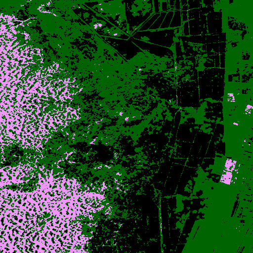 |
| Legend |  |
| JSON | [json](tile_9/watershed_ndvi_mask_gemini-2.5-pro-preview-05-06_vlm_categories.json) |

#### Per-class metrics

| Class Code | Class Name (EN) | IoU | Precision | Recall | F1 | Pixel Acc | Support True | Support Pred |
|------------|----------------|-----|-----------|--------|----|-----------|-------------|-------------|
| 0 | Unknown | 0.0000 | 0.0000 | 0.0000 | 0.0000 |  |  |  |
| 10 | Tree cover | 0.0928 | 0.1223 | 0.2776 | 0.1698 |  |  |  |
| 30 | Grassland | 0.0000 | 0.0000 | 0.0000 | 0.0000 |  |  |  |
| 40 | Cropland | 0.0179 | 0.0310 | 0.0406 | 0.0351 |  |  |  |
| 50 | Built-up | 0.0000 | 0.0000 | 0.0000 | 0.0000 |  |  |  |
| 60 | Bare / sparse vegetation | 0.0000 | 0.0000 | 0.0000 | 0.0000 |  |  |  |
| 80 | Permanent water bodies | 0.0000 | 0.0000 | 0.0000 | 0.0000 |  |  |  |
| 90 | Herbaceous wetland | 0.0000 | 0.0000 | 0.0000 | 0.0000 |  |  |  |

### watershed_ndvi  gpt-4.1-2025-04-14
| Metric | Value |
|--------|-------|
| accuracy | 0.1145 |
| iou | 0.0301 |
| f1 | 0.0526 |
| kappa | 0.0510 |
| Mask |  |
| Legend |  |
| JSON | [json](tile_9/watershed_ndvi_mask_gpt-4.1-2025-04-14_vlm_categories.json) |

#### Per-class metrics

| Class Code | Class Name (EN) | IoU | Precision | Recall | F1 | Pixel Acc | Support True | Support Pred |
|------------|----------------|-----|-----------|--------|----|-----------|-------------|-------------|
| 10 | Tree cover | 0.0000 | 0.0000 | 0.0000 | 0.0000 |  |  |  |
| 20 | Shrubland | 0.0000 | 0.0000 | 0.0000 | 0.0000 |  |  |  |
| 30 | Grassland | 0.0000 | 0.0000 | 0.0000 | 0.0000 |  |  |  |
| 40 | Cropland | 0.1754 | 0.1814 | 0.8416 | 0.2985 |  |  |  |
| 50 | Built-up | 0.0000 | 0.0000 | 0.0000 | 0.0000 |  |  |  |
| 60 | Bare / sparse vegetation | 0.0000 | 0.0000 | 0.0000 | 0.0000 |  |  |  |
| 80 | Permanent water bodies | 0.0653 | 0.0678 | 0.6394 | 0.1226 |  |  |  |
| 90 | Herbaceous wetland | 0.0000 | 0.0000 | 0.0000 | 0.0000 |  |  |  |

### watershed_ndvi  gpt-4.1-mini-2025-04-14
| Metric | Value |
|--------|-------|
| accuracy | 0.0239 |
| iou | 0.0086 |
| f1 | 0.0165 |
| kappa | -0.0049 |
| Mask |  |
| Legend |  |
| JSON | [json](tile_9/watershed_ndvi_mask_gpt-4.1-mini-2025-04-14_vlm_categories.json) |

#### Per-class metrics

| Class Code | Class Name (EN) | IoU | Precision | Recall | F1 | Pixel Acc | Support True | Support Pred |
|------------|----------------|-----|-----------|--------|----|-----------|-------------|-------------|
| 10 | Tree cover | 0.0000 | 0.0000 | 0.0000 | 0.0000 |  |  |  |
| 20 | Shrubland | 0.0000 | 0.0000 | 0.0000 | 0.0000 |  |  |  |
| 30 | Grassland | 0.0000 | 0.0000 | 0.0000 | 0.0000 |  |  |  |
| 40 | Cropland | 0.0179 | 0.0310 | 0.0406 | 0.0351 |  |  |  |
| 50 | Built-up | 0.0000 | 0.0000 | 0.0000 | 0.0000 |  |  |  |
| 60 | Bare / sparse vegetation | 0.0000 | 0.0000 | 0.0000 | 0.0000 |  |  |  |
| 80 | Permanent water bodies | 0.0000 | 0.0000 | 0.0000 | 0.0000 |  |  |  |
| 90 | Herbaceous wetland | 0.0509 | 0.0534 | 0.5210 | 0.0969 |  |  |  |

### watershed_ndvi  gpt-4o-2024-08-06
| Metric | Value |
|--------|-------|
| accuracy | 0.3071 |
| iou | 0.0615 |
| f1 | 0.0862 |
| kappa | 0.0541 |
| Mask | 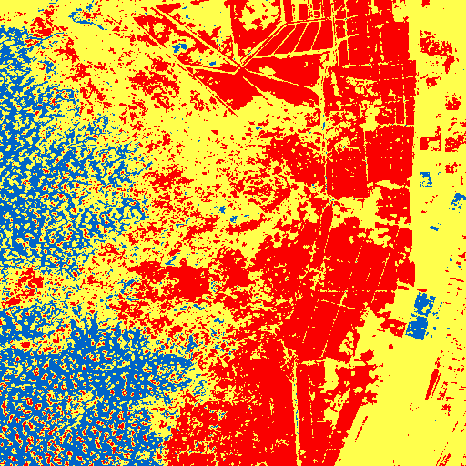 |
| Legend |  |
| JSON | [json](tile_9/watershed_ndvi_mask_gpt-4o-2024-08-06_vlm_categories.json) |

#### Per-class metrics

| Class Code | Class Name (EN) | IoU | Precision | Recall | F1 | Pixel Acc | Support True | Support Pred |
|------------|----------------|-----|-----------|--------|----|-----------|-------------|-------------|
| 10 | Tree cover | 0.0000 | 0.0000 | 0.0000 | 0.0000 |  |  |  |
| 30 | Grassland | 0.4288 | 0.6206 | 0.5812 | 0.6002 |  |  |  |
| 40 | Cropland | 0.0000 | 0.0000 | 0.0000 | 0.0000 |  |  |  |
| 50 | Built-up | 0.0005 | 0.0005 | 0.0621 | 0.0011 |  |  |  |
| 60 | Bare / sparse vegetation | 0.0000 | 0.0000 | 0.0000 | 0.0000 |  |  |  |
| 80 | Permanent water bodies | 0.0009 | 0.0012 | 0.0043 | 0.0019 |  |  |  |
| 90 | Herbaceous wetland | 0.0000 | 0.0000 | 0.0000 | 0.0000 |  |  |  |

### watershed_ndvi  gpt-4o-mini-2024-07-18
| Metric | Value |
|--------|-------|
| accuracy | 0.1801 |
| iou | 0.1002 |
| f1 | 0.1503 |
| kappa | 0.1123 |
| Mask |  |
| Legend |  |
| JSON | [json](tile_9/watershed_ndvi_mask_gpt-4o-mini-2024-07-18_vlm_categories.json) |

#### Per-class metrics

| Class Code | Class Name (EN) | IoU | Precision | Recall | F1 | Pixel Acc | Support True | Support Pred |
|------------|----------------|-----|-----------|--------|----|-----------|-------------|-------------|
| 10 | Tree cover | 0.0000 | 0.0000 | 0.0000 | 0.0000 |  |  |  |
| 30 | Grassland | 0.0000 | 0.0000 | 0.0000 | 0.0000 |  |  |  |
| 40 | Cropland | 0.1754 | 0.1814 | 0.8416 | 0.2985 |  |  |  |
| 50 | Built-up | 0.0000 | 0.0000 | 0.0000 | 0.0000 |  |  |  |
| 60 | Bare / sparse vegetation | 0.4609 | 0.4696 | 0.9612 | 0.6310 |  |  |  |
| 80 | Permanent water bodies | 0.0653 | 0.0678 | 0.6394 | 0.1226 |  |  |  |
| 90 | Herbaceous wetland | 0.0000 | 0.0000 | 0.0000 | 0.0000 |  |  |  |

### watershed_ndvi  grok-2-vision-1212
| Metric | Value |
|--------|-------|
| accuracy | 0.0000 |
| iou | 0.0000 |
| f1 | 0.0000 |
| kappa | 0.0000 |
| Mask |  |
| Legend |  |
| JSON | [json](tile_9/watershed_ndvi_mask_grok-2-vision-1212_vlm_categories.json) |

#### Per-class metrics

| Class Code | Class Name (EN) | IoU | Precision | Recall | F1 | Pixel Acc | Support True | Support Pred |
|------------|----------------|-----|-----------|--------|----|-----------|-------------|-------------|
| 0 | Unknown | 0.0000 | 0.0000 | 0.0000 | 0.0000 |  |  |  |
| 10 | Tree cover | 0.0000 | 0.0000 | 0.0000 | 0.0000 |  |  |  |
| 30 | Grassland | 0.0000 | 0.0000 | 0.0000 | 0.0000 |  |  |  |
| 40 | Cropland | 0.0000 | 0.0000 | 0.0000 | 0.0000 |  |  |  |
| 50 | Built-up | 0.0000 | 0.0000 | 0.0000 | 0.0000 |  |  |  |
| 60 | Bare / sparse vegetation | 0.0000 | 0.0000 | 0.0000 | 0.0000 |  |  |  |
| 80 | Permanent water bodies | 0.0000 | 0.0000 | 0.0000 | 0.0000 |  |  |  |
| 90 | Herbaceous wetland | 0.0000 | 0.0000 | 0.0000 | 0.0000 |  |  |  |

### watershed_ndvi  o4-mini
| Metric | Value |
|--------|-------|
| accuracy | 0.0044 |
| iou | 0.0022 |
| f1 | 0.0044 |
| kappa | -0.0370 |
| Mask |  |
| Legend |  |
| JSON | [json](tile_9/watershed_ndvi_mask_o4-mini_vlm_categories.json) |

#### Per-class metrics

| Class Code | Class Name (EN) | IoU | Precision | Recall | F1 | Pixel Acc | Support True | Support Pred |
|------------|----------------|-----|-----------|--------|----|-----------|-------------|-------------|
| 10 | Tree cover | 0.0000 | 0.0000 | 0.0000 | 0.0000 |  |  |  |
| 20 | Shrubland | 0.0000 | 0.0000 | 0.0000 | 0.0000 |  |  |  |
| 30 | Grassland | 0.0000 | 0.0000 | 0.0000 | 0.0000 |  |  |  |
| 40 | Cropland | 0.0179 | 0.0310 | 0.0406 | 0.0351 |  |  |  |
| 50 | Built-up | 0.0000 | 0.0000 | 0.0000 | 0.0000 |  |  |  |
| 60 | Bare / sparse vegetation | 0.0001 | 0.0001 | 0.0005 | 0.0002 |  |  |  |
| 80 | Permanent water bodies | 0.0000 | 0.0000 | 0.0000 | 0.0000 |  |  |  |
| 90 | Herbaceous wetland | 0.0000 | 0.0000 | 0.0000 | 0.0000 |  |  |  |

---

## Findings & Insights (GPT-4.1)

### 1. Overall Results:
- **Best Methods and Models:**
  - **Best Accuracy:** The `gemini-2.5-pro-preview-05-06` with `kmeans` produced the highest accuracy of 0.50911, indicating strong performance in segmentation tasks.
  - **Best IoU:** The combination of `watershed_ndvi` with `claude-3-7-sonnet-20250219` achieved the highest IoU of 0.0941263, suggesting effectiveness in delineating segments.
  
- **Clear Leaders vs. Close Results:**
  - There are notable leaders, particularly the `gemini-2.5-pro-preview-05-06` and `claude-3-7-sonnet-20250219`, with their respective methods performing significantly better than others.
  - However, many methods show close performance, especially within the classes tested, indicating a potential for improvement across various techniques.

- **Patterns Observed:**
  - K-means clustering consistently appears in the top-performing models, suggesting its robustness in segmentation tasks.
  - The `watershed` methods, while less accurate, show potential in specific conditions (e.g., `watershed_ndvi`), indicating that image preprocessing may yield better results.
  - Generally, higher model versions (e.g., `gemini` vs. `gpt`) generally yield better results, hinting at improvements in model architecture or training data quality.

### 2. Class Analysis:
- **Why Some Classes Are Better:**
  - Class 40 (Cropland) has a higher IoU and F1 score due to its distinct color and texture patterns, which are easier for segmentation algorithms to identify.
  - Classes like 80 (Permanent water bodies) and 30 (Grassland) show somewhat better performance, but still lag behind Class 40, likely due to variability in appearance and environmental factors.

- **Features Affecting Accuracy:**
  - Classes with homogenous texture and color patterns (e.g., croplands) tend to yield better results compared to classes with more complex or fragmented appearances (e.g., forests, snow, mangroves).
  - Seasonal changes and weather conditions can significantly affect the visibility and characteristics of certain classes, impacting model performance.

- **Difficult Classes Across Methods:**
  - Classes 70 (Snow and ice), 95 (Mangroves), and 100 (Moss and lichen) consistently show poor performance with an IoU and F1 score of 0.000. This suggests that these classes are either non-distinct in the datasets or the models struggle with their unique features.

### 3. Practical Recommendations:
- **Production Use:**
  - **Recommended Method/Model:** Use `kmeans` with `gemini-2.5-pro-preview-05-06` for production due to its high accuracy and relatively high IoU. This combination has proven effective for operational tasks.
  
- **Areas for Improvement:**
  - Investigate the segmentation performance of classes with low scores, particularly focusing on classes like snow, mangroves, and moss. Consider refining the training dataset or augmenting it with more representative samples of these classes.
  - Explore and enhance the preprocessing techniques (e.g., NDVI) to improve segmentation accuracy for difficult classes.

- **Additional Tests:**
  - Conduct tests with hybrid models combining strengths from different methods (e.g., combining kmeans with watershed techniques).
  - Experiment with advanced deep learning segmentation algorithms (like Mask R-CNN) to see if they yield better results, particularly for classes that are consistently underperforming.

### 4. Interesting Observations:
- **Surprising Results:**
  - The disparity in performance between different models (e.g., `gemini` vs. `gpt`) was notable, highlighting the impact of model architecture and training.
  - The extremely poor performance of certain classes was unexpected, especially given their ecological importance, indicating potential issues with data quality or representation.

- **Unexpected Patterns:**
  - The consistent performance of kmeans in several scenarios suggests it remains a solid choice for segmentation, even as more sophisticated models are developed.
  - The effectiveness of `watershed_ndvi` in specific contexts underscores the importance of domain knowledge in selecting appropriate methods for image segmentation.

- **Conclusions About Data Quality:**
  - The presence of classes with zero performance indicates possible gaps in the training dataset, either in representation or quality. Data augmentation and diversity in training samples should be prioritized to improve model robustness across all classes. 

These structured recommendations and analyses will guide the next steps in refining segmentation models and improving overall performance in practical applications.
## Local Analysis of Results

### Overall Results

- **Best accuracy:** 0.9367
- **Best IoU:** 0.2442
- **Worst accuracy:** 0.0000
- **Worst IoU:** 0.0000
- **Best combination by accuracy:** kmeans + gemini-2.5-pro-preview-05-06
- **Best combination by IoU:** watershed_ndvi + claude-3-7-sonnet-20250219

### Analysis by Methods

- **kmeans:** Accuracy=0.22740.2312, IoU=0.05300.0510, F1=0.07530.0594
- **watershed_kmeans:** Accuracy=0.17700.1637, IoU=0.04190.0345, F1=0.06370.0446
- **watershed_ndvi:** Accuracy=0.23020.2534, IoU=0.05260.0588, F1=0.06940.0664
- **som:** Accuracy=0.25640.1885, IoU=0.05690.0356, F1=0.08690.0459
- **unet:** Accuracy=0.24030.2128, IoU=0.04910.0392, F1=0.07130.0482

### Analysis by Models

**Top-5 models by IoU:**
1. gemini-2.5-pro-preview-05-06: IoU=0.0863
2. claude-3-7-sonnet-20250219: IoU=0.0765
3. gpt-4.1-mini-2025-04-14: IoU=0.0611
4. claude-3-5-sonnet-20240620: IoU=0.0541
5. gpt-4o-mini-2024-07-18: IoU=0.0523

### Practical Recommendations

- **For production:** Use som method with gemini-2.5-pro-preview-05-06 model for best IoU performance
- **For further analysis:** Test on additional datasets to validate performance
- **For improvement:** Try ensemble methods combining top 3 models
## Statistical Analysis

### Summary Statistics

- **Total experiments:** 500
- **Unique models:** 10
- **Unique methods:** 5
- **Unique tiles:** 10

**ACCURACY Statistics:**
- Mean: 0.2262
- Median: 0.1817
- Std: 0.2131
- Min: 0.0000
- Max: 0.9367
- Q1: 0.0467
- Q3: 0.3341

**IOU Statistics:**
- Mean: 0.0507
- Median: 0.0429
- Std: 0.0449
- Min: 0.0000
- Max: 0.2442
- Q1: 0.0170
- Q3: 0.0687

**F1 Statistics:**
- Mean: 0.0733
- Median: 0.0698
- Std: 0.0539
- Min: 0.0000
- Max: 0.2631
- Q1: 0.0317
- Q3: 0.1040

### Correlation Analysis

**Correlation Matrix:**
| Metric | Accuracy | IoU | F1 |
|--------|----------|-----|----|
| accuracy | 1.000 | 0.849 | 0.808 |
| iou | 0.849 | 1.000 | 0.976 |
| f1 | 0.808 | 0.976 | 1.000 |

### Outlier Analysis

**ACCURACY Outliers:**
- Outlier count: 14
- Outlier percentage: 2.8%
- Outlier range: 0.7777 - 0.9367
**IOU Outliers:**
- Outlier count: 22
- Outlier percentage: 4.4%
- Outlier range: 0.1475 - 0.2442
**F1 Outliers:**
- Outlier count: 10
- Outlier percentage: 2.0%
- Outlier range: 0.2373 - 0.2631

### Tile Performance Analysis

**Best performing tiles:**
1. Tile 6: IoU=0.0646
2. Tile 4: IoU=0.0637
3. Tile 8: IoU=0.0616

**Most challenging tiles:**
1. Tile 9: IoU=0.0321
2. Tile 3: IoU=0.0371
3. Tile 0: IoU=0.0445