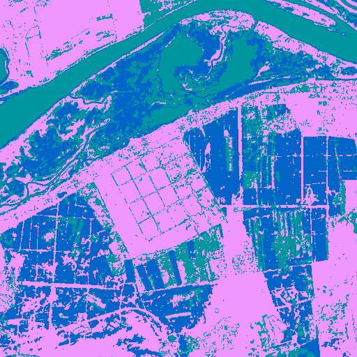
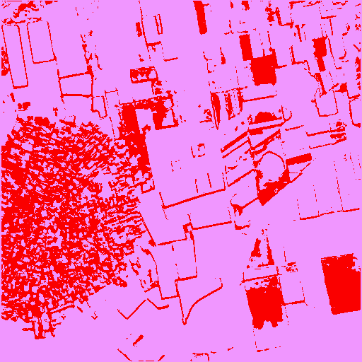

# Summary & Rankings

## Top-3 Segmentation Methods (by mean IoU)

| method           |   accuracy |      iou |       f1 |
|:-----------------|-----------:|---------:|---------:|
| unet             |   0.564483 | 0.117804 | 0.141736 |
| kmeans           |   0.482015 | 0.106674 | 0.124712 |
| watershed_kmeans |   0.479669 | 0.101136 | 0.1212   |

## Top-5 Models (by mean IoU)

| model                      |   accuracy |      iou |       f1 |
|:---------------------------|-----------:|---------:|---------:|
| gpt-4.1-2025-04-14         |   0.638381 | 0.138811 | 0.158091 |
| claude-3-7-sonnet-20250219 |   0.652822 | 0.13753  | 0.1608   |
| gpt-4.1-mini-2025-04-14    |   0.655976 | 0.132237 | 0.151444 |
| gpt-4o-2024-08-06          |   0.611791 | 0.129555 | 0.149707 |
| o4-mini                    |   0.614631 | 0.128642 | 0.15035  |

## Segmentation+Model Combination (mean IoU)

| method           |   claude-3-5-haiku-20241022 |   claude-3-7-sonnet-20250219 |   claude-opus-4-20250514 |   claude-sonnet-4-20250514 |   gemini-2.5-pro-preview-05-06 |   gpt-4.1-2025-04-14 |   gpt-4.1-mini-2025-04-14 |   gpt-4o-2024-08-06 |   gpt-4o-mini-2024-07-18 |   grok-2-vision-1212 |   o4-mini |
|:-----------------|----------------------------:|-----------------------------:|-------------------------:|---------------------------:|-------------------------------:|---------------------:|--------------------------:|--------------------:|-------------------------:|---------------------:|----------:|
| kmeans           |                   0.049945  |                     0.164751 |                0.0947325 |                  0.137927  |                      0.13027   |             0.171905 |                  0.135293 |           0.133934  |                0.0975667 |            0.10533   |  0.16511  |
| som              |                   0.055055  |                     0.118112 |                0.080345  |                  0.0983514 |                      0.0792019 |             0.107974 |                  0.101704 |           0.0863223 |                0.0880454 |            0.0760866 |  0.107201 |
| unet             |                   0.0930518 |                     0.137398 |                0.100259  |                  0.107781  |                      0.107911  |             0.136885 |                  0.147073 |           0.138256  |                0.0912203 |            0.116116  |  0.119893 |
| watershed_kmeans |                   0.0634622 |                     0.140005 |                0.0982502 |                  0.124159  |                      0.125672  |             0.151493 |                  0.135967 |           0.136741  |                0.0912191 |            0.11663   |  0.131173 |
| watershed_ndvi   |                   0.055055  |                     0.127381 |                0.0930549 |                  0.12124   |                      0.111883  |             0.1258   |                  0.141147 |           0.15252   |                0.093946  |            0.0922233 |  0.119832 |

### Per-class IoU for class 0 | Unknown

|                  |   claude-3-5-haiku-20241022 |   claude-3-7-sonnet-20250219 |   claude-opus-4-20250514 |   claude-sonnet-4-20250514 |   gemini-2.5-pro-preview-05-06 |   gpt-4.1-2025-04-14 |   gpt-4.1-mini-2025-04-14 |   gpt-4o-2024-08-06 |   gpt-4o-mini-2024-07-18 |   grok-2-vision-1212 |   o4-mini |
|:-----------------|----------------------------:|-----------------------------:|-------------------------:|---------------------------:|-------------------------------:|---------------------:|--------------------------:|--------------------:|-------------------------:|---------------------:|----------:|
| kmeans           |                           0 |                 nan          |                      nan |                        nan |                            nan |                  nan |                         0 |                   0 |                        0 |                  nan |       nan |
| som              |                           0 |                 nan          |                      nan |                        nan |                            nan |                  nan |                       nan |                   0 |                      nan |                  nan |       nan |
| unet             |                           0 |                   4.1834e-06 |                        0 |                          0 |                              0 |                    0 |                         0 |                   0 |                        0 |                    0 |         0 |
| watershed_kmeans |                           0 |                 nan          |                      nan |                        nan |                            nan |                    0 |                       nan |                   0 |                      nan |                  nan |       nan |
| watershed_ndvi   |                           0 |                 nan          |                      nan |                        nan |                            nan |                  nan |                       nan |                 nan |                      nan |                  nan |       nan |

### Per-class IoU for class 10 | Tree cover

|                  |   claude-3-5-haiku-20241022 |   claude-3-7-sonnet-20250219 |   claude-opus-4-20250514 |   claude-sonnet-4-20250514 |   gemini-2.5-pro-preview-05-06 |   gpt-4.1-2025-04-14 |   gpt-4.1-mini-2025-04-14 |   gpt-4o-2024-08-06 |   gpt-4o-mini-2024-07-18 |   grok-2-vision-1212 |     o4-mini |
|:-----------------|----------------------------:|-----------------------------:|-------------------------:|---------------------------:|-------------------------------:|---------------------:|--------------------------:|--------------------:|-------------------------:|---------------------:|------------:|
| kmeans           |                 0.00103649  |                  0           |               0.0214837  |                 0.00103649 |                     0.0155015  |                    0 |                         0 |          0          |               0.00218162 |                    0 | 0           |
| som              |                 0           |                  0           |               0          |                 0.00292427 |                     0.0100303  |                    0 |                         0 |          0.00592852 |               0.0127969  |                    0 | 0           |
| unet             |                 0           |                  0.00561166  |               0.0130516  |                 0.00475286 |                     0.00838639 |                    0 |                         0 |          0.00216475 |               0.00192399 |                    0 | 6.98144e-05 |
| watershed_kmeans |                 0.000975761 |                  0.000975761 |               0.0148049  |                 0.00435204 |                     0          |                    0 |                         0 |          0          |               0.00061035 |                    0 | 0.000643627 |
| watershed_ndvi   |                 0           |                  0           |               0.00282316 |                 0          |                     0.00927764 |                    0 |                         0 |          0          |               0          |                    0 | 0           |

### Per-class IoU for class 20 | Shrubland

|                  |   claude-3-5-haiku-20241022 |   claude-3-7-sonnet-20250219 |   claude-opus-4-20250514 |   claude-sonnet-4-20250514 |   gemini-2.5-pro-preview-05-06 |   gpt-4.1-2025-04-14 |   gpt-4.1-mini-2025-04-14 |   gpt-4o-2024-08-06 |   gpt-4o-mini-2024-07-18 |   grok-2-vision-1212 |   o4-mini |
|:-----------------|----------------------------:|-----------------------------:|-------------------------:|---------------------------:|-------------------------------:|---------------------:|--------------------------:|--------------------:|-------------------------:|---------------------:|----------:|
| kmeans           |                         nan |                          nan |                      nan |                          0 |                            nan |                  nan |                       nan |                 nan |                        0 |                    0 |       nan |
| som              |                         nan |                          nan |                        0 |                          0 |                            nan |                  nan |                       nan |                 nan |                        0 |                  nan |       nan |
| unet             |                         nan |                          nan |                      nan |                          0 |                            nan |                  nan |                       nan |                 nan |                        0 |                    0 |         0 |
| watershed_kmeans |                         nan |                          nan |                        0 |                          0 |                            nan |                  nan |                       nan |                 nan |                        0 |                    0 |         0 |
| watershed_ndvi   |                         nan |                          nan |                      nan |                        nan |                            nan |                  nan |                       nan |                 nan |                        0 |                  nan |       nan |

### Per-class IoU for class 30 | Grassland

|                  |   claude-3-5-haiku-20241022 |   claude-3-7-sonnet-20250219 |   claude-opus-4-20250514 |   claude-sonnet-4-20250514 |   gemini-2.5-pro-preview-05-06 |   gpt-4.1-2025-04-14 |   gpt-4.1-mini-2025-04-14 |   gpt-4o-2024-08-06 |   gpt-4o-mini-2024-07-18 |   grok-2-vision-1212 |   o4-mini |
|:-----------------|----------------------------:|-----------------------------:|-------------------------:|---------------------------:|-------------------------------:|---------------------:|--------------------------:|--------------------:|-------------------------:|---------------------:|----------:|
| kmeans           |                           0 |                            0 |                        0 |                  0         |                              0 |                    0 |                         0 |                   0 |              0.000149643 |            0.0321265 |         0 |
| som              |                           0 |                            0 |                        0 |                  0.0121951 |                              0 |                    0 |                         0 |                   0 |              0           |            0.0163542 |         0 |
| unet             |                           0 |                            0 |                        0 |                  0.0194451 |                              0 |                    0 |                         0 |                   0 |              0.00646632  |            0.0236453 |         0 |
| watershed_kmeans |                           0 |                            0 |                        0 |                  0         |                              0 |                    0 |                         0 |                   0 |              0.000376488 |            0.0318463 |         0 |
| watershed_ndvi   |                           0 |                            0 |                        0 |                  0.019618  |                              0 |                    0 |                         0 |                   0 |              0           |            0.050902  |         0 |

### Per-class IoU for class 40 | Cropland

|                  |   claude-3-5-haiku-20241022 |   claude-3-7-sonnet-20250219 |   claude-opus-4-20250514 |   claude-sonnet-4-20250514 |   gemini-2.5-pro-preview-05-06 |   gpt-4.1-2025-04-14 |   gpt-4.1-mini-2025-04-14 |   gpt-4o-2024-08-06 |   gpt-4o-mini-2024-07-18 |   grok-2-vision-1212 |   o4-mini |
|:-----------------|----------------------------:|-----------------------------:|-------------------------:|---------------------------:|-------------------------------:|---------------------:|--------------------------:|--------------------:|-------------------------:|---------------------:|----------:|
| kmeans           |                    0.327824 |                     0.629484 |                 0.433906 |                   0.527292 |                       0.450677 |             0.651105 |                  0.654458 |            0.627075 |                 0.579041 |             0.493437 |  0.647279 |
| som              |                    0.349018 |                     0.610959 |                 0.432885 |                   0.497156 |                       0.401984 |             0.611592 |                  0.620718 |            0.509985 |                 0.555553 |             0.455213 |  0.54338  |
| unet             |                    0.577029 |                     0.591238 |                 0.458642 |                   0.472039 |                       0.398855 |             0.559062 |                  0.620579 |            0.62635  |                 0.548768 |             0.543672 |  0.592052 |
| watershed_kmeans |                    0.396087 |                     0.595537 |                 0.424124 |                   0.596668 |                       0.421195 |             0.625738 |                  0.641165 |            0.627802 |                 0.564253 |             0.466452 |  0.587013 |
| watershed_ndvi   |                    0.349018 |                     0.648415 |                 0.448477 |                   0.539776 |                       0.441321 |             0.647792 |                  0.655552 |            0.65828  |                 0.614041 |             0.450882 |  0.594526 |

### Per-class IoU for class 50 | Built-up

|                  |   claude-3-5-haiku-20241022 |   claude-3-7-sonnet-20250219 |   claude-opus-4-20250514 |   claude-sonnet-4-20250514 |   gemini-2.5-pro-preview-05-06 |   gpt-4.1-2025-04-14 |   gpt-4.1-mini-2025-04-14 |   gpt-4o-2024-08-06 |   gpt-4o-mini-2024-07-18 |   grok-2-vision-1212 |    o4-mini |
|:-----------------|----------------------------:|-----------------------------:|-------------------------:|---------------------------:|-------------------------------:|---------------------:|--------------------------:|--------------------:|-------------------------:|---------------------:|-----------:|
| kmeans           |                   0         |                  0.0523796   |               0.0109111  |                 0.0267166  |                      0.0639205 |          0.0225193   |                 0.022552  |           0.0140455 |                0         |            0.019791  | 0.0494258  |
| som              |                   0         |                  0.0302458   |               0.0163194  |                 0.0236173  |                      0.0258168 |          0.0117706   |                 0.0206679 |           0.0133335 |                0         |            0.0146865 | 0.00523029 |
| unet             |                   0.0295203 |                  0.0232172   |               0.0178483  |                 0.00810647 |                      0.043543  |          0.014161    |                 0.0578125 |           0.022764  |                0.0122066 |            0.0383756 | 0.0139795  |
| watershed_kmeans |                   0.0108052 |                  0.049971    |               0.00944352 |                 0.0148778  |                      0.055113  |          0.0581244   |                 0.041333  |           0.0348507 |                0.0320203 |            0.0338339 | 0.0309145  |
| watershed_ndvi   |                   0         |                  6.94941e-05 |               0.00244083 |                 0.00222371 |                      0.012742  |          8.40483e-05 |                 0         |           0         |                0         |            0.0138745 | 0.00549342 |

### Per-class IoU for class 60 | Bare / sparse vegetation

|                  |   claude-3-5-haiku-20241022 |   claude-3-7-sonnet-20250219 |   claude-opus-4-20250514 |   claude-sonnet-4-20250514 |   gemini-2.5-pro-preview-05-06 |   gpt-4.1-2025-04-14 |   gpt-4.1-mini-2025-04-14 |   gpt-4o-2024-08-06 |   gpt-4o-mini-2024-07-18 |   grok-2-vision-1212 |    o4-mini |
|:-----------------|----------------------------:|-----------------------------:|-------------------------:|---------------------------:|-------------------------------:|---------------------:|--------------------------:|--------------------:|-------------------------:|---------------------:|-----------:|
| kmeans           |                  0.00758447 |                   0.00919282 |               0.00767646 |                 0.014269   |                     0.0109992  |           0.00758447 |                0.00919282 |          0.00919282 |              1.40456e-05 |           0.0109992  | 0.00919282 |
| som              |                  0.00758447 |                   0.00758447 |               0.00405639 |                 0.0111508  |                     0.00821051 |           0.00758447 |                0.00758447 |          0.0111508  |              0.00997386  |           0.00758447 | 0.00682602 |
| unet             |                  0          |                   0          |               0          |                 0          |                     0          |           0          |                0          |          0          |            nan           |           0          | 0          |
| watershed_kmeans |                  0.00758447 |                   0.00929015 |               0.00822313 |                 0.00852915 |                     0.0125624  |           0.00682602 |                0.00775925 |          0.00977124 |              0           |           0.0113235  | 0.0124665  |
| watershed_ndvi   |                  0.00758447 |                   0.00758447 |               0.00758447 |                 0.00758447 |                     0.0512113  |           0.00758447 |                0.00758447 |          0.0119559  |              0           |           0.0143492  | 0.0119559  |

### Per-class IoU for class 80 | Permanent water bodies

|                  |   claude-3-5-haiku-20241022 |   claude-3-7-sonnet-20250219 |   claude-opus-4-20250514 |   claude-sonnet-4-20250514 |   gemini-2.5-pro-preview-05-06 |   gpt-4.1-2025-04-14 |   gpt-4.1-mini-2025-04-14 |   gpt-4o-2024-08-06 |   gpt-4o-mini-2024-07-18 |   grok-2-vision-1212 |   o4-mini |
|:-----------------|----------------------------:|-----------------------------:|-------------------------:|---------------------------:|-------------------------------:|---------------------:|--------------------------:|--------------------:|-------------------------:|---------------------:|----------:|
| kmeans           |                           0 |                     0.402097 |                0.139101  |                  0.334505  |                      0.325936  |            0.478487  |                  0.236371 |           0.263118  |               0.0694503  |            0.137871  |  0.40346  |
| som              |                           0 |                     0.11562  |                0.0556536 |                  0.0844622 |                      0.0735293 |            0.0808178 |                  0        |           0.0641896 |               0          |            0         |  0.151013 |
| unet             |                           0 |                     0.280018 |                0.172842  |                  0.256763  |                      0.295075  |            0.378269  |                  0.289049 |           0.2716    |               0.00803421 |            0.206932  |  0.2247   |
| watershed_kmeans |                           0 |                     0.252758 |                0.207288  |                  0.202902  |                      0.368417  |            0.354739  |                  0.198131 |           0.257014  |               0          |            0.235497  |  0.22819  |
| watershed_ndvi   |                           0 |                     0.179299 |                0.134989  |                  0.231494  |                      0.234723  |            0.178421  |                  0.276906 |           0.353785  |               0          |            0.0808147 |  0.179299 |

### Per-class IoU for class 90 | Herbaceous wetland

|                  |   claude-3-5-haiku-20241022 |   claude-3-7-sonnet-20250219 |   claude-opus-4-20250514 |   claude-sonnet-4-20250514 |   gemini-2.5-pro-preview-05-06 |   gpt-4.1-2025-04-14 |   gpt-4.1-mini-2025-04-14 |   gpt-4o-2024-08-06 |   gpt-4o-mini-2024-07-18 |   grok-2-vision-1212 |    o4-mini |
|:-----------------|----------------------------:|-----------------------------:|-------------------------:|---------------------------:|-------------------------------:|---------------------:|--------------------------:|--------------------:|-------------------------:|---------------------:|-----------:|
| kmeans           |                           0 |                    0.0214931 |              0.0142169   |                  0.0265926 |                    0.0157121   |          2.22301e-05 |                0.00365176 |                   0 |               0.00365176 |           0          | 0.00365176 |
| som              |                           0 |                    0.0229021 |              0.0153003   |                  0.0229021 |                    0.000264491 |          0           |                0.0236314  |                   0 |               0          |           0          | 0.0163436  |
| unet             |                           0 |                    0.021418  |              0.0308929   |                  0.0293558 |                    0.0359581   |          0.00200717  |                0.024666   |                   0 |               0.0281691  |           0.00217984 | 0.0304365  |
| watershed_kmeans |                           0 |                    0.0355465 |              0.000197573 |                  0         |                    0           |          0.00352987  |                0.0241748  |                   0 |               0.00357813 |           0.00352987 | 0.0268472  |
| watershed_ndvi   |                           0 |                    0.0153003 |              0.0153003   |                  0.0049146 |                    0           |          0.0049376   |                0.0049146  |                   0 |               0          |           0.0049376  | 0.0049146  |

## WorldCover Class Analysis

## Summary Table of Average Metrics

|   Class Code | Class Name               |    Mean IoU |     Mean F1 |   Mean Precision |   Mean Recall |   Count |
|-------------:|:-------------------------|------------:|------------:|-----------------:|--------------:|--------:|
|            0 | Unknown                  | 1.75937e-07 | 3.51862e-07 |      1.77525e-07 |   1.95929e-05 |     214 |
|           10 | Tree cover               | 0.0022753   | 0.00413454  |      0.00532456  |   0.00656923  |     630 |
|           20 | Shrubland                | 0           | 0           |      0           |   0           |      22 |
|           30 | Grassland                | 0.00338294  | 0.00570817  |      0.00550628  |   0.010399    |     630 |
|           40 | Cropland                 | 0.469721    | 0.539365    |      0.539124    |   0.610151    |     630 |
|           50 | Built-up                 | 0.0179952   | 0.0317692   |      0.0220126   |   0.10731     |     630 |
|           60 | Bare / sparse vegetation | 0.00758062  | 0.0135172   |      0.00769294  |   0.0818685   |     495 |
|           80 | Permanent water bodies   | 0.157994    | 0.184573    |      0.176049    |   0.228949    |     630 |
|           90 | Herbaceous wetland       | 0.0086991   | 0.0147003   |      0.0118559   |   0.0279141   |     504 |

## Aggregated Per-Class Metrics

| Class Code | Class Name (EN) | Mean IoU | Std IoU | Mean Prec | Std Prec | Mean Rec | Std Rec | Mean F1 | Std F1 | Mean PixAcc | Std PixAcc | Mean Supp True | Mean Supp Pred |
|------------|----------------|----------|---------|----------|---------|---------|--------|--------|--------|-------------|-------------|---------------|---------------|
| 0 | Unknown | 0.0000 | 0.0000 | 0.0000 | 0.0000 | 0.0000 | 0.0003 | 0.0000 | 0.0000 | 0.5532 | 0.3166 | nan | nan |
| 10 | Tree cover | 0.0023 | 0.0152 | 0.0053 | 0.0394 | 0.0066 | 0.0379 | 0.0041 | 0.0268 | 0.5645 | 0.3128 | nan | nan |
| 20 | Shrubland | 0.0000 | 0.0000 | 0.0000 | 0.0000 | 0.0000 | 0.0000 | 0.0000 | 0.0000 | 0.2162 | 0.2558 | nan | nan |
| 30 | Grassland | 0.0034 | 0.0256 | 0.0055 | 0.0432 | 0.0104 | 0.0747 | 0.0057 | 0.0407 | 0.5645 | 0.3128 | nan | nan |
| 40 | Cropland | 0.4697 | 0.3723 | 0.5391 | 0.3929 | 0.6102 | 0.4231 | 0.5394 | 0.3977 | 0.5645 | 0.3128 | nan | nan |
| 50 | Built-up | 0.0180 | 0.0469 | 0.0220 | 0.0573 | 0.1073 | 0.2420 | 0.0318 | 0.0781 | 0.5645 | 0.3128 | nan | nan |
| 60 | Bare / sparse vegetation | 0.0076 | 0.0308 | 0.0077 | 0.0313 | 0.0819 | 0.2673 | 0.0135 | 0.0506 | 0.3546 | 0.3526 | nan | nan |
| 80 | Permanent water bodies | 0.1580 | 0.3036 | 0.1760 | 0.3332 | 0.2289 | 0.3915 | 0.1846 | 0.3393 | 0.5645 | 0.3128 | nan | nan |
| 90 | Herbaceous wetland | 0.0087 | 0.0395 | 0.0119 | 0.0512 | 0.0279 | 0.1367 | 0.0147 | 0.0652 | 0.4895 | 0.3015 | nan | nan |

## Brief Class Analysis

**Best classes by IoU:**

- **Class 40 - Cropland**: IoU=0.4697, F1=0.5394 (630 measurements)
- **Class 80 - Permanent water bodies**: IoU=0.1580, F1=0.1846 (630 measurements)
- **Class 50 - Built-up**: IoU=0.0180, F1=0.0318 (630 measurements)
- **Class 90 - Herbaceous wetland**: IoU=0.0087, F1=0.0147 (504 measurements)
- **Class 60 - Bare / sparse vegetation**: IoU=0.0076, F1=0.0135 (495 measurements)

**Worst classes by IoU:**

- **Class 60 - Bare / sparse vegetation**: IoU=0.0076, F1=0.0135 (495 measurements)
- **Class 30 - Grassland**: IoU=0.0034, F1=0.0057 (630 measurements)
- **Class 10 - Tree cover**: IoU=0.0023, F1=0.0041 (630 measurements)
- **Class 0 - Unknown**: IoU=0.0000, F1=0.0000 (214 measurements)
- **Class 20 - Shrubland**: IoU=0.0000, F1=0.0000 (22 measurements)

## Brief Class Analysis

**Best classes by IoU:**

- **Class 40 - Cropland**: IoU=0.4697, F1=0.5394 (630 measurements)
- **Class 80 - Permanent water bodies**: IoU=0.1580, F1=0.1846 (630 measurements)
- **Class 50 - Built-up**: IoU=0.0180, F1=0.0318 (630 measurements)
- **Class 90 - Herbaceous wetland**: IoU=0.0087, F1=0.0147 (504 measurements)
- **Class 60 - Bare / sparse vegetation**: IoU=0.0076, F1=0.0135 (495 measurements)

**Worst classes by IoU:**

- **Class 60 - Bare / sparse vegetation**: IoU=0.0076, F1=0.0135 (495 measurements)
- **Class 30 - Grassland**: IoU=0.0034, F1=0.0057 (630 measurements)
- **Class 10 - Tree cover**: IoU=0.0023, F1=0.0041 (630 measurements)
- **Class 0 - Unknown**: IoU=0.0000, F1=0.0000 (214 measurements)
- **Class 20 - Shrubland**: IoU=0.0000, F1=0.0000 (22 measurements)
# Aggregated Per-Class Metrics (all tiles, methods, models)

| Class Code | Class Name (EN) | Mean IoU | Std IoU | Mean Prec | Std Prec | Mean Rec | Std Rec | Mean F1 | Std F1 | Mean PixAcc | Std PixAcc | Mean Supp True | Mean Supp Pred |
|------------|----------------|----------|---------|----------|---------|---------|--------|--------|--------|-------------|-------------|---------------|---------------|
| 0 | Unknown | 0.0000 | 0.0000 | 0.0000 | 0.0000 | 0.0000 | 0.0003 | 0.0000 | 0.0000 | 0.5532 | 0.3166 | nan | nan |
| 10 | Tree cover | 0.0023 | 0.0152 | 0.0053 | 0.0394 | 0.0066 | 0.0379 | 0.0041 | 0.0268 | 0.5645 | 0.3128 | nan | nan |
| 20 | Shrubland | 0.0000 | 0.0000 | 0.0000 | 0.0000 | 0.0000 | 0.0000 | 0.0000 | 0.0000 | 0.2162 | 0.2558 | nan | nan |
| 30 | Grassland | 0.0034 | 0.0256 | 0.0055 | 0.0432 | 0.0104 | 0.0747 | 0.0057 | 0.0407 | 0.5645 | 0.3128 | nan | nan |
| 40 | Cropland | 0.4697 | 0.3723 | 0.5391 | 0.3929 | 0.6102 | 0.4231 | 0.5394 | 0.3977 | 0.5645 | 0.3128 | nan | nan |
| 50 | Built-up | 0.0180 | 0.0469 | 0.0220 | 0.0573 | 0.1073 | 0.2420 | 0.0318 | 0.0781 | 0.5645 | 0.3128 | nan | nan |
| 60 | Bare / sparse vegetation | 0.0076 | 0.0308 | 0.0077 | 0.0313 | 0.0819 | 0.2673 | 0.0135 | 0.0506 | 0.3546 | 0.3526 | nan | nan |
| 80 | Permanent water bodies | 0.1580 | 0.3036 | 0.1760 | 0.3332 | 0.2289 | 0.3915 | 0.1846 | 0.3393 | 0.5645 | 0.3128 | nan | nan |
| 90 | Herbaceous wetland | 0.0087 | 0.0395 | 0.0119 | 0.0512 | 0.0279 | 0.1367 | 0.0147 | 0.0652 | 0.4895 | 0.3015 | nan | nan |

## Brief Class Analysis

**Best classes by IoU:**

- **Class 40 - Cropland**: IoU=0.4697, F1=0.5394 (630 measurements)
- **Class 80 - Permanent water bodies**: IoU=0.1580, F1=0.1846 (630 measurements)
- **Class 50 - Built-up**: IoU=0.0180, F1=0.0318 (630 measurements)
- **Class 90 - Herbaceous wetland**: IoU=0.0087, F1=0.0147 (504 measurements)
- **Class 60 - Bare / sparse vegetation**: IoU=0.0076, F1=0.0135 (495 measurements)

**Worst classes by IoU:**

- **Class 60 - Bare / sparse vegetation**: IoU=0.0076, F1=0.0135 (495 measurements)
- **Class 30 - Grassland**: IoU=0.0034, F1=0.0057 (630 measurements)
- **Class 10 - Tree cover**: IoU=0.0023, F1=0.0041 (630 measurements)
- **Class 0 - Unknown**: IoU=0.0000, F1=0.0000 (214 measurements)
- **Class 20 - Shrubland**: IoU=0.0000, F1=0.0000 (22 measurements)

---

# Completeness Check

All tile-method-model combinations are present in the results.

---

# Final Test Report

## Summary Table of Average Metrics

|                                                      |   accuracy |        f1 |       iou |       kappa |
|:-----------------------------------------------------|-----------:|----------:|----------:|------------:|
| ('claude-3-5-haiku-20241022', 'kmeans')              |   0.33354  | 0.0556824 | 0.049945  |  0.00641928 |
| ('claude-3-5-haiku-20241022', 'som')                 |   0.355844 | 0.059519  | 0.055055  |  0          |
| ('claude-3-5-haiku-20241022', 'unet')                |   0.57839  | 0.10766   | 0.0930518 | -0.00341344 |
| ('claude-3-5-haiku-20241022', 'watershed_kmeans')    |   0.401581 | 0.0721048 | 0.0634622 |  0.0102601  |
| ('claude-3-5-haiku-20241022', 'watershed_ndvi')      |   0.355844 | 0.059519  | 0.055055  |  0          |
| ('claude-3-7-sonnet-20250219', 'kmeans')             |   0.679491 | 0.192517  | 0.164751  |  0.138497   |
| ('claude-3-7-sonnet-20250219', 'som')                |   0.6445   | 0.141053  | 0.118112  |  0.0826391  |
| ('claude-3-7-sonnet-20250219', 'unet')               |   0.622203 | 0.162168  | 0.137398  |  0.151323   |
| ('claude-3-7-sonnet-20250219', 'watershed_kmeans')   |   0.640404 | 0.167737  | 0.140005  |  0.112576   |
| ('claude-3-7-sonnet-20250219', 'watershed_ndvi')     |   0.67751  | 0.140528  | 0.127381  |  0.111911   |
| ('claude-opus-4-20250514', 'kmeans')                 |   0.490616 | 0.115184  | 0.0947325 |  0.0489434  |
| ('claude-opus-4-20250514', 'som')                    |   0.492748 | 0.0977289 | 0.080345  | -0.00629946 |
| ('claude-opus-4-20250514', 'unet')                   |   0.505872 | 0.127444  | 0.100259  |  0.0499633  |
| ('claude-opus-4-20250514', 'watershed_kmeans')       |   0.481055 | 0.121686  | 0.0982502 |  0.0487082  |
| ('claude-opus-4-20250514', 'watershed_ndvi')         |   0.502172 | 0.107019  | 0.0930549 |  0.0564534  |
| ('claude-sonnet-4-20250514', 'kmeans')               |   0.584294 | 0.164742  | 0.137927  |  0.103183   |
| ('claude-sonnet-4-20250514', 'som')                  |   0.554326 | 0.125084  | 0.0983514 |  0.0351773  |
| ('claude-sonnet-4-20250514', 'unet')                 |   0.539945 | 0.13465   | 0.107781  |  0.076186   |
| ('claude-sonnet-4-20250514', 'watershed_kmeans')     |   0.628318 | 0.148358  | 0.124159  |  0.0954049  |
| ('claude-sonnet-4-20250514', 'watershed_ndvi')       |   0.609369 | 0.137955  | 0.12124   |  0.0538142  |
| ('gemini-2.5-pro-preview-05-06', 'kmeans')           |   0.510199 | 0.167926  | 0.13027   |  0.100264   |
| ('gemini-2.5-pro-preview-05-06', 'som')              |   0.434793 | 0.104862  | 0.0792019 |  0.0343022  |
| ('gemini-2.5-pro-preview-05-06', 'unet')             |   0.434071 | 0.144251  | 0.107911  |  0.123902   |
| ('gemini-2.5-pro-preview-05-06', 'watershed_kmeans') |   0.456293 | 0.162849  | 0.125672  |  0.109631   |
| ('gemini-2.5-pro-preview-05-06', 'watershed_ndvi')   |   0.512016 | 0.13759   | 0.111883  |  0.0546256  |
| ('gpt-4.1-2025-04-14', 'kmeans')                     |   0.68547  | 0.192615  | 0.171905  |  0.170205   |
| ('gpt-4.1-2025-04-14', 'som')                        |   0.637373 | 0.123322  | 0.107974  |  0.0523388  |
| ('gpt-4.1-2025-04-14', 'unet')                       |   0.591021 | 0.159105  | 0.136885  |  0.127934   |
| ('gpt-4.1-2025-04-14', 'watershed_kmeans')           |   0.658348 | 0.175873  | 0.151493  |  0.155299   |
| ('gpt-4.1-2025-04-14', 'watershed_ndvi')             |   0.619691 | 0.139541  | 0.1258    |  0.102517   |
| ('gpt-4.1-mini-2025-04-14', 'kmeans')                |   0.669398 | 0.15247   | 0.135293  |  0.118044   |
| ('gpt-4.1-mini-2025-04-14', 'som')                   |   0.602367 | 0.118905  | 0.101704  |  0.0196907  |
| ('gpt-4.1-mini-2025-04-14', 'unet')                  |   0.662075 | 0.171851  | 0.147073  |  0.156243   |
| ('gpt-4.1-mini-2025-04-14', 'watershed_kmeans')      |   0.659745 | 0.159508  | 0.135967  |  0.128865   |
| ('gpt-4.1-mini-2025-04-14', 'watershed_ndvi')        |   0.686296 | 0.154489  | 0.141147  |  0.141452   |
| ('gpt-4o-2024-08-06', 'kmeans')                      |   0.609216 | 0.15246   | 0.133934  |  0.0771868  |
| ('gpt-4o-2024-08-06', 'som')                         |   0.507156 | 0.106935  | 0.0863223 |  0.0319182  |
| ('gpt-4o-2024-08-06', 'unet')                        |   0.601986 | 0.160178  | 0.138256  |  0.0940859  |
| ('gpt-4o-2024-08-06', 'watershed_kmeans')            |   0.645278 | 0.161428  | 0.136741  |  0.13137    |
| ('gpt-4o-2024-08-06', 'watershed_ndvi')              |   0.695319 | 0.167535  | 0.15252   |  0.149971   |
| ('gpt-4o-mini-2024-07-18', 'kmeans')                 |   0.540646 | 0.112437  | 0.0975667 |  0.00609137 |
| ('gpt-4o-mini-2024-07-18', 'som')                    |   0.553448 | 0.102752  | 0.0880454 |  0.00122095 |
| ('gpt-4o-mini-2024-07-18', 'unet')                   |   0.551902 | 0.109478  | 0.0912203 | -0.00914724 |
| ('gpt-4o-mini-2024-07-18', 'watershed_kmeans')       |   0.559024 | 0.107538  | 0.0912191 |  0.00656435 |
| ('gpt-4o-mini-2024-07-18', 'watershed_ndvi')         |   0.611801 | 0.105333  | 0.093946  | -0.00202717 |
| ('grok-2-vision-1212', 'kmeans')                     |   0.492046 | 0.127684  | 0.10533   |  0.0749635  |
| ('grok-2-vision-1212', 'som')                        |   0.467554 | 0.0927105 | 0.0760866 |  0.01028    |
| ('grok-2-vision-1212', 'unet')                       |   0.52509  | 0.140763  | 0.116116  |  0.0924897  |
| ('grok-2-vision-1212', 'watershed_kmeans')           |   0.492712 | 0.141405  | 0.11663   |  0.0732516  |
| ('grok-2-vision-1212', 'watershed_ndvi')             |   0.487811 | 0.109974  | 0.0922233 |  0.0411469  |
| ('o4-mini', 'kmeans')                                |   0.671275 | 0.187536  | 0.16511   |  0.163037   |
| ('o4-mini', 'som')                                   |   0.579979 | 0.130295  | 0.107201  |  0.0847355  |
| ('o4-mini', 'unet')                                  |   0.596758 | 0.141548  | 0.119893  |  0.0787792  |
| ('o4-mini', 'watershed_kmeans')                      |   0.612935 | 0.157116  | 0.131173  |  0.102349   |
| ('o4-mini', 'watershed_ndvi')                        |   0.612209 | 0.135256  | 0.119832  |  0.109161   |

## Visualizations

### accuracy

### iou

### f1

## Automated Insights (OpenAI GPT-4.1)

## Key Findings

### Best Performing Models and Methods
- The best performing model in terms of **accuracy** is `gpt-4.1-2025-04-14` with an accuracy of **0.68547** using the **kmeans** method.
- The highest **IoU** is also achieved by `gpt-4.1-2025-04-14` with **0.171905** using the **kmeans** method.
- The highest **F1 score** is from `gpt-4.1-2025-04-14` with **0.192615** using the **kmeans** method.

### Performance Patterns and Trends
- Models from the `gpt` family generally outperform those from `claude` and `grok` families across all metrics, indicating a trend of improvement in model architecture or training data.
- The **kmeans** segmentation method appears to be the most effective across various models, consistently yielding higher performance metrics compared to other methods like **som**, **unet**, and **watershed** techniques.
- There is a noticeable improvement in performance metrics when transitioning from older models (like `claude-3-5-haiku`) to newer ones (like `gpt-4.1-2025-04-14`).

### Surprising Results or Anomalies
- The **unet** method, which is traditionally strong in segmentation tasks, does not perform as well as expected, particularly in the `claude` models, where it shows lower metrics compared to **kmeans** and **watershed** methods.
- The **watershed** methods generally show lower performance compared to other segmentation techniques, which is unexpected given their historical robustness in image segmentation tasks.

## Model Performance Analysis

### Top 3 Models by IoU
1. `gpt-4.1-2025-04-14` - **0.171905** (kmeans)
2. `gpt-4.1-mini-2025-04-14` - **0.147073** (unet)
3. `gpt-4o-2024-08-06` - **0.15252** (watershed_ndvi)

### Top 3 Models by Accuracy
1. `gpt-4.1-2025-04-14` - **0.68547** (kmeans)
2. `gpt-4o-mini-2024-07-18` - **0.686296** (watershed_ndvi)
3. `gpt-4.1-mini-2025-04-14` - **0.669398** (kmeans)

### Consistency Across Different Methods
- The **kmeans** method consistently yields the highest metrics across all models, indicating its robustness.
- Models like `gpt-4.1-2025-04-14` and `gpt-4o-mini-2024-07-18` show strong performance across multiple segmentation methods, suggesting they are versatile and adaptable.

## Method Performance Analysis

### Best Segmentation Methods
- **kmeans**: Highest metrics across all models, particularly in accuracy and IoU.
- **watershed**: While it has some strong performances in specific models, it generally underperforms compared to kmeans.
- **unet**: Historically strong but underwhelming in this dataset, particularly in `claude` models.

### Method-Specific Strengths and Weaknesses
- **kmeans**: Strong in all metrics, easy to implement and interpret.
- **watershed**: Good for certain applications but lacks the overall performance needed for general use.
- **unet**: Needs further tuning or data to improve its performance, particularly in the `claude` models.

### Method-Model Combinations
- The combination of `gpt-4.1-2025-04-14` with **kmeans** yields the best overall performance.
- The combination of `gpt-4o-2024-08-06` with **watershed_ndvi** shows promise but could be improved.

## Recommendations

### For Production Use
- Utilize the `gpt-4.1-2025-04-14` model with the **kmeans** method for applications requiring high accuracy and IoU.
- Consider the `gpt-4o-mini-2024-07-18` with **watershed_ndvi** for scenarios where a balance between performance and computational efficiency is needed.

### For Research Purposes
- Investigate the performance of **unet** and **watershed** methods further, particularly in the context of newer models, to understand their limitations and potential improvements.
- Explore the integration of ensemble methods combining the strengths of various segmentation techniques to enhance overall performance.

### Areas for Improvement
- Focus on enhancing the **unet** method's performance through better training data or architecture modifications.
- Investigate the reasons behind the underperformance of the **watershed** method and explore potential optimizations or hybrid approaches that could leverage its strengths.

---

## Tile 0
### Source Images
| Type | Image |
|------|-------|
| TCI (RGB) |  |
| WorldCover Ground Truth |  |

### kmeans — Segmentation Masks
| Type | Image |
|------|-------|
| Segmentation Mask |  |

### som — Segmentation Masks
| Type | Image |
|------|-------|
| Segmentation Mask |  |

### unet — Segmentation Masks
| Type | Image |
|------|-------|
| Segmentation Mask |  |

### watershed_kmeans — Segmentation Masks
| Type | Image |
|------|-------|
| Segmentation Mask |  |

### watershed_ndvi — Segmentation Masks
| Type | Image |
|------|-------|
| Segmentation Mask |  |

### kmeans — claude-3-5-haiku-20241022
| Metric | Value |
|--------|-------|
| accuracy | 0.8357 |
| iou | 0.1393 |
| f1 | 0.1518 |
| kappa | 0.0000 |
| Mask |  |
| Legend |  |
| JSON | [json](tile_0/kmeans_mask_claude-3-5-haiku-20241022_vlm_categories.json) |

#### Per-class metrics

| Class Code | Class Name (EN) | IoU | Precision | Recall | F1 | Pixel Acc | Support True | Support Pred |
|------------|----------------|-----|-----------|--------|----|-----------|-------------|-------------|
| 10 | Tree cover | 0.0000 | 0.0000 | 0.0000 | 0.0000 | — | — | — |
| 30 | Grassland | 0.0000 | 0.0000 | 0.0000 | 0.0000 | — | — | — |
| 40 | Cropland | 0.8357 | 0.8357 | 1.0000 | 0.9105 | — | — | — |
| 50 | Built-up | 0.0000 | 0.0000 | 0.0000 | 0.0000 | — | — | — |
| 80 | Permanent water bodies | 0.0000 | 0.0000 | 0.0000 | 0.0000 | — | — | — |
| 90 | Herbaceous wetland | 0.0000 | 0.0000 | 0.0000 | 0.0000 | — | — | — |

### kmeans — claude-3-7-sonnet-20250219
| Metric | Value |
|--------|-------|
| accuracy | 0.8357 |
| iou | 0.1393 |
| f1 | 0.1518 |
| kappa | 0.0000 |
| Mask |  |
| Legend |  |
| JSON | [json](tile_0/kmeans_mask_claude-3-7-sonnet-20250219_vlm_categories.json) |

#### Per-class metrics

| Class Code | Class Name (EN) | IoU | Precision | Recall | F1 | Pixel Acc | Support True | Support Pred |
|------------|----------------|-----|-----------|--------|----|-----------|-------------|-------------|
| 10 | Tree cover | 0.0000 | 0.0000 | 0.0000 | 0.0000 | — | — | — |
| 30 | Grassland | 0.0000 | 0.0000 | 0.0000 | 0.0000 | — | — | — |
| 40 | Cropland | 0.8357 | 0.8357 | 1.0000 | 0.9105 | — | — | — |
| 50 | Built-up | 0.0000 | 0.0000 | 0.0000 | 0.0000 | — | — | — |
| 80 | Permanent water bodies | 0.0000 | 0.0000 | 0.0000 | 0.0000 | — | — | — |
| 90 | Herbaceous wetland | 0.0000 | 0.0000 | 0.0000 | 0.0000 | — | — | — |

### kmeans — claude-opus-4-20250514
| Metric | Value |
|--------|-------|
| accuracy | 0.5723 |
| iou | 0.1102 |
| f1 | 0.1368 |
| kappa | 0.1105 |
| Mask |  |
| Legend |  |
| JSON | [json](tile_0/kmeans_mask_claude-opus-4-20250514_vlm_categories.json) |

#### Per-class metrics

| Class Code | Class Name (EN) | IoU | Precision | Recall | F1 | Pixel Acc | Support True | Support Pred |
|------------|----------------|-----|-----------|--------|----|-----------|-------------|-------------|
| 10 | Tree cover | 0.0184 | 0.0190 | 0.3736 | 0.0362 | — | — | — |
| 30 | Grassland | 0.0000 | 0.0000 | 0.0000 | 0.0000 | — | — | — |
| 40 | Cropland | 0.6406 | 0.9205 | 0.6781 | 0.7809 | — | — | — |
| 50 | Built-up | 0.0020 | 0.0021 | 0.0400 | 0.0039 | — | — | — |
| 80 | Permanent water bodies | 0.0000 | 0.0000 | 0.0000 | 0.0000 | — | — | — |
| 90 | Herbaceous wetland | 0.0000 | 0.0000 | 0.0000 | 0.0000 | — | — | — |

### kmeans — claude-sonnet-4-20250514
| Metric | Value |
|--------|-------|
| accuracy | 0.7741 |
| iou | 0.1352 |
| f1 | 0.1498 |
| kappa | 0.1040 |
| Mask |  |
| Legend |  |
| JSON | [json](tile_0/kmeans_mask_claude-sonnet-4-20250514_vlm_categories.json) |

#### Per-class metrics

| Class Code | Class Name (EN) | IoU | Precision | Recall | F1 | Pixel Acc | Support True | Support Pred |
|------------|----------------|-----|-----------|--------|----|-----------|-------------|-------------|
| 10 | Tree cover | 0.0000 | 0.0000 | 0.0000 | 0.0000 | — | — | — |
| 30 | Grassland | 0.0000 | 0.0000 | 0.0000 | 0.0000 | — | — | — |
| 40 | Cropland | 0.8095 | 0.8654 | 0.9261 | 0.8947 | — | — | — |
| 50 | Built-up | 0.0020 | 0.0021 | 0.0400 | 0.0039 | — | — | — |
| 80 | Permanent water bodies | 0.0000 | 0.0000 | 0.0000 | 0.0000 | — | — | — |
| 90 | Herbaceous wetland | 0.0000 | 0.0000 | 0.0000 | 0.0000 | — | — | — |

### kmeans — gemini-2.5-pro-preview-05-06
| Metric | Value |
|--------|-------|
| accuracy | 0.7147 |
| iou | 0.1252 |
| f1 | 0.1435 |
| kappa | 0.0599 |
| Mask |  |
| Legend |  |
| JSON | [json](tile_0/kmeans_mask_gemini-2.5-pro-preview-05-06_vlm_categories.json) |

#### Per-class metrics

| Class Code | Class Name (EN) | IoU | Precision | Recall | F1 | Pixel Acc | Support True | Support Pred |
|------------|----------------|-----|-----------|--------|----|-----------|-------------|-------------|
| 10 | Tree cover | 0.0000 | 0.0000 | 0.0000 | 0.0000 | — | — | — |
| 30 | Grassland | 0.0000 | 0.0000 | 0.0000 | 0.0000 | — | — | — |
| 40 | Cropland | 0.7490 | 0.8582 | 0.8548 | 0.8565 | — | — | — |
| 50 | Built-up | 0.0021 | 0.0022 | 0.0667 | 0.0042 | — | — | — |
| 80 | Permanent water bodies | 0.0000 | 0.0000 | 0.0000 | 0.0000 | — | — | — |
| 90 | Herbaceous wetland | 0.0000 | 0.0000 | 0.0000 | 0.0000 | — | — | — |

### kmeans — gpt-4.1-2025-04-14
| Metric | Value |
|--------|-------|
| accuracy | 0.7739 |
| iou | 0.1349 |
| f1 | 0.1492 |
| kappa | 0.1047 |
| Mask |  |
| Legend |  |
| JSON | [json](tile_0/kmeans_mask_gpt-4.1-2025-04-14_vlm_categories.json) |

#### Per-class metrics

| Class Code | Class Name (EN) | IoU | Precision | Recall | F1 | Pixel Acc | Support True | Support Pred |
|------------|----------------|-----|-----------|--------|----|-----------|-------------|-------------|
| 10 | Tree cover | 0.0000 | 0.0000 | 0.0000 | 0.0000 | — | — | — |
| 30 | Grassland | 0.0000 | 0.0000 | 0.0000 | 0.0000 | — | — | — |
| 40 | Cropland | 0.8095 | 0.8654 | 0.9261 | 0.8947 | — | — | — |
| 50 | Built-up | 0.0000 | 0.0000 | 0.0000 | 0.0000 | — | — | — |
| 80 | Permanent water bodies | 0.0000 | 0.0000 | 0.0000 | 0.0000 | — | — | — |
| 90 | Herbaceous wetland | 0.0002 | 0.0002 | 0.0125 | 0.0004 | — | — | — |

### kmeans — gpt-4.1-mini-2025-04-14
| Metric | Value |
|--------|-------|
| accuracy | 0.8357 |
| iou | 0.1393 |
| f1 | 0.1518 |
| kappa | 0.0000 |
| Mask |  |
| Legend |  |
| JSON | [json](tile_0/kmeans_mask_gpt-4.1-mini-2025-04-14_vlm_categories.json) |

#### Per-class metrics

| Class Code | Class Name (EN) | IoU | Precision | Recall | F1 | Pixel Acc | Support True | Support Pred |
|------------|----------------|-----|-----------|--------|----|-----------|-------------|-------------|
| 10 | Tree cover | 0.0000 | 0.0000 | 0.0000 | 0.0000 | — | — | — |
| 30 | Grassland | 0.0000 | 0.0000 | 0.0000 | 0.0000 | — | — | — |
| 40 | Cropland | 0.8357 | 0.8357 | 1.0000 | 0.9105 | — | — | — |
| 50 | Built-up | 0.0000 | 0.0000 | 0.0000 | 0.0000 | — | — | — |
| 80 | Permanent water bodies | 0.0000 | 0.0000 | 0.0000 | 0.0000 | — | — | — |
| 90 | Herbaceous wetland | 0.0000 | 0.0000 | 0.0000 | 0.0000 | — | — | — |

### kmeans — gpt-4o-2024-08-06
| Metric | Value |
|--------|-------|
| accuracy | 0.8357 |
| iou | 0.1393 |
| f1 | 0.1518 |
| kappa | 0.0000 |
| Mask |  |
| Legend |  |
| JSON | [json](tile_0/kmeans_mask_gpt-4o-2024-08-06_vlm_categories.json) |

#### Per-class metrics

| Class Code | Class Name (EN) | IoU | Precision | Recall | F1 | Pixel Acc | Support True | Support Pred |
|------------|----------------|-----|-----------|--------|----|-----------|-------------|-------------|
| 10 | Tree cover | 0.0000 | 0.0000 | 0.0000 | 0.0000 | — | — | — |
| 30 | Grassland | 0.0000 | 0.0000 | 0.0000 | 0.0000 | — | — | — |
| 40 | Cropland | 0.8357 | 0.8357 | 1.0000 | 0.9105 | — | — | — |
| 50 | Built-up | 0.0000 | 0.0000 | 0.0000 | 0.0000 | — | — | — |
| 80 | Permanent water bodies | 0.0000 | 0.0000 | 0.0000 | 0.0000 | — | — | — |
| 90 | Herbaceous wetland | 0.0000 | 0.0000 | 0.0000 | 0.0000 | — | — | — |

### kmeans — gpt-4o-mini-2024-07-18
| Metric | Value |
|--------|-------|
| accuracy | 0.8357 |
| iou | 0.1393 |
| f1 | 0.1518 |
| kappa | 0.0000 |
| Mask |  |
| Legend |  |
| JSON | [json](tile_0/kmeans_mask_gpt-4o-mini-2024-07-18_vlm_categories.json) |

#### Per-class metrics

| Class Code | Class Name (EN) | IoU | Precision | Recall | F1 | Pixel Acc | Support True | Support Pred |
|------------|----------------|-----|-----------|--------|----|-----------|-------------|-------------|
| 10 | Tree cover | 0.0000 | 0.0000 | 0.0000 | 0.0000 | — | — | — |
| 30 | Grassland | 0.0000 | 0.0000 | 0.0000 | 0.0000 | — | — | — |
| 40 | Cropland | 0.8357 | 0.8357 | 1.0000 | 0.9105 | — | — | — |
| 50 | Built-up | 0.0000 | 0.0000 | 0.0000 | 0.0000 | — | — | — |
| 80 | Permanent water bodies | 0.0000 | 0.0000 | 0.0000 | 0.0000 | — | — | — |
| 90 | Herbaceous wetland | 0.0000 | 0.0000 | 0.0000 | 0.0000 | — | — | — |

### kmeans — grok-2-vision-1212
| Metric | Value |
|--------|-------|
| accuracy | 0.6698 |
| iou | 0.1473 |
| f1 | 0.1953 |
| kappa | 0.2330 |
| Mask |  |
| Legend |  |
| JSON | [json](tile_0/kmeans_mask_grok-2-vision-1212_vlm_categories.json) |

#### Per-class metrics

| Class Code | Class Name (EN) | IoU | Precision | Recall | F1 | Pixel Acc | Support True | Support Pred |
|------------|----------------|-----|-----------|--------|----|-----------|-------------|-------------|
| 10 | Tree cover | 0.0000 | 0.0000 | 0.0000 | 0.0000 | — | — | — |
| 30 | Grassland | 0.2430 | 0.2682 | 0.7212 | 0.3910 | — | — | — |
| 40 | Cropland | 0.6406 | 0.9205 | 0.6781 | 0.7809 | — | — | — |
| 50 | Built-up | 0.0000 | 0.0000 | 0.0000 | 0.0000 | — | — | — |
| 80 | Permanent water bodies | 0.0000 | 0.0000 | 0.0000 | 0.0000 | — | — | — |
| 90 | Herbaceous wetland | 0.0000 | 0.0000 | 0.0000 | 0.0000 | — | — | — |

### kmeans — o4-mini
| Metric | Value |
|--------|-------|
| accuracy | 0.7741 |
| iou | 0.1352 |
| f1 | 0.1498 |
| kappa | 0.1040 |
| Mask |  |
| Legend |  |
| JSON | [json](tile_0/kmeans_mask_o4-mini_vlm_categories.json) |

#### Per-class metrics

| Class Code | Class Name (EN) | IoU | Precision | Recall | F1 | Pixel Acc | Support True | Support Pred |
|------------|----------------|-----|-----------|--------|----|-----------|-------------|-------------|
| 10 | Tree cover | 0.0000 | 0.0000 | 0.0000 | 0.0000 | — | — | — |
| 30 | Grassland | 0.0000 | 0.0000 | 0.0000 | 0.0000 | — | — | — |
| 40 | Cropland | 0.8095 | 0.8654 | 0.9261 | 0.8947 | — | — | — |
| 50 | Built-up | 0.0020 | 0.0021 | 0.0400 | 0.0039 | — | — | — |
| 80 | Permanent water bodies | 0.0000 | 0.0000 | 0.0000 | 0.0000 | — | — | — |
| 90 | Herbaceous wetland | 0.0000 | 0.0000 | 0.0000 | 0.0000 | — | — | — |

### som — claude-3-5-haiku-20241022
| Metric | Value |
|--------|-------|
| accuracy | 0.8357 |
| iou | 0.1393 |
| f1 | 0.1518 |
| kappa | 0.0000 |
| Mask |  |
| Legend |  |
| JSON | [json](tile_0/som_mask_claude-3-5-haiku-20241022_vlm_categories.json) |

#### Per-class metrics

| Class Code | Class Name (EN) | IoU | Precision | Recall | F1 | Pixel Acc | Support True | Support Pred |
|------------|----------------|-----|-----------|--------|----|-----------|-------------|-------------|
| 10 | Tree cover | 0.0000 | 0.0000 | 0.0000 | 0.0000 | — | — | — |
| 30 | Grassland | 0.0000 | 0.0000 | 0.0000 | 0.0000 | — | — | — |
| 40 | Cropland | 0.8357 | 0.8357 | 1.0000 | 0.9105 | — | — | — |
| 50 | Built-up | 0.0000 | 0.0000 | 0.0000 | 0.0000 | — | — | — |
| 80 | Permanent water bodies | 0.0000 | 0.0000 | 0.0000 | 0.0000 | — | — | — |
| 90 | Herbaceous wetland | 0.0000 | 0.0000 | 0.0000 | 0.0000 | — | — | — |

### som — claude-3-7-sonnet-20250219
| Metric | Value |
|--------|-------|
| accuracy | 0.8357 |
| iou | 0.1393 |
| f1 | 0.1518 |
| kappa | 0.0000 |
| Mask |  |
| Legend |  |
| JSON | [json](tile_0/som_mask_claude-3-7-sonnet-20250219_vlm_categories.json) |

#### Per-class metrics

| Class Code | Class Name (EN) | IoU | Precision | Recall | F1 | Pixel Acc | Support True | Support Pred |
|------------|----------------|-----|-----------|--------|----|-----------|-------------|-------------|
| 10 | Tree cover | 0.0000 | 0.0000 | 0.0000 | 0.0000 | — | — | — |
| 30 | Grassland | 0.0000 | 0.0000 | 0.0000 | 0.0000 | — | — | — |
| 40 | Cropland | 0.8357 | 0.8357 | 1.0000 | 0.9105 | — | — | — |
| 50 | Built-up | 0.0000 | 0.0000 | 0.0000 | 0.0000 | — | — | — |
| 80 | Permanent water bodies | 0.0000 | 0.0000 | 0.0000 | 0.0000 | — | — | — |
| 90 | Herbaceous wetland | 0.0000 | 0.0000 | 0.0000 | 0.0000 | — | — | — |

### som — claude-opus-4-20250514
| Metric | Value |
|--------|-------|
| accuracy | 0.8357 |
| iou | 0.1393 |
| f1 | 0.1518 |
| kappa | 0.0000 |
| Mask |  |
| Legend |  |
| JSON | [json](tile_0/som_mask_claude-opus-4-20250514_vlm_categories.json) |

#### Per-class metrics

| Class Code | Class Name (EN) | IoU | Precision | Recall | F1 | Pixel Acc | Support True | Support Pred |
|------------|----------------|-----|-----------|--------|----|-----------|-------------|-------------|
| 10 | Tree cover | 0.0000 | 0.0000 | 0.0000 | 0.0000 | — | — | — |
| 30 | Grassland | 0.0000 | 0.0000 | 0.0000 | 0.0000 | — | — | — |
| 40 | Cropland | 0.8357 | 0.8357 | 1.0000 | 0.9105 | — | — | — |
| 50 | Built-up | 0.0000 | 0.0000 | 0.0000 | 0.0000 | — | — | — |
| 80 | Permanent water bodies | 0.0000 | 0.0000 | 0.0000 | 0.0000 | — | — | — |
| 90 | Herbaceous wetland | 0.0000 | 0.0000 | 0.0000 | 0.0000 | — | — | — |

### som — claude-sonnet-4-20250514
| Metric | Value |
|--------|-------|
| accuracy | 0.5860 |
| iou | 0.1148 |
| f1 | 0.1569 |
| kappa | 0.0169 |
| Mask |  |
| Legend |  |
| JSON | [json](tile_0/som_mask_claude-sonnet-4-20250514_vlm_categories.json) |

#### Per-class metrics

| Class Code | Class Name (EN) | IoU | Precision | Recall | F1 | Pixel Acc | Support True | Support Pred |
|------------|----------------|-----|-----------|--------|----|-----------|-------------|-------------|
| 10 | Tree cover | 0.0000 | 0.0000 | 0.0000 | 0.0000 | — | — | — |
| 30 | Grassland | 0.1220 | 0.1506 | 0.3907 | 0.2174 | — | — | — |
| 40 | Cropland | 0.5671 | 0.8425 | 0.6344 | 0.7238 | — | — | — |
| 50 | Built-up | 0.0000 | 0.0000 | 0.0000 | 0.0000 | — | — | — |
| 80 | Permanent water bodies | 0.0000 | 0.0000 | 0.0000 | 0.0000 | — | — | — |
| 90 | Herbaceous wetland | 0.0000 | 0.0000 | 0.0000 | 0.0000 | — | — | — |

### som — gemini-2.5-pro-preview-05-06
| Metric | Value |
|--------|-------|
| accuracy | 0.7105 |
| iou | 0.1224 |
| f1 | 0.1444 |
| kappa | -0.0227 |
| Mask |  |
| Legend |  |
| JSON | [json](tile_0/som_mask_gemini-2.5-pro-preview-05-06_vlm_categories.json) |

#### Per-class metrics

| Class Code | Class Name (EN) | IoU | Precision | Recall | F1 | Pixel Acc | Support True | Support Pred |
|------------|----------------|-----|-----------|--------|----|-----------|-------------|-------------|
| 10 | Tree cover | 0.0000 | 0.0000 | 0.0000 | 0.0000 | — | — | — |
| 30 | Grassland | 0.0000 | 0.0000 | 0.0000 | 0.0000 | — | — | — |
| 40 | Cropland | 0.7196 | 0.8266 | 0.8475 | 0.8369 | — | — | — |
| 50 | Built-up | 0.0150 | 0.0154 | 0.4049 | 0.0296 | — | — | — |
| 80 | Permanent water bodies | 0.0000 | 0.0000 | 0.0000 | 0.0000 | — | — | — |
| 90 | Herbaceous wetland | 0.0000 | 0.0000 | 0.0000 | 0.0000 | — | — | — |

### som — gpt-4.1-2025-04-14
| Metric | Value |
|--------|-------|
| accuracy | 0.8357 |
| iou | 0.1393 |
| f1 | 0.1518 |
| kappa | 0.0000 |
| Mask |  |
| Legend |  |
| JSON | [json](tile_0/som_mask_gpt-4.1-2025-04-14_vlm_categories.json) |

#### Per-class metrics

| Class Code | Class Name (EN) | IoU | Precision | Recall | F1 | Pixel Acc | Support True | Support Pred |
|------------|----------------|-----|-----------|--------|----|-----------|-------------|-------------|
| 10 | Tree cover | 0.0000 | 0.0000 | 0.0000 | 0.0000 | — | — | — |
| 30 | Grassland | 0.0000 | 0.0000 | 0.0000 | 0.0000 | — | — | — |
| 40 | Cropland | 0.8357 | 0.8357 | 1.0000 | 0.9105 | — | — | — |
| 50 | Built-up | 0.0000 | 0.0000 | 0.0000 | 0.0000 | — | — | — |
| 80 | Permanent water bodies | 0.0000 | 0.0000 | 0.0000 | 0.0000 | — | — | — |
| 90 | Herbaceous wetland | 0.0000 | 0.0000 | 0.0000 | 0.0000 | — | — | — |

### som — gpt-4.1-mini-2025-04-14
| Metric | Value |
|--------|-------|
| accuracy | 0.8357 |
| iou | 0.1393 |
| f1 | 0.1518 |
| kappa | 0.0000 |
| Mask |  |
| Legend |  |
| JSON | [json](tile_0/som_mask_gpt-4.1-mini-2025-04-14_vlm_categories.json) |

#### Per-class metrics

| Class Code | Class Name (EN) | IoU | Precision | Recall | F1 | Pixel Acc | Support True | Support Pred |
|------------|----------------|-----|-----------|--------|----|-----------|-------------|-------------|
| 10 | Tree cover | 0.0000 | 0.0000 | 0.0000 | 0.0000 | — | — | — |
| 30 | Grassland | 0.0000 | 0.0000 | 0.0000 | 0.0000 | — | — | — |
| 40 | Cropland | 0.8357 | 0.8357 | 1.0000 | 0.9105 | — | — | — |
| 50 | Built-up | 0.0000 | 0.0000 | 0.0000 | 0.0000 | — | — | — |
| 80 | Permanent water bodies | 0.0000 | 0.0000 | 0.0000 | 0.0000 | — | — | — |
| 90 | Herbaceous wetland | 0.0000 | 0.0000 | 0.0000 | 0.0000 | — | — | — |

### som — gpt-4o-2024-08-06
| Metric | Value |
|--------|-------|
| accuracy | 0.6003 |
| iou | 0.0895 |
| f1 | 0.1109 |
| kappa | -0.0262 |
| Mask |  |
| Legend |  |
| JSON | [json](tile_0/som_mask_gpt-4o-2024-08-06_vlm_categories.json) |

#### Per-class metrics

| Class Code | Class Name (EN) | IoU | Precision | Recall | F1 | Pixel Acc | Support True | Support Pred |
|------------|----------------|-----|-----------|--------|----|-----------|-------------|-------------|
| 0 | Unknown | 0.0000 | 0.0000 | 0.0000 | 0.0000 | — | — | — |
| 10 | Tree cover | 0.0048 | 0.0053 | 0.0531 | 0.0096 | — | — | — |
| 30 | Grassland | 0.0000 | 0.0000 | 0.0000 | 0.0000 | — | — | — |
| 40 | Cropland | 0.6217 | 0.8234 | 0.7174 | 0.7668 | — | — | — |
| 50 | Built-up | 0.0000 | 0.0000 | 0.0000 | 0.0000 | — | — | — |
| 80 | Permanent water bodies | 0.0000 | 0.0000 | 0.0000 | 0.0000 | — | — | — |
| 90 | Herbaceous wetland | 0.0000 | 0.0000 | 0.0000 | 0.0000 | — | — | — |

### som — gpt-4o-mini-2024-07-18
| Metric | Value |
|--------|-------|
| accuracy | 0.8357 |
| iou | 0.1393 |
| f1 | 0.1518 |
| kappa | 0.0000 |
| Mask |  |
| Legend |  |
| JSON | [json](tile_0/som_mask_gpt-4o-mini-2024-07-18_vlm_categories.json) |

#### Per-class metrics

| Class Code | Class Name (EN) | IoU | Precision | Recall | F1 | Pixel Acc | Support True | Support Pred |
|------------|----------------|-----|-----------|--------|----|-----------|-------------|-------------|
| 10 | Tree cover | 0.0000 | 0.0000 | 0.0000 | 0.0000 | — | — | — |
| 30 | Grassland | 0.0000 | 0.0000 | 0.0000 | 0.0000 | — | — | — |
| 40 | Cropland | 0.8357 | 0.8357 | 1.0000 | 0.9105 | — | — | — |
| 50 | Built-up | 0.0000 | 0.0000 | 0.0000 | 0.0000 | — | — | — |
| 80 | Permanent water bodies | 0.0000 | 0.0000 | 0.0000 | 0.0000 | — | — | — |
| 90 | Herbaceous wetland | 0.0000 | 0.0000 | 0.0000 | 0.0000 | — | — | — |

### som — grok-2-vision-1212
| Metric | Value |
|--------|-------|
| accuracy | 0.4219 |
| iou | 0.0864 |
| f1 | 0.1341 |
| kappa | 0.0617 |
| Mask |  |
| Legend |  |
| JSON | [json](tile_0/som_mask_grok-2-vision-1212_vlm_categories.json) |

#### Per-class metrics

| Class Code | Class Name (EN) | IoU | Precision | Recall | F1 | Pixel Acc | Support True | Support Pred |
|------------|----------------|-----|-----------|--------|----|-----------|-------------|-------------|
| 10 | Tree cover | 0.0000 | 0.0000 | 0.0000 | 0.0000 | — | — | — |
| 30 | Grassland | 0.1622 | 0.1702 | 0.7768 | 0.2792 | — | — | — |
| 40 | Cropland | 0.3562 | 0.8939 | 0.3720 | 0.5253 | — | — | — |
| 50 | Built-up | 0.0000 | 0.0000 | 0.0000 | 0.0000 | — | — | — |
| 80 | Permanent water bodies | 0.0000 | 0.0000 | 0.0000 | 0.0000 | — | — | — |
| 90 | Herbaceous wetland | 0.0000 | 0.0000 | 0.0000 | 0.0000 | — | — | — |

### som — o4-mini
| Metric | Value |
|--------|-------|
| accuracy | 0.5252 |
| iou | 0.0781 |
| f1 | 0.1013 |
| kappa | -0.0461 |
| Mask |  |
| Legend |  |
| JSON | [json](tile_0/som_mask_o4-mini_vlm_categories.json) |

#### Per-class metrics

| Class Code | Class Name (EN) | IoU | Precision | Recall | F1 | Pixel Acc | Support True | Support Pred |
|------------|----------------|-----|-----------|--------|----|-----------|-------------|-------------|
| 10 | Tree cover | 0.0000 | 0.0000 | 0.0000 | 0.0000 | — | — | — |
| 30 | Grassland | 0.0000 | 0.0000 | 0.0000 | 0.0000 | — | — | — |
| 40 | Cropland | 0.5450 | 0.8047 | 0.6280 | 0.7055 | — | — | — |
| 50 | Built-up | 0.0016 | 0.0017 | 0.0561 | 0.0033 | — | — | — |
| 60 | Bare / sparse vegetation | 0.0000 | 0.0000 | 0.0000 | 0.0000 | — | — | — |
| 80 | Permanent water bodies | 0.0000 | 0.0000 | 0.0000 | 0.0000 | — | — | — |
| 90 | Herbaceous wetland | 0.0000 | 0.0000 | 0.0000 | 0.0000 | — | — | — |

### unet — claude-3-5-haiku-20241022
| Metric | Value |
|--------|-------|
| accuracy | 0.8357 |
| iou | 0.1393 |
| f1 | 0.1518 |
| kappa | 0.0000 |
| Mask |  |
| Legend |  |
| JSON | [json](tile_0/unet_mask_claude-3-5-haiku-20241022_vlm_categories.json) |

#### Per-class metrics

| Class Code | Class Name (EN) | IoU | Precision | Recall | F1 | Pixel Acc | Support True | Support Pred |
|------------|----------------|-----|-----------|--------|----|-----------|-------------|-------------|
| 10 | Tree cover | 0.0000 | 0.0000 | 0.0000 | 0.0000 | 0.8357 | — | — |
| 30 | Grassland | 0.0000 | 0.0000 | 0.0000 | 0.0000 | 0.8357 | — | — |
| 40 | Cropland | 0.8357 | 0.8357 | 1.0000 | 0.9105 | 0.8357 | — | — |
| 50 | Built-up | 0.0000 | 0.0000 | 0.0000 | 0.0000 | 0.8357 | — | — |
| 80 | Permanent water bodies | 0.0000 | 0.0000 | 0.0000 | 0.0000 | 0.8357 | — | — |
| 90 | Herbaceous wetland | 0.0000 | 0.0000 | 0.0000 | 0.0000 | 0.8357 | — | — |

### unet — claude-3-7-sonnet-20250219
| Metric | Value |
|--------|-------|
| accuracy | 0.7819 |
| iou | 0.1358 |
| f1 | 0.1500 |
| kappa | 0.0967 |
| Mask |  |
| Legend |  |
| JSON | [json](tile_0/unet_mask_claude-3-7-sonnet-20250219_vlm_categories.json) |

#### Per-class metrics

| Class Code | Class Name (EN) | IoU | Precision | Recall | F1 | Pixel Acc | Support True | Support Pred |
|------------|----------------|-----|-----------|--------|----|-----------|-------------|-------------|
| 10 | Tree cover | 0.0000 | 0.0000 | 0.0000 | 0.0000 | 0.7819 | — | — |
| 30 | Grassland | 0.0000 | 0.0000 | 0.0000 | 0.0000 | 0.7819 | — | — |
| 40 | Cropland | 0.8134 | 0.8619 | 0.9354 | 0.8971 | 0.7819 | — | — |
| 50 | Built-up | 0.0016 | 0.0016 | 0.0281 | 0.0031 | 0.7819 | — | — |
| 80 | Permanent water bodies | 0.0000 | 0.0000 | 0.0000 | 0.0000 | 0.7819 | — | — |
| 90 | Herbaceous wetland | 0.0000 | 0.0000 | 0.0000 | 0.0000 | 0.7819 | — | — |

### unet — claude-opus-4-20250514
| Metric | Value |
|--------|-------|
| accuracy | 0.4399 |
| iou | 0.0664 |
| f1 | 0.0909 |
| kappa | -0.0420 |
| Mask |  |
| Legend |  |
| JSON | [json](tile_0/unet_mask_claude-opus-4-20250514_vlm_categories.json) |

#### Per-class metrics

| Class Code | Class Name (EN) | IoU | Precision | Recall | F1 | Pixel Acc | Support True | Support Pred |
|------------|----------------|-----|-----------|--------|----|-----------|-------------|-------------|
| 0 | Unknown | 0.0000 | 0.0000 | 0.0000 | 0.0000 | 0.4399 | — | — |
| 10 | Tree cover | 0.0000 | 0.0000 | 0.0000 | 0.0000 | 0.4399 | — | — |
| 30 | Grassland | 0.0000 | 0.0000 | 0.0000 | 0.0000 | 0.4399 | — | — |
| 40 | Cropland | 0.4634 | 0.7955 | 0.5261 | 0.6334 | 0.4399 | — | — |
| 50 | Built-up | 0.0016 | 0.0016 | 0.0281 | 0.0031 | 0.4399 | — | — |
| 80 | Permanent water bodies | 0.0000 | 0.0000 | 0.0000 | 0.0000 | 0.4399 | — | — |
| 90 | Herbaceous wetland | 0.0000 | 0.0000 | 0.0000 | 0.0000 | 0.4399 | — | — |

### unet — claude-sonnet-4-20250514
| Metric | Value |
|--------|-------|
| accuracy | 0.4922 |
| iou | 0.0872 |
| f1 | 0.1287 |
| kappa | 0.0776 |
| Mask |  |
| Legend |  |
| JSON | [json](tile_0/unet_mask_claude-sonnet-4-20250514_vlm_categories.json) |

#### Per-class metrics

| Class Code | Class Name (EN) | IoU | Precision | Recall | F1 | Pixel Acc | Support True | Support Pred |
|------------|----------------|-----|-----------|--------|----|-----------|-------------|-------------|
| 0 | Unknown | 0.0000 | 0.0000 | 0.0000 | 0.0000 | 0.4922 | — | — |
| 10 | Tree cover | 0.0000 | 0.0000 | 0.0000 | 0.0000 | 0.4922 | — | — |
| 30 | Grassland | 0.1677 | 0.1807 | 0.6991 | 0.2872 | 0.4922 | — | — |
| 40 | Cropland | 0.4424 | 0.8848 | 0.4694 | 0.6134 | 0.4922 | — | — |
| 50 | Built-up | 0.0000 | 0.0000 | 0.0000 | 0.0000 | 0.4922 | — | — |
| 80 | Permanent water bodies | 0.0000 | 0.0000 | 0.0000 | 0.0000 | 0.4922 | — | — |
| 90 | Herbaceous wetland | 0.0000 | 0.0000 | 0.0000 | 0.0000 | 0.4922 | — | — |

### unet — gemini-2.5-pro-preview-05-06
| Metric | Value |
|--------|-------|
| accuracy | 0.1871 |
| iou | 0.0259 |
| f1 | 0.0431 |
| kappa | -0.0385 |
| Mask |  |
| Legend |  |
| JSON | [json](tile_0/unet_mask_gemini-2.5-pro-preview-05-06_vlm_categories.json) |

#### Per-class metrics

| Class Code | Class Name (EN) | IoU | Precision | Recall | F1 | Pixel Acc | Support True | Support Pred |
|------------|----------------|-----|-----------|--------|----|-----------|-------------|-------------|
| 0 | Unknown | 0.0000 | 0.0000 | 0.0000 | 0.0000 | 0.1871 | — | — |
| 10 | Tree cover | 0.0000 | 0.0000 | 0.0000 | 0.0000 | 0.1871 | — | — |
| 30 | Grassland | 0.0000 | 0.0000 | 0.0000 | 0.0000 | 0.1871 | — | — |
| 40 | Cropland | 0.2052 | 0.7237 | 0.2226 | 0.3405 | 0.1871 | — | — |
| 50 | Built-up | 0.0024 | 0.0024 | 0.1923 | 0.0047 | 0.1871 | — | — |
| 60 | Bare / sparse vegetation | 0.0000 | 0.0000 | 0.0000 | 0.0000 | 0.1871 | — | — |
| 80 | Permanent water bodies | 0.0000 | 0.0000 | 0.0000 | 0.0000 | 0.1871 | — | — |
| 90 | Herbaceous wetland | 0.0000 | 0.0000 | 0.0000 | 0.0000 | 0.1871 | — | — |

### unet — gpt-4.1-2025-04-14
| Metric | Value |
|--------|-------|
| accuracy | 0.3909 |
| iou | 0.0551 |
| f1 | 0.0765 |
| kappa | 0.0349 |
| Mask |  |
| Legend |  |
| JSON | [json](tile_0/unet_mask_gpt-4.1-2025-04-14_vlm_categories.json) |

#### Per-class metrics

| Class Code | Class Name (EN) | IoU | Precision | Recall | F1 | Pixel Acc | Support True | Support Pred |
|------------|----------------|-----|-----------|--------|----|-----------|-------------|-------------|
| 0 | Unknown | 0.0000 | 0.0000 | 0.0000 | 0.0000 | 0.3909 | — | — |
| 10 | Tree cover | 0.0000 | 0.0000 | 0.0000 | 0.0000 | 0.3909 | — | — |
| 30 | Grassland | 0.0000 | 0.0000 | 0.0000 | 0.0000 | 0.3909 | — | — |
| 40 | Cropland | 0.4411 | 0.8856 | 0.4677 | 0.6122 | 0.3909 | — | — |
| 50 | Built-up | 0.0000 | 0.0000 | 0.0000 | 0.0000 | 0.3909 | — | — |
| 60 | Bare / sparse vegetation | 0.0000 | 0.0000 | 0.0000 | 0.0000 | 0.3909 | — | — |
| 80 | Permanent water bodies | 0.0000 | 0.0000 | 0.0000 | 0.0000 | 0.3909 | — | — |
| 90 | Herbaceous wetland | 0.0000 | 0.0000 | 0.0000 | 0.0000 | 0.3909 | — | — |

### unet — gpt-4.1-mini-2025-04-14
| Metric | Value |
|--------|-------|
| accuracy | 0.8357 |
| iou | 0.1393 |
| f1 | 0.1518 |
| kappa | 0.0000 |
| Mask |  |
| Legend |  |
| JSON | [json](tile_0/unet_mask_gpt-4.1-mini-2025-04-14_vlm_categories.json) |

#### Per-class metrics

| Class Code | Class Name (EN) | IoU | Precision | Recall | F1 | Pixel Acc | Support True | Support Pred |
|------------|----------------|-----|-----------|--------|----|-----------|-------------|-------------|
| 10 | Tree cover | 0.0000 | 0.0000 | 0.0000 | 0.0000 | 0.8357 | — | — |
| 30 | Grassland | 0.0000 | 0.0000 | 0.0000 | 0.0000 | 0.8357 | — | — |
| 40 | Cropland | 0.8357 | 0.8357 | 1.0000 | 0.9105 | 0.8357 | — | — |
| 50 | Built-up | 0.0000 | 0.0000 | 0.0000 | 0.0000 | 0.8357 | — | — |
| 80 | Permanent water bodies | 0.0000 | 0.0000 | 0.0000 | 0.0000 | 0.8357 | — | — |
| 90 | Herbaceous wetland | 0.0000 | 0.0000 | 0.0000 | 0.0000 | 0.8357 | — | — |

### unet — gpt-4o-2024-08-06
| Metric | Value |
|--------|-------|
| accuracy | 0.8287 |
| iou | 0.1385 |
| f1 | 0.1517 |
| kappa | -0.0035 |
| Mask |  |
| Legend |  |
| JSON | [json](tile_0/unet_mask_gpt-4o-2024-08-06_vlm_categories.json) |

#### Per-class metrics

| Class Code | Class Name (EN) | IoU | Precision | Recall | F1 | Pixel Acc | Support True | Support Pred |
|------------|----------------|-----|-----------|--------|----|-----------|-------------|-------------|
| 10 | Tree cover | 0.0017 | 0.0049 | 0.0027 | 0.0035 | 0.8287 | — | — |
| 30 | Grassland | 0.0000 | 0.0000 | 0.0000 | 0.0000 | 0.8287 | — | — |
| 40 | Cropland | 0.8293 | 0.8352 | 0.9916 | 0.9067 | 0.8287 | — | — |
| 50 | Built-up | 0.0000 | 0.0000 | 0.0000 | 0.0000 | 0.8287 | — | — |
| 80 | Permanent water bodies | 0.0000 | 0.0000 | 0.0000 | 0.0000 | 0.8287 | — | — |
| 90 | Herbaceous wetland | 0.0000 | 0.0000 | 0.0000 | 0.0000 | 0.8287 | — | — |

### unet — gpt-4o-mini-2024-07-18
| Metric | Value |
|--------|-------|
| accuracy | 0.7912 |
| iou | 0.1331 |
| f1 | 0.1497 |
| kappa | -0.0591 |
| Mask |  |
| Legend |  |
| JSON | [json](tile_0/unet_mask_gpt-4o-mini-2024-07-18_vlm_categories.json) |

#### Per-class metrics

| Class Code | Class Name (EN) | IoU | Precision | Recall | F1 | Pixel Acc | Support True | Support Pred |
|------------|----------------|-----|-----------|--------|----|-----------|-------------|-------------|
| 10 | Tree cover | 0.0000 | 0.0000 | 0.0000 | 0.0000 | 0.7912 | — | — |
| 30 | Grassland | 0.0076 | 0.0304 | 0.0101 | 0.0152 | 0.7912 | — | — |
| 40 | Cropland | 0.7910 | 0.8291 | 0.9450 | 0.8833 | 0.7912 | — | — |
| 50 | Built-up | 0.0000 | 0.0000 | 0.0000 | 0.0000 | 0.7912 | — | — |
| 80 | Permanent water bodies | 0.0000 | 0.0000 | 0.0000 | 0.0000 | 0.7912 | — | — |
| 90 | Herbaceous wetland | 0.0000 | 0.0000 | 0.0000 | 0.0000 | 0.7912 | — | — |

### unet — grok-2-vision-1212
| Metric | Value |
|--------|-------|
| accuracy | 0.4896 |
| iou | 0.1010 |
| f1 | 0.1493 |
| kappa | 0.0764 |
| Mask |  |
| Legend |  |
| JSON | [json](tile_0/unet_mask_grok-2-vision-1212_vlm_categories.json) |

#### Per-class metrics

| Class Code | Class Name (EN) | IoU | Precision | Recall | F1 | Pixel Acc | Support True | Support Pred |
|------------|----------------|-----|-----------|--------|----|-----------|-------------|-------------|
| 10 | Tree cover | 0.0000 | 0.0000 | 0.0000 | 0.0000 | 0.4896 | — | — |
| 30 | Grassland | 0.1668 | 0.1794 | 0.7039 | 0.2860 | 0.4896 | — | — |
| 40 | Cropland | 0.4389 | 0.8851 | 0.4654 | 0.6101 | 0.4896 | — | — |
| 50 | Built-up | 0.0000 | 0.0000 | 0.0000 | 0.0000 | 0.4896 | — | — |
| 80 | Permanent water bodies | 0.0000 | 0.0000 | 0.0000 | 0.0000 | 0.4896 | — | — |
| 90 | Herbaceous wetland | 0.0000 | 0.0000 | 0.0000 | 0.0000 | 0.4896 | — | — |

### unet — o4-mini
| Metric | Value |
|--------|-------|
| accuracy | 0.7747 |
| iou | 0.1008 |
| f1 | 0.1116 |
| kappa | 0.0932 |
| Mask |  |
| Legend |  |
| JSON | [json](tile_0/unet_mask_o4-mini_vlm_categories.json) |

#### Per-class metrics

| Class Code | Class Name (EN) | IoU | Precision | Recall | F1 | Pixel Acc | Support True | Support Pred |
|------------|----------------|-----|-----------|--------|----|-----------|-------------|-------------|
| 0 | Unknown | 0.0000 | 0.0000 | 0.0000 | 0.0000 | 0.7747 | — | — |
| 10 | Tree cover | 0.0000 | 0.0000 | 0.0000 | 0.0000 | 0.7747 | — | — |
| 30 | Grassland | 0.0000 | 0.0000 | 0.0000 | 0.0000 | 0.7747 | — | — |
| 40 | Cropland | 0.8067 | 0.8615 | 0.9269 | 0.8930 | 0.7747 | — | — |
| 50 | Built-up | 0.0000 | 0.0000 | 0.0000 | 0.0000 | 0.7747 | — | — |
| 60 | Bare / sparse vegetation | 0.0000 | 0.0000 | 0.0000 | 0.0000 | 0.7747 | — | — |
| 80 | Permanent water bodies | 0.0000 | 0.0000 | 0.0000 | 0.0000 | 0.7747 | — | — |
| 90 | Herbaceous wetland | 0.0000 | 0.0000 | 0.0000 | 0.0000 | 0.7747 | — | — |

### watershed_kmeans — claude-3-5-haiku-20241022
| Metric | Value |
|--------|-------|
| accuracy | 0.8357 |
| iou | 0.1393 |
| f1 | 0.1518 |
| kappa | 0.0000 |
| Mask |  |
| Legend |  |
| JSON | [json](tile_0/watershed_kmeans_mask_claude-3-5-haiku-20241022_vlm_categories.json) |

#### Per-class metrics

| Class Code | Class Name (EN) | IoU | Precision | Recall | F1 | Pixel Acc | Support True | Support Pred |
|------------|----------------|-----|-----------|--------|----|-----------|-------------|-------------|
| 10 | Tree cover | 0.0000 | 0.0000 | 0.0000 | 0.0000 | — | — | — |
| 30 | Grassland | 0.0000 | 0.0000 | 0.0000 | 0.0000 | — | — | — |
| 40 | Cropland | 0.8357 | 0.8357 | 1.0000 | 0.9105 | — | — | — |
| 50 | Built-up | 0.0000 | 0.0000 | 0.0000 | 0.0000 | — | — | — |
| 80 | Permanent water bodies | 0.0000 | 0.0000 | 0.0000 | 0.0000 | — | — | — |
| 90 | Herbaceous wetland | 0.0000 | 0.0000 | 0.0000 | 0.0000 | — | — | — |

### watershed_kmeans — claude-3-7-sonnet-20250219
| Metric | Value |
|--------|-------|
| accuracy | 0.8357 |
| iou | 0.1393 |
| f1 | 0.1518 |
| kappa | 0.0000 |
| Mask |  |
| Legend |  |
| JSON | [json](tile_0/watershed_kmeans_mask_claude-3-7-sonnet-20250219_vlm_categories.json) |

#### Per-class metrics

| Class Code | Class Name (EN) | IoU | Precision | Recall | F1 | Pixel Acc | Support True | Support Pred |
|------------|----------------|-----|-----------|--------|----|-----------|-------------|-------------|
| 10 | Tree cover | 0.0000 | 0.0000 | 0.0000 | 0.0000 | — | — | — |
| 30 | Grassland | 0.0000 | 0.0000 | 0.0000 | 0.0000 | — | — | — |
| 40 | Cropland | 0.8357 | 0.8357 | 1.0000 | 0.9105 | — | — | — |
| 50 | Built-up | 0.0000 | 0.0000 | 0.0000 | 0.0000 | — | — | — |
| 80 | Permanent water bodies | 0.0000 | 0.0000 | 0.0000 | 0.0000 | — | — | — |
| 90 | Herbaceous wetland | 0.0000 | 0.0000 | 0.0000 | 0.0000 | — | — | — |

### watershed_kmeans — claude-opus-4-20250514
| Metric | Value |
|--------|-------|
| accuracy | 0.7183 |
| iou | 0.1104 |
| f1 | 0.1248 |
| kappa | 0.1183 |
| Mask |  |
| Legend |  |
| JSON | [json](tile_0/watershed_kmeans_mask_claude-opus-4-20250514_vlm_categories.json) |

#### Per-class metrics

| Class Code | Class Name (EN) | IoU | Precision | Recall | F1 | Pixel Acc | Support True | Support Pred |
|------------|----------------|-----|-----------|--------|----|-----------|-------------|-------------|
| 10 | Tree cover | 0.0000 | 0.0000 | 0.0000 | 0.0000 | — | — | — |
| 30 | Grassland | 0.0000 | 0.0000 | 0.0000 | 0.0000 | — | — | — |
| 40 | Cropland | 0.7713 | 0.8829 | 0.8592 | 0.8709 | — | — | — |
| 50 | Built-up | 0.0012 | 0.0013 | 0.0316 | 0.0024 | — | — | — |
| 60 | Bare / sparse vegetation | 0.0000 | 0.0000 | 0.0000 | 0.0000 | — | — | — |
| 80 | Permanent water bodies | 0.0000 | 0.0000 | 0.0000 | 0.0000 | — | — | — |
| 90 | Herbaceous wetland | 0.0000 | 0.0000 | 0.0000 | 0.0000 | — | — | — |

### watershed_kmeans — claude-sonnet-4-20250514
| Metric | Value |
|--------|-------|
| accuracy | 0.8357 |
| iou | 0.1393 |
| f1 | 0.1518 |
| kappa | 0.0000 |
| Mask |  |
| Legend |  |
| JSON | [json](tile_0/watershed_kmeans_mask_claude-sonnet-4-20250514_vlm_categories.json) |

#### Per-class metrics

| Class Code | Class Name (EN) | IoU | Precision | Recall | F1 | Pixel Acc | Support True | Support Pred |
|------------|----------------|-----|-----------|--------|----|-----------|-------------|-------------|
| 10 | Tree cover | 0.0000 | 0.0000 | 0.0000 | 0.0000 | — | — | — |
| 30 | Grassland | 0.0000 | 0.0000 | 0.0000 | 0.0000 | — | — | — |
| 40 | Cropland | 0.8357 | 0.8357 | 1.0000 | 0.9105 | — | — | — |
| 50 | Built-up | 0.0000 | 0.0000 | 0.0000 | 0.0000 | — | — | — |
| 80 | Permanent water bodies | 0.0000 | 0.0000 | 0.0000 | 0.0000 | — | — | — |
| 90 | Herbaceous wetland | 0.0000 | 0.0000 | 0.0000 | 0.0000 | — | — | — |

### watershed_kmeans — gemini-2.5-pro-preview-05-06
| Metric | Value |
|--------|-------|
| accuracy | 0.4069 |
| iou | 0.0741 |
| f1 | 0.1034 |
| kappa | -0.0060 |
| Mask |  |
| Legend |  |
| JSON | [json](tile_0/watershed_kmeans_mask_gemini-2.5-pro-preview-05-06_vlm_categories.json) |

#### Per-class metrics

| Class Code | Class Name (EN) | IoU | Precision | Recall | F1 | Pixel Acc | Support True | Support Pred |
|------------|----------------|-----|-----------|--------|----|-----------|-------------|-------------|
| 10 | Tree cover | 0.0000 | 0.0000 | 0.0000 | 0.0000 | — | — | — |
| 30 | Grassland | 0.0000 | 0.0000 | 0.0000 | 0.0000 | — | — | — |
| 40 | Cropland | 0.4403 | 0.8295 | 0.4841 | 0.6114 | — | — | — |
| 50 | Built-up | 0.0044 | 0.0045 | 0.4204 | 0.0088 | — | — | — |
| 80 | Permanent water bodies | 0.0000 | 0.0000 | 0.0000 | 0.0000 | — | — | — |
| 90 | Herbaceous wetland | 0.0000 | 0.0000 | 0.0000 | 0.0000 | — | — | — |

### watershed_kmeans — gpt-4.1-2025-04-14
| Metric | Value |
|--------|-------|
| accuracy | 0.7238 |
| iou | 0.1103 |
| f1 | 0.1276 |
| kappa | 0.0673 |
| Mask |  |
| Legend |  |
| JSON | [json](tile_0/watershed_kmeans_mask_gpt-4.1-2025-04-14_vlm_categories.json) |

#### Per-class metrics

| Class Code | Class Name (EN) | IoU | Precision | Recall | F1 | Pixel Acc | Support True | Support Pred |
|------------|----------------|-----|-----------|--------|----|-----------|-------------|-------------|
| 10 | Tree cover | 0.0000 | 0.0000 | 0.0000 | 0.0000 | — | — | — |
| 30 | Grassland | 0.0000 | 0.0000 | 0.0000 | 0.0000 | — | — | — |
| 40 | Cropland | 0.7558 | 0.8580 | 0.8639 | 0.8609 | — | — | — |
| 50 | Built-up | 0.0163 | 0.0168 | 0.3312 | 0.0320 | — | — | — |
| 60 | Bare / sparse vegetation | 0.0000 | 0.0000 | 0.0000 | 0.0000 | — | — | — |
| 80 | Permanent water bodies | 0.0000 | 0.0000 | 0.0000 | 0.0000 | — | — | — |
| 90 | Herbaceous wetland | 0.0000 | 0.0000 | 0.0000 | 0.0000 | — | — | — |

### watershed_kmeans — gpt-4.1-mini-2025-04-14
| Metric | Value |
|--------|-------|
| accuracy | 0.8357 |
| iou | 0.1393 |
| f1 | 0.1518 |
| kappa | 0.0000 |
| Mask |  |
| Legend |  |
| JSON | [json](tile_0/watershed_kmeans_mask_gpt-4.1-mini-2025-04-14_vlm_categories.json) |

#### Per-class metrics

| Class Code | Class Name (EN) | IoU | Precision | Recall | F1 | Pixel Acc | Support True | Support Pred |
|------------|----------------|-----|-----------|--------|----|-----------|-------------|-------------|
| 10 | Tree cover | 0.0000 | 0.0000 | 0.0000 | 0.0000 | — | — | — |
| 30 | Grassland | 0.0000 | 0.0000 | 0.0000 | 0.0000 | — | — | — |
| 40 | Cropland | 0.8357 | 0.8357 | 1.0000 | 0.9105 | — | — | — |
| 50 | Built-up | 0.0000 | 0.0000 | 0.0000 | 0.0000 | — | — | — |
| 80 | Permanent water bodies | 0.0000 | 0.0000 | 0.0000 | 0.0000 | — | — | — |
| 90 | Herbaceous wetland | 0.0000 | 0.0000 | 0.0000 | 0.0000 | — | — | — |

### watershed_kmeans — gpt-4o-2024-08-06
| Metric | Value |
|--------|-------|
| accuracy | 0.7459 |
| iou | 0.1116 |
| f1 | 0.1253 |
| kappa | 0.0832 |
| Mask |  |
| Legend |  |
| JSON | [json](tile_0/watershed_kmeans_mask_gpt-4o-2024-08-06_vlm_categories.json) |

#### Per-class metrics

| Class Code | Class Name (EN) | IoU | Precision | Recall | F1 | Pixel Acc | Support True | Support Pred |
|------------|----------------|-----|-----------|--------|----|-----------|-------------|-------------|
| 0 | Unknown | 0.0000 | 0.0000 | 0.0000 | 0.0000 | — | — | — |
| 10 | Tree cover | 0.0000 | 0.0000 | 0.0000 | 0.0000 | — | — | — |
| 30 | Grassland | 0.0000 | 0.0000 | 0.0000 | 0.0000 | — | — | — |
| 40 | Cropland | 0.7812 | 0.8624 | 0.8925 | 0.8772 | — | — | — |
| 50 | Built-up | 0.0000 | 0.0000 | 0.0000 | 0.0000 | — | — | — |
| 80 | Permanent water bodies | 0.0000 | 0.0000 | 0.0000 | 0.0000 | — | — | — |
| 90 | Herbaceous wetland | 0.0000 | 0.0000 | 0.0000 | 0.0000 | — | — | — |

### watershed_kmeans — gpt-4o-mini-2024-07-18
| Metric | Value |
|--------|-------|
| accuracy | 0.8357 |
| iou | 0.1393 |
| f1 | 0.1518 |
| kappa | 0.0000 |
| Mask |  |
| Legend |  |
| JSON | [json](tile_0/watershed_kmeans_mask_gpt-4o-mini-2024-07-18_vlm_categories.json) |

#### Per-class metrics

| Class Code | Class Name (EN) | IoU | Precision | Recall | F1 | Pixel Acc | Support True | Support Pred |
|------------|----------------|-----|-----------|--------|----|-----------|-------------|-------------|
| 10 | Tree cover | 0.0000 | 0.0000 | 0.0000 | 0.0000 | — | — | — |
| 30 | Grassland | 0.0000 | 0.0000 | 0.0000 | 0.0000 | — | — | — |
| 40 | Cropland | 0.8357 | 0.8357 | 1.0000 | 0.9105 | — | — | — |
| 50 | Built-up | 0.0000 | 0.0000 | 0.0000 | 0.0000 | — | — | — |
| 80 | Permanent water bodies | 0.0000 | 0.0000 | 0.0000 | 0.0000 | — | — | — |
| 90 | Herbaceous wetland | 0.0000 | 0.0000 | 0.0000 | 0.0000 | — | — | — |

### watershed_kmeans — grok-2-vision-1212
| Metric | Value |
|--------|-------|
| accuracy | 0.4531 |
| iou | 0.0909 |
| f1 | 0.1346 |
| kappa | 0.0063 |
| Mask |  |
| Legend |  |
| JSON | [json](tile_0/watershed_kmeans_mask_grok-2-vision-1212_vlm_categories.json) |

#### Per-class metrics

| Class Code | Class Name (EN) | IoU | Precision | Recall | F1 | Pixel Acc | Support True | Support Pred |
|------------|----------------|-----|-----------|--------|----|-----------|-------------|-------------|
| 10 | Tree cover | 0.0000 | 0.0000 | 0.0000 | 0.0000 | — | — | — |
| 30 | Grassland | 0.1124 | 0.1302 | 0.4514 | 0.2021 | — | — | — |
| 40 | Cropland | 0.4316 | 0.8578 | 0.4649 | 0.6030 | — | — | — |
| 50 | Built-up | 0.0011 | 0.0013 | 0.0119 | 0.0023 | — | — | — |
| 80 | Permanent water bodies | 0.0000 | 0.0000 | 0.0000 | 0.0000 | — | — | — |
| 90 | Herbaceous wetland | 0.0000 | 0.0000 | 0.0000 | 0.0000 | — | — | — |

### watershed_kmeans — o4-mini
| Metric | Value |
|--------|-------|
| accuracy | 0.7505 |
| iou | 0.1287 |
| f1 | 0.1467 |
| kappa | 0.0106 |
| Mask |  |
| Legend |  |
| JSON | [json](tile_0/watershed_kmeans_mask_o4-mini_vlm_categories.json) |

#### Per-class metrics

| Class Code | Class Name (EN) | IoU | Precision | Recall | F1 | Pixel Acc | Support True | Support Pred |
|------------|----------------|-----|-----------|--------|----|-----------|-------------|-------------|
| 10 | Tree cover | 0.0064 | 0.0072 | 0.0547 | 0.0128 | — | — | — |
| 30 | Grassland | 0.0000 | 0.0000 | 0.0000 | 0.0000 | — | — | — |
| 40 | Cropland | 0.7658 | 0.8395 | 0.8972 | 0.8674 | — | — | — |
| 50 | Built-up | 0.0000 | 0.0000 | 0.0000 | 0.0000 | — | — | — |
| 80 | Permanent water bodies | 0.0000 | 0.0000 | 0.0000 | 0.0000 | — | — | — |
| 90 | Herbaceous wetland | 0.0000 | 0.0000 | 0.0000 | 0.0000 | — | — | — |

### watershed_ndvi — claude-3-5-haiku-20241022
| Metric | Value |
|--------|-------|
| accuracy | 0.8357 |
| iou | 0.1393 |
| f1 | 0.1518 |
| kappa | 0.0000 |
| Mask |  |
| Legend |  |
| JSON | [json](tile_0/watershed_ndvi_mask_claude-3-5-haiku-20241022_vlm_categories.json) |

#### Per-class metrics

| Class Code | Class Name (EN) | IoU | Precision | Recall | F1 | Pixel Acc | Support True | Support Pred |
|------------|----------------|-----|-----------|--------|----|-----------|-------------|-------------|
| 10 | Tree cover | 0.0000 | 0.0000 | 0.0000 | 0.0000 | — | — | — |
| 30 | Grassland | 0.0000 | 0.0000 | 0.0000 | 0.0000 | — | — | — |
| 40 | Cropland | 0.8357 | 0.8357 | 1.0000 | 0.9105 | — | — | — |
| 50 | Built-up | 0.0000 | 0.0000 | 0.0000 | 0.0000 | — | — | — |
| 80 | Permanent water bodies | 0.0000 | 0.0000 | 0.0000 | 0.0000 | — | — | — |
| 90 | Herbaceous wetland | 0.0000 | 0.0000 | 0.0000 | 0.0000 | — | — | — |

### watershed_ndvi — claude-3-7-sonnet-20250219
| Metric | Value |
|--------|-------|
| accuracy | 0.8357 |
| iou | 0.1393 |
| f1 | 0.1518 |
| kappa | 0.0000 |
| Mask |  |
| Legend |  |
| JSON | [json](tile_0/watershed_ndvi_mask_claude-3-7-sonnet-20250219_vlm_categories.json) |

#### Per-class metrics

| Class Code | Class Name (EN) | IoU | Precision | Recall | F1 | Pixel Acc | Support True | Support Pred |
|------------|----------------|-----|-----------|--------|----|-----------|-------------|-------------|
| 10 | Tree cover | 0.0000 | 0.0000 | 0.0000 | 0.0000 | — | — | — |
| 30 | Grassland | 0.0000 | 0.0000 | 0.0000 | 0.0000 | — | — | — |
| 40 | Cropland | 0.8357 | 0.8357 | 1.0000 | 0.9105 | — | — | — |
| 50 | Built-up | 0.0000 | 0.0000 | 0.0000 | 0.0000 | — | — | — |
| 80 | Permanent water bodies | 0.0000 | 0.0000 | 0.0000 | 0.0000 | — | — | — |
| 90 | Herbaceous wetland | 0.0000 | 0.0000 | 0.0000 | 0.0000 | — | — | — |

### watershed_ndvi — claude-opus-4-20250514
| Metric | Value |
|--------|-------|
| accuracy | 0.6948 |
| iou | 0.1270 |
| f1 | 0.1451 |
| kappa | 0.1341 |
| Mask |  |
| Legend |  |
| JSON | [json](tile_0/watershed_ndvi_mask_claude-opus-4-20250514_vlm_categories.json) |

#### Per-class metrics

| Class Code | Class Name (EN) | IoU | Precision | Recall | F1 | Pixel Acc | Support True | Support Pred |
|------------|----------------|-----|-----------|--------|----|-----------|-------------|-------------|
| 10 | Tree cover | 0.0000 | 0.0000 | 0.0000 | 0.0000 | — | — | — |
| 30 | Grassland | 0.0000 | 0.0000 | 0.0000 | 0.0000 | — | — | — |
| 40 | Cropland | 0.7581 | 0.8972 | 0.8302 | 0.8624 | — | — | — |
| 50 | Built-up | 0.0041 | 0.0042 | 0.1740 | 0.0082 | — | — | — |
| 80 | Permanent water bodies | 0.0000 | 0.0000 | 0.0000 | 0.0000 | — | — | — |
| 90 | Herbaceous wetland | 0.0000 | 0.0000 | 0.0000 | 0.0000 | — | — | — |

### watershed_ndvi — claude-sonnet-4-20250514
| Metric | Value |
|--------|-------|
| accuracy | 0.8357 |
| iou | 0.1393 |
| f1 | 0.1518 |
| kappa | 0.0000 |
| Mask |  |
| Legend |  |
| JSON | [json](tile_0/watershed_ndvi_mask_claude-sonnet-4-20250514_vlm_categories.json) |

#### Per-class metrics

| Class Code | Class Name (EN) | IoU | Precision | Recall | F1 | Pixel Acc | Support True | Support Pred |
|------------|----------------|-----|-----------|--------|----|-----------|-------------|-------------|
| 10 | Tree cover | 0.0000 | 0.0000 | 0.0000 | 0.0000 | — | — | — |
| 30 | Grassland | 0.0000 | 0.0000 | 0.0000 | 0.0000 | — | — | — |
| 40 | Cropland | 0.8357 | 0.8357 | 1.0000 | 0.9105 | — | — | — |
| 50 | Built-up | 0.0000 | 0.0000 | 0.0000 | 0.0000 | — | — | — |
| 80 | Permanent water bodies | 0.0000 | 0.0000 | 0.0000 | 0.0000 | — | — | — |
| 90 | Herbaceous wetland | 0.0000 | 0.0000 | 0.0000 | 0.0000 | — | — | — |

### watershed_ndvi — gemini-2.5-pro-preview-05-06
| Metric | Value |
|--------|-------|
| accuracy | 0.8357 |
| iou | 0.1393 |
| f1 | 0.1518 |
| kappa | 0.0000 |
| Mask |  |
| Legend |  |
| JSON | [json](tile_0/watershed_ndvi_mask_gemini-2.5-pro-preview-05-06_vlm_categories.json) |

#### Per-class metrics

| Class Code | Class Name (EN) | IoU | Precision | Recall | F1 | Pixel Acc | Support True | Support Pred |
|------------|----------------|-----|-----------|--------|----|-----------|-------------|-------------|
| 10 | Tree cover | 0.0000 | 0.0000 | 0.0000 | 0.0000 | — | — | — |
| 30 | Grassland | 0.0000 | 0.0000 | 0.0000 | 0.0000 | — | — | — |
| 40 | Cropland | 0.8357 | 0.8357 | 1.0000 | 0.9105 | — | — | — |
| 50 | Built-up | 0.0000 | 0.0000 | 0.0000 | 0.0000 | — | — | — |
| 80 | Permanent water bodies | 0.0000 | 0.0000 | 0.0000 | 0.0000 | — | — | — |
| 90 | Herbaceous wetland | 0.0000 | 0.0000 | 0.0000 | 0.0000 | — | — | — |

### watershed_ndvi — gpt-4.1-2025-04-14
| Metric | Value |
|--------|-------|
| accuracy | 0.6939 |
| iou | 0.1264 |
| f1 | 0.1438 |
| kappa | 0.1337 |
| Mask |  |
| Legend |  |
| JSON | [json](tile_0/watershed_ndvi_mask_gpt-4.1-2025-04-14_vlm_categories.json) |

#### Per-class metrics

| Class Code | Class Name (EN) | IoU | Precision | Recall | F1 | Pixel Acc | Support True | Support Pred |
|------------|----------------|-----|-----------|--------|----|-----------|-------------|-------------|
| 10 | Tree cover | 0.0000 | 0.0000 | 0.0000 | 0.0000 | — | — | — |
| 30 | Grassland | 0.0000 | 0.0000 | 0.0000 | 0.0000 | — | — | — |
| 40 | Cropland | 0.7581 | 0.8972 | 0.8302 | 0.8624 | — | — | — |
| 50 | Built-up | 0.0000 | 0.0000 | 0.0000 | 0.0000 | — | — | — |
| 80 | Permanent water bodies | 0.0000 | 0.0000 | 0.0000 | 0.0000 | — | — | — |
| 90 | Herbaceous wetland | 0.0002 | 0.0002 | 0.0274 | 0.0004 | — | — | — |

### watershed_ndvi — gpt-4.1-mini-2025-04-14
| Metric | Value |
|--------|-------|
| accuracy | 0.8357 |
| iou | 0.1393 |
| f1 | 0.1518 |
| kappa | 0.0000 |
| Mask |  |
| Legend |  |
| JSON | [json](tile_0/watershed_ndvi_mask_gpt-4.1-mini-2025-04-14_vlm_categories.json) |

#### Per-class metrics

| Class Code | Class Name (EN) | IoU | Precision | Recall | F1 | Pixel Acc | Support True | Support Pred |
|------------|----------------|-----|-----------|--------|----|-----------|-------------|-------------|
| 10 | Tree cover | 0.0000 | 0.0000 | 0.0000 | 0.0000 | — | — | — |
| 30 | Grassland | 0.0000 | 0.0000 | 0.0000 | 0.0000 | — | — | — |
| 40 | Cropland | 0.8357 | 0.8357 | 1.0000 | 0.9105 | — | — | — |
| 50 | Built-up | 0.0000 | 0.0000 | 0.0000 | 0.0000 | — | — | — |
| 80 | Permanent water bodies | 0.0000 | 0.0000 | 0.0000 | 0.0000 | — | — | — |
| 90 | Herbaceous wetland | 0.0000 | 0.0000 | 0.0000 | 0.0000 | — | — | — |

### watershed_ndvi — gpt-4o-2024-08-06
| Metric | Value |
|--------|-------|
| accuracy | 0.8357 |
| iou | 0.1393 |
| f1 | 0.1518 |
| kappa | 0.0000 |
| Mask |  |
| Legend |  |
| JSON | [json](tile_0/watershed_ndvi_mask_gpt-4o-2024-08-06_vlm_categories.json) |

#### Per-class metrics

| Class Code | Class Name (EN) | IoU | Precision | Recall | F1 | Pixel Acc | Support True | Support Pred |
|------------|----------------|-----|-----------|--------|----|-----------|-------------|-------------|
| 10 | Tree cover | 0.0000 | 0.0000 | 0.0000 | 0.0000 | — | — | — |
| 30 | Grassland | 0.0000 | 0.0000 | 0.0000 | 0.0000 | — | — | — |
| 40 | Cropland | 0.8357 | 0.8357 | 1.0000 | 0.9105 | — | — | — |
| 50 | Built-up | 0.0000 | 0.0000 | 0.0000 | 0.0000 | — | — | — |
| 80 | Permanent water bodies | 0.0000 | 0.0000 | 0.0000 | 0.0000 | — | — | — |
| 90 | Herbaceous wetland | 0.0000 | 0.0000 | 0.0000 | 0.0000 | — | — | — |

### watershed_ndvi — gpt-4o-mini-2024-07-18
| Metric | Value |
|--------|-------|
| accuracy | 0.8357 |
| iou | 0.1393 |
| f1 | 0.1518 |
| kappa | 0.0000 |
| Mask |  |
| Legend |  |
| JSON | [json](tile_0/watershed_ndvi_mask_gpt-4o-mini-2024-07-18_vlm_categories.json) |

#### Per-class metrics

| Class Code | Class Name (EN) | IoU | Precision | Recall | F1 | Pixel Acc | Support True | Support Pred |
|------------|----------------|-----|-----------|--------|----|-----------|-------------|-------------|
| 10 | Tree cover | 0.0000 | 0.0000 | 0.0000 | 0.0000 | — | — | — |
| 30 | Grassland | 0.0000 | 0.0000 | 0.0000 | 0.0000 | — | — | — |
| 40 | Cropland | 0.8357 | 0.8357 | 1.0000 | 0.9105 | — | — | — |
| 50 | Built-up | 0.0000 | 0.0000 | 0.0000 | 0.0000 | — | — | — |
| 80 | Permanent water bodies | 0.0000 | 0.0000 | 0.0000 | 0.0000 | — | — | — |
| 90 | Herbaceous wetland | 0.0000 | 0.0000 | 0.0000 | 0.0000 | — | — | — |

### watershed_ndvi — grok-2-vision-1212
| Metric | Value |
|--------|-------|
| accuracy | 0.0681 |
| iou | 0.0134 |
| f1 | 0.0248 |
| kappa | -0.0481 |
| Mask |  |
| Legend |  |
| JSON | [json](tile_0/watershed_ndvi_mask_grok-2-vision-1212_vlm_categories.json) |

#### Per-class metrics

| Class Code | Class Name (EN) | IoU | Precision | Recall | F1 | Pixel Acc | Support True | Support Pred |
|------------|----------------|-----|-----------|--------|----|-----------|-------------|-------------|
| 10 | Tree cover | 0.0000 | 0.0000 | 0.0000 | 0.0000 | — | — | — |
| 30 | Grassland | 0.0802 | 0.0880 | 0.4762 | 0.1485 | — | — | — |
| 40 | Cropland | 0.0000 | 0.0000 | 0.0000 | 0.0000 | — | — | — |
| 50 | Built-up | 0.0000 | 0.0000 | 0.0000 | 0.0000 | — | — | — |
| 80 | Permanent water bodies | 0.0000 | 0.0000 | 0.0000 | 0.0000 | — | — | — |
| 90 | Herbaceous wetland | 0.0002 | 0.0002 | 0.0274 | 0.0004 | — | — | — |

### watershed_ndvi — o4-mini
| Metric | Value |
|--------|-------|
| accuracy | 0.8357 |
| iou | 0.1393 |
| f1 | 0.1518 |
| kappa | 0.0000 |
| Mask |  |
| Legend |  |
| JSON | [json](tile_0/watershed_ndvi_mask_o4-mini_vlm_categories.json) |

#### Per-class metrics

| Class Code | Class Name (EN) | IoU | Precision | Recall | F1 | Pixel Acc | Support True | Support Pred |
|------------|----------------|-----|-----------|--------|----|-----------|-------------|-------------|
| 10 | Tree cover | 0.0000 | 0.0000 | 0.0000 | 0.0000 | — | — | — |
| 30 | Grassland | 0.0000 | 0.0000 | 0.0000 | 0.0000 | — | — | — |
| 40 | Cropland | 0.8357 | 0.8357 | 1.0000 | 0.9105 | — | — | — |
| 50 | Built-up | 0.0000 | 0.0000 | 0.0000 | 0.0000 | — | — | — |
| 80 | Permanent water bodies | 0.0000 | 0.0000 | 0.0000 | 0.0000 | — | — | — |
| 90 | Herbaceous wetland | 0.0000 | 0.0000 | 0.0000 | 0.0000 | — | — | — |

---

## Tile 1
### Source Images
| Type | Image |
|------|-------|
| TCI (RGB) |  |
| WorldCover Ground Truth |  |

### kmeans — Segmentation Masks
| Type | Image |
|------|-------|
| Segmentation Mask |  |

### som — Segmentation Masks
| Type | Image |
|------|-------|
| Segmentation Mask |  |

### unet — Segmentation Masks
| Type | Image |
|------|-------|
| Segmentation Mask |  |

### watershed_kmeans — Segmentation Masks
| Type | Image |
|------|-------|
| Segmentation Mask |  |

### watershed_ndvi — Segmentation Masks
| Type | Image |
|------|-------|
| Segmentation Mask |  |

### kmeans — claude-3-5-haiku-20241022
| Metric | Value |
|--------|-------|
| accuracy | 0.7134 |
| iou | 0.1019 |
| f1 | 0.1190 |
| kappa | 0.0000 |
| Mask |  |
| Legend |  |
| JSON | [json](tile_1/kmeans_mask_claude-3-5-haiku-20241022_vlm_categories.json) |

#### Per-class metrics

| Class Code | Class Name (EN) | IoU | Precision | Recall | F1 | Pixel Acc | Support True | Support Pred |
|------------|----------------|-----|-----------|--------|----|-----------|-------------|-------------|
| 10 | Tree cover | 0.0000 | 0.0000 | 0.0000 | 0.0000 | — | — | — |
| 30 | Grassland | 0.0000 | 0.0000 | 0.0000 | 0.0000 | — | — | — |
| 40 | Cropland | 0.7134 | 0.7134 | 1.0000 | 0.8328 | — | — | — |
| 50 | Built-up | 0.0000 | 0.0000 | 0.0000 | 0.0000 | — | — | — |
| 60 | Bare / sparse vegetation | 0.0000 | 0.0000 | 0.0000 | 0.0000 | — | — | — |
| 80 | Permanent water bodies | 0.0000 | 0.0000 | 0.0000 | 0.0000 | — | — | — |
| 90 | Herbaceous wetland | 0.0000 | 0.0000 | 0.0000 | 0.0000 | — | — | — |

### kmeans — claude-3-7-sonnet-20250219
| Metric | Value |
|--------|-------|
| accuracy | 0.7222 |
| iou | 0.2022 |
| f1 | 0.2368 |
| kappa | 0.0553 |
| Mask |  |
| Legend |  |
| JSON | [json](tile_1/kmeans_mask_claude-3-7-sonnet-20250219_vlm_categories.json) |

#### Per-class metrics

| Class Code | Class Name (EN) | IoU | Precision | Recall | F1 | Pixel Acc | Support True | Support Pred |
|------------|----------------|-----|-----------|--------|----|-----------|-------------|-------------|
| 10 | Tree cover | 0.0000 | 0.0000 | 0.0000 | 0.0000 | — | — | — |
| 30 | Grassland | 0.0000 | 0.0000 | 0.0000 | 0.0000 | — | — | — |
| 40 | Cropland | 0.7212 | 0.7212 | 1.0000 | 0.8380 | — | — | — |
| 50 | Built-up | 0.0000 | 0.0000 | 0.0000 | 0.0000 | — | — | — |
| 60 | Bare / sparse vegetation | 0.0000 | 0.0000 | 0.0000 | 0.0000 | — | — | — |
| 80 | Permanent water bodies | 0.6945 | 0.8116 | 0.8280 | 0.8197 | — | — | — |
| 90 | Herbaceous wetland | 0.0000 | 0.0000 | 0.0000 | 0.0000 | — | — | — |

### kmeans — claude-opus-4-20250514
| Metric | Value |
|--------|-------|
| accuracy | 0.4655 |
| iou | 0.0771 |
| f1 | 0.1038 |
| kappa | 0.0251 |
| Mask |  |
| Legend |  |
| JSON | [json](tile_1/kmeans_mask_claude-opus-4-20250514_vlm_categories.json) |

#### Per-class metrics

| Class Code | Class Name (EN) | IoU | Precision | Recall | F1 | Pixel Acc | Support True | Support Pred |
|------------|----------------|-----|-----------|--------|----|-----------|-------------|-------------|
| 10 | Tree cover | 0.0000 | 0.0000 | 0.0000 | 0.0000 | — | — | — |
| 30 | Grassland | 0.0000 | 0.0000 | 0.0000 | 0.0000 | — | — | — |
| 40 | Cropland | 0.5166 | 0.7277 | 0.6403 | 0.6812 | — | — | — |
| 50 | Built-up | 0.0000 | 0.0000 | 0.0000 | 0.0000 | — | — | — |
| 60 | Bare / sparse vegetation | 0.0000 | 0.0000 | 0.0000 | 0.0000 | — | — | — |
| 80 | Permanent water bodies | 0.0233 | 0.0234 | 0.8284 | 0.0456 | — | — | — |
| 90 | Herbaceous wetland | 0.0000 | 0.0000 | 0.0000 | 0.0000 | — | — | — |

### kmeans — claude-sonnet-4-20250514
| Metric | Value |
|--------|-------|
| accuracy | 0.5296 |
| iou | 0.1879 |
| f1 | 0.2369 |
| kappa | 0.0439 |
| Mask |  |
| Legend |  |
| JSON | [json](tile_1/kmeans_mask_claude-sonnet-4-20250514_vlm_categories.json) |

#### Per-class metrics

| Class Code | Class Name (EN) | IoU | Precision | Recall | F1 | Pixel Acc | Support True | Support Pred |
|------------|----------------|-----|-----------|--------|----|-----------|-------------|-------------|
| 10 | Tree cover | 0.0000 | 0.0000 | 0.0000 | 0.0000 | — | — | — |
| 30 | Grassland | 0.0000 | 0.0000 | 0.0000 | 0.0000 | — | — | — |
| 40 | Cropland | 0.5532 | 0.7285 | 0.6968 | 0.7123 | — | — | — |
| 50 | Built-up | 0.0674 | 0.0773 | 0.3466 | 0.1264 | — | — | — |
| 60 | Bare / sparse vegetation | 0.0000 | 0.0000 | 0.0000 | 0.0000 | — | — | — |
| 80 | Permanent water bodies | 0.6945 | 0.8116 | 0.8280 | 0.8197 | — | — | — |
| 90 | Herbaceous wetland | 0.0000 | 0.0000 | 0.0000 | 0.0000 | — | — | — |

### kmeans — gemini-2.5-pro-preview-05-06
| Metric | Value |
|--------|-------|
| accuracy | 0.4860 |
| iou | 0.1847 |
| f1 | 0.2373 |
| kappa | 0.0692 |
| Mask |  |
| Legend |  |
| JSON | [json](tile_1/kmeans_mask_gemini-2.5-pro-preview-05-06_vlm_categories.json) |

#### Per-class metrics

| Class Code | Class Name (EN) | IoU | Precision | Recall | F1 | Pixel Acc | Support True | Support Pred |
|------------|----------------|-----|-----------|--------|----|-----------|-------------|-------------|
| 10 | Tree cover | 0.0000 | 0.0000 | 0.0000 | 0.0000 | — | — | — |
| 30 | Grassland | 0.0000 | 0.0000 | 0.0000 | 0.0000 | — | — | — |
| 40 | Cropland | 0.5061 | 0.7429 | 0.6135 | 0.6721 | — | — | — |
| 50 | Built-up | 0.0923 | 0.0989 | 0.5787 | 0.1690 | — | — | — |
| 60 | Bare / sparse vegetation | 0.0000 | 0.0000 | 0.0000 | 0.0000 | — | — | — |
| 80 | Permanent water bodies | 0.6945 | 0.8116 | 0.8280 | 0.8197 | — | — | — |
| 90 | Herbaceous wetland | 0.0000 | 0.0000 | 0.0000 | 0.0000 | — | — | — |

### kmeans — gpt-4.1-2025-04-14
| Metric | Value |
|--------|-------|
| accuracy | 0.7222 |
| iou | 0.2022 |
| f1 | 0.2368 |
| kappa | 0.0553 |
| Mask |  |
| Legend |  |
| JSON | [json](tile_1/kmeans_mask_gpt-4.1-2025-04-14_vlm_categories.json) |

#### Per-class metrics

| Class Code | Class Name (EN) | IoU | Precision | Recall | F1 | Pixel Acc | Support True | Support Pred |
|------------|----------------|-----|-----------|--------|----|-----------|-------------|-------------|
| 10 | Tree cover | 0.0000 | 0.0000 | 0.0000 | 0.0000 | — | — | — |
| 30 | Grassland | 0.0000 | 0.0000 | 0.0000 | 0.0000 | — | — | — |
| 40 | Cropland | 0.7212 | 0.7212 | 1.0000 | 0.8380 | — | — | — |
| 50 | Built-up | 0.0000 | 0.0000 | 0.0000 | 0.0000 | — | — | — |
| 60 | Bare / sparse vegetation | 0.0000 | 0.0000 | 0.0000 | 0.0000 | — | — | — |
| 80 | Permanent water bodies | 0.6945 | 0.8116 | 0.8280 | 0.8197 | — | — | — |
| 90 | Herbaceous wetland | 0.0000 | 0.0000 | 0.0000 | 0.0000 | — | — | — |

### kmeans — gpt-4.1-mini-2025-04-14
| Metric | Value |
|--------|-------|
| accuracy | 0.7134 |
| iou | 0.1019 |
| f1 | 0.1190 |
| kappa | 0.0000 |
| Mask |  |
| Legend |  |
| JSON | [json](tile_1/kmeans_mask_gpt-4.1-mini-2025-04-14_vlm_categories.json) |

#### Per-class metrics

| Class Code | Class Name (EN) | IoU | Precision | Recall | F1 | Pixel Acc | Support True | Support Pred |
|------------|----------------|-----|-----------|--------|----|-----------|-------------|-------------|
| 10 | Tree cover | 0.0000 | 0.0000 | 0.0000 | 0.0000 | — | — | — |
| 30 | Grassland | 0.0000 | 0.0000 | 0.0000 | 0.0000 | — | — | — |
| 40 | Cropland | 0.7134 | 0.7134 | 1.0000 | 0.8328 | — | — | — |
| 50 | Built-up | 0.0000 | 0.0000 | 0.0000 | 0.0000 | — | — | — |
| 60 | Bare / sparse vegetation | 0.0000 | 0.0000 | 0.0000 | 0.0000 | — | — | — |
| 80 | Permanent water bodies | 0.0000 | 0.0000 | 0.0000 | 0.0000 | — | — | — |
| 90 | Herbaceous wetland | 0.0000 | 0.0000 | 0.0000 | 0.0000 | — | — | — |

### kmeans — gpt-4o-2024-08-06
| Metric | Value |
|--------|-------|
| accuracy | 0.6786 |
| iou | 0.2126 |
| f1 | 0.2613 |
| kappa | 0.0928 |
| Mask |  |
| Legend |  |
| JSON | [json](tile_1/kmeans_mask_gpt-4o-2024-08-06_vlm_categories.json) |

#### Per-class metrics

| Class Code | Class Name (EN) | IoU | Precision | Recall | F1 | Pixel Acc | Support True | Support Pred |
|------------|----------------|-----|-----------|--------|----|-----------|-------------|-------------|
| 10 | Tree cover | 0.0000 | 0.0000 | 0.0000 | 0.0000 | — | — | — |
| 30 | Grassland | 0.0000 | 0.0000 | 0.0000 | 0.0000 | — | — | — |
| 40 | Cropland | 0.6845 | 0.7299 | 0.9167 | 0.8127 | — | — | — |
| 50 | Built-up | 0.1089 | 0.1703 | 0.2321 | 0.1964 | — | — | — |
| 60 | Bare / sparse vegetation | 0.0000 | 0.0000 | 0.0000 | 0.0000 | — | — | — |
| 80 | Permanent water bodies | 0.6945 | 0.8116 | 0.8280 | 0.8197 | — | — | — |
| 90 | Herbaceous wetland | 0.0000 | 0.0000 | 0.0000 | 0.0000 | — | — | — |

### kmeans — gpt-4o-mini-2024-07-18
| Metric | Value |
|--------|-------|
| accuracy | 0.5059 |
| iou | 0.1560 |
| f1 | 0.1915 |
| kappa | 0.0368 |
| Mask |  |
| Legend |  |
| JSON | [json](tile_1/kmeans_mask_gpt-4o-mini-2024-07-18_vlm_categories.json) |

#### Per-class metrics

| Class Code | Class Name (EN) | IoU | Precision | Recall | F1 | Pixel Acc | Support True | Support Pred |
|------------|----------------|-----|-----------|--------|----|-----------|-------------|-------------|
| 0 | Unknown | 0.0000 | 0.0000 | 0.0000 | 0.0000 | — | — | — |
| 10 | Tree cover | 0.0000 | 0.0000 | 0.0000 | 0.0000 | — | — | — |
| 30 | Grassland | 0.0000 | 0.0000 | 0.0000 | 0.0000 | — | — | — |
| 40 | Cropland | 0.5532 | 0.7285 | 0.6968 | 0.7123 | — | — | — |
| 50 | Built-up | 0.0000 | 0.0000 | 0.0000 | 0.0000 | — | — | — |
| 60 | Bare / sparse vegetation | 0.0000 | 0.0000 | 0.0000 | 0.0000 | — | — | — |
| 80 | Permanent water bodies | 0.6945 | 0.8116 | 0.8280 | 0.8197 | — | — | — |
| 90 | Herbaceous wetland | 0.0000 | 0.0000 | 0.0000 | 0.0000 | — | — | — |

### kmeans — grok-2-vision-1212
| Metric | Value |
|--------|-------|
| accuracy | 0.5746 |
| iou | 0.1007 |
| f1 | 0.1341 |
| kappa | 0.0310 |
| Mask |  |
| Legend |  |
| JSON | [json](tile_1/kmeans_mask_grok-2-vision-1212_vlm_categories.json) |

#### Per-class metrics

| Class Code | Class Name (EN) | IoU | Precision | Recall | F1 | Pixel Acc | Support True | Support Pred |
|------------|----------------|-----|-----------|--------|----|-----------|-------------|-------------|
| 10 | Tree cover | 0.0000 | 0.0000 | 0.0000 | 0.0000 | — | — | — |
| 30 | Grassland | 0.0783 | 0.1533 | 0.1378 | 0.1452 | — | — | — |
| 40 | Cropland | 0.6073 | 0.7332 | 0.7796 | 0.7557 | — | — | — |
| 50 | Built-up | 0.0194 | 0.0278 | 0.0602 | 0.0381 | — | — | — |
| 60 | Bare / sparse vegetation | 0.0000 | 0.0000 | 0.0000 | 0.0000 | — | — | — |
| 80 | Permanent water bodies | 0.0000 | 0.0000 | 0.0000 | 0.0000 | — | — | — |
| 90 | Herbaceous wetland | 0.0000 | 0.0000 | 0.0000 | 0.0000 | — | — | — |

### kmeans — o4-mini
| Metric | Value |
|--------|-------|
| accuracy | 0.7222 |
| iou | 0.2022 |
| f1 | 0.2368 |
| kappa | 0.0553 |
| Mask |  |
| Legend |  |
| JSON | [json](tile_1/kmeans_mask_o4-mini_vlm_categories.json) |

#### Per-class metrics

| Class Code | Class Name (EN) | IoU | Precision | Recall | F1 | Pixel Acc | Support True | Support Pred |
|------------|----------------|-----|-----------|--------|----|-----------|-------------|-------------|
| 10 | Tree cover | 0.0000 | 0.0000 | 0.0000 | 0.0000 | — | — | — |
| 30 | Grassland | 0.0000 | 0.0000 | 0.0000 | 0.0000 | — | — | — |
| 40 | Cropland | 0.7212 | 0.7212 | 1.0000 | 0.8380 | — | — | — |
| 50 | Built-up | 0.0000 | 0.0000 | 0.0000 | 0.0000 | — | — | — |
| 60 | Bare / sparse vegetation | 0.0000 | 0.0000 | 0.0000 | 0.0000 | — | — | — |
| 80 | Permanent water bodies | 0.6945 | 0.8116 | 0.8280 | 0.8197 | — | — | — |
| 90 | Herbaceous wetland | 0.0000 | 0.0000 | 0.0000 | 0.0000 | — | — | — |

### som — claude-3-5-haiku-20241022
| Metric | Value |
|--------|-------|
| accuracy | 0.0000 |
| iou | 0.0000 |
| f1 | 0.0000 |
| kappa | 0.0000 |
| Mask |  |
| Legend |  |
| JSON | [json](tile_1/som_mask_claude-3-5-haiku-20241022_vlm_categories.json) |

#### Per-class metrics

| Class Code | Class Name (EN) | IoU | Precision | Recall | F1 | Pixel Acc | Support True | Support Pred |
|------------|----------------|-----|-----------|--------|----|-----------|-------------|-------------|
| 0 | Unknown | 0.0000 | 0.0000 | 0.0000 | 0.0000 | — | — | — |
| 10 | Tree cover | 0.0000 | 0.0000 | 0.0000 | 0.0000 | — | — | — |
| 30 | Grassland | 0.0000 | 0.0000 | 0.0000 | 0.0000 | — | — | — |
| 40 | Cropland | 0.0000 | 0.0000 | 0.0000 | 0.0000 | — | — | — |
| 50 | Built-up | 0.0000 | 0.0000 | 0.0000 | 0.0000 | — | — | — |
| 60 | Bare / sparse vegetation | 0.0000 | 0.0000 | 0.0000 | 0.0000 | — | — | — |
| 80 | Permanent water bodies | 0.0000 | 0.0000 | 0.0000 | 0.0000 | — | — | — |
| 90 | Herbaceous wetland | 0.0000 | 0.0000 | 0.0000 | 0.0000 | — | — | — |

### som — claude-3-7-sonnet-20250219
| Metric | Value |
|--------|-------|
| accuracy | 0.7134 |
| iou | 0.1019 |
| f1 | 0.1190 |
| kappa | 0.0000 |
| Mask |  |
| Legend |  |
| JSON | [json](tile_1/som_mask_claude-3-7-sonnet-20250219_vlm_categories.json) |

#### Per-class metrics

| Class Code | Class Name (EN) | IoU | Precision | Recall | F1 | Pixel Acc | Support True | Support Pred |
|------------|----------------|-----|-----------|--------|----|-----------|-------------|-------------|
| 10 | Tree cover | 0.0000 | 0.0000 | 0.0000 | 0.0000 | — | — | — |
| 30 | Grassland | 0.0000 | 0.0000 | 0.0000 | 0.0000 | — | — | — |
| 40 | Cropland | 0.7134 | 0.7134 | 1.0000 | 0.8328 | — | — | — |
| 50 | Built-up | 0.0000 | 0.0000 | 0.0000 | 0.0000 | — | — | — |
| 60 | Bare / sparse vegetation | 0.0000 | 0.0000 | 0.0000 | 0.0000 | — | — | — |
| 80 | Permanent water bodies | 0.0000 | 0.0000 | 0.0000 | 0.0000 | — | — | — |
| 90 | Herbaceous wetland | 0.0000 | 0.0000 | 0.0000 | 0.0000 | — | — | — |

### som — claude-opus-4-20250514
| Metric | Value |
|--------|-------|
| accuracy | 0.2817 |
| iou | 0.0553 |
| f1 | 0.0867 |
| kappa | 0.0039 |
| Mask |  |
| Legend |  |
| JSON | [json](tile_1/som_mask_claude-opus-4-20250514_vlm_categories.json) |

#### Per-class metrics

| Class Code | Class Name (EN) | IoU | Precision | Recall | F1 | Pixel Acc | Support True | Support Pred |
|------------|----------------|-----|-----------|--------|----|-----------|-------------|-------------|
| 10 | Tree cover | 0.0000 | 0.0000 | 0.0000 | 0.0000 | — | — | — |
| 30 | Grassland | 0.0000 | 0.0000 | 0.0000 | 0.0000 | — | — | — |
| 40 | Cropland | 0.3270 | 0.7261 | 0.3730 | 0.4928 | — | — | — |
| 50 | Built-up | 0.0576 | 0.0724 | 0.2193 | 0.1089 | — | — | — |
| 60 | Bare / sparse vegetation | 0.0011 | 0.0011 | 0.0839 | 0.0022 | — | — | — |
| 80 | Permanent water bodies | 0.0016 | 0.0016 | 0.0442 | 0.0031 | — | — | — |
| 90 | Herbaceous wetland | 0.0000 | 0.0000 | 0.0000 | 0.0000 | — | — | — |

### som — claude-sonnet-4-20250514
| Metric | Value |
|--------|-------|
| accuracy | 0.6357 |
| iou | 0.1046 |
| f1 | 0.1334 |
| kappa | 0.0462 |
| Mask |  |
| Legend |  |
| JSON | [json](tile_1/som_mask_claude-sonnet-4-20250514_vlm_categories.json) |

#### Per-class metrics

| Class Code | Class Name (EN) | IoU | Precision | Recall | F1 | Pixel Acc | Support True | Support Pred |
|------------|----------------|-----|-----------|--------|----|-----------|-------------|-------------|
| 10 | Tree cover | 0.0000 | 0.0000 | 0.0000 | 0.0000 | — | — | — |
| 30 | Grassland | 0.0000 | 0.0000 | 0.0000 | 0.0000 | — | — | — |
| 40 | Cropland | 0.6564 | 0.7281 | 0.8697 | 0.7926 | — | — | — |
| 50 | Built-up | 0.0760 | 0.1033 | 0.2233 | 0.1413 | — | — | — |
| 60 | Bare / sparse vegetation | 0.0000 | 0.0000 | 0.0000 | 0.0000 | — | — | — |
| 80 | Permanent water bodies | 0.0000 | 0.0000 | 0.0000 | 0.0000 | — | — | — |
| 90 | Herbaceous wetland | 0.0000 | 0.0000 | 0.0000 | 0.0000 | — | — | — |

### som — gemini-2.5-pro-preview-05-06
| Metric | Value |
|--------|-------|
| accuracy | 0.1944 |
| iou | 0.0372 |
| f1 | 0.0636 |
| kappa | 0.0006 |
| Mask |  |
| Legend |  |
| JSON | [json](tile_1/som_mask_gemini-2.5-pro-preview-05-06_vlm_categories.json) |

#### Per-class metrics

| Class Code | Class Name (EN) | IoU | Precision | Recall | F1 | Pixel Acc | Support True | Support Pred |
|------------|----------------|-----|-----------|--------|----|-----------|-------------|-------------|
| 10 | Tree cover | 0.0000 | 0.0000 | 0.0000 | 0.0000 | — | — | — |
| 30 | Grassland | 0.0000 | 0.0000 | 0.0000 | 0.0000 | — | — | — |
| 40 | Cropland | 0.2074 | 0.7632 | 0.2216 | 0.3435 | — | — | — |
| 50 | Built-up | 0.0529 | 0.0555 | 0.5295 | 0.1005 | — | — | — |
| 60 | Bare / sparse vegetation | 0.0000 | 0.0000 | 0.0000 | 0.0000 | — | — | — |
| 80 | Permanent water bodies | 0.0005 | 0.0005 | 0.0065 | 0.0009 | — | — | — |
| 90 | Herbaceous wetland | 0.0000 | 0.0000 | 0.0000 | 0.0000 | — | — | — |

### som — gpt-4.1-2025-04-14
| Metric | Value |
|--------|-------|
| accuracy | 0.5217 |
| iou | 0.0821 |
| f1 | 0.1045 |
| kappa | 0.0137 |
| Mask |  |
| Legend |  |
| JSON | [json](tile_1/som_mask_gpt-4.1-2025-04-14_vlm_categories.json) |

#### Per-class metrics

| Class Code | Class Name (EN) | IoU | Precision | Recall | F1 | Pixel Acc | Support True | Support Pred |
|------------|----------------|-----|-----------|--------|----|-----------|-------------|-------------|
| 10 | Tree cover | 0.0000 | 0.0000 | 0.0000 | 0.0000 | — | — | — |
| 30 | Grassland | 0.0000 | 0.0000 | 0.0000 | 0.0000 | — | — | — |
| 40 | Cropland | 0.5728 | 0.7262 | 0.7306 | 0.7284 | — | — | — |
| 50 | Built-up | 0.0000 | 0.0000 | 0.0000 | 0.0000 | — | — | — |
| 60 | Bare / sparse vegetation | 0.0000 | 0.0000 | 0.0000 | 0.0000 | — | — | — |
| 80 | Permanent water bodies | 0.0017 | 0.0018 | 0.0471 | 0.0034 | — | — | — |
| 90 | Herbaceous wetland | 0.0000 | 0.0000 | 0.0000 | 0.0000 | — | — | — |

### som — gpt-4.1-mini-2025-04-14
| Metric | Value |
|--------|-------|
| accuracy | 0.7134 |
| iou | 0.1019 |
| f1 | 0.1190 |
| kappa | 0.0000 |
| Mask |  |
| Legend |  |
| JSON | [json](tile_1/som_mask_gpt-4.1-mini-2025-04-14_vlm_categories.json) |

#### Per-class metrics

| Class Code | Class Name (EN) | IoU | Precision | Recall | F1 | Pixel Acc | Support True | Support Pred |
|------------|----------------|-----|-----------|--------|----|-----------|-------------|-------------|
| 10 | Tree cover | 0.0000 | 0.0000 | 0.0000 | 0.0000 | — | — | — |
| 30 | Grassland | 0.0000 | 0.0000 | 0.0000 | 0.0000 | — | — | — |
| 40 | Cropland | 0.7134 | 0.7134 | 1.0000 | 0.8328 | — | — | — |
| 50 | Built-up | 0.0000 | 0.0000 | 0.0000 | 0.0000 | — | — | — |
| 60 | Bare / sparse vegetation | 0.0000 | 0.0000 | 0.0000 | 0.0000 | — | — | — |
| 80 | Permanent water bodies | 0.0000 | 0.0000 | 0.0000 | 0.0000 | — | — | — |
| 90 | Herbaceous wetland | 0.0000 | 0.0000 | 0.0000 | 0.0000 | — | — | — |

### som — gpt-4o-2024-08-06
| Metric | Value |
|--------|-------|
| accuracy | 0.5654 |
| iou | 0.0883 |
| f1 | 0.1147 |
| kappa | -0.0516 |
| Mask |  |
| Legend |  |
| JSON | [json](tile_1/som_mask_gpt-4o-2024-08-06_vlm_categories.json) |

#### Per-class metrics

| Class Code | Class Name (EN) | IoU | Precision | Recall | F1 | Pixel Acc | Support True | Support Pred |
|------------|----------------|-----|-----------|--------|----|-----------|-------------|-------------|
| 10 | Tree cover | 0.0338 | 0.0488 | 0.0992 | 0.0654 | — | — | — |
| 30 | Grassland | 0.0000 | 0.0000 | 0.0000 | 0.0000 | — | — | — |
| 40 | Cropland | 0.5840 | 0.7004 | 0.7784 | 0.7374 | — | — | — |
| 50 | Built-up | 0.0000 | 0.0000 | 0.0000 | 0.0000 | — | — | — |
| 60 | Bare / sparse vegetation | 0.0000 | 0.0000 | 0.0000 | 0.0000 | — | — | — |
| 80 | Permanent water bodies | 0.0000 | 0.0000 | 0.0000 | 0.0000 | — | — | — |
| 90 | Herbaceous wetland | 0.0000 | 0.0000 | 0.0000 | 0.0000 | — | — | — |

### som — gpt-4o-mini-2024-07-18
| Metric | Value |
|--------|-------|
| accuracy | 0.7134 |
| iou | 0.1019 |
| f1 | 0.1190 |
| kappa | 0.0000 |
| Mask |  |
| Legend |  |
| JSON | [json](tile_1/som_mask_gpt-4o-mini-2024-07-18_vlm_categories.json) |

#### Per-class metrics

| Class Code | Class Name (EN) | IoU | Precision | Recall | F1 | Pixel Acc | Support True | Support Pred |
|------------|----------------|-----|-----------|--------|----|-----------|-------------|-------------|
| 10 | Tree cover | 0.0000 | 0.0000 | 0.0000 | 0.0000 | — | — | — |
| 30 | Grassland | 0.0000 | 0.0000 | 0.0000 | 0.0000 | — | — | — |
| 40 | Cropland | 0.7134 | 0.7134 | 1.0000 | 0.8328 | — | — | — |
| 50 | Built-up | 0.0000 | 0.0000 | 0.0000 | 0.0000 | — | — | — |
| 60 | Bare / sparse vegetation | 0.0000 | 0.0000 | 0.0000 | 0.0000 | — | — | — |
| 80 | Permanent water bodies | 0.0000 | 0.0000 | 0.0000 | 0.0000 | — | — | — |
| 90 | Herbaceous wetland | 0.0000 | 0.0000 | 0.0000 | 0.0000 | — | — | — |

### som — grok-2-vision-1212
| Metric | Value |
|--------|-------|
| accuracy | 0.7134 |
| iou | 0.1019 |
| f1 | 0.1190 |
| kappa | 0.0000 |
| Mask |  |
| Legend |  |
| JSON | [json](tile_1/som_mask_grok-2-vision-1212_vlm_categories.json) |

#### Per-class metrics

| Class Code | Class Name (EN) | IoU | Precision | Recall | F1 | Pixel Acc | Support True | Support Pred |
|------------|----------------|-----|-----------|--------|----|-----------|-------------|-------------|
| 10 | Tree cover | 0.0000 | 0.0000 | 0.0000 | 0.0000 | — | — | — |
| 30 | Grassland | 0.0000 | 0.0000 | 0.0000 | 0.0000 | — | — | — |
| 40 | Cropland | 0.7134 | 0.7134 | 1.0000 | 0.8328 | — | — | — |
| 50 | Built-up | 0.0000 | 0.0000 | 0.0000 | 0.0000 | — | — | — |
| 60 | Bare / sparse vegetation | 0.0000 | 0.0000 | 0.0000 | 0.0000 | — | — | — |
| 80 | Permanent water bodies | 0.0000 | 0.0000 | 0.0000 | 0.0000 | — | — | — |
| 90 | Herbaceous wetland | 0.0000 | 0.0000 | 0.0000 | 0.0000 | — | — | — |

### som — o4-mini
| Metric | Value |
|--------|-------|
| accuracy | 0.7134 |
| iou | 0.1019 |
| f1 | 0.1190 |
| kappa | 0.0000 |
| Mask |  |
| Legend |  |
| JSON | [json](tile_1/som_mask_o4-mini_vlm_categories.json) |

#### Per-class metrics

| Class Code | Class Name (EN) | IoU | Precision | Recall | F1 | Pixel Acc | Support True | Support Pred |
|------------|----------------|-----|-----------|--------|----|-----------|-------------|-------------|
| 10 | Tree cover | 0.0000 | 0.0000 | 0.0000 | 0.0000 | — | — | — |
| 30 | Grassland | 0.0000 | 0.0000 | 0.0000 | 0.0000 | — | — | — |
| 40 | Cropland | 0.7134 | 0.7134 | 1.0000 | 0.8328 | — | — | — |
| 50 | Built-up | 0.0000 | 0.0000 | 0.0000 | 0.0000 | — | — | — |
| 60 | Bare / sparse vegetation | 0.0000 | 0.0000 | 0.0000 | 0.0000 | — | — | — |
| 80 | Permanent water bodies | 0.0000 | 0.0000 | 0.0000 | 0.0000 | — | — | — |
| 90 | Herbaceous wetland | 0.0000 | 0.0000 | 0.0000 | 0.0000 | — | — | — |

### unet — claude-3-5-haiku-20241022
| Metric | Value |
|--------|-------|
| accuracy | 0.7134 |
| iou | 0.1019 |
| f1 | 0.1190 |
| kappa | 0.0000 |
| Mask |  |
| Legend |  |
| JSON | [json](tile_1/unet_mask_claude-3-5-haiku-20241022_vlm_categories.json) |

#### Per-class metrics

| Class Code | Class Name (EN) | IoU | Precision | Recall | F1 | Pixel Acc | Support True | Support Pred |
|------------|----------------|-----|-----------|--------|----|-----------|-------------|-------------|
| 0 | Unknown | 0.0000 | 0.0000 | 0.0000 | 0.0000 | 0.7134 | — | — |
| 10 | Tree cover | 0.0000 | 0.0000 | 0.0000 | 0.0000 | 0.7134 | — | — |
| 30 | Grassland | 0.0000 | 0.0000 | 0.0000 | 0.0000 | 0.7134 | — | — |
| 40 | Cropland | 0.7134 | 0.7134 | 1.0000 | 0.8328 | 0.7134 | — | — |
| 50 | Built-up | 0.0000 | 0.0000 | 0.0000 | 0.0000 | 0.7134 | — | — |
| 80 | Permanent water bodies | 0.0000 | 0.0000 | 0.0000 | 0.0000 | 0.7134 | — | — |
| 90 | Herbaceous wetland | 0.0000 | 0.0000 | 0.0000 | 0.0000 | 0.7134 | — | — |

### unet — claude-3-7-sonnet-20250219
| Metric | Value |
|--------|-------|
| accuracy | 0.5790 |
| iou | 0.1496 |
| f1 | 0.1949 |
| kappa | 0.0508 |
| Mask |  |
| Legend |  |
| JSON | [json](tile_1/unet_mask_claude-3-7-sonnet-20250219_vlm_categories.json) |

#### Per-class metrics

| Class Code | Class Name (EN) | IoU | Precision | Recall | F1 | Pixel Acc | Support True | Support Pred |
|------------|----------------|-----|-----------|--------|----|-----------|-------------|-------------|
| 0 | Unknown | 0.0000 | 0.0000 | 0.0042 | 0.0001 | 0.5790 | — | — |
| 10 | Tree cover | 0.0000 | 0.0000 | 0.0000 | 0.0000 | 0.5790 | — | — |
| 30 | Grassland | 0.0000 | 0.0000 | 0.0000 | 0.0000 | 0.5790 | — | — |
| 40 | Cropland | 0.6175 | 0.7313 | 0.7987 | 0.7635 | 0.5790 | — | — |
| 50 | Built-up | 0.0000 | 0.0000 | 0.0000 | 0.0000 | 0.5790 | — | — |
| 80 | Permanent water bodies | 0.4296 | 0.4584 | 0.8722 | 0.6010 | 0.5790 | — | — |
| 90 | Herbaceous wetland | 0.0000 | 0.0000 | 0.0000 | 0.0000 | 0.5790 | — | — |

### unet — claude-opus-4-20250514
| Metric | Value |
|--------|-------|
| accuracy | 0.5294 |
| iou | 0.1490 |
| f1 | 0.2053 |
| kappa | 0.0224 |
| Mask |  |
| Legend |  |
| JSON | [json](tile_1/unet_mask_claude-opus-4-20250514_vlm_categories.json) |

#### Per-class metrics

| Class Code | Class Name (EN) | IoU | Precision | Recall | F1 | Pixel Acc | Support True | Support Pred |
|------------|----------------|-----|-----------|--------|----|-----------|-------------|-------------|
| 0 | Unknown | 0.0000 | 0.0000 | 0.0000 | 0.0000 | 0.5294 | — | — |
| 10 | Tree cover | 0.0000 | 0.0000 | 0.0000 | 0.0000 | 0.5294 | — | — |
| 30 | Grassland | 0.0000 | 0.0000 | 0.0000 | 0.0000 | 0.5294 | — | — |
| 40 | Cropland | 0.5427 | 0.7104 | 0.6968 | 0.7036 | 0.5294 | — | — |
| 50 | Built-up | 0.0709 | 0.0824 | 0.3374 | 0.1324 | 0.5294 | — | — |
| 80 | Permanent water bodies | 0.4296 | 0.4584 | 0.8722 | 0.6010 | 0.5294 | — | — |
| 90 | Herbaceous wetland | 0.0000 | 0.0000 | 0.0000 | 0.0000 | 0.5294 | — | — |

### unet — claude-sonnet-4-20250514
| Metric | Value |
|--------|-------|
| accuracy | 0.6203 |
| iou | 0.1010 |
| f1 | 0.1276 |
| kappa | 0.0326 |
| Mask |  |
| Legend |  |
| JSON | [json](tile_1/unet_mask_claude-sonnet-4-20250514_vlm_categories.json) |

#### Per-class metrics

| Class Code | Class Name (EN) | IoU | Precision | Recall | F1 | Pixel Acc | Support True | Support Pred |
|------------|----------------|-----|-----------|--------|----|-----------|-------------|-------------|
| 0 | Unknown | 0.0000 | 0.0000 | 0.0000 | 0.0000 | 0.6203 | — | — |
| 10 | Tree cover | 0.0387 | 0.0619 | 0.0936 | 0.0745 | 0.6203 | — | — |
| 30 | Grassland | 0.0000 | 0.0000 | 0.0000 | 0.0000 | 0.6203 | — | — |
| 40 | Cropland | 0.6543 | 0.7364 | 0.8544 | 0.7910 | 0.6203 | — | — |
| 50 | Built-up | 0.0141 | 0.0663 | 0.0176 | 0.0278 | 0.6203 | — | — |
| 80 | Permanent water bodies | 0.0000 | 0.0000 | 0.0000 | 0.0000 | 0.6203 | — | — |
| 90 | Herbaceous wetland | 0.0000 | 0.0000 | 0.0000 | 0.0000 | 0.6203 | — | — |

### unet — gemini-2.5-pro-preview-05-06
| Metric | Value |
|--------|-------|
| accuracy | 0.2699 |
| iou | 0.0552 |
| f1 | 0.0907 |
| kappa | 0.0030 |
| Mask |  |
| Legend |  |
| JSON | [json](tile_1/unet_mask_gemini-2.5-pro-preview-05-06_vlm_categories.json) |

#### Per-class metrics

| Class Code | Class Name (EN) | IoU | Precision | Recall | F1 | Pixel Acc | Support True | Support Pred |
|------------|----------------|-----|-----------|--------|----|-----------|-------------|-------------|
| 0 | Unknown | 0.0000 | 0.0000 | 0.0000 | 0.0000 | 0.2699 | — | — |
| 10 | Tree cover | 0.0000 | 0.0000 | 0.0000 | 0.0000 | 0.2699 | — | — |
| 30 | Grassland | 0.0000 | 0.0000 | 0.0000 | 0.0000 | 0.2699 | — | — |
| 40 | Cropland | 0.2873 | 0.7076 | 0.3260 | 0.4464 | 0.2699 | — | — |
| 50 | Built-up | 0.0570 | 0.0621 | 0.4090 | 0.1079 | 0.2699 | — | — |
| 80 | Permanent water bodies | 0.0421 | 0.0423 | 0.8798 | 0.0808 | 0.2699 | — | — |
| 90 | Herbaceous wetland | 0.0000 | 0.0000 | 0.0000 | 0.0000 | 0.2699 | — | — |

### unet — gpt-4.1-2025-04-14
| Metric | Value |
|--------|-------|
| accuracy | 0.6172 |
| iou | 0.1008 |
| f1 | 0.1272 |
| kappa | 0.0641 |
| Mask |  |
| Legend |  |
| JSON | [json](tile_1/unet_mask_gpt-4.1-2025-04-14_vlm_categories.json) |

#### Per-class metrics

| Class Code | Class Name (EN) | IoU | Precision | Recall | F1 | Pixel Acc | Support True | Support Pred |
|------------|----------------|-----|-----------|--------|----|-----------|-------------|-------------|
| 0 | Unknown | 0.0000 | 0.0000 | 0.0000 | 0.0000 | 0.6172 | — | — |
| 10 | Tree cover | 0.0000 | 0.0000 | 0.0000 | 0.0000 | 0.6172 | — | — |
| 30 | Grassland | 0.0000 | 0.0000 | 0.0000 | 0.0000 | 0.6172 | — | — |
| 40 | Cropland | 0.6528 | 0.7362 | 0.8521 | 0.7900 | 0.6172 | — | — |
| 50 | Built-up | 0.0000 | 0.0000 | 0.0000 | 0.0000 | 0.6172 | — | — |
| 80 | Permanent water bodies | 0.0530 | 0.0534 | 0.8729 | 0.1006 | 0.6172 | — | — |
| 90 | Herbaceous wetland | 0.0000 | 0.0000 | 0.0000 | 0.0000 | 0.6172 | — | — |

### unet — gpt-4.1-mini-2025-04-14
| Metric | Value |
|--------|-------|
| accuracy | 0.6808 |
| iou | 0.1042 |
| f1 | 0.1286 |
| kappa | -0.0032 |
| Mask |  |
| Legend |  |
| JSON | [json](tile_1/unet_mask_gpt-4.1-mini-2025-04-14_vlm_categories.json) |

#### Per-class metrics

| Class Code | Class Name (EN) | IoU | Precision | Recall | F1 | Pixel Acc | Support True | Support Pred |
|------------|----------------|-----|-----------|--------|----|-----------|-------------|-------------|
| 0 | Unknown | 0.0000 | 0.0000 | 0.0000 | 0.0000 | 0.6808 | — | — |
| 10 | Tree cover | 0.0000 | 0.0000 | 0.0000 | 0.0000 | 0.6808 | — | — |
| 30 | Grassland | 0.0000 | 0.0000 | 0.0000 | 0.0000 | 0.6808 | — | — |
| 40 | Cropland | 0.6833 | 0.7104 | 0.9470 | 0.8118 | 0.6808 | — | — |
| 50 | Built-up | 0.0463 | 0.1060 | 0.0760 | 0.0885 | 0.6808 | — | — |
| 80 | Permanent water bodies | 0.0000 | 0.0000 | 0.0000 | 0.0000 | 0.6808 | — | — |
| 90 | Herbaceous wetland | 0.0000 | 0.0000 | 0.0000 | 0.0000 | 0.6808 | — | — |

### unet — gpt-4o-2024-08-06
| Metric | Value |
|--------|-------|
| accuracy | 0.6855 |
| iou | 0.1726 |
| f1 | 0.2210 |
| kappa | 0.0531 |
| Mask |  |
| Legend |  |
| JSON | [json](tile_1/unet_mask_gpt-4o-2024-08-06_vlm_categories.json) |

#### Per-class metrics

| Class Code | Class Name (EN) | IoU | Precision | Recall | F1 | Pixel Acc | Support True | Support Pred |
|------------|----------------|-----|-----------|--------|----|-----------|-------------|-------------|
| 0 | Unknown | 0.0000 | 0.0000 | 0.0000 | 0.0000 | 0.6855 | — | — |
| 10 | Tree cover | 0.0007 | 0.0376 | 0.0007 | 0.0014 | 0.6855 | — | — |
| 30 | Grassland | 0.0000 | 0.0000 | 0.0000 | 0.0000 | 0.6855 | — | — |
| 40 | Cropland | 0.6895 | 0.7209 | 0.9406 | 0.8162 | 0.6855 | — | — |
| 50 | Built-up | 0.0463 | 0.1060 | 0.0760 | 0.0885 | 0.6855 | — | — |
| 80 | Permanent water bodies | 0.4715 | 0.5067 | 0.8715 | 0.6408 | 0.6855 | — | — |
| 90 | Herbaceous wetland | 0.0000 | 0.0000 | 0.0000 | 0.0000 | 0.6855 | — | — |

### unet — gpt-4o-mini-2024-07-18
| Metric | Value |
|--------|-------|
| accuracy | 0.7125 |
| iou | 0.1048 |
| f1 | 0.1235 |
| kappa | 0.0247 |
| Mask |  |
| Legend |  |
| JSON | [json](tile_1/unet_mask_gpt-4o-mini-2024-07-18_vlm_categories.json) |

#### Per-class metrics

| Class Code | Class Name (EN) | IoU | Precision | Recall | F1 | Pixel Acc | Support True | Support Pred |
|------------|----------------|-----|-----------|--------|----|-----------|-------------|-------------|
| 0 | Unknown | 0.0000 | 0.0000 | 0.0000 | 0.0000 | 0.7125 | — | — |
| 10 | Tree cover | 0.0000 | 0.0000 | 0.0000 | 0.0000 | 0.7125 | — | — |
| 30 | Grassland | 0.0000 | 0.0000 | 0.0000 | 0.0000 | 0.7125 | — | — |
| 40 | Cropland | 0.7191 | 0.7205 | 0.9971 | 0.8366 | 0.7125 | — | — |
| 50 | Built-up | 0.0143 | 0.0898 | 0.0167 | 0.0281 | 0.7125 | — | — |
| 80 | Permanent water bodies | 0.0000 | 0.0000 | 0.0000 | 0.0000 | 0.7125 | — | — |
| 90 | Herbaceous wetland | 0.0000 | 0.0000 | 0.0000 | 0.0000 | 0.7125 | — | — |

### unet — grok-2-vision-1212
| Metric | Value |
|--------|-------|
| accuracy | 0.6009 |
| iou | 0.0966 |
| f1 | 0.1227 |
| kappa | 0.0252 |
| Mask |  |
| Legend |  |
| JSON | [json](tile_1/unet_mask_grok-2-vision-1212_vlm_categories.json) |

#### Per-class metrics

| Class Code | Class Name (EN) | IoU | Precision | Recall | F1 | Pixel Acc | Support True | Support Pred |
|------------|----------------|-----|-----------|--------|----|-----------|-------------|-------------|
| 0 | Unknown | 0.0000 | 0.0000 | 0.0000 | 0.0000 | 0.6009 | — | — |
| 10 | Tree cover | 0.0000 | 0.0000 | 0.0000 | 0.0000 | 0.6009 | — | — |
| 30 | Grassland | 0.0000 | 0.0000 | 0.0000 | 0.0000 | 0.6009 | — | — |
| 40 | Cropland | 0.6324 | 0.7288 | 0.8270 | 0.7748 | 0.6009 | — | — |
| 50 | Built-up | 0.0439 | 0.0572 | 0.1592 | 0.0842 | 0.6009 | — | — |
| 80 | Permanent water bodies | 0.0000 | 0.0000 | 0.0000 | 0.0000 | 0.6009 | — | — |
| 90 | Herbaceous wetland | 0.0000 | 0.0000 | 0.0000 | 0.0000 | 0.6009 | — | — |

### unet — o4-mini
| Metric | Value |
|--------|-------|
| accuracy | 0.6803 |
| iou | 0.1452 |
| f1 | 0.1823 |
| kappa | 0.0471 |
| Mask |  |
| Legend |  |
| JSON | [json](tile_1/unet_mask_o4-mini_vlm_categories.json) |

#### Per-class metrics

| Class Code | Class Name (EN) | IoU | Precision | Recall | F1 | Pixel Acc | Support True | Support Pred |
|------------|----------------|-----|-----------|--------|----|-----------|-------------|-------------|
| 0 | Unknown | 0.0000 | 0.0000 | 0.0000 | 0.0000 | 0.6803 | — | — |
| 10 | Tree cover | 0.0007 | 0.0376 | 0.0007 | 0.0014 | 0.6803 | — | — |
| 20 | Shrubland | 0.0000 | 0.0000 | 0.0000 | 0.0000 | 0.6803 | — | — |
| 30 | Grassland | 0.0000 | 0.0000 | 0.0000 | 0.0000 | 0.6803 | — | — |
| 40 | Cropland | 0.6895 | 0.7209 | 0.9406 | 0.8162 | 0.6803 | — | — |
| 50 | Built-up | 0.0000 | 0.0000 | 0.0000 | 0.0000 | 0.6803 | — | — |
| 80 | Permanent water bodies | 0.4715 | 0.5067 | 0.8715 | 0.6408 | 0.6803 | — | — |
| 90 | Herbaceous wetland | 0.0000 | 0.0000 | 0.0000 | 0.0000 | 0.6803 | — | — |

### watershed_kmeans — claude-3-5-haiku-20241022
| Metric | Value |
|--------|-------|
| accuracy | 0.7137 |
| iou | 0.1035 |
| f1 | 0.1208 |
| kappa | 0.0237 |
| Mask |  |
| Legend |  |
| JSON | [json](tile_1/watershed_kmeans_mask_claude-3-5-haiku-20241022_vlm_categories.json) |

#### Per-class metrics

| Class Code | Class Name (EN) | IoU | Precision | Recall | F1 | Pixel Acc | Support True | Support Pred |
|------------|----------------|-----|-----------|--------|----|-----------|-------------|-------------|
| 10 | Tree cover | 0.0000 | 0.0000 | 0.0000 | 0.0000 | — | — | — |
| 30 | Grassland | 0.0000 | 0.0000 | 0.0000 | 0.0000 | — | — | — |
| 40 | Cropland | 0.7209 | 0.7209 | 1.0000 | 0.8378 | — | — | — |
| 50 | Built-up | 0.0039 | 0.0300 | 0.0045 | 0.0079 | — | — | — |
| 60 | Bare / sparse vegetation | 0.0000 | 0.0000 | 0.0000 | 0.0000 | — | — | — |
| 80 | Permanent water bodies | 0.0000 | 0.0000 | 0.0000 | 0.0000 | — | — | — |
| 90 | Herbaceous wetland | 0.0000 | 0.0000 | 0.0000 | 0.0000 | — | — | — |

### watershed_kmeans — claude-3-7-sonnet-20250219
| Metric | Value |
|--------|-------|
| accuracy | 0.7221 |
| iou | 0.2038 |
| f1 | 0.2379 |
| kappa | 0.0540 |
| Mask |  |
| Legend |  |
| JSON | [json](tile_1/watershed_kmeans_mask_claude-3-7-sonnet-20250219_vlm_categories.json) |

#### Per-class metrics

| Class Code | Class Name (EN) | IoU | Precision | Recall | F1 | Pixel Acc | Support True | Support Pred |
|------------|----------------|-----|-----------|--------|----|-----------|-------------|-------------|
| 10 | Tree cover | 0.0000 | 0.0000 | 0.0000 | 0.0000 | — | — | — |
| 30 | Grassland | 0.0000 | 0.0000 | 0.0000 | 0.0000 | — | — | — |
| 40 | Cropland | 0.7209 | 0.7209 | 1.0000 | 0.8378 | — | — | — |
| 50 | Built-up | 0.0000 | 0.0000 | 0.0000 | 0.0000 | — | — | — |
| 60 | Bare / sparse vegetation | 0.0000 | 0.0000 | 0.0000 | 0.0000 | — | — | — |
| 80 | Permanent water bodies | 0.7058 | 0.8370 | 0.8182 | 0.8275 | — | — | — |
| 90 | Herbaceous wetland | 0.0000 | 0.0000 | 0.0000 | 0.0000 | — | — | — |

### watershed_kmeans — claude-opus-4-20250514
| Metric | Value |
|--------|-------|
| accuracy | 0.4508 |
| iou | 0.0735 |
| f1 | 0.1009 |
| kappa | -0.0045 |
| Mask |  |
| Legend |  |
| JSON | [json](tile_1/watershed_kmeans_mask_claude-opus-4-20250514_vlm_categories.json) |

#### Per-class metrics

| Class Code | Class Name (EN) | IoU | Precision | Recall | F1 | Pixel Acc | Support True | Support Pred |
|------------|----------------|-----|-----------|--------|----|-----------|-------------|-------------|
| 10 | Tree cover | 0.0000 | 0.0000 | 0.0000 | 0.0000 | — | — | — |
| 30 | Grassland | 0.0000 | 0.0000 | 0.0000 | 0.0000 | — | — | — |
| 40 | Cropland | 0.4896 | 0.7010 | 0.6188 | 0.6574 | — | — | — |
| 50 | Built-up | 0.0000 | 0.0000 | 0.0000 | 0.0000 | — | — | — |
| 60 | Bare / sparse vegetation | 0.0000 | 0.0000 | 0.0000 | 0.0000 | — | — | — |
| 80 | Permanent water bodies | 0.0250 | 0.0251 | 0.8802 | 0.0487 | — | — | — |
| 90 | Herbaceous wetland | 0.0000 | 0.0000 | 0.0000 | 0.0000 | — | — | — |

### watershed_kmeans — claude-sonnet-4-20250514
| Metric | Value |
|--------|-------|
| accuracy | 0.7137 |
| iou | 0.1035 |
| f1 | 0.1208 |
| kappa | 0.0237 |
| Mask |  |
| Legend |  |
| JSON | [json](tile_1/watershed_kmeans_mask_claude-sonnet-4-20250514_vlm_categories.json) |

#### Per-class metrics

| Class Code | Class Name (EN) | IoU | Precision | Recall | F1 | Pixel Acc | Support True | Support Pred |
|------------|----------------|-----|-----------|--------|----|-----------|-------------|-------------|
| 10 | Tree cover | 0.0000 | 0.0000 | 0.0000 | 0.0000 | — | — | — |
| 30 | Grassland | 0.0000 | 0.0000 | 0.0000 | 0.0000 | — | — | — |
| 40 | Cropland | 0.7209 | 0.7209 | 1.0000 | 0.8378 | — | — | — |
| 50 | Built-up | 0.0039 | 0.0300 | 0.0045 | 0.0079 | — | — | — |
| 60 | Bare / sparse vegetation | 0.0000 | 0.0000 | 0.0000 | 0.0000 | — | — | — |
| 80 | Permanent water bodies | 0.0000 | 0.0000 | 0.0000 | 0.0000 | — | — | — |
| 90 | Herbaceous wetland | 0.0000 | 0.0000 | 0.0000 | 0.0000 | — | — | — |

### watershed_kmeans — gemini-2.5-pro-preview-05-06
| Metric | Value |
|--------|-------|
| accuracy | 0.3366 |
| iou | 0.0678 |
| f1 | 0.1068 |
| kappa | 0.0163 |
| Mask |  |
| Legend |  |
| JSON | [json](tile_1/watershed_kmeans_mask_gemini-2.5-pro-preview-05-06_vlm_categories.json) |

#### Per-class metrics

| Class Code | Class Name (EN) | IoU | Precision | Recall | F1 | Pixel Acc | Support True | Support Pred |
|------------|----------------|-----|-----------|--------|----|-----------|-------------|-------------|
| 10 | Tree cover | 0.0000 | 0.0000 | 0.0000 | 0.0000 | — | — | — |
| 30 | Grassland | 0.0000 | 0.0000 | 0.0000 | 0.0000 | — | — | — |
| 40 | Cropland | 0.3565 | 0.7143 | 0.4158 | 0.5257 | — | — | — |
| 50 | Built-up | 0.0716 | 0.0783 | 0.4577 | 0.1337 | — | — | — |
| 60 | Bare / sparse vegetation | 0.0000 | 0.0000 | 0.0000 | 0.0000 | — | — | — |
| 80 | Permanent water bodies | 0.0462 | 0.0467 | 0.8186 | 0.0884 | — | — | — |
| 90 | Herbaceous wetland | 0.0000 | 0.0000 | 0.0000 | 0.0000 | — | — | — |

### watershed_kmeans — gpt-4.1-2025-04-14
| Metric | Value |
|--------|-------|
| accuracy | 0.7221 |
| iou | 0.2038 |
| f1 | 0.2379 |
| kappa | 0.0540 |
| Mask |  |
| Legend |  |
| JSON | [json](tile_1/watershed_kmeans_mask_gpt-4.1-2025-04-14_vlm_categories.json) |

#### Per-class metrics

| Class Code | Class Name (EN) | IoU | Precision | Recall | F1 | Pixel Acc | Support True | Support Pred |
|------------|----------------|-----|-----------|--------|----|-----------|-------------|-------------|
| 10 | Tree cover | 0.0000 | 0.0000 | 0.0000 | 0.0000 | — | — | — |
| 30 | Grassland | 0.0000 | 0.0000 | 0.0000 | 0.0000 | — | — | — |
| 40 | Cropland | 0.7209 | 0.7209 | 1.0000 | 0.8378 | — | — | — |
| 50 | Built-up | 0.0000 | 0.0000 | 0.0000 | 0.0000 | — | — | — |
| 60 | Bare / sparse vegetation | 0.0000 | 0.0000 | 0.0000 | 0.0000 | — | — | — |
| 80 | Permanent water bodies | 0.7058 | 0.8370 | 0.8182 | 0.8275 | — | — | — |
| 90 | Herbaceous wetland | 0.0000 | 0.0000 | 0.0000 | 0.0000 | — | — | — |

### watershed_kmeans — gpt-4.1-mini-2025-04-14
| Metric | Value |
|--------|-------|
| accuracy | 0.7137 |
| iou | 0.1035 |
| f1 | 0.1208 |
| kappa | 0.0237 |
| Mask |  |
| Legend |  |
| JSON | [json](tile_1/watershed_kmeans_mask_gpt-4.1-mini-2025-04-14_vlm_categories.json) |

#### Per-class metrics

| Class Code | Class Name (EN) | IoU | Precision | Recall | F1 | Pixel Acc | Support True | Support Pred |
|------------|----------------|-----|-----------|--------|----|-----------|-------------|-------------|
| 10 | Tree cover | 0.0000 | 0.0000 | 0.0000 | 0.0000 | — | — | — |
| 30 | Grassland | 0.0000 | 0.0000 | 0.0000 | 0.0000 | — | — | — |
| 40 | Cropland | 0.7209 | 0.7209 | 1.0000 | 0.8378 | — | — | — |
| 50 | Built-up | 0.0039 | 0.0300 | 0.0045 | 0.0079 | — | — | — |
| 60 | Bare / sparse vegetation | 0.0000 | 0.0000 | 0.0000 | 0.0000 | — | — | — |
| 80 | Permanent water bodies | 0.0000 | 0.0000 | 0.0000 | 0.0000 | — | — | — |
| 90 | Herbaceous wetland | 0.0000 | 0.0000 | 0.0000 | 0.0000 | — | — | — |

### watershed_kmeans — gpt-4o-2024-08-06
| Metric | Value |
|--------|-------|
| accuracy | 0.7142 |
| iou | 0.2223 |
| f1 | 0.2710 |
| kappa | 0.1191 |
| Mask |  |
| Legend |  |
| JSON | [json](tile_1/watershed_kmeans_mask_gpt-4o-2024-08-06_vlm_categories.json) |

#### Per-class metrics

| Class Code | Class Name (EN) | IoU | Precision | Recall | F1 | Pixel Acc | Support True | Support Pred |
|------------|----------------|-----|-----------|--------|----|-----------|-------------|-------------|
| 10 | Tree cover | 0.0000 | 0.0000 | 0.0000 | 0.0000 | — | — | — |
| 30 | Grassland | 0.0000 | 0.0000 | 0.0000 | 0.0000 | — | — | — |
| 40 | Cropland | 0.7182 | 0.7345 | 0.9701 | 0.8360 | — | — | — |
| 50 | Built-up | 0.1320 | 0.2846 | 0.1975 | 0.2332 | — | — | — |
| 60 | Bare / sparse vegetation | 0.0000 | 0.0000 | 0.0000 | 0.0000 | — | — | — |
| 80 | Permanent water bodies | 0.7058 | 0.8370 | 0.8182 | 0.8275 | — | — | — |
| 90 | Herbaceous wetland | 0.0000 | 0.0000 | 0.0000 | 0.0000 | — | — | — |

### watershed_kmeans — gpt-4o-mini-2024-07-18
| Metric | Value |
|--------|-------|
| accuracy | 0.7134 |
| iou | 0.1019 |
| f1 | 0.1190 |
| kappa | 0.0000 |
| Mask |  |
| Legend |  |
| JSON | [json](tile_1/watershed_kmeans_mask_gpt-4o-mini-2024-07-18_vlm_categories.json) |

#### Per-class metrics

| Class Code | Class Name (EN) | IoU | Precision | Recall | F1 | Pixel Acc | Support True | Support Pred |
|------------|----------------|-----|-----------|--------|----|-----------|-------------|-------------|
| 10 | Tree cover | 0.0000 | 0.0000 | 0.0000 | 0.0000 | — | — | — |
| 30 | Grassland | 0.0000 | 0.0000 | 0.0000 | 0.0000 | — | — | — |
| 40 | Cropland | 0.7134 | 0.7134 | 1.0000 | 0.8328 | — | — | — |
| 50 | Built-up | 0.0000 | 0.0000 | 0.0000 | 0.0000 | — | — | — |
| 60 | Bare / sparse vegetation | 0.0000 | 0.0000 | 0.0000 | 0.0000 | — | — | — |
| 80 | Permanent water bodies | 0.0000 | 0.0000 | 0.0000 | 0.0000 | — | — | — |
| 90 | Herbaceous wetland | 0.0000 | 0.0000 | 0.0000 | 0.0000 | — | — | — |

### watershed_kmeans — grok-2-vision-1212
| Metric | Value |
|--------|-------|
| accuracy | 0.6611 |
| iou | 0.1088 |
| f1 | 0.1378 |
| kappa | 0.0492 |
| Mask |  |
| Legend |  |
| JSON | [json](tile_1/watershed_kmeans_mask_grok-2-vision-1212_vlm_categories.json) |

#### Per-class metrics

| Class Code | Class Name (EN) | IoU | Precision | Recall | F1 | Pixel Acc | Support True | Support Pred |
|------------|----------------|-----|-----------|--------|----|-----------|-------------|-------------|
| 10 | Tree cover | 0.0000 | 0.0000 | 0.0000 | 0.0000 | — | — | — |
| 30 | Grassland | 0.0000 | 0.0000 | 0.0000 | 0.0000 | — | — | — |
| 40 | Cropland | 0.6755 | 0.7257 | 0.9071 | 0.8064 | — | — | — |
| 50 | Built-up | 0.0860 | 0.1292 | 0.2044 | 0.1583 | — | — | — |
| 60 | Bare / sparse vegetation | 0.0000 | 0.0000 | 0.0000 | 0.0000 | — | — | — |
| 80 | Permanent water bodies | 0.0000 | 0.0000 | 0.0000 | 0.0000 | — | — | — |
| 90 | Herbaceous wetland | 0.0000 | 0.0000 | 0.0000 | 0.0000 | — | — | — |

### watershed_kmeans — o4-mini
| Metric | Value |
|--------|-------|
| accuracy | 0.6695 |
| iou | 0.2101 |
| f1 | 0.2569 |
| kappa | 0.0741 |
| Mask |  |
| Legend |  |
| JSON | [json](tile_1/watershed_kmeans_mask_o4-mini_vlm_categories.json) |

#### Per-class metrics

| Class Code | Class Name (EN) | IoU | Precision | Recall | F1 | Pixel Acc | Support True | Support Pred |
|------------|----------------|-----|-----------|--------|----|-----------|-------------|-------------|
| 10 | Tree cover | 0.0000 | 0.0000 | 0.0000 | 0.0000 | — | — | — |
| 30 | Grassland | 0.0000 | 0.0000 | 0.0000 | 0.0000 | — | — | — |
| 40 | Cropland | 0.6755 | 0.7257 | 0.9071 | 0.8064 | — | — | — |
| 50 | Built-up | 0.0896 | 0.1396 | 0.1999 | 0.1644 | — | — | — |
| 60 | Bare / sparse vegetation | 0.0000 | 0.0000 | 0.0000 | 0.0000 | — | — | — |
| 80 | Permanent water bodies | 0.7058 | 0.8370 | 0.8182 | 0.8275 | — | — | — |
| 90 | Herbaceous wetland | 0.0000 | 0.0000 | 0.0000 | 0.0000 | — | — | — |

### watershed_ndvi — claude-3-5-haiku-20241022
| Metric | Value |
|--------|-------|
| accuracy | 0.0000 |
| iou | 0.0000 |
| f1 | 0.0000 |
| kappa | 0.0000 |
| Mask |  |
| Legend |  |
| JSON | [json](tile_1/watershed_ndvi_mask_claude-3-5-haiku-20241022_vlm_categories.json) |

#### Per-class metrics

| Class Code | Class Name (EN) | IoU | Precision | Recall | F1 | Pixel Acc | Support True | Support Pred |
|------------|----------------|-----|-----------|--------|----|-----------|-------------|-------------|
| 0 | Unknown | 0.0000 | 0.0000 | 0.0000 | 0.0000 | — | — | — |
| 10 | Tree cover | 0.0000 | 0.0000 | 0.0000 | 0.0000 | — | — | — |
| 30 | Grassland | 0.0000 | 0.0000 | 0.0000 | 0.0000 | — | — | — |
| 40 | Cropland | 0.0000 | 0.0000 | 0.0000 | 0.0000 | — | — | — |
| 50 | Built-up | 0.0000 | 0.0000 | 0.0000 | 0.0000 | — | — | — |
| 60 | Bare / sparse vegetation | 0.0000 | 0.0000 | 0.0000 | 0.0000 | — | — | — |
| 80 | Permanent water bodies | 0.0000 | 0.0000 | 0.0000 | 0.0000 | — | — | — |
| 90 | Herbaceous wetland | 0.0000 | 0.0000 | 0.0000 | 0.0000 | — | — | — |

### watershed_ndvi — claude-3-7-sonnet-20250219
| Metric | Value |
|--------|-------|
| accuracy | 0.7134 |
| iou | 0.1019 |
| f1 | 0.1190 |
| kappa | 0.0000 |
| Mask |  |
| Legend |  |
| JSON | [json](tile_1/watershed_ndvi_mask_claude-3-7-sonnet-20250219_vlm_categories.json) |

#### Per-class metrics

| Class Code | Class Name (EN) | IoU | Precision | Recall | F1 | Pixel Acc | Support True | Support Pred |
|------------|----------------|-----|-----------|--------|----|-----------|-------------|-------------|
| 10 | Tree cover | 0.0000 | 0.0000 | 0.0000 | 0.0000 | — | — | — |
| 30 | Grassland | 0.0000 | 0.0000 | 0.0000 | 0.0000 | — | — | — |
| 40 | Cropland | 0.7134 | 0.7134 | 1.0000 | 0.8328 | — | — | — |
| 50 | Built-up | 0.0000 | 0.0000 | 0.0000 | 0.0000 | — | — | — |
| 60 | Bare / sparse vegetation | 0.0000 | 0.0000 | 0.0000 | 0.0000 | — | — | — |
| 80 | Permanent water bodies | 0.0000 | 0.0000 | 0.0000 | 0.0000 | — | — | — |
| 90 | Herbaceous wetland | 0.0000 | 0.0000 | 0.0000 | 0.0000 | — | — | — |

### watershed_ndvi — claude-opus-4-20250514
| Metric | Value |
|--------|-------|
| accuracy | 0.1936 |
| iou | 0.0358 |
| f1 | 0.0586 |
| kappa | 0.0148 |
| Mask |  |
| Legend |  |
| JSON | [json](tile_1/watershed_ndvi_mask_claude-opus-4-20250514_vlm_categories.json) |

#### Per-class metrics

| Class Code | Class Name (EN) | IoU | Precision | Recall | F1 | Pixel Acc | Support True | Support Pred |
|------------|----------------|-----|-----------|--------|----|-----------|-------------|-------------|
| 10 | Tree cover | 0.0000 | 0.0000 | 0.0000 | 0.0000 | — | — | — |
| 30 | Grassland | 0.0000 | 0.0000 | 0.0000 | 0.0000 | — | — | — |
| 40 | Cropland | 0.2370 | 0.7536 | 0.2569 | 0.3831 | — | — | — |
| 50 | Built-up | 0.0000 | 0.0000 | 0.0000 | 0.0000 | — | — | — |
| 60 | Bare / sparse vegetation | 0.0000 | 0.0000 | 0.0000 | 0.0000 | — | — | — |
| 80 | Permanent water bodies | 0.0136 | 0.0136 | 0.9776 | 0.0268 | — | — | — |
| 90 | Herbaceous wetland | 0.0000 | 0.0000 | 0.0000 | 0.0000 | — | — | — |

### watershed_ndvi — claude-sonnet-4-20250514
| Metric | Value |
|--------|-------|
| accuracy | 0.7134 |
| iou | 0.1019 |
| f1 | 0.1190 |
| kappa | 0.0000 |
| Mask |  |
| Legend |  |
| JSON | [json](tile_1/watershed_ndvi_mask_claude-sonnet-4-20250514_vlm_categories.json) |

#### Per-class metrics

| Class Code | Class Name (EN) | IoU | Precision | Recall | F1 | Pixel Acc | Support True | Support Pred |
|------------|----------------|-----|-----------|--------|----|-----------|-------------|-------------|
| 10 | Tree cover | 0.0000 | 0.0000 | 0.0000 | 0.0000 | — | — | — |
| 30 | Grassland | 0.0000 | 0.0000 | 0.0000 | 0.0000 | — | — | — |
| 40 | Cropland | 0.7134 | 0.7134 | 1.0000 | 0.8328 | — | — | — |
| 50 | Built-up | 0.0000 | 0.0000 | 0.0000 | 0.0000 | — | — | — |
| 60 | Bare / sparse vegetation | 0.0000 | 0.0000 | 0.0000 | 0.0000 | — | — | — |
| 80 | Permanent water bodies | 0.0000 | 0.0000 | 0.0000 | 0.0000 | — | — | — |
| 90 | Herbaceous wetland | 0.0000 | 0.0000 | 0.0000 | 0.0000 | — | — | — |

### watershed_ndvi — gemini-2.5-pro-preview-05-06
| Metric | Value |
|--------|-------|
| accuracy | 0.2473 |
| iou | 0.0459 |
| f1 | 0.0769 |
| kappa | 0.0285 |
| Mask |  |
| Legend |  |
| JSON | [json](tile_1/watershed_ndvi_mask_gemini-2.5-pro-preview-05-06_vlm_categories.json) |

#### Per-class metrics

| Class Code | Class Name (EN) | IoU | Precision | Recall | F1 | Pixel Acc | Support True | Support Pred |
|------------|----------------|-----|-----------|--------|----|-----------|-------------|-------------|
| 10 | Tree cover | 0.0000 | 0.0000 | 0.0000 | 0.0000 | — | — | — |
| 30 | Grassland | 0.0000 | 0.0000 | 0.0000 | 0.0000 | — | — | — |
| 40 | Cropland | 0.2370 | 0.7536 | 0.2569 | 0.3831 | — | — | — |
| 50 | Built-up | 0.0842 | 0.0847 | 0.9366 | 0.1553 | — | — | — |
| 60 | Bare / sparse vegetation | 0.0000 | 0.0000 | 0.0000 | 0.0000 | — | — | — |
| 80 | Permanent water bodies | 0.0000 | 0.0000 | 0.0000 | 0.0000 | — | — | — |
| 90 | Herbaceous wetland | 0.0000 | 0.0000 | 0.0000 | 0.0000 | — | — | — |

### watershed_ndvi — gpt-4.1-2025-04-14
| Metric | Value |
|--------|-------|
| accuracy | 0.7134 |
| iou | 0.1019 |
| f1 | 0.1190 |
| kappa | 0.0000 |
| Mask |  |
| Legend |  |
| JSON | [json](tile_1/watershed_ndvi_mask_gpt-4.1-2025-04-14_vlm_categories.json) |

#### Per-class metrics

| Class Code | Class Name (EN) | IoU | Precision | Recall | F1 | Pixel Acc | Support True | Support Pred |
|------------|----------------|-----|-----------|--------|----|-----------|-------------|-------------|
| 10 | Tree cover | 0.0000 | 0.0000 | 0.0000 | 0.0000 | — | — | — |
| 30 | Grassland | 0.0000 | 0.0000 | 0.0000 | 0.0000 | — | — | — |
| 40 | Cropland | 0.7134 | 0.7134 | 1.0000 | 0.8328 | — | — | — |
| 50 | Built-up | 0.0000 | 0.0000 | 0.0000 | 0.0000 | — | — | — |
| 60 | Bare / sparse vegetation | 0.0000 | 0.0000 | 0.0000 | 0.0000 | — | — | — |
| 80 | Permanent water bodies | 0.0000 | 0.0000 | 0.0000 | 0.0000 | — | — | — |
| 90 | Herbaceous wetland | 0.0000 | 0.0000 | 0.0000 | 0.0000 | — | — | — |

### watershed_ndvi — gpt-4.1-mini-2025-04-14
| Metric | Value |
|--------|-------|
| accuracy | 0.7134 |
| iou | 0.1019 |
| f1 | 0.1190 |
| kappa | 0.0000 |
| Mask |  |
| Legend |  |
| JSON | [json](tile_1/watershed_ndvi_mask_gpt-4.1-mini-2025-04-14_vlm_categories.json) |

#### Per-class metrics

| Class Code | Class Name (EN) | IoU | Precision | Recall | F1 | Pixel Acc | Support True | Support Pred |
|------------|----------------|-----|-----------|--------|----|-----------|-------------|-------------|
| 10 | Tree cover | 0.0000 | 0.0000 | 0.0000 | 0.0000 | — | — | — |
| 30 | Grassland | 0.0000 | 0.0000 | 0.0000 | 0.0000 | — | — | — |
| 40 | Cropland | 0.7134 | 0.7134 | 1.0000 | 0.8328 | — | — | — |
| 50 | Built-up | 0.0000 | 0.0000 | 0.0000 | 0.0000 | — | — | — |
| 60 | Bare / sparse vegetation | 0.0000 | 0.0000 | 0.0000 | 0.0000 | — | — | — |
| 80 | Permanent water bodies | 0.0000 | 0.0000 | 0.0000 | 0.0000 | — | — | — |
| 90 | Herbaceous wetland | 0.0000 | 0.0000 | 0.0000 | 0.0000 | — | — | — |

### watershed_ndvi — gpt-4o-2024-08-06
| Metric | Value |
|--------|-------|
| accuracy | 0.7134 |
| iou | 0.1019 |
| f1 | 0.1190 |
| kappa | 0.0000 |
| Mask |  |
| Legend |  |
| JSON | [json](tile_1/watershed_ndvi_mask_gpt-4o-2024-08-06_vlm_categories.json) |

#### Per-class metrics

| Class Code | Class Name (EN) | IoU | Precision | Recall | F1 | Pixel Acc | Support True | Support Pred |
|------------|----------------|-----|-----------|--------|----|-----------|-------------|-------------|
| 10 | Tree cover | 0.0000 | 0.0000 | 0.0000 | 0.0000 | — | — | — |
| 30 | Grassland | 0.0000 | 0.0000 | 0.0000 | 0.0000 | — | — | — |
| 40 | Cropland | 0.7134 | 0.7134 | 1.0000 | 0.8328 | — | — | — |
| 50 | Built-up | 0.0000 | 0.0000 | 0.0000 | 0.0000 | — | — | — |
| 60 | Bare / sparse vegetation | 0.0000 | 0.0000 | 0.0000 | 0.0000 | — | — | — |
| 80 | Permanent water bodies | 0.0000 | 0.0000 | 0.0000 | 0.0000 | — | — | — |
| 90 | Herbaceous wetland | 0.0000 | 0.0000 | 0.0000 | 0.0000 | — | — | — |

### watershed_ndvi — gpt-4o-mini-2024-07-18
| Metric | Value |
|--------|-------|
| accuracy | 0.7134 |
| iou | 0.1019 |
| f1 | 0.1190 |
| kappa | 0.0000 |
| Mask |  |
| Legend |  |
| JSON | [json](tile_1/watershed_ndvi_mask_gpt-4o-mini-2024-07-18_vlm_categories.json) |

#### Per-class metrics

| Class Code | Class Name (EN) | IoU | Precision | Recall | F1 | Pixel Acc | Support True | Support Pred |
|------------|----------------|-----|-----------|--------|----|-----------|-------------|-------------|
| 10 | Tree cover | 0.0000 | 0.0000 | 0.0000 | 0.0000 | — | — | — |
| 30 | Grassland | 0.0000 | 0.0000 | 0.0000 | 0.0000 | — | — | — |
| 40 | Cropland | 0.7134 | 0.7134 | 1.0000 | 0.8328 | — | — | — |
| 50 | Built-up | 0.0000 | 0.0000 | 0.0000 | 0.0000 | — | — | — |
| 60 | Bare / sparse vegetation | 0.0000 | 0.0000 | 0.0000 | 0.0000 | — | — | — |
| 80 | Permanent water bodies | 0.0000 | 0.0000 | 0.0000 | 0.0000 | — | — | — |
| 90 | Herbaceous wetland | 0.0000 | 0.0000 | 0.0000 | 0.0000 | — | — | — |

### watershed_ndvi — grok-2-vision-1212
| Metric | Value |
|--------|-------|
| accuracy | 0.7134 |
| iou | 0.1019 |
| f1 | 0.1190 |
| kappa | 0.0000 |
| Mask |  |
| Legend |  |
| JSON | [json](tile_1/watershed_ndvi_mask_grok-2-vision-1212_vlm_categories.json) |

#### Per-class metrics

| Class Code | Class Name (EN) | IoU | Precision | Recall | F1 | Pixel Acc | Support True | Support Pred |
|------------|----------------|-----|-----------|--------|----|-----------|-------------|-------------|
| 10 | Tree cover | 0.0000 | 0.0000 | 0.0000 | 0.0000 | — | — | — |
| 30 | Grassland | 0.0000 | 0.0000 | 0.0000 | 0.0000 | — | — | — |
| 40 | Cropland | 0.7134 | 0.7134 | 1.0000 | 0.8328 | — | — | — |
| 50 | Built-up | 0.0000 | 0.0000 | 0.0000 | 0.0000 | — | — | — |
| 60 | Bare / sparse vegetation | 0.0000 | 0.0000 | 0.0000 | 0.0000 | — | — | — |
| 80 | Permanent water bodies | 0.0000 | 0.0000 | 0.0000 | 0.0000 | — | — | — |
| 90 | Herbaceous wetland | 0.0000 | 0.0000 | 0.0000 | 0.0000 | — | — | — |

### watershed_ndvi — o4-mini
| Metric | Value |
|--------|-------|
| accuracy | 0.7134 |
| iou | 0.1019 |
| f1 | 0.1190 |
| kappa | 0.0000 |
| Mask |  |
| Legend |  |
| JSON | [json](tile_1/watershed_ndvi_mask_o4-mini_vlm_categories.json) |

#### Per-class metrics

| Class Code | Class Name (EN) | IoU | Precision | Recall | F1 | Pixel Acc | Support True | Support Pred |
|------------|----------------|-----|-----------|--------|----|-----------|-------------|-------------|
| 10 | Tree cover | 0.0000 | 0.0000 | 0.0000 | 0.0000 | — | — | — |
| 30 | Grassland | 0.0000 | 0.0000 | 0.0000 | 0.0000 | — | — | — |
| 40 | Cropland | 0.7134 | 0.7134 | 1.0000 | 0.8328 | — | — | — |
| 50 | Built-up | 0.0000 | 0.0000 | 0.0000 | 0.0000 | — | — | — |
| 60 | Bare / sparse vegetation | 0.0000 | 0.0000 | 0.0000 | 0.0000 | — | — | — |
| 80 | Permanent water bodies | 0.0000 | 0.0000 | 0.0000 | 0.0000 | — | — | — |
| 90 | Herbaceous wetland | 0.0000 | 0.0000 | 0.0000 | 0.0000 | — | — | — |

---

## Tile 2
### Source Images
| Type | Image |
|------|-------|
| TCI (RGB) |  |
| WorldCover Ground Truth |  |

### kmeans — Segmentation Masks
| Type | Image |
|------|-------|
| Segmentation Mask |  |

### som — Segmentation Masks
| Type | Image |
|------|-------|
| Segmentation Mask |  |

### unet — Segmentation Masks
| Type | Image |
|------|-------|
| Segmentation Mask |  |

### watershed_kmeans — Segmentation Masks
| Type | Image |
|------|-------|
| Segmentation Mask |  |

### watershed_ndvi — Segmentation Masks
| Type | Image |
|------|-------|
| Segmentation Mask |  |

### kmeans — claude-3-5-haiku-20241022
| Metric | Value |
|--------|-------|
| accuracy | 0.0000 |
| iou | 0.0000 |
| f1 | 0.0000 |
| kappa | 0.0000 |
| Mask |  |
| Legend |  |
| JSON | [json](tile_2/kmeans_mask_claude-3-5-haiku-20241022_vlm_categories.json) |

#### Per-class metrics

| Class Code | Class Name (EN) | IoU | Precision | Recall | F1 | Pixel Acc | Support True | Support Pred |
|------------|----------------|-----|-----------|--------|----|-----------|-------------|-------------|
| 0 | Unknown | 0.0000 | 0.0000 | 0.0000 | 0.0000 | — | — | — |
| 10 | Tree cover | 0.0000 | 0.0000 | 0.0000 | 0.0000 | — | — | — |
| 30 | Grassland | 0.0000 | 0.0000 | 0.0000 | 0.0000 | — | — | — |
| 40 | Cropland | 0.0000 | 0.0000 | 0.0000 | 0.0000 | — | — | — |
| 50 | Built-up | 0.0000 | 0.0000 | 0.0000 | 0.0000 | — | — | — |
| 60 | Bare / sparse vegetation | 0.0000 | 0.0000 | 0.0000 | 0.0000 | — | — | — |
| 80 | Permanent water bodies | 0.0000 | 0.0000 | 0.0000 | 0.0000 | — | — | — |
| 90 | Herbaceous wetland | 0.0000 | 0.0000 | 0.0000 | 0.0000 | — | — | — |

### kmeans — claude-3-7-sonnet-20250219
| Metric | Value |
|--------|-------|
| accuracy | 0.6704 |
| iou | 0.1540 |
| f1 | 0.1981 |
| kappa | 0.3644 |
| Mask |  |
| Legend |  |
| JSON | [json](tile_2/kmeans_mask_claude-3-7-sonnet-20250219_vlm_categories.json) |

#### Per-class metrics

| Class Code | Class Name (EN) | IoU | Precision | Recall | F1 | Pixel Acc | Support True | Support Pred |
|------------|----------------|-----|-----------|--------|----|-----------|-------------|-------------|
| 10 | Tree cover | 0.0000 | 0.0000 | 0.0000 | 0.0000 | — | — | — |
| 30 | Grassland | 0.0000 | 0.0000 | 0.0000 | 0.0000 | — | — | — |
| 40 | Cropland | 0.4264 | 0.7410 | 0.5010 | 0.5978 | — | — | — |
| 50 | Built-up | 0.0000 | 0.0000 | 0.0000 | 0.0000 | — | — | — |
| 60 | Bare / sparse vegetation | 0.0000 | 0.0000 | 0.0000 | 0.0000 | — | — | — |
| 80 | Permanent water bodies | 0.6515 | 0.6533 | 0.9957 | 0.7889 | — | — | — |
| 90 | Herbaceous wetland | 0.0000 | 0.0000 | 0.0000 | 0.0000 | — | — | — |

### kmeans — claude-opus-4-20250514
| Metric | Value |
|--------|-------|
| accuracy | 0.5281 |
| iou | 0.0754 |
| f1 | 0.0987 |
| kappa | 0.0000 |
| Mask |  |
| Legend |  |
| JSON | [json](tile_2/kmeans_mask_claude-opus-4-20250514_vlm_categories.json) |

#### Per-class metrics

| Class Code | Class Name (EN) | IoU | Precision | Recall | F1 | Pixel Acc | Support True | Support Pred |
|------------|----------------|-----|-----------|--------|----|-----------|-------------|-------------|
| 10 | Tree cover | 0.0000 | 0.0000 | 0.0000 | 0.0000 | — | — | — |
| 30 | Grassland | 0.0000 | 0.0000 | 0.0000 | 0.0000 | — | — | — |
| 40 | Cropland | 0.0000 | 0.0000 | 0.0000 | 0.0000 | — | — | — |
| 50 | Built-up | 0.0000 | 0.0000 | 0.0000 | 0.0000 | — | — | — |
| 60 | Bare / sparse vegetation | 0.0000 | 0.0000 | 0.0000 | 0.0000 | — | — | — |
| 80 | Permanent water bodies | 0.5281 | 0.5281 | 1.0000 | 0.6912 | — | — | — |
| 90 | Herbaceous wetland | 0.0000 | 0.0000 | 0.0000 | 0.0000 | — | — | — |

### kmeans — claude-sonnet-4-20250514
| Metric | Value |
|--------|-------|
| accuracy | 0.5516 |
| iou | 0.0895 |
| f1 | 0.1218 |
| kappa | 0.0678 |
| Mask |  |
| Legend |  |
| JSON | [json](tile_2/kmeans_mask_claude-sonnet-4-20250514_vlm_categories.json) |

#### Per-class metrics

| Class Code | Class Name (EN) | IoU | Precision | Recall | F1 | Pixel Acc | Support True | Support Pred |
|------------|----------------|-----|-----------|--------|----|-----------|-------------|-------------|
| 10 | Tree cover | 0.0000 | 0.0000 | 0.0000 | 0.0000 | — | — | — |
| 30 | Grassland | 0.0000 | 0.0000 | 0.0000 | 0.0000 | — | — | — |
| 40 | Cropland | 0.0773 | 0.6116 | 0.0813 | 0.1435 | — | — | — |
| 50 | Built-up | 0.0000 | 0.0000 | 0.0000 | 0.0000 | — | — | — |
| 60 | Bare / sparse vegetation | 0.0000 | 0.0000 | 0.0000 | 0.0000 | — | — | — |
| 80 | Permanent water bodies | 0.5492 | 0.5492 | 1.0000 | 0.7090 | — | — | — |
| 90 | Herbaceous wetland | 0.0000 | 0.0000 | 0.0000 | 0.0000 | — | — | — |

### kmeans — gemini-2.5-pro-preview-05-06
| Metric | Value |
|--------|-------|
| accuracy | 0.5719 |
| iou | 0.1216 |
| f1 | 0.1661 |
| kappa | 0.2170 |
| Mask |  |
| Legend |  |
| JSON | [json](tile_2/kmeans_mask_gemini-2.5-pro-preview-05-06_vlm_categories.json) |

#### Per-class metrics

| Class Code | Class Name (EN) | IoU | Precision | Recall | F1 | Pixel Acc | Support True | Support Pred |
|------------|----------------|-----|-----------|--------|----|-----------|-------------|-------------|
| 10 | Tree cover | 0.0000 | 0.0000 | 0.0000 | 0.0000 | — | — | — |
| 30 | Grassland | 0.0000 | 0.0000 | 0.0000 | 0.0000 | — | — | — |
| 40 | Cropland | 0.0773 | 0.6116 | 0.0813 | 0.1435 | — | — | — |
| 50 | Built-up | 0.1369 | 0.1550 | 0.5403 | 0.2408 | — | — | — |
| 60 | Bare / sparse vegetation | 0.0000 | 0.0000 | 0.0000 | 0.0000 | — | — | — |
| 80 | Permanent water bodies | 0.6373 | 0.6377 | 0.9991 | 0.7785 | — | — | — |
| 90 | Herbaceous wetland | 0.0000 | 0.0000 | 0.0000 | 0.0000 | — | — | — |

### kmeans — gpt-4.1-2025-04-14
| Metric | Value |
|--------|-------|
| accuracy | 0.7726 |
| iou | 0.2391 |
| f1 | 0.2901 |
| kappa | 0.6106 |
| Mask |  |
| Legend |  |
| JSON | [json](tile_2/kmeans_mask_gpt-4.1-2025-04-14_vlm_categories.json) |

#### Per-class metrics

| Class Code | Class Name (EN) | IoU | Precision | Recall | F1 | Pixel Acc | Support True | Support Pred |
|------------|----------------|-----|-----------|--------|----|-----------|-------------|-------------|
| 10 | Tree cover | 0.0000 | 0.0000 | 0.0000 | 0.0000 | — | — | — |
| 30 | Grassland | 0.0000 | 0.0000 | 0.0000 | 0.0000 | — | — | — |
| 40 | Cropland | 0.5767 | 0.6792 | 0.7926 | 0.7315 | — | — | — |
| 50 | Built-up | 0.2252 | 0.2938 | 0.4909 | 0.3676 | — | — | — |
| 60 | Bare / sparse vegetation | 0.0000 | 0.0000 | 0.0000 | 0.0000 | — | — | — |
| 80 | Permanent water bodies | 0.8719 | 0.8764 | 0.9942 | 0.9316 | — | — | — |
| 90 | Herbaceous wetland | 0.0000 | 0.0000 | 0.0000 | 0.0000 | — | — | — |

### kmeans — gpt-4.1-mini-2025-04-14
| Metric | Value |
|--------|-------|
| accuracy | 0.7722 |
| iou | 0.2234 |
| f1 | 0.2614 |
| kappa | 0.6331 |
| Mask |  |
| Legend |  |
| JSON | [json](tile_2/kmeans_mask_gpt-4.1-mini-2025-04-14_vlm_categories.json) |

#### Per-class metrics

| Class Code | Class Name (EN) | IoU | Precision | Recall | F1 | Pixel Acc | Support True | Support Pred |
|------------|----------------|-----|-----------|--------|----|-----------|-------------|-------------|
| 0 | Unknown | 0.0000 | 0.0000 | 0.0000 | 0.0000 | — | — | — |
| 10 | Tree cover | 0.0000 | 0.0000 | 0.0000 | 0.0000 | — | — | — |
| 30 | Grassland | 0.0000 | 0.0000 | 0.0000 | 0.0000 | — | — | — |
| 40 | Cropland | 0.5767 | 0.6792 | 0.7926 | 0.7315 | — | — | — |
| 50 | Built-up | 0.2252 | 0.2938 | 0.4909 | 0.3676 | — | — | — |
| 60 | Bare / sparse vegetation | 0.0000 | 0.0000 | 0.0000 | 0.0000 | — | — | — |
| 80 | Permanent water bodies | 0.9850 | 0.9914 | 0.9935 | 0.9924 | — | — | — |
| 90 | Herbaceous wetland | 0.0000 | 0.0000 | 0.0000 | 0.0000 | — | — | — |

### kmeans — gpt-4o-2024-08-06
| Metric | Value |
|--------|-------|
| accuracy | 0.2852 |
| iou | 0.0931 |
| f1 | 0.1181 |
| kappa | 0.1688 |
| Mask |  |
| Legend |  |
| JSON | [json](tile_2/kmeans_mask_gpt-4o-2024-08-06_vlm_categories.json) |

#### Per-class metrics

| Class Code | Class Name (EN) | IoU | Precision | Recall | F1 | Pixel Acc | Support True | Support Pred |
|------------|----------------|-----|-----------|--------|----|-----------|-------------|-------------|
| 10 | Tree cover | 0.0000 | 0.0000 | 0.0000 | 0.0000 | — | — | — |
| 30 | Grassland | 0.0000 | 0.0000 | 0.0000 | 0.0000 | — | — | — |
| 40 | Cropland | 0.6199 | 0.6542 | 0.9220 | 0.7654 | — | — | — |
| 50 | Built-up | 0.0315 | 0.0326 | 0.5021 | 0.0611 | — | — | — |
| 60 | Bare / sparse vegetation | 0.0000 | 0.0000 | 0.0000 | 0.0000 | — | — | — |
| 80 | Permanent water bodies | 0.0000 | 0.0000 | 0.0000 | 0.0000 | — | — | — |
| 90 | Herbaceous wetland | 0.0000 | 0.0000 | 0.0000 | 0.0000 | — | — | — |

### kmeans — gpt-4o-mini-2024-07-18
| Metric | Value |
|--------|-------|
| accuracy | 0.2894 |
| iou | 0.0877 |
| f1 | 0.1090 |
| kappa | 0.1291 |
| Mask |  |
| Legend |  |
| JSON | [json](tile_2/kmeans_mask_gpt-4o-mini-2024-07-18_vlm_categories.json) |

#### Per-class metrics

| Class Code | Class Name (EN) | IoU | Precision | Recall | F1 | Pixel Acc | Support True | Support Pred |
|------------|----------------|-----|-----------|--------|----|-----------|-------------|-------------|
| 10 | Tree cover | 0.0000 | 0.0000 | 0.0000 | 0.0000 | — | — | — |
| 30 | Grassland | 0.0015 | 0.0018 | 0.0102 | 0.0030 | — | — | — |
| 40 | Cropland | 0.6127 | 0.6127 | 1.0000 | 0.7598 | — | — | — |
| 50 | Built-up | 0.0000 | 0.0000 | 0.0000 | 0.0000 | — | — | — |
| 60 | Bare / sparse vegetation | 0.0000 | 0.0000 | 0.0000 | 0.0000 | — | — | — |
| 80 | Permanent water bodies | 0.0000 | 0.0000 | 0.0000 | 0.0000 | — | — | — |
| 90 | Herbaceous wetland | 0.0000 | 0.0000 | 0.0000 | 0.0000 | — | — | — |

### kmeans — grok-2-vision-1212
| Metric | Value |
|--------|-------|
| accuracy | 0.0385 |
| iou | 0.0055 |
| f1 | 0.0106 |
| kappa | 0.0000 |
| Mask |  |
| Legend |  |
| JSON | [json](tile_2/kmeans_mask_grok-2-vision-1212_vlm_categories.json) |

#### Per-class metrics

| Class Code | Class Name (EN) | IoU | Precision | Recall | F1 | Pixel Acc | Support True | Support Pred |
|------------|----------------|-----|-----------|--------|----|-----------|-------------|-------------|
| 10 | Tree cover | 0.0000 | 0.0000 | 0.0000 | 0.0000 | — | — | — |
| 30 | Grassland | 0.0000 | 0.0000 | 0.0000 | 0.0000 | — | — | — |
| 40 | Cropland | 0.0000 | 0.0000 | 0.0000 | 0.0000 | — | — | — |
| 50 | Built-up | 0.0385 | 0.0385 | 1.0000 | 0.0741 | — | — | — |
| 60 | Bare / sparse vegetation | 0.0000 | 0.0000 | 0.0000 | 0.0000 | — | — | — |
| 80 | Permanent water bodies | 0.0000 | 0.0000 | 0.0000 | 0.0000 | — | — | — |
| 90 | Herbaceous wetland | 0.0000 | 0.0000 | 0.0000 | 0.0000 | — | — | — |

### kmeans — o4-mini
| Metric | Value |
|--------|-------|
| accuracy | 0.7741 |
| iou | 0.2427 |
| f1 | 0.2807 |
| kappa | 0.6346 |
| Mask |  |
| Legend |  |
| JSON | [json](tile_2/kmeans_mask_o4-mini_vlm_categories.json) |

#### Per-class metrics

| Class Code | Class Name (EN) | IoU | Precision | Recall | F1 | Pixel Acc | Support True | Support Pred |
|------------|----------------|-----|-----------|--------|----|-----------|-------------|-------------|
| 10 | Tree cover | 0.0000 | 0.0000 | 0.0000 | 0.0000 | — | — | — |
| 30 | Grassland | 0.0000 | 0.0000 | 0.0000 | 0.0000 | — | — | — |
| 40 | Cropland | 0.5767 | 0.6792 | 0.7926 | 0.7315 | — | — | — |
| 50 | Built-up | 0.1369 | 0.1550 | 0.5403 | 0.2408 | — | — | — |
| 60 | Bare / sparse vegetation | 0.0000 | 0.0000 | 0.0000 | 0.0000 | — | — | — |
| 80 | Permanent water bodies | 0.9850 | 0.9914 | 0.9935 | 0.9924 | — | — | — |
| 90 | Herbaceous wetland | 0.0000 | 0.0000 | 0.0000 | 0.0000 | — | — | — |

### som — claude-3-5-haiku-20241022
| Metric | Value |
|--------|-------|
| accuracy | 0.0000 |
| iou | 0.0000 |
| f1 | 0.0000 |
| kappa | 0.0000 |
| Mask |  |
| Legend |  |
| JSON | [json](tile_2/som_mask_claude-3-5-haiku-20241022_vlm_categories.json) |

#### Per-class metrics

| Class Code | Class Name (EN) | IoU | Precision | Recall | F1 | Pixel Acc | Support True | Support Pred |
|------------|----------------|-----|-----------|--------|----|-----------|-------------|-------------|
| 0 | Unknown | 0.0000 | 0.0000 | 0.0000 | 0.0000 | — | — | — |
| 10 | Tree cover | 0.0000 | 0.0000 | 0.0000 | 0.0000 | — | — | — |
| 30 | Grassland | 0.0000 | 0.0000 | 0.0000 | 0.0000 | — | — | — |
| 40 | Cropland | 0.0000 | 0.0000 | 0.0000 | 0.0000 | — | — | — |
| 50 | Built-up | 0.0000 | 0.0000 | 0.0000 | 0.0000 | — | — | — |
| 60 | Bare / sparse vegetation | 0.0000 | 0.0000 | 0.0000 | 0.0000 | — | — | — |
| 80 | Permanent water bodies | 0.0000 | 0.0000 | 0.0000 | 0.0000 | — | — | — |
| 90 | Herbaceous wetland | 0.0000 | 0.0000 | 0.0000 | 0.0000 | — | — | — |

### som — claude-3-7-sonnet-20250219
| Metric | Value |
|--------|-------|
| accuracy | 0.7490 |
| iou | 0.1924 |
| f1 | 0.2277 |
| kappa | 0.5501 |
| Mask |  |
| Legend |  |
| JSON | [json](tile_2/som_mask_claude-3-7-sonnet-20250219_vlm_categories.json) |

#### Per-class metrics

| Class Code | Class Name (EN) | IoU | Precision | Recall | F1 | Pixel Acc | Support True | Support Pred |
|------------|----------------|-----|-----------|--------|----|-----------|-------------|-------------|
| 10 | Tree cover | 0.0000 | 0.0000 | 0.0000 | 0.0000 | — | — | — |
| 30 | Grassland | 0.0000 | 0.0000 | 0.0000 | 0.0000 | — | — | — |
| 40 | Cropland | 0.5400 | 0.6324 | 0.7872 | 0.7013 | — | — | — |
| 50 | Built-up | 0.0000 | 0.0000 | 0.0000 | 0.0000 | — | — | — |
| 60 | Bare / sparse vegetation | 0.0000 | 0.0000 | 0.0000 | 0.0000 | — | — | — |
| 80 | Permanent water bodies | 0.8065 | 0.8143 | 0.9883 | 0.8929 | — | — | — |
| 90 | Herbaceous wetland | 0.0000 | 0.0000 | 0.0000 | 0.0000 | — | — | — |

### som — claude-opus-4-20250514
| Metric | Value |
|--------|-------|
| accuracy | 0.5281 |
| iou | 0.0754 |
| f1 | 0.0987 |
| kappa | 0.0000 |
| Mask |  |
| Legend |  |
| JSON | [json](tile_2/som_mask_claude-opus-4-20250514_vlm_categories.json) |

#### Per-class metrics

| Class Code | Class Name (EN) | IoU | Precision | Recall | F1 | Pixel Acc | Support True | Support Pred |
|------------|----------------|-----|-----------|--------|----|-----------|-------------|-------------|
| 10 | Tree cover | 0.0000 | 0.0000 | 0.0000 | 0.0000 | — | — | — |
| 30 | Grassland | 0.0000 | 0.0000 | 0.0000 | 0.0000 | — | — | — |
| 40 | Cropland | 0.0000 | 0.0000 | 0.0000 | 0.0000 | — | — | — |
| 50 | Built-up | 0.0000 | 0.0000 | 0.0000 | 0.0000 | — | — | — |
| 60 | Bare / sparse vegetation | 0.0000 | 0.0000 | 0.0000 | 0.0000 | — | — | — |
| 80 | Permanent water bodies | 0.5281 | 0.5281 | 1.0000 | 0.6912 | — | — | — |
| 90 | Herbaceous wetland | 0.0000 | 0.0000 | 0.0000 | 0.0000 | — | — | — |

### som — claude-sonnet-4-20250514
| Metric | Value |
|--------|-------|
| accuracy | 0.5281 |
| iou | 0.0754 |
| f1 | 0.0987 |
| kappa | 0.0000 |
| Mask |  |
| Legend |  |
| JSON | [json](tile_2/som_mask_claude-sonnet-4-20250514_vlm_categories.json) |

#### Per-class metrics

| Class Code | Class Name (EN) | IoU | Precision | Recall | F1 | Pixel Acc | Support True | Support Pred |
|------------|----------------|-----|-----------|--------|----|-----------|-------------|-------------|
| 10 | Tree cover | 0.0000 | 0.0000 | 0.0000 | 0.0000 | — | — | — |
| 30 | Grassland | 0.0000 | 0.0000 | 0.0000 | 0.0000 | — | — | — |
| 40 | Cropland | 0.0000 | 0.0000 | 0.0000 | 0.0000 | — | — | — |
| 50 | Built-up | 0.0000 | 0.0000 | 0.0000 | 0.0000 | — | — | — |
| 60 | Bare / sparse vegetation | 0.0000 | 0.0000 | 0.0000 | 0.0000 | — | — | — |
| 80 | Permanent water bodies | 0.5281 | 0.5281 | 1.0000 | 0.6912 | — | — | — |
| 90 | Herbaceous wetland | 0.0000 | 0.0000 | 0.0000 | 0.0000 | — | — | — |

### som — gemini-2.5-pro-preview-05-06
| Metric | Value |
|--------|-------|
| accuracy | 0.6213 |
| iou | 0.1281 |
| f1 | 0.1707 |
| kappa | 0.2604 |
| Mask |  |
| Legend |  |
| JSON | [json](tile_2/som_mask_gemini-2.5-pro-preview-05-06_vlm_categories.json) |

#### Per-class metrics

| Class Code | Class Name (EN) | IoU | Precision | Recall | F1 | Pixel Acc | Support True | Support Pred |
|------------|----------------|-----|-----------|--------|----|-----------|-------------|-------------|
| 10 | Tree cover | 0.0000 | 0.0000 | 0.0000 | 0.0000 | — | — | — |
| 30 | Grassland | 0.0000 | 0.0000 | 0.0000 | 0.0000 | — | — | — |
| 40 | Cropland | 0.2691 | 0.5762 | 0.3354 | 0.4240 | — | — | — |
| 50 | Built-up | 0.0000 | 0.0000 | 0.0000 | 0.0000 | — | — | — |
| 60 | Bare / sparse vegetation | 0.0000 | 0.0000 | 0.0000 | 0.0000 | — | — | — |
| 80 | Permanent water bodies | 0.6276 | 0.6304 | 0.9931 | 0.7712 | — | — | — |
| 90 | Herbaceous wetland | 0.0000 | 0.0000 | 0.0000 | 0.0000 | — | — | — |

### som — gpt-4.1-2025-04-14
| Metric | Value |
|--------|-------|
| accuracy | 0.7022 |
| iou | 0.1829 |
| f1 | 0.2220 |
| kappa | 0.4844 |
| Mask |  |
| Legend |  |
| JSON | [json](tile_2/som_mask_gpt-4.1-2025-04-14_vlm_categories.json) |

#### Per-class metrics

| Class Code | Class Name (EN) | IoU | Precision | Recall | F1 | Pixel Acc | Support True | Support Pred |
|------------|----------------|-----|-----------|--------|----|-----------|-------------|-------------|
| 10 | Tree cover | 0.0000 | 0.0000 | 0.0000 | 0.0000 | — | — | — |
| 30 | Grassland | 0.0000 | 0.0000 | 0.0000 | 0.0000 | — | — | — |
| 40 | Cropland | 0.4565 | 0.6361 | 0.6178 | 0.6268 | — | — | — |
| 50 | Built-up | 0.0176 | 0.0257 | 0.0526 | 0.0345 | — | — | — |
| 60 | Bare / sparse vegetation | 0.0000 | 0.0000 | 0.0000 | 0.0000 | — | — | — |
| 80 | Permanent water bodies | 0.8065 | 0.8143 | 0.9883 | 0.8929 | — | — | — |
| 90 | Herbaceous wetland | 0.0000 | 0.0000 | 0.0000 | 0.0000 | — | — | — |

### som — gpt-4.1-mini-2025-04-14
| Metric | Value |
|--------|-------|
| accuracy | 0.2488 |
| iou | 0.0819 |
| f1 | 0.1093 |
| kappa | 0.1383 |
| Mask |  |
| Legend |  |
| JSON | [json](tile_2/som_mask_gpt-4.1-mini-2025-04-14_vlm_categories.json) |

#### Per-class metrics

| Class Code | Class Name (EN) | IoU | Precision | Recall | F1 | Pixel Acc | Support True | Support Pred |
|------------|----------------|-----|-----------|--------|----|-----------|-------------|-------------|
| 10 | Tree cover | 0.0000 | 0.0000 | 0.0000 | 0.0000 | — | — | — |
| 30 | Grassland | 0.0000 | 0.0000 | 0.0000 | 0.0000 | — | — | — |
| 40 | Cropland | 0.5400 | 0.6324 | 0.7872 | 0.7013 | — | — | — |
| 50 | Built-up | 0.0331 | 0.0340 | 0.5655 | 0.0641 | — | — | — |
| 60 | Bare / sparse vegetation | 0.0000 | 0.0000 | 0.0000 | 0.0000 | — | — | — |
| 80 | Permanent water bodies | 0.0000 | 0.0000 | 0.0000 | 0.0000 | — | — | — |
| 90 | Herbaceous wetland | 0.0000 | 0.0000 | 0.0000 | 0.0000 | — | — | — |

### som — gpt-4o-2024-08-06
| Metric | Value |
|--------|-------|
| accuracy | 0.6417 |
| iou | 0.1692 |
| f1 | 0.2126 |
| kappa | 0.4141 |
| Mask |  |
| Legend |  |
| JSON | [json](tile_2/som_mask_gpt-4o-2024-08-06_vlm_categories.json) |

#### Per-class metrics

| Class Code | Class Name (EN) | IoU | Precision | Recall | F1 | Pixel Acc | Support True | Support Pred |
|------------|----------------|-----|-----------|--------|----|-----------|-------------|-------------|
| 10 | Tree cover | 0.0000 | 0.0000 | 0.0000 | 0.0000 | — | — | — |
| 30 | Grassland | 0.0000 | 0.0000 | 0.0000 | 0.0000 | — | — | — |
| 40 | Cropland | 0.5400 | 0.6324 | 0.7872 | 0.7013 | — | — | — |
| 50 | Built-up | 0.0026 | 0.0035 | 0.0099 | 0.0052 | — | — | — |
| 60 | Bare / sparse vegetation | 0.0000 | 0.0000 | 0.0000 | 0.0000 | — | — | — |
| 80 | Permanent water bodies | 0.6419 | 0.7794 | 0.7844 | 0.7819 | — | — | — |
| 90 | Herbaceous wetland | 0.0000 | 0.0000 | 0.0000 | 0.0000 | — | — | — |

### som — gpt-4o-mini-2024-07-18
| Metric | Value |
|--------|-------|
| accuracy | 0.2878 |
| iou | 0.0461 |
| f1 | 0.0697 |
| kappa | 0.0416 |
| Mask |  |
| Legend |  |
| JSON | [json](tile_2/som_mask_gpt-4o-mini-2024-07-18_vlm_categories.json) |

#### Per-class metrics

| Class Code | Class Name (EN) | IoU | Precision | Recall | F1 | Pixel Acc | Support True | Support Pred |
|------------|----------------|-----|-----------|--------|----|-----------|-------------|-------------|
| 10 | Tree cover | 0.0000 | 0.0000 | 0.0000 | 0.0000 | — | — | — |
| 30 | Grassland | 0.0000 | 0.0000 | 0.0000 | 0.0000 | — | — | — |
| 40 | Cropland | 0.3230 | 0.3232 | 0.9979 | 0.4882 | — | — | — |
| 50 | Built-up | 0.0000 | 0.0000 | 0.0000 | 0.0000 | — | — | — |
| 60 | Bare / sparse vegetation | 0.0000 | 0.0000 | 0.0000 | 0.0000 | — | — | — |
| 80 | Permanent water bodies | 0.0000 | 0.0000 | 0.0000 | 0.0000 | — | — | — |
| 90 | Herbaceous wetland | 0.0000 | 0.0000 | 0.0000 | 0.0000 | — | — | — |

### som — grok-2-vision-1212
| Metric | Value |
|--------|-------|
| accuracy | 0.0384 |
| iou | 0.0063 |
| f1 | 0.0121 |
| kappa | -0.0062 |
| Mask |  |
| Legend |  |
| JSON | [json](tile_2/som_mask_grok-2-vision-1212_vlm_categories.json) |

#### Per-class metrics

| Class Code | Class Name (EN) | IoU | Precision | Recall | F1 | Pixel Acc | Support True | Support Pred |
|------------|----------------|-----|-----------|--------|----|-----------|-------------|-------------|
| 10 | Tree cover | 0.0000 | 0.0000 | 0.0000 | 0.0000 | — | — | — |
| 30 | Grassland | 0.0013 | 0.0024 | 0.0028 | 0.0026 | — | — | — |
| 40 | Cropland | 0.0000 | 0.0000 | 0.0000 | 0.0000 | — | — | — |
| 50 | Built-up | 0.0428 | 0.0428 | 0.9901 | 0.0820 | — | — | — |
| 60 | Bare / sparse vegetation | 0.0000 | 0.0000 | 0.0000 | 0.0000 | — | — | — |
| 80 | Permanent water bodies | 0.0000 | 0.0000 | 0.0000 | 0.0000 | — | — | — |
| 90 | Herbaceous wetland | 0.0000 | 0.0000 | 0.0000 | 0.0000 | — | — | — |

### som — o4-mini
| Metric | Value |
|--------|-------|
| accuracy | 0.6911 |
| iou | 0.1741 |
| f1 | 0.2146 |
| kappa | 0.4820 |
| Mask |  |
| Legend |  |
| JSON | [json](tile_2/som_mask_o4-mini_vlm_categories.json) |

#### Per-class metrics

| Class Code | Class Name (EN) | IoU | Precision | Recall | F1 | Pixel Acc | Support True | Support Pred |
|------------|----------------|-----|-----------|--------|----|-----------|-------------|-------------|
| 10 | Tree cover | 0.0000 | 0.0000 | 0.0000 | 0.0000 | — | — | — |
| 30 | Grassland | 0.0000 | 0.0000 | 0.0000 | 0.0000 | — | — | — |
| 40 | Cropland | 0.4963 | 0.5159 | 0.9290 | 0.6633 | — | — | — |
| 50 | Built-up | 0.0000 | 0.0000 | 0.0000 | 0.0000 | — | — | — |
| 60 | Bare / sparse vegetation | 0.0000 | 0.0000 | 0.0000 | 0.0000 | — | — | — |
| 80 | Permanent water bodies | 0.7225 | 0.8804 | 0.8012 | 0.8389 | — | — | — |
| 90 | Herbaceous wetland | 0.0000 | 0.0000 | 0.0000 | 0.0000 | — | — | — |

### unet — claude-3-5-haiku-20241022
| Metric | Value |
|--------|-------|
| accuracy | 0.1910 |
| iou | 0.0414 |
| f1 | 0.0720 |
| kappa | -0.0808 |
| Mask |  |
| Legend |  |
| JSON | [json](tile_2/unet_mask_claude-3-5-haiku-20241022_vlm_categories.json) |

#### Per-class metrics

| Class Code | Class Name (EN) | IoU | Precision | Recall | F1 | Pixel Acc | Support True | Support Pred |
|------------|----------------|-----|-----------|--------|----|-----------|-------------|-------------|
| 0 | Unknown | 0.0000 | 0.0000 | 0.0000 | 0.0000 | 0.1910 | — | — |
| 10 | Tree cover | 0.0000 | 0.0000 | 0.0000 | 0.0000 | 0.1910 | — | — |
| 30 | Grassland | 0.0000 | 0.0000 | 0.0000 | 0.0000 | 0.1910 | — | — |
| 40 | Cropland | 0.1777 | 0.2020 | 0.5968 | 0.3018 | 0.1910 | — | — |
| 50 | Built-up | 0.1124 | 0.1273 | 0.4892 | 0.2020 | 0.1910 | — | — |
| 80 | Permanent water bodies | 0.0000 | 0.0000 | 0.0000 | 0.0000 | 0.1910 | — | — |
| 90 | Herbaceous wetland | 0.0000 | 0.0000 | 0.0000 | 0.0000 | 0.1910 | — | — |

### unet — claude-3-7-sonnet-20250219
| Metric | Value |
|--------|-------|
| accuracy | 0.6636 |
| iou | 0.1644 |
| f1 | 0.2021 |
| kappa | 0.4189 |
| Mask |  |
| Legend |  |
| JSON | [json](tile_2/unet_mask_claude-3-7-sonnet-20250219_vlm_categories.json) |

#### Per-class metrics

| Class Code | Class Name (EN) | IoU | Precision | Recall | F1 | Pixel Acc | Support True | Support Pred |
|------------|----------------|-----|-----------|--------|----|-----------|-------------|-------------|
| 0 | Unknown | 0.0000 | 0.0000 | 0.0000 | 0.0000 | 0.6636 | — | — |
| 10 | Tree cover | 0.0000 | 0.0000 | 0.0000 | 0.0000 | 0.6636 | — | — |
| 30 | Grassland | 0.0000 | 0.0000 | 0.0000 | 0.0000 | 0.6636 | — | — |
| 40 | Cropland | 0.3478 | 0.5705 | 0.4711 | 0.5161 | 0.6636 | — | — |
| 50 | Built-up | 0.0058 | 0.0079 | 0.0210 | 0.0115 | 0.6636 | — | — |
| 80 | Permanent water bodies | 0.7972 | 0.7988 | 0.9976 | 0.8872 | 0.6636 | — | — |
| 90 | Herbaceous wetland | 0.0000 | 0.0000 | 0.0000 | 0.0000 | 0.6636 | — | — |

### unet — claude-opus-4-20250514
| Metric | Value |
|--------|-------|
| accuracy | 0.5510 |
| iou | 0.0896 |
| f1 | 0.1213 |
| kappa | 0.0700 |
| Mask |  |
| Legend |  |
| JSON | [json](tile_2/unet_mask_claude-opus-4-20250514_vlm_categories.json) |

#### Per-class metrics

| Class Code | Class Name (EN) | IoU | Precision | Recall | F1 | Pixel Acc | Support True | Support Pred |
|------------|----------------|-----|-----------|--------|----|-----------|-------------|-------------|
| 0 | Unknown | 0.0000 | 0.0000 | 0.0000 | 0.0000 | 0.5510 | — | — |
| 10 | Tree cover | 0.0000 | 0.0000 | 0.0000 | 0.0000 | 0.5510 | — | — |
| 30 | Grassland | 0.0000 | 0.0000 | 0.0000 | 0.0000 | 0.5510 | — | — |
| 40 | Cropland | 0.0735 | 0.5015 | 0.0793 | 0.1370 | 0.5510 | — | — |
| 50 | Built-up | 0.0000 | 0.0000 | 0.0000 | 0.0000 | 0.5510 | — | — |
| 80 | Permanent water bodies | 0.5534 | 0.5534 | 1.0000 | 0.7125 | 0.5510 | — | — |
| 90 | Herbaceous wetland | 0.0000 | 0.0000 | 0.0000 | 0.0000 | 0.5510 | — | — |

### unet — claude-sonnet-4-20250514
| Metric | Value |
|--------|-------|
| accuracy | 0.5281 |
| iou | 0.0754 |
| f1 | 0.0987 |
| kappa | 0.0000 |
| Mask |  |
| Legend |  |
| JSON | [json](tile_2/unet_mask_claude-sonnet-4-20250514_vlm_categories.json) |

#### Per-class metrics

| Class Code | Class Name (EN) | IoU | Precision | Recall | F1 | Pixel Acc | Support True | Support Pred |
|------------|----------------|-----|-----------|--------|----|-----------|-------------|-------------|
| 0 | Unknown | 0.0000 | 0.0000 | 0.0000 | 0.0000 | 0.5281 | — | — |
| 10 | Tree cover | 0.0000 | 0.0000 | 0.0000 | 0.0000 | 0.5281 | — | — |
| 30 | Grassland | 0.0000 | 0.0000 | 0.0000 | 0.0000 | 0.5281 | — | — |
| 40 | Cropland | 0.0000 | 0.0000 | 0.0000 | 0.0000 | 0.5281 | — | — |
| 50 | Built-up | 0.0000 | 0.0000 | 0.0000 | 0.0000 | 0.5281 | — | — |
| 80 | Permanent water bodies | 0.5281 | 0.5281 | 1.0000 | 0.6912 | 0.5281 | — | — |
| 90 | Herbaceous wetland | 0.0000 | 0.0000 | 0.0000 | 0.0000 | 0.5281 | — | — |

### unet — gemini-2.5-pro-preview-05-06
| Metric | Value |
|--------|-------|
| accuracy | 0.7380 |
| iou | 0.1841 |
| f1 | 0.2201 |
| kappa | 0.5573 |
| Mask |  |
| Legend |  |
| JSON | [json](tile_2/unet_mask_gemini-2.5-pro-preview-05-06_vlm_categories.json) |

#### Per-class metrics

| Class Code | Class Name (EN) | IoU | Precision | Recall | F1 | Pixel Acc | Support True | Support Pred |
|------------|----------------|-----|-----------|--------|----|-----------|-------------|-------------|
| 0 | Unknown | 0.0000 | 0.0000 | 0.0000 | 0.0000 | 0.7380 | — | — |
| 10 | Tree cover | 0.0000 | 0.0000 | 0.0000 | 0.0000 | 0.7380 | — | — |
| 30 | Grassland | 0.0000 | 0.0000 | 0.0000 | 0.0000 | 0.7380 | — | — |
| 40 | Cropland | 0.5455 | 0.6924 | 0.7200 | 0.7059 | 0.7380 | — | — |
| 50 | Built-up | 0.0707 | 0.0936 | 0.2244 | 0.1321 | 0.7380 | — | — |
| 60 | Bare / sparse vegetation | 0.0000 | 0.0000 | 0.0000 | 0.0000 | 0.7380 | — | — |
| 80 | Permanent water bodies | 0.8569 | 0.8660 | 0.9879 | 0.9229 | 0.7380 | — | — |
| 90 | Herbaceous wetland | 0.0000 | 0.0000 | 0.0000 | 0.0000 | 0.7380 | — | — |

### unet — gpt-4.1-2025-04-14
| Metric | Value |
|--------|-------|
| accuracy | 0.6657 |
| iou | 0.1737 |
| f1 | 0.2108 |
| kappa | 0.4415 |
| Mask |  |
| Legend |  |
| JSON | [json](tile_2/unet_mask_gpt-4.1-2025-04-14_vlm_categories.json) |

#### Per-class metrics

| Class Code | Class Name (EN) | IoU | Precision | Recall | F1 | Pixel Acc | Support True | Support Pred |
|------------|----------------|-----|-----------|--------|----|-----------|-------------|-------------|
| 0 | Unknown | 0.0000 | 0.0000 | 0.0000 | 0.0000 | 0.6657 | — | — |
| 10 | Tree cover | 0.0000 | 0.0000 | 0.0000 | 0.0000 | 0.6657 | — | — |
| 30 | Grassland | 0.0000 | 0.0000 | 0.0000 | 0.0000 | 0.6657 | — | — |
| 40 | Cropland | 0.3450 | 0.5685 | 0.4674 | 0.5130 | 0.6657 | — | — |
| 50 | Built-up | 0.0231 | 0.0287 | 0.1065 | 0.0452 | 0.6657 | — | — |
| 80 | Permanent water bodies | 0.8476 | 0.8495 | 0.9974 | 0.9175 | 0.6657 | — | — |
| 90 | Herbaceous wetland | 0.0000 | 0.0000 | 0.0000 | 0.0000 | 0.6657 | — | — |

### unet — gpt-4.1-mini-2025-04-14
| Metric | Value |
|--------|-------|
| accuracy | 0.7126 |
| iou | 0.2130 |
| f1 | 0.2515 |
| kappa | 0.5414 |
| Mask |  |
| Legend |  |
| JSON | [json](tile_2/unet_mask_gpt-4.1-mini-2025-04-14_vlm_categories.json) |

#### Per-class metrics

| Class Code | Class Name (EN) | IoU | Precision | Recall | F1 | Pixel Acc | Support True | Support Pred |
|------------|----------------|-----|-----------|--------|----|-----------|-------------|-------------|
| 0 | Unknown | 0.0000 | 0.0000 | 0.0000 | 0.0000 | 0.7126 | — | — |
| 10 | Tree cover | 0.0000 | 0.0000 | 0.0000 | 0.0000 | 0.7126 | — | — |
| 30 | Grassland | 0.0000 | 0.0000 | 0.0000 | 0.0000 | 0.7126 | — | — |
| 40 | Cropland | 0.3968 | 0.5520 | 0.5852 | 0.5681 | 0.7126 | — | — |
| 50 | Built-up | 0.1118 | 0.1238 | 0.5359 | 0.2011 | 0.7126 | — | — |
| 80 | Permanent water bodies | 0.9822 | 0.9915 | 0.9906 | 0.9910 | 0.7126 | — | — |
| 90 | Herbaceous wetland | 0.0000 | 0.0000 | 0.0000 | 0.0000 | 0.7126 | — | — |

### unet — gpt-4o-2024-08-06
| Metric | Value |
|--------|-------|
| accuracy | 0.2395 |
| iou | 0.0862 |
| f1 | 0.1131 |
| kappa | 0.1233 |
| Mask |  |
| Legend |  |
| JSON | [json](tile_2/unet_mask_gpt-4o-2024-08-06_vlm_categories.json) |

#### Per-class metrics

| Class Code | Class Name (EN) | IoU | Precision | Recall | F1 | Pixel Acc | Support True | Support Pred |
|------------|----------------|-----|-----------|--------|----|-----------|-------------|-------------|
| 0 | Unknown | 0.0000 | 0.0000 | 0.0000 | 0.0000 | 0.2395 | — | — |
| 10 | Tree cover | 0.0159 | 0.1714 | 0.0172 | 0.0312 | 0.2395 | — | — |
| 30 | Grassland | 0.0000 | 0.0000 | 0.0000 | 0.0000 | 0.2395 | — | — |
| 40 | Cropland | 0.5712 | 0.6725 | 0.7913 | 0.7271 | 0.2395 | — | — |
| 50 | Built-up | 0.0101 | 0.0106 | 0.1749 | 0.0199 | 0.2395 | — | — |
| 80 | Permanent water bodies | 0.0066 | 0.1917 | 0.0068 | 0.0131 | 0.2395 | — | — |
| 90 | Herbaceous wetland | 0.0000 | 0.0000 | 0.0000 | 0.0000 | 0.2395 | — | — |

### unet — gpt-4o-mini-2024-07-18
| Metric | Value |
|--------|-------|
| accuracy | 0.2884 |
| iou | 0.0412 |
| f1 | 0.0640 |
| kappa | 0.0000 |
| Mask |  |
| Legend |  |
| JSON | [json](tile_2/unet_mask_gpt-4o-mini-2024-07-18_vlm_categories.json) |

#### Per-class metrics

| Class Code | Class Name (EN) | IoU | Precision | Recall | F1 | Pixel Acc | Support True | Support Pred |
|------------|----------------|-----|-----------|--------|----|-----------|-------------|-------------|
| 0 | Unknown | 0.0000 | 0.0000 | 0.0000 | 0.0000 | 0.2884 | — | — |
| 10 | Tree cover | 0.0000 | 0.0000 | 0.0000 | 0.0000 | 0.2884 | — | — |
| 30 | Grassland | 0.0000 | 0.0000 | 0.0000 | 0.0000 | 0.2884 | — | — |
| 40 | Cropland | 0.2884 | 0.2884 | 1.0000 | 0.4477 | 0.2884 | — | — |
| 50 | Built-up | 0.0000 | 0.0000 | 0.0000 | 0.0000 | 0.2884 | — | — |
| 80 | Permanent water bodies | 0.0000 | 0.0000 | 0.0000 | 0.0000 | 0.2884 | — | — |
| 90 | Herbaceous wetland | 0.0000 | 0.0000 | 0.0000 | 0.0000 | 0.2884 | — | — |

### unet — grok-2-vision-1212
| Metric | Value |
|--------|-------|
| accuracy | 0.1334 |
| iou | 0.0533 |
| f1 | 0.0870 |
| kappa | 0.0918 |
| Mask |  |
| Legend |  |
| JSON | [json](tile_2/unet_mask_grok-2-vision-1212_vlm_categories.json) |

#### Per-class metrics

| Class Code | Class Name (EN) | IoU | Precision | Recall | F1 | Pixel Acc | Support True | Support Pred |
|------------|----------------|-----|-----------|--------|----|-----------|-------------|-------------|
| 0 | Unknown | 0.0000 | 0.0000 | 0.0000 | 0.0000 | 0.1334 | — | — |
| 10 | Tree cover | 0.0000 | 0.0000 | 0.0000 | 0.0000 | 0.1334 | — | — |
| 20 | Shrubland | 0.0000 | 0.0000 | 0.0000 | 0.0000 | 0.1334 | — | — |
| 30 | Grassland | 0.0696 | 0.1974 | 0.0971 | 0.1302 | 0.1334 | — | — |
| 40 | Cropland | 0.3143 | 0.9136 | 0.3239 | 0.4782 | 0.1334 | — | — |
| 50 | Built-up | 0.0955 | 0.0977 | 0.8085 | 0.1744 | 0.1334 | — | — |
| 60 | Bare / sparse vegetation | 0.0000 | 0.0000 | 0.0000 | 0.0000 | 0.1334 | — | — |
| 80 | Permanent water bodies | 0.0000 | 0.0000 | 0.0000 | 0.0000 | 0.1334 | — | — |
| 90 | Herbaceous wetland | 0.0000 | 0.0000 | 0.0000 | 0.0000 | 0.1334 | — | — |

### unet — o4-mini
| Metric | Value |
|--------|-------|
| accuracy | 0.1953 |
| iou | 0.0314 |
| f1 | 0.0533 |
| kappa | -0.0828 |
| Mask |  |
| Legend |  |
| JSON | [json](tile_2/unet_mask_o4-mini_vlm_categories.json) |

#### Per-class metrics

| Class Code | Class Name (EN) | IoU | Precision | Recall | F1 | Pixel Acc | Support True | Support Pred |
|------------|----------------|-----|-----------|--------|----|-----------|-------------|-------------|
| 0 | Unknown | 0.0000 | 0.0000 | 0.0000 | 0.0000 | 0.1953 | — | — |
| 10 | Tree cover | 0.0000 | 0.0000 | 0.0000 | 0.0000 | 0.1953 | — | — |
| 30 | Grassland | 0.0000 | 0.0000 | 0.0000 | 0.0000 | 0.1953 | — | — |
| 40 | Cropland | 0.1976 | 0.2194 | 0.6647 | 0.3299 | 0.1953 | — | — |
| 50 | Built-up | 0.0222 | 0.0283 | 0.0929 | 0.0434 | 0.1953 | — | — |
| 80 | Permanent water bodies | 0.0000 | 0.0000 | 0.0000 | 0.0000 | 0.1953 | — | — |
| 90 | Herbaceous wetland | 0.0000 | 0.0000 | 0.0000 | 0.0000 | 0.1953 | — | — |

### watershed_kmeans — claude-3-5-haiku-20241022
| Metric | Value |
|--------|-------|
| accuracy | 0.0000 |
| iou | 0.0000 |
| f1 | 0.0000 |
| kappa | 0.0000 |
| Mask |  |
| Legend |  |
| JSON | [json](tile_2/watershed_kmeans_mask_claude-3-5-haiku-20241022_vlm_categories.json) |

#### Per-class metrics

| Class Code | Class Name (EN) | IoU | Precision | Recall | F1 | Pixel Acc | Support True | Support Pred |
|------------|----------------|-----|-----------|--------|----|-----------|-------------|-------------|
| 0 | Unknown | 0.0000 | 0.0000 | 0.0000 | 0.0000 | — | — | — |
| 10 | Tree cover | 0.0000 | 0.0000 | 0.0000 | 0.0000 | — | — | — |
| 30 | Grassland | 0.0000 | 0.0000 | 0.0000 | 0.0000 | — | — | — |
| 40 | Cropland | 0.0000 | 0.0000 | 0.0000 | 0.0000 | — | — | — |
| 50 | Built-up | 0.0000 | 0.0000 | 0.0000 | 0.0000 | — | — | — |
| 60 | Bare / sparse vegetation | 0.0000 | 0.0000 | 0.0000 | 0.0000 | — | — | — |
| 80 | Permanent water bodies | 0.0000 | 0.0000 | 0.0000 | 0.0000 | — | — | — |
| 90 | Herbaceous wetland | 0.0000 | 0.0000 | 0.0000 | 0.0000 | — | — | — |

### watershed_kmeans — claude-3-7-sonnet-20250219
| Metric | Value |
|--------|-------|
| accuracy | 0.6598 |
| iou | 0.1793 |
| f1 | 0.2397 |
| kappa | 0.3869 |
| Mask |  |
| Legend |  |
| JSON | [json](tile_2/watershed_kmeans_mask_claude-3-7-sonnet-20250219_vlm_categories.json) |

#### Per-class metrics

| Class Code | Class Name (EN) | IoU | Precision | Recall | F1 | Pixel Acc | Support True | Support Pred |
|------------|----------------|-----|-----------|--------|----|-----------|-------------|-------------|
| 10 | Tree cover | 0.0000 | 0.0000 | 0.0000 | 0.0000 | — | — | — |
| 30 | Grassland | 0.0000 | 0.0000 | 0.0000 | 0.0000 | — | — | — |
| 40 | Cropland | 0.2993 | 0.5569 | 0.3929 | 0.4608 | — | — | — |
| 50 | Built-up | 0.2339 | 0.2937 | 0.5344 | 0.3791 | — | — | — |
| 60 | Bare / sparse vegetation | 0.0000 | 0.0000 | 0.0000 | 0.0000 | — | — | — |
| 80 | Permanent water bodies | 0.7217 | 0.7239 | 0.9958 | 0.8383 | — | — | — |
| 90 | Herbaceous wetland | 0.0000 | 0.0000 | 0.0000 | 0.0000 | — | — | — |

### watershed_kmeans — claude-opus-4-20250514
| Metric | Value |
|--------|-------|
| accuracy | 0.5281 |
| iou | 0.0754 |
| f1 | 0.0987 |
| kappa | 0.0000 |
| Mask |  |
| Legend |  |
| JSON | [json](tile_2/watershed_kmeans_mask_claude-opus-4-20250514_vlm_categories.json) |

#### Per-class metrics

| Class Code | Class Name (EN) | IoU | Precision | Recall | F1 | Pixel Acc | Support True | Support Pred |
|------------|----------------|-----|-----------|--------|----|-----------|-------------|-------------|
| 10 | Tree cover | 0.0000 | 0.0000 | 0.0000 | 0.0000 | — | — | — |
| 30 | Grassland | 0.0000 | 0.0000 | 0.0000 | 0.0000 | — | — | — |
| 40 | Cropland | 0.0000 | 0.0000 | 0.0000 | 0.0000 | — | — | — |
| 50 | Built-up | 0.0000 | 0.0000 | 0.0000 | 0.0000 | — | — | — |
| 60 | Bare / sparse vegetation | 0.0000 | 0.0000 | 0.0000 | 0.0000 | — | — | — |
| 80 | Permanent water bodies | 0.5281 | 0.5281 | 1.0000 | 0.6912 | — | — | — |
| 90 | Herbaceous wetland | 0.0000 | 0.0000 | 0.0000 | 0.0000 | — | — | — |

### watershed_kmeans — claude-sonnet-4-20250514
| Metric | Value |
|--------|-------|
| accuracy | 0.6581 |
| iou | 0.1465 |
| f1 | 0.1902 |
| kappa | 0.3414 |
| Mask |  |
| Legend |  |
| JSON | [json](tile_2/watershed_kmeans_mask_claude-sonnet-4-20250514_vlm_categories.json) |

#### Per-class metrics

| Class Code | Class Name (EN) | IoU | Precision | Recall | F1 | Pixel Acc | Support True | Support Pred |
|------------|----------------|-----|-----------|--------|----|-----------|-------------|-------------|
| 10 | Tree cover | 0.0000 | 0.0000 | 0.0000 | 0.0000 | — | — | — |
| 30 | Grassland | 0.0000 | 0.0000 | 0.0000 | 0.0000 | — | — | — |
| 40 | Cropland | 0.3696 | 0.6645 | 0.4543 | 0.5397 | — | — | — |
| 50 | Built-up | 0.0000 | 0.0000 | 0.0000 | 0.0000 | — | — | — |
| 60 | Bare / sparse vegetation | 0.0000 | 0.0000 | 0.0000 | 0.0000 | — | — | — |
| 80 | Permanent water bodies | 0.6556 | 0.6565 | 0.9979 | 0.7920 | — | — | — |
| 90 | Herbaceous wetland | 0.0000 | 0.0000 | 0.0000 | 0.0000 | — | — | — |

### watershed_kmeans — gemini-2.5-pro-preview-05-06
| Metric | Value |
|--------|-------|
| accuracy | 0.6805 |
| iou | 0.1749 |
| f1 | 0.2282 |
| kappa | 0.4095 |
| Mask |  |
| Legend |  |
| JSON | [json](tile_2/watershed_kmeans_mask_gemini-2.5-pro-preview-05-06_vlm_categories.json) |

#### Per-class metrics

| Class Code | Class Name (EN) | IoU | Precision | Recall | F1 | Pixel Acc | Support True | Support Pred |
|------------|----------------|-----|-----------|--------|----|-----------|-------------|-------------|
| 10 | Tree cover | 0.0000 | 0.0000 | 0.0000 | 0.0000 | — | — | — |
| 30 | Grassland | 0.0000 | 0.0000 | 0.0000 | 0.0000 | — | — | — |
| 40 | Cropland | 0.4450 | 0.7667 | 0.5146 | 0.6159 | — | — | — |
| 50 | Built-up | 0.0896 | 0.1658 | 0.1633 | 0.1645 | — | — | — |
| 60 | Bare / sparse vegetation | 0.0005 | 0.0005 | 0.1111 | 0.0009 | — | — | — |
| 80 | Permanent water bodies | 0.6893 | 0.6914 | 0.9955 | 0.8161 | — | — | — |
| 90 | Herbaceous wetland | 0.0000 | 0.0000 | 0.0000 | 0.0000 | — | — | — |

### watershed_kmeans — gpt-4.1-2025-04-14
| Metric | Value |
|--------|-------|
| accuracy | 0.6899 |
| iou | 0.1866 |
| f1 | 0.2323 |
| kappa | 0.5059 |
| Mask |  |
| Legend |  |
| JSON | [json](tile_2/watershed_kmeans_mask_gpt-4.1-2025-04-14_vlm_categories.json) |

#### Per-class metrics

| Class Code | Class Name (EN) | IoU | Precision | Recall | F1 | Pixel Acc | Support True | Support Pred |
|------------|----------------|-----|-----------|--------|----|-----------|-------------|-------------|
| 0 | Unknown | 0.0000 | 0.0000 | 0.0000 | 0.0000 | — | — | — |
| 10 | Tree cover | 0.0000 | 0.0000 | 0.0000 | 0.0000 | — | — | — |
| 30 | Grassland | 0.0000 | 0.0000 | 0.0000 | 0.0000 | — | — | — |
| 40 | Cropland | 0.4251 | 0.7916 | 0.4787 | 0.5966 | — | — | — |
| 50 | Built-up | 0.1990 | 0.2176 | 0.6991 | 0.3319 | — | — | — |
| 60 | Bare / sparse vegetation | 0.0000 | 0.0000 | 0.0000 | 0.0000 | — | — | — |
| 80 | Permanent water bodies | 0.8690 | 0.8736 | 0.9939 | 0.9299 | — | — | — |
| 90 | Herbaceous wetland | 0.0000 | 0.0000 | 0.0000 | 0.0000 | — | — | — |

### watershed_kmeans — gpt-4.1-mini-2025-04-14
| Metric | Value |
|--------|-------|
| accuracy | 0.7845 |
| iou | 0.2478 |
| f1 | 0.2909 |
| kappa | 0.6440 |
| Mask |  |
| Legend |  |
| JSON | [json](tile_2/watershed_kmeans_mask_gpt-4.1-mini-2025-04-14_vlm_categories.json) |

#### Per-class metrics

| Class Code | Class Name (EN) | IoU | Precision | Recall | F1 | Pixel Acc | Support True | Support Pred |
|------------|----------------|-----|-----------|--------|----|-----------|-------------|-------------|
| 10 | Tree cover | 0.0000 | 0.0000 | 0.0000 | 0.0000 | — | — | — |
| 30 | Grassland | 0.0000 | 0.0000 | 0.0000 | 0.0000 | — | — | — |
| 40 | Cropland | 0.5476 | 0.6165 | 0.8307 | 0.7077 | — | — | — |
| 50 | Built-up | 0.2021 | 0.2465 | 0.5284 | 0.3362 | — | — | — |
| 60 | Bare / sparse vegetation | 0.0000 | 0.0000 | 0.0000 | 0.0000 | — | — | — |
| 80 | Permanent water bodies | 0.9851 | 0.9918 | 0.9932 | 0.9925 | — | — | — |
| 90 | Herbaceous wetland | 0.0000 | 0.0000 | 0.0000 | 0.0000 | — | — | — |

### watershed_kmeans — gpt-4o-2024-08-06
| Metric | Value |
|--------|-------|
| accuracy | 0.7399 |
| iou | 0.2350 |
| f1 | 0.2762 |
| kappa | 0.5936 |
| Mask |  |
| Legend |  |
| JSON | [json](tile_2/watershed_kmeans_mask_gpt-4o-2024-08-06_vlm_categories.json) |

#### Per-class metrics

| Class Code | Class Name (EN) | IoU | Precision | Recall | F1 | Pixel Acc | Support True | Support Pred |
|------------|----------------|-----|-----------|--------|----|-----------|-------------|-------------|
| 10 | Tree cover | 0.0000 | 0.0000 | 0.0000 | 0.0000 | — | — | — |
| 30 | Grassland | 0.0000 | 0.0000 | 0.0000 | 0.0000 | — | — | — |
| 40 | Cropland | 0.5023 | 0.7199 | 0.6243 | 0.6687 | — | — | — |
| 50 | Built-up | 0.1573 | 0.1596 | 0.9168 | 0.2719 | — | — | — |
| 60 | Bare / sparse vegetation | 0.0000 | 0.0000 | 0.0000 | 0.0000 | — | — | — |
| 80 | Permanent water bodies | 0.9851 | 0.9918 | 0.9932 | 0.9925 | — | — | — |
| 90 | Herbaceous wetland | 0.0000 | 0.0000 | 0.0000 | 0.0000 | — | — | — |

### watershed_kmeans — gpt-4o-mini-2024-07-18
| Metric | Value |
|--------|-------|
| accuracy | 0.2767 |
| iou | 0.0673 |
| f1 | 0.1087 |
| kappa | -0.0008 |
| Mask |  |
| Legend |  |
| JSON | [json](tile_2/watershed_kmeans_mask_gpt-4o-mini-2024-07-18_vlm_categories.json) |

#### Per-class metrics

| Class Code | Class Name (EN) | IoU | Precision | Recall | F1 | Pixel Acc | Support True | Support Pred |
|------------|----------------|-----|-----------|--------|----|-----------|-------------|-------------|
| 10 | Tree cover | 0.0000 | 0.0000 | 0.0000 | 0.0000 | — | — | — |
| 30 | Grassland | 0.0000 | 0.0000 | 0.0000 | 0.0000 | — | — | — |
| 40 | Cropland | 0.2677 | 0.2749 | 0.9107 | 0.4223 | — | — | — |
| 50 | Built-up | 0.2036 | 0.3151 | 0.3652 | 0.3383 | — | — | — |
| 60 | Bare / sparse vegetation | 0.0000 | 0.0000 | 0.0000 | 0.0000 | — | — | — |
| 80 | Permanent water bodies | 0.0000 | 0.0000 | 0.0000 | 0.0000 | — | — | — |
| 90 | Herbaceous wetland | 0.0000 | 0.0000 | 0.0000 | 0.0000 | — | — | — |

### watershed_kmeans — grok-2-vision-1212
| Metric | Value |
|--------|-------|
| accuracy | 0.0385 |
| iou | 0.0055 |
| f1 | 0.0106 |
| kappa | 0.0000 |
| Mask |  |
| Legend |  |
| JSON | [json](tile_2/watershed_kmeans_mask_grok-2-vision-1212_vlm_categories.json) |

#### Per-class metrics

| Class Code | Class Name (EN) | IoU | Precision | Recall | F1 | Pixel Acc | Support True | Support Pred |
|------------|----------------|-----|-----------|--------|----|-----------|-------------|-------------|
| 10 | Tree cover | 0.0000 | 0.0000 | 0.0000 | 0.0000 | — | — | — |
| 30 | Grassland | 0.0000 | 0.0000 | 0.0000 | 0.0000 | — | — | — |
| 40 | Cropland | 0.0000 | 0.0000 | 0.0000 | 0.0000 | — | — | — |
| 50 | Built-up | 0.0385 | 0.0385 | 1.0000 | 0.0741 | — | — | — |
| 60 | Bare / sparse vegetation | 0.0000 | 0.0000 | 0.0000 | 0.0000 | — | — | — |
| 80 | Permanent water bodies | 0.0000 | 0.0000 | 0.0000 | 0.0000 | — | — | — |
| 90 | Herbaceous wetland | 0.0000 | 0.0000 | 0.0000 | 0.0000 | — | — | — |

### watershed_kmeans — o4-mini
| Metric | Value |
|--------|-------|
| accuracy | 0.7091 |
| iou | 0.2122 |
| f1 | 0.2503 |
| kappa | 0.5380 |
| Mask |  |
| Legend |  |
| JSON | [json](tile_2/watershed_kmeans_mask_o4-mini_vlm_categories.json) |

#### Per-class metrics

| Class Code | Class Name (EN) | IoU | Precision | Recall | F1 | Pixel Acc | Support True | Support Pred |
|------------|----------------|-----|-----------|--------|----|-----------|-------------|-------------|
| 10 | Tree cover | 0.0000 | 0.0000 | 0.0000 | 0.0000 | — | — | — |
| 30 | Grassland | 0.0000 | 0.0000 | 0.0000 | 0.0000 | — | — | — |
| 40 | Cropland | 0.3905 | 0.5581 | 0.5653 | 0.5617 | — | — | — |
| 50 | Built-up | 0.1099 | 0.1203 | 0.5596 | 0.1980 | — | — | — |
| 60 | Bare / sparse vegetation | 0.0000 | 0.0000 | 0.0000 | 0.0000 | — | — | — |
| 80 | Permanent water bodies | 0.9851 | 0.9918 | 0.9932 | 0.9925 | — | — | — |
| 90 | Herbaceous wetland | 0.0000 | 0.0000 | 0.0000 | 0.0000 | — | — | — |

### watershed_ndvi — claude-3-5-haiku-20241022
| Metric | Value |
|--------|-------|
| accuracy | 0.0000 |
| iou | 0.0000 |
| f1 | 0.0000 |
| kappa | 0.0000 |
| Mask |  |
| Legend |  |
| JSON | [json](tile_2/watershed_ndvi_mask_claude-3-5-haiku-20241022_vlm_categories.json) |

#### Per-class metrics

| Class Code | Class Name (EN) | IoU | Precision | Recall | F1 | Pixel Acc | Support True | Support Pred |
|------------|----------------|-----|-----------|--------|----|-----------|-------------|-------------|
| 0 | Unknown | 0.0000 | 0.0000 | 0.0000 | 0.0000 | — | — | — |
| 10 | Tree cover | 0.0000 | 0.0000 | 0.0000 | 0.0000 | — | — | — |
| 30 | Grassland | 0.0000 | 0.0000 | 0.0000 | 0.0000 | — | — | — |
| 40 | Cropland | 0.0000 | 0.0000 | 0.0000 | 0.0000 | — | — | — |
| 50 | Built-up | 0.0000 | 0.0000 | 0.0000 | 0.0000 | — | — | — |
| 60 | Bare / sparse vegetation | 0.0000 | 0.0000 | 0.0000 | 0.0000 | — | — | — |
| 80 | Permanent water bodies | 0.0000 | 0.0000 | 0.0000 | 0.0000 | — | — | — |
| 90 | Herbaceous wetland | 0.0000 | 0.0000 | 0.0000 | 0.0000 | — | — | — |

### watershed_ndvi — claude-3-7-sonnet-20250219
| Metric | Value |
|--------|-------|
| accuracy | 0.8131 |
| iou | 0.2282 |
| f1 | 0.2503 |
| kappa | 0.6804 |
| Mask |  |
| Legend |  |
| JSON | [json](tile_2/watershed_ndvi_mask_claude-3-7-sonnet-20250219_vlm_categories.json) |

#### Per-class metrics

| Class Code | Class Name (EN) | IoU | Precision | Recall | F1 | Pixel Acc | Support True | Support Pred |
|------------|----------------|-----|-----------|--------|----|-----------|-------------|-------------|
| 10 | Tree cover | 0.0000 | 0.0000 | 0.0000 | 0.0000 | — | — | — |
| 30 | Grassland | 0.0000 | 0.0000 | 0.0000 | 0.0000 | — | — | — |
| 40 | Cropland | 0.6128 | 0.6128 | 1.0000 | 0.7599 | — | — | — |
| 50 | Built-up | 0.0000 | 0.0000 | 0.0000 | 0.0000 | — | — | — |
| 60 | Bare / sparse vegetation | 0.0000 | 0.0000 | 0.0000 | 0.0000 | — | — | — |
| 80 | Permanent water bodies | 0.9848 | 0.9912 | 0.9935 | 0.9924 | — | — | — |
| 90 | Herbaceous wetland | 0.0000 | 0.0000 | 0.0000 | 0.0000 | — | — | — |

### watershed_ndvi — claude-opus-4-20250514
| Metric | Value |
|--------|-------|
| accuracy | 0.5281 |
| iou | 0.0754 |
| f1 | 0.0987 |
| kappa | 0.0000 |
| Mask |  |
| Legend |  |
| JSON | [json](tile_2/watershed_ndvi_mask_claude-opus-4-20250514_vlm_categories.json) |

#### Per-class metrics

| Class Code | Class Name (EN) | IoU | Precision | Recall | F1 | Pixel Acc | Support True | Support Pred |
|------------|----------------|-----|-----------|--------|----|-----------|-------------|-------------|
| 10 | Tree cover | 0.0000 | 0.0000 | 0.0000 | 0.0000 | — | — | — |
| 30 | Grassland | 0.0000 | 0.0000 | 0.0000 | 0.0000 | — | — | — |
| 40 | Cropland | 0.0000 | 0.0000 | 0.0000 | 0.0000 | — | — | — |
| 50 | Built-up | 0.0000 | 0.0000 | 0.0000 | 0.0000 | — | — | — |
| 60 | Bare / sparse vegetation | 0.0000 | 0.0000 | 0.0000 | 0.0000 | — | — | — |
| 80 | Permanent water bodies | 0.5281 | 0.5281 | 1.0000 | 0.6912 | — | — | — |
| 90 | Herbaceous wetland | 0.0000 | 0.0000 | 0.0000 | 0.0000 | — | — | — |

### watershed_ndvi — claude-sonnet-4-20250514
| Metric | Value |
|--------|-------|
| accuracy | 0.5281 |
| iou | 0.0754 |
| f1 | 0.0987 |
| kappa | 0.0000 |
| Mask |  |
| Legend |  |
| JSON | [json](tile_2/watershed_ndvi_mask_claude-sonnet-4-20250514_vlm_categories.json) |

#### Per-class metrics

| Class Code | Class Name (EN) | IoU | Precision | Recall | F1 | Pixel Acc | Support True | Support Pred |
|------------|----------------|-----|-----------|--------|----|-----------|-------------|-------------|
| 10 | Tree cover | 0.0000 | 0.0000 | 0.0000 | 0.0000 | — | — | — |
| 30 | Grassland | 0.0000 | 0.0000 | 0.0000 | 0.0000 | — | — | — |
| 40 | Cropland | 0.0000 | 0.0000 | 0.0000 | 0.0000 | — | — | — |
| 50 | Built-up | 0.0000 | 0.0000 | 0.0000 | 0.0000 | — | — | — |
| 60 | Bare / sparse vegetation | 0.0000 | 0.0000 | 0.0000 | 0.0000 | — | — | — |
| 80 | Permanent water bodies | 0.5281 | 0.5281 | 1.0000 | 0.6912 | — | — | — |
| 90 | Herbaceous wetland | 0.0000 | 0.0000 | 0.0000 | 0.0000 | — | — | — |

### watershed_ndvi — gemini-2.5-pro-preview-05-06
| Metric | Value |
|--------|-------|
| accuracy | 0.5281 |
| iou | 0.0754 |
| f1 | 0.0987 |
| kappa | 0.0000 |
| Mask |  |
| Legend |  |
| JSON | [json](tile_2/watershed_ndvi_mask_gemini-2.5-pro-preview-05-06_vlm_categories.json) |

#### Per-class metrics

| Class Code | Class Name (EN) | IoU | Precision | Recall | F1 | Pixel Acc | Support True | Support Pred |
|------------|----------------|-----|-----------|--------|----|-----------|-------------|-------------|
| 10 | Tree cover | 0.0000 | 0.0000 | 0.0000 | 0.0000 | — | — | — |
| 30 | Grassland | 0.0000 | 0.0000 | 0.0000 | 0.0000 | — | — | — |
| 40 | Cropland | 0.0000 | 0.0000 | 0.0000 | 0.0000 | — | — | — |
| 50 | Built-up | 0.0000 | 0.0000 | 0.0000 | 0.0000 | — | — | — |
| 60 | Bare / sparse vegetation | 0.0000 | 0.0000 | 0.0000 | 0.0000 | — | — | — |
| 80 | Permanent water bodies | 0.5281 | 0.5281 | 1.0000 | 0.6912 | — | — | — |
| 90 | Herbaceous wetland | 0.0000 | 0.0000 | 0.0000 | 0.0000 | — | — | — |

### watershed_ndvi — gpt-4.1-2025-04-14
| Metric | Value |
|--------|-------|
| accuracy | 0.2889 |
| iou | 0.0877 |
| f1 | 0.1088 |
| kappa | 0.1573 |
| Mask |  |
| Legend |  |
| JSON | [json](tile_2/watershed_ndvi_mask_gpt-4.1-2025-04-14_vlm_categories.json) |

#### Per-class metrics

| Class Code | Class Name (EN) | IoU | Precision | Recall | F1 | Pixel Acc | Support True | Support Pred |
|------------|----------------|-----|-----------|--------|----|-----------|-------------|-------------|
| 10 | Tree cover | 0.0000 | 0.0000 | 0.0000 | 0.0000 | — | — | — |
| 30 | Grassland | 0.0000 | 0.0000 | 0.0000 | 0.0000 | — | — | — |
| 40 | Cropland | 0.6128 | 0.6128 | 1.0000 | 0.7599 | — | — | — |
| 50 | Built-up | 0.0008 | 0.0009 | 0.0124 | 0.0017 | — | — | — |
| 60 | Bare / sparse vegetation | 0.0000 | 0.0000 | 0.0000 | 0.0000 | — | — | — |
| 80 | Permanent water bodies | 0.0000 | 0.0000 | 0.0000 | 0.0000 | — | — | — |
| 90 | Herbaceous wetland | 0.0000 | 0.0000 | 0.0000 | 0.0000 | — | — | — |

### watershed_ndvi — gpt-4.1-mini-2025-04-14
| Metric | Value |
|--------|-------|
| accuracy | 0.8131 |
| iou | 0.2282 |
| f1 | 0.2503 |
| kappa | 0.6804 |
| Mask |  |
| Legend |  |
| JSON | [json](tile_2/watershed_ndvi_mask_gpt-4.1-mini-2025-04-14_vlm_categories.json) |

#### Per-class metrics

| Class Code | Class Name (EN) | IoU | Precision | Recall | F1 | Pixel Acc | Support True | Support Pred |
|------------|----------------|-----|-----------|--------|----|-----------|-------------|-------------|
| 10 | Tree cover | 0.0000 | 0.0000 | 0.0000 | 0.0000 | — | — | — |
| 30 | Grassland | 0.0000 | 0.0000 | 0.0000 | 0.0000 | — | — | — |
| 40 | Cropland | 0.6128 | 0.6128 | 1.0000 | 0.7599 | — | — | — |
| 50 | Built-up | 0.0000 | 0.0000 | 0.0000 | 0.0000 | — | — | — |
| 60 | Bare / sparse vegetation | 0.0000 | 0.0000 | 0.0000 | 0.0000 | — | — | — |
| 80 | Permanent water bodies | 0.9848 | 0.9912 | 0.9935 | 0.9924 | — | — | — |
| 90 | Herbaceous wetland | 0.0000 | 0.0000 | 0.0000 | 0.0000 | — | — | — |

### watershed_ndvi — gpt-4o-2024-08-06
| Metric | Value |
|--------|-------|
| accuracy | 0.8131 |
| iou | 0.2282 |
| f1 | 0.2503 |
| kappa | 0.6804 |
| Mask |  |
| Legend |  |
| JSON | [json](tile_2/watershed_ndvi_mask_gpt-4o-2024-08-06_vlm_categories.json) |

#### Per-class metrics

| Class Code | Class Name (EN) | IoU | Precision | Recall | F1 | Pixel Acc | Support True | Support Pred |
|------------|----------------|-----|-----------|--------|----|-----------|-------------|-------------|
| 10 | Tree cover | 0.0000 | 0.0000 | 0.0000 | 0.0000 | — | — | — |
| 30 | Grassland | 0.0000 | 0.0000 | 0.0000 | 0.0000 | — | — | — |
| 40 | Cropland | 0.6128 | 0.6128 | 1.0000 | 0.7599 | — | — | — |
| 50 | Built-up | 0.0000 | 0.0000 | 0.0000 | 0.0000 | — | — | — |
| 60 | Bare / sparse vegetation | 0.0000 | 0.0000 | 0.0000 | 0.0000 | — | — | — |
| 80 | Permanent water bodies | 0.9848 | 0.9912 | 0.9935 | 0.9924 | — | — | — |
| 90 | Herbaceous wetland | 0.0000 | 0.0000 | 0.0000 | 0.0000 | — | — | — |

### watershed_ndvi — gpt-4o-mini-2024-07-18
| Metric | Value |
|--------|-------|
| accuracy | 0.2884 |
| iou | 0.0412 |
| f1 | 0.0640 |
| kappa | 0.0000 |
| Mask |  |
| Legend |  |
| JSON | [json](tile_2/watershed_ndvi_mask_gpt-4o-mini-2024-07-18_vlm_categories.json) |

#### Per-class metrics

| Class Code | Class Name (EN) | IoU | Precision | Recall | F1 | Pixel Acc | Support True | Support Pred |
|------------|----------------|-----|-----------|--------|----|-----------|-------------|-------------|
| 10 | Tree cover | 0.0000 | 0.0000 | 0.0000 | 0.0000 | — | — | — |
| 30 | Grassland | 0.0000 | 0.0000 | 0.0000 | 0.0000 | — | — | — |
| 40 | Cropland | 0.2884 | 0.2884 | 1.0000 | 0.4477 | — | — | — |
| 50 | Built-up | 0.0000 | 0.0000 | 0.0000 | 0.0000 | — | — | — |
| 60 | Bare / sparse vegetation | 0.0000 | 0.0000 | 0.0000 | 0.0000 | — | — | — |
| 80 | Permanent water bodies | 0.0000 | 0.0000 | 0.0000 | 0.0000 | — | — | — |
| 90 | Herbaceous wetland | 0.0000 | 0.0000 | 0.0000 | 0.0000 | — | — | — |

### watershed_ndvi — grok-2-vision-1212
| Metric | Value |
|--------|-------|
| accuracy | 0.0385 |
| iou | 0.0055 |
| f1 | 0.0106 |
| kappa | 0.0000 |
| Mask |  |
| Legend |  |
| JSON | [json](tile_2/watershed_ndvi_mask_grok-2-vision-1212_vlm_categories.json) |

#### Per-class metrics

| Class Code | Class Name (EN) | IoU | Precision | Recall | F1 | Pixel Acc | Support True | Support Pred |
|------------|----------------|-----|-----------|--------|----|-----------|-------------|-------------|
| 10 | Tree cover | 0.0000 | 0.0000 | 0.0000 | 0.0000 | — | — | — |
| 30 | Grassland | 0.0000 | 0.0000 | 0.0000 | 0.0000 | — | — | — |
| 40 | Cropland | 0.0000 | 0.0000 | 0.0000 | 0.0000 | — | — | — |
| 50 | Built-up | 0.0385 | 0.0385 | 1.0000 | 0.0741 | — | — | — |
| 60 | Bare / sparse vegetation | 0.0000 | 0.0000 | 0.0000 | 0.0000 | — | — | — |
| 80 | Permanent water bodies | 0.0000 | 0.0000 | 0.0000 | 0.0000 | — | — | — |
| 90 | Herbaceous wetland | 0.0000 | 0.0000 | 0.0000 | 0.0000 | — | — | — |

### watershed_ndvi — o4-mini
| Metric | Value |
|--------|-------|
| accuracy | 0.8131 |
| iou | 0.2282 |
| f1 | 0.2503 |
| kappa | 0.6804 |
| Mask |  |
| Legend |  |
| JSON | [json](tile_2/watershed_ndvi_mask_o4-mini_vlm_categories.json) |

#### Per-class metrics

| Class Code | Class Name (EN) | IoU | Precision | Recall | F1 | Pixel Acc | Support True | Support Pred |
|------------|----------------|-----|-----------|--------|----|-----------|-------------|-------------|
| 10 | Tree cover | 0.0000 | 0.0000 | 0.0000 | 0.0000 | — | — | — |
| 30 | Grassland | 0.0000 | 0.0000 | 0.0000 | 0.0000 | — | — | — |
| 40 | Cropland | 0.6128 | 0.6128 | 1.0000 | 0.7599 | — | — | — |
| 50 | Built-up | 0.0000 | 0.0000 | 0.0000 | 0.0000 | — | — | — |
| 60 | Bare / sparse vegetation | 0.0000 | 0.0000 | 0.0000 | 0.0000 | — | — | — |
| 80 | Permanent water bodies | 0.9848 | 0.9912 | 0.9935 | 0.9924 | — | — | — |
| 90 | Herbaceous wetland | 0.0000 | 0.0000 | 0.0000 | 0.0000 | — | — | — |

---

## Tile 3
### Source Images
| Type | Image |
|------|-------|
| TCI (RGB) |  |
| WorldCover Ground Truth |  |

### kmeans — Segmentation Masks
| Type | Image |
|------|-------|
| Segmentation Mask |  |

### som — Segmentation Masks
| Type | Image |
|------|-------|
| Segmentation Mask |  |

### unet — Segmentation Masks
| Type | Image |
|------|-------|
| Segmentation Mask |  |

### watershed_kmeans — Segmentation Masks
| Type | Image |
|------|-------|
| Segmentation Mask |  |

### watershed_ndvi — Segmentation Masks
| Type | Image |
|------|-------|
| Segmentation Mask |  |

### kmeans — claude-3-5-haiku-20241022
| Metric | Value |
|--------|-------|
| accuracy | 0.0000 |
| iou | 0.0000 |
| f1 | 0.0000 |
| kappa | 0.0000 |
| Mask |  |
| Legend |  |
| JSON | [json](tile_3/kmeans_mask_claude-3-5-haiku-20241022_vlm_categories.json) |

#### Per-class metrics

| Class Code | Class Name (EN) | IoU | Precision | Recall | F1 | Pixel Acc | Support True | Support Pred |
|------------|----------------|-----|-----------|--------|----|-----------|-------------|-------------|
| 0 | Unknown | 0.0000 | 0.0000 | 0.0000 | 0.0000 | — | — | — |
| 10 | Tree cover | 0.0000 | 0.0000 | 0.0000 | 0.0000 | — | — | — |
| 30 | Grassland | 0.0000 | 0.0000 | 0.0000 | 0.0000 | — | — | — |
| 40 | Cropland | 0.0000 | 0.0000 | 0.0000 | 0.0000 | — | — | — |
| 50 | Built-up | 0.0000 | 0.0000 | 0.0000 | 0.0000 | — | — | — |
| 60 | Bare / sparse vegetation | 0.0000 | 0.0000 | 0.0000 | 0.0000 | — | — | — |
| 80 | Permanent water bodies | 0.0000 | 0.0000 | 0.0000 | 0.0000 | — | — | — |
| 90 | Herbaceous wetland | 0.0000 | 0.0000 | 0.0000 | 0.0000 | — | — | — |

### kmeans — claude-3-7-sonnet-20250219
| Metric | Value |
|--------|-------|
| accuracy | 0.1971 |
| iou | 0.1016 |
| f1 | 0.1652 |
| kappa | 0.1162 |
| Mask |  |
| Legend |  |
| JSON | [json](tile_3/kmeans_mask_claude-3-7-sonnet-20250219_vlm_categories.json) |

#### Per-class metrics

| Class Code | Class Name (EN) | IoU | Precision | Recall | F1 | Pixel Acc | Support True | Support Pred |
|------------|----------------|-----|-----------|--------|----|-----------|-------------|-------------|
| 10 | Tree cover | 0.0000 | 0.0000 | 0.0000 | 0.0000 | — | — | — |
| 30 | Grassland | 0.0000 | 0.0000 | 0.0000 | 0.0000 | — | — | — |
| 40 | Cropland | 0.0323 | 0.0412 | 0.1304 | 0.0626 | — | — | — |
| 50 | Built-up | 0.1872 | 0.1988 | 0.7616 | 0.3153 | — | — | — |
| 60 | Bare / sparse vegetation | 0.0000 | 0.0000 | 0.0000 | 0.0000 | — | — | — |
| 80 | Permanent water bodies | 0.3199 | 0.3255 | 0.9493 | 0.4847 | — | — | — |
| 90 | Herbaceous wetland | 0.1719 | 0.1899 | 0.6448 | 0.2934 | — | — | — |

### kmeans — claude-opus-4-20250514
| Metric | Value |
|--------|-------|
| accuracy | 0.1829 |
| iou | 0.0443 |
| f1 | 0.0761 |
| kappa | 0.0147 |
| Mask |  |
| Legend |  |
| JSON | [json](tile_3/kmeans_mask_claude-opus-4-20250514_vlm_categories.json) |

#### Per-class metrics

| Class Code | Class Name (EN) | IoU | Precision | Recall | F1 | Pixel Acc | Support True | Support Pred |
|------------|----------------|-----|-----------|--------|----|-----------|-------------|-------------|
| 10 | Tree cover | 0.1964 | 0.5656 | 0.2313 | 0.3284 | — | — | — |
| 30 | Grassland | 0.0000 | 0.0000 | 0.0000 | 0.0000 | — | — | — |
| 40 | Cropland | 0.0000 | 0.0000 | 0.0000 | 0.0000 | — | — | — |
| 50 | Built-up | 0.0000 | 0.0000 | 0.0000 | 0.0000 | — | — | — |
| 60 | Bare / sparse vegetation | 0.0000 | 0.0000 | 0.0000 | 0.0000 | — | — | — |
| 80 | Permanent water bodies | 0.0000 | 0.0001 | 0.0001 | 0.0001 | — | — | — |
| 90 | Herbaceous wetland | 0.1137 | 0.1197 | 0.6951 | 0.2042 | — | — | — |

### kmeans — claude-sonnet-4-20250514
| Metric | Value |
|--------|-------|
| accuracy | 0.2126 |
| iou | 0.1151 |
| f1 | 0.1871 |
| kappa | 0.1405 |
| Mask |  |
| Legend |  |
| JSON | [json](tile_3/kmeans_mask_claude-sonnet-4-20250514_vlm_categories.json) |

#### Per-class metrics

| Class Code | Class Name (EN) | IoU | Precision | Recall | F1 | Pixel Acc | Support True | Support Pred |
|------------|----------------|-----|-----------|--------|----|-----------|-------------|-------------|
| 10 | Tree cover | 0.0000 | 0.0000 | 0.0000 | 0.0000 | — | — | — |
| 30 | Grassland | 0.0000 | 0.0000 | 0.0000 | 0.0000 | — | — | — |
| 40 | Cropland | 0.0861 | 0.0944 | 0.4937 | 0.1585 | — | — | — |
| 50 | Built-up | 0.1872 | 0.1988 | 0.7616 | 0.3153 | — | — | — |
| 60 | Bare / sparse vegetation | 0.0000 | 0.0000 | 0.0000 | 0.0000 | — | — | — |
| 80 | Permanent water bodies | 0.3199 | 0.3255 | 0.9493 | 0.4847 | — | — | — |
| 90 | Herbaceous wetland | 0.2127 | 0.2510 | 0.5823 | 0.3508 | — | — | — |

### kmeans — gemini-2.5-pro-preview-05-06
| Metric | Value |
|--------|-------|
| accuracy | 0.1050 |
| iou | 0.0375 |
| f1 | 0.0670 |
| kappa | 0.0195 |
| Mask |  |
| Legend |  |
| JSON | [json](tile_3/kmeans_mask_gemini-2.5-pro-preview-05-06_vlm_categories.json) |

#### Per-class metrics

| Class Code | Class Name (EN) | IoU | Precision | Recall | F1 | Pixel Acc | Support True | Support Pred |
|------------|----------------|-----|-----------|--------|----|-----------|-------------|-------------|
| 10 | Tree cover | 0.0000 | 0.0000 | 0.0000 | 0.0000 | — | — | — |
| 30 | Grassland | 0.0000 | 0.0000 | 0.0000 | 0.0000 | — | — | — |
| 40 | Cropland | 0.1258 | 0.1275 | 0.9000 | 0.2234 | — | — | — |
| 50 | Built-up | 0.0000 | 0.0000 | 0.0000 | 0.0000 | — | — | — |
| 60 | Bare / sparse vegetation | 0.0000 | 0.0000 | 0.0000 | 0.0000 | — | — | — |
| 80 | Permanent water bodies | 0.0114 | 0.0149 | 0.0463 | 0.0225 | — | — | — |
| 90 | Herbaceous wetland | 0.1257 | 0.1629 | 0.3548 | 0.2233 | — | — | — |

### kmeans — gpt-4.1-2025-04-14
| Metric | Value |
|--------|-------|
| accuracy | 0.1495 |
| iou | 0.1334 |
| f1 | 0.1511 |
| kappa | 0.0891 |
| Mask |  |
| Legend |  |
| JSON | [json](tile_3/kmeans_mask_gpt-4.1-2025-04-14_vlm_categories.json) |

#### Per-class metrics

| Class Code | Class Name (EN) | IoU | Precision | Recall | F1 | Pixel Acc | Support True | Support Pred |
|------------|----------------|-----|-----------|--------|----|-----------|-------------|-------------|
| 10 | Tree cover | 0.0000 | 0.0000 | 0.0000 | 0.0000 | — | — | — |
| 30 | Grassland | 0.0000 | 0.0000 | 0.0000 | 0.0000 | — | — | — |
| 40 | Cropland | 0.0703 | 0.0703 | 1.0000 | 0.1313 | — | — | — |
| 50 | Built-up | 0.0000 | 0.0000 | 0.0000 | 0.0000 | — | — | — |
| 60 | Bare / sparse vegetation | 0.0000 | 0.0000 | 0.0000 | 0.0000 | — | — | — |
| 80 | Permanent water bodies | 0.8634 | 0.9152 | 0.9384 | 0.9267 | — | — | — |
| 90 | Herbaceous wetland | 0.0000 | 0.0000 | 0.0000 | 0.0000 | — | — | — |

### kmeans — gpt-4.1-mini-2025-04-14
| Metric | Value |
|--------|-------|
| accuracy | 0.0698 |
| iou | 0.0142 |
| f1 | 0.0269 |
| kappa | 0.0007 |
| Mask |  |
| Legend |  |
| JSON | [json](tile_3/kmeans_mask_gpt-4.1-mini-2025-04-14_vlm_categories.json) |

#### Per-class metrics

| Class Code | Class Name (EN) | IoU | Precision | Recall | F1 | Pixel Acc | Support True | Support Pred |
|------------|----------------|-----|-----------|--------|----|-----------|-------------|-------------|
| 10 | Tree cover | 0.0000 | 0.0000 | 0.0000 | 0.0000 | — | — | — |
| 30 | Grassland | 0.0000 | 0.0000 | 0.0000 | 0.0000 | — | — | — |
| 40 | Cropland | 0.0703 | 0.0703 | 1.0000 | 0.1313 | — | — | — |
| 50 | Built-up | 0.0000 | 0.0000 | 0.0000 | 0.0000 | — | — | — |
| 60 | Bare / sparse vegetation | 0.0000 | 0.0000 | 0.0000 | 0.0000 | — | — | — |
| 80 | Permanent water bodies | 0.0000 | 0.0000 | 0.0000 | 0.0000 | — | — | — |
| 90 | Herbaceous wetland | 0.0292 | 0.0655 | 0.0501 | 0.0568 | — | — | — |

### kmeans — gpt-4o-2024-08-06
| Metric | Value |
|--------|-------|
| accuracy | 0.1495 |
| iou | 0.1334 |
| f1 | 0.1511 |
| kappa | 0.0891 |
| Mask |  |
| Legend |  |
| JSON | [json](tile_3/kmeans_mask_gpt-4o-2024-08-06_vlm_categories.json) |

#### Per-class metrics

| Class Code | Class Name (EN) | IoU | Precision | Recall | F1 | Pixel Acc | Support True | Support Pred |
|------------|----------------|-----|-----------|--------|----|-----------|-------------|-------------|
| 10 | Tree cover | 0.0000 | 0.0000 | 0.0000 | 0.0000 | — | — | — |
| 30 | Grassland | 0.0000 | 0.0000 | 0.0000 | 0.0000 | — | — | — |
| 40 | Cropland | 0.0703 | 0.0703 | 1.0000 | 0.1313 | — | — | — |
| 50 | Built-up | 0.0000 | 0.0000 | 0.0000 | 0.0000 | — | — | — |
| 60 | Bare / sparse vegetation | 0.0000 | 0.0000 | 0.0000 | 0.0000 | — | — | — |
| 80 | Permanent water bodies | 0.8634 | 0.9152 | 0.9384 | 0.9267 | — | — | — |
| 90 | Herbaceous wetland | 0.0000 | 0.0000 | 0.0000 | 0.0000 | — | — | — |

### kmeans — gpt-4o-mini-2024-07-18
| Metric | Value |
|--------|-------|
| accuracy | 0.0698 |
| iou | 0.0142 |
| f1 | 0.0269 |
| kappa | 0.0007 |
| Mask |  |
| Legend |  |
| JSON | [json](tile_3/kmeans_mask_gpt-4o-mini-2024-07-18_vlm_categories.json) |

#### Per-class metrics

| Class Code | Class Name (EN) | IoU | Precision | Recall | F1 | Pixel Acc | Support True | Support Pred |
|------------|----------------|-----|-----------|--------|----|-----------|-------------|-------------|
| 10 | Tree cover | 0.0000 | 0.0000 | 0.0000 | 0.0000 | — | — | — |
| 30 | Grassland | 0.0000 | 0.0000 | 0.0000 | 0.0000 | — | — | — |
| 40 | Cropland | 0.0703 | 0.0703 | 1.0000 | 0.1313 | — | — | — |
| 50 | Built-up | 0.0000 | 0.0000 | 0.0000 | 0.0000 | — | — | — |
| 60 | Bare / sparse vegetation | 0.0000 | 0.0000 | 0.0000 | 0.0000 | — | — | — |
| 80 | Permanent water bodies | 0.0000 | 0.0000 | 0.0000 | 0.0000 | — | — | — |
| 90 | Herbaceous wetland | 0.0292 | 0.0655 | 0.0501 | 0.0568 | — | — | — |

### kmeans — grok-2-vision-1212
| Metric | Value |
|--------|-------|
| accuracy | 0.0637 |
| iou | 0.0091 |
| f1 | 0.0171 |
| kappa | 0.0000 |
| Mask |  |
| Legend |  |
| JSON | [json](tile_3/kmeans_mask_grok-2-vision-1212_vlm_categories.json) |

#### Per-class metrics

| Class Code | Class Name (EN) | IoU | Precision | Recall | F1 | Pixel Acc | Support True | Support Pred |
|------------|----------------|-----|-----------|--------|----|-----------|-------------|-------------|
| 10 | Tree cover | 0.0000 | 0.0000 | 0.0000 | 0.0000 | — | — | — |
| 30 | Grassland | 0.0000 | 0.0000 | 0.0000 | 0.0000 | — | — | — |
| 40 | Cropland | 0.0637 | 0.0637 | 1.0000 | 0.1198 | — | — | — |
| 50 | Built-up | 0.0000 | 0.0000 | 0.0000 | 0.0000 | — | — | — |
| 60 | Bare / sparse vegetation | 0.0000 | 0.0000 | 0.0000 | 0.0000 | — | — | — |
| 80 | Permanent water bodies | 0.0000 | 0.0000 | 0.0000 | 0.0000 | — | — | — |
| 90 | Herbaceous wetland | 0.0000 | 0.0000 | 0.0000 | 0.0000 | — | — | — |

### kmeans — o4-mini
| Metric | Value |
|--------|-------|
| accuracy | 0.0635 |
| iou | 0.0152 |
| f1 | 0.0287 |
| kappa | 0.0056 |
| Mask |  |
| Legend |  |
| JSON | [json](tile_3/kmeans_mask_o4-mini_vlm_categories.json) |

#### Per-class metrics

| Class Code | Class Name (EN) | IoU | Precision | Recall | F1 | Pixel Acc | Support True | Support Pred |
|------------|----------------|-----|-----------|--------|----|-----------|-------------|-------------|
| 10 | Tree cover | 0.0000 | 0.0000 | 0.0000 | 0.0000 | — | — | — |
| 30 | Grassland | 0.0000 | 0.0000 | 0.0000 | 0.0000 | — | — | — |
| 40 | Cropland | 0.0775 | 0.0782 | 0.9000 | 0.1438 | — | — | — |
| 50 | Built-up | 0.0000 | 0.0000 | 0.0000 | 0.0000 | — | — | — |
| 60 | Bare / sparse vegetation | 0.0000 | 0.0000 | 0.0000 | 0.0000 | — | — | — |
| 80 | Permanent water bodies | 0.0000 | 0.0000 | 0.0000 | 0.0000 | — | — | — |
| 90 | Herbaceous wetland | 0.0292 | 0.0655 | 0.0501 | 0.0568 | — | — | — |

### som — claude-3-5-haiku-20241022
| Metric | Value |
|--------|-------|
| accuracy | 0.0000 |
| iou | 0.0000 |
| f1 | 0.0000 |
| kappa | 0.0000 |
| Mask |  |
| Legend |  |
| JSON | [json](tile_3/som_mask_claude-3-5-haiku-20241022_vlm_categories.json) |

#### Per-class metrics

| Class Code | Class Name (EN) | IoU | Precision | Recall | F1 | Pixel Acc | Support True | Support Pred |
|------------|----------------|-----|-----------|--------|----|-----------|-------------|-------------|
| 0 | Unknown | 0.0000 | 0.0000 | 0.0000 | 0.0000 | — | — | — |
| 10 | Tree cover | 0.0000 | 0.0000 | 0.0000 | 0.0000 | — | — | — |
| 30 | Grassland | 0.0000 | 0.0000 | 0.0000 | 0.0000 | — | — | — |
| 40 | Cropland | 0.0000 | 0.0000 | 0.0000 | 0.0000 | — | — | — |
| 50 | Built-up | 0.0000 | 0.0000 | 0.0000 | 0.0000 | — | — | — |
| 60 | Bare / sparse vegetation | 0.0000 | 0.0000 | 0.0000 | 0.0000 | — | — | — |
| 80 | Permanent water bodies | 0.0000 | 0.0000 | 0.0000 | 0.0000 | — | — | — |
| 90 | Herbaceous wetland | 0.0000 | 0.0000 | 0.0000 | 0.0000 | — | — | — |

### som — claude-3-7-sonnet-20250219
| Metric | Value |
|--------|-------|
| accuracy | 0.1604 |
| iou | 0.0945 |
| f1 | 0.1588 |
| kappa | 0.0918 |
| Mask |  |
| Legend |  |
| JSON | [json](tile_3/som_mask_claude-3-7-sonnet-20250219_vlm_categories.json) |

#### Per-class metrics

| Class Code | Class Name (EN) | IoU | Precision | Recall | F1 | Pixel Acc | Support True | Support Pred |
|------------|----------------|-----|-----------|--------|----|-----------|-------------|-------------|
| 10 | Tree cover | 0.0000 | 0.0000 | 0.0000 | 0.0000 | — | — | — |
| 30 | Grassland | 0.0000 | 0.0000 | 0.0000 | 0.0000 | — | — | — |
| 40 | Cropland | 0.0617 | 0.0651 | 0.5418 | 0.1162 | — | — | — |
| 50 | Built-up | 0.1686 | 0.2032 | 0.4975 | 0.2886 | — | — | — |
| 60 | Bare / sparse vegetation | 0.0000 | 0.0000 | 0.0000 | 0.0000 | — | — | — |
| 80 | Permanent water bodies | 0.2480 | 0.2624 | 0.8182 | 0.3974 | — | — | — |
| 90 | Herbaceous wetland | 0.1832 | 0.3267 | 0.2944 | 0.3097 | — | — | — |

### som — claude-opus-4-20250514
| Metric | Value |
|--------|-------|
| accuracy | 0.1224 |
| iou | 0.0175 |
| f1 | 0.0312 |
| kappa | 0.0000 |
| Mask |  |
| Legend |  |
| JSON | [json](tile_3/som_mask_claude-opus-4-20250514_vlm_categories.json) |

#### Per-class metrics

| Class Code | Class Name (EN) | IoU | Precision | Recall | F1 | Pixel Acc | Support True | Support Pred |
|------------|----------------|-----|-----------|--------|----|-----------|-------------|-------------|
| 10 | Tree cover | 0.0000 | 0.0000 | 0.0000 | 0.0000 | — | — | — |
| 30 | Grassland | 0.0000 | 0.0000 | 0.0000 | 0.0000 | — | — | — |
| 40 | Cropland | 0.0000 | 0.0000 | 0.0000 | 0.0000 | — | — | — |
| 50 | Built-up | 0.0000 | 0.0000 | 0.0000 | 0.0000 | — | — | — |
| 60 | Bare / sparse vegetation | 0.0000 | 0.0000 | 0.0000 | 0.0000 | — | — | — |
| 80 | Permanent water bodies | 0.0000 | 0.0000 | 0.0000 | 0.0000 | — | — | — |
| 90 | Herbaceous wetland | 0.1224 | 0.1224 | 1.0000 | 0.2181 | — | — | — |

### som — claude-sonnet-4-20250514
| Metric | Value |
|--------|-------|
| accuracy | 0.1464 |
| iou | 0.0648 |
| f1 | 0.1120 |
| kappa | 0.0618 |
| Mask |  |
| Legend |  |
| JSON | [json](tile_3/som_mask_claude-sonnet-4-20250514_vlm_categories.json) |

#### Per-class metrics

| Class Code | Class Name (EN) | IoU | Precision | Recall | F1 | Pixel Acc | Support True | Support Pred |
|------------|----------------|-----|-----------|--------|----|-----------|-------------|-------------|
| 10 | Tree cover | 0.0000 | 0.0000 | 0.0000 | 0.0000 | — | — | — |
| 30 | Grassland | 0.0000 | 0.0000 | 0.0000 | 0.0000 | — | — | — |
| 40 | Cropland | 0.1654 | 0.1957 | 0.5164 | 0.2838 | — | — | — |
| 50 | Built-up | 0.0000 | 0.0000 | 0.0000 | 0.0000 | — | — | — |
| 60 | Bare / sparse vegetation | 0.0000 | 0.0000 | 0.0000 | 0.0000 | — | — | — |
| 80 | Permanent water bodies | 0.1053 | 0.1074 | 0.8479 | 0.1906 | — | — | — |
| 90 | Herbaceous wetland | 0.1832 | 0.3267 | 0.2944 | 0.3097 | — | — | — |

### som — gemini-2.5-pro-preview-05-06
| Metric | Value |
|--------|-------|
| accuracy | 0.0524 |
| iou | 0.0161 |
| f1 | 0.0305 |
| kappa | 0.0075 |
| Mask |  |
| Legend |  |
| JSON | [json](tile_3/som_mask_gemini-2.5-pro-preview-05-06_vlm_categories.json) |

#### Per-class metrics

| Class Code | Class Name (EN) | IoU | Precision | Recall | F1 | Pixel Acc | Support True | Support Pred |
|------------|----------------|-----|-----------|--------|----|-----------|-------------|-------------|
| 10 | Tree cover | 0.0000 | 0.0000 | 0.0000 | 0.0000 | — | — | — |
| 30 | Grassland | 0.0000 | 0.0000 | 0.0000 | 0.0000 | — | — | — |
| 40 | Cropland | 0.0562 | 0.0594 | 0.5093 | 0.1064 | — | — | — |
| 50 | Built-up | 0.0563 | 0.0581 | 0.6565 | 0.1067 | — | — | — |
| 60 | Bare / sparse vegetation | 0.0000 | 0.0000 | 0.0213 | 0.0001 | — | — | — |
| 80 | Permanent water bodies | 0.0000 | 0.0000 | 0.0000 | 0.0000 | — | — | — |
| 90 | Herbaceous wetland | 0.0000 | 0.0000 | 0.0000 | 0.0000 | — | — | — |

### som — gpt-4.1-2025-04-14
| Metric | Value |
|--------|-------|
| accuracy | 0.0637 |
| iou | 0.0091 |
| f1 | 0.0171 |
| kappa | 0.0000 |
| Mask |  |
| Legend |  |
| JSON | [json](tile_3/som_mask_gpt-4.1-2025-04-14_vlm_categories.json) |

#### Per-class metrics

| Class Code | Class Name (EN) | IoU | Precision | Recall | F1 | Pixel Acc | Support True | Support Pred |
|------------|----------------|-----|-----------|--------|----|-----------|-------------|-------------|
| 10 | Tree cover | 0.0000 | 0.0000 | 0.0000 | 0.0000 | — | — | — |
| 30 | Grassland | 0.0000 | 0.0000 | 0.0000 | 0.0000 | — | — | — |
| 40 | Cropland | 0.0637 | 0.0637 | 1.0000 | 0.1198 | — | — | — |
| 50 | Built-up | 0.0000 | 0.0000 | 0.0000 | 0.0000 | — | — | — |
| 60 | Bare / sparse vegetation | 0.0000 | 0.0000 | 0.0000 | 0.0000 | — | — | — |
| 80 | Permanent water bodies | 0.0000 | 0.0000 | 0.0000 | 0.0000 | — | — | — |
| 90 | Herbaceous wetland | 0.0000 | 0.0000 | 0.0000 | 0.0000 | — | — | — |

### som — gpt-4.1-mini-2025-04-14
| Metric | Value |
|--------|-------|
| accuracy | 0.1159 |
| iou | 0.0373 |
| f1 | 0.0647 |
| kappa | 0.0395 |
| Mask |  |
| Legend |  |
| JSON | [json](tile_3/som_mask_gpt-4.1-mini-2025-04-14_vlm_categories.json) |

#### Per-class metrics

| Class Code | Class Name (EN) | IoU | Precision | Recall | F1 | Pixel Acc | Support True | Support Pred |
|------------|----------------|-----|-----------|--------|----|-----------|-------------|-------------|
| 10 | Tree cover | 0.0000 | 0.0000 | 0.0000 | 0.0000 | — | — | — |
| 30 | Grassland | 0.0000 | 0.0000 | 0.0000 | 0.0000 | — | — | — |
| 40 | Cropland | 0.0724 | 0.0734 | 0.8418 | 0.1350 | — | — | — |
| 50 | Built-up | 0.0000 | 0.0000 | 0.0000 | 0.0000 | — | — | — |
| 60 | Bare / sparse vegetation | 0.0000 | 0.0000 | 0.0000 | 0.0000 | — | — | — |
| 80 | Permanent water bodies | 0.0000 | 0.0000 | 0.0000 | 0.0000 | — | — | — |
| 90 | Herbaceous wetland | 0.1891 | 0.2313 | 0.5087 | 0.3180 | — | — | — |

### som — gpt-4o-2024-08-06
| Metric | Value |
|--------|-------|
| accuracy | 0.0586 |
| iou | 0.0082 |
| f1 | 0.0154 |
| kappa | 0.0021 |
| Mask |  |
| Legend |  |
| JSON | [json](tile_3/som_mask_gpt-4o-2024-08-06_vlm_categories.json) |

#### Per-class metrics

| Class Code | Class Name (EN) | IoU | Precision | Recall | F1 | Pixel Acc | Support True | Support Pred |
|------------|----------------|-----|-----------|--------|----|-----------|-------------|-------------|
| 0 | Unknown | 0.0000 | 0.0000 | 0.0000 | 0.0000 | — | — | — |
| 10 | Tree cover | 0.0000 | 0.0000 | 0.0000 | 0.0000 | — | — | — |
| 30 | Grassland | 0.0000 | 0.0000 | 0.0000 | 0.0000 | — | — | — |
| 40 | Cropland | 0.0655 | 0.0659 | 0.9204 | 0.1230 | — | — | — |
| 50 | Built-up | 0.0000 | 0.0000 | 0.0000 | 0.0000 | — | — | — |
| 60 | Bare / sparse vegetation | 0.0000 | 0.0000 | 0.0000 | 0.0000 | — | — | — |
| 80 | Permanent water bodies | 0.0000 | 0.0000 | 0.0000 | 0.0000 | — | — | — |
| 90 | Herbaceous wetland | 0.0000 | 0.0000 | 0.0000 | 0.0000 | — | — | — |

### som — gpt-4o-mini-2024-07-18
| Metric | Value |
|--------|-------|
| accuracy | 0.0637 |
| iou | 0.0091 |
| f1 | 0.0171 |
| kappa | 0.0000 |
| Mask |  |
| Legend |  |
| JSON | [json](tile_3/som_mask_gpt-4o-mini-2024-07-18_vlm_categories.json) |

#### Per-class metrics

| Class Code | Class Name (EN) | IoU | Precision | Recall | F1 | Pixel Acc | Support True | Support Pred |
|------------|----------------|-----|-----------|--------|----|-----------|-------------|-------------|
| 10 | Tree cover | 0.0000 | 0.0000 | 0.0000 | 0.0000 | — | — | — |
| 30 | Grassland | 0.0000 | 0.0000 | 0.0000 | 0.0000 | — | — | — |
| 40 | Cropland | 0.0637 | 0.0637 | 1.0000 | 0.1198 | — | — | — |
| 50 | Built-up | 0.0000 | 0.0000 | 0.0000 | 0.0000 | — | — | — |
| 60 | Bare / sparse vegetation | 0.0000 | 0.0000 | 0.0000 | 0.0000 | — | — | — |
| 80 | Permanent water bodies | 0.0000 | 0.0000 | 0.0000 | 0.0000 | — | — | — |
| 90 | Herbaceous wetland | 0.0000 | 0.0000 | 0.0000 | 0.0000 | — | — | — |

### som — grok-2-vision-1212
| Metric | Value |
|--------|-------|
| accuracy | 0.0637 |
| iou | 0.0091 |
| f1 | 0.0171 |
| kappa | 0.0000 |
| Mask |  |
| Legend |  |
| JSON | [json](tile_3/som_mask_grok-2-vision-1212_vlm_categories.json) |

#### Per-class metrics

| Class Code | Class Name (EN) | IoU | Precision | Recall | F1 | Pixel Acc | Support True | Support Pred |
|------------|----------------|-----|-----------|--------|----|-----------|-------------|-------------|
| 10 | Tree cover | 0.0000 | 0.0000 | 0.0000 | 0.0000 | — | — | — |
| 30 | Grassland | 0.0000 | 0.0000 | 0.0000 | 0.0000 | — | — | — |
| 40 | Cropland | 0.0637 | 0.0637 | 1.0000 | 0.1198 | — | — | — |
| 50 | Built-up | 0.0000 | 0.0000 | 0.0000 | 0.0000 | — | — | — |
| 60 | Bare / sparse vegetation | 0.0000 | 0.0000 | 0.0000 | 0.0000 | — | — | — |
| 80 | Permanent water bodies | 0.0000 | 0.0000 | 0.0000 | 0.0000 | — | — | — |
| 90 | Herbaceous wetland | 0.0000 | 0.0000 | 0.0000 | 0.0000 | — | — | — |

### som — o4-mini
| Metric | Value |
|--------|-------|
| accuracy | 0.1464 |
| iou | 0.0630 |
| f1 | 0.1066 |
| kappa | 0.0685 |
| Mask |  |
| Legend |  |
| JSON | [json](tile_3/som_mask_o4-mini_vlm_categories.json) |

#### Per-class metrics

| Class Code | Class Name (EN) | IoU | Precision | Recall | F1 | Pixel Acc | Support True | Support Pred |
|------------|----------------|-----|-----------|--------|----|-----------|-------------|-------------|
| 10 | Tree cover | 0.0000 | 0.0000 | 0.0000 | 0.0000 | — | — | — |
| 30 | Grassland | 0.0000 | 0.0000 | 0.0000 | 0.0000 | — | — | — |
| 40 | Cropland | 0.0626 | 0.0662 | 0.5312 | 0.1177 | — | — | — |
| 50 | Built-up | 0.0000 | 0.0000 | 0.0000 | 0.0000 | — | — | — |
| 60 | Bare / sparse vegetation | 0.0000 | 0.0000 | 0.0000 | 0.0000 | — | — | — |
| 80 | Permanent water bodies | 0.2480 | 0.2624 | 0.8182 | 0.3974 | — | — | — |
| 90 | Herbaceous wetland | 0.1307 | 0.1850 | 0.3083 | 0.2313 | — | — | — |

### unet — claude-3-5-haiku-20241022
| Metric | Value |
|--------|-------|
| accuracy | 0.0379 |
| iou | 0.0105 |
| f1 | 0.0202 |
| kappa | -0.0052 |
| Mask |  |
| Legend |  |
| JSON | [json](tile_3/unet_mask_claude-3-5-haiku-20241022_vlm_categories.json) |

#### Per-class metrics

| Class Code | Class Name (EN) | IoU | Precision | Recall | F1 | Pixel Acc | Support True | Support Pred |
|------------|----------------|-----|-----------|--------|----|-----------|-------------|-------------|
| 0 | Unknown | 0.0000 | 0.0000 | 0.0000 | 0.0000 | 0.0379 | — | — |
| 10 | Tree cover | 0.0000 | 0.0000 | 0.0000 | 0.0000 | 0.0379 | — | — |
| 30 | Grassland | 0.0000 | 0.0000 | 0.0000 | 0.0000 | 0.0379 | — | — |
| 40 | Cropland | 0.0411 | 0.0462 | 0.2713 | 0.0790 | 0.0379 | — | — |
| 50 | Built-up | 0.0323 | 0.0329 | 0.6771 | 0.0627 | 0.0379 | — | — |
| 80 | Permanent water bodies | 0.0000 | 0.0000 | 0.0000 | 0.0000 | 0.0379 | — | — |
| 90 | Herbaceous wetland | 0.0000 | 0.0000 | 0.0000 | 0.0000 | 0.0379 | — | — |

### unet — claude-3-7-sonnet-20250219
| Metric | Value |
|--------|-------|
| accuracy | 0.0854 |
| iou | 0.0453 |
| f1 | 0.0806 |
| kappa | 0.0267 |
| Mask |  |
| Legend |  |
| JSON | [json](tile_3/unet_mask_claude-3-7-sonnet-20250219_vlm_categories.json) |

#### Per-class metrics

| Class Code | Class Name (EN) | IoU | Precision | Recall | F1 | Pixel Acc | Support True | Support Pred |
|------------|----------------|-----|-----------|--------|----|-----------|-------------|-------------|
| 0 | Unknown | 0.0000 | 0.0000 | 0.0000 | 0.0000 | 0.0854 | — | — |
| 10 | Tree cover | 0.0000 | 0.0000 | 0.0000 | 0.0000 | 0.0854 | — | — |
| 30 | Grassland | 0.0000 | 0.0000 | 0.0000 | 0.0000 | 0.0854 | — | — |
| 40 | Cropland | 0.0007 | 0.0008 | 0.0040 | 0.0013 | 0.0854 | — | — |
| 50 | Built-up | 0.0647 | 0.0647 | 0.9898 | 0.1215 | 0.0854 | — | — |
| 80 | Permanent water bodies | 0.0803 | 0.5555 | 0.0859 | 0.1487 | 0.0854 | — | — |
| 90 | Herbaceous wetland | 0.1713 | 0.2355 | 0.3861 | 0.2926 | 0.0854 | — | — |

### unet — claude-opus-4-20250514
| Metric | Value |
|--------|-------|
| accuracy | 0.1796 |
| iou | 0.0593 |
| f1 | 0.1000 |
| kappa | 0.0363 |
| Mask |  |
| Legend |  |
| JSON | [json](tile_3/unet_mask_claude-opus-4-20250514_vlm_categories.json) |

#### Per-class metrics

| Class Code | Class Name (EN) | IoU | Precision | Recall | F1 | Pixel Acc | Support True | Support Pred |
|------------|----------------|-----|-----------|--------|----|-----------|-------------|-------------|
| 0 | Unknown | 0.0000 | 0.0000 | 0.0000 | 0.0000 | 0.1796 | — | — |
| 10 | Tree cover | 0.1305 | 0.3874 | 0.1644 | 0.2309 | 0.1796 | — | — |
| 30 | Grassland | 0.0000 | 0.0000 | 0.0000 | 0.0000 | 0.1796 | — | — |
| 40 | Cropland | 0.0014 | 0.0021 | 0.0040 | 0.0028 | 0.1796 | — | — |
| 50 | Built-up | 0.0331 | 0.0373 | 0.2233 | 0.0640 | 0.1796 | — | — |
| 80 | Permanent water bodies | 0.0031 | 0.0053 | 0.0073 | 0.0062 | 0.1796 | — | — |
| 90 | Herbaceous wetland | 0.2471 | 0.2597 | 0.8366 | 0.3963 | 0.1796 | — | — |

### unet — claude-sonnet-4-20250514
| Metric | Value |
|--------|-------|
| accuracy | 0.1466 |
| iou | 0.0653 |
| f1 | 0.1105 |
| kappa | 0.0752 |
| Mask |  |
| Legend |  |
| JSON | [json](tile_3/unet_mask_claude-sonnet-4-20250514_vlm_categories.json) |

#### Per-class metrics

| Class Code | Class Name (EN) | IoU | Precision | Recall | F1 | Pixel Acc | Support True | Support Pred |
|------------|----------------|-----|-----------|--------|----|-----------|-------------|-------------|
| 0 | Unknown | 0.0000 | 0.0000 | 0.0000 | 0.0000 | 0.1466 | — | — |
| 10 | Tree cover | 0.0000 | 0.0000 | 0.0000 | 0.0000 | 0.1466 | — | — |
| 30 | Grassland | 0.0000 | 0.0000 | 0.0000 | 0.0000 | 0.1466 | — | — |
| 40 | Cropland | 0.0014 | 0.0021 | 0.0040 | 0.0028 | 0.1466 | — | — |
| 50 | Built-up | 0.0604 | 0.0640 | 0.5153 | 0.1138 | 0.1466 | — | — |
| 80 | Permanent water bodies | 0.1604 | 0.1631 | 0.9058 | 0.2765 | 0.1466 | — | — |
| 90 | Herbaceous wetland | 0.2348 | 0.3702 | 0.3911 | 0.3804 | 0.1466 | — | — |

### unet — gemini-2.5-pro-preview-05-06
| Metric | Value |
|--------|-------|
| accuracy | 0.2321 |
| iou | 0.1553 |
| f1 | 0.2028 |
| kappa | 0.1670 |
| Mask |  |
| Legend |  |
| JSON | [json](tile_3/unet_mask_gemini-2.5-pro-preview-05-06_vlm_categories.json) |

#### Per-class metrics

| Class Code | Class Name (EN) | IoU | Precision | Recall | F1 | Pixel Acc | Support True | Support Pred |
|------------|----------------|-----|-----------|--------|----|-----------|-------------|-------------|
| 0 | Unknown | 0.0000 | 0.0000 | 0.0000 | 0.0000 | 0.2321 | — | — |
| 10 | Tree cover | 0.0000 | 0.0000 | 0.0000 | 0.0000 | 0.2321 | — | — |
| 30 | Grassland | 0.0000 | 0.0000 | 0.0000 | 0.0000 | 0.2321 | — | — |
| 40 | Cropland | 0.1061 | 0.1107 | 0.7188 | 0.1919 | 0.2321 | — | — |
| 50 | Built-up | 0.0501 | 0.0562 | 0.3141 | 0.0954 | 0.2321 | — | — |
| 60 | Bare / sparse vegetation | 0.0000 | 0.0000 | 0.0000 | 0.0000 | 0.2321 | — | — |
| 80 | Permanent water bodies | 0.7984 | 0.9186 | 0.8592 | 0.8879 | 0.2321 | — | — |
| 90 | Herbaceous wetland | 0.2877 | 0.3096 | 0.8023 | 0.4468 | 0.2321 | — | — |

### unet — gpt-4.1-2025-04-14
| Metric | Value |
|--------|-------|
| accuracy | 0.1512 |
| iou | 0.1318 |
| f1 | 0.1552 |
| kappa | 0.0938 |
| Mask |  |
| Legend |  |
| JSON | [json](tile_3/unet_mask_gpt-4.1-2025-04-14_vlm_categories.json) |

#### Per-class metrics

| Class Code | Class Name (EN) | IoU | Precision | Recall | F1 | Pixel Acc | Support True | Support Pred |
|------------|----------------|-----|-----------|--------|----|-----------|-------------|-------------|
| 0 | Unknown | 0.0000 | 0.0000 | 0.0000 | 0.0000 | 0.1512 | — | — |
| 10 | Tree cover | 0.0000 | 0.0000 | 0.0000 | 0.0000 | 0.1512 | — | — |
| 30 | Grassland | 0.0000 | 0.0000 | 0.0000 | 0.0000 | 0.1512 | — | — |
| 40 | Cropland | 0.0811 | 0.0812 | 0.9844 | 0.1500 | 0.1512 | — | — |
| 50 | Built-up | 0.0002 | 0.0002 | 0.0008 | 0.0003 | 0.1512 | — | — |
| 80 | Permanent water bodies | 0.8255 | 0.8671 | 0.9450 | 0.9044 | 0.1512 | — | — |
| 90 | Herbaceous wetland | 0.0161 | 0.1673 | 0.0175 | 0.0316 | 0.1512 | — | — |

### unet — gpt-4.1-mini-2025-04-14
| Metric | Value |
|--------|-------|
| accuracy | 0.1309 |
| iou | 0.0472 |
| f1 | 0.0820 |
| kappa | 0.0413 |
| Mask |  |
| Legend |  |
| JSON | [json](tile_3/unet_mask_gpt-4.1-mini-2025-04-14_vlm_categories.json) |

#### Per-class metrics

| Class Code | Class Name (EN) | IoU | Precision | Recall | F1 | Pixel Acc | Support True | Support Pred |
|------------|----------------|-----|-----------|--------|----|-----------|-------------|-------------|
| 0 | Unknown | 0.0000 | 0.0000 | 0.0000 | 0.0000 | 0.1309 | — | — |
| 10 | Tree cover | 0.0000 | 0.0000 | 0.0000 | 0.0000 | 0.1309 | — | — |
| 30 | Grassland | 0.0000 | 0.0000 | 0.0000 | 0.0000 | 0.1309 | — | — |
| 40 | Cropland | 0.0278 | 0.0314 | 0.1941 | 0.0540 | 0.1309 | — | — |
| 50 | Built-up | 0.1050 | 0.1408 | 0.2920 | 0.1900 | 0.1309 | — | — |
| 80 | Permanent water bodies | 0.0000 | 0.0000 | 0.0000 | 0.0000 | 0.1309 | — | — |
| 90 | Herbaceous wetland | 0.1973 | 0.2020 | 0.8958 | 0.3296 | 0.1309 | — | — |

### unet — gpt-4o-2024-08-06
| Metric | Value |
|--------|-------|
| accuracy | 0.1497 |
| iou | 0.1165 |
| f1 | 0.1408 |
| kappa | 0.0888 |
| Mask |  |
| Legend |  |
| JSON | [json](tile_3/unet_mask_gpt-4o-2024-08-06_vlm_categories.json) |

#### Per-class metrics

| Class Code | Class Name (EN) | IoU | Precision | Recall | F1 | Pixel Acc | Support True | Support Pred |
|------------|----------------|-----|-----------|--------|----|-----------|-------------|-------------|
| 0 | Unknown | 0.0000 | 0.0000 | 0.0000 | 0.0000 | 0.1497 | — | — |
| 10 | Tree cover | 0.0000 | 0.0000 | 0.0000 | 0.0000 | 0.1497 | — | — |
| 30 | Grassland | 0.0000 | 0.0000 | 0.0000 | 0.0000 | 0.1497 | — | — |
| 40 | Cropland | 0.0706 | 0.0706 | 0.9844 | 0.1318 | 0.1497 | — | — |
| 50 | Built-up | 0.0000 | 0.0000 | 0.0000 | 0.0000 | 0.1497 | — | — |
| 80 | Permanent water bodies | 0.7449 | 0.7741 | 0.9518 | 0.8538 | 0.1497 | — | — |
| 90 | Herbaceous wetland | 0.0000 | 0.0000 | 0.0000 | 0.0000 | 0.1497 | — | — |

### unet — gpt-4o-mini-2024-07-18
| Metric | Value |
|--------|-------|
| accuracy | 0.1159 |
| iou | 0.0487 |
| f1 | 0.0841 |
| kappa | 0.0168 |
| Mask |  |
| Legend |  |
| JSON | [json](tile_3/unet_mask_gpt-4o-mini-2024-07-18_vlm_categories.json) |

#### Per-class metrics

| Class Code | Class Name (EN) | IoU | Precision | Recall | F1 | Pixel Acc | Support True | Support Pred |
|------------|----------------|-----|-----------|--------|----|-----------|-------------|-------------|
| 0 | Unknown | 0.0000 | 0.0000 | 0.0000 | 0.0000 | 0.1159 | — | — |
| 10 | Tree cover | 0.0032 | 0.0188 | 0.0038 | 0.0063 | 0.1159 | — | — |
| 20 | Shrubland | 0.0000 | 0.0000 | 0.0000 | 0.0000 | 0.1159 | — | — |
| 30 | Grassland | 0.0000 | 0.0000 | 0.0000 | 0.0000 | 0.1159 | — | — |
| 40 | Cropland | 0.0811 | 0.0812 | 0.9844 | 0.1500 | 0.1159 | — | — |
| 50 | Built-up | 0.0000 | 0.0000 | 0.0000 | 0.0000 | 0.1159 | — | — |
| 80 | Permanent water bodies | 0.0803 | 0.5555 | 0.0859 | 0.1487 | 0.1159 | — | — |
| 90 | Herbaceous wetland | 0.2254 | 0.3793 | 0.3570 | 0.3678 | 0.1159 | — | — |

### unet — grok-2-vision-1212
| Metric | Value |
|--------|-------|
| accuracy | 0.0673 |
| iou | 0.0124 |
| f1 | 0.0235 |
| kappa | -0.0016 |
| Mask |  |
| Legend |  |
| JSON | [json](tile_3/unet_mask_grok-2-vision-1212_vlm_categories.json) |

#### Per-class metrics

| Class Code | Class Name (EN) | IoU | Precision | Recall | F1 | Pixel Acc | Support True | Support Pred |
|------------|----------------|-----|-----------|--------|----|-----------|-------------|-------------|
| 0 | Unknown | 0.0000 | 0.0000 | 0.0000 | 0.0000 | 0.0673 | — | — |
| 10 | Tree cover | 0.0000 | 0.0000 | 0.0000 | 0.0000 | 0.0673 | — | — |
| 30 | Grassland | 0.0000 | 0.0000 | 0.0000 | 0.0000 | 0.0673 | — | — |
| 40 | Cropland | 0.0697 | 0.0697 | 1.0000 | 0.1302 | 0.0673 | — | — |
| 50 | Built-up | 0.0000 | 0.0000 | 0.0000 | 0.0000 | 0.0673 | — | — |
| 80 | Permanent water bodies | 0.0000 | 0.0000 | 0.0000 | 0.0000 | 0.0673 | — | — |
| 90 | Herbaceous wetland | 0.0174 | 0.0417 | 0.0291 | 0.0343 | 0.0673 | — | — |

### unet — o4-mini
| Metric | Value |
|--------|-------|
| accuracy | 0.1708 |
| iou | 0.0505 |
| f1 | 0.0842 |
| kappa | 0.0899 |
| Mask |  |
| Legend |  |
| JSON | [json](tile_3/unet_mask_o4-mini_vlm_categories.json) |

#### Per-class metrics

| Class Code | Class Name (EN) | IoU | Precision | Recall | F1 | Pixel Acc | Support True | Support Pred |
|------------|----------------|-----|-----------|--------|----|-----------|-------------|-------------|
| 0 | Unknown | 0.0000 | 0.0000 | 0.0000 | 0.0000 | 0.1708 | — | — |
| 10 | Tree cover | 0.0000 | 0.0000 | 0.0000 | 0.0000 | 0.1708 | — | — |
| 30 | Grassland | 0.0000 | 0.0000 | 0.0000 | 0.0000 | 0.1708 | — | — |
| 40 | Cropland | 0.1097 | 0.1099 | 0.9844 | 0.1978 | 0.1708 | — | — |
| 50 | Built-up | 0.0000 | 0.0000 | 0.0000 | 0.0000 | 0.1708 | — | — |
| 80 | Permanent water bodies | 0.0000 | 0.0000 | 0.0000 | 0.0000 | 0.1708 | — | — |
| 90 | Herbaceous wetland | 0.2435 | 0.2516 | 0.8830 | 0.3916 | 0.1708 | — | — |

### watershed_kmeans — claude-3-5-haiku-20241022
| Metric | Value |
|--------|-------|
| accuracy | 0.0000 |
| iou | 0.0000 |
| f1 | 0.0000 |
| kappa | 0.0000 |
| Mask |  |
| Legend |  |
| JSON | [json](tile_3/watershed_kmeans_mask_claude-3-5-haiku-20241022_vlm_categories.json) |

#### Per-class metrics

| Class Code | Class Name (EN) | IoU | Precision | Recall | F1 | Pixel Acc | Support True | Support Pred |
|------------|----------------|-----|-----------|--------|----|-----------|-------------|-------------|
| 0 | Unknown | 0.0000 | 0.0000 | 0.0000 | 0.0000 | — | — | — |
| 10 | Tree cover | 0.0000 | 0.0000 | 0.0000 | 0.0000 | — | — | — |
| 30 | Grassland | 0.0000 | 0.0000 | 0.0000 | 0.0000 | — | — | — |
| 40 | Cropland | 0.0000 | 0.0000 | 0.0000 | 0.0000 | — | — | — |
| 50 | Built-up | 0.0000 | 0.0000 | 0.0000 | 0.0000 | — | — | — |
| 60 | Bare / sparse vegetation | 0.0000 | 0.0000 | 0.0000 | 0.0000 | — | — | — |
| 80 | Permanent water bodies | 0.0000 | 0.0000 | 0.0000 | 0.0000 | — | — | — |
| 90 | Herbaceous wetland | 0.0000 | 0.0000 | 0.0000 | 0.0000 | — | — | — |

### watershed_kmeans — claude-3-7-sonnet-20250219
| Metric | Value |
|--------|-------|
| accuracy | 0.2025 |
| iou | 0.0949 |
| f1 | 0.1514 |
| kappa | 0.1287 |
| Mask |  |
| Legend |  |
| JSON | [json](tile_3/watershed_kmeans_mask_claude-3-7-sonnet-20250219_vlm_categories.json) |

#### Per-class metrics

| Class Code | Class Name (EN) | IoU | Precision | Recall | F1 | Pixel Acc | Support True | Support Pred |
|------------|----------------|-----|-----------|--------|----|-----------|-------------|-------------|
| 10 | Tree cover | 0.0000 | 0.0000 | 0.0000 | 0.0000 | — | — | — |
| 30 | Grassland | 0.0000 | 0.0000 | 0.0000 | 0.0000 | — | — | — |
| 40 | Cropland | 0.0327 | 0.0405 | 0.1448 | 0.0633 | — | — | — |
| 50 | Built-up | 0.0502 | 0.0564 | 0.3137 | 0.0955 | — | — | — |
| 60 | Bare / sparse vegetation | 0.0000 | 0.0000 | 0.0000 | 0.0000 | — | — | — |
| 80 | Permanent water bodies | 0.2968 | 0.3026 | 0.9401 | 0.4578 | — | — | — |
| 90 | Herbaceous wetland | 0.2844 | 0.3063 | 0.7990 | 0.4428 | — | — | — |

### watershed_kmeans — claude-opus-4-20250514
| Metric | Value |
|--------|-------|
| accuracy | 0.1673 |
| iou | 0.0439 |
| f1 | 0.0773 |
| kappa | 0.0303 |
| Mask |  |
| Legend |  |
| JSON | [json](tile_3/watershed_kmeans_mask_claude-opus-4-20250514_vlm_categories.json) |

#### Per-class metrics

| Class Code | Class Name (EN) | IoU | Precision | Recall | F1 | Pixel Acc | Support True | Support Pred |
|------------|----------------|-----|-----------|--------|----|-----------|-------------|-------------|
| 10 | Tree cover | 0.1480 | 0.4885 | 0.1752 | 0.2579 | — | — | — |
| 30 | Grassland | 0.0000 | 0.0000 | 0.0000 | 0.0000 | — | — | — |
| 40 | Cropland | 0.0164 | 0.0249 | 0.0460 | 0.0323 | — | — | — |
| 50 | Built-up | 0.0000 | 0.0000 | 0.0000 | 0.0000 | — | — | — |
| 60 | Bare / sparse vegetation | 0.0000 | 0.0000 | 0.0000 | 0.0000 | — | — | — |
| 80 | Permanent water bodies | 0.1412 | 0.1415 | 0.9843 | 0.2474 | — | — | — |
| 90 | Herbaceous wetland | 0.0016 | 0.0036 | 0.0028 | 0.0032 | — | — | — |

### watershed_kmeans — claude-sonnet-4-20250514
| Metric | Value |
|--------|-------|
| accuracy | 0.1383 |
| iou | 0.0513 |
| f1 | 0.0901 |
| kappa | 0.0680 |
| Mask |  |
| Legend |  |
| JSON | [json](tile_3/watershed_kmeans_mask_claude-sonnet-4-20250514_vlm_categories.json) |

#### Per-class metrics

| Class Code | Class Name (EN) | IoU | Precision | Recall | F1 | Pixel Acc | Support True | Support Pred |
|------------|----------------|-----|-----------|--------|----|-----------|-------------|-------------|
| 10 | Tree cover | 0.0000 | 0.0000 | 0.0000 | 0.0000 | — | — | — |
| 30 | Grassland | 0.0000 | 0.0000 | 0.0000 | 0.0000 | — | — | — |
| 40 | Cropland | 0.1639 | 0.1852 | 0.5881 | 0.2817 | — | — | — |
| 50 | Built-up | 0.0502 | 0.0564 | 0.3137 | 0.0955 | — | — | — |
| 60 | Bare / sparse vegetation | 0.0000 | 0.0000 | 0.0000 | 0.0000 | — | — | — |
| 80 | Permanent water bodies | 0.1453 | 0.1453 | 0.9992 | 0.2537 | — | — | — |
| 90 | Herbaceous wetland | 0.0000 | 0.0000 | 0.0000 | 0.0000 | — | — | — |

### watershed_kmeans — gemini-2.5-pro-preview-05-06
| Metric | Value |
|--------|-------|
| accuracy | 0.1270 |
| iou | 0.1323 |
| f1 | 0.1491 |
| kappa | 0.0709 |
| Mask |  |
| Legend |  |
| JSON | [json](tile_3/watershed_kmeans_mask_gemini-2.5-pro-preview-05-06_vlm_categories.json) |

#### Per-class metrics

| Class Code | Class Name (EN) | IoU | Precision | Recall | F1 | Pixel Acc | Support True | Support Pred |
|------------|----------------|-----|-----------|--------|----|-----------|-------------|-------------|
| 10 | Tree cover | 0.0000 | 0.0000 | 0.0000 | 0.0000 | — | — | — |
| 30 | Grassland | 0.0000 | 0.0000 | 0.0000 | 0.0000 | — | — | — |
| 40 | Cropland | 0.0595 | 0.0615 | 0.6449 | 0.1123 | — | — | — |
| 50 | Built-up | 0.0018 | 0.0024 | 0.0075 | 0.0036 | — | — | — |
| 60 | Bare / sparse vegetation | 0.0000 | 0.0000 | 0.0000 | 0.0000 | — | — | — |
| 80 | Permanent water bodies | 0.8648 | 0.9180 | 0.9373 | 0.9275 | — | — | — |
| 90 | Herbaceous wetland | 0.0000 | 0.0000 | 0.0000 | 0.0000 | — | — | — |

### watershed_kmeans — gpt-4.1-2025-04-14
| Metric | Value |
|--------|-------|
| accuracy | 0.0696 |
| iou | 0.0145 |
| f1 | 0.0273 |
| kappa | -0.0006 |
| Mask |  |
| Legend |  |
| JSON | [json](tile_3/watershed_kmeans_mask_gpt-4.1-2025-04-14_vlm_categories.json) |

#### Per-class metrics

| Class Code | Class Name (EN) | IoU | Precision | Recall | F1 | Pixel Acc | Support True | Support Pred |
|------------|----------------|-----|-----------|--------|----|-----------|-------------|-------------|
| 10 | Tree cover | 0.0000 | 0.0000 | 0.0000 | 0.0000 | — | — | — |
| 30 | Grassland | 0.0000 | 0.0000 | 0.0000 | 0.0000 | — | — | — |
| 40 | Cropland | 0.0731 | 0.0731 | 0.9995 | 0.1362 | — | — | — |
| 50 | Built-up | 0.0000 | 0.0000 | 0.0000 | 0.0000 | — | — | — |
| 60 | Bare / sparse vegetation | 0.0000 | 0.0000 | 0.0000 | 0.0000 | — | — | — |
| 80 | Permanent water bodies | 0.0000 | 0.0000 | 0.0000 | 0.0000 | — | — | — |
| 90 | Herbaceous wetland | 0.0282 | 0.0635 | 0.0484 | 0.0549 | — | — | — |

### watershed_kmeans — gpt-4.1-mini-2025-04-14
| Metric | Value |
|--------|-------|
| accuracy | 0.1126 |
| iou | 0.0420 |
| f1 | 0.0730 |
| kappa | 0.0451 |
| Mask |  |
| Legend |  |
| JSON | [json](tile_3/watershed_kmeans_mask_gpt-4.1-mini-2025-04-14_vlm_categories.json) |

#### Per-class metrics

| Class Code | Class Name (EN) | IoU | Precision | Recall | F1 | Pixel Acc | Support True | Support Pred |
|------------|----------------|-----|-----------|--------|----|-----------|-------------|-------------|
| 10 | Tree cover | 0.0000 | 0.0000 | 0.0000 | 0.0000 | — | — | — |
| 30 | Grassland | 0.0000 | 0.0000 | 0.0000 | 0.0000 | — | — | — |
| 40 | Cropland | 0.0867 | 0.0871 | 0.9538 | 0.1596 | — | — | — |
| 50 | Built-up | 0.0140 | 0.0174 | 0.0672 | 0.0276 | — | — | — |
| 60 | Bare / sparse vegetation | 0.0000 | 0.0000 | 0.0000 | 0.0000 | — | — | — |
| 80 | Permanent water bodies | 0.0000 | 0.0000 | 0.0000 | 0.0000 | — | — | — |
| 90 | Herbaceous wetland | 0.1934 | 0.2693 | 0.4068 | 0.3241 | — | — | — |

### watershed_kmeans — gpt-4o-2024-08-06
| Metric | Value |
|--------|-------|
| accuracy | 0.1505 |
| iou | 0.0766 |
| f1 | 0.1105 |
| kappa | 0.0877 |
| Mask |  |
| Legend |  |
| JSON | [json](tile_3/watershed_kmeans_mask_gpt-4o-2024-08-06_vlm_categories.json) |

#### Per-class metrics

| Class Code | Class Name (EN) | IoU | Precision | Recall | F1 | Pixel Acc | Support True | Support Pred |
|------------|----------------|-----|-----------|--------|----|-----------|-------------|-------------|
| 10 | Tree cover | 0.0000 | 0.0000 | 0.0000 | 0.0000 | — | — | — |
| 30 | Grassland | 0.0000 | 0.0000 | 0.0000 | 0.0000 | — | — | — |
| 40 | Cropland | 0.0781 | 0.0781 | 0.9998 | 0.1449 | — | — | — |
| 50 | Built-up | 0.0000 | 0.0000 | 0.0000 | 0.0000 | — | — | — |
| 60 | Bare / sparse vegetation | 0.0000 | 0.0000 | 0.0000 | 0.0000 | — | — | — |
| 80 | Permanent water bodies | 0.4584 | 0.4697 | 0.9501 | 0.6286 | — | — | — |
| 90 | Herbaceous wetland | 0.0000 | 0.0000 | 0.0000 | 0.0000 | — | — | — |

### watershed_kmeans — gpt-4o-mini-2024-07-18
| Metric | Value |
|--------|-------|
| accuracy | 0.0696 |
| iou | 0.0141 |
| f1 | 0.0266 |
| kappa | 0.0005 |
| Mask |  |
| Legend |  |
| JSON | [json](tile_3/watershed_kmeans_mask_gpt-4o-mini-2024-07-18_vlm_categories.json) |

#### Per-class metrics

| Class Code | Class Name (EN) | IoU | Precision | Recall | F1 | Pixel Acc | Support True | Support Pred |
|------------|----------------|-----|-----------|--------|----|-----------|-------------|-------------|
| 10 | Tree cover | 0.0000 | 0.0000 | 0.0000 | 0.0000 | — | — | — |
| 30 | Grassland | 0.0000 | 0.0000 | 0.0000 | 0.0000 | — | — | — |
| 40 | Cropland | 0.0703 | 0.0703 | 1.0000 | 0.1313 | — | — | — |
| 50 | Built-up | 0.0000 | 0.0000 | 0.0000 | 0.0000 | — | — | — |
| 60 | Bare / sparse vegetation | 0.0000 | 0.0000 | 0.0000 | 0.0000 | — | — | — |
| 80 | Permanent water bodies | 0.0000 | 0.0000 | 0.0000 | 0.0000 | — | — | — |
| 90 | Herbaceous wetland | 0.0282 | 0.0635 | 0.0484 | 0.0549 | — | — | — |

### watershed_kmeans — grok-2-vision-1212
| Metric | Value |
|--------|-------|
| accuracy | 0.0696 |
| iou | 0.0141 |
| f1 | 0.0266 |
| kappa | 0.0005 |
| Mask |  |
| Legend |  |
| JSON | [json](tile_3/watershed_kmeans_mask_grok-2-vision-1212_vlm_categories.json) |

#### Per-class metrics

| Class Code | Class Name (EN) | IoU | Precision | Recall | F1 | Pixel Acc | Support True | Support Pred |
|------------|----------------|-----|-----------|--------|----|-----------|-------------|-------------|
| 10 | Tree cover | 0.0000 | 0.0000 | 0.0000 | 0.0000 | — | — | — |
| 30 | Grassland | 0.0000 | 0.0000 | 0.0000 | 0.0000 | — | — | — |
| 40 | Cropland | 0.0703 | 0.0703 | 1.0000 | 0.1313 | — | — | — |
| 50 | Built-up | 0.0000 | 0.0000 | 0.0000 | 0.0000 | — | — | — |
| 60 | Bare / sparse vegetation | 0.0000 | 0.0000 | 0.0000 | 0.0000 | — | — | — |
| 80 | Permanent water bodies | 0.0000 | 0.0000 | 0.0000 | 0.0000 | — | — | — |
| 90 | Herbaceous wetland | 0.0282 | 0.0635 | 0.0484 | 0.0549 | — | — | — |

### watershed_kmeans — o4-mini
| Metric | Value |
|--------|-------|
| accuracy | 0.1448 |
| iou | 0.0425 |
| f1 | 0.0723 |
| kappa | 0.0632 |
| Mask |  |
| Legend |  |
| JSON | [json](tile_3/watershed_kmeans_mask_o4-mini_vlm_categories.json) |

#### Per-class metrics

| Class Code | Class Name (EN) | IoU | Precision | Recall | F1 | Pixel Acc | Support True | Support Pred |
|------------|----------------|-----|-----------|--------|----|-----------|-------------|-------------|
| 10 | Tree cover | 0.0000 | 0.0000 | 0.0000 | 0.0000 | — | — | — |
| 30 | Grassland | 0.0000 | 0.0000 | 0.0000 | 0.0000 | — | — | — |
| 40 | Cropland | 0.0825 | 0.0864 | 0.6454 | 0.1524 | — | — | — |
| 50 | Built-up | 0.0000 | 0.0000 | 0.0000 | 0.0000 | — | — | — |
| 60 | Bare / sparse vegetation | 0.0000 | 0.0000 | 0.0000 | 0.0000 | — | — | — |
| 80 | Permanent water bodies | 0.0000 | 0.0000 | 0.0000 | 0.0000 | — | — | — |
| 90 | Herbaceous wetland | 0.2148 | 0.2234 | 0.8474 | 0.3536 | — | — | — |

### watershed_ndvi — claude-3-5-haiku-20241022
| Metric | Value |
|--------|-------|
| accuracy | 0.0000 |
| iou | 0.0000 |
| f1 | 0.0000 |
| kappa | 0.0000 |
| Mask |  |
| Legend |  |
| JSON | [json](tile_3/watershed_ndvi_mask_claude-3-5-haiku-20241022_vlm_categories.json) |

#### Per-class metrics

| Class Code | Class Name (EN) | IoU | Precision | Recall | F1 | Pixel Acc | Support True | Support Pred |
|------------|----------------|-----|-----------|--------|----|-----------|-------------|-------------|
| 0 | Unknown | 0.0000 | 0.0000 | 0.0000 | 0.0000 | — | — | — |
| 10 | Tree cover | 0.0000 | 0.0000 | 0.0000 | 0.0000 | — | — | — |
| 30 | Grassland | 0.0000 | 0.0000 | 0.0000 | 0.0000 | — | — | — |
| 40 | Cropland | 0.0000 | 0.0000 | 0.0000 | 0.0000 | — | — | — |
| 50 | Built-up | 0.0000 | 0.0000 | 0.0000 | 0.0000 | — | — | — |
| 60 | Bare / sparse vegetation | 0.0000 | 0.0000 | 0.0000 | 0.0000 | — | — | — |
| 80 | Permanent water bodies | 0.0000 | 0.0000 | 0.0000 | 0.0000 | — | — | — |
| 90 | Herbaceous wetland | 0.0000 | 0.0000 | 0.0000 | 0.0000 | — | — | — |

### watershed_ndvi — claude-3-7-sonnet-20250219
| Metric | Value |
|--------|-------|
| accuracy | 0.1224 |
| iou | 0.0175 |
| f1 | 0.0312 |
| kappa | 0.0000 |
| Mask |  |
| Legend |  |
| JSON | [json](tile_3/watershed_ndvi_mask_claude-3-7-sonnet-20250219_vlm_categories.json) |

#### Per-class metrics

| Class Code | Class Name (EN) | IoU | Precision | Recall | F1 | Pixel Acc | Support True | Support Pred |
|------------|----------------|-----|-----------|--------|----|-----------|-------------|-------------|
| 10 | Tree cover | 0.0000 | 0.0000 | 0.0000 | 0.0000 | — | — | — |
| 30 | Grassland | 0.0000 | 0.0000 | 0.0000 | 0.0000 | — | — | — |
| 40 | Cropland | 0.0000 | 0.0000 | 0.0000 | 0.0000 | — | — | — |
| 50 | Built-up | 0.0000 | 0.0000 | 0.0000 | 0.0000 | — | — | — |
| 60 | Bare / sparse vegetation | 0.0000 | 0.0000 | 0.0000 | 0.0000 | — | — | — |
| 80 | Permanent water bodies | 0.0000 | 0.0000 | 0.0000 | 0.0000 | — | — | — |
| 90 | Herbaceous wetland | 0.1224 | 0.1224 | 1.0000 | 0.2181 | — | — | — |

### watershed_ndvi — claude-opus-4-20250514
| Metric | Value |
|--------|-------|
| accuracy | 0.1224 |
| iou | 0.0175 |
| f1 | 0.0312 |
| kappa | 0.0000 |
| Mask |  |
| Legend |  |
| JSON | [json](tile_3/watershed_ndvi_mask_claude-opus-4-20250514_vlm_categories.json) |

#### Per-class metrics

| Class Code | Class Name (EN) | IoU | Precision | Recall | F1 | Pixel Acc | Support True | Support Pred |
|------------|----------------|-----|-----------|--------|----|-----------|-------------|-------------|
| 10 | Tree cover | 0.0000 | 0.0000 | 0.0000 | 0.0000 | — | — | — |
| 30 | Grassland | 0.0000 | 0.0000 | 0.0000 | 0.0000 | — | — | — |
| 40 | Cropland | 0.0000 | 0.0000 | 0.0000 | 0.0000 | — | — | — |
| 50 | Built-up | 0.0000 | 0.0000 | 0.0000 | 0.0000 | — | — | — |
| 60 | Bare / sparse vegetation | 0.0000 | 0.0000 | 0.0000 | 0.0000 | — | — | — |
| 80 | Permanent water bodies | 0.0000 | 0.0000 | 0.0000 | 0.0000 | — | — | — |
| 90 | Herbaceous wetland | 0.1224 | 0.1224 | 1.0000 | 0.2181 | — | — | — |

### watershed_ndvi — claude-sonnet-4-20250514
| Metric | Value |
|--------|-------|
| accuracy | 0.0227 |
| iou | 0.0092 |
| f1 | 0.0178 |
| kappa | -0.0400 |
| Mask |  |
| Legend |  |
| JSON | [json](tile_3/watershed_ndvi_mask_claude-sonnet-4-20250514_vlm_categories.json) |

#### Per-class metrics

| Class Code | Class Name (EN) | IoU | Precision | Recall | F1 | Pixel Acc | Support True | Support Pred |
|------------|----------------|-----|-----------|--------|----|-----------|-------------|-------------|
| 10 | Tree cover | 0.0000 | 0.0000 | 0.0000 | 0.0000 | — | — | — |
| 30 | Grassland | 0.0000 | 0.0000 | 0.0000 | 0.0000 | — | — | — |
| 40 | Cropland | 0.0000 | 0.0000 | 0.0000 | 0.0000 | — | — | — |
| 50 | Built-up | 0.0222 | 0.0229 | 0.4254 | 0.0435 | — | — | — |
| 60 | Bare / sparse vegetation | 0.0000 | 0.0000 | 0.0000 | 0.0000 | — | — | — |
| 80 | Permanent water bodies | 0.0026 | 0.0033 | 0.0119 | 0.0052 | — | — | — |
| 90 | Herbaceous wetland | 0.0393 | 0.0809 | 0.0710 | 0.0757 | — | — | — |

### watershed_ndvi — gemini-2.5-pro-preview-05-06
| Metric | Value |
|--------|-------|
| accuracy | 0.1501 |
| iou | 0.1200 |
| f1 | 0.1432 |
| kappa | 0.0894 |
| Mask |  |
| Legend |  |
| JSON | [json](tile_3/watershed_ndvi_mask_gemini-2.5-pro-preview-05-06_vlm_categories.json) |

#### Per-class metrics

| Class Code | Class Name (EN) | IoU | Precision | Recall | F1 | Pixel Acc | Support True | Support Pred |
|------------|----------------|-----|-----------|--------|----|-----------|-------------|-------------|
| 10 | Tree cover | 0.0000 | 0.0000 | 0.0000 | 0.0000 | — | — | — |
| 30 | Grassland | 0.0000 | 0.0000 | 0.0000 | 0.0000 | — | — | — |
| 40 | Cropland | 0.0714 | 0.0714 | 0.9999 | 0.1332 | — | — | — |
| 50 | Built-up | 0.0000 | 0.0000 | 0.0000 | 0.0000 | — | — | — |
| 60 | Bare / sparse vegetation | 0.0000 | 0.0000 | 0.0000 | 0.0000 | — | — | — |
| 80 | Permanent water bodies | 0.7688 | 0.8045 | 0.9455 | 0.8693 | — | — | — |
| 90 | Herbaceous wetland | 0.0000 | 0.0000 | 0.0000 | 0.0000 | — | — | — |

### watershed_ndvi — gpt-4.1-2025-04-14
| Metric | Value |
|--------|-------|
| accuracy | 0.0724 |
| iou | 0.0158 |
| f1 | 0.0298 |
| kappa | 0.0026 |
| Mask |  |
| Legend |  |
| JSON | [json](tile_3/watershed_ndvi_mask_gpt-4.1-2025-04-14_vlm_categories.json) |

#### Per-class metrics

| Class Code | Class Name (EN) | IoU | Precision | Recall | F1 | Pixel Acc | Support True | Support Pred |
|------------|----------------|-----|-----------|--------|----|-----------|-------------|-------------|
| 10 | Tree cover | 0.0000 | 0.0000 | 0.0000 | 0.0000 | — | — | — |
| 30 | Grassland | 0.0000 | 0.0000 | 0.0000 | 0.0000 | — | — | — |
| 40 | Cropland | 0.0714 | 0.0714 | 0.9999 | 0.1332 | — | — | — |
| 50 | Built-up | 0.0000 | 0.0000 | 0.0000 | 0.0000 | — | — | — |
| 60 | Bare / sparse vegetation | 0.0000 | 0.0000 | 0.0000 | 0.0000 | — | — | — |
| 80 | Permanent water bodies | 0.0000 | 0.0000 | 0.0000 | 0.0000 | — | — | — |
| 90 | Herbaceous wetland | 0.0393 | 0.0809 | 0.0710 | 0.0757 | — | — | — |

### watershed_ndvi — gpt-4.1-mini-2025-04-14
| Metric | Value |
|--------|-------|
| accuracy | 0.0724 |
| iou | 0.0158 |
| f1 | 0.0298 |
| kappa | 0.0026 |
| Mask |  |
| Legend |  |
| JSON | [json](tile_3/watershed_ndvi_mask_gpt-4.1-mini-2025-04-14_vlm_categories.json) |

#### Per-class metrics

| Class Code | Class Name (EN) | IoU | Precision | Recall | F1 | Pixel Acc | Support True | Support Pred |
|------------|----------------|-----|-----------|--------|----|-----------|-------------|-------------|
| 10 | Tree cover | 0.0000 | 0.0000 | 0.0000 | 0.0000 | — | — | — |
| 30 | Grassland | 0.0000 | 0.0000 | 0.0000 | 0.0000 | — | — | — |
| 40 | Cropland | 0.0714 | 0.0714 | 0.9999 | 0.1332 | — | — | — |
| 50 | Built-up | 0.0000 | 0.0000 | 0.0000 | 0.0000 | — | — | — |
| 60 | Bare / sparse vegetation | 0.0000 | 0.0000 | 0.0000 | 0.0000 | — | — | — |
| 80 | Permanent water bodies | 0.0000 | 0.0000 | 0.0000 | 0.0000 | — | — | — |
| 90 | Herbaceous wetland | 0.0393 | 0.0809 | 0.0710 | 0.0757 | — | — | — |

### watershed_ndvi — gpt-4o-2024-08-06
| Metric | Value |
|--------|-------|
| accuracy | 0.1501 |
| iou | 0.1200 |
| f1 | 0.1432 |
| kappa | 0.0894 |
| Mask |  |
| Legend |  |
| JSON | [json](tile_3/watershed_ndvi_mask_gpt-4o-2024-08-06_vlm_categories.json) |

#### Per-class metrics

| Class Code | Class Name (EN) | IoU | Precision | Recall | F1 | Pixel Acc | Support True | Support Pred |
|------------|----------------|-----|-----------|--------|----|-----------|-------------|-------------|
| 10 | Tree cover | 0.0000 | 0.0000 | 0.0000 | 0.0000 | — | — | — |
| 30 | Grassland | 0.0000 | 0.0000 | 0.0000 | 0.0000 | — | — | — |
| 40 | Cropland | 0.0714 | 0.0714 | 0.9999 | 0.1332 | — | — | — |
| 50 | Built-up | 0.0000 | 0.0000 | 0.0000 | 0.0000 | — | — | — |
| 60 | Bare / sparse vegetation | 0.0000 | 0.0000 | 0.0000 | 0.0000 | — | — | — |
| 80 | Permanent water bodies | 0.7688 | 0.8045 | 0.9455 | 0.8693 | — | — | — |
| 90 | Herbaceous wetland | 0.0000 | 0.0000 | 0.0000 | 0.0000 | — | — | — |

### watershed_ndvi — gpt-4o-mini-2024-07-18
| Metric | Value |
|--------|-------|
| accuracy | 0.0637 |
| iou | 0.0089 |
| f1 | 0.0167 |
| kappa | 0.0073 |
| Mask |  |
| Legend |  |
| JSON | [json](tile_3/watershed_ndvi_mask_gpt-4o-mini-2024-07-18_vlm_categories.json) |

#### Per-class metrics

| Class Code | Class Name (EN) | IoU | Precision | Recall | F1 | Pixel Acc | Support True | Support Pred |
|------------|----------------|-----|-----------|--------|----|-----------|-------------|-------------|
| 10 | Tree cover | 0.0000 | 0.0000 | 0.0000 | 0.0000 | — | — | — |
| 20 | Shrubland | 0.0000 | 0.0000 | 0.0000 | 0.0000 | — | — | — |
| 30 | Grassland | 0.0000 | 0.0000 | 0.0000 | 0.0000 | — | — | — |
| 40 | Cropland | 0.0714 | 0.0714 | 0.9999 | 0.1332 | — | — | — |
| 50 | Built-up | 0.0000 | 0.0000 | 0.0000 | 0.0000 | — | — | — |
| 60 | Bare / sparse vegetation | 0.0000 | 0.0000 | 0.0000 | 0.0000 | — | — | — |
| 80 | Permanent water bodies | 0.0000 | 0.0000 | 0.0000 | 0.0000 | — | — | — |
| 90 | Herbaceous wetland | 0.0000 | 0.0000 | 0.0000 | 0.0000 | — | — | — |

### watershed_ndvi — grok-2-vision-1212
| Metric | Value |
|--------|-------|
| accuracy | 0.0724 |
| iou | 0.0158 |
| f1 | 0.0298 |
| kappa | 0.0026 |
| Mask |  |
| Legend |  |
| JSON | [json](tile_3/watershed_ndvi_mask_grok-2-vision-1212_vlm_categories.json) |

#### Per-class metrics

| Class Code | Class Name (EN) | IoU | Precision | Recall | F1 | Pixel Acc | Support True | Support Pred |
|------------|----------------|-----|-----------|--------|----|-----------|-------------|-------------|
| 10 | Tree cover | 0.0000 | 0.0000 | 0.0000 | 0.0000 | — | — | — |
| 30 | Grassland | 0.0000 | 0.0000 | 0.0000 | 0.0000 | — | — | — |
| 40 | Cropland | 0.0714 | 0.0714 | 0.9999 | 0.1332 | — | — | — |
| 50 | Built-up | 0.0000 | 0.0000 | 0.0000 | 0.0000 | — | — | — |
| 60 | Bare / sparse vegetation | 0.0000 | 0.0000 | 0.0000 | 0.0000 | — | — | — |
| 80 | Permanent water bodies | 0.0000 | 0.0000 | 0.0000 | 0.0000 | — | — | — |
| 90 | Herbaceous wetland | 0.0393 | 0.0809 | 0.0710 | 0.0757 | — | — | — |

### watershed_ndvi — o4-mini
| Metric | Value |
|--------|-------|
| accuracy | 0.0724 |
| iou | 0.0158 |
| f1 | 0.0298 |
| kappa | 0.0026 |
| Mask |  |
| Legend |  |
| JSON | [json](tile_3/watershed_ndvi_mask_o4-mini_vlm_categories.json) |

#### Per-class metrics

| Class Code | Class Name (EN) | IoU | Precision | Recall | F1 | Pixel Acc | Support True | Support Pred |
|------------|----------------|-----|-----------|--------|----|-----------|-------------|-------------|
| 10 | Tree cover | 0.0000 | 0.0000 | 0.0000 | 0.0000 | — | — | — |
| 30 | Grassland | 0.0000 | 0.0000 | 0.0000 | 0.0000 | — | — | — |
| 40 | Cropland | 0.0714 | 0.0714 | 0.9999 | 0.1332 | — | — | — |
| 50 | Built-up | 0.0000 | 0.0000 | 0.0000 | 0.0000 | — | — | — |
| 60 | Bare / sparse vegetation | 0.0000 | 0.0000 | 0.0000 | 0.0000 | — | — | — |
| 80 | Permanent water bodies | 0.0000 | 0.0000 | 0.0000 | 0.0000 | — | — | — |
| 90 | Herbaceous wetland | 0.0393 | 0.0809 | 0.0710 | 0.0757 | — | — | — |

---

## Tile 4
### Source Images
| Type | Image |
|------|-------|
| TCI (RGB) |  |
| WorldCover Ground Truth |  |

### kmeans — Segmentation Masks
| Type | Image |
|------|-------|
| Segmentation Mask |  |

### som — Segmentation Masks
| Type | Image |
|------|-------|
| Segmentation Mask |  |

### unet — Segmentation Masks
| Type | Image |
|------|-------|
| Segmentation Mask |  |

### watershed_kmeans — Segmentation Masks
| Type | Image |
|------|-------|
| Segmentation Mask |  |

### watershed_ndvi — Segmentation Masks
| Type | Image |
|------|-------|
| Segmentation Mask |  |

### kmeans — claude-3-5-haiku-20241022
| Metric | Value |
|--------|-------|
| accuracy | 0.0000 |
| iou | 0.0000 |
| f1 | 0.0000 |
| kappa | 0.0000 |
| Mask |  |
| Legend |  |
| JSON | [json](tile_4/kmeans_mask_claude-3-5-haiku-20241022_vlm_categories.json) |

#### Per-class metrics

| Class Code | Class Name (EN) | IoU | Precision | Recall | F1 | Pixel Acc | Support True | Support Pred |
|------------|----------------|-----|-----------|--------|----|-----------|-------------|-------------|
| 0 | Unknown | 0.0000 | 0.0000 | 0.0000 | 0.0000 | — | — | — |
| 10 | Tree cover | 0.0000 | 0.0000 | 0.0000 | 0.0000 | — | — | — |
| 30 | Grassland | 0.0000 | 0.0000 | 0.0000 | 0.0000 | — | — | — |
| 40 | Cropland | 0.0000 | 0.0000 | 0.0000 | 0.0000 | — | — | — |
| 50 | Built-up | 0.0000 | 0.0000 | 0.0000 | 0.0000 | — | — | — |
| 60 | Bare / sparse vegetation | 0.0000 | 0.0000 | 0.0000 | 0.0000 | — | — | — |
| 80 | Permanent water bodies | 0.0000 | 0.0000 | 0.0000 | 0.0000 | — | — | — |

### kmeans — claude-3-7-sonnet-20250219
| Metric | Value |
|--------|-------|
| accuracy | 0.8501 |
| iou | 0.1429 |
| f1 | 0.1555 |
| kappa | -0.0356 |
| Mask |  |
| Legend |  |
| JSON | [json](tile_4/kmeans_mask_claude-3-7-sonnet-20250219_vlm_categories.json) |

#### Per-class metrics

| Class Code | Class Name (EN) | IoU | Precision | Recall | F1 | Pixel Acc | Support True | Support Pred |
|------------|----------------|-----|-----------|--------|----|-----------|-------------|-------------|
| 10 | Tree cover | 0.0000 | 0.0000 | 0.0000 | 0.0000 | — | — | — |
| 30 | Grassland | 0.0000 | 0.0000 | 0.0000 | 0.0000 | — | — | — |
| 40 | Cropland | 0.8506 | 0.9116 | 0.9271 | 0.9193 | — | — | — |
| 50 | Built-up | 0.0068 | 0.0087 | 0.0307 | 0.0135 | — | — | — |
| 60 | Bare / sparse vegetation | 0.0000 | 0.0000 | 0.0000 | 0.0000 | — | — | — |
| 80 | Permanent water bodies | 0.0000 | 0.0000 | 0.0000 | 0.0000 | — | — | — |

### kmeans — claude-opus-4-20250514
| Metric | Value |
|--------|-------|
| accuracy | 0.8501 |
| iou | 0.1429 |
| f1 | 0.1555 |
| kappa | -0.0356 |
| Mask |  |
| Legend |  |
| JSON | [json](tile_4/kmeans_mask_claude-opus-4-20250514_vlm_categories.json) |

#### Per-class metrics

| Class Code | Class Name (EN) | IoU | Precision | Recall | F1 | Pixel Acc | Support True | Support Pred |
|------------|----------------|-----|-----------|--------|----|-----------|-------------|-------------|
| 10 | Tree cover | 0.0000 | 0.0000 | 0.0000 | 0.0000 | — | — | — |
| 30 | Grassland | 0.0000 | 0.0000 | 0.0000 | 0.0000 | — | — | — |
| 40 | Cropland | 0.8506 | 0.9116 | 0.9271 | 0.9193 | — | — | — |
| 50 | Built-up | 0.0068 | 0.0087 | 0.0307 | 0.0135 | — | — | — |
| 60 | Bare / sparse vegetation | 0.0000 | 0.0000 | 0.0000 | 0.0000 | — | — | — |
| 80 | Permanent water bodies | 0.0000 | 0.0000 | 0.0000 | 0.0000 | — | — | — |

### kmeans — claude-sonnet-4-20250514
| Metric | Value |
|--------|-------|
| accuracy | 0.8501 |
| iou | 0.1429 |
| f1 | 0.1555 |
| kappa | -0.0356 |
| Mask |  |
| Legend |  |
| JSON | [json](tile_4/kmeans_mask_claude-sonnet-4-20250514_vlm_categories.json) |

#### Per-class metrics

| Class Code | Class Name (EN) | IoU | Precision | Recall | F1 | Pixel Acc | Support True | Support Pred |
|------------|----------------|-----|-----------|--------|----|-----------|-------------|-------------|
| 10 | Tree cover | 0.0000 | 0.0000 | 0.0000 | 0.0000 | — | — | — |
| 30 | Grassland | 0.0000 | 0.0000 | 0.0000 | 0.0000 | — | — | — |
| 40 | Cropland | 0.8506 | 0.9116 | 0.9271 | 0.9193 | — | — | — |
| 50 | Built-up | 0.0068 | 0.0087 | 0.0307 | 0.0135 | — | — | — |
| 60 | Bare / sparse vegetation | 0.0000 | 0.0000 | 0.0000 | 0.0000 | — | — | — |
| 80 | Permanent water bodies | 0.0000 | 0.0000 | 0.0000 | 0.0000 | — | — | — |

### kmeans — gemini-2.5-pro-preview-05-06
| Metric | Value |
|--------|-------|
| accuracy | 0.6773 |
| iou | 0.1148 |
| f1 | 0.1377 |
| kappa | -0.0514 |
| Mask |  |
| Legend |  |
| JSON | [json](tile_4/kmeans_mask_gemini-2.5-pro-preview-05-06_vlm_categories.json) |

#### Per-class metrics

| Class Code | Class Name (EN) | IoU | Precision | Recall | F1 | Pixel Acc | Support True | Support Pred |
|------------|----------------|-----|-----------|--------|----|-----------|-------------|-------------|
| 10 | Tree cover | 0.0000 | 0.0000 | 0.0000 | 0.0000 | — | — | — |
| 30 | Grassland | 0.0000 | 0.0000 | 0.0000 | 0.0000 | — | — | — |
| 40 | Cropland | 0.6803 | 0.8988 | 0.7367 | 0.8097 | — | — | — |
| 50 | Built-up | 0.0083 | 0.0089 | 0.1153 | 0.0166 | — | — | — |
| 60 | Bare / sparse vegetation | 0.0000 | 0.0000 | 0.0000 | 0.0000 | — | — | — |
| 80 | Permanent water bodies | 0.0000 | 0.0000 | 0.0000 | 0.0000 | — | — | — |

### kmeans — gpt-4.1-2025-04-14
| Metric | Value |
|--------|-------|
| accuracy | 0.9164 |
| iou | 0.1527 |
| f1 | 0.1594 |
| kappa | 0.0000 |
| Mask |  |
| Legend |  |
| JSON | [json](tile_4/kmeans_mask_gpt-4.1-2025-04-14_vlm_categories.json) |

#### Per-class metrics

| Class Code | Class Name (EN) | IoU | Precision | Recall | F1 | Pixel Acc | Support True | Support Pred |
|------------|----------------|-----|-----------|--------|----|-----------|-------------|-------------|
| 10 | Tree cover | 0.0000 | 0.0000 | 0.0000 | 0.0000 | — | — | — |
| 30 | Grassland | 0.0000 | 0.0000 | 0.0000 | 0.0000 | — | — | — |
| 40 | Cropland | 0.9164 | 0.9164 | 1.0000 | 0.9564 | — | — | — |
| 50 | Built-up | 0.0000 | 0.0000 | 0.0000 | 0.0000 | — | — | — |
| 60 | Bare / sparse vegetation | 0.0000 | 0.0000 | 0.0000 | 0.0000 | — | — | — |
| 80 | Permanent water bodies | 0.0000 | 0.0000 | 0.0000 | 0.0000 | — | — | — |

### kmeans — gpt-4.1-mini-2025-04-14
| Metric | Value |
|--------|-------|
| accuracy | 0.9164 |
| iou | 0.1527 |
| f1 | 0.1594 |
| kappa | 0.0000 |
| Mask |  |
| Legend |  |
| JSON | [json](tile_4/kmeans_mask_gpt-4.1-mini-2025-04-14_vlm_categories.json) |

#### Per-class metrics

| Class Code | Class Name (EN) | IoU | Precision | Recall | F1 | Pixel Acc | Support True | Support Pred |
|------------|----------------|-----|-----------|--------|----|-----------|-------------|-------------|
| 10 | Tree cover | 0.0000 | 0.0000 | 0.0000 | 0.0000 | — | — | — |
| 30 | Grassland | 0.0000 | 0.0000 | 0.0000 | 0.0000 | — | — | — |
| 40 | Cropland | 0.9164 | 0.9164 | 1.0000 | 0.9564 | — | — | — |
| 50 | Built-up | 0.0000 | 0.0000 | 0.0000 | 0.0000 | — | — | — |
| 60 | Bare / sparse vegetation | 0.0000 | 0.0000 | 0.0000 | 0.0000 | — | — | — |
| 80 | Permanent water bodies | 0.0000 | 0.0000 | 0.0000 | 0.0000 | — | — | — |

### kmeans — gpt-4o-2024-08-06
| Metric | Value |
|--------|-------|
| accuracy | 0.9164 |
| iou | 0.1527 |
| f1 | 0.1594 |
| kappa | 0.0000 |
| Mask |  |
| Legend |  |
| JSON | [json](tile_4/kmeans_mask_gpt-4o-2024-08-06_vlm_categories.json) |

#### Per-class metrics

| Class Code | Class Name (EN) | IoU | Precision | Recall | F1 | Pixel Acc | Support True | Support Pred |
|------------|----------------|-----|-----------|--------|----|-----------|-------------|-------------|
| 10 | Tree cover | 0.0000 | 0.0000 | 0.0000 | 0.0000 | — | — | — |
| 30 | Grassland | 0.0000 | 0.0000 | 0.0000 | 0.0000 | — | — | — |
| 40 | Cropland | 0.9164 | 0.9164 | 1.0000 | 0.9564 | — | — | — |
| 50 | Built-up | 0.0000 | 0.0000 | 0.0000 | 0.0000 | — | — | — |
| 60 | Bare / sparse vegetation | 0.0000 | 0.0000 | 0.0000 | 0.0000 | — | — | — |
| 80 | Permanent water bodies | 0.0000 | 0.0000 | 0.0000 | 0.0000 | — | — | — |

### kmeans — gpt-4o-mini-2024-07-18
| Metric | Value |
|--------|-------|
| accuracy | 0.9164 |
| iou | 0.1527 |
| f1 | 0.1594 |
| kappa | 0.0000 |
| Mask |  |
| Legend |  |
| JSON | [json](tile_4/kmeans_mask_gpt-4o-mini-2024-07-18_vlm_categories.json) |

#### Per-class metrics

| Class Code | Class Name (EN) | IoU | Precision | Recall | F1 | Pixel Acc | Support True | Support Pred |
|------------|----------------|-----|-----------|--------|----|-----------|-------------|-------------|
| 10 | Tree cover | 0.0000 | 0.0000 | 0.0000 | 0.0000 | — | — | — |
| 30 | Grassland | 0.0000 | 0.0000 | 0.0000 | 0.0000 | — | — | — |
| 40 | Cropland | 0.9164 | 0.9164 | 1.0000 | 0.9564 | — | — | — |
| 50 | Built-up | 0.0000 | 0.0000 | 0.0000 | 0.0000 | — | — | — |
| 60 | Bare / sparse vegetation | 0.0000 | 0.0000 | 0.0000 | 0.0000 | — | — | — |
| 80 | Permanent water bodies | 0.0000 | 0.0000 | 0.0000 | 0.0000 | — | — | — |

### kmeans — grok-2-vision-1212
| Metric | Value |
|--------|-------|
| accuracy | 0.9164 |
| iou | 0.1527 |
| f1 | 0.1594 |
| kappa | 0.0000 |
| Mask |  |
| Legend |  |
| JSON | [json](tile_4/kmeans_mask_grok-2-vision-1212_vlm_categories.json) |

#### Per-class metrics

| Class Code | Class Name (EN) | IoU | Precision | Recall | F1 | Pixel Acc | Support True | Support Pred |
|------------|----------------|-----|-----------|--------|----|-----------|-------------|-------------|
| 10 | Tree cover | 0.0000 | 0.0000 | 0.0000 | 0.0000 | — | — | — |
| 30 | Grassland | 0.0000 | 0.0000 | 0.0000 | 0.0000 | — | — | — |
| 40 | Cropland | 0.9164 | 0.9164 | 1.0000 | 0.9564 | — | — | — |
| 50 | Built-up | 0.0000 | 0.0000 | 0.0000 | 0.0000 | — | — | — |
| 60 | Bare / sparse vegetation | 0.0000 | 0.0000 | 0.0000 | 0.0000 | — | — | — |
| 80 | Permanent water bodies | 0.0000 | 0.0000 | 0.0000 | 0.0000 | — | — | — |

### kmeans — o4-mini
| Metric | Value |
|--------|-------|
| accuracy | 0.9164 |
| iou | 0.1527 |
| f1 | 0.1594 |
| kappa | 0.0000 |
| Mask |  |
| Legend |  |
| JSON | [json](tile_4/kmeans_mask_o4-mini_vlm_categories.json) |

#### Per-class metrics

| Class Code | Class Name (EN) | IoU | Precision | Recall | F1 | Pixel Acc | Support True | Support Pred |
|------------|----------------|-----|-----------|--------|----|-----------|-------------|-------------|
| 10 | Tree cover | 0.0000 | 0.0000 | 0.0000 | 0.0000 | — | — | — |
| 30 | Grassland | 0.0000 | 0.0000 | 0.0000 | 0.0000 | — | — | — |
| 40 | Cropland | 0.9164 | 0.9164 | 1.0000 | 0.9564 | — | — | — |
| 50 | Built-up | 0.0000 | 0.0000 | 0.0000 | 0.0000 | — | — | — |
| 60 | Bare / sparse vegetation | 0.0000 | 0.0000 | 0.0000 | 0.0000 | — | — | — |
| 80 | Permanent water bodies | 0.0000 | 0.0000 | 0.0000 | 0.0000 | — | — | — |

### som — claude-3-5-haiku-20241022
| Metric | Value |
|--------|-------|
| accuracy | 0.0000 |
| iou | 0.0000 |
| f1 | 0.0000 |
| kappa | 0.0000 |
| Mask |  |
| Legend |  |
| JSON | [json](tile_4/som_mask_claude-3-5-haiku-20241022_vlm_categories.json) |

#### Per-class metrics

| Class Code | Class Name (EN) | IoU | Precision | Recall | F1 | Pixel Acc | Support True | Support Pred |
|------------|----------------|-----|-----------|--------|----|-----------|-------------|-------------|
| 0 | Unknown | 0.0000 | 0.0000 | 0.0000 | 0.0000 | — | — | — |
| 10 | Tree cover | 0.0000 | 0.0000 | 0.0000 | 0.0000 | — | — | — |
| 30 | Grassland | 0.0000 | 0.0000 | 0.0000 | 0.0000 | — | — | — |
| 40 | Cropland | 0.0000 | 0.0000 | 0.0000 | 0.0000 | — | — | — |
| 50 | Built-up | 0.0000 | 0.0000 | 0.0000 | 0.0000 | — | — | — |
| 60 | Bare / sparse vegetation | 0.0000 | 0.0000 | 0.0000 | 0.0000 | — | — | — |
| 80 | Permanent water bodies | 0.0000 | 0.0000 | 0.0000 | 0.0000 | — | — | — |

### som — claude-3-7-sonnet-20250219
| Metric | Value |
|--------|-------|
| accuracy | 0.9164 |
| iou | 0.1527 |
| f1 | 0.1594 |
| kappa | 0.0000 |
| Mask |  |
| Legend |  |
| JSON | [json](tile_4/som_mask_claude-3-7-sonnet-20250219_vlm_categories.json) |

#### Per-class metrics

| Class Code | Class Name (EN) | IoU | Precision | Recall | F1 | Pixel Acc | Support True | Support Pred |
|------------|----------------|-----|-----------|--------|----|-----------|-------------|-------------|
| 10 | Tree cover | 0.0000 | 0.0000 | 0.0000 | 0.0000 | — | — | — |
| 30 | Grassland | 0.0000 | 0.0000 | 0.0000 | 0.0000 | — | — | — |
| 40 | Cropland | 0.9164 | 0.9164 | 1.0000 | 0.9564 | — | — | — |
| 50 | Built-up | 0.0000 | 0.0000 | 0.0000 | 0.0000 | — | — | — |
| 60 | Bare / sparse vegetation | 0.0000 | 0.0000 | 0.0000 | 0.0000 | — | — | — |
| 80 | Permanent water bodies | 0.0000 | 0.0000 | 0.0000 | 0.0000 | — | — | — |

### som — claude-opus-4-20250514
| Metric | Value |
|--------|-------|
| accuracy | 0.9164 |
| iou | 0.1527 |
| f1 | 0.1594 |
| kappa | 0.0000 |
| Mask |  |
| Legend |  |
| JSON | [json](tile_4/som_mask_claude-opus-4-20250514_vlm_categories.json) |

#### Per-class metrics

| Class Code | Class Name (EN) | IoU | Precision | Recall | F1 | Pixel Acc | Support True | Support Pred |
|------------|----------------|-----|-----------|--------|----|-----------|-------------|-------------|
| 10 | Tree cover | 0.0000 | 0.0000 | 0.0000 | 0.0000 | — | — | — |
| 30 | Grassland | 0.0000 | 0.0000 | 0.0000 | 0.0000 | — | — | — |
| 40 | Cropland | 0.9164 | 0.9164 | 1.0000 | 0.9564 | — | — | — |
| 50 | Built-up | 0.0000 | 0.0000 | 0.0000 | 0.0000 | — | — | — |
| 60 | Bare / sparse vegetation | 0.0000 | 0.0000 | 0.0000 | 0.0000 | — | — | — |
| 80 | Permanent water bodies | 0.0000 | 0.0000 | 0.0000 | 0.0000 | — | — | — |

### som — claude-sonnet-4-20250514
| Metric | Value |
|--------|-------|
| accuracy | 0.9164 |
| iou | 0.1527 |
| f1 | 0.1594 |
| kappa | 0.0000 |
| Mask |  |
| Legend |  |
| JSON | [json](tile_4/som_mask_claude-sonnet-4-20250514_vlm_categories.json) |

#### Per-class metrics

| Class Code | Class Name (EN) | IoU | Precision | Recall | F1 | Pixel Acc | Support True | Support Pred |
|------------|----------------|-----|-----------|--------|----|-----------|-------------|-------------|
| 10 | Tree cover | 0.0000 | 0.0000 | 0.0000 | 0.0000 | — | — | — |
| 30 | Grassland | 0.0000 | 0.0000 | 0.0000 | 0.0000 | — | — | — |
| 40 | Cropland | 0.9164 | 0.9164 | 1.0000 | 0.9564 | — | — | — |
| 50 | Built-up | 0.0000 | 0.0000 | 0.0000 | 0.0000 | — | — | — |
| 60 | Bare / sparse vegetation | 0.0000 | 0.0000 | 0.0000 | 0.0000 | — | — | — |
| 80 | Permanent water bodies | 0.0000 | 0.0000 | 0.0000 | 0.0000 | — | — | — |

### som — gemini-2.5-pro-preview-05-06
| Metric | Value |
|--------|-------|
| accuracy | 0.4962 |
| iou | 0.0904 |
| f1 | 0.1215 |
| kappa | 0.0257 |
| Mask |  |
| Legend |  |
| JSON | [json](tile_4/som_mask_gemini-2.5-pro-preview-05-06_vlm_categories.json) |

#### Per-class metrics

| Class Code | Class Name (EN) | IoU | Precision | Recall | F1 | Pixel Acc | Support True | Support Pred |
|------------|----------------|-----|-----------|--------|----|-----------|-------------|-------------|
| 10 | Tree cover | 0.0000 | 0.0000 | 0.0000 | 0.0000 | — | — | — |
| 30 | Grassland | 0.0000 | 0.0000 | 0.0000 | 0.0000 | — | — | — |
| 40 | Cropland | 0.5197 | 0.9401 | 0.5375 | 0.6840 | — | — | — |
| 50 | Built-up | 0.0230 | 0.0255 | 0.1876 | 0.0449 | — | — | — |
| 60 | Bare / sparse vegetation | 0.0000 | 0.0000 | 0.0909 | 0.0000 | — | — | — |
| 80 | Permanent water bodies | 0.0000 | 0.0000 | 0.0000 | 0.0000 | — | — | — |

### som — gpt-4.1-2025-04-14
| Metric | Value |
|--------|-------|
| accuracy | 0.9164 |
| iou | 0.1527 |
| f1 | 0.1594 |
| kappa | 0.0000 |
| Mask |  |
| Legend |  |
| JSON | [json](tile_4/som_mask_gpt-4.1-2025-04-14_vlm_categories.json) |

#### Per-class metrics

| Class Code | Class Name (EN) | IoU | Precision | Recall | F1 | Pixel Acc | Support True | Support Pred |
|------------|----------------|-----|-----------|--------|----|-----------|-------------|-------------|
| 10 | Tree cover | 0.0000 | 0.0000 | 0.0000 | 0.0000 | — | — | — |
| 30 | Grassland | 0.0000 | 0.0000 | 0.0000 | 0.0000 | — | — | — |
| 40 | Cropland | 0.9164 | 0.9164 | 1.0000 | 0.9564 | — | — | — |
| 50 | Built-up | 0.0000 | 0.0000 | 0.0000 | 0.0000 | — | — | — |
| 60 | Bare / sparse vegetation | 0.0000 | 0.0000 | 0.0000 | 0.0000 | — | — | — |
| 80 | Permanent water bodies | 0.0000 | 0.0000 | 0.0000 | 0.0000 | — | — | — |

### som — gpt-4.1-mini-2025-04-14
| Metric | Value |
|--------|-------|
| accuracy | 0.9164 |
| iou | 0.1527 |
| f1 | 0.1594 |
| kappa | 0.0000 |
| Mask |  |
| Legend |  |
| JSON | [json](tile_4/som_mask_gpt-4.1-mini-2025-04-14_vlm_categories.json) |

#### Per-class metrics

| Class Code | Class Name (EN) | IoU | Precision | Recall | F1 | Pixel Acc | Support True | Support Pred |
|------------|----------------|-----|-----------|--------|----|-----------|-------------|-------------|
| 10 | Tree cover | 0.0000 | 0.0000 | 0.0000 | 0.0000 | — | — | — |
| 30 | Grassland | 0.0000 | 0.0000 | 0.0000 | 0.0000 | — | — | — |
| 40 | Cropland | 0.9164 | 0.9164 | 1.0000 | 0.9564 | — | — | — |
| 50 | Built-up | 0.0000 | 0.0000 | 0.0000 | 0.0000 | — | — | — |
| 60 | Bare / sparse vegetation | 0.0000 | 0.0000 | 0.0000 | 0.0000 | — | — | — |
| 80 | Permanent water bodies | 0.0000 | 0.0000 | 0.0000 | 0.0000 | — | — | — |

### som — gpt-4o-2024-08-06
| Metric | Value |
|--------|-------|
| accuracy | 0.6126 |
| iou | 0.0929 |
| f1 | 0.1162 |
| kappa | 0.0116 |
| Mask |  |
| Legend |  |
| JSON | [json](tile_4/som_mask_gpt-4o-2024-08-06_vlm_categories.json) |

#### Per-class metrics

| Class Code | Class Name (EN) | IoU | Precision | Recall | F1 | Pixel Acc | Support True | Support Pred |
|------------|----------------|-----|-----------|--------|----|-----------|-------------|-------------|
| 0 | Unknown | 0.0000 | 0.0000 | 0.0000 | 0.0000 | — | — | — |
| 10 | Tree cover | 0.0207 | 0.0233 | 0.1557 | 0.0405 | — | — | — |
| 30 | Grassland | 0.0000 | 0.0000 | 0.0000 | 0.0000 | — | — | — |
| 40 | Cropland | 0.6297 | 0.9254 | 0.6634 | 0.7728 | — | — | — |
| 50 | Built-up | 0.0000 | 0.0000 | 0.0000 | 0.0000 | — | — | — |
| 60 | Bare / sparse vegetation | 0.0000 | 0.0000 | 0.0000 | 0.0000 | — | — | — |
| 80 | Permanent water bodies | 0.0000 | 0.0000 | 0.0000 | 0.0000 | — | — | — |

### som — gpt-4o-mini-2024-07-18
| Metric | Value |
|--------|-------|
| accuracy | 0.9164 |
| iou | 0.1527 |
| f1 | 0.1594 |
| kappa | 0.0000 |
| Mask |  |
| Legend |  |
| JSON | [json](tile_4/som_mask_gpt-4o-mini-2024-07-18_vlm_categories.json) |

#### Per-class metrics

| Class Code | Class Name (EN) | IoU | Precision | Recall | F1 | Pixel Acc | Support True | Support Pred |
|------------|----------------|-----|-----------|--------|----|-----------|-------------|-------------|
| 10 | Tree cover | 0.0000 | 0.0000 | 0.0000 | 0.0000 | — | — | — |
| 30 | Grassland | 0.0000 | 0.0000 | 0.0000 | 0.0000 | — | — | — |
| 40 | Cropland | 0.9164 | 0.9164 | 1.0000 | 0.9564 | — | — | — |
| 50 | Built-up | 0.0000 | 0.0000 | 0.0000 | 0.0000 | — | — | — |
| 60 | Bare / sparse vegetation | 0.0000 | 0.0000 | 0.0000 | 0.0000 | — | — | — |
| 80 | Permanent water bodies | 0.0000 | 0.0000 | 0.0000 | 0.0000 | — | — | — |

### som — grok-2-vision-1212
| Metric | Value |
|--------|-------|
| accuracy | 0.9164 |
| iou | 0.1527 |
| f1 | 0.1594 |
| kappa | 0.0000 |
| Mask |  |
| Legend |  |
| JSON | [json](tile_4/som_mask_grok-2-vision-1212_vlm_categories.json) |

#### Per-class metrics

| Class Code | Class Name (EN) | IoU | Precision | Recall | F1 | Pixel Acc | Support True | Support Pred |
|------------|----------------|-----|-----------|--------|----|-----------|-------------|-------------|
| 10 | Tree cover | 0.0000 | 0.0000 | 0.0000 | 0.0000 | — | — | — |
| 30 | Grassland | 0.0000 | 0.0000 | 0.0000 | 0.0000 | — | — | — |
| 40 | Cropland | 0.9164 | 0.9164 | 1.0000 | 0.9564 | — | — | — |
| 50 | Built-up | 0.0000 | 0.0000 | 0.0000 | 0.0000 | — | — | — |
| 60 | Bare / sparse vegetation | 0.0000 | 0.0000 | 0.0000 | 0.0000 | — | — | — |
| 80 | Permanent water bodies | 0.0000 | 0.0000 | 0.0000 | 0.0000 | — | — | — |

### som — o4-mini
| Metric | Value |
|--------|-------|
| accuracy | 0.9164 |
| iou | 0.1527 |
| f1 | 0.1594 |
| kappa | 0.0000 |
| Mask |  |
| Legend |  |
| JSON | [json](tile_4/som_mask_o4-mini_vlm_categories.json) |

#### Per-class metrics

| Class Code | Class Name (EN) | IoU | Precision | Recall | F1 | Pixel Acc | Support True | Support Pred |
|------------|----------------|-----|-----------|--------|----|-----------|-------------|-------------|
| 10 | Tree cover | 0.0000 | 0.0000 | 0.0000 | 0.0000 | — | — | — |
| 30 | Grassland | 0.0000 | 0.0000 | 0.0000 | 0.0000 | — | — | — |
| 40 | Cropland | 0.9164 | 0.9164 | 1.0000 | 0.9564 | — | — | — |
| 50 | Built-up | 0.0000 | 0.0000 | 0.0000 | 0.0000 | — | — | — |
| 60 | Bare / sparse vegetation | 0.0000 | 0.0000 | 0.0000 | 0.0000 | — | — | — |
| 80 | Permanent water bodies | 0.0000 | 0.0000 | 0.0000 | 0.0000 | — | — | — |

### unet — claude-3-5-haiku-20241022
| Metric | Value |
|--------|-------|
| accuracy | 0.9164 |
| iou | 0.1527 |
| f1 | 0.1594 |
| kappa | 0.0000 |
| Mask |  |
| Legend |  |
| JSON | [json](tile_4/unet_mask_claude-3-5-haiku-20241022_vlm_categories.json) |

#### Per-class metrics

| Class Code | Class Name (EN) | IoU | Precision | Recall | F1 | Pixel Acc | Support True | Support Pred |
|------------|----------------|-----|-----------|--------|----|-----------|-------------|-------------|
| 0 | Unknown | 0.0000 | 0.0000 | 0.0000 | 0.0000 | 0.9164 | — | — |
| 10 | Tree cover | 0.0000 | 0.0000 | 0.0000 | 0.0000 | 0.9164 | — | — |
| 30 | Grassland | 0.0000 | 0.0000 | 0.0000 | 0.0000 | 0.9164 | — | — |
| 40 | Cropland | 0.9164 | 0.9164 | 1.0000 | 0.9564 | 0.9164 | — | — |
| 50 | Built-up | 0.0000 | 0.0000 | 0.0000 | 0.0000 | 0.9164 | — | — |
| 80 | Permanent water bodies | 0.0000 | 0.0000 | 0.0000 | 0.0000 | 0.9164 | — | — |

### unet — claude-3-7-sonnet-20250219
| Metric | Value |
|--------|-------|
| accuracy | 0.9127 |
| iou | 0.1525 |
| f1 | 0.1597 |
| kappa | -0.0003 |
| Mask |  |
| Legend |  |
| JSON | [json](tile_4/unet_mask_claude-3-7-sonnet-20250219_vlm_categories.json) |

#### Per-class metrics

| Class Code | Class Name (EN) | IoU | Precision | Recall | F1 | Pixel Acc | Support True | Support Pred |
|------------|----------------|-----|-----------|--------|----|-----------|-------------|-------------|
| 0 | Unknown | 0.0000 | 0.0000 | 0.0000 | 0.0000 | 0.9127 | — | — |
| 10 | Tree cover | 0.0000 | 0.0000 | 0.0000 | 0.0000 | 0.9127 | — | — |
| 30 | Grassland | 0.0000 | 0.0000 | 0.0000 | 0.0000 | 0.9127 | — | — |
| 40 | Cropland | 0.9130 | 0.9164 | 0.9960 | 0.9545 | 0.9127 | — | — |
| 50 | Built-up | 0.0020 | 0.0113 | 0.0024 | 0.0039 | 0.9127 | — | — |
| 80 | Permanent water bodies | 0.0000 | 0.0000 | 0.0000 | 0.0000 | 0.9127 | — | — |

### unet — claude-opus-4-20250514
| Metric | Value |
|--------|-------|
| accuracy | 0.9164 |
| iou | 0.1527 |
| f1 | 0.1594 |
| kappa | 0.0000 |
| Mask |  |
| Legend |  |
| JSON | [json](tile_4/unet_mask_claude-opus-4-20250514_vlm_categories.json) |

#### Per-class metrics

| Class Code | Class Name (EN) | IoU | Precision | Recall | F1 | Pixel Acc | Support True | Support Pred |
|------------|----------------|-----|-----------|--------|----|-----------|-------------|-------------|
| 0 | Unknown | 0.0000 | 0.0000 | 0.0000 | 0.0000 | 0.9164 | — | — |
| 10 | Tree cover | 0.0000 | 0.0000 | 0.0000 | 0.0000 | 0.9164 | — | — |
| 30 | Grassland | 0.0000 | 0.0000 | 0.0000 | 0.0000 | 0.9164 | — | — |
| 40 | Cropland | 0.9164 | 0.9164 | 1.0000 | 0.9564 | 0.9164 | — | — |
| 50 | Built-up | 0.0000 | 0.0000 | 0.0000 | 0.0000 | 0.9164 | — | — |
| 80 | Permanent water bodies | 0.0000 | 0.0000 | 0.0000 | 0.0000 | 0.9164 | — | — |

### unet — claude-sonnet-4-20250514
| Metric | Value |
|--------|-------|
| accuracy | 0.6145 |
| iou | 0.1079 |
| f1 | 0.1367 |
| kappa | -0.0325 |
| Mask |  |
| Legend |  |
| JSON | [json](tile_4/unet_mask_claude-sonnet-4-20250514_vlm_categories.json) |

#### Per-class metrics

| Class Code | Class Name (EN) | IoU | Precision | Recall | F1 | Pixel Acc | Support True | Support Pred |
|------------|----------------|-----|-----------|--------|----|-----------|-------------|-------------|
| 0 | Unknown | 0.0000 | 0.0000 | 0.0000 | 0.0000 | 0.6145 | — | — |
| 10 | Tree cover | 0.0000 | 0.0000 | 0.0000 | 0.0000 | 0.6145 | — | — |
| 30 | Grassland | 0.0238 | 0.0266 | 0.1839 | 0.0465 | 0.6145 | — | — |
| 40 | Cropland | 0.6190 | 0.9028 | 0.6632 | 0.7647 | 0.6145 | — | — |
| 50 | Built-up | 0.0046 | 0.0056 | 0.0267 | 0.0092 | 0.6145 | — | — |
| 80 | Permanent water bodies | 0.0000 | 0.0000 | 0.0000 | 0.0000 | 0.6145 | — | — |

### unet — gemini-2.5-pro-preview-05-06
| Metric | Value |
|--------|-------|
| accuracy | 0.5041 |
| iou | 0.0896 |
| f1 | 0.1199 |
| kappa | 0.0135 |
| Mask |  |
| Legend |  |
| JSON | [json](tile_4/unet_mask_gemini-2.5-pro-preview-05-06_vlm_categories.json) |

#### Per-class metrics

| Class Code | Class Name (EN) | IoU | Precision | Recall | F1 | Pixel Acc | Support True | Support Pred |
|------------|----------------|-----|-----------|--------|----|-----------|-------------|-------------|
| 0 | Unknown | 0.0000 | 0.0000 | 0.0000 | 0.0000 | 0.5041 | — | — |
| 10 | Tree cover | 0.0000 | 0.0000 | 0.0000 | 0.0000 | 0.5041 | — | — |
| 30 | Grassland | 0.0000 | 0.0000 | 0.0000 | 0.0000 | 0.5041 | — | — |
| 40 | Cropland | 0.5192 | 0.9295 | 0.5405 | 0.6835 | 0.5041 | — | — |
| 50 | Built-up | 0.0184 | 0.0188 | 0.4556 | 0.0361 | 0.5041 | — | — |
| 80 | Permanent water bodies | 0.0000 | 0.0000 | 0.0000 | 0.0000 | 0.5041 | — | — |

### unet — gpt-4.1-2025-04-14
| Metric | Value |
|--------|-------|
| accuracy | 0.9164 |
| iou | 0.1527 |
| f1 | 0.1594 |
| kappa | 0.0000 |
| Mask |  |
| Legend |  |
| JSON | [json](tile_4/unet_mask_gpt-4.1-2025-04-14_vlm_categories.json) |

#### Per-class metrics

| Class Code | Class Name (EN) | IoU | Precision | Recall | F1 | Pixel Acc | Support True | Support Pred |
|------------|----------------|-----|-----------|--------|----|-----------|-------------|-------------|
| 0 | Unknown | 0.0000 | 0.0000 | 0.0000 | 0.0000 | 0.9164 | — | — |
| 10 | Tree cover | 0.0000 | 0.0000 | 0.0000 | 0.0000 | 0.9164 | — | — |
| 30 | Grassland | 0.0000 | 0.0000 | 0.0000 | 0.0000 | 0.9164 | — | — |
| 40 | Cropland | 0.9164 | 0.9164 | 1.0000 | 0.9564 | 0.9164 | — | — |
| 50 | Built-up | 0.0000 | 0.0000 | 0.0000 | 0.0000 | 0.9164 | — | — |
| 80 | Permanent water bodies | 0.0000 | 0.0000 | 0.0000 | 0.0000 | 0.9164 | — | — |

### unet — gpt-4.1-mini-2025-04-14
| Metric | Value |
|--------|-------|
| accuracy | 0.9164 |
| iou | 0.1527 |
| f1 | 0.1594 |
| kappa | 0.0000 |
| Mask |  |
| Legend |  |
| JSON | [json](tile_4/unet_mask_gpt-4.1-mini-2025-04-14_vlm_categories.json) |

#### Per-class metrics

| Class Code | Class Name (EN) | IoU | Precision | Recall | F1 | Pixel Acc | Support True | Support Pred |
|------------|----------------|-----|-----------|--------|----|-----------|-------------|-------------|
| 0 | Unknown | 0.0000 | 0.0000 | 0.0000 | 0.0000 | 0.9164 | — | — |
| 10 | Tree cover | 0.0000 | 0.0000 | 0.0000 | 0.0000 | 0.9164 | — | — |
| 30 | Grassland | 0.0000 | 0.0000 | 0.0000 | 0.0000 | 0.9164 | — | — |
| 40 | Cropland | 0.9164 | 0.9164 | 1.0000 | 0.9564 | 0.9164 | — | — |
| 50 | Built-up | 0.0000 | 0.0000 | 0.0000 | 0.0000 | 0.9164 | — | — |
| 80 | Permanent water bodies | 0.0000 | 0.0000 | 0.0000 | 0.0000 | 0.9164 | — | — |

### unet — gpt-4o-2024-08-06
| Metric | Value |
|--------|-------|
| accuracy | 0.9164 |
| iou | 0.1527 |
| f1 | 0.1594 |
| kappa | 0.0000 |
| Mask |  |
| Legend |  |
| JSON | [json](tile_4/unet_mask_gpt-4o-2024-08-06_vlm_categories.json) |

#### Per-class metrics

| Class Code | Class Name (EN) | IoU | Precision | Recall | F1 | Pixel Acc | Support True | Support Pred |
|------------|----------------|-----|-----------|--------|----|-----------|-------------|-------------|
| 0 | Unknown | 0.0000 | 0.0000 | 0.0000 | 0.0000 | 0.9164 | — | — |
| 10 | Tree cover | 0.0000 | 0.0000 | 0.0000 | 0.0000 | 0.9164 | — | — |
| 30 | Grassland | 0.0000 | 0.0000 | 0.0000 | 0.0000 | 0.9164 | — | — |
| 40 | Cropland | 0.9164 | 0.9164 | 1.0000 | 0.9564 | 0.9164 | — | — |
| 50 | Built-up | 0.0000 | 0.0000 | 0.0000 | 0.0000 | 0.9164 | — | — |
| 80 | Permanent water bodies | 0.0000 | 0.0000 | 0.0000 | 0.0000 | 0.9164 | — | — |

### unet — gpt-4o-mini-2024-07-18
| Metric | Value |
|--------|-------|
| accuracy | 0.9164 |
| iou | 0.1527 |
| f1 | 0.1594 |
| kappa | 0.0000 |
| Mask |  |
| Legend |  |
| JSON | [json](tile_4/unet_mask_gpt-4o-mini-2024-07-18_vlm_categories.json) |

#### Per-class metrics

| Class Code | Class Name (EN) | IoU | Precision | Recall | F1 | Pixel Acc | Support True | Support Pred |
|------------|----------------|-----|-----------|--------|----|-----------|-------------|-------------|
| 0 | Unknown | 0.0000 | 0.0000 | 0.0000 | 0.0000 | 0.9164 | — | — |
| 10 | Tree cover | 0.0000 | 0.0000 | 0.0000 | 0.0000 | 0.9164 | — | — |
| 30 | Grassland | 0.0000 | 0.0000 | 0.0000 | 0.0000 | 0.9164 | — | — |
| 40 | Cropland | 0.9164 | 0.9164 | 1.0000 | 0.9564 | 0.9164 | — | — |
| 50 | Built-up | 0.0000 | 0.0000 | 0.0000 | 0.0000 | 0.9164 | — | — |
| 80 | Permanent water bodies | 0.0000 | 0.0000 | 0.0000 | 0.0000 | 0.9164 | — | — |

### unet — grok-2-vision-1212
| Metric | Value |
|--------|-------|
| accuracy | 0.9164 |
| iou | 0.1527 |
| f1 | 0.1594 |
| kappa | 0.0000 |
| Mask |  |
| Legend |  |
| JSON | [json](tile_4/unet_mask_grok-2-vision-1212_vlm_categories.json) |

#### Per-class metrics

| Class Code | Class Name (EN) | IoU | Precision | Recall | F1 | Pixel Acc | Support True | Support Pred |
|------------|----------------|-----|-----------|--------|----|-----------|-------------|-------------|
| 0 | Unknown | 0.0000 | 0.0000 | 0.0000 | 0.0000 | 0.9164 | — | — |
| 10 | Tree cover | 0.0000 | 0.0000 | 0.0000 | 0.0000 | 0.9164 | — | — |
| 30 | Grassland | 0.0000 | 0.0000 | 0.0000 | 0.0000 | 0.9164 | — | — |
| 40 | Cropland | 0.9164 | 0.9164 | 1.0000 | 0.9564 | 0.9164 | — | — |
| 50 | Built-up | 0.0000 | 0.0000 | 0.0000 | 0.0000 | 0.9164 | — | — |
| 80 | Permanent water bodies | 0.0000 | 0.0000 | 0.0000 | 0.0000 | 0.9164 | — | — |

### unet — o4-mini
| Metric | Value |
|--------|-------|
| accuracy | 0.8516 |
| iou | 0.1431 |
| f1 | 0.1554 |
| kappa | -0.0330 |
| Mask |  |
| Legend |  |
| JSON | [json](tile_4/unet_mask_o4-mini_vlm_categories.json) |

#### Per-class metrics

| Class Code | Class Name (EN) | IoU | Precision | Recall | F1 | Pixel Acc | Support True | Support Pred |
|------------|----------------|-----|-----------|--------|----|-----------|-------------|-------------|
| 0 | Unknown | 0.0000 | 0.0000 | 0.0000 | 0.0000 | 0.8516 | — | — |
| 10 | Tree cover | 0.0000 | 0.0000 | 0.0000 | 0.0000 | 0.8516 | — | — |
| 30 | Grassland | 0.0000 | 0.0000 | 0.0000 | 0.0000 | 0.8516 | — | — |
| 40 | Cropland | 0.8524 | 0.9121 | 0.9287 | 0.9203 | 0.8516 | — | — |
| 50 | Built-up | 0.0062 | 0.0080 | 0.0277 | 0.0124 | 0.8516 | — | — |
| 80 | Permanent water bodies | 0.0000 | 0.0000 | 0.0000 | 0.0000 | 0.8516 | — | — |

### watershed_kmeans — claude-3-5-haiku-20241022
| Metric | Value |
|--------|-------|
| accuracy | 0.0000 |
| iou | 0.0000 |
| f1 | 0.0000 |
| kappa | 0.0000 |
| Mask |  |
| Legend |  |
| JSON | [json](tile_4/watershed_kmeans_mask_claude-3-5-haiku-20241022_vlm_categories.json) |

#### Per-class metrics

| Class Code | Class Name (EN) | IoU | Precision | Recall | F1 | Pixel Acc | Support True | Support Pred |
|------------|----------------|-----|-----------|--------|----|-----------|-------------|-------------|
| 0 | Unknown | 0.0000 | 0.0000 | 0.0000 | 0.0000 | — | — | — |
| 10 | Tree cover | 0.0000 | 0.0000 | 0.0000 | 0.0000 | — | — | — |
| 30 | Grassland | 0.0000 | 0.0000 | 0.0000 | 0.0000 | — | — | — |
| 40 | Cropland | 0.0000 | 0.0000 | 0.0000 | 0.0000 | — | — | — |
| 50 | Built-up | 0.0000 | 0.0000 | 0.0000 | 0.0000 | — | — | — |
| 60 | Bare / sparse vegetation | 0.0000 | 0.0000 | 0.0000 | 0.0000 | — | — | — |
| 80 | Permanent water bodies | 0.0000 | 0.0000 | 0.0000 | 0.0000 | — | — | — |

### watershed_kmeans — claude-3-7-sonnet-20250219
| Metric | Value |
|--------|-------|
| accuracy | 0.8643 |
| iou | 0.1448 |
| f1 | 0.1559 |
| kappa | -0.0345 |
| Mask |  |
| Legend |  |
| JSON | [json](tile_4/watershed_kmeans_mask_claude-3-7-sonnet-20250219_vlm_categories.json) |

#### Per-class metrics

| Class Code | Class Name (EN) | IoU | Precision | Recall | F1 | Pixel Acc | Support True | Support Pred |
|------------|----------------|-----|-----------|--------|----|-----------|-------------|-------------|
| 10 | Tree cover | 0.0000 | 0.0000 | 0.0000 | 0.0000 | — | — | — |
| 30 | Grassland | 0.0000 | 0.0000 | 0.0000 | 0.0000 | — | — | — |
| 40 | Cropland | 0.8646 | 0.9124 | 0.9429 | 0.9274 | — | — | — |
| 50 | Built-up | 0.0040 | 0.0054 | 0.0149 | 0.0079 | — | — | — |
| 60 | Bare / sparse vegetation | 0.0000 | 0.0000 | 0.0000 | 0.0000 | — | — | — |
| 80 | Permanent water bodies | 0.0000 | 0.0000 | 0.0000 | 0.0000 | — | — | — |

### watershed_kmeans — claude-opus-4-20250514
| Metric | Value |
|--------|-------|
| accuracy | 0.8643 |
| iou | 0.1448 |
| f1 | 0.1559 |
| kappa | -0.0345 |
| Mask |  |
| Legend |  |
| JSON | [json](tile_4/watershed_kmeans_mask_claude-opus-4-20250514_vlm_categories.json) |

#### Per-class metrics

| Class Code | Class Name (EN) | IoU | Precision | Recall | F1 | Pixel Acc | Support True | Support Pred |
|------------|----------------|-----|-----------|--------|----|-----------|-------------|-------------|
| 10 | Tree cover | 0.0000 | 0.0000 | 0.0000 | 0.0000 | — | — | — |
| 30 | Grassland | 0.0000 | 0.0000 | 0.0000 | 0.0000 | — | — | — |
| 40 | Cropland | 0.8646 | 0.9124 | 0.9429 | 0.9274 | — | — | — |
| 50 | Built-up | 0.0040 | 0.0054 | 0.0149 | 0.0079 | — | — | — |
| 60 | Bare / sparse vegetation | 0.0000 | 0.0000 | 0.0000 | 0.0000 | — | — | — |
| 80 | Permanent water bodies | 0.0000 | 0.0000 | 0.0000 | 0.0000 | — | — | — |

### watershed_kmeans — claude-sonnet-4-20250514
| Metric | Value |
|--------|-------|
| accuracy | 0.9164 |
| iou | 0.1527 |
| f1 | 0.1594 |
| kappa | 0.0000 |
| Mask |  |
| Legend |  |
| JSON | [json](tile_4/watershed_kmeans_mask_claude-sonnet-4-20250514_vlm_categories.json) |

#### Per-class metrics

| Class Code | Class Name (EN) | IoU | Precision | Recall | F1 | Pixel Acc | Support True | Support Pred |
|------------|----------------|-----|-----------|--------|----|-----------|-------------|-------------|
| 10 | Tree cover | 0.0000 | 0.0000 | 0.0000 | 0.0000 | — | — | — |
| 30 | Grassland | 0.0000 | 0.0000 | 0.0000 | 0.0000 | — | — | — |
| 40 | Cropland | 0.9164 | 0.9164 | 1.0000 | 0.9564 | — | — | — |
| 50 | Built-up | 0.0000 | 0.0000 | 0.0000 | 0.0000 | — | — | — |
| 60 | Bare / sparse vegetation | 0.0000 | 0.0000 | 0.0000 | 0.0000 | — | — | — |
| 80 | Permanent water bodies | 0.0000 | 0.0000 | 0.0000 | 0.0000 | — | — | — |

### watershed_kmeans — gemini-2.5-pro-preview-05-06
| Metric | Value |
|--------|-------|
| accuracy | 0.7447 |
| iou | 0.1258 |
| f1 | 0.1452 |
| kappa | -0.0478 |
| Mask |  |
| Legend |  |
| JSON | [json](tile_4/watershed_kmeans_mask_gemini-2.5-pro-preview-05-06_vlm_categories.json) |

#### Per-class metrics

| Class Code | Class Name (EN) | IoU | Precision | Recall | F1 | Pixel Acc | Support True | Support Pred |
|------------|----------------|-----|-----------|--------|----|-----------|-------------|-------------|
| 10 | Tree cover | 0.0000 | 0.0000 | 0.0000 | 0.0000 | — | — | — |
| 30 | Grassland | 0.0000 | 0.0000 | 0.0000 | 0.0000 | — | — | — |
| 40 | Cropland | 0.7469 | 0.9045 | 0.8109 | 0.8551 | — | — | — |
| 50 | Built-up | 0.0081 | 0.0089 | 0.0826 | 0.0161 | — | — | — |
| 60 | Bare / sparse vegetation | 0.0000 | 0.0000 | 0.0000 | 0.0000 | — | — | — |
| 80 | Permanent water bodies | 0.0000 | 0.0000 | 0.0000 | 0.0000 | — | — | — |

### watershed_kmeans — gpt-4.1-2025-04-14
| Metric | Value |
|--------|-------|
| accuracy | 0.9164 |
| iou | 0.1527 |
| f1 | 0.1594 |
| kappa | 0.0000 |
| Mask |  |
| Legend |  |
| JSON | [json](tile_4/watershed_kmeans_mask_gpt-4.1-2025-04-14_vlm_categories.json) |

#### Per-class metrics

| Class Code | Class Name (EN) | IoU | Precision | Recall | F1 | Pixel Acc | Support True | Support Pred |
|------------|----------------|-----|-----------|--------|----|-----------|-------------|-------------|
| 10 | Tree cover | 0.0000 | 0.0000 | 0.0000 | 0.0000 | — | — | — |
| 30 | Grassland | 0.0000 | 0.0000 | 0.0000 | 0.0000 | — | — | — |
| 40 | Cropland | 0.9164 | 0.9164 | 1.0000 | 0.9564 | — | — | — |
| 50 | Built-up | 0.0000 | 0.0000 | 0.0000 | 0.0000 | — | — | — |
| 60 | Bare / sparse vegetation | 0.0000 | 0.0000 | 0.0000 | 0.0000 | — | — | — |
| 80 | Permanent water bodies | 0.0000 | 0.0000 | 0.0000 | 0.0000 | — | — | — |

### watershed_kmeans — gpt-4.1-mini-2025-04-14
| Metric | Value |
|--------|-------|
| accuracy | 0.9164 |
| iou | 0.1527 |
| f1 | 0.1594 |
| kappa | 0.0000 |
| Mask |  |
| Legend |  |
| JSON | [json](tile_4/watershed_kmeans_mask_gpt-4.1-mini-2025-04-14_vlm_categories.json) |

#### Per-class metrics

| Class Code | Class Name (EN) | IoU | Precision | Recall | F1 | Pixel Acc | Support True | Support Pred |
|------------|----------------|-----|-----------|--------|----|-----------|-------------|-------------|
| 10 | Tree cover | 0.0000 | 0.0000 | 0.0000 | 0.0000 | — | — | — |
| 30 | Grassland | 0.0000 | 0.0000 | 0.0000 | 0.0000 | — | — | — |
| 40 | Cropland | 0.9164 | 0.9164 | 1.0000 | 0.9564 | — | — | — |
| 50 | Built-up | 0.0000 | 0.0000 | 0.0000 | 0.0000 | — | — | — |
| 60 | Bare / sparse vegetation | 0.0000 | 0.0000 | 0.0000 | 0.0000 | — | — | — |
| 80 | Permanent water bodies | 0.0000 | 0.0000 | 0.0000 | 0.0000 | — | — | — |

### watershed_kmeans — gpt-4o-2024-08-06
| Metric | Value |
|--------|-------|
| accuracy | 0.8643 |
| iou | 0.1448 |
| f1 | 0.1559 |
| kappa | -0.0345 |
| Mask |  |
| Legend |  |
| JSON | [json](tile_4/watershed_kmeans_mask_gpt-4o-2024-08-06_vlm_categories.json) |

#### Per-class metrics

| Class Code | Class Name (EN) | IoU | Precision | Recall | F1 | Pixel Acc | Support True | Support Pred |
|------------|----------------|-----|-----------|--------|----|-----------|-------------|-------------|
| 10 | Tree cover | 0.0000 | 0.0000 | 0.0000 | 0.0000 | — | — | — |
| 30 | Grassland | 0.0000 | 0.0000 | 0.0000 | 0.0000 | — | — | — |
| 40 | Cropland | 0.8646 | 0.9124 | 0.9429 | 0.9274 | — | — | — |
| 50 | Built-up | 0.0040 | 0.0054 | 0.0149 | 0.0079 | — | — | — |
| 60 | Bare / sparse vegetation | 0.0000 | 0.0000 | 0.0000 | 0.0000 | — | — | — |
| 80 | Permanent water bodies | 0.0000 | 0.0000 | 0.0000 | 0.0000 | — | — | — |

### watershed_kmeans — gpt-4o-mini-2024-07-18
| Metric | Value |
|--------|-------|
| accuracy | 0.9164 |
| iou | 0.1527 |
| f1 | 0.1594 |
| kappa | 0.0000 |
| Mask |  |
| Legend |  |
| JSON | [json](tile_4/watershed_kmeans_mask_gpt-4o-mini-2024-07-18_vlm_categories.json) |

#### Per-class metrics

| Class Code | Class Name (EN) | IoU | Precision | Recall | F1 | Pixel Acc | Support True | Support Pred |
|------------|----------------|-----|-----------|--------|----|-----------|-------------|-------------|
| 10 | Tree cover | 0.0000 | 0.0000 | 0.0000 | 0.0000 | — | — | — |
| 30 | Grassland | 0.0000 | 0.0000 | 0.0000 | 0.0000 | — | — | — |
| 40 | Cropland | 0.9164 | 0.9164 | 1.0000 | 0.9564 | — | — | — |
| 50 | Built-up | 0.0000 | 0.0000 | 0.0000 | 0.0000 | — | — | — |
| 60 | Bare / sparse vegetation | 0.0000 | 0.0000 | 0.0000 | 0.0000 | — | — | — |
| 80 | Permanent water bodies | 0.0000 | 0.0000 | 0.0000 | 0.0000 | — | — | — |

### watershed_kmeans — grok-2-vision-1212
| Metric | Value |
|--------|-------|
| accuracy | 0.8643 |
| iou | 0.1448 |
| f1 | 0.1559 |
| kappa | -0.0345 |
| Mask |  |
| Legend |  |
| JSON | [json](tile_4/watershed_kmeans_mask_grok-2-vision-1212_vlm_categories.json) |

#### Per-class metrics

| Class Code | Class Name (EN) | IoU | Precision | Recall | F1 | Pixel Acc | Support True | Support Pred |
|------------|----------------|-----|-----------|--------|----|-----------|-------------|-------------|
| 10 | Tree cover | 0.0000 | 0.0000 | 0.0000 | 0.0000 | — | — | — |
| 30 | Grassland | 0.0000 | 0.0000 | 0.0000 | 0.0000 | — | — | — |
| 40 | Cropland | 0.8646 | 0.9124 | 0.9429 | 0.9274 | — | — | — |
| 50 | Built-up | 0.0040 | 0.0054 | 0.0149 | 0.0079 | — | — | — |
| 60 | Bare / sparse vegetation | 0.0000 | 0.0000 | 0.0000 | 0.0000 | — | — | — |
| 80 | Permanent water bodies | 0.0000 | 0.0000 | 0.0000 | 0.0000 | — | — | — |

### watershed_kmeans — o4-mini
| Metric | Value |
|--------|-------|
| accuracy | 0.9164 |
| iou | 0.1527 |
| f1 | 0.1594 |
| kappa | 0.0000 |
| Mask |  |
| Legend |  |
| JSON | [json](tile_4/watershed_kmeans_mask_o4-mini_vlm_categories.json) |

#### Per-class metrics

| Class Code | Class Name (EN) | IoU | Precision | Recall | F1 | Pixel Acc | Support True | Support Pred |
|------------|----------------|-----|-----------|--------|----|-----------|-------------|-------------|
| 10 | Tree cover | 0.0000 | 0.0000 | 0.0000 | 0.0000 | — | — | — |
| 30 | Grassland | 0.0000 | 0.0000 | 0.0000 | 0.0000 | — | — | — |
| 40 | Cropland | 0.9164 | 0.9164 | 1.0000 | 0.9564 | — | — | — |
| 50 | Built-up | 0.0000 | 0.0000 | 0.0000 | 0.0000 | — | — | — |
| 60 | Bare / sparse vegetation | 0.0000 | 0.0000 | 0.0000 | 0.0000 | — | — | — |
| 80 | Permanent water bodies | 0.0000 | 0.0000 | 0.0000 | 0.0000 | — | — | — |

### watershed_ndvi — claude-3-5-haiku-20241022
| Metric | Value |
|--------|-------|
| accuracy | 0.0000 |
| iou | 0.0000 |
| f1 | 0.0000 |
| kappa | 0.0000 |
| Mask |  |
| Legend |  |
| JSON | [json](tile_4/watershed_ndvi_mask_claude-3-5-haiku-20241022_vlm_categories.json) |

#### Per-class metrics

| Class Code | Class Name (EN) | IoU | Precision | Recall | F1 | Pixel Acc | Support True | Support Pred |
|------------|----------------|-----|-----------|--------|----|-----------|-------------|-------------|
| 0 | Unknown | 0.0000 | 0.0000 | 0.0000 | 0.0000 | — | — | — |
| 10 | Tree cover | 0.0000 | 0.0000 | 0.0000 | 0.0000 | — | — | — |
| 30 | Grassland | 0.0000 | 0.0000 | 0.0000 | 0.0000 | — | — | — |
| 40 | Cropland | 0.0000 | 0.0000 | 0.0000 | 0.0000 | — | — | — |
| 50 | Built-up | 0.0000 | 0.0000 | 0.0000 | 0.0000 | — | — | — |
| 60 | Bare / sparse vegetation | 0.0000 | 0.0000 | 0.0000 | 0.0000 | — | — | — |
| 80 | Permanent water bodies | 0.0000 | 0.0000 | 0.0000 | 0.0000 | — | — | — |

### watershed_ndvi — claude-3-7-sonnet-20250219
| Metric | Value |
|--------|-------|
| accuracy | 0.9164 |
| iou | 0.1527 |
| f1 | 0.1594 |
| kappa | 0.0000 |
| Mask |  |
| Legend |  |
| JSON | [json](tile_4/watershed_ndvi_mask_claude-3-7-sonnet-20250219_vlm_categories.json) |

#### Per-class metrics

| Class Code | Class Name (EN) | IoU | Precision | Recall | F1 | Pixel Acc | Support True | Support Pred |
|------------|----------------|-----|-----------|--------|----|-----------|-------------|-------------|
| 10 | Tree cover | 0.0000 | 0.0000 | 0.0000 | 0.0000 | — | — | — |
| 30 | Grassland | 0.0000 | 0.0000 | 0.0000 | 0.0000 | — | — | — |
| 40 | Cropland | 0.9164 | 0.9164 | 1.0000 | 0.9564 | — | — | — |
| 50 | Built-up | 0.0000 | 0.0000 | 0.0000 | 0.0000 | — | — | — |
| 60 | Bare / sparse vegetation | 0.0000 | 0.0000 | 0.0000 | 0.0000 | — | — | — |
| 80 | Permanent water bodies | 0.0000 | 0.0000 | 0.0000 | 0.0000 | — | — | — |

### watershed_ndvi — claude-opus-4-20250514
| Metric | Value |
|--------|-------|
| accuracy | 0.9164 |
| iou | 0.1527 |
| f1 | 0.1594 |
| kappa | 0.0000 |
| Mask |  |
| Legend |  |
| JSON | [json](tile_4/watershed_ndvi_mask_claude-opus-4-20250514_vlm_categories.json) |

#### Per-class metrics

| Class Code | Class Name (EN) | IoU | Precision | Recall | F1 | Pixel Acc | Support True | Support Pred |
|------------|----------------|-----|-----------|--------|----|-----------|-------------|-------------|
| 10 | Tree cover | 0.0000 | 0.0000 | 0.0000 | 0.0000 | — | — | — |
| 30 | Grassland | 0.0000 | 0.0000 | 0.0000 | 0.0000 | — | — | — |
| 40 | Cropland | 0.9164 | 0.9164 | 1.0000 | 0.9564 | — | — | — |
| 50 | Built-up | 0.0000 | 0.0000 | 0.0000 | 0.0000 | — | — | — |
| 60 | Bare / sparse vegetation | 0.0000 | 0.0000 | 0.0000 | 0.0000 | — | — | — |
| 80 | Permanent water bodies | 0.0000 | 0.0000 | 0.0000 | 0.0000 | — | — | — |

### watershed_ndvi — claude-sonnet-4-20250514
| Metric | Value |
|--------|-------|
| accuracy | 0.9164 |
| iou | 0.1527 |
| f1 | 0.1594 |
| kappa | 0.0000 |
| Mask |  |
| Legend |  |
| JSON | [json](tile_4/watershed_ndvi_mask_claude-sonnet-4-20250514_vlm_categories.json) |

#### Per-class metrics

| Class Code | Class Name (EN) | IoU | Precision | Recall | F1 | Pixel Acc | Support True | Support Pred |
|------------|----------------|-----|-----------|--------|----|-----------|-------------|-------------|
| 10 | Tree cover | 0.0000 | 0.0000 | 0.0000 | 0.0000 | — | — | — |
| 30 | Grassland | 0.0000 | 0.0000 | 0.0000 | 0.0000 | — | — | — |
| 40 | Cropland | 0.9164 | 0.9164 | 1.0000 | 0.9564 | — | — | — |
| 50 | Built-up | 0.0000 | 0.0000 | 0.0000 | 0.0000 | — | — | — |
| 60 | Bare / sparse vegetation | 0.0000 | 0.0000 | 0.0000 | 0.0000 | — | — | — |
| 80 | Permanent water bodies | 0.0000 | 0.0000 | 0.0000 | 0.0000 | — | — | — |

### watershed_ndvi — gemini-2.5-pro-preview-05-06
| Metric | Value |
|--------|-------|
| accuracy | 0.9164 |
| iou | 0.1527 |
| f1 | 0.1594 |
| kappa | 0.0000 |
| Mask |  |
| Legend |  |
| JSON | [json](tile_4/watershed_ndvi_mask_gemini-2.5-pro-preview-05-06_vlm_categories.json) |

#### Per-class metrics

| Class Code | Class Name (EN) | IoU | Precision | Recall | F1 | Pixel Acc | Support True | Support Pred |
|------------|----------------|-----|-----------|--------|----|-----------|-------------|-------------|
| 10 | Tree cover | 0.0000 | 0.0000 | 0.0000 | 0.0000 | — | — | — |
| 30 | Grassland | 0.0000 | 0.0000 | 0.0000 | 0.0000 | — | — | — |
| 40 | Cropland | 0.9164 | 0.9164 | 1.0000 | 0.9564 | — | — | — |
| 50 | Built-up | 0.0000 | 0.0000 | 0.0000 | 0.0000 | — | — | — |
| 60 | Bare / sparse vegetation | 0.0000 | 0.0000 | 0.0000 | 0.0000 | — | — | — |
| 80 | Permanent water bodies | 0.0000 | 0.0000 | 0.0000 | 0.0000 | — | — | — |

### watershed_ndvi — gpt-4.1-2025-04-14
| Metric | Value |
|--------|-------|
| accuracy | 0.9164 |
| iou | 0.1527 |
| f1 | 0.1594 |
| kappa | 0.0000 |
| Mask |  |
| Legend |  |
| JSON | [json](tile_4/watershed_ndvi_mask_gpt-4.1-2025-04-14_vlm_categories.json) |

#### Per-class metrics

| Class Code | Class Name (EN) | IoU | Precision | Recall | F1 | Pixel Acc | Support True | Support Pred |
|------------|----------------|-----|-----------|--------|----|-----------|-------------|-------------|
| 10 | Tree cover | 0.0000 | 0.0000 | 0.0000 | 0.0000 | — | — | — |
| 30 | Grassland | 0.0000 | 0.0000 | 0.0000 | 0.0000 | — | — | — |
| 40 | Cropland | 0.9164 | 0.9164 | 1.0000 | 0.9564 | — | — | — |
| 50 | Built-up | 0.0000 | 0.0000 | 0.0000 | 0.0000 | — | — | — |
| 60 | Bare / sparse vegetation | 0.0000 | 0.0000 | 0.0000 | 0.0000 | — | — | — |
| 80 | Permanent water bodies | 0.0000 | 0.0000 | 0.0000 | 0.0000 | — | — | — |

### watershed_ndvi — gpt-4.1-mini-2025-04-14
| Metric | Value |
|--------|-------|
| accuracy | 0.9164 |
| iou | 0.1527 |
| f1 | 0.1594 |
| kappa | 0.0000 |
| Mask |  |
| Legend |  |
| JSON | [json](tile_4/watershed_ndvi_mask_gpt-4.1-mini-2025-04-14_vlm_categories.json) |

#### Per-class metrics

| Class Code | Class Name (EN) | IoU | Precision | Recall | F1 | Pixel Acc | Support True | Support Pred |
|------------|----------------|-----|-----------|--------|----|-----------|-------------|-------------|
| 10 | Tree cover | 0.0000 | 0.0000 | 0.0000 | 0.0000 | — | — | — |
| 30 | Grassland | 0.0000 | 0.0000 | 0.0000 | 0.0000 | — | — | — |
| 40 | Cropland | 0.9164 | 0.9164 | 1.0000 | 0.9564 | — | — | — |
| 50 | Built-up | 0.0000 | 0.0000 | 0.0000 | 0.0000 | — | — | — |
| 60 | Bare / sparse vegetation | 0.0000 | 0.0000 | 0.0000 | 0.0000 | — | — | — |
| 80 | Permanent water bodies | 0.0000 | 0.0000 | 0.0000 | 0.0000 | — | — | — |

### watershed_ndvi — gpt-4o-2024-08-06
| Metric | Value |
|--------|-------|
| accuracy | 0.9164 |
| iou | 0.1527 |
| f1 | 0.1594 |
| kappa | 0.0000 |
| Mask |  |
| Legend |  |
| JSON | [json](tile_4/watershed_ndvi_mask_gpt-4o-2024-08-06_vlm_categories.json) |

#### Per-class metrics

| Class Code | Class Name (EN) | IoU | Precision | Recall | F1 | Pixel Acc | Support True | Support Pred |
|------------|----------------|-----|-----------|--------|----|-----------|-------------|-------------|
| 10 | Tree cover | 0.0000 | 0.0000 | 0.0000 | 0.0000 | — | — | — |
| 30 | Grassland | 0.0000 | 0.0000 | 0.0000 | 0.0000 | — | — | — |
| 40 | Cropland | 0.9164 | 0.9164 | 1.0000 | 0.9564 | — | — | — |
| 50 | Built-up | 0.0000 | 0.0000 | 0.0000 | 0.0000 | — | — | — |
| 60 | Bare / sparse vegetation | 0.0000 | 0.0000 | 0.0000 | 0.0000 | — | — | — |
| 80 | Permanent water bodies | 0.0000 | 0.0000 | 0.0000 | 0.0000 | — | — | — |

### watershed_ndvi — gpt-4o-mini-2024-07-18
| Metric | Value |
|--------|-------|
| accuracy | 0.9164 |
| iou | 0.1527 |
| f1 | 0.1594 |
| kappa | 0.0000 |
| Mask |  |
| Legend |  |
| JSON | [json](tile_4/watershed_ndvi_mask_gpt-4o-mini-2024-07-18_vlm_categories.json) |

#### Per-class metrics

| Class Code | Class Name (EN) | IoU | Precision | Recall | F1 | Pixel Acc | Support True | Support Pred |
|------------|----------------|-----|-----------|--------|----|-----------|-------------|-------------|
| 10 | Tree cover | 0.0000 | 0.0000 | 0.0000 | 0.0000 | — | — | — |
| 30 | Grassland | 0.0000 | 0.0000 | 0.0000 | 0.0000 | — | — | — |
| 40 | Cropland | 0.9164 | 0.9164 | 1.0000 | 0.9564 | — | — | — |
| 50 | Built-up | 0.0000 | 0.0000 | 0.0000 | 0.0000 | — | — | — |
| 60 | Bare / sparse vegetation | 0.0000 | 0.0000 | 0.0000 | 0.0000 | — | — | — |
| 80 | Permanent water bodies | 0.0000 | 0.0000 | 0.0000 | 0.0000 | — | — | — |

### watershed_ndvi — grok-2-vision-1212
| Metric | Value |
|--------|-------|
| accuracy | 0.9164 |
| iou | 0.1527 |
| f1 | 0.1594 |
| kappa | 0.0000 |
| Mask |  |
| Legend |  |
| JSON | [json](tile_4/watershed_ndvi_mask_grok-2-vision-1212_vlm_categories.json) |

#### Per-class metrics

| Class Code | Class Name (EN) | IoU | Precision | Recall | F1 | Pixel Acc | Support True | Support Pred |
|------------|----------------|-----|-----------|--------|----|-----------|-------------|-------------|
| 10 | Tree cover | 0.0000 | 0.0000 | 0.0000 | 0.0000 | — | — | — |
| 30 | Grassland | 0.0000 | 0.0000 | 0.0000 | 0.0000 | — | — | — |
| 40 | Cropland | 0.9164 | 0.9164 | 1.0000 | 0.9564 | — | — | — |
| 50 | Built-up | 0.0000 | 0.0000 | 0.0000 | 0.0000 | — | — | — |
| 60 | Bare / sparse vegetation | 0.0000 | 0.0000 | 0.0000 | 0.0000 | — | — | — |
| 80 | Permanent water bodies | 0.0000 | 0.0000 | 0.0000 | 0.0000 | — | — | — |

### watershed_ndvi — o4-mini
| Metric | Value |
|--------|-------|
| accuracy | 0.9164 |
| iou | 0.1527 |
| f1 | 0.1594 |
| kappa | 0.0000 |
| Mask |  |
| Legend |  |
| JSON | [json](tile_4/watershed_ndvi_mask_o4-mini_vlm_categories.json) |

#### Per-class metrics

| Class Code | Class Name (EN) | IoU | Precision | Recall | F1 | Pixel Acc | Support True | Support Pred |
|------------|----------------|-----|-----------|--------|----|-----------|-------------|-------------|
| 10 | Tree cover | 0.0000 | 0.0000 | 0.0000 | 0.0000 | — | — | — |
| 30 | Grassland | 0.0000 | 0.0000 | 0.0000 | 0.0000 | — | — | — |
| 40 | Cropland | 0.9164 | 0.9164 | 1.0000 | 0.9564 | — | — | — |
| 50 | Built-up | 0.0000 | 0.0000 | 0.0000 | 0.0000 | — | — | — |
| 60 | Bare / sparse vegetation | 0.0000 | 0.0000 | 0.0000 | 0.0000 | — | — | — |
| 80 | Permanent water bodies | 0.0000 | 0.0000 | 0.0000 | 0.0000 | — | — | — |

---

## Tile 5
### Source Images
| Type | Image |
|------|-------|
| TCI (RGB) |  |
| WorldCover Ground Truth |  |

### kmeans — Segmentation Masks
| Type | Image |
|------|-------|
| Segmentation Mask |  |

### som — Segmentation Masks
| Type | Image |
|------|-------|
| Segmentation Mask |  |

### unet — Segmentation Masks
| Type | Image |
|------|-------|
| Segmentation Mask |  |

### watershed_kmeans — Segmentation Masks
| Type | Image |
|------|-------|
| Segmentation Mask |  |

### watershed_ndvi — Segmentation Masks
| Type | Image |
|------|-------|
| Segmentation Mask |  |

### kmeans — claude-3-5-haiku-20241022
| Metric | Value |
|--------|-------|
| accuracy | 0.0000 |
| iou | 0.0000 |
| f1 | 0.0000 |
| kappa | 0.0000 |
| Mask |  |
| Legend |  |
| JSON | [json](tile_5/kmeans_mask_claude-3-5-haiku-20241022_vlm_categories.json) |

#### Per-class metrics

| Class Code | Class Name (EN) | IoU | Precision | Recall | F1 | Pixel Acc | Support True | Support Pred |
|------------|----------------|-----|-----------|--------|----|-----------|-------------|-------------|
| 0 | Unknown | 0.0000 | 0.0000 | 0.0000 | 0.0000 | — | — | — |
| 10 | Tree cover | 0.0000 | 0.0000 | 0.0000 | 0.0000 | — | — | — |
| 30 | Grassland | 0.0000 | 0.0000 | 0.0000 | 0.0000 | — | — | — |
| 40 | Cropland | 0.0000 | 0.0000 | 0.0000 | 0.0000 | — | — | — |
| 50 | Built-up | 0.0000 | 0.0000 | 0.0000 | 0.0000 | — | — | — |
| 60 | Bare / sparse vegetation | 0.0000 | 0.0000 | 0.0000 | 0.0000 | — | — | — |
| 80 | Permanent water bodies | 0.0000 | 0.0000 | 0.0000 | 0.0000 | — | — | — |
| 90 | Herbaceous wetland | 0.0000 | 0.0000 | 0.0000 | 0.0000 | — | — | — |

### kmeans — claude-3-7-sonnet-20250219
| Metric | Value |
|--------|-------|
| accuracy | 0.7663 |
| iou | 0.2911 |
| f1 | 0.3327 |
| kappa | 0.5192 |
| Mask |  |
| Legend |  |
| JSON | [json](tile_5/kmeans_mask_claude-3-7-sonnet-20250219_vlm_categories.json) |

#### Per-class metrics

| Class Code | Class Name (EN) | IoU | Precision | Recall | F1 | Pixel Acc | Support True | Support Pred |
|------------|----------------|-----|-----------|--------|----|-----------|-------------|-------------|
| 10 | Tree cover | 0.0000 | 0.0000 | 0.0000 | 0.0000 | — | — | — |
| 30 | Grassland | 0.0000 | 0.0000 | 0.0000 | 0.0000 | — | — | — |
| 40 | Cropland | 0.7318 | 0.7683 | 0.9390 | 0.8451 | — | — | — |
| 50 | Built-up | 0.3298 | 0.3848 | 0.6977 | 0.4960 | — | — | — |
| 60 | Bare / sparse vegetation | 0.0000 | 0.0000 | 0.0000 | 0.0000 | — | — | — |
| 80 | Permanent water bodies | 0.9764 | 0.9961 | 0.9801 | 0.9881 | — | — | — |
| 90 | Herbaceous wetland | 0.0000 | 0.0000 | 0.0000 | 0.0000 | — | — | — |

### kmeans — claude-opus-4-20250514
| Metric | Value |
|--------|-------|
| accuracy | 0.5949 |
| iou | 0.1047 |
| f1 | 0.1211 |
| kappa | 0.1946 |
| Mask |  |
| Legend |  |
| JSON | [json](tile_5/kmeans_mask_claude-opus-4-20250514_vlm_categories.json) |

#### Per-class metrics

| Class Code | Class Name (EN) | IoU | Precision | Recall | F1 | Pixel Acc | Support True | Support Pred |
|------------|----------------|-----|-----------|--------|----|-----------|-------------|-------------|
| 10 | Tree cover | 0.0000 | 0.0000 | 0.0000 | 0.0000 | — | — | — |
| 30 | Grassland | 0.0000 | 0.0000 | 0.0000 | 0.0000 | — | — | — |
| 40 | Cropland | 0.7318 | 0.7683 | 0.9390 | 0.8451 | — | — | — |
| 50 | Built-up | 0.0003 | 0.0004 | 0.0013 | 0.0007 | — | — | — |
| 60 | Bare / sparse vegetation | 0.0008 | 0.0008 | 0.2879 | 0.0017 | — | — | — |
| 80 | Permanent water bodies | 0.0000 | 0.0000 | 0.0000 | 0.0000 | — | — | — |
| 90 | Herbaceous wetland | 0.0000 | 0.0000 | 0.0000 | 0.0000 | — | — | — |

### kmeans — claude-sonnet-4-20250514
| Metric | Value |
|--------|-------|
| accuracy | 0.7713 |
| iou | 0.2445 |
| f1 | 0.2622 |
| kappa | 0.4742 |
| Mask |  |
| Legend |  |
| JSON | [json](tile_5/kmeans_mask_claude-sonnet-4-20250514_vlm_categories.json) |

#### Per-class metrics

| Class Code | Class Name (EN) | IoU | Precision | Recall | F1 | Pixel Acc | Support True | Support Pred |
|------------|----------------|-----|-----------|--------|----|-----------|-------------|-------------|
| 10 | Tree cover | 0.0000 | 0.0000 | 0.0000 | 0.0000 | — | — | — |
| 30 | Grassland | 0.0000 | 0.0000 | 0.0000 | 0.0000 | — | — | — |
| 40 | Cropland | 0.7352 | 0.7352 | 1.0000 | 0.8474 | — | — | — |
| 50 | Built-up | 0.0000 | 0.0000 | 0.0000 | 0.0000 | — | — | — |
| 60 | Bare / sparse vegetation | 0.0000 | 0.0000 | 0.0000 | 0.0000 | — | — | — |
| 80 | Permanent water bodies | 0.9764 | 0.9961 | 0.9801 | 0.9881 | — | — | — |
| 90 | Herbaceous wetland | 0.0000 | 0.0000 | 0.0000 | 0.0000 | — | — | — |

### kmeans — gemini-2.5-pro-preview-05-06
| Metric | Value |
|--------|-------|
| accuracy | 0.6331 |
| iou | 0.1954 |
| f1 | 0.2652 |
| kappa | 0.3567 |
| Mask |  |
| Legend |  |
| JSON | [json](tile_5/kmeans_mask_gemini-2.5-pro-preview-05-06_vlm_categories.json) |

#### Per-class metrics

| Class Code | Class Name (EN) | IoU | Precision | Recall | F1 | Pixel Acc | Support True | Support Pred |
|------------|----------------|-----|-----------|--------|----|-----------|-------------|-------------|
| 10 | Tree cover | 0.0000 | 0.0000 | 0.0000 | 0.0000 | — | — | — |
| 30 | Grassland | 0.0000 | 0.0000 | 0.0000 | 0.0000 | — | — | — |
| 40 | Cropland | 0.5949 | 0.7648 | 0.7281 | 0.7460 | — | — | — |
| 50 | Built-up | 0.3298 | 0.3848 | 0.6977 | 0.4960 | — | — | — |
| 60 | Bare / sparse vegetation | 0.0000 | 0.0000 | 0.0000 | 0.0000 | — | — | — |
| 80 | Permanent water bodies | 0.4432 | 0.4467 | 0.9827 | 0.6142 | — | — | — |
| 90 | Herbaceous wetland | 0.0000 | 0.0000 | 0.0000 | 0.0000 | — | — | — |

### kmeans — gpt-4.1-2025-04-14
| Metric | Value |
|--------|-------|
| accuracy | 0.7713 |
| iou | 0.2445 |
| f1 | 0.2622 |
| kappa | 0.4742 |
| Mask |  |
| Legend |  |
| JSON | [json](tile_5/kmeans_mask_gpt-4.1-2025-04-14_vlm_categories.json) |

#### Per-class metrics

| Class Code | Class Name (EN) | IoU | Precision | Recall | F1 | Pixel Acc | Support True | Support Pred |
|------------|----------------|-----|-----------|--------|----|-----------|-------------|-------------|
| 10 | Tree cover | 0.0000 | 0.0000 | 0.0000 | 0.0000 | — | — | — |
| 30 | Grassland | 0.0000 | 0.0000 | 0.0000 | 0.0000 | — | — | — |
| 40 | Cropland | 0.7352 | 0.7352 | 1.0000 | 0.8474 | — | — | — |
| 50 | Built-up | 0.0000 | 0.0000 | 0.0000 | 0.0000 | — | — | — |
| 60 | Bare / sparse vegetation | 0.0000 | 0.0000 | 0.0000 | 0.0000 | — | — | — |
| 80 | Permanent water bodies | 0.9764 | 0.9961 | 0.9801 | 0.9881 | — | — | — |
| 90 | Herbaceous wetland | 0.0000 | 0.0000 | 0.0000 | 0.0000 | — | — | — |

### kmeans — gpt-4.1-mini-2025-04-14
| Metric | Value |
|--------|-------|
| accuracy | 0.6334 |
| iou | 0.1051 |
| f1 | 0.1211 |
| kappa | 0.1812 |
| Mask |  |
| Legend |  |
| JSON | [json](tile_5/kmeans_mask_gpt-4.1-mini-2025-04-14_vlm_categories.json) |

#### Per-class metrics

| Class Code | Class Name (EN) | IoU | Precision | Recall | F1 | Pixel Acc | Support True | Support Pred |
|------------|----------------|-----|-----------|--------|----|-----------|-------------|-------------|
| 10 | Tree cover | 0.0000 | 0.0000 | 0.0000 | 0.0000 | — | — | — |
| 30 | Grassland | 0.0000 | 0.0000 | 0.0000 | 0.0000 | — | — | — |
| 40 | Cropland | 0.7352 | 0.7352 | 1.0000 | 0.8474 | — | — | — |
| 50 | Built-up | 0.0003 | 0.0004 | 0.0013 | 0.0007 | — | — | — |
| 60 | Bare / sparse vegetation | 0.0000 | 0.0000 | 0.0000 | 0.0000 | — | — | — |
| 80 | Permanent water bodies | 0.0000 | 0.0000 | 0.0000 | 0.0000 | — | — | — |
| 90 | Herbaceous wetland | 0.0000 | 0.0000 | 0.0000 | 0.0000 | — | — | — |

### kmeans — gpt-4o-2024-08-06
| Metric | Value |
|--------|-------|
| accuracy | 0.6377 |
| iou | 0.1979 |
| f1 | 0.2179 |
| kappa | 0.3332 |
| Mask |  |
| Legend |  |
| JSON | [json](tile_5/kmeans_mask_gpt-4o-2024-08-06_vlm_categories.json) |

#### Per-class metrics

| Class Code | Class Name (EN) | IoU | Precision | Recall | F1 | Pixel Acc | Support True | Support Pred |
|------------|----------------|-----|-----------|--------|----|-----------|-------------|-------------|
| 0 | Unknown | 0.0000 | 0.0000 | 0.0000 | 0.0000 | — | — | — |
| 10 | Tree cover | 0.0000 | 0.0000 | 0.0000 | 0.0000 | — | — | — |
| 30 | Grassland | 0.0000 | 0.0000 | 0.0000 | 0.0000 | — | — | — |
| 40 | Cropland | 0.6066 | 0.7240 | 0.7890 | 0.7551 | — | — | — |
| 50 | Built-up | 0.0000 | 0.0000 | 0.0000 | 0.0000 | — | — | — |
| 60 | Bare / sparse vegetation | 0.0000 | 0.0000 | 0.0000 | 0.0000 | — | — | — |
| 80 | Permanent water bodies | 0.9764 | 0.9961 | 0.9801 | 0.9881 | — | — | — |
| 90 | Herbaceous wetland | 0.0000 | 0.0000 | 0.0000 | 0.0000 | — | — | — |

### kmeans — gpt-4o-mini-2024-07-18
| Metric | Value |
|--------|-------|
| accuracy | 0.6333 |
| iou | 0.0905 |
| f1 | 0.1108 |
| kappa | 0.0000 |
| Mask |  |
| Legend |  |
| JSON | [json](tile_5/kmeans_mask_gpt-4o-mini-2024-07-18_vlm_categories.json) |

#### Per-class metrics

| Class Code | Class Name (EN) | IoU | Precision | Recall | F1 | Pixel Acc | Support True | Support Pred |
|------------|----------------|-----|-----------|--------|----|-----------|-------------|-------------|
| 10 | Tree cover | 0.0000 | 0.0000 | 0.0000 | 0.0000 | — | — | — |
| 30 | Grassland | 0.0000 | 0.0000 | 0.0000 | 0.0000 | — | — | — |
| 40 | Cropland | 0.6333 | 0.6333 | 1.0000 | 0.7755 | — | — | — |
| 50 | Built-up | 0.0000 | 0.0000 | 0.0000 | 0.0000 | — | — | — |
| 60 | Bare / sparse vegetation | 0.0000 | 0.0000 | 0.0000 | 0.0000 | — | — | — |
| 80 | Permanent water bodies | 0.0000 | 0.0000 | 0.0000 | 0.0000 | — | — | — |
| 90 | Herbaceous wetland | 0.0000 | 0.0000 | 0.0000 | 0.0000 | — | — | — |

### kmeans — grok-2-vision-1212
| Metric | Value |
|--------|-------|
| accuracy | 0.4226 |
| iou | 0.0878 |
| f1 | 0.1202 |
| kappa | 0.1584 |
| Mask |  |
| Legend |  |
| JSON | [json](tile_5/kmeans_mask_grok-2-vision-1212_vlm_categories.json) |

#### Per-class metrics

| Class Code | Class Name (EN) | IoU | Precision | Recall | F1 | Pixel Acc | Support True | Support Pred |
|------------|----------------|-----|-----------|--------|----|-----------|-------------|-------------|
| 10 | Tree cover | 0.0000 | 0.0000 | 0.0000 | 0.0000 | — | — | — |
| 30 | Grassland | 0.0000 | 0.0000 | 0.0000 | 0.0000 | — | — | — |
| 40 | Cropland | 0.5390 | 0.8386 | 0.6014 | 0.7004 | — | — | — |
| 50 | Built-up | 0.0756 | 0.0765 | 0.8670 | 0.1406 | — | — | — |
| 60 | Bare / sparse vegetation | 0.0000 | 0.0000 | 0.0000 | 0.0000 | — | — | — |
| 80 | Permanent water bodies | 0.0000 | 0.0000 | 0.0000 | 0.0000 | — | — | — |
| 90 | Herbaceous wetland | 0.0000 | 0.0000 | 0.0000 | 0.0000 | — | — | — |

### kmeans — o4-mini
| Metric | Value |
|--------|-------|
| accuracy | 0.7663 |
| iou | 0.2911 |
| f1 | 0.3327 |
| kappa | 0.5192 |
| Mask |  |
| Legend |  |
| JSON | [json](tile_5/kmeans_mask_o4-mini_vlm_categories.json) |

#### Per-class metrics

| Class Code | Class Name (EN) | IoU | Precision | Recall | F1 | Pixel Acc | Support True | Support Pred |
|------------|----------------|-----|-----------|--------|----|-----------|-------------|-------------|
| 10 | Tree cover | 0.0000 | 0.0000 | 0.0000 | 0.0000 | — | — | — |
| 30 | Grassland | 0.0000 | 0.0000 | 0.0000 | 0.0000 | — | — | — |
| 40 | Cropland | 0.7318 | 0.7683 | 0.9390 | 0.8451 | — | — | — |
| 50 | Built-up | 0.3298 | 0.3848 | 0.6977 | 0.4960 | — | — | — |
| 60 | Bare / sparse vegetation | 0.0000 | 0.0000 | 0.0000 | 0.0000 | — | — | — |
| 80 | Permanent water bodies | 0.9764 | 0.9961 | 0.9801 | 0.9881 | — | — | — |
| 90 | Herbaceous wetland | 0.0000 | 0.0000 | 0.0000 | 0.0000 | — | — | — |

### som — claude-3-5-haiku-20241022
| Metric | Value |
|--------|-------|
| accuracy | 0.0000 |
| iou | 0.0000 |
| f1 | 0.0000 |
| kappa | 0.0000 |
| Mask |  |
| Legend |  |
| JSON | [json](tile_5/som_mask_claude-3-5-haiku-20241022_vlm_categories.json) |

#### Per-class metrics

| Class Code | Class Name (EN) | IoU | Precision | Recall | F1 | Pixel Acc | Support True | Support Pred |
|------------|----------------|-----|-----------|--------|----|-----------|-------------|-------------|
| 0 | Unknown | 0.0000 | 0.0000 | 0.0000 | 0.0000 | — | — | — |
| 10 | Tree cover | 0.0000 | 0.0000 | 0.0000 | 0.0000 | — | — | — |
| 30 | Grassland | 0.0000 | 0.0000 | 0.0000 | 0.0000 | — | — | — |
| 40 | Cropland | 0.0000 | 0.0000 | 0.0000 | 0.0000 | — | — | — |
| 50 | Built-up | 0.0000 | 0.0000 | 0.0000 | 0.0000 | — | — | — |
| 60 | Bare / sparse vegetation | 0.0000 | 0.0000 | 0.0000 | 0.0000 | — | — | — |
| 80 | Permanent water bodies | 0.0000 | 0.0000 | 0.0000 | 0.0000 | — | — | — |
| 90 | Herbaceous wetland | 0.0000 | 0.0000 | 0.0000 | 0.0000 | — | — | — |

### som — claude-3-7-sonnet-20250219
| Metric | Value |
|--------|-------|
| accuracy | 0.6113 |
| iou | 0.1024 |
| f1 | 0.1350 |
| kappa | 0.0253 |
| Mask |  |
| Legend |  |
| JSON | [json](tile_5/som_mask_claude-3-7-sonnet-20250219_vlm_categories.json) |

#### Per-class metrics

| Class Code | Class Name (EN) | IoU | Precision | Recall | F1 | Pixel Acc | Support True | Support Pred |
|------------|----------------|-----|-----------|--------|----|-----------|-------------|-------------|
| 10 | Tree cover | 0.0000 | 0.0000 | 0.0000 | 0.0000 | — | — | — |
| 30 | Grassland | 0.0000 | 0.0000 | 0.0000 | 0.0000 | — | — | — |
| 40 | Cropland | 0.6164 | 0.6369 | 0.9504 | 0.7627 | — | — | — |
| 50 | Built-up | 0.1001 | 0.1710 | 0.1947 | 0.1821 | — | — | — |
| 60 | Bare / sparse vegetation | 0.0000 | 0.0000 | 0.0000 | 0.0000 | — | — | — |
| 80 | Permanent water bodies | 0.0000 | 0.0000 | 0.0000 | 0.0000 | — | — | — |
| 90 | Herbaceous wetland | 0.0000 | 0.0000 | 0.0000 | 0.0000 | — | — | — |

### som — claude-opus-4-20250514
| Metric | Value |
|--------|-------|
| accuracy | 0.3852 |
| iou | 0.0679 |
| f1 | 0.0989 |
| kappa | -0.0263 |
| Mask |  |
| Legend |  |
| JSON | [json](tile_5/som_mask_claude-opus-4-20250514_vlm_categories.json) |

#### Per-class metrics

| Class Code | Class Name (EN) | IoU | Precision | Recall | F1 | Pixel Acc | Support True | Support Pred |
|------------|----------------|-----|-----------|--------|----|-----------|-------------|-------------|
| 10 | Tree cover | 0.0000 | 0.0000 | 0.0000 | 0.0000 | — | — | — |
| 30 | Grassland | 0.0000 | 0.0000 | 0.0000 | 0.0000 | — | — | — |
| 40 | Cropland | 0.4246 | 0.6042 | 0.5882 | 0.5961 | — | — | — |
| 50 | Built-up | 0.0504 | 0.0586 | 0.2631 | 0.0959 | — | — | — |
| 60 | Bare / sparse vegetation | 0.0001 | 0.0001 | 0.0455 | 0.0001 | — | — | — |
| 80 | Permanent water bodies | 0.0000 | 0.0000 | 0.0000 | 0.0000 | — | — | — |
| 90 | Herbaceous wetland | 0.0000 | 0.0000 | 0.0000 | 0.0000 | — | — | — |

### som — claude-sonnet-4-20250514
| Metric | Value |
|--------|-------|
| accuracy | 0.6113 |
| iou | 0.1024 |
| f1 | 0.1350 |
| kappa | 0.0253 |
| Mask |  |
| Legend |  |
| JSON | [json](tile_5/som_mask_claude-sonnet-4-20250514_vlm_categories.json) |

#### Per-class metrics

| Class Code | Class Name (EN) | IoU | Precision | Recall | F1 | Pixel Acc | Support True | Support Pred |
|------------|----------------|-----|-----------|--------|----|-----------|-------------|-------------|
| 10 | Tree cover | 0.0000 | 0.0000 | 0.0000 | 0.0000 | — | — | — |
| 30 | Grassland | 0.0000 | 0.0000 | 0.0000 | 0.0000 | — | — | — |
| 40 | Cropland | 0.6164 | 0.6369 | 0.9504 | 0.7627 | — | — | — |
| 50 | Built-up | 0.1001 | 0.1710 | 0.1947 | 0.1821 | — | — | — |
| 60 | Bare / sparse vegetation | 0.0000 | 0.0000 | 0.0000 | 0.0000 | — | — | — |
| 80 | Permanent water bodies | 0.0000 | 0.0000 | 0.0000 | 0.0000 | — | — | — |
| 90 | Herbaceous wetland | 0.0000 | 0.0000 | 0.0000 | 0.0000 | — | — | — |

### som — gemini-2.5-pro-preview-05-06
| Metric | Value |
|--------|-------|
| accuracy | 0.2972 |
| iou | 0.0566 |
| f1 | 0.0878 |
| kappa | -0.0920 |
| Mask |  |
| Legend |  |
| JSON | [json](tile_5/som_mask_gemini-2.5-pro-preview-05-06_vlm_categories.json) |

#### Per-class metrics

| Class Code | Class Name (EN) | IoU | Precision | Recall | F1 | Pixel Acc | Support True | Support Pred |
|------------|----------------|-----|-----------|--------|----|-----------|-------------|-------------|
| 10 | Tree cover | 0.0000 | 0.0000 | 0.0000 | 0.0000 | — | — | — |
| 30 | Grassland | 0.0000 | 0.0000 | 0.0000 | 0.0000 | — | — | — |
| 40 | Cropland | 0.3401 | 0.5897 | 0.4455 | 0.5075 | — | — | — |
| 50 | Built-up | 0.0504 | 0.0586 | 0.2631 | 0.0959 | — | — | — |
| 60 | Bare / sparse vegetation | 0.0000 | 0.0000 | 0.0000 | 0.0000 | — | — | — |
| 80 | Permanent water bodies | 0.0055 | 0.0079 | 0.0172 | 0.0109 | — | — | — |
| 90 | Herbaceous wetland | 0.0000 | 0.0000 | 0.0000 | 0.0000 | — | — | — |

### som — gpt-4.1-2025-04-14
| Metric | Value |
|--------|-------|
| accuracy | 0.6113 |
| iou | 0.1024 |
| f1 | 0.1350 |
| kappa | 0.0253 |
| Mask |  |
| Legend |  |
| JSON | [json](tile_5/som_mask_gpt-4.1-2025-04-14_vlm_categories.json) |

#### Per-class metrics

| Class Code | Class Name (EN) | IoU | Precision | Recall | F1 | Pixel Acc | Support True | Support Pred |
|------------|----------------|-----|-----------|--------|----|-----------|-------------|-------------|
| 10 | Tree cover | 0.0000 | 0.0000 | 0.0000 | 0.0000 | — | — | — |
| 30 | Grassland | 0.0000 | 0.0000 | 0.0000 | 0.0000 | — | — | — |
| 40 | Cropland | 0.6164 | 0.6369 | 0.9504 | 0.7627 | — | — | — |
| 50 | Built-up | 0.1001 | 0.1710 | 0.1947 | 0.1821 | — | — | — |
| 60 | Bare / sparse vegetation | 0.0000 | 0.0000 | 0.0000 | 0.0000 | — | — | — |
| 80 | Permanent water bodies | 0.0000 | 0.0000 | 0.0000 | 0.0000 | — | — | — |
| 90 | Herbaceous wetland | 0.0000 | 0.0000 | 0.0000 | 0.0000 | — | — | — |

### som — gpt-4.1-mini-2025-04-14
| Metric | Value |
|--------|-------|
| accuracy | 0.6113 |
| iou | 0.1024 |
| f1 | 0.1350 |
| kappa | 0.0253 |
| Mask |  |
| Legend |  |
| JSON | [json](tile_5/som_mask_gpt-4.1-mini-2025-04-14_vlm_categories.json) |

#### Per-class metrics

| Class Code | Class Name (EN) | IoU | Precision | Recall | F1 | Pixel Acc | Support True | Support Pred |
|------------|----------------|-----|-----------|--------|----|-----------|-------------|-------------|
| 10 | Tree cover | 0.0000 | 0.0000 | 0.0000 | 0.0000 | — | — | — |
| 30 | Grassland | 0.0000 | 0.0000 | 0.0000 | 0.0000 | — | — | — |
| 40 | Cropland | 0.6164 | 0.6369 | 0.9504 | 0.7627 | — | — | — |
| 50 | Built-up | 0.1001 | 0.1710 | 0.1947 | 0.1821 | — | — | — |
| 60 | Bare / sparse vegetation | 0.0000 | 0.0000 | 0.0000 | 0.0000 | — | — | — |
| 80 | Permanent water bodies | 0.0000 | 0.0000 | 0.0000 | 0.0000 | — | — | — |
| 90 | Herbaceous wetland | 0.0000 | 0.0000 | 0.0000 | 0.0000 | — | — | — |

### som — gpt-4o-2024-08-06
| Metric | Value |
|--------|-------|
| accuracy | 0.1358 |
| iou | 0.0333 |
| f1 | 0.0588 |
| kappa | -0.0550 |
| Mask |  |
| Legend |  |
| JSON | [json](tile_5/som_mask_gpt-4o-2024-08-06_vlm_categories.json) |

#### Per-class metrics

| Class Code | Class Name (EN) | IoU | Precision | Recall | F1 | Pixel Acc | Support True | Support Pred |
|------------|----------------|-----|-----------|--------|----|-----------|-------------|-------------|
| 0 | Unknown | 0.0000 | 0.0000 | 0.0000 | 0.0000 | — | — | — |
| 10 | Tree cover | 0.0000 | 0.0000 | 0.0000 | 0.0000 | — | — | — |
| 30 | Grassland | 0.0000 | 0.0000 | 0.0000 | 0.0000 | — | — | — |
| 40 | Cropland | 0.1356 | 0.3984 | 0.1704 | 0.2387 | — | — | — |
| 50 | Built-up | 0.1307 | 0.1445 | 0.5789 | 0.2313 | — | — | — |
| 60 | Bare / sparse vegetation | 0.0000 | 0.0000 | 0.0000 | 0.0000 | — | — | — |
| 80 | Permanent water bodies | 0.0000 | 0.0000 | 0.0000 | 0.0000 | — | — | — |
| 90 | Herbaceous wetland | 0.0000 | 0.0000 | 0.0000 | 0.0000 | — | — | — |

### som — gpt-4o-mini-2024-07-18
| Metric | Value |
|--------|-------|
| accuracy | 0.6333 |
| iou | 0.0905 |
| f1 | 0.1108 |
| kappa | 0.0000 |
| Mask |  |
| Legend |  |
| JSON | [json](tile_5/som_mask_gpt-4o-mini-2024-07-18_vlm_categories.json) |

#### Per-class metrics

| Class Code | Class Name (EN) | IoU | Precision | Recall | F1 | Pixel Acc | Support True | Support Pred |
|------------|----------------|-----|-----------|--------|----|-----------|-------------|-------------|
| 10 | Tree cover | 0.0000 | 0.0000 | 0.0000 | 0.0000 | — | — | — |
| 30 | Grassland | 0.0000 | 0.0000 | 0.0000 | 0.0000 | — | — | — |
| 40 | Cropland | 0.6333 | 0.6333 | 1.0000 | 0.7755 | — | — | — |
| 50 | Built-up | 0.0000 | 0.0000 | 0.0000 | 0.0000 | — | — | — |
| 60 | Bare / sparse vegetation | 0.0000 | 0.0000 | 0.0000 | 0.0000 | — | — | — |
| 80 | Permanent water bodies | 0.0000 | 0.0000 | 0.0000 | 0.0000 | — | — | — |
| 90 | Herbaceous wetland | 0.0000 | 0.0000 | 0.0000 | 0.0000 | — | — | — |

### som — grok-2-vision-1212
| Metric | Value |
|--------|-------|
| accuracy | 0.2207 |
| iou | 0.0457 |
| f1 | 0.0750 |
| kappa | 0.0616 |
| Mask |  |
| Legend |  |
| JSON | [json](tile_5/som_mask_grok-2-vision-1212_vlm_categories.json) |

#### Per-class metrics

| Class Code | Class Name (EN) | IoU | Precision | Recall | F1 | Pixel Acc | Support True | Support Pred |
|------------|----------------|-----|-----------|--------|----|-----------|-------------|-------------|
| 10 | Tree cover | 0.0000 | 0.0000 | 0.0000 | 0.0000 | — | — | — |
| 30 | Grassland | 0.0000 | 0.0000 | 0.0000 | 0.0000 | — | — | — |
| 40 | Cropland | 0.2613 | 0.8395 | 0.2750 | 0.4143 | — | — | — |
| 50 | Built-up | 0.0586 | 0.0588 | 0.9666 | 0.1108 | — | — | — |
| 60 | Bare / sparse vegetation | 0.0000 | 0.0000 | 0.0000 | 0.0000 | — | — | — |
| 80 | Permanent water bodies | 0.0000 | 0.0000 | 0.0000 | 0.0000 | — | — | — |
| 90 | Herbaceous wetland | 0.0000 | 0.0000 | 0.0000 | 0.0000 | — | — | — |

### som — o4-mini
| Metric | Value |
|--------|-------|
| accuracy | 0.6611 |
| iou | 0.1599 |
| f1 | 0.2043 |
| kappa | 0.3223 |
| Mask |  |
| Legend |  |
| JSON | [json](tile_5/som_mask_o4-mini_vlm_categories.json) |

#### Per-class metrics

| Class Code | Class Name (EN) | IoU | Precision | Recall | F1 | Pixel Acc | Support True | Support Pred |
|------------|----------------|-----|-----------|--------|----|-----------|-------------|-------------|
| 10 | Tree cover | 0.0000 | 0.0000 | 0.0000 | 0.0000 | — | — | — |
| 30 | Grassland | 0.0000 | 0.0000 | 0.0000 | 0.0000 | — | — | — |
| 40 | Cropland | 0.6277 | 0.7207 | 0.8296 | 0.7713 | — | — | — |
| 50 | Built-up | 0.0000 | 0.0000 | 0.0000 | 0.0000 | — | — | — |
| 60 | Bare / sparse vegetation | 0.0000 | 0.0000 | 0.0000 | 0.0000 | — | — | — |
| 80 | Permanent water bodies | 0.4915 | 0.5008 | 0.9637 | 0.6591 | — | — | — |
| 90 | Herbaceous wetland | 0.0000 | 0.0000 | 0.0000 | 0.0000 | — | — | — |

### unet — claude-3-5-haiku-20241022
| Metric | Value |
|--------|-------|
| accuracy | 0.5928 |
| iou | 0.0856 |
| f1 | 0.1082 |
| kappa | -0.0403 |
| Mask |  |
| Legend |  |
| JSON | [json](tile_5/unet_mask_claude-3-5-haiku-20241022_vlm_categories.json) |

#### Per-class metrics

| Class Code | Class Name (EN) | IoU | Precision | Recall | F1 | Pixel Acc | Support True | Support Pred |
|------------|----------------|-----|-----------|--------|----|-----------|-------------|-------------|
| 0 | Unknown | 0.0000 | 0.0000 | 0.0000 | 0.0000 | 0.5928 | — | — |
| 10 | Tree cover | 0.0000 | 0.0000 | 0.0000 | 0.0000 | 0.5928 | — | — |
| 30 | Grassland | 0.0000 | 0.0000 | 0.0000 | 0.0000 | 0.5928 | — | — |
| 40 | Cropland | 0.5929 | 0.6184 | 0.9351 | 0.7445 | 0.5928 | — | — |
| 50 | Built-up | 0.0064 | 0.0137 | 0.0120 | 0.0128 | 0.5928 | — | — |
| 80 | Permanent water bodies | 0.0000 | 0.0000 | 0.0000 | 0.0000 | 0.5928 | — | — |
| 90 | Herbaceous wetland | 0.0000 | 0.0000 | 0.0000 | 0.0000 | 0.5928 | — | — |

### unet — claude-3-7-sonnet-20250219
| Metric | Value |
|--------|-------|
| accuracy | 0.7653 |
| iou | 0.2412 |
| f1 | 0.2622 |
| kappa | 0.4674 |
| Mask |  |
| Legend |  |
| JSON | [json](tile_5/unet_mask_claude-3-7-sonnet-20250219_vlm_categories.json) |

#### Per-class metrics

| Class Code | Class Name (EN) | IoU | Precision | Recall | F1 | Pixel Acc | Support True | Support Pred |
|------------|----------------|-----|-----------|--------|----|-----------|-------------|-------------|
| 0 | Unknown | 0.0000 | 0.0000 | 0.0000 | 0.0000 | 0.7653 | — | — |
| 10 | Tree cover | 0.0000 | 0.0000 | 0.0000 | 0.0000 | 0.7653 | — | — |
| 30 | Grassland | 0.0000 | 0.0000 | 0.0000 | 0.0000 | 0.7653 | — | — |
| 40 | Cropland | 0.7327 | 0.7375 | 0.9912 | 0.8458 | 0.7653 | — | — |
| 50 | Built-up | 0.0086 | 0.0602 | 0.0099 | 0.0170 | 0.7653 | — | — |
| 80 | Permanent water bodies | 0.9469 | 0.9722 | 0.9732 | 0.9727 | 0.7653 | — | — |
| 90 | Herbaceous wetland | 0.0000 | 0.0000 | 0.0000 | 0.0000 | 0.7653 | — | — |

### unet — claude-opus-4-20250514
| Metric | Value |
|--------|-------|
| accuracy | 0.4724 |
| iou | 0.0864 |
| f1 | 0.1086 |
| kappa | 0.1033 |
| Mask |  |
| Legend |  |
| JSON | [json](tile_5/unet_mask_claude-opus-4-20250514_vlm_categories.json) |

#### Per-class metrics

| Class Code | Class Name (EN) | IoU | Precision | Recall | F1 | Pixel Acc | Support True | Support Pred |
|------------|----------------|-----|-----------|--------|----|-----------|-------------|-------------|
| 0 | Unknown | 0.0000 | 0.0000 | 0.0000 | 0.0000 | 0.4724 | — | — |
| 10 | Tree cover | 0.0000 | 0.0000 | 0.0000 | 0.0000 | 0.4724 | — | — |
| 30 | Grassland | 0.0000 | 0.0000 | 0.0000 | 0.0000 | 0.4724 | — | — |
| 40 | Cropland | 0.5995 | 0.7570 | 0.7424 | 0.7496 | 0.4724 | — | — |
| 50 | Built-up | 0.0052 | 0.0058 | 0.0458 | 0.0103 | 0.4724 | — | — |
| 80 | Permanent water bodies | 0.0000 | 0.0000 | 0.0000 | 0.0000 | 0.4724 | — | — |
| 90 | Herbaceous wetland | 0.0000 | 0.0000 | 0.0000 | 0.0000 | 0.4724 | — | — |

### unet — claude-sonnet-4-20250514
| Metric | Value |
|--------|-------|
| accuracy | 0.6996 |
| iou | 0.1984 |
| f1 | 0.2201 |
| kappa | 0.3715 |
| Mask |  |
| Legend |  |
| JSON | [json](tile_5/unet_mask_claude-sonnet-4-20250514_vlm_categories.json) |

#### Per-class metrics

| Class Code | Class Name (EN) | IoU | Precision | Recall | F1 | Pixel Acc | Support True | Support Pred |
|------------|----------------|-----|-----------|--------|----|-----------|-------------|-------------|
| 0 | Unknown | 0.0000 | 0.0000 | 0.0000 | 0.0000 | 0.6996 | — | — |
| 10 | Tree cover | 0.0000 | 0.0000 | 0.0000 | 0.0000 | 0.6996 | — | — |
| 30 | Grassland | 0.0030 | 0.0132 | 0.0038 | 0.0059 | 0.6996 | — | — |
| 40 | Cropland | 0.6541 | 0.7159 | 0.8833 | 0.7909 | 0.6996 | — | — |
| 50 | Built-up | 0.0000 | 0.0000 | 0.0000 | 0.0000 | 0.6996 | — | — |
| 60 | Bare / sparse vegetation | 0.0000 | 0.0000 | 0.0000 | 0.0000 | 0.6996 | — | — |
| 80 | Permanent water bodies | 0.9303 | 0.9377 | 0.9915 | 0.9639 | 0.6996 | — | — |
| 90 | Herbaceous wetland | 0.0000 | 0.0000 | 0.0000 | 0.0000 | 0.6996 | — | — |

### unet — gemini-2.5-pro-preview-05-06
| Metric | Value |
|--------|-------|
| accuracy | 0.4348 |
| iou | 0.1230 |
| f1 | 0.1840 |
| kappa | 0.2363 |
| Mask |  |
| Legend |  |
| JSON | [json](tile_5/unet_mask_gemini-2.5-pro-preview-05-06_vlm_categories.json) |

#### Per-class metrics

| Class Code | Class Name (EN) | IoU | Precision | Recall | F1 | Pixel Acc | Support True | Support Pred |
|------------|----------------|-----|-----------|--------|----|-----------|-------------|-------------|
| 0 | Unknown | 0.0000 | 0.0000 | 0.0000 | 0.0000 | 0.4348 | — | — |
| 10 | Tree cover | 0.0000 | 0.0000 | 0.0000 | 0.0000 | 0.4348 | — | — |
| 30 | Grassland | 0.0000 | 0.0000 | 0.0000 | 0.0000 | 0.4348 | — | — |
| 40 | Cropland | 0.3870 | 0.8623 | 0.4125 | 0.5581 | 0.4348 | — | — |
| 50 | Built-up | 0.1068 | 0.1108 | 0.7497 | 0.1930 | 0.4348 | — | — |
| 80 | Permanent water bodies | 0.3669 | 0.3703 | 0.9756 | 0.5369 | 0.4348 | — | — |
| 90 | Herbaceous wetland | 0.0000 | 0.0000 | 0.0000 | 0.0000 | 0.4348 | — | — |

### unet — gpt-4.1-2025-04-14
| Metric | Value |
|--------|-------|
| accuracy | 0.5915 |
| iou | 0.2019 |
| f1 | 0.2357 |
| kappa | 0.3488 |
| Mask |  |
| Legend |  |
| JSON | [json](tile_5/unet_mask_gpt-4.1-2025-04-14_vlm_categories.json) |

#### Per-class metrics

| Class Code | Class Name (EN) | IoU | Precision | Recall | F1 | Pixel Acc | Support True | Support Pred |
|------------|----------------|-----|-----------|--------|----|-----------|-------------|-------------|
| 0 | Unknown | 0.0000 | 0.0000 | 0.0000 | 0.0000 | 0.5915 | — | — |
| 10 | Tree cover | 0.0000 | 0.0000 | 0.0000 | 0.0000 | 0.5915 | — | — |
| 30 | Grassland | 0.0000 | 0.0000 | 0.0000 | 0.0000 | 0.5915 | — | — |
| 40 | Cropland | 0.5603 | 0.7858 | 0.6613 | 0.7182 | 0.5915 | — | — |
| 50 | Built-up | 0.1078 | 0.1121 | 0.7398 | 0.1946 | 0.5915 | — | — |
| 60 | Bare / sparse vegetation | 0.0000 | 0.0000 | 0.0000 | 0.0000 | 0.5915 | — | — |
| 80 | Permanent water bodies | 0.9469 | 0.9722 | 0.9732 | 0.9727 | 0.5915 | — | — |
| 90 | Herbaceous wetland | 0.0000 | 0.0000 | 0.0000 | 0.0000 | 0.5915 | — | — |

### unet — gpt-4.1-mini-2025-04-14
| Metric | Value |
|--------|-------|
| accuracy | 0.7484 |
| iou | 0.2765 |
| f1 | 0.3173 |
| kappa | 0.5025 |
| Mask |  |
| Legend |  |
| JSON | [json](tile_5/unet_mask_gpt-4.1-mini-2025-04-14_vlm_categories.json) |

#### Per-class metrics

| Class Code | Class Name (EN) | IoU | Precision | Recall | F1 | Pixel Acc | Support True | Support Pred |
|------------|----------------|-----|-----------|--------|----|-----------|-------------|-------------|
| 0 | Unknown | 0.0000 | 0.0000 | 0.0000 | 0.0000 | 0.7484 | — | — |
| 10 | Tree cover | 0.0000 | 0.0000 | 0.0000 | 0.0000 | 0.7484 | — | — |
| 30 | Grassland | 0.0000 | 0.0000 | 0.0000 | 0.0000 | 0.7484 | — | — |
| 40 | Cropland | 0.7255 | 0.7802 | 0.9119 | 0.8409 | 0.7484 | — | — |
| 50 | Built-up | 0.2506 | 0.2802 | 0.7036 | 0.4008 | 0.7484 | — | — |
| 80 | Permanent water bodies | 0.9595 | 0.9864 | 0.9724 | 0.9793 | 0.7484 | — | — |
| 90 | Herbaceous wetland | 0.0000 | 0.0000 | 0.0000 | 0.0000 | 0.7484 | — | — |

### unet — gpt-4o-2024-08-06
| Metric | Value |
|--------|-------|
| accuracy | 0.5920 |
| iou | 0.2306 |
| f1 | 0.2691 |
| kappa | 0.3491 |
| Mask |  |
| Legend |  |
| JSON | [json](tile_5/unet_mask_gpt-4o-2024-08-06_vlm_categories.json) |

#### Per-class metrics

| Class Code | Class Name (EN) | IoU | Precision | Recall | F1 | Pixel Acc | Support True | Support Pred |
|------------|----------------|-----|-----------|--------|----|-----------|-------------|-------------|
| 0 | Unknown | 0.0000 | 0.0000 | 0.0000 | 0.0000 | 0.5920 | — | — |
| 10 | Tree cover | 0.0000 | 0.0000 | 0.0000 | 0.0000 | 0.5920 | — | — |
| 30 | Grassland | 0.0000 | 0.0000 | 0.0000 | 0.0000 | 0.5920 | — | — |
| 40 | Cropland | 0.5603 | 0.7858 | 0.6613 | 0.7182 | 0.5920 | — | — |
| 50 | Built-up | 0.1068 | 0.1108 | 0.7497 | 0.1930 | 0.5920 | — | — |
| 80 | Permanent water bodies | 0.9469 | 0.9722 | 0.9732 | 0.9727 | 0.5920 | — | — |
| 90 | Herbaceous wetland | 0.0000 | 0.0000 | 0.0000 | 0.0000 | 0.5920 | — | — |

### unet — gpt-4o-mini-2024-07-18
| Metric | Value |
|--------|-------|
| accuracy | 0.4601 |
| iou | 0.0835 |
| f1 | 0.1200 |
| kappa | 0.0233 |
| Mask |  |
| Legend |  |
| JSON | [json](tile_5/unet_mask_gpt-4o-mini-2024-07-18_vlm_categories.json) |

#### Per-class metrics

| Class Code | Class Name (EN) | IoU | Precision | Recall | F1 | Pixel Acc | Support True | Support Pred |
|------------|----------------|-----|-----------|--------|----|-----------|-------------|-------------|
| 0 | Unknown | 0.0000 | 0.0000 | 0.0000 | 0.0000 | 0.4601 | — | — |
| 10 | Tree cover | 0.0000 | 0.0000 | 0.0000 | 0.0000 | 0.4601 | — | — |
| 30 | Grassland | 0.0000 | 0.0000 | 0.0000 | 0.0000 | 0.4601 | — | — |
| 40 | Cropland | 0.4765 | 0.6224 | 0.6701 | 0.6454 | 0.4601 | — | — |
| 50 | Built-up | 0.1078 | 0.1121 | 0.7398 | 0.1946 | 0.4601 | — | — |
| 80 | Permanent water bodies | 0.0000 | 0.0000 | 0.0000 | 0.0000 | 0.4601 | — | — |
| 90 | Herbaceous wetland | 0.0000 | 0.0000 | 0.0000 | 0.0000 | 0.4601 | — | — |

### unet — grok-2-vision-1212
| Metric | Value |
|--------|-------|
| accuracy | 0.5925 |
| iou | 0.2340 |
| f1 | 0.2703 |
| kappa | 0.3637 |
| Mask |  |
| Legend |  |
| JSON | [json](tile_5/unet_mask_grok-2-vision-1212_vlm_categories.json) |

#### Per-class metrics

| Class Code | Class Name (EN) | IoU | Precision | Recall | F1 | Pixel Acc | Support True | Support Pred |
|------------|----------------|-----|-----------|--------|----|-----------|-------------|-------------|
| 0 | Unknown | 0.0000 | 0.0000 | 0.0000 | 0.0000 | 0.5925 | — | — |
| 10 | Tree cover | 0.0000 | 0.0000 | 0.0000 | 0.0000 | 0.5925 | — | — |
| 30 | Grassland | 0.0000 | 0.0000 | 0.0000 | 0.0000 | 0.5925 | — | — |
| 40 | Cropland | 0.5804 | 0.8232 | 0.6631 | 0.7345 | 0.5925 | — | — |
| 50 | Built-up | 0.0980 | 0.1015 | 0.7394 | 0.1785 | 0.5925 | — | — |
| 80 | Permanent water bodies | 0.9595 | 0.9864 | 0.9724 | 0.9793 | 0.5925 | — | — |
| 90 | Herbaceous wetland | 0.0000 | 0.0000 | 0.0000 | 0.0000 | 0.5925 | — | — |

### unet — o4-mini
| Metric | Value |
|--------|-------|
| accuracy | 0.7653 |
| iou | 0.2412 |
| f1 | 0.2622 |
| kappa | 0.4674 |
| Mask |  |
| Legend |  |
| JSON | [json](tile_5/unet_mask_o4-mini_vlm_categories.json) |

#### Per-class metrics

| Class Code | Class Name (EN) | IoU | Precision | Recall | F1 | Pixel Acc | Support True | Support Pred |
|------------|----------------|-----|-----------|--------|----|-----------|-------------|-------------|
| 0 | Unknown | 0.0000 | 0.0000 | 0.0000 | 0.0000 | 0.7653 | — | — |
| 10 | Tree cover | 0.0000 | 0.0000 | 0.0000 | 0.0000 | 0.7653 | — | — |
| 30 | Grassland | 0.0000 | 0.0000 | 0.0000 | 0.0000 | 0.7653 | — | — |
| 40 | Cropland | 0.7327 | 0.7375 | 0.9912 | 0.8458 | 0.7653 | — | — |
| 50 | Built-up | 0.0086 | 0.0602 | 0.0099 | 0.0170 | 0.7653 | — | — |
| 80 | Permanent water bodies | 0.9469 | 0.9722 | 0.9732 | 0.9727 | 0.7653 | — | — |
| 90 | Herbaceous wetland | 0.0000 | 0.0000 | 0.0000 | 0.0000 | 0.7653 | — | — |

### watershed_kmeans — claude-3-5-haiku-20241022
| Metric | Value |
|--------|-------|
| accuracy | 0.0000 |
| iou | 0.0000 |
| f1 | 0.0000 |
| kappa | 0.0000 |
| Mask |  |
| Legend |  |
| JSON | [json](tile_5/watershed_kmeans_mask_claude-3-5-haiku-20241022_vlm_categories.json) |

#### Per-class metrics

| Class Code | Class Name (EN) | IoU | Precision | Recall | F1 | Pixel Acc | Support True | Support Pred |
|------------|----------------|-----|-----------|--------|----|-----------|-------------|-------------|
| 0 | Unknown | 0.0000 | 0.0000 | 0.0000 | 0.0000 | — | — | — |
| 10 | Tree cover | 0.0000 | 0.0000 | 0.0000 | 0.0000 | — | — | — |
| 30 | Grassland | 0.0000 | 0.0000 | 0.0000 | 0.0000 | — | — | — |
| 40 | Cropland | 0.0000 | 0.0000 | 0.0000 | 0.0000 | — | — | — |
| 50 | Built-up | 0.0000 | 0.0000 | 0.0000 | 0.0000 | — | — | — |
| 60 | Bare / sparse vegetation | 0.0000 | 0.0000 | 0.0000 | 0.0000 | — | — | — |
| 80 | Permanent water bodies | 0.0000 | 0.0000 | 0.0000 | 0.0000 | — | — | — |
| 90 | Herbaceous wetland | 0.0000 | 0.0000 | 0.0000 | 0.0000 | — | — | — |

### watershed_kmeans — claude-3-7-sonnet-20250219
| Metric | Value |
|--------|-------|
| accuracy | 0.6337 |
| iou | 0.1233 |
| f1 | 0.1535 |
| kappa | 0.2474 |
| Mask |  |
| Legend |  |
| JSON | [json](tile_5/watershed_kmeans_mask_claude-3-7-sonnet-20250219_vlm_categories.json) |

#### Per-class metrics

| Class Code | Class Name (EN) | IoU | Precision | Recall | F1 | Pixel Acc | Support True | Support Pred |
|------------|----------------|-----|-----------|--------|----|-----------|-------------|-------------|
| 10 | Tree cover | 0.0000 | 0.0000 | 0.0000 | 0.0000 | — | — | — |
| 30 | Grassland | 0.0000 | 0.0000 | 0.0000 | 0.0000 | — | — | — |
| 40 | Cropland | 0.7347 | 0.7610 | 0.9551 | 0.8471 | — | — | — |
| 50 | Built-up | 0.1283 | 0.1405 | 0.5979 | 0.2275 | — | — | — |
| 60 | Bare / sparse vegetation | 0.0000 | 0.0000 | 0.0000 | 0.0000 | — | — | — |
| 80 | Permanent water bodies | 0.0000 | 0.0000 | 0.0000 | 0.0000 | — | — | — |
| 90 | Herbaceous wetland | 0.0000 | 0.0000 | 0.0000 | 0.0000 | — | — | — |

### watershed_kmeans — claude-opus-4-20250514
| Metric | Value |
|--------|-------|
| accuracy | 0.3893 |
| iou | 0.0712 |
| f1 | 0.0964 |
| kappa | 0.0419 |
| Mask |  |
| Legend |  |
| JSON | [json](tile_5/watershed_kmeans_mask_claude-opus-4-20250514_vlm_categories.json) |

#### Per-class metrics

| Class Code | Class Name (EN) | IoU | Precision | Recall | F1 | Pixel Acc | Support True | Support Pred |
|------------|----------------|-----|-----------|--------|----|-----------|-------------|-------------|
| 10 | Tree cover | 0.0000 | 0.0000 | 0.0000 | 0.0000 | — | — | — |
| 30 | Grassland | 0.0000 | 0.0000 | 0.0000 | 0.0000 | — | — | — |
| 40 | Cropland | 0.4898 | 0.7163 | 0.6077 | 0.6575 | — | — | — |
| 50 | Built-up | 0.0088 | 0.0096 | 0.0924 | 0.0174 | — | — | — |
| 60 | Bare / sparse vegetation | 0.0000 | 0.0000 | 0.0000 | 0.0000 | — | — | — |
| 80 | Permanent water bodies | 0.0000 | 0.0000 | 0.0000 | 0.0000 | — | — | — |
| 90 | Herbaceous wetland | 0.0000 | 0.0000 | 0.0000 | 0.0000 | — | — | — |

### watershed_kmeans — claude-sonnet-4-20250514
| Metric | Value |
|--------|-------|
| accuracy | 0.6198 |
| iou | 0.1606 |
| f1 | 0.2165 |
| kappa | 0.3284 |
| Mask |  |
| Legend |  |
| JSON | [json](tile_5/watershed_kmeans_mask_claude-sonnet-4-20250514_vlm_categories.json) |

#### Per-class metrics

| Class Code | Class Name (EN) | IoU | Precision | Recall | F1 | Pixel Acc | Support True | Support Pred |
|------------|----------------|-----|-----------|--------|----|-----------|-------------|-------------|
| 10 | Tree cover | 0.0000 | 0.0000 | 0.0000 | 0.0000 | — | — | — |
| 30 | Grassland | 0.0000 | 0.0000 | 0.0000 | 0.0000 | — | — | — |
| 40 | Cropland | 0.6137 | 0.7764 | 0.7454 | 0.7606 | — | — | — |
| 50 | Built-up | 0.0859 | 0.1350 | 0.1913 | 0.1583 | — | — | — |
| 60 | Bare / sparse vegetation | 0.0000 | 0.0000 | 0.0000 | 0.0000 | — | — | — |
| 80 | Permanent water bodies | 0.4249 | 0.4279 | 0.9838 | 0.5964 | — | — | — |
| 90 | Herbaceous wetland | 0.0000 | 0.0000 | 0.0000 | 0.0000 | — | — | — |

### watershed_kmeans — gemini-2.5-pro-preview-05-06
| Metric | Value |
|--------|-------|
| accuracy | 0.5961 |
| iou | 0.1767 |
| f1 | 0.2456 |
| kappa | 0.3384 |
| Mask |  |
| Legend |  |
| JSON | [json](tile_5/watershed_kmeans_mask_gemini-2.5-pro-preview-05-06_vlm_categories.json) |

#### Per-class metrics

| Class Code | Class Name (EN) | IoU | Precision | Recall | F1 | Pixel Acc | Support True | Support Pred |
|------------|----------------|-----|-----------|--------|----|-----------|-------------|-------------|
| 10 | Tree cover | 0.0000 | 0.0000 | 0.0000 | 0.0000 | — | — | — |
| 30 | Grassland | 0.0000 | 0.0000 | 0.0000 | 0.0000 | — | — | — |
| 40 | Cropland | 0.5636 | 0.7910 | 0.6622 | 0.7209 | — | — | — |
| 50 | Built-up | 0.2617 | 0.2815 | 0.7883 | 0.4149 | — | — | — |
| 60 | Bare / sparse vegetation | 0.0000 | 0.0000 | 0.0000 | 0.0000 | — | — | — |
| 80 | Permanent water bodies | 0.4117 | 0.4142 | 0.9852 | 0.5832 | — | — | — |
| 90 | Herbaceous wetland | 0.0000 | 0.0000 | 0.0000 | 0.0000 | — | — | — |

### watershed_kmeans — gpt-4.1-2025-04-14
| Metric | Value |
|--------|-------|
| accuracy | 0.7716 |
| iou | 0.2922 |
| f1 | 0.3337 |
| kappa | 0.5181 |
| Mask |  |
| Legend |  |
| JSON | [json](tile_5/watershed_kmeans_mask_gpt-4.1-2025-04-14_vlm_categories.json) |

#### Per-class metrics

| Class Code | Class Name (EN) | IoU | Precision | Recall | F1 | Pixel Acc | Support True | Support Pred |
|------------|----------------|-----|-----------|--------|----|-----------|-------------|-------------|
| 10 | Tree cover | 0.0000 | 0.0000 | 0.0000 | 0.0000 | — | — | — |
| 30 | Grassland | 0.0000 | 0.0000 | 0.0000 | 0.0000 | — | — | — |
| 40 | Cropland | 0.7347 | 0.7610 | 0.9551 | 0.8471 | — | — | — |
| 50 | Built-up | 0.3343 | 0.4317 | 0.5970 | 0.5011 | — | — | — |
| 60 | Bare / sparse vegetation | 0.0000 | 0.0000 | 0.0000 | 0.0000 | — | — | — |
| 80 | Permanent water bodies | 0.9764 | 0.9963 | 0.9799 | 0.9880 | — | — | — |
| 90 | Herbaceous wetland | 0.0000 | 0.0000 | 0.0000 | 0.0000 | — | — | — |

### watershed_kmeans — gpt-4.1-mini-2025-04-14
| Metric | Value |
|--------|-------|
| accuracy | 0.6063 |
| iou | 0.1217 |
| f1 | 0.1532 |
| kappa | 0.2524 |
| Mask |  |
| Legend |  |
| JSON | [json](tile_5/watershed_kmeans_mask_gpt-4.1-mini-2025-04-14_vlm_categories.json) |

#### Per-class metrics

| Class Code | Class Name (EN) | IoU | Precision | Recall | F1 | Pixel Acc | Support True | Support Pred |
|------------|----------------|-----|-----------|--------|----|-----------|-------------|-------------|
| 10 | Tree cover | 0.0000 | 0.0000 | 0.0000 | 0.0000 | — | — | — |
| 30 | Grassland | 0.0000 | 0.0000 | 0.0000 | 0.0000 | — | — | — |
| 40 | Cropland | 0.7178 | 0.7821 | 0.8973 | 0.8357 | — | — | — |
| 50 | Built-up | 0.1341 | 0.1391 | 0.7892 | 0.2365 | — | — | — |
| 60 | Bare / sparse vegetation | 0.0000 | 0.0000 | 0.0000 | 0.0000 | — | — | — |
| 80 | Permanent water bodies | 0.0000 | 0.0000 | 0.0000 | 0.0000 | — | — | — |
| 90 | Herbaceous wetland | 0.0000 | 0.0000 | 0.0000 | 0.0000 | — | — | — |

### watershed_kmeans — gpt-4o-2024-08-06
| Metric | Value |
|--------|-------|
| accuracy | 0.6060 |
| iou | 0.1081 |
| f1 | 0.1299 |
| kappa | 0.1920 |
| Mask |  |
| Legend |  |
| JSON | [json](tile_5/watershed_kmeans_mask_gpt-4o-2024-08-06_vlm_categories.json) |

#### Per-class metrics

| Class Code | Class Name (EN) | IoU | Precision | Recall | F1 | Pixel Acc | Support True | Support Pred |
|------------|----------------|-----|-----------|--------|----|-----------|-------------|-------------|
| 10 | Tree cover | 0.0000 | 0.0000 | 0.0000 | 0.0000 | — | — | — |
| 30 | Grassland | 0.0000 | 0.0000 | 0.0000 | 0.0000 | — | — | — |
| 40 | Cropland | 0.7190 | 0.7522 | 0.9422 | 0.8366 | — | — | — |
| 50 | Built-up | 0.0377 | 0.0448 | 0.1922 | 0.0727 | — | — | — |
| 60 | Bare / sparse vegetation | 0.0000 | 0.0000 | 0.0000 | 0.0000 | — | — | — |
| 80 | Permanent water bodies | 0.0000 | 0.0000 | 0.0000 | 0.0000 | — | — | — |
| 90 | Herbaceous wetland | 0.0000 | 0.0000 | 0.0000 | 0.0000 | — | — | — |

### watershed_kmeans — gpt-4o-mini-2024-07-18
| Metric | Value |
|--------|-------|
| accuracy | 0.4885 |
| iou | 0.0879 |
| f1 | 0.1249 |
| kappa | 0.0174 |
| Mask |  |
| Legend |  |
| JSON | [json](tile_5/watershed_kmeans_mask_gpt-4o-mini-2024-07-18_vlm_categories.json) |

#### Per-class metrics

| Class Code | Class Name (EN) | IoU | Precision | Recall | F1 | Pixel Acc | Support True | Support Pred |
|------------|----------------|-----|-----------|--------|----|-----------|-------------|-------------|
| 10 | Tree cover | 0.0000 | 0.0000 | 0.0000 | 0.0000 | — | — | — |
| 30 | Grassland | 0.0000 | 0.0000 | 0.0000 | 0.0000 | — | — | — |
| 40 | Cropland | 0.4988 | 0.6188 | 0.7200 | 0.6656 | — | — | — |
| 50 | Built-up | 0.1166 | 0.1236 | 0.6745 | 0.2089 | — | — | — |
| 60 | Bare / sparse vegetation | 0.0000 | 0.0000 | 0.0000 | 0.0000 | — | — | — |
| 80 | Permanent water bodies | 0.0000 | 0.0000 | 0.0000 | 0.0000 | — | — | — |
| 90 | Herbaceous wetland | 0.0000 | 0.0000 | 0.0000 | 0.0000 | — | — | — |

### watershed_kmeans — grok-2-vision-1212
| Metric | Value |
|--------|-------|
| accuracy | 0.5991 |
| iou | 0.2376 |
| f1 | 0.2755 |
| kappa | 0.3623 |
| Mask |  |
| Legend |  |
| JSON | [json](tile_5/watershed_kmeans_mask_grok-2-vision-1212_vlm_categories.json) |

#### Per-class metrics

| Class Code | Class Name (EN) | IoU | Precision | Recall | F1 | Pixel Acc | Support True | Support Pred |
|------------|----------------|-----|-----------|--------|----|-----------|-------------|-------------|
| 10 | Tree cover | 0.0000 | 0.0000 | 0.0000 | 0.0000 | — | — | — |
| 30 | Grassland | 0.0000 | 0.0000 | 0.0000 | 0.0000 | — | — | — |
| 40 | Cropland | 0.5636 | 0.7910 | 0.6622 | 0.7209 | — | — | — |
| 50 | Built-up | 0.1235 | 0.1259 | 0.8658 | 0.2199 | — | — | — |
| 60 | Bare / sparse vegetation | 0.0000 | 0.0000 | 0.0000 | 0.0000 | — | — | — |
| 80 | Permanent water bodies | 0.9764 | 0.9963 | 0.9799 | 0.9880 | — | — | — |
| 90 | Herbaceous wetland | 0.0000 | 0.0000 | 0.0000 | 0.0000 | — | — | — |

### watershed_kmeans — o4-mini
| Metric | Value |
|--------|-------|
| accuracy | 0.6334 |
| iou | 0.1051 |
| f1 | 0.1211 |
| kappa | 0.1811 |
| Mask |  |
| Legend |  |
| JSON | [json](tile_5/watershed_kmeans_mask_o4-mini_vlm_categories.json) |

#### Per-class metrics

| Class Code | Class Name (EN) | IoU | Precision | Recall | F1 | Pixel Acc | Support True | Support Pred |
|------------|----------------|-----|-----------|--------|----|-----------|-------------|-------------|
| 10 | Tree cover | 0.0000 | 0.0000 | 0.0000 | 0.0000 | — | — | — |
| 30 | Grassland | 0.0000 | 0.0000 | 0.0000 | 0.0000 | — | — | — |
| 40 | Cropland | 0.7351 | 0.7351 | 1.0000 | 0.8474 | — | — | — |
| 50 | Built-up | 0.0002 | 0.0003 | 0.0010 | 0.0005 | — | — | — |
| 60 | Bare / sparse vegetation | 0.0000 | 0.0000 | 0.0000 | 0.0000 | — | — | — |
| 80 | Permanent water bodies | 0.0000 | 0.0000 | 0.0000 | 0.0000 | — | — | — |
| 90 | Herbaceous wetland | 0.0000 | 0.0000 | 0.0000 | 0.0000 | — | — | — |

### watershed_ndvi — claude-3-5-haiku-20241022
| Metric | Value |
|--------|-------|
| accuracy | 0.0000 |
| iou | 0.0000 |
| f1 | 0.0000 |
| kappa | 0.0000 |
| Mask |  |
| Legend |  |
| JSON | [json](tile_5/watershed_ndvi_mask_claude-3-5-haiku-20241022_vlm_categories.json) |

#### Per-class metrics

| Class Code | Class Name (EN) | IoU | Precision | Recall | F1 | Pixel Acc | Support True | Support Pred |
|------------|----------------|-----|-----------|--------|----|-----------|-------------|-------------|
| 0 | Unknown | 0.0000 | 0.0000 | 0.0000 | 0.0000 | — | — | — |
| 10 | Tree cover | 0.0000 | 0.0000 | 0.0000 | 0.0000 | — | — | — |
| 30 | Grassland | 0.0000 | 0.0000 | 0.0000 | 0.0000 | — | — | — |
| 40 | Cropland | 0.0000 | 0.0000 | 0.0000 | 0.0000 | — | — | — |
| 50 | Built-up | 0.0000 | 0.0000 | 0.0000 | 0.0000 | — | — | — |
| 60 | Bare / sparse vegetation | 0.0000 | 0.0000 | 0.0000 | 0.0000 | — | — | — |
| 80 | Permanent water bodies | 0.0000 | 0.0000 | 0.0000 | 0.0000 | — | — | — |
| 90 | Herbaceous wetland | 0.0000 | 0.0000 | 0.0000 | 0.0000 | — | — | — |

### watershed_ndvi — claude-3-7-sonnet-20250219
| Metric | Value |
|--------|-------|
| accuracy | 0.6335 |
| iou | 0.1051 |
| f1 | 0.1213 |
| kappa | 0.1814 |
| Mask |  |
| Legend |  |
| JSON | [json](tile_5/watershed_ndvi_mask_claude-3-7-sonnet-20250219_vlm_categories.json) |

#### Per-class metrics

| Class Code | Class Name (EN) | IoU | Precision | Recall | F1 | Pixel Acc | Support True | Support Pred |
|------------|----------------|-----|-----------|--------|----|-----------|-------------|-------------|
| 10 | Tree cover | 0.0000 | 0.0000 | 0.0000 | 0.0000 | — | — | — |
| 30 | Grassland | 0.0000 | 0.0000 | 0.0000 | 0.0000 | — | — | — |
| 40 | Cropland | 0.7352 | 0.7352 | 1.0000 | 0.8474 | — | — | — |
| 50 | Built-up | 0.0007 | 0.0009 | 0.0027 | 0.0014 | — | — | — |
| 60 | Bare / sparse vegetation | 0.0000 | 0.0000 | 0.0000 | 0.0000 | — | — | — |
| 80 | Permanent water bodies | 0.0000 | 0.0000 | 0.0000 | 0.0000 | — | — | — |
| 90 | Herbaceous wetland | 0.0000 | 0.0000 | 0.0000 | 0.0000 | — | — | — |

### watershed_ndvi — claude-opus-4-20250514
| Metric | Value |
|--------|-------|
| accuracy | 0.6335 |
| iou | 0.1051 |
| f1 | 0.1213 |
| kappa | 0.1814 |
| Mask |  |
| Legend |  |
| JSON | [json](tile_5/watershed_ndvi_mask_claude-opus-4-20250514_vlm_categories.json) |

#### Per-class metrics

| Class Code | Class Name (EN) | IoU | Precision | Recall | F1 | Pixel Acc | Support True | Support Pred |
|------------|----------------|-----|-----------|--------|----|-----------|-------------|-------------|
| 10 | Tree cover | 0.0000 | 0.0000 | 0.0000 | 0.0000 | — | — | — |
| 30 | Grassland | 0.0000 | 0.0000 | 0.0000 | 0.0000 | — | — | — |
| 40 | Cropland | 0.7352 | 0.7352 | 1.0000 | 0.8474 | — | — | — |
| 50 | Built-up | 0.0007 | 0.0009 | 0.0027 | 0.0014 | — | — | — |
| 60 | Bare / sparse vegetation | 0.0000 | 0.0000 | 0.0000 | 0.0000 | — | — | — |
| 80 | Permanent water bodies | 0.0000 | 0.0000 | 0.0000 | 0.0000 | — | — | — |
| 90 | Herbaceous wetland | 0.0000 | 0.0000 | 0.0000 | 0.0000 | — | — | — |

### watershed_ndvi — claude-sonnet-4-20250514
| Metric | Value |
|--------|-------|
| accuracy | 0.4845 |
| iou | 0.2079 |
| f1 | 0.2449 |
| kappa | 0.1983 |
| Mask |  |
| Legend |  |
| JSON | [json](tile_5/watershed_ndvi_mask_claude-sonnet-4-20250514_vlm_categories.json) |

#### Per-class metrics

| Class Code | Class Name (EN) | IoU | Precision | Recall | F1 | Pixel Acc | Support True | Support Pred |
|------------|----------------|-----|-----------|--------|----|-----------|-------------|-------------|
| 10 | Tree cover | 0.0000 | 0.0000 | 0.0000 | 0.0000 | — | — | — |
| 30 | Grassland | 0.0907 | 0.1117 | 0.3258 | 0.1664 | — | — | — |
| 40 | Cropland | 0.3888 | 0.6886 | 0.4717 | 0.5599 | — | — | — |
| 50 | Built-up | 0.0000 | 0.0000 | 0.0000 | 0.0000 | — | — | — |
| 60 | Bare / sparse vegetation | 0.0000 | 0.0000 | 0.0000 | 0.0000 | — | — | — |
| 80 | Permanent water bodies | 0.9761 | 0.9958 | 0.9801 | 0.9879 | — | — | — |
| 90 | Herbaceous wetland | 0.0000 | 0.0000 | 0.0000 | 0.0000 | — | — | — |

### watershed_ndvi — gemini-2.5-pro-preview-05-06
| Metric | Value |
|--------|-------|
| accuracy | 0.4736 |
| iou | 0.1004 |
| f1 | 0.1458 |
| kappa | 0.1885 |
| Mask |  |
| Legend |  |
| JSON | [json](tile_5/watershed_ndvi_mask_gemini-2.5-pro-preview-05-06_vlm_categories.json) |

#### Per-class metrics

| Class Code | Class Name (EN) | IoU | Precision | Recall | F1 | Pixel Acc | Support True | Support Pred |
|------------|----------------|-----|-----------|--------|----|-----------|-------------|-------------|
| 10 | Tree cover | 0.0000 | 0.0000 | 0.0000 | 0.0000 | — | — | — |
| 30 | Grassland | 0.0000 | 0.0000 | 0.0000 | 0.0000 | — | — | — |
| 40 | Cropland | 0.4607 | 0.7825 | 0.5283 | 0.6308 | — | — | — |
| 50 | Built-up | 0.0000 | 0.0000 | 0.0000 | 0.0000 | — | — | — |
| 60 | Bare / sparse vegetation | 0.0000 | 0.0000 | 0.0000 | 0.0000 | — | — | — |
| 80 | Permanent water bodies | 0.2422 | 0.2429 | 0.9875 | 0.3899 | — | — | — |
| 90 | Herbaceous wetland | 0.0000 | 0.0000 | 0.0000 | 0.0000 | — | — | — |

### watershed_ndvi — gpt-4.1-2025-04-14
| Metric | Value |
|--------|-------|
| accuracy | 0.7713 |
| iou | 0.2445 |
| f1 | 0.2622 |
| kappa | 0.4742 |
| Mask |  |
| Legend |  |
| JSON | [json](tile_5/watershed_ndvi_mask_gpt-4.1-2025-04-14_vlm_categories.json) |

#### Per-class metrics

| Class Code | Class Name (EN) | IoU | Precision | Recall | F1 | Pixel Acc | Support True | Support Pred |
|------------|----------------|-----|-----------|--------|----|-----------|-------------|-------------|
| 10 | Tree cover | 0.0000 | 0.0000 | 0.0000 | 0.0000 | — | — | — |
| 30 | Grassland | 0.0000 | 0.0000 | 0.0000 | 0.0000 | — | — | — |
| 40 | Cropland | 0.7352 | 0.7352 | 1.0000 | 0.8474 | — | — | — |
| 50 | Built-up | 0.0000 | 0.0000 | 0.0000 | 0.0000 | — | — | — |
| 60 | Bare / sparse vegetation | 0.0000 | 0.0000 | 0.0000 | 0.0000 | — | — | — |
| 80 | Permanent water bodies | 0.9761 | 0.9958 | 0.9801 | 0.9879 | — | — | — |
| 90 | Herbaceous wetland | 0.0000 | 0.0000 | 0.0000 | 0.0000 | — | — | — |

### watershed_ndvi — gpt-4.1-mini-2025-04-14
| Metric | Value |
|--------|-------|
| accuracy | 0.7713 |
| iou | 0.2445 |
| f1 | 0.2622 |
| kappa | 0.4742 |
| Mask |  |
| Legend |  |
| JSON | [json](tile_5/watershed_ndvi_mask_gpt-4.1-mini-2025-04-14_vlm_categories.json) |

#### Per-class metrics

| Class Code | Class Name (EN) | IoU | Precision | Recall | F1 | Pixel Acc | Support True | Support Pred |
|------------|----------------|-----|-----------|--------|----|-----------|-------------|-------------|
| 10 | Tree cover | 0.0000 | 0.0000 | 0.0000 | 0.0000 | — | — | — |
| 30 | Grassland | 0.0000 | 0.0000 | 0.0000 | 0.0000 | — | — | — |
| 40 | Cropland | 0.7352 | 0.7352 | 1.0000 | 0.8474 | — | — | — |
| 50 | Built-up | 0.0000 | 0.0000 | 0.0000 | 0.0000 | — | — | — |
| 60 | Bare / sparse vegetation | 0.0000 | 0.0000 | 0.0000 | 0.0000 | — | — | — |
| 80 | Permanent water bodies | 0.9761 | 0.9958 | 0.9801 | 0.9879 | — | — | — |
| 90 | Herbaceous wetland | 0.0000 | 0.0000 | 0.0000 | 0.0000 | — | — | — |

### watershed_ndvi — gpt-4o-2024-08-06
| Metric | Value |
|--------|-------|
| accuracy | 0.7713 |
| iou | 0.2445 |
| f1 | 0.2622 |
| kappa | 0.4742 |
| Mask |  |
| Legend |  |
| JSON | [json](tile_5/watershed_ndvi_mask_gpt-4o-2024-08-06_vlm_categories.json) |

#### Per-class metrics

| Class Code | Class Name (EN) | IoU | Precision | Recall | F1 | Pixel Acc | Support True | Support Pred |
|------------|----------------|-----|-----------|--------|----|-----------|-------------|-------------|
| 10 | Tree cover | 0.0000 | 0.0000 | 0.0000 | 0.0000 | — | — | — |
| 30 | Grassland | 0.0000 | 0.0000 | 0.0000 | 0.0000 | — | — | — |
| 40 | Cropland | 0.7352 | 0.7352 | 1.0000 | 0.8474 | — | — | — |
| 50 | Built-up | 0.0000 | 0.0000 | 0.0000 | 0.0000 | — | — | — |
| 60 | Bare / sparse vegetation | 0.0000 | 0.0000 | 0.0000 | 0.0000 | — | — | — |
| 80 | Permanent water bodies | 0.9761 | 0.9958 | 0.9801 | 0.9879 | — | — | — |
| 90 | Herbaceous wetland | 0.0000 | 0.0000 | 0.0000 | 0.0000 | — | — | — |

### watershed_ndvi — gpt-4o-mini-2024-07-18
| Metric | Value |
|--------|-------|
| accuracy | 0.6333 |
| iou | 0.0905 |
| f1 | 0.1108 |
| kappa | 0.0000 |
| Mask |  |
| Legend |  |
| JSON | [json](tile_5/watershed_ndvi_mask_gpt-4o-mini-2024-07-18_vlm_categories.json) |

#### Per-class metrics

| Class Code | Class Name (EN) | IoU | Precision | Recall | F1 | Pixel Acc | Support True | Support Pred |
|------------|----------------|-----|-----------|--------|----|-----------|-------------|-------------|
| 10 | Tree cover | 0.0000 | 0.0000 | 0.0000 | 0.0000 | — | — | — |
| 30 | Grassland | 0.0000 | 0.0000 | 0.0000 | 0.0000 | — | — | — |
| 40 | Cropland | 0.6333 | 0.6333 | 1.0000 | 0.7755 | — | — | — |
| 50 | Built-up | 0.0000 | 0.0000 | 0.0000 | 0.0000 | — | — | — |
| 60 | Bare / sparse vegetation | 0.0000 | 0.0000 | 0.0000 | 0.0000 | — | — | — |
| 80 | Permanent water bodies | 0.0000 | 0.0000 | 0.0000 | 0.0000 | — | — | — |
| 90 | Herbaceous wetland | 0.0000 | 0.0000 | 0.0000 | 0.0000 | — | — | — |

### watershed_ndvi — grok-2-vision-1212
| Metric | Value |
|--------|-------|
| accuracy | 0.3477 |
| iou | 0.0689 |
| f1 | 0.0962 |
| kappa | 0.0704 |
| Mask |  |
| Legend |  |
| JSON | [json](tile_5/watershed_ndvi_mask_grok-2-vision-1212_vlm_categories.json) |

#### Per-class metrics

| Class Code | Class Name (EN) | IoU | Precision | Recall | F1 | Pixel Acc | Support True | Support Pred |
|------------|----------------|-----|-----------|--------|----|-----------|-------------|-------------|
| 10 | Tree cover | 0.0000 | 0.0000 | 0.0000 | 0.0000 | — | — | — |
| 30 | Grassland | 0.0000 | 0.0000 | 0.0000 | 0.0000 | — | — | — |
| 40 | Cropland | 0.4607 | 0.7825 | 0.5283 | 0.6308 | — | — | — |
| 50 | Built-up | 0.0217 | 0.0230 | 0.2730 | 0.0424 | — | — | — |
| 60 | Bare / sparse vegetation | 0.0000 | 0.0000 | 0.0000 | 0.0000 | — | — | — |
| 80 | Permanent water bodies | 0.0000 | 0.0000 | 0.0000 | 0.0000 | — | — | — |
| 90 | Herbaceous wetland | 0.0000 | 0.0000 | 0.0000 | 0.0000 | — | — | — |

### watershed_ndvi — o4-mini
| Metric | Value |
|--------|-------|
| accuracy | 0.6335 |
| iou | 0.1051 |
| f1 | 0.1213 |
| kappa | 0.1814 |
| Mask |  |
| Legend |  |
| JSON | [json](tile_5/watershed_ndvi_mask_o4-mini_vlm_categories.json) |

#### Per-class metrics

| Class Code | Class Name (EN) | IoU | Precision | Recall | F1 | Pixel Acc | Support True | Support Pred |
|------------|----------------|-----|-----------|--------|----|-----------|-------------|-------------|
| 10 | Tree cover | 0.0000 | 0.0000 | 0.0000 | 0.0000 | — | — | — |
| 30 | Grassland | 0.0000 | 0.0000 | 0.0000 | 0.0000 | — | — | — |
| 40 | Cropland | 0.7352 | 0.7352 | 1.0000 | 0.8474 | — | — | — |
| 50 | Built-up | 0.0007 | 0.0009 | 0.0027 | 0.0014 | — | — | — |
| 60 | Bare / sparse vegetation | 0.0000 | 0.0000 | 0.0000 | 0.0000 | — | — | — |
| 80 | Permanent water bodies | 0.0000 | 0.0000 | 0.0000 | 0.0000 | — | — | — |
| 90 | Herbaceous wetland | 0.0000 | 0.0000 | 0.0000 | 0.0000 | — | — | — |

---

## Tile 6
### Source Images
| Type | Image |
|------|-------|
| TCI (RGB) |  |
| WorldCover Ground Truth |  |

### kmeans — Segmentation Masks
| Type | Image |
|------|-------|
| Segmentation Mask |  |

### som — Segmentation Masks
| Type | Image |
|------|-------|
| Segmentation Mask |  |

### unet — Segmentation Masks
| Type | Image |
|------|-------|
| Segmentation Mask |  |

### watershed_kmeans — Segmentation Masks
| Type | Image |
|------|-------|
| Segmentation Mask |  |

### watershed_ndvi — Segmentation Masks
| Type | Image |
|------|-------|
| Segmentation Mask |  |

### kmeans — claude-3-5-haiku-20241022
| Metric | Value |
|--------|-------|
| accuracy | 0.0000 |
| iou | 0.0000 |
| f1 | 0.0000 |
| kappa | 0.0000 |
| Mask |  |
| Legend |  |
| JSON | [json](tile_6/kmeans_mask_claude-3-5-haiku-20241022_vlm_categories.json) |

#### Per-class metrics

| Class Code | Class Name (EN) | IoU | Precision | Recall | F1 | Pixel Acc | Support True | Support Pred |
|------------|----------------|-----|-----------|--------|----|-----------|-------------|-------------|
| 0 | Unknown | 0.0000 | 0.0000 | 0.0000 | 0.0000 | — | — | — |
| 10 | Tree cover | 0.0000 | 0.0000 | 0.0000 | 0.0000 | — | — | — |
| 30 | Grassland | 0.0000 | 0.0000 | 0.0000 | 0.0000 | — | — | — |
| 40 | Cropland | 0.0000 | 0.0000 | 0.0000 | 0.0000 | — | — | — |
| 50 | Built-up | 0.0000 | 0.0000 | 0.0000 | 0.0000 | — | — | — |
| 60 | Bare / sparse vegetation | 0.0000 | 0.0000 | 0.0000 | 0.0000 | — | — | — |
| 80 | Permanent water bodies | 0.0000 | 0.0000 | 0.0000 | 0.0000 | — | — | — |

### kmeans — claude-3-7-sonnet-20250219
| Metric | Value |
|--------|-------|
| accuracy | 0.9367 |
| iou | 0.1561 |
| f1 | 0.1612 |
| kappa | 0.0000 |
| Mask |  |
| Legend |  |
| JSON | [json](tile_6/kmeans_mask_claude-3-7-sonnet-20250219_vlm_categories.json) |

#### Per-class metrics

| Class Code | Class Name (EN) | IoU | Precision | Recall | F1 | Pixel Acc | Support True | Support Pred |
|------------|----------------|-----|-----------|--------|----|-----------|-------------|-------------|
| 10 | Tree cover | 0.0000 | 0.0000 | 0.0000 | 0.0000 | — | — | — |
| 30 | Grassland | 0.0000 | 0.0000 | 0.0000 | 0.0000 | — | — | — |
| 40 | Cropland | 0.9367 | 0.9367 | 1.0000 | 0.9673 | — | — | — |
| 50 | Built-up | 0.0000 | 0.0000 | 0.0000 | 0.0000 | — | — | — |
| 60 | Bare / sparse vegetation | 0.0000 | 0.0000 | 0.0000 | 0.0000 | — | — | — |
| 80 | Permanent water bodies | 0.0000 | 0.0000 | 0.0000 | 0.0000 | — | — | — |

### kmeans — claude-opus-4-20250514
| Metric | Value |
|--------|-------|
| accuracy | 0.8004 |
| iou | 0.1414 |
| f1 | 0.1622 |
| kappa | 0.0489 |
| Mask |  |
| Legend |  |
| JSON | [json](tile_6/kmeans_mask_claude-opus-4-20250514_vlm_categories.json) |

#### Per-class metrics

| Class Code | Class Name (EN) | IoU | Precision | Recall | F1 | Pixel Acc | Support True | Support Pred |
|------------|----------------|-----|-----------|--------|----|-----------|-------------|-------------|
| 10 | Tree cover | 0.0000 | 0.0000 | 0.0000 | 0.0000 | — | — | — |
| 30 | Grassland | 0.0000 | 0.0000 | 0.0000 | 0.0000 | — | — | — |
| 40 | Cropland | 0.8060 | 0.9435 | 0.8469 | 0.8926 | — | — | — |
| 50 | Built-up | 0.0421 | 0.0445 | 0.4439 | 0.0808 | — | — | — |
| 60 | Bare / sparse vegetation | 0.0000 | 0.0000 | 0.0000 | 0.0000 | — | — | — |
| 80 | Permanent water bodies | 0.0000 | 0.0000 | 0.0000 | 0.0000 | — | — | — |

### kmeans — claude-sonnet-4-20250514
| Metric | Value |
|--------|-------|
| accuracy | 0.9367 |
| iou | 0.1561 |
| f1 | 0.1612 |
| kappa | 0.0000 |
| Mask |  |
| Legend |  |
| JSON | [json](tile_6/kmeans_mask_claude-sonnet-4-20250514_vlm_categories.json) |

#### Per-class metrics

| Class Code | Class Name (EN) | IoU | Precision | Recall | F1 | Pixel Acc | Support True | Support Pred |
|------------|----------------|-----|-----------|--------|----|-----------|-------------|-------------|
| 10 | Tree cover | 0.0000 | 0.0000 | 0.0000 | 0.0000 | — | — | — |
| 30 | Grassland | 0.0000 | 0.0000 | 0.0000 | 0.0000 | — | — | — |
| 40 | Cropland | 0.9367 | 0.9367 | 1.0000 | 0.9673 | — | — | — |
| 50 | Built-up | 0.0000 | 0.0000 | 0.0000 | 0.0000 | — | — | — |
| 60 | Bare / sparse vegetation | 0.0000 | 0.0000 | 0.0000 | 0.0000 | — | — | — |
| 80 | Permanent water bodies | 0.0000 | 0.0000 | 0.0000 | 0.0000 | — | — | — |

### kmeans — gemini-2.5-pro-preview-05-06
| Metric | Value |
|--------|-------|
| accuracy | 0.5542 |
| iou | 0.0939 |
| f1 | 0.1211 |
| kappa | -0.0436 |
| Mask |  |
| Legend |  |
| JSON | [json](tile_6/kmeans_mask_gemini-2.5-pro-preview-05-06_vlm_categories.json) |

#### Per-class metrics

| Class Code | Class Name (EN) | IoU | Precision | Recall | F1 | Pixel Acc | Support True | Support Pred |
|------------|----------------|-----|-----------|--------|----|-----------|-------------|-------------|
| 10 | Tree cover | 0.0000 | 0.0000 | 0.0000 | 0.0000 | — | — | — |
| 30 | Grassland | 0.0000 | 0.0000 | 0.0000 | 0.0000 | — | — | — |
| 40 | Cropland | 0.5578 | 0.9127 | 0.5893 | 0.7162 | — | — | — |
| 50 | Built-up | 0.0054 | 0.0056 | 0.1378 | 0.0107 | — | — | — |
| 60 | Bare / sparse vegetation | 0.0000 | 0.0000 | 0.0000 | 0.0000 | — | — | — |
| 80 | Permanent water bodies | 0.0000 | 0.0000 | 0.0000 | 0.0000 | — | — | — |

### kmeans — gpt-4.1-2025-04-14
| Metric | Value |
|--------|-------|
| accuracy | 0.9367 |
| iou | 0.1561 |
| f1 | 0.1612 |
| kappa | 0.0000 |
| Mask |  |
| Legend |  |
| JSON | [json](tile_6/kmeans_mask_gpt-4.1-2025-04-14_vlm_categories.json) |

#### Per-class metrics

| Class Code | Class Name (EN) | IoU | Precision | Recall | F1 | Pixel Acc | Support True | Support Pred |
|------------|----------------|-----|-----------|--------|----|-----------|-------------|-------------|
| 10 | Tree cover | 0.0000 | 0.0000 | 0.0000 | 0.0000 | — | — | — |
| 30 | Grassland | 0.0000 | 0.0000 | 0.0000 | 0.0000 | — | — | — |
| 40 | Cropland | 0.9367 | 0.9367 | 1.0000 | 0.9673 | — | — | — |
| 50 | Built-up | 0.0000 | 0.0000 | 0.0000 | 0.0000 | — | — | — |
| 60 | Bare / sparse vegetation | 0.0000 | 0.0000 | 0.0000 | 0.0000 | — | — | — |
| 80 | Permanent water bodies | 0.0000 | 0.0000 | 0.0000 | 0.0000 | — | — | — |

### kmeans — gpt-4.1-mini-2025-04-14
| Metric | Value |
|--------|-------|
| accuracy | 0.9367 |
| iou | 0.1561 |
| f1 | 0.1612 |
| kappa | 0.0000 |
| Mask |  |
| Legend |  |
| JSON | [json](tile_6/kmeans_mask_gpt-4.1-mini-2025-04-14_vlm_categories.json) |

#### Per-class metrics

| Class Code | Class Name (EN) | IoU | Precision | Recall | F1 | Pixel Acc | Support True | Support Pred |
|------------|----------------|-----|-----------|--------|----|-----------|-------------|-------------|
| 10 | Tree cover | 0.0000 | 0.0000 | 0.0000 | 0.0000 | — | — | — |
| 30 | Grassland | 0.0000 | 0.0000 | 0.0000 | 0.0000 | — | — | — |
| 40 | Cropland | 0.9367 | 0.9367 | 1.0000 | 0.9673 | — | — | — |
| 50 | Built-up | 0.0000 | 0.0000 | 0.0000 | 0.0000 | — | — | — |
| 60 | Bare / sparse vegetation | 0.0000 | 0.0000 | 0.0000 | 0.0000 | — | — | — |
| 80 | Permanent water bodies | 0.0000 | 0.0000 | 0.0000 | 0.0000 | — | — | — |

### kmeans — gpt-4o-2024-08-06
| Metric | Value |
|--------|-------|
| accuracy | 0.9367 |
| iou | 0.1561 |
| f1 | 0.1612 |
| kappa | 0.0000 |
| Mask |  |
| Legend |  |
| JSON | [json](tile_6/kmeans_mask_gpt-4o-2024-08-06_vlm_categories.json) |

#### Per-class metrics

| Class Code | Class Name (EN) | IoU | Precision | Recall | F1 | Pixel Acc | Support True | Support Pred |
|------------|----------------|-----|-----------|--------|----|-----------|-------------|-------------|
| 10 | Tree cover | 0.0000 | 0.0000 | 0.0000 | 0.0000 | — | — | — |
| 30 | Grassland | 0.0000 | 0.0000 | 0.0000 | 0.0000 | — | — | — |
| 40 | Cropland | 0.9367 | 0.9367 | 1.0000 | 0.9673 | — | — | — |
| 50 | Built-up | 0.0000 | 0.0000 | 0.0000 | 0.0000 | — | — | — |
| 60 | Bare / sparse vegetation | 0.0000 | 0.0000 | 0.0000 | 0.0000 | — | — | — |
| 80 | Permanent water bodies | 0.0000 | 0.0000 | 0.0000 | 0.0000 | — | — | — |

### kmeans — gpt-4o-mini-2024-07-18
| Metric | Value |
|--------|-------|
| accuracy | 0.9367 |
| iou | 0.1561 |
| f1 | 0.1612 |
| kappa | 0.0000 |
| Mask |  |
| Legend |  |
| JSON | [json](tile_6/kmeans_mask_gpt-4o-mini-2024-07-18_vlm_categories.json) |

#### Per-class metrics

| Class Code | Class Name (EN) | IoU | Precision | Recall | F1 | Pixel Acc | Support True | Support Pred |
|------------|----------------|-----|-----------|--------|----|-----------|-------------|-------------|
| 10 | Tree cover | 0.0000 | 0.0000 | 0.0000 | 0.0000 | — | — | — |
| 30 | Grassland | 0.0000 | 0.0000 | 0.0000 | 0.0000 | — | — | — |
| 40 | Cropland | 0.9367 | 0.9367 | 1.0000 | 0.9673 | — | — | — |
| 50 | Built-up | 0.0000 | 0.0000 | 0.0000 | 0.0000 | — | — | — |
| 60 | Bare / sparse vegetation | 0.0000 | 0.0000 | 0.0000 | 0.0000 | — | — | — |
| 80 | Permanent water bodies | 0.0000 | 0.0000 | 0.0000 | 0.0000 | — | — | — |

### kmeans — grok-2-vision-1212
| Metric | Value |
|--------|-------|
| accuracy | 0.9367 |
| iou | 0.1561 |
| f1 | 0.1612 |
| kappa | 0.0000 |
| Mask |  |
| Legend |  |
| JSON | [json](tile_6/kmeans_mask_grok-2-vision-1212_vlm_categories.json) |

#### Per-class metrics

| Class Code | Class Name (EN) | IoU | Precision | Recall | F1 | Pixel Acc | Support True | Support Pred |
|------------|----------------|-----|-----------|--------|----|-----------|-------------|-------------|
| 10 | Tree cover | 0.0000 | 0.0000 | 0.0000 | 0.0000 | — | — | — |
| 30 | Grassland | 0.0000 | 0.0000 | 0.0000 | 0.0000 | — | — | — |
| 40 | Cropland | 0.9367 | 0.9367 | 1.0000 | 0.9673 | — | — | — |
| 50 | Built-up | 0.0000 | 0.0000 | 0.0000 | 0.0000 | — | — | — |
| 60 | Bare / sparse vegetation | 0.0000 | 0.0000 | 0.0000 | 0.0000 | — | — | — |
| 80 | Permanent water bodies | 0.0000 | 0.0000 | 0.0000 | 0.0000 | — | — | — |

### kmeans — o4-mini
| Metric | Value |
|--------|-------|
| accuracy | 0.9367 |
| iou | 0.1561 |
| f1 | 0.1612 |
| kappa | 0.0000 |
| Mask |  |
| Legend |  |
| JSON | [json](tile_6/kmeans_mask_o4-mini_vlm_categories.json) |

#### Per-class metrics

| Class Code | Class Name (EN) | IoU | Precision | Recall | F1 | Pixel Acc | Support True | Support Pred |
|------------|----------------|-----|-----------|--------|----|-----------|-------------|-------------|
| 10 | Tree cover | 0.0000 | 0.0000 | 0.0000 | 0.0000 | — | — | — |
| 30 | Grassland | 0.0000 | 0.0000 | 0.0000 | 0.0000 | — | — | — |
| 40 | Cropland | 0.9367 | 0.9367 | 1.0000 | 0.9673 | — | — | — |
| 50 | Built-up | 0.0000 | 0.0000 | 0.0000 | 0.0000 | — | — | — |
| 60 | Bare / sparse vegetation | 0.0000 | 0.0000 | 0.0000 | 0.0000 | — | — | — |
| 80 | Permanent water bodies | 0.0000 | 0.0000 | 0.0000 | 0.0000 | — | — | — |

### som — claude-3-5-haiku-20241022
| Metric | Value |
|--------|-------|
| accuracy | 0.9367 |
| iou | 0.1561 |
| f1 | 0.1612 |
| kappa | 0.0000 |
| Mask |  |
| Legend |  |
| JSON | [json](tile_6/som_mask_claude-3-5-haiku-20241022_vlm_categories.json) |

#### Per-class metrics

| Class Code | Class Name (EN) | IoU | Precision | Recall | F1 | Pixel Acc | Support True | Support Pred |
|------------|----------------|-----|-----------|--------|----|-----------|-------------|-------------|
| 10 | Tree cover | 0.0000 | 0.0000 | 0.0000 | 0.0000 | — | — | — |
| 30 | Grassland | 0.0000 | 0.0000 | 0.0000 | 0.0000 | — | — | — |
| 40 | Cropland | 0.9367 | 0.9367 | 1.0000 | 0.9673 | — | — | — |
| 50 | Built-up | 0.0000 | 0.0000 | 0.0000 | 0.0000 | — | — | — |
| 60 | Bare / sparse vegetation | 0.0000 | 0.0000 | 0.0000 | 0.0000 | — | — | — |
| 80 | Permanent water bodies | 0.0000 | 0.0000 | 0.0000 | 0.0000 | — | — | — |

### som — claude-3-7-sonnet-20250219
| Metric | Value |
|--------|-------|
| accuracy | 0.9367 |
| iou | 0.1561 |
| f1 | 0.1612 |
| kappa | 0.0000 |
| Mask |  |
| Legend |  |
| JSON | [json](tile_6/som_mask_claude-3-7-sonnet-20250219_vlm_categories.json) |

#### Per-class metrics

| Class Code | Class Name (EN) | IoU | Precision | Recall | F1 | Pixel Acc | Support True | Support Pred |
|------------|----------------|-----|-----------|--------|----|-----------|-------------|-------------|
| 10 | Tree cover | 0.0000 | 0.0000 | 0.0000 | 0.0000 | — | — | — |
| 30 | Grassland | 0.0000 | 0.0000 | 0.0000 | 0.0000 | — | — | — |
| 40 | Cropland | 0.9367 | 0.9367 | 1.0000 | 0.9673 | — | — | — |
| 50 | Built-up | 0.0000 | 0.0000 | 0.0000 | 0.0000 | — | — | — |
| 60 | Bare / sparse vegetation | 0.0000 | 0.0000 | 0.0000 | 0.0000 | — | — | — |
| 80 | Permanent water bodies | 0.0000 | 0.0000 | 0.0000 | 0.0000 | — | — | — |

### som — claude-opus-4-20250514
| Metric | Value |
|--------|-------|
| accuracy | 0.7756 |
| iou | 0.1324 |
| f1 | 0.1508 |
| kappa | -0.0086 |
| Mask |  |
| Legend |  |
| JSON | [json](tile_6/som_mask_claude-opus-4-20250514_vlm_categories.json) |

#### Per-class metrics

| Class Code | Class Name (EN) | IoU | Precision | Recall | F1 | Pixel Acc | Support True | Support Pred |
|------------|----------------|-----|-----------|--------|----|-----------|-------------|-------------|
| 10 | Tree cover | 0.0000 | 0.0000 | 0.0000 | 0.0000 | — | — | — |
| 30 | Grassland | 0.0000 | 0.0000 | 0.0000 | 0.0000 | — | — | — |
| 40 | Cropland | 0.7800 | 0.9345 | 0.8251 | 0.8764 | — | — | — |
| 50 | Built-up | 0.0145 | 0.0156 | 0.1689 | 0.0285 | — | — | — |
| 60 | Bare / sparse vegetation | 0.0000 | 0.0000 | 0.0000 | 0.0000 | — | — | — |
| 80 | Permanent water bodies | 0.0000 | 0.0000 | 0.0000 | 0.0000 | — | — | — |

### som — claude-sonnet-4-20250514
| Metric | Value |
|--------|-------|
| accuracy | 0.9367 |
| iou | 0.1561 |
| f1 | 0.1612 |
| kappa | 0.0000 |
| Mask |  |
| Legend |  |
| JSON | [json](tile_6/som_mask_claude-sonnet-4-20250514_vlm_categories.json) |

#### Per-class metrics

| Class Code | Class Name (EN) | IoU | Precision | Recall | F1 | Pixel Acc | Support True | Support Pred |
|------------|----------------|-----|-----------|--------|----|-----------|-------------|-------------|
| 10 | Tree cover | 0.0000 | 0.0000 | 0.0000 | 0.0000 | — | — | — |
| 30 | Grassland | 0.0000 | 0.0000 | 0.0000 | 0.0000 | — | — | — |
| 40 | Cropland | 0.9367 | 0.9367 | 1.0000 | 0.9673 | — | — | — |
| 50 | Built-up | 0.0000 | 0.0000 | 0.0000 | 0.0000 | — | — | — |
| 60 | Bare / sparse vegetation | 0.0000 | 0.0000 | 0.0000 | 0.0000 | — | — | — |
| 80 | Permanent water bodies | 0.0000 | 0.0000 | 0.0000 | 0.0000 | — | — | — |

### som — gemini-2.5-pro-preview-05-06
| Metric | Value |
|--------|-------|
| accuracy | 0.8352 |
| iou | 0.1416 |
| f1 | 0.1551 |
| kappa | 0.0050 |
| Mask |  |
| Legend |  |
| JSON | [json](tile_6/som_mask_gemini-2.5-pro-preview-05-06_vlm_categories.json) |

#### Per-class metrics

| Class Code | Class Name (EN) | IoU | Precision | Recall | F1 | Pixel Acc | Support True | Support Pred |
|------------|----------------|-----|-----------|--------|----|-----------|-------------|-------------|
| 10 | Tree cover | 0.0000 | 0.0000 | 0.0000 | 0.0000 | — | — | — |
| 30 | Grassland | 0.0000 | 0.0000 | 0.0000 | 0.0000 | — | — | — |
| 40 | Cropland | 0.8413 | 0.9384 | 0.8904 | 0.9138 | — | — | — |
| 50 | Built-up | 0.0086 | 0.0097 | 0.0677 | 0.0170 | — | — | — |
| 60 | Bare / sparse vegetation | 0.0000 | 0.0000 | 0.0000 | 0.0000 | — | — | — |
| 80 | Permanent water bodies | 0.0000 | 0.0000 | 0.0000 | 0.0000 | — | — | — |

### som — gpt-4.1-2025-04-14
| Metric | Value |
|--------|-------|
| accuracy | 0.9367 |
| iou | 0.1561 |
| f1 | 0.1612 |
| kappa | 0.0000 |
| Mask |  |
| Legend |  |
| JSON | [json](tile_6/som_mask_gpt-4.1-2025-04-14_vlm_categories.json) |

#### Per-class metrics

| Class Code | Class Name (EN) | IoU | Precision | Recall | F1 | Pixel Acc | Support True | Support Pred |
|------------|----------------|-----|-----------|--------|----|-----------|-------------|-------------|
| 10 | Tree cover | 0.0000 | 0.0000 | 0.0000 | 0.0000 | — | — | — |
| 30 | Grassland | 0.0000 | 0.0000 | 0.0000 | 0.0000 | — | — | — |
| 40 | Cropland | 0.9367 | 0.9367 | 1.0000 | 0.9673 | — | — | — |
| 50 | Built-up | 0.0000 | 0.0000 | 0.0000 | 0.0000 | — | — | — |
| 60 | Bare / sparse vegetation | 0.0000 | 0.0000 | 0.0000 | 0.0000 | — | — | — |
| 80 | Permanent water bodies | 0.0000 | 0.0000 | 0.0000 | 0.0000 | — | — | — |

### som — gpt-4.1-mini-2025-04-14
| Metric | Value |
|--------|-------|
| accuracy | 0.9367 |
| iou | 0.1561 |
| f1 | 0.1612 |
| kappa | 0.0000 |
| Mask |  |
| Legend |  |
| JSON | [json](tile_6/som_mask_gpt-4.1-mini-2025-04-14_vlm_categories.json) |

#### Per-class metrics

| Class Code | Class Name (EN) | IoU | Precision | Recall | F1 | Pixel Acc | Support True | Support Pred |
|------------|----------------|-----|-----------|--------|----|-----------|-------------|-------------|
| 10 | Tree cover | 0.0000 | 0.0000 | 0.0000 | 0.0000 | — | — | — |
| 30 | Grassland | 0.0000 | 0.0000 | 0.0000 | 0.0000 | — | — | — |
| 40 | Cropland | 0.9367 | 0.9367 | 1.0000 | 0.9673 | — | — | — |
| 50 | Built-up | 0.0000 | 0.0000 | 0.0000 | 0.0000 | — | — | — |
| 60 | Bare / sparse vegetation | 0.0000 | 0.0000 | 0.0000 | 0.0000 | — | — | — |
| 80 | Permanent water bodies | 0.0000 | 0.0000 | 0.0000 | 0.0000 | — | — | — |

### som — gpt-4o-2024-08-06
| Metric | Value |
|--------|-------|
| accuracy | 0.9367 |
| iou | 0.1561 |
| f1 | 0.1612 |
| kappa | 0.0000 |
| Mask |  |
| Legend |  |
| JSON | [json](tile_6/som_mask_gpt-4o-2024-08-06_vlm_categories.json) |

#### Per-class metrics

| Class Code | Class Name (EN) | IoU | Precision | Recall | F1 | Pixel Acc | Support True | Support Pred |
|------------|----------------|-----|-----------|--------|----|-----------|-------------|-------------|
| 10 | Tree cover | 0.0000 | 0.0000 | 0.0000 | 0.0000 | — | — | — |
| 30 | Grassland | 0.0000 | 0.0000 | 0.0000 | 0.0000 | — | — | — |
| 40 | Cropland | 0.9367 | 0.9367 | 1.0000 | 0.9673 | — | — | — |
| 50 | Built-up | 0.0000 | 0.0000 | 0.0000 | 0.0000 | — | — | — |
| 60 | Bare / sparse vegetation | 0.0000 | 0.0000 | 0.0000 | 0.0000 | — | — | — |
| 80 | Permanent water bodies | 0.0000 | 0.0000 | 0.0000 | 0.0000 | — | — | — |

### som — gpt-4o-mini-2024-07-18
| Metric | Value |
|--------|-------|
| accuracy | 0.9367 |
| iou | 0.1561 |
| f1 | 0.1612 |
| kappa | 0.0000 |
| Mask |  |
| Legend |  |
| JSON | [json](tile_6/som_mask_gpt-4o-mini-2024-07-18_vlm_categories.json) |

#### Per-class metrics

| Class Code | Class Name (EN) | IoU | Precision | Recall | F1 | Pixel Acc | Support True | Support Pred |
|------------|----------------|-----|-----------|--------|----|-----------|-------------|-------------|
| 10 | Tree cover | 0.0000 | 0.0000 | 0.0000 | 0.0000 | — | — | — |
| 30 | Grassland | 0.0000 | 0.0000 | 0.0000 | 0.0000 | — | — | — |
| 40 | Cropland | 0.9367 | 0.9367 | 1.0000 | 0.9673 | — | — | — |
| 50 | Built-up | 0.0000 | 0.0000 | 0.0000 | 0.0000 | — | — | — |
| 60 | Bare / sparse vegetation | 0.0000 | 0.0000 | 0.0000 | 0.0000 | — | — | — |
| 80 | Permanent water bodies | 0.0000 | 0.0000 | 0.0000 | 0.0000 | — | — | — |

### som — grok-2-vision-1212
| Metric | Value |
|--------|-------|
| accuracy | 0.9367 |
| iou | 0.1561 |
| f1 | 0.1612 |
| kappa | 0.0000 |
| Mask |  |
| Legend |  |
| JSON | [json](tile_6/som_mask_grok-2-vision-1212_vlm_categories.json) |

#### Per-class metrics

| Class Code | Class Name (EN) | IoU | Precision | Recall | F1 | Pixel Acc | Support True | Support Pred |
|------------|----------------|-----|-----------|--------|----|-----------|-------------|-------------|
| 10 | Tree cover | 0.0000 | 0.0000 | 0.0000 | 0.0000 | — | — | — |
| 30 | Grassland | 0.0000 | 0.0000 | 0.0000 | 0.0000 | — | — | — |
| 40 | Cropland | 0.9367 | 0.9367 | 1.0000 | 0.9673 | — | — | — |
| 50 | Built-up | 0.0000 | 0.0000 | 0.0000 | 0.0000 | — | — | — |
| 60 | Bare / sparse vegetation | 0.0000 | 0.0000 | 0.0000 | 0.0000 | — | — | — |
| 80 | Permanent water bodies | 0.0000 | 0.0000 | 0.0000 | 0.0000 | — | — | — |

### som — o4-mini
| Metric | Value |
|--------|-------|
| accuracy | 0.9367 |
| iou | 0.1561 |
| f1 | 0.1612 |
| kappa | 0.0000 |
| Mask |  |
| Legend |  |
| JSON | [json](tile_6/som_mask_o4-mini_vlm_categories.json) |

#### Per-class metrics

| Class Code | Class Name (EN) | IoU | Precision | Recall | F1 | Pixel Acc | Support True | Support Pred |
|------------|----------------|-----|-----------|--------|----|-----------|-------------|-------------|
| 10 | Tree cover | 0.0000 | 0.0000 | 0.0000 | 0.0000 | — | — | — |
| 30 | Grassland | 0.0000 | 0.0000 | 0.0000 | 0.0000 | — | — | — |
| 40 | Cropland | 0.9367 | 0.9367 | 1.0000 | 0.9673 | — | — | — |
| 50 | Built-up | 0.0000 | 0.0000 | 0.0000 | 0.0000 | — | — | — |
| 60 | Bare / sparse vegetation | 0.0000 | 0.0000 | 0.0000 | 0.0000 | — | — | — |
| 80 | Permanent water bodies | 0.0000 | 0.0000 | 0.0000 | 0.0000 | — | — | — |

### unet — claude-3-5-haiku-20241022
| Metric | Value |
|--------|-------|
| accuracy | 0.9367 |
| iou | 0.1561 |
| f1 | 0.1612 |
| kappa | 0.0000 |
| Mask |  |
| Legend |  |
| JSON | [json](tile_6/unet_mask_claude-3-5-haiku-20241022_vlm_categories.json) |

#### Per-class metrics

| Class Code | Class Name (EN) | IoU | Precision | Recall | F1 | Pixel Acc | Support True | Support Pred |
|------------|----------------|-----|-----------|--------|----|-----------|-------------|-------------|
| 0 | Unknown | 0.0000 | 0.0000 | 0.0000 | 0.0000 | 0.9367 | — | — |
| 10 | Tree cover | 0.0000 | 0.0000 | 0.0000 | 0.0000 | 0.9367 | — | — |
| 30 | Grassland | 0.0000 | 0.0000 | 0.0000 | 0.0000 | 0.9367 | — | — |
| 40 | Cropland | 0.9367 | 0.9367 | 1.0000 | 0.9673 | 0.9367 | — | — |
| 50 | Built-up | 0.0000 | 0.0000 | 0.0000 | 0.0000 | 0.9367 | — | — |
| 80 | Permanent water bodies | 0.0000 | 0.0000 | 0.0000 | 0.0000 | 0.9367 | — | — |

### unet — claude-3-7-sonnet-20250219
| Metric | Value |
|--------|-------|
| accuracy | 0.8880 |
| iou | 0.1604 |
| f1 | 0.1779 |
| kappa | 0.1312 |
| Mask |  |
| Legend |  |
| JSON | [json](tile_6/unet_mask_claude-3-7-sonnet-20250219_vlm_categories.json) |

#### Per-class metrics

| Class Code | Class Name (EN) | IoU | Precision | Recall | F1 | Pixel Acc | Support True | Support Pred |
|------------|----------------|-----|-----------|--------|----|-----------|-------------|-------------|
| 0 | Unknown | 0.0000 | 0.0000 | 0.0000 | 0.0000 | 0.8880 | — | — |
| 10 | Tree cover | 0.0000 | 0.0000 | 0.0000 | 0.0000 | 0.8880 | — | — |
| 30 | Grassland | 0.0000 | 0.0000 | 0.0000 | 0.0000 | 0.8880 | — | — |
| 40 | Cropland | 0.8983 | 0.9505 | 0.9424 | 0.9464 | 0.8880 | — | — |
| 50 | Built-up | 0.0644 | 0.0741 | 0.3310 | 0.1211 | 0.8880 | — | — |
| 80 | Permanent water bodies | 0.0000 | 0.0000 | 0.0000 | 0.0000 | 0.8880 | — | — |

### unet — claude-opus-4-20250514
| Metric | Value |
|--------|-------|
| accuracy | 0.7873 |
| iou | 0.1148 |
| f1 | 0.1273 |
| kappa | 0.0440 |
| Mask |  |
| Legend |  |
| JSON | [json](tile_6/unet_mask_claude-opus-4-20250514_vlm_categories.json) |

#### Per-class metrics

| Class Code | Class Name (EN) | IoU | Precision | Recall | F1 | Pixel Acc | Support True | Support Pred |
|------------|----------------|-----|-----------|--------|----|-----------|-------------|-------------|
| 0 | Unknown | 0.0000 | 0.0000 | 0.0000 | 0.0000 | 0.7873 | — | — |
| 10 | Tree cover | 0.0000 | 0.0000 | 0.0000 | 0.0000 | 0.7873 | — | — |
| 30 | Grassland | 0.0000 | 0.0000 | 0.0000 | 0.0000 | 0.7873 | — | — |
| 40 | Cropland | 0.8038 | 0.9486 | 0.8404 | 0.8912 | 0.7873 | — | — |
| 50 | Built-up | 0.0000 | 0.0000 | 0.0000 | 0.0000 | 0.7873 | — | — |
| 60 | Bare / sparse vegetation | 0.0000 | 0.0000 | 0.0000 | 0.0000 | 0.7873 | — | — |
| 80 | Permanent water bodies | 0.0000 | 0.0000 | 0.0000 | 0.0000 | 0.7873 | — | — |

### unet — claude-sonnet-4-20250514
| Metric | Value |
|--------|-------|
| accuracy | 0.9326 |
| iou | 0.1333 |
| f1 | 0.1379 |
| kappa | 0.0002 |
| Mask |  |
| Legend |  |
| JSON | [json](tile_6/unet_mask_claude-sonnet-4-20250514_vlm_categories.json) |

#### Per-class metrics

| Class Code | Class Name (EN) | IoU | Precision | Recall | F1 | Pixel Acc | Support True | Support Pred |
|------------|----------------|-----|-----------|--------|----|-----------|-------------|-------------|
| 0 | Unknown | 0.0000 | 0.0000 | 0.0000 | 0.0000 | 0.9326 | — | — |
| 10 | Tree cover | 0.0000 | 0.0000 | 0.0000 | 0.0000 | 0.9326 | — | — |
| 30 | Grassland | 0.0000 | 0.0000 | 0.0000 | 0.0000 | 0.9326 | — | — |
| 40 | Cropland | 0.9328 | 0.9367 | 0.9955 | 0.9652 | 0.9326 | — | — |
| 50 | Built-up | 0.0000 | 0.0000 | 0.0000 | 0.0000 | 0.9326 | — | — |
| 60 | Bare / sparse vegetation | 0.0000 | 0.0000 | 0.0000 | 0.0000 | 0.9326 | — | — |
| 80 | Permanent water bodies | 0.0000 | 0.0000 | 0.0000 | 0.0000 | 0.9326 | — | — |

### unet — gemini-2.5-pro-preview-05-06
| Metric | Value |
|--------|-------|
| accuracy | 0.6722 |
| iou | 0.1213 |
| f1 | 0.1491 |
| kappa | 0.0774 |
| Mask |  |
| Legend |  |
| JSON | [json](tile_6/unet_mask_gemini-2.5-pro-preview-05-06_vlm_categories.json) |

#### Per-class metrics

| Class Code | Class Name (EN) | IoU | Precision | Recall | F1 | Pixel Acc | Support True | Support Pred |
|------------|----------------|-----|-----------|--------|----|-----------|-------------|-------------|
| 0 | Unknown | 0.0000 | 0.0000 | 0.0000 | 0.0000 | 0.6722 | — | — |
| 10 | Tree cover | 0.0000 | 0.0000 | 0.0000 | 0.0000 | 0.6722 | — | — |
| 30 | Grassland | 0.0000 | 0.0000 | 0.0000 | 0.0000 | 0.6722 | — | — |
| 40 | Cropland | 0.6857 | 0.9648 | 0.7033 | 0.8136 | 0.6722 | — | — |
| 50 | Built-up | 0.0421 | 0.0424 | 0.8386 | 0.0808 | 0.6722 | — | — |
| 80 | Permanent water bodies | 0.0000 | 0.0000 | 0.0000 | 0.0000 | 0.6722 | — | — |

### unet — gpt-4.1-2025-04-14
| Metric | Value |
|--------|-------|
| accuracy | 0.9312 |
| iou | 0.1553 |
| f1 | 0.1608 |
| kappa | -0.0005 |
| Mask |  |
| Legend |  |
| JSON | [json](tile_6/unet_mask_gpt-4.1-2025-04-14_vlm_categories.json) |

#### Per-class metrics

| Class Code | Class Name (EN) | IoU | Precision | Recall | F1 | Pixel Acc | Support True | Support Pred |
|------------|----------------|-----|-----------|--------|----|-----------|-------------|-------------|
| 0 | Unknown | 0.0000 | 0.0000 | 0.0000 | 0.0000 | 0.9312 | — | — |
| 10 | Tree cover | 0.0000 | 0.0000 | 0.0000 | 0.0000 | 0.9312 | — | — |
| 30 | Grassland | 0.0000 | 0.0000 | 0.0000 | 0.0000 | 0.9312 | — | — |
| 40 | Cropland | 0.9315 | 0.9367 | 0.9941 | 0.9646 | 0.9312 | — | — |
| 50 | Built-up | 0.0000 | 0.0000 | 0.0000 | 0.0000 | 0.9312 | — | — |
| 80 | Permanent water bodies | 0.0000 | 0.0000 | 0.0000 | 0.0000 | 0.9312 | — | — |

### unet — gpt-4.1-mini-2025-04-14
| Metric | Value |
|--------|-------|
| accuracy | 0.8880 |
| iou | 0.1604 |
| f1 | 0.1779 |
| kappa | 0.1312 |
| Mask |  |
| Legend |  |
| JSON | [json](tile_6/unet_mask_gpt-4.1-mini-2025-04-14_vlm_categories.json) |

#### Per-class metrics

| Class Code | Class Name (EN) | IoU | Precision | Recall | F1 | Pixel Acc | Support True | Support Pred |
|------------|----------------|-----|-----------|--------|----|-----------|-------------|-------------|
| 0 | Unknown | 0.0000 | 0.0000 | 0.0000 | 0.0000 | 0.8880 | — | — |
| 10 | Tree cover | 0.0000 | 0.0000 | 0.0000 | 0.0000 | 0.8880 | — | — |
| 30 | Grassland | 0.0000 | 0.0000 | 0.0000 | 0.0000 | 0.8880 | — | — |
| 40 | Cropland | 0.8983 | 0.9505 | 0.9424 | 0.9464 | 0.8880 | — | — |
| 50 | Built-up | 0.0644 | 0.0741 | 0.3310 | 0.1211 | 0.8880 | — | — |
| 80 | Permanent water bodies | 0.0000 | 0.0000 | 0.0000 | 0.0000 | 0.8880 | — | — |

### unet — gpt-4o-2024-08-06
| Metric | Value |
|--------|-------|
| accuracy | 0.8784 |
| iou | 0.1595 |
| f1 | 0.1782 |
| kappa | 0.1219 |
| Mask |  |
| Legend |  |
| JSON | [json](tile_6/unet_mask_gpt-4o-2024-08-06_vlm_categories.json) |

#### Per-class metrics

| Class Code | Class Name (EN) | IoU | Precision | Recall | F1 | Pixel Acc | Support True | Support Pred |
|------------|----------------|-----|-----------|--------|----|-----------|-------------|-------------|
| 0 | Unknown | 0.0000 | 0.0000 | 0.0000 | 0.0000 | 0.8784 | — | — |
| 10 | Tree cover | 0.0034 | 0.0055 | 0.0084 | 0.0067 | 0.8784 | — | — |
| 30 | Grassland | 0.0000 | 0.0000 | 0.0000 | 0.0000 | 0.8784 | — | — |
| 40 | Cropland | 0.8890 | 0.9506 | 0.9320 | 0.9412 | 0.8784 | — | — |
| 50 | Built-up | 0.0644 | 0.0741 | 0.3310 | 0.1211 | 0.8784 | — | — |
| 80 | Permanent water bodies | 0.0000 | 0.0000 | 0.0000 | 0.0000 | 0.8784 | — | — |

### unet — gpt-4o-mini-2024-07-18
| Metric | Value |
|--------|-------|
| accuracy | 0.9367 |
| iou | 0.1561 |
| f1 | 0.1612 |
| kappa | 0.0000 |
| Mask |  |
| Legend |  |
| JSON | [json](tile_6/unet_mask_gpt-4o-mini-2024-07-18_vlm_categories.json) |

#### Per-class metrics

| Class Code | Class Name (EN) | IoU | Precision | Recall | F1 | Pixel Acc | Support True | Support Pred |
|------------|----------------|-----|-----------|--------|----|-----------|-------------|-------------|
| 0 | Unknown | 0.0000 | 0.0000 | 0.0000 | 0.0000 | 0.9367 | — | — |
| 10 | Tree cover | 0.0000 | 0.0000 | 0.0000 | 0.0000 | 0.9367 | — | — |
| 30 | Grassland | 0.0000 | 0.0000 | 0.0000 | 0.0000 | 0.9367 | — | — |
| 40 | Cropland | 0.9367 | 0.9367 | 1.0000 | 0.9673 | 0.9367 | — | — |
| 50 | Built-up | 0.0000 | 0.0000 | 0.0000 | 0.0000 | 0.9367 | — | — |
| 80 | Permanent water bodies | 0.0000 | 0.0000 | 0.0000 | 0.0000 | 0.9367 | — | — |

### unet — grok-2-vision-1212
| Metric | Value |
|--------|-------|
| accuracy | 0.9351 |
| iou | 0.1336 |
| f1 | 0.1381 |
| kappa | 0.0024 |
| Mask |  |
| Legend |  |
| JSON | [json](tile_6/unet_mask_grok-2-vision-1212_vlm_categories.json) |

#### Per-class metrics

| Class Code | Class Name (EN) | IoU | Precision | Recall | F1 | Pixel Acc | Support True | Support Pred |
|------------|----------------|-----|-----------|--------|----|-----------|-------------|-------------|
| 0 | Unknown | 0.0000 | 0.0000 | 0.0000 | 0.0000 | 0.9351 | — | — |
| 10 | Tree cover | 0.0000 | 0.0000 | 0.0000 | 0.0000 | 0.9351 | — | — |
| 30 | Grassland | 0.0000 | 0.0000 | 0.0000 | 0.0000 | 0.9351 | — | — |
| 40 | Cropland | 0.9353 | 0.9369 | 0.9982 | 0.9666 | 0.9351 | — | — |
| 50 | Built-up | 0.0000 | 0.0000 | 0.0000 | 0.0000 | 0.9351 | — | — |
| 60 | Bare / sparse vegetation | 0.0000 | 0.0000 | 0.0000 | 0.0000 | 0.9351 | — | — |
| 80 | Permanent water bodies | 0.0000 | 0.0000 | 0.0000 | 0.0000 | 0.9351 | — | — |

### unet — o4-mini
| Metric | Value |
|--------|-------|
| accuracy | 0.9312 |
| iou | 0.1553 |
| f1 | 0.1608 |
| kappa | -0.0005 |
| Mask |  |
| Legend |  |
| JSON | [json](tile_6/unet_mask_o4-mini_vlm_categories.json) |

#### Per-class metrics

| Class Code | Class Name (EN) | IoU | Precision | Recall | F1 | Pixel Acc | Support True | Support Pred |
|------------|----------------|-----|-----------|--------|----|-----------|-------------|-------------|
| 0 | Unknown | 0.0000 | 0.0000 | 0.0000 | 0.0000 | 0.9312 | — | — |
| 10 | Tree cover | 0.0000 | 0.0000 | 0.0000 | 0.0000 | 0.9312 | — | — |
| 30 | Grassland | 0.0000 | 0.0000 | 0.0000 | 0.0000 | 0.9312 | — | — |
| 40 | Cropland | 0.9315 | 0.9367 | 0.9941 | 0.9646 | 0.9312 | — | — |
| 50 | Built-up | 0.0000 | 0.0000 | 0.0000 | 0.0000 | 0.9312 | — | — |
| 80 | Permanent water bodies | 0.0000 | 0.0000 | 0.0000 | 0.0000 | 0.9312 | — | — |

### watershed_kmeans — claude-3-5-haiku-20241022
| Metric | Value |
|--------|-------|
| accuracy | 0.9367 |
| iou | 0.1561 |
| f1 | 0.1612 |
| kappa | 0.0000 |
| Mask |  |
| Legend |  |
| JSON | [json](tile_6/watershed_kmeans_mask_claude-3-5-haiku-20241022_vlm_categories.json) |

#### Per-class metrics

| Class Code | Class Name (EN) | IoU | Precision | Recall | F1 | Pixel Acc | Support True | Support Pred |
|------------|----------------|-----|-----------|--------|----|-----------|-------------|-------------|
| 10 | Tree cover | 0.0000 | 0.0000 | 0.0000 | 0.0000 | — | — | — |
| 30 | Grassland | 0.0000 | 0.0000 | 0.0000 | 0.0000 | — | — | — |
| 40 | Cropland | 0.9367 | 0.9367 | 1.0000 | 0.9673 | — | — | — |
| 50 | Built-up | 0.0000 | 0.0000 | 0.0000 | 0.0000 | — | — | — |
| 60 | Bare / sparse vegetation | 0.0000 | 0.0000 | 0.0000 | 0.0000 | — | — | — |
| 80 | Permanent water bodies | 0.0000 | 0.0000 | 0.0000 | 0.0000 | — | — | — |

### watershed_kmeans — claude-3-7-sonnet-20250219
| Metric | Value |
|--------|-------|
| accuracy | 0.8969 |
| iou | 0.1559 |
| f1 | 0.1685 |
| kappa | 0.0706 |
| Mask |  |
| Legend |  |
| JSON | [json](tile_6/watershed_kmeans_mask_claude-3-7-sonnet-20250219_vlm_categories.json) |

#### Per-class metrics

| Class Code | Class Name (EN) | IoU | Precision | Recall | F1 | Pixel Acc | Support True | Support Pred |
|------------|----------------|-----|-----------|--------|----|-----------|-------------|-------------|
| 10 | Tree cover | 0.0000 | 0.0000 | 0.0000 | 0.0000 | — | — | — |
| 30 | Grassland | 0.0000 | 0.0000 | 0.0000 | 0.0000 | — | — | — |
| 40 | Cropland | 0.9037 | 0.9437 | 0.9553 | 0.9494 | — | — | — |
| 50 | Built-up | 0.0317 | 0.0402 | 0.1304 | 0.0614 | — | — | — |
| 60 | Bare / sparse vegetation | 0.0000 | 0.0000 | 0.0000 | 0.0000 | — | — | — |
| 80 | Permanent water bodies | 0.0000 | 0.0000 | 0.0000 | 0.0000 | — | — | — |

### watershed_kmeans — claude-opus-4-20250514
| Metric | Value |
|--------|-------|
| accuracy | 0.5871 |
| iou | 0.1047 |
| f1 | 0.1347 |
| kappa | 0.0439 |
| Mask |  |
| Legend |  |
| JSON | [json](tile_6/watershed_kmeans_mask_claude-opus-4-20250514_vlm_categories.json) |

#### Per-class metrics

| Class Code | Class Name (EN) | IoU | Precision | Recall | F1 | Pixel Acc | Support True | Support Pred |
|------------|----------------|-----|-----------|--------|----|-----------|-------------|-------------|
| 10 | Tree cover | 0.0000 | 0.0000 | 0.0000 | 0.0000 | — | — | — |
| 30 | Grassland | 0.0000 | 0.0000 | 0.0000 | 0.0000 | — | — | — |
| 40 | Cropland | 0.5973 | 0.9580 | 0.6133 | 0.7479 | — | — | — |
| 50 | Built-up | 0.0312 | 0.0314 | 0.7886 | 0.0604 | — | — | — |
| 60 | Bare / sparse vegetation | 0.0000 | 0.0000 | 0.0000 | 0.0000 | — | — | — |
| 80 | Permanent water bodies | 0.0000 | 0.0000 | 0.0000 | 0.0000 | — | — | — |

### watershed_kmeans — claude-sonnet-4-20250514
| Metric | Value |
|--------|-------|
| accuracy | 0.8573 |
| iou | 0.1439 |
| f1 | 0.1554 |
| kappa | -0.0158 |
| Mask |  |
| Legend |  |
| JSON | [json](tile_6/watershed_kmeans_mask_claude-sonnet-4-20250514_vlm_categories.json) |

#### Per-class metrics

| Class Code | Class Name (EN) | IoU | Precision | Recall | F1 | Pixel Acc | Support True | Support Pred |
|------------|----------------|-----|-----------|--------|----|-----------|-------------|-------------|
| 10 | Tree cover | 0.0038 | 0.0041 | 0.0501 | 0.0076 | — | — | — |
| 30 | Grassland | 0.0000 | 0.0000 | 0.0000 | 0.0000 | — | — | — |
| 40 | Cropland | 0.8597 | 0.9346 | 0.9148 | 0.9246 | — | — | — |
| 50 | Built-up | 0.0000 | 0.0000 | 0.0000 | 0.0000 | — | — | — |
| 60 | Bare / sparse vegetation | 0.0000 | 0.0000 | 0.0000 | 0.0000 | — | — | — |
| 80 | Permanent water bodies | 0.0000 | 0.0000 | 0.0000 | 0.0000 | — | — | — |

### watershed_kmeans — gemini-2.5-pro-preview-05-06
| Metric | Value |
|--------|-------|
| accuracy | 0.2063 |
| iou | 0.0368 |
| f1 | 0.0622 |
| kappa | 0.0059 |
| Mask |  |
| Legend |  |
| JSON | [json](tile_6/watershed_kmeans_mask_gemini-2.5-pro-preview-05-06_vlm_categories.json) |

#### Per-class metrics

| Class Code | Class Name (EN) | IoU | Precision | Recall | F1 | Pixel Acc | Support True | Support Pred |
|------------|----------------|-----|-----------|--------|----|-----------|-------------|-------------|
| 10 | Tree cover | 0.0000 | 0.0000 | 0.0000 | 0.0000 | — | — | — |
| 30 | Grassland | 0.0000 | 0.0000 | 0.0000 | 0.0000 | — | — | — |
| 40 | Cropland | 0.2018 | 0.9476 | 0.2040 | 0.3358 | — | — | — |
| 50 | Built-up | 0.0190 | 0.0191 | 0.9543 | 0.0374 | — | — | — |
| 60 | Bare / sparse vegetation | 0.0000 | 0.0000 | 0.0000 | 0.0000 | — | — | — |
| 80 | Permanent water bodies | 0.0000 | 0.0000 | 0.0000 | 0.0000 | — | — | — |

### watershed_kmeans — gpt-4.1-2025-04-14
| Metric | Value |
|--------|-------|
| accuracy | 0.8969 |
| iou | 0.1559 |
| f1 | 0.1685 |
| kappa | 0.0706 |
| Mask |  |
| Legend |  |
| JSON | [json](tile_6/watershed_kmeans_mask_gpt-4.1-2025-04-14_vlm_categories.json) |

#### Per-class metrics

| Class Code | Class Name (EN) | IoU | Precision | Recall | F1 | Pixel Acc | Support True | Support Pred |
|------------|----------------|-----|-----------|--------|----|-----------|-------------|-------------|
| 10 | Tree cover | 0.0000 | 0.0000 | 0.0000 | 0.0000 | — | — | — |
| 30 | Grassland | 0.0000 | 0.0000 | 0.0000 | 0.0000 | — | — | — |
| 40 | Cropland | 0.9037 | 0.9437 | 0.9553 | 0.9494 | — | — | — |
| 50 | Built-up | 0.0317 | 0.0402 | 0.1304 | 0.0614 | — | — | — |
| 60 | Bare / sparse vegetation | 0.0000 | 0.0000 | 0.0000 | 0.0000 | — | — | — |
| 80 | Permanent water bodies | 0.0000 | 0.0000 | 0.0000 | 0.0000 | — | — | — |

### watershed_kmeans — gpt-4.1-mini-2025-04-14
| Metric | Value |
|--------|-------|
| accuracy | 0.9367 |
| iou | 0.1561 |
| f1 | 0.1612 |
| kappa | 0.0000 |
| Mask |  |
| Legend |  |
| JSON | [json](tile_6/watershed_kmeans_mask_gpt-4.1-mini-2025-04-14_vlm_categories.json) |

#### Per-class metrics

| Class Code | Class Name (EN) | IoU | Precision | Recall | F1 | Pixel Acc | Support True | Support Pred |
|------------|----------------|-----|-----------|--------|----|-----------|-------------|-------------|
| 10 | Tree cover | 0.0000 | 0.0000 | 0.0000 | 0.0000 | — | — | — |
| 30 | Grassland | 0.0000 | 0.0000 | 0.0000 | 0.0000 | — | — | — |
| 40 | Cropland | 0.9367 | 0.9367 | 1.0000 | 0.9673 | — | — | — |
| 50 | Built-up | 0.0000 | 0.0000 | 0.0000 | 0.0000 | — | — | — |
| 60 | Bare / sparse vegetation | 0.0000 | 0.0000 | 0.0000 | 0.0000 | — | — | — |
| 80 | Permanent water bodies | 0.0000 | 0.0000 | 0.0000 | 0.0000 | — | — | — |

### watershed_kmeans — gpt-4o-2024-08-06
| Metric | Value |
|--------|-------|
| accuracy | 0.8283 |
| iou | 0.1425 |
| f1 | 0.1577 |
| kappa | 0.0356 |
| Mask |  |
| Legend |  |
| JSON | [json](tile_6/watershed_kmeans_mask_gpt-4o-2024-08-06_vlm_categories.json) |

#### Per-class metrics

| Class Code | Class Name (EN) | IoU | Precision | Recall | F1 | Pixel Acc | Support True | Support Pred |
|------------|----------------|-----|-----------|--------|----|-----------|-------------|-------------|
| 10 | Tree cover | 0.0000 | 0.0000 | 0.0000 | 0.0000 | — | — | — |
| 30 | Grassland | 0.0000 | 0.0000 | 0.0000 | 0.0000 | — | — | — |
| 40 | Cropland | 0.8374 | 0.9435 | 0.8817 | 0.9115 | — | — | — |
| 50 | Built-up | 0.0175 | 0.0194 | 0.1519 | 0.0345 | — | — | — |
| 60 | Bare / sparse vegetation | 0.0000 | 0.0000 | 0.0000 | 0.0000 | — | — | — |
| 80 | Permanent water bodies | 0.0000 | 0.0000 | 0.0000 | 0.0000 | — | — | — |

### watershed_kmeans — gpt-4o-mini-2024-07-18
| Metric | Value |
|--------|-------|
| accuracy | 0.9367 |
| iou | 0.1561 |
| f1 | 0.1612 |
| kappa | 0.0000 |
| Mask |  |
| Legend |  |
| JSON | [json](tile_6/watershed_kmeans_mask_gpt-4o-mini-2024-07-18_vlm_categories.json) |

#### Per-class metrics

| Class Code | Class Name (EN) | IoU | Precision | Recall | F1 | Pixel Acc | Support True | Support Pred |
|------------|----------------|-----|-----------|--------|----|-----------|-------------|-------------|
| 10 | Tree cover | 0.0000 | 0.0000 | 0.0000 | 0.0000 | — | — | — |
| 30 | Grassland | 0.0000 | 0.0000 | 0.0000 | 0.0000 | — | — | — |
| 40 | Cropland | 0.9367 | 0.9367 | 1.0000 | 0.9673 | — | — | — |
| 50 | Built-up | 0.0000 | 0.0000 | 0.0000 | 0.0000 | — | — | — |
| 60 | Bare / sparse vegetation | 0.0000 | 0.0000 | 0.0000 | 0.0000 | — | — | — |
| 80 | Permanent water bodies | 0.0000 | 0.0000 | 0.0000 | 0.0000 | — | — | — |

### watershed_kmeans — grok-2-vision-1212
| Metric | Value |
|--------|-------|
| accuracy | 0.9367 |
| iou | 0.1561 |
| f1 | 0.1612 |
| kappa | 0.0000 |
| Mask |  |
| Legend |  |
| JSON | [json](tile_6/watershed_kmeans_mask_grok-2-vision-1212_vlm_categories.json) |

#### Per-class metrics

| Class Code | Class Name (EN) | IoU | Precision | Recall | F1 | Pixel Acc | Support True | Support Pred |
|------------|----------------|-----|-----------|--------|----|-----------|-------------|-------------|
| 10 | Tree cover | 0.0000 | 0.0000 | 0.0000 | 0.0000 | — | — | — |
| 30 | Grassland | 0.0000 | 0.0000 | 0.0000 | 0.0000 | — | — | — |
| 40 | Cropland | 0.9367 | 0.9367 | 1.0000 | 0.9673 | — | — | — |
| 50 | Built-up | 0.0000 | 0.0000 | 0.0000 | 0.0000 | — | — | — |
| 60 | Bare / sparse vegetation | 0.0000 | 0.0000 | 0.0000 | 0.0000 | — | — | — |
| 80 | Permanent water bodies | 0.0000 | 0.0000 | 0.0000 | 0.0000 | — | — | — |

### watershed_kmeans — o4-mini
| Metric | Value |
|--------|-------|
| accuracy | 0.7578 |
| iou | 0.1300 |
| f1 | 0.1473 |
| kappa | 0.0344 |
| Mask |  |
| Legend |  |
| JSON | [json](tile_6/watershed_kmeans_mask_o4-mini_vlm_categories.json) |

#### Per-class metrics

| Class Code | Class Name (EN) | IoU | Precision | Recall | F1 | Pixel Acc | Support True | Support Pred |
|------------|----------------|-----|-----------|--------|----|-----------|-------------|-------------|
| 10 | Tree cover | 0.0000 | 0.0000 | 0.0000 | 0.0000 | — | — | — |
| 30 | Grassland | 0.0000 | 0.0000 | 0.0000 | 0.0000 | — | — | — |
| 40 | Cropland | 0.7746 | 0.9489 | 0.8083 | 0.8730 | — | — | — |
| 50 | Built-up | 0.0053 | 0.0061 | 0.0419 | 0.0106 | — | — | — |
| 60 | Bare / sparse vegetation | 0.0000 | 0.0000 | 0.0286 | 0.0001 | — | — | — |
| 80 | Permanent water bodies | 0.0000 | 0.0000 | 0.0000 | 0.0000 | — | — | — |

### watershed_ndvi — claude-3-5-haiku-20241022
| Metric | Value |
|--------|-------|
| accuracy | 0.9367 |
| iou | 0.1561 |
| f1 | 0.1612 |
| kappa | 0.0000 |
| Mask |  |
| Legend |  |
| JSON | [json](tile_6/watershed_ndvi_mask_claude-3-5-haiku-20241022_vlm_categories.json) |

#### Per-class metrics

| Class Code | Class Name (EN) | IoU | Precision | Recall | F1 | Pixel Acc | Support True | Support Pred |
|------------|----------------|-----|-----------|--------|----|-----------|-------------|-------------|
| 10 | Tree cover | 0.0000 | 0.0000 | 0.0000 | 0.0000 | — | — | — |
| 30 | Grassland | 0.0000 | 0.0000 | 0.0000 | 0.0000 | — | — | — |
| 40 | Cropland | 0.9367 | 0.9367 | 1.0000 | 0.9673 | — | — | — |
| 50 | Built-up | 0.0000 | 0.0000 | 0.0000 | 0.0000 | — | — | — |
| 60 | Bare / sparse vegetation | 0.0000 | 0.0000 | 0.0000 | 0.0000 | — | — | — |
| 80 | Permanent water bodies | 0.0000 | 0.0000 | 0.0000 | 0.0000 | — | — | — |

### watershed_ndvi — claude-3-7-sonnet-20250219
| Metric | Value |
|--------|-------|
| accuracy | 0.9367 |
| iou | 0.1561 |
| f1 | 0.1612 |
| kappa | 0.0000 |
| Mask |  |
| Legend |  |
| JSON | [json](tile_6/watershed_ndvi_mask_claude-3-7-sonnet-20250219_vlm_categories.json) |

#### Per-class metrics

| Class Code | Class Name (EN) | IoU | Precision | Recall | F1 | Pixel Acc | Support True | Support Pred |
|------------|----------------|-----|-----------|--------|----|-----------|-------------|-------------|
| 10 | Tree cover | 0.0000 | 0.0000 | 0.0000 | 0.0000 | — | — | — |
| 30 | Grassland | 0.0000 | 0.0000 | 0.0000 | 0.0000 | — | — | — |
| 40 | Cropland | 0.9367 | 0.9367 | 1.0000 | 0.9673 | — | — | — |
| 50 | Built-up | 0.0000 | 0.0000 | 0.0000 | 0.0000 | — | — | — |
| 60 | Bare / sparse vegetation | 0.0000 | 0.0000 | 0.0000 | 0.0000 | — | — | — |
| 80 | Permanent water bodies | 0.0000 | 0.0000 | 0.0000 | 0.0000 | — | — | — |

### watershed_ndvi — claude-opus-4-20250514
| Metric | Value |
|--------|-------|
| accuracy | 0.9367 |
| iou | 0.1561 |
| f1 | 0.1612 |
| kappa | 0.0000 |
| Mask |  |
| Legend |  |
| JSON | [json](tile_6/watershed_ndvi_mask_claude-opus-4-20250514_vlm_categories.json) |

#### Per-class metrics

| Class Code | Class Name (EN) | IoU | Precision | Recall | F1 | Pixel Acc | Support True | Support Pred |
|------------|----------------|-----|-----------|--------|----|-----------|-------------|-------------|
| 10 | Tree cover | 0.0000 | 0.0000 | 0.0000 | 0.0000 | — | — | — |
| 30 | Grassland | 0.0000 | 0.0000 | 0.0000 | 0.0000 | — | — | — |
| 40 | Cropland | 0.9367 | 0.9367 | 1.0000 | 0.9673 | — | — | — |
| 50 | Built-up | 0.0000 | 0.0000 | 0.0000 | 0.0000 | — | — | — |
| 60 | Bare / sparse vegetation | 0.0000 | 0.0000 | 0.0000 | 0.0000 | — | — | — |
| 80 | Permanent water bodies | 0.0000 | 0.0000 | 0.0000 | 0.0000 | — | — | — |

### watershed_ndvi — claude-sonnet-4-20250514
| Metric | Value |
|--------|-------|
| accuracy | 0.9367 |
| iou | 0.1561 |
| f1 | 0.1612 |
| kappa | 0.0000 |
| Mask |  |
| Legend |  |
| JSON | [json](tile_6/watershed_ndvi_mask_claude-sonnet-4-20250514_vlm_categories.json) |

#### Per-class metrics

| Class Code | Class Name (EN) | IoU | Precision | Recall | F1 | Pixel Acc | Support True | Support Pred |
|------------|----------------|-----|-----------|--------|----|-----------|-------------|-------------|
| 10 | Tree cover | 0.0000 | 0.0000 | 0.0000 | 0.0000 | — | — | — |
| 30 | Grassland | 0.0000 | 0.0000 | 0.0000 | 0.0000 | — | — | — |
| 40 | Cropland | 0.9367 | 0.9367 | 1.0000 | 0.9673 | — | — | — |
| 50 | Built-up | 0.0000 | 0.0000 | 0.0000 | 0.0000 | — | — | — |
| 60 | Bare / sparse vegetation | 0.0000 | 0.0000 | 0.0000 | 0.0000 | — | — | — |
| 80 | Permanent water bodies | 0.0000 | 0.0000 | 0.0000 | 0.0000 | — | — | — |

### watershed_ndvi — gemini-2.5-pro-preview-05-06
| Metric | Value |
|--------|-------|
| accuracy | 0.5578 |
| iou | 0.0983 |
| f1 | 0.1282 |
| kappa | 0.0196 |
| Mask |  |
| Legend |  |
| JSON | [json](tile_6/watershed_ndvi_mask_gemini-2.5-pro-preview-05-06_vlm_categories.json) |

#### Per-class metrics

| Class Code | Class Name (EN) | IoU | Precision | Recall | F1 | Pixel Acc | Support True | Support Pred |
|------------|----------------|-----|-----------|--------|----|-----------|-------------|-------------|
| 10 | Tree cover | 0.0000 | 0.0000 | 0.0000 | 0.0000 | — | — | — |
| 30 | Grassland | 0.0000 | 0.0000 | 0.0000 | 0.0000 | — | — | — |
| 40 | Cropland | 0.5659 | 0.9462 | 0.5847 | 0.7228 | — | — | — |
| 50 | Built-up | 0.0236 | 0.0240 | 0.6326 | 0.0462 | — | — | — |
| 60 | Bare / sparse vegetation | 0.0000 | 0.0000 | 0.0000 | 0.0000 | — | — | — |
| 80 | Permanent water bodies | 0.0000 | 0.0000 | 0.0000 | 0.0000 | — | — | — |

### watershed_ndvi — gpt-4.1-2025-04-14
| Metric | Value |
|--------|-------|
| accuracy | 0.9367 |
| iou | 0.1561 |
| f1 | 0.1612 |
| kappa | 0.0000 |
| Mask |  |
| Legend |  |
| JSON | [json](tile_6/watershed_ndvi_mask_gpt-4.1-2025-04-14_vlm_categories.json) |

#### Per-class metrics

| Class Code | Class Name (EN) | IoU | Precision | Recall | F1 | Pixel Acc | Support True | Support Pred |
|------------|----------------|-----|-----------|--------|----|-----------|-------------|-------------|
| 10 | Tree cover | 0.0000 | 0.0000 | 0.0000 | 0.0000 | — | — | — |
| 30 | Grassland | 0.0000 | 0.0000 | 0.0000 | 0.0000 | — | — | — |
| 40 | Cropland | 0.9367 | 0.9367 | 1.0000 | 0.9673 | — | — | — |
| 50 | Built-up | 0.0000 | 0.0000 | 0.0000 | 0.0000 | — | — | — |
| 60 | Bare / sparse vegetation | 0.0000 | 0.0000 | 0.0000 | 0.0000 | — | — | — |
| 80 | Permanent water bodies | 0.0000 | 0.0000 | 0.0000 | 0.0000 | — | — | — |

### watershed_ndvi — gpt-4.1-mini-2025-04-14
| Metric | Value |
|--------|-------|
| accuracy | 0.9367 |
| iou | 0.1561 |
| f1 | 0.1612 |
| kappa | 0.0000 |
| Mask |  |
| Legend |  |
| JSON | [json](tile_6/watershed_ndvi_mask_gpt-4.1-mini-2025-04-14_vlm_categories.json) |

#### Per-class metrics

| Class Code | Class Name (EN) | IoU | Precision | Recall | F1 | Pixel Acc | Support True | Support Pred |
|------------|----------------|-----|-----------|--------|----|-----------|-------------|-------------|
| 10 | Tree cover | 0.0000 | 0.0000 | 0.0000 | 0.0000 | — | — | — |
| 30 | Grassland | 0.0000 | 0.0000 | 0.0000 | 0.0000 | — | — | — |
| 40 | Cropland | 0.9367 | 0.9367 | 1.0000 | 0.9673 | — | — | — |
| 50 | Built-up | 0.0000 | 0.0000 | 0.0000 | 0.0000 | — | — | — |
| 60 | Bare / sparse vegetation | 0.0000 | 0.0000 | 0.0000 | 0.0000 | — | — | — |
| 80 | Permanent water bodies | 0.0000 | 0.0000 | 0.0000 | 0.0000 | — | — | — |

### watershed_ndvi — gpt-4o-2024-08-06
| Metric | Value |
|--------|-------|
| accuracy | 0.9367 |
| iou | 0.1561 |
| f1 | 0.1612 |
| kappa | 0.0000 |
| Mask |  |
| Legend |  |
| JSON | [json](tile_6/watershed_ndvi_mask_gpt-4o-2024-08-06_vlm_categories.json) |

#### Per-class metrics

| Class Code | Class Name (EN) | IoU | Precision | Recall | F1 | Pixel Acc | Support True | Support Pred |
|------------|----------------|-----|-----------|--------|----|-----------|-------------|-------------|
| 10 | Tree cover | 0.0000 | 0.0000 | 0.0000 | 0.0000 | — | — | — |
| 30 | Grassland | 0.0000 | 0.0000 | 0.0000 | 0.0000 | — | — | — |
| 40 | Cropland | 0.9367 | 0.9367 | 1.0000 | 0.9673 | — | — | — |
| 50 | Built-up | 0.0000 | 0.0000 | 0.0000 | 0.0000 | — | — | — |
| 60 | Bare / sparse vegetation | 0.0000 | 0.0000 | 0.0000 | 0.0000 | — | — | — |
| 80 | Permanent water bodies | 0.0000 | 0.0000 | 0.0000 | 0.0000 | — | — | — |

### watershed_ndvi — gpt-4o-mini-2024-07-18
| Metric | Value |
|--------|-------|
| accuracy | 0.9367 |
| iou | 0.1561 |
| f1 | 0.1612 |
| kappa | 0.0000 |
| Mask |  |
| Legend |  |
| JSON | [json](tile_6/watershed_ndvi_mask_gpt-4o-mini-2024-07-18_vlm_categories.json) |

#### Per-class metrics

| Class Code | Class Name (EN) | IoU | Precision | Recall | F1 | Pixel Acc | Support True | Support Pred |
|------------|----------------|-----|-----------|--------|----|-----------|-------------|-------------|
| 10 | Tree cover | 0.0000 | 0.0000 | 0.0000 | 0.0000 | — | — | — |
| 30 | Grassland | 0.0000 | 0.0000 | 0.0000 | 0.0000 | — | — | — |
| 40 | Cropland | 0.9367 | 0.9367 | 1.0000 | 0.9673 | — | — | — |
| 50 | Built-up | 0.0000 | 0.0000 | 0.0000 | 0.0000 | — | — | — |
| 60 | Bare / sparse vegetation | 0.0000 | 0.0000 | 0.0000 | 0.0000 | — | — | — |
| 80 | Permanent water bodies | 0.0000 | 0.0000 | 0.0000 | 0.0000 | — | — | — |

### watershed_ndvi — grok-2-vision-1212
| Metric | Value |
|--------|-------|
| accuracy | 0.9367 |
| iou | 0.1561 |
| f1 | 0.1612 |
| kappa | 0.0000 |
| Mask |  |
| Legend |  |
| JSON | [json](tile_6/watershed_ndvi_mask_grok-2-vision-1212_vlm_categories.json) |

#### Per-class metrics

| Class Code | Class Name (EN) | IoU | Precision | Recall | F1 | Pixel Acc | Support True | Support Pred |
|------------|----------------|-----|-----------|--------|----|-----------|-------------|-------------|
| 10 | Tree cover | 0.0000 | 0.0000 | 0.0000 | 0.0000 | — | — | — |
| 30 | Grassland | 0.0000 | 0.0000 | 0.0000 | 0.0000 | — | — | — |
| 40 | Cropland | 0.9367 | 0.9367 | 1.0000 | 0.9673 | — | — | — |
| 50 | Built-up | 0.0000 | 0.0000 | 0.0000 | 0.0000 | — | — | — |
| 60 | Bare / sparse vegetation | 0.0000 | 0.0000 | 0.0000 | 0.0000 | — | — | — |
| 80 | Permanent water bodies | 0.0000 | 0.0000 | 0.0000 | 0.0000 | — | — | — |

### watershed_ndvi — o4-mini
| Metric | Value |
|--------|-------|
| accuracy | 0.9367 |
| iou | 0.1561 |
| f1 | 0.1612 |
| kappa | 0.0000 |
| Mask |  |
| Legend |  |
| JSON | [json](tile_6/watershed_ndvi_mask_o4-mini_vlm_categories.json) |

#### Per-class metrics

| Class Code | Class Name (EN) | IoU | Precision | Recall | F1 | Pixel Acc | Support True | Support Pred |
|------------|----------------|-----|-----------|--------|----|-----------|-------------|-------------|
| 10 | Tree cover | 0.0000 | 0.0000 | 0.0000 | 0.0000 | — | — | — |
| 30 | Grassland | 0.0000 | 0.0000 | 0.0000 | 0.0000 | — | — | — |
| 40 | Cropland | 0.9367 | 0.9367 | 1.0000 | 0.9673 | — | — | — |
| 50 | Built-up | 0.0000 | 0.0000 | 0.0000 | 0.0000 | — | — | — |
| 60 | Bare / sparse vegetation | 0.0000 | 0.0000 | 0.0000 | 0.0000 | — | — | — |
| 80 | Permanent water bodies | 0.0000 | 0.0000 | 0.0000 | 0.0000 | — | — | — |

---

## Tile 7
### Source Images
| Type | Image |
|------|-------|
| TCI (RGB) |  |
| WorldCover Ground Truth |  |

### kmeans — Segmentation Masks
| Type | Image |
|------|-------|
| Segmentation Mask |  |

### som — Segmentation Masks
| Type | Image |
|------|-------|
| Segmentation Mask |  |

### unet — Segmentation Masks
| Type | Image |
|------|-------|
| Segmentation Mask |  |

### watershed_kmeans — Segmentation Masks
| Type | Image |
|------|-------|
| Segmentation Mask |  |

### watershed_ndvi — Segmentation Masks
| Type | Image |
|------|-------|
| Segmentation Mask |  |

### kmeans — claude-3-5-haiku-20241022
| Metric | Value |
|--------|-------|
| accuracy | 0.8328 |
| iou | 0.1220 |
| f1 | 0.1337 |
| kappa | 0.0642 |
| Mask |  |
| Legend |  |
| JSON | [json](tile_7/kmeans_mask_claude-3-5-haiku-20241022_vlm_categories.json) |

#### Per-class metrics

| Class Code | Class Name (EN) | IoU | Precision | Recall | F1 | Pixel Acc | Support True | Support Pred |
|------------|----------------|-----|-----------|--------|----|-----------|-------------|-------------|
| 10 | Tree cover | 0.0104 | 0.0446 | 0.0133 | 0.0205 | — | — | — |
| 30 | Grassland | 0.0000 | 0.0000 | 0.0000 | 0.0000 | — | — | — |
| 40 | Cropland | 0.8439 | 0.8442 | 0.9995 | 0.9153 | — | — | — |
| 50 | Built-up | 0.0000 | 0.0000 | 0.0000 | 0.0000 | — | — | — |
| 60 | Bare / sparse vegetation | 0.0000 | 0.0000 | 0.0000 | 0.0000 | — | — | — |
| 80 | Permanent water bodies | 0.0000 | 0.0000 | 0.0000 | 0.0000 | — | — | — |
| 90 | Herbaceous wetland | 0.0000 | 0.0000 | 0.0000 | 0.0000 | — | — | — |

### kmeans — claude-3-7-sonnet-20250219
| Metric | Value |
|--------|-------|
| accuracy | 0.8409 |
| iou | 0.2028 |
| f1 | 0.2351 |
| kappa | 0.1126 |
| Mask |  |
| Legend |  |
| JSON | [json](tile_7/kmeans_mask_claude-3-7-sonnet-20250219_vlm_categories.json) |

#### Per-class metrics

| Class Code | Class Name (EN) | IoU | Precision | Recall | F1 | Pixel Acc | Support True | Support Pred |
|------------|----------------|-----|-----------|--------|----|-----------|-------------|-------------|
| 10 | Tree cover | 0.0000 | 0.0000 | 0.0000 | 0.0000 | — | — | — |
| 30 | Grassland | 0.0000 | 0.0000 | 0.0000 | 0.0000 | — | — | — |
| 40 | Cropland | 0.8439 | 0.8442 | 0.9995 | 0.9153 | — | — | — |
| 50 | Built-up | 0.0000 | 0.0000 | 0.0000 | 0.0000 | — | — | — |
| 60 | Bare / sparse vegetation | 0.0000 | 0.0000 | 0.0000 | 0.0000 | — | — | — |
| 80 | Permanent water bodies | 0.5755 | 0.6155 | 0.8984 | 0.7305 | — | — | — |
| 90 | Herbaceous wetland | 0.0000 | 0.0000 | 0.0000 | 0.0000 | — | — | — |

### kmeans — claude-opus-4-20250514
| Metric | Value |
|--------|-------|
| accuracy | 0.0526 |
| iou | 0.0134 |
| f1 | 0.0256 |
| kappa | 0.0162 |
| Mask |  |
| Legend |  |
| JSON | [json](tile_7/kmeans_mask_claude-opus-4-20250514_vlm_categories.json) |

#### Per-class metrics

| Class Code | Class Name (EN) | IoU | Precision | Recall | F1 | Pixel Acc | Support True | Support Pred |
|------------|----------------|-----|-----------|--------|----|-----------|-------------|-------------|
| 10 | Tree cover | 0.0000 | 0.0000 | 0.0000 | 0.0000 | — | — | — |
| 30 | Grassland | 0.0000 | 0.0000 | 0.0000 | 0.0000 | — | — | — |
| 40 | Cropland | 0.0000 | 0.0000 | 0.0000 | 0.0000 | — | — | — |
| 50 | Built-up | 0.0579 | 0.0581 | 0.9369 | 0.1094 | — | — | — |
| 60 | Bare / sparse vegetation | 0.0000 | 0.0000 | 0.0000 | 0.0000 | — | — | — |
| 80 | Permanent water bodies | 0.0362 | 0.0363 | 0.9443 | 0.0700 | — | — | — |
| 90 | Herbaceous wetland | 0.0000 | 0.0000 | 0.0000 | 0.0000 | — | — | — |

### kmeans — claude-sonnet-4-20250514
| Metric | Value |
|--------|-------|
| accuracy | 0.3924 |
| iou | 0.0642 |
| f1 | 0.0904 |
| kappa | 0.0161 |
| Mask |  |
| Legend |  |
| JSON | [json](tile_7/kmeans_mask_claude-sonnet-4-20250514_vlm_categories.json) |

#### Per-class metrics

| Class Code | Class Name (EN) | IoU | Precision | Recall | F1 | Pixel Acc | Support True | Support Pred |
|------------|----------------|-----|-----------|--------|----|-----------|-------------|-------------|
| 10 | Tree cover | 0.0104 | 0.0446 | 0.0133 | 0.0205 | — | — | — |
| 30 | Grassland | 0.0000 | 0.0000 | 0.0000 | 0.0000 | — | — | — |
| 40 | Cropland | 0.4371 | 0.8640 | 0.4694 | 0.6083 | — | — | — |
| 50 | Built-up | 0.0000 | 0.0000 | 0.0000 | 0.0000 | — | — | — |
| 60 | Bare / sparse vegetation | 0.0000 | 0.0000 | 0.0000 | 0.0000 | — | — | — |
| 80 | Permanent water bodies | 0.0018 | 0.0019 | 0.1012 | 0.0037 | — | — | — |
| 90 | Herbaceous wetland | 0.0000 | 0.0000 | 0.0000 | 0.0000 | — | — | — |

### kmeans — gemini-2.5-pro-preview-05-06
| Metric | Value |
|--------|-------|
| accuracy | 0.3227 |
| iou | 0.1363 |
| f1 | 0.1900 |
| kappa | 0.0644 |
| Mask |  |
| Legend |  |
| JSON | [json](tile_7/kmeans_mask_gemini-2.5-pro-preview-05-06_vlm_categories.json) |

#### Per-class metrics

| Class Code | Class Name (EN) | IoU | Precision | Recall | F1 | Pixel Acc | Support True | Support Pred |
|------------|----------------|-----|-----------|--------|----|-----------|-------------|-------------|
| 10 | Tree cover | 0.0000 | 0.0000 | 0.0000 | 0.0000 | — | — | — |
| 30 | Grassland | 0.0000 | 0.0000 | 0.0000 | 0.0000 | — | — | — |
| 40 | Cropland | 0.3144 | 0.9187 | 0.3234 | 0.4784 | — | — | — |
| 50 | Built-up | 0.0644 | 0.0645 | 0.9669 | 0.1210 | — | — | — |
| 60 | Bare / sparse vegetation | 0.0000 | 0.0000 | 0.0000 | 0.0000 | — | — | — |
| 80 | Permanent water bodies | 0.5755 | 0.6155 | 0.8984 | 0.7305 | — | — | — |
| 90 | Herbaceous wetland | 0.0000 | 0.0000 | 0.0000 | 0.0000 | — | — | — |

### kmeans — gpt-4.1-2025-04-14
| Metric | Value |
|--------|-------|
| accuracy | 0.8409 |
| iou | 0.2028 |
| f1 | 0.2351 |
| kappa | 0.1126 |
| Mask |  |
| Legend |  |
| JSON | [json](tile_7/kmeans_mask_gpt-4.1-2025-04-14_vlm_categories.json) |

#### Per-class metrics

| Class Code | Class Name (EN) | IoU | Precision | Recall | F1 | Pixel Acc | Support True | Support Pred |
|------------|----------------|-----|-----------|--------|----|-----------|-------------|-------------|
| 10 | Tree cover | 0.0000 | 0.0000 | 0.0000 | 0.0000 | — | — | — |
| 30 | Grassland | 0.0000 | 0.0000 | 0.0000 | 0.0000 | — | — | — |
| 40 | Cropland | 0.8439 | 0.8442 | 0.9995 | 0.9153 | — | — | — |
| 50 | Built-up | 0.0000 | 0.0000 | 0.0000 | 0.0000 | — | — | — |
| 60 | Bare / sparse vegetation | 0.0000 | 0.0000 | 0.0000 | 0.0000 | — | — | — |
| 80 | Permanent water bodies | 0.5755 | 0.6155 | 0.8984 | 0.7305 | — | — | — |
| 90 | Herbaceous wetland | 0.0000 | 0.0000 | 0.0000 | 0.0000 | — | — | — |

### kmeans — gpt-4.1-mini-2025-04-14
| Metric | Value |
|--------|-------|
| accuracy | 0.8409 |
| iou | 0.2028 |
| f1 | 0.2351 |
| kappa | 0.1126 |
| Mask |  |
| Legend |  |
| JSON | [json](tile_7/kmeans_mask_gpt-4.1-mini-2025-04-14_vlm_categories.json) |

#### Per-class metrics

| Class Code | Class Name (EN) | IoU | Precision | Recall | F1 | Pixel Acc | Support True | Support Pred |
|------------|----------------|-----|-----------|--------|----|-----------|-------------|-------------|
| 10 | Tree cover | 0.0000 | 0.0000 | 0.0000 | 0.0000 | — | — | — |
| 30 | Grassland | 0.0000 | 0.0000 | 0.0000 | 0.0000 | — | — | — |
| 40 | Cropland | 0.8439 | 0.8442 | 0.9995 | 0.9153 | — | — | — |
| 50 | Built-up | 0.0000 | 0.0000 | 0.0000 | 0.0000 | — | — | — |
| 60 | Bare / sparse vegetation | 0.0000 | 0.0000 | 0.0000 | 0.0000 | — | — | — |
| 80 | Permanent water bodies | 0.5755 | 0.6155 | 0.8984 | 0.7305 | — | — | — |
| 90 | Herbaceous wetland | 0.0000 | 0.0000 | 0.0000 | 0.0000 | — | — | — |

### kmeans — gpt-4o-2024-08-06
| Metric | Value |
|--------|-------|
| accuracy | 0.8325 |
| iou | 0.1189 |
| f1 | 0.1298 |
| kappa | 0.0000 |
| Mask |  |
| Legend |  |
| JSON | [json](tile_7/kmeans_mask_gpt-4o-2024-08-06_vlm_categories.json) |

#### Per-class metrics

| Class Code | Class Name (EN) | IoU | Precision | Recall | F1 | Pixel Acc | Support True | Support Pred |
|------------|----------------|-----|-----------|--------|----|-----------|-------------|-------------|
| 10 | Tree cover | 0.0000 | 0.0000 | 0.0000 | 0.0000 | — | — | — |
| 30 | Grassland | 0.0000 | 0.0000 | 0.0000 | 0.0000 | — | — | — |
| 40 | Cropland | 0.8325 | 0.8325 | 1.0000 | 0.9086 | — | — | — |
| 50 | Built-up | 0.0000 | 0.0000 | 0.0000 | 0.0000 | — | — | — |
| 60 | Bare / sparse vegetation | 0.0000 | 0.0000 | 0.0000 | 0.0000 | — | — | — |
| 80 | Permanent water bodies | 0.0000 | 0.0000 | 0.0000 | 0.0000 | — | — | — |
| 90 | Herbaceous wetland | 0.0000 | 0.0000 | 0.0000 | 0.0000 | — | — | — |

### kmeans — gpt-4o-mini-2024-07-18
| Metric | Value |
|--------|-------|
| accuracy | 0.3338 |
| iou | 0.0526 |
| f1 | 0.0796 |
| kappa | -0.0593 |
| Mask |  |
| Legend |  |
| JSON | [json](tile_7/kmeans_mask_gpt-4o-mini-2024-07-18_vlm_categories.json) |

#### Per-class metrics

| Class Code | Class Name (EN) | IoU | Precision | Recall | F1 | Pixel Acc | Support True | Support Pred |
|------------|----------------|-----|-----------|--------|----|-----------|-------------|-------------|
| 10 | Tree cover | 0.0213 | 0.0226 | 0.2778 | 0.0418 | — | — | — |
| 30 | Grassland | 0.0000 | 0.0000 | 0.0000 | 0.0000 | — | — | — |
| 40 | Cropland | 0.3469 | 0.7780 | 0.3850 | 0.5151 | — | — | — |
| 50 | Built-up | 0.0000 | 0.0000 | 0.0000 | 0.0000 | — | — | — |
| 60 | Bare / sparse vegetation | 0.0000 | 0.0000 | 0.0000 | 0.0000 | — | — | — |
| 80 | Permanent water bodies | 0.0000 | 0.0000 | 0.0000 | 0.0000 | — | — | — |
| 90 | Herbaceous wetland | 0.0000 | 0.0000 | 0.0000 | 0.0000 | — | — | — |

### kmeans — grok-2-vision-1212
| Metric | Value |
|--------|-------|
| accuracy | 0.3227 |
| iou | 0.1363 |
| f1 | 0.1900 |
| kappa | 0.0644 |
| Mask |  |
| Legend |  |
| JSON | [json](tile_7/kmeans_mask_grok-2-vision-1212_vlm_categories.json) |

#### Per-class metrics

| Class Code | Class Name (EN) | IoU | Precision | Recall | F1 | Pixel Acc | Support True | Support Pred |
|------------|----------------|-----|-----------|--------|----|-----------|-------------|-------------|
| 10 | Tree cover | 0.0000 | 0.0000 | 0.0000 | 0.0000 | — | — | — |
| 30 | Grassland | 0.0000 | 0.0000 | 0.0000 | 0.0000 | — | — | — |
| 40 | Cropland | 0.3144 | 0.9187 | 0.3234 | 0.4784 | — | — | — |
| 50 | Built-up | 0.0644 | 0.0645 | 0.9669 | 0.1210 | — | — | — |
| 60 | Bare / sparse vegetation | 0.0000 | 0.0000 | 0.0000 | 0.0000 | — | — | — |
| 80 | Permanent water bodies | 0.5755 | 0.6155 | 0.8984 | 0.7305 | — | — | — |
| 90 | Herbaceous wetland | 0.0000 | 0.0000 | 0.0000 | 0.0000 | — | — | — |

### kmeans — o4-mini
| Metric | Value |
|--------|-------|
| accuracy | 0.7841 |
| iou | 0.1983 |
| f1 | 0.2373 |
| kappa | 0.0588 |
| Mask |  |
| Legend |  |
| JSON | [json](tile_7/kmeans_mask_o4-mini_vlm_categories.json) |

#### Per-class metrics

| Class Code | Class Name (EN) | IoU | Precision | Recall | F1 | Pixel Acc | Support True | Support Pred |
|------------|----------------|-----|-----------|--------|----|-----------|-------------|-------------|
| 10 | Tree cover | 0.0000 | 0.0000 | 0.0000 | 0.0000 | — | — | — |
| 30 | Grassland | 0.0000 | 0.0000 | 0.0000 | 0.0000 | — | — | — |
| 40 | Cropland | 0.7868 | 0.8380 | 0.9279 | 0.8807 | — | — | — |
| 50 | Built-up | 0.0256 | 0.0431 | 0.0594 | 0.0499 | — | — | — |
| 60 | Bare / sparse vegetation | 0.0000 | 0.0000 | 0.0000 | 0.0000 | — | — | — |
| 80 | Permanent water bodies | 0.5755 | 0.6155 | 0.8984 | 0.7305 | — | — | — |
| 90 | Herbaceous wetland | 0.0000 | 0.0000 | 0.0000 | 0.0000 | — | — | — |

### som — claude-3-5-haiku-20241022
| Metric | Value |
|--------|-------|
| accuracy | 0.8325 |
| iou | 0.1189 |
| f1 | 0.1298 |
| kappa | 0.0000 |
| Mask |  |
| Legend |  |
| JSON | [json](tile_7/som_mask_claude-3-5-haiku-20241022_vlm_categories.json) |

#### Per-class metrics

| Class Code | Class Name (EN) | IoU | Precision | Recall | F1 | Pixel Acc | Support True | Support Pred |
|------------|----------------|-----|-----------|--------|----|-----------|-------------|-------------|
| 10 | Tree cover | 0.0000 | 0.0000 | 0.0000 | 0.0000 | — | — | — |
| 30 | Grassland | 0.0000 | 0.0000 | 0.0000 | 0.0000 | — | — | — |
| 40 | Cropland | 0.8325 | 0.8325 | 1.0000 | 0.9086 | — | — | — |
| 50 | Built-up | 0.0000 | 0.0000 | 0.0000 | 0.0000 | — | — | — |
| 60 | Bare / sparse vegetation | 0.0000 | 0.0000 | 0.0000 | 0.0000 | — | — | — |
| 80 | Permanent water bodies | 0.0000 | 0.0000 | 0.0000 | 0.0000 | — | — | — |
| 90 | Herbaceous wetland | 0.0000 | 0.0000 | 0.0000 | 0.0000 | — | — | — |

### som — claude-3-7-sonnet-20250219
| Metric | Value |
|--------|-------|
| accuracy | 0.6858 |
| iou | 0.1051 |
| f1 | 0.1272 |
| kappa | 0.0056 |
| Mask |  |
| Legend |  |
| JSON | [json](tile_7/som_mask_claude-3-7-sonnet-20250219_vlm_categories.json) |

#### Per-class metrics

| Class Code | Class Name (EN) | IoU | Precision | Recall | F1 | Pixel Acc | Support True | Support Pred |
|------------|----------------|-----|-----------|--------|----|-----------|-------------|-------------|
| 10 | Tree cover | 0.0000 | 0.0000 | 0.0000 | 0.0000 | — | — | — |
| 30 | Grassland | 0.0000 | 0.0000 | 0.0000 | 0.0000 | — | — | — |
| 40 | Cropland | 0.7023 | 0.8360 | 0.8145 | 0.8251 | — | — | — |
| 50 | Built-up | 0.0337 | 0.0406 | 0.1658 | 0.0652 | — | — | — |
| 60 | Bare / sparse vegetation | 0.0000 | 0.0000 | 0.0000 | 0.0000 | — | — | — |
| 80 | Permanent water bodies | 0.0000 | 0.0000 | 0.0000 | 0.0000 | — | — | — |
| 90 | Herbaceous wetland | 0.0000 | 0.0000 | 0.0000 | 0.0000 | — | — | — |

### som — claude-opus-4-20250514
| Metric | Value |
|--------|-------|
| accuracy | 0.1736 |
| iou | 0.0287 |
| f1 | 0.0506 |
| kappa | -0.0170 |
| Mask |  |
| Legend |  |
| JSON | [json](tile_7/som_mask_claude-opus-4-20250514_vlm_categories.json) |

#### Per-class metrics

| Class Code | Class Name (EN) | IoU | Precision | Recall | F1 | Pixel Acc | Support True | Support Pred |
|------------|----------------|-----|-----------|--------|----|-----------|-------------|-------------|
| 10 | Tree cover | 0.0000 | 0.0000 | 0.0000 | 0.0000 | — | — | — |
| 30 | Grassland | 0.0000 | 0.0000 | 0.0000 | 0.0000 | — | — | — |
| 40 | Cropland | 0.1600 | 0.7777 | 0.1677 | 0.2759 | — | — | — |
| 50 | Built-up | 0.0408 | 0.0414 | 0.7348 | 0.0784 | — | — | — |
| 60 | Bare / sparse vegetation | 0.0000 | 0.0000 | 0.0000 | 0.0000 | — | — | — |
| 80 | Permanent water bodies | 0.0000 | 0.0000 | 0.0000 | 0.0000 | — | — | — |
| 90 | Herbaceous wetland | 0.0000 | 0.0000 | 0.0000 | 0.0000 | — | — | — |

### som — claude-sonnet-4-20250514
| Metric | Value |
|--------|-------|
| accuracy | 0.3288 |
| iou | 0.0594 |
| f1 | 0.0946 |
| kappa | 0.0115 |
| Mask |  |
| Legend |  |
| JSON | [json](tile_7/som_mask_claude-sonnet-4-20250514_vlm_categories.json) |

#### Per-class metrics

| Class Code | Class Name (EN) | IoU | Precision | Recall | F1 | Pixel Acc | Support True | Support Pred |
|------------|----------------|-----|-----------|--------|----|-----------|-------------|-------------|
| 10 | Tree cover | 0.0292 | 0.0427 | 0.0848 | 0.0568 | — | — | — |
| 30 | Grassland | 0.0000 | 0.0000 | 0.0000 | 0.0000 | — | — | — |
| 40 | Cropland | 0.3262 | 0.8323 | 0.3492 | 0.4920 | — | — | — |
| 50 | Built-up | 0.0600 | 0.0613 | 0.7372 | 0.1132 | — | — | — |
| 60 | Bare / sparse vegetation | 0.0000 | 0.0000 | 0.0000 | 0.0000 | — | — | — |
| 80 | Permanent water bodies | 0.0000 | 0.0000 | 0.0000 | 0.0000 | — | — | — |
| 90 | Herbaceous wetland | 0.0000 | 0.0000 | 0.0000 | 0.0000 | — | — | — |

### som — gemini-2.5-pro-preview-05-06
| Metric | Value |
|--------|-------|
| accuracy | 0.2835 |
| iou | 0.0474 |
| f1 | 0.0766 |
| kappa | 0.0075 |
| Mask |  |
| Legend |  |
| JSON | [json](tile_7/som_mask_gemini-2.5-pro-preview-05-06_vlm_categories.json) |

#### Per-class metrics

| Class Code | Class Name (EN) | IoU | Precision | Recall | F1 | Pixel Acc | Support True | Support Pred |
|------------|----------------|-----|-----------|--------|----|-----------|-------------|-------------|
| 10 | Tree cover | 0.0000 | 0.0000 | 0.0000 | 0.0000 | — | — | — |
| 30 | Grassland | 0.0000 | 0.0000 | 0.0000 | 0.0000 | — | — | — |
| 40 | Cropland | 0.2797 | 0.8356 | 0.2960 | 0.4371 | — | — | — |
| 50 | Built-up | 0.0520 | 0.0526 | 0.8030 | 0.0988 | — | — | — |
| 60 | Bare / sparse vegetation | 0.0000 | 0.0000 | 0.0000 | 0.0000 | — | — | — |
| 80 | Permanent water bodies | 0.0000 | 0.0000 | 0.0000 | 0.0000 | — | — | — |
| 90 | Herbaceous wetland | 0.0000 | 0.0000 | 0.0000 | 0.0000 | — | — | — |

### som — gpt-4.1-2025-04-14
| Metric | Value |
|--------|-------|
| accuracy | 0.8325 |
| iou | 0.1189 |
| f1 | 0.1298 |
| kappa | 0.0000 |
| Mask |  |
| Legend |  |
| JSON | [json](tile_7/som_mask_gpt-4.1-2025-04-14_vlm_categories.json) |

#### Per-class metrics

| Class Code | Class Name (EN) | IoU | Precision | Recall | F1 | Pixel Acc | Support True | Support Pred |
|------------|----------------|-----|-----------|--------|----|-----------|-------------|-------------|
| 10 | Tree cover | 0.0000 | 0.0000 | 0.0000 | 0.0000 | — | — | — |
| 30 | Grassland | 0.0000 | 0.0000 | 0.0000 | 0.0000 | — | — | — |
| 40 | Cropland | 0.8325 | 0.8325 | 1.0000 | 0.9086 | — | — | — |
| 50 | Built-up | 0.0000 | 0.0000 | 0.0000 | 0.0000 | — | — | — |
| 60 | Bare / sparse vegetation | 0.0000 | 0.0000 | 0.0000 | 0.0000 | — | — | — |
| 80 | Permanent water bodies | 0.0000 | 0.0000 | 0.0000 | 0.0000 | — | — | — |
| 90 | Herbaceous wetland | 0.0000 | 0.0000 | 0.0000 | 0.0000 | — | — | — |

### som — gpt-4.1-mini-2025-04-14
| Metric | Value |
|--------|-------|
| accuracy | 0.6919 |
| iou | 0.1092 |
| f1 | 0.1363 |
| kappa | -0.0062 |
| Mask |  |
| Legend |  |
| JSON | [json](tile_7/som_mask_gpt-4.1-mini-2025-04-14_vlm_categories.json) |

#### Per-class metrics

| Class Code | Class Name (EN) | IoU | Precision | Recall | F1 | Pixel Acc | Support True | Support Pred |
|------------|----------------|-----|-----------|--------|----|-----------|-------------|-------------|
| 10 | Tree cover | 0.0000 | 0.0000 | 0.0000 | 0.0000 | — | — | — |
| 30 | Grassland | 0.0000 | 0.0000 | 0.0000 | 0.0000 | — | — | — |
| 40 | Cropland | 0.6909 | 0.8216 | 0.8128 | 0.8172 | — | — | — |
| 50 | Built-up | 0.0734 | 0.0864 | 0.3295 | 0.1368 | — | — | — |
| 60 | Bare / sparse vegetation | 0.0000 | 0.0000 | 0.0000 | 0.0000 | — | — | — |
| 80 | Permanent water bodies | 0.0000 | 0.0000 | 0.0000 | 0.0000 | — | — | — |
| 90 | Herbaceous wetland | 0.0000 | 0.0000 | 0.0000 | 0.0000 | — | — | — |

### som — gpt-4o-2024-08-06
| Metric | Value |
|--------|-------|
| accuracy | 0.8325 |
| iou | 0.1189 |
| f1 | 0.1298 |
| kappa | 0.0000 |
| Mask |  |
| Legend |  |
| JSON | [json](tile_7/som_mask_gpt-4o-2024-08-06_vlm_categories.json) |

#### Per-class metrics

| Class Code | Class Name (EN) | IoU | Precision | Recall | F1 | Pixel Acc | Support True | Support Pred |
|------------|----------------|-----|-----------|--------|----|-----------|-------------|-------------|
| 10 | Tree cover | 0.0000 | 0.0000 | 0.0000 | 0.0000 | — | — | — |
| 30 | Grassland | 0.0000 | 0.0000 | 0.0000 | 0.0000 | — | — | — |
| 40 | Cropland | 0.8325 | 0.8325 | 1.0000 | 0.9086 | — | — | — |
| 50 | Built-up | 0.0000 | 0.0000 | 0.0000 | 0.0000 | — | — | — |
| 60 | Bare / sparse vegetation | 0.0000 | 0.0000 | 0.0000 | 0.0000 | — | — | — |
| 80 | Permanent water bodies | 0.0000 | 0.0000 | 0.0000 | 0.0000 | — | — | — |
| 90 | Herbaceous wetland | 0.0000 | 0.0000 | 0.0000 | 0.0000 | — | — | — |

### som — gpt-4o-mini-2024-07-18
| Metric | Value |
|--------|-------|
| accuracy | 0.1750 |
| iou | 0.0263 |
| f1 | 0.0456 |
| kappa | -0.0141 |
| Mask |  |
| Legend |  |
| JSON | [json](tile_7/som_mask_gpt-4o-mini-2024-07-18_vlm_categories.json) |

#### Per-class metrics

| Class Code | Class Name (EN) | IoU | Precision | Recall | F1 | Pixel Acc | Support True | Support Pred |
|------------|----------------|-----|-----------|--------|----|-----------|-------------|-------------|
| 10 | Tree cover | 0.0323 | 0.0337 | 0.4310 | 0.0625 | — | — | — |
| 20 | Shrubland | 0.0000 | 0.0000 | 0.0000 | 0.0000 | — | — | — |
| 30 | Grassland | 0.0000 | 0.0000 | 0.0000 | 0.0000 | — | — | — |
| 40 | Cropland | 0.1781 | 0.8175 | 0.1855 | 0.3024 | — | — | — |
| 50 | Built-up | 0.0000 | 0.0000 | 0.0000 | 0.0000 | — | — | — |
| 60 | Bare / sparse vegetation | 0.0000 | 0.0000 | 0.0000 | 0.0000 | — | — | — |
| 80 | Permanent water bodies | 0.0000 | 0.0000 | 0.0000 | 0.0000 | — | — | — |
| 90 | Herbaceous wetland | 0.0000 | 0.0000 | 0.0000 | 0.0000 | — | — | — |

### som — grok-2-vision-1212
| Metric | Value |
|--------|-------|
| accuracy | 0.4109 |
| iou | 0.0664 |
| f1 | 0.0968 |
| kappa | -0.0144 |
| Mask |  |
| Legend |  |
| JSON | [json](tile_7/som_mask_grok-2-vision-1212_vlm_categories.json) |

#### Per-class metrics

| Class Code | Class Name (EN) | IoU | Precision | Recall | F1 | Pixel Acc | Support True | Support Pred |
|------------|----------------|-----|-----------|--------|----|-----------|-------------|-------------|
| 10 | Tree cover | 0.0000 | 0.0000 | 0.0000 | 0.0000 | — | — | — |
| 30 | Grassland | 0.0000 | 0.0000 | 0.0000 | 0.0000 | — | — | — |
| 40 | Cropland | 0.4192 | 0.8137 | 0.4636 | 0.5907 | — | — | — |
| 50 | Built-up | 0.0455 | 0.0473 | 0.5378 | 0.0870 | — | — | — |
| 60 | Bare / sparse vegetation | 0.0000 | 0.0000 | 0.0000 | 0.0000 | — | — | — |
| 80 | Permanent water bodies | 0.0000 | 0.0000 | 0.0000 | 0.0000 | — | — | — |
| 90 | Herbaceous wetland | 0.0000 | 0.0000 | 0.0000 | 0.0000 | — | — | — |

### som — o4-mini
| Metric | Value |
|--------|-------|
| accuracy | 0.2561 |
| iou | 0.0499 |
| f1 | 0.0841 |
| kappa | 0.0206 |
| Mask |  |
| Legend |  |
| JSON | [json](tile_7/som_mask_o4-mini_vlm_categories.json) |

#### Per-class metrics

| Class Code | Class Name (EN) | IoU | Precision | Recall | F1 | Pixel Acc | Support True | Support Pred |
|------------|----------------|-----|-----------|--------|----|-----------|-------------|-------------|
| 10 | Tree cover | 0.0000 | 0.0000 | 0.0000 | 0.0000 | — | — | — |
| 30 | Grassland | 0.0000 | 0.0000 | 0.0000 | 0.0000 | — | — | — |
| 40 | Cropland | 0.2505 | 0.8537 | 0.2618 | 0.4007 | — | — | — |
| 50 | Built-up | 0.0507 | 0.0522 | 0.6378 | 0.0964 | — | — | — |
| 60 | Bare / sparse vegetation | 0.0000 | 0.0000 | 0.0000 | 0.0000 | — | — | — |
| 80 | Permanent water bodies | 0.0481 | 0.0484 | 0.8863 | 0.0917 | — | — | — |
| 90 | Herbaceous wetland | 0.0000 | 0.0000 | 0.0000 | 0.0000 | — | — | — |

### unet — claude-3-5-haiku-20241022
| Metric | Value |
|--------|-------|
| accuracy | 0.6748 |
| iou | 0.1164 |
| f1 | 0.1507 |
| kappa | 0.0922 |
| Mask |  |
| Legend |  |
| JSON | [json](tile_7/unet_mask_claude-3-5-haiku-20241022_vlm_categories.json) |

#### Per-class metrics

| Class Code | Class Name (EN) | IoU | Precision | Recall | F1 | Pixel Acc | Support True | Support Pred |
|------------|----------------|-----|-----------|--------|----|-----------|-------------|-------------|
| 0 | Unknown | 0.0000 | 0.0000 | 0.0000 | 0.0000 | 0.6748 | — | — |
| 10 | Tree cover | 0.0000 | 0.0000 | 0.0000 | 0.0000 | 0.6748 | — | — |
| 30 | Grassland | 0.0000 | 0.0000 | 0.0000 | 0.0000 | 0.6748 | — | — |
| 40 | Cropland | 0.6710 | 0.8429 | 0.7669 | 0.8031 | 0.6748 | — | — |
| 50 | Built-up | 0.1440 | 0.1499 | 0.7865 | 0.2518 | 0.6748 | — | — |
| 80 | Permanent water bodies | 0.0000 | 0.0000 | 0.0000 | 0.0000 | 0.6748 | — | — |
| 90 | Herbaceous wetland | 0.0000 | 0.0000 | 0.0000 | 0.0000 | 0.6748 | — | — |

### unet — claude-3-7-sonnet-20250219
| Metric | Value |
|--------|-------|
| accuracy | 0.6451 |
| iou | 0.1162 |
| f1 | 0.1524 |
| kappa | 0.1121 |
| Mask |  |
| Legend |  |
| JSON | [json](tile_7/unet_mask_claude-3-7-sonnet-20250219_vlm_categories.json) |

#### Per-class metrics

| Class Code | Class Name (EN) | IoU | Precision | Recall | F1 | Pixel Acc | Support True | Support Pred |
|------------|----------------|-----|-----------|--------|----|-----------|-------------|-------------|
| 0 | Unknown | 0.0000 | 0.0000 | 0.0000 | 0.0000 | 0.6451 | — | — |
| 10 | Tree cover | 0.0561 | 0.0856 | 0.1401 | 0.1063 | 0.6451 | — | — |
| 30 | Grassland | 0.0000 | 0.0000 | 0.0000 | 0.0000 | 0.6451 | — | — |
| 40 | Cropland | 0.6720 | 0.8768 | 0.7421 | 0.8038 | 0.6451 | — | — |
| 50 | Built-up | 0.0852 | 0.0952 | 0.4472 | 0.1570 | 0.6451 | — | — |
| 80 | Permanent water bodies | 0.0000 | 0.0000 | 0.0000 | 0.0000 | 0.6451 | — | — |
| 90 | Herbaceous wetland | 0.0000 | 0.0000 | 0.0000 | 0.0000 | 0.6451 | — | — |

### unet — claude-opus-4-20250514
| Metric | Value |
|--------|-------|
| accuracy | 0.2804 |
| iou | 0.0639 |
| f1 | 0.1076 |
| kappa | 0.0347 |
| Mask |  |
| Legend |  |
| JSON | [json](tile_7/unet_mask_claude-opus-4-20250514_vlm_categories.json) |

#### Per-class metrics

| Class Code | Class Name (EN) | IoU | Precision | Recall | F1 | Pixel Acc | Support True | Support Pred |
|------------|----------------|-----|-----------|--------|----|-----------|-------------|-------------|
| 0 | Unknown | 0.0000 | 0.0000 | 0.0000 | 0.0000 | 0.2804 | — | — |
| 10 | Tree cover | 0.0000 | 0.0000 | 0.0000 | 0.0000 | 0.2804 | — | — |
| 30 | Grassland | 0.0000 | 0.0000 | 0.0000 | 0.0000 | 0.2804 | — | — |
| 40 | Cropland | 0.2591 | 0.8437 | 0.2721 | 0.4115 | 0.2804 | — | — |
| 50 | Built-up | 0.0678 | 0.0680 | 0.9603 | 0.1269 | 0.2804 | — | — |
| 80 | Permanent water bodies | 0.1201 | 0.1207 | 0.9642 | 0.2145 | 0.2804 | — | — |
| 90 | Herbaceous wetland | 0.0000 | 0.0000 | 0.0000 | 0.0000 | 0.2804 | — | — |

### unet — claude-sonnet-4-20250514
| Metric | Value |
|--------|-------|
| accuracy | 0.5384 |
| iou | 0.0809 |
| f1 | 0.1090 |
| kappa | 0.1037 |
| Mask |  |
| Legend |  |
| JSON | [json](tile_7/unet_mask_claude-sonnet-4-20250514_vlm_categories.json) |

#### Per-class metrics

| Class Code | Class Name (EN) | IoU | Precision | Recall | F1 | Pixel Acc | Support True | Support Pred |
|------------|----------------|-----|-----------|--------|----|-----------|-------------|-------------|
| 0 | Unknown | 0.0000 | 0.0000 | 0.0000 | 0.0000 | 0.5384 | — | — |
| 10 | Tree cover | 0.0088 | 0.0128 | 0.0275 | 0.0175 | 0.5384 | — | — |
| 20 | Shrubland | 0.0000 | 0.0000 | 0.0000 | 0.0000 | 0.5384 | — | — |
| 30 | Grassland | 0.0000 | 0.0000 | 0.0000 | 0.0000 | 0.5384 | — | — |
| 40 | Cropland | 0.5992 | 0.9165 | 0.6338 | 0.7493 | 0.5384 | — | — |
| 50 | Built-up | 0.0000 | 0.0000 | 0.0000 | 0.0000 | 0.5384 | — | — |
| 60 | Bare / sparse vegetation | 0.0000 | 0.0000 | 0.0000 | 0.0000 | 0.5384 | — | — |
| 80 | Permanent water bodies | 0.1201 | 0.1207 | 0.9642 | 0.2145 | 0.5384 | — | — |
| 90 | Herbaceous wetland | 0.0000 | 0.0000 | 0.0000 | 0.0000 | 0.5384 | — | — |

### unet — gemini-2.5-pro-preview-05-06
| Metric | Value |
|--------|-------|
| accuracy | 0.4120 |
| iou | 0.0872 |
| f1 | 0.1354 |
| kappa | 0.0718 |
| Mask |  |
| Legend |  |
| JSON | [json](tile_7/unet_mask_gemini-2.5-pro-preview-05-06_vlm_categories.json) |

#### Per-class metrics

| Class Code | Class Name (EN) | IoU | Precision | Recall | F1 | Pixel Acc | Support True | Support Pred |
|------------|----------------|-----|-----------|--------|----|-----------|-------------|-------------|
| 0 | Unknown | 0.0000 | 0.0000 | 0.0000 | 0.0000 | 0.4120 | — | — |
| 10 | Tree cover | 0.0000 | 0.0000 | 0.0000 | 0.0000 | 0.4120 | — | — |
| 30 | Grassland | 0.0000 | 0.0000 | 0.0000 | 0.0000 | 0.4120 | — | — |
| 40 | Cropland | 0.4065 | 0.8746 | 0.4316 | 0.5780 | 0.4120 | — | — |
| 50 | Built-up | 0.0840 | 0.0845 | 0.9341 | 0.1550 | 0.4120 | — | — |
| 80 | Permanent water bodies | 0.1201 | 0.1207 | 0.9642 | 0.2145 | 0.4120 | — | — |
| 90 | Herbaceous wetland | 0.0000 | 0.0000 | 0.0000 | 0.0000 | 0.4120 | — | — |

### unet — gpt-4.1-2025-04-14
| Metric | Value |
|--------|-------|
| accuracy | 0.7493 |
| iou | 0.1827 |
| f1 | 0.2224 |
| kappa | 0.0656 |
| Mask |  |
| Legend |  |
| JSON | [json](tile_7/unet_mask_gpt-4.1-2025-04-14_vlm_categories.json) |

#### Per-class metrics

| Class Code | Class Name (EN) | IoU | Precision | Recall | F1 | Pixel Acc | Support True | Support Pred |
|------------|----------------|-----|-----------|--------|----|-----------|-------------|-------------|
| 0 | Unknown | 0.0000 | 0.0000 | 0.0000 | 0.0000 | 0.7493 | — | — |
| 10 | Tree cover | 0.0000 | 0.0000 | 0.0000 | 0.0000 | 0.7493 | — | — |
| 30 | Grassland | 0.0000 | 0.0000 | 0.0000 | 0.0000 | 0.7493 | — | — |
| 40 | Cropland | 0.7670 | 0.8483 | 0.8889 | 0.8681 | 0.7493 | — | — |
| 50 | Built-up | 0.0105 | 0.0146 | 0.0362 | 0.0208 | 0.7493 | — | — |
| 80 | Permanent water bodies | 0.5013 | 0.5856 | 0.7769 | 0.6678 | 0.7493 | — | — |
| 90 | Herbaceous wetland | 0.0000 | 0.0000 | 0.0000 | 0.0000 | 0.7493 | — | — |

### unet — gpt-4.1-mini-2025-04-14
| Metric | Value |
|--------|-------|
| accuracy | 0.7967 |
| iou | 0.1335 |
| f1 | 0.1589 |
| kappa | 0.1233 |
| Mask |  |
| Legend |  |
| JSON | [json](tile_7/unet_mask_gpt-4.1-mini-2025-04-14_vlm_categories.json) |

#### Per-class metrics

| Class Code | Class Name (EN) | IoU | Precision | Recall | F1 | Pixel Acc | Support True | Support Pred |
|------------|----------------|-----|-----------|--------|----|-----------|-------------|-------------|
| 0 | Unknown | 0.0000 | 0.0000 | 0.0000 | 0.0000 | 0.7967 | — | — |
| 10 | Tree cover | 0.0000 | 0.0000 | 0.0000 | 0.0000 | 0.7967 | — | — |
| 30 | Grassland | 0.0000 | 0.0000 | 0.0000 | 0.0000 | 0.7967 | — | — |
| 40 | Cropland | 0.8142 | 0.8541 | 0.9457 | 0.8976 | 0.7967 | — | — |
| 50 | Built-up | 0.0000 | 0.0000 | 0.0000 | 0.0000 | 0.7967 | — | — |
| 80 | Permanent water bodies | 0.1201 | 0.1207 | 0.9642 | 0.2145 | 0.7967 | — | — |
| 90 | Herbaceous wetland | 0.0000 | 0.0000 | 0.0000 | 0.0000 | 0.7967 | — | — |

### unet — gpt-4o-2024-08-06
| Metric | Value |
|--------|-------|
| accuracy | 0.8325 |
| iou | 0.1189 |
| f1 | 0.1298 |
| kappa | 0.0000 |
| Mask |  |
| Legend |  |
| JSON | [json](tile_7/unet_mask_gpt-4o-2024-08-06_vlm_categories.json) |

#### Per-class metrics

| Class Code | Class Name (EN) | IoU | Precision | Recall | F1 | Pixel Acc | Support True | Support Pred |
|------------|----------------|-----|-----------|--------|----|-----------|-------------|-------------|
| 0 | Unknown | 0.0000 | 0.0000 | 0.0000 | 0.0000 | 0.8325 | — | — |
| 10 | Tree cover | 0.0000 | 0.0000 | 0.0000 | 0.0000 | 0.8325 | — | — |
| 30 | Grassland | 0.0000 | 0.0000 | 0.0000 | 0.0000 | 0.8325 | — | — |
| 40 | Cropland | 0.8325 | 0.8325 | 1.0000 | 0.9086 | 0.8325 | — | — |
| 50 | Built-up | 0.0000 | 0.0000 | 0.0000 | 0.0000 | 0.8325 | — | — |
| 80 | Permanent water bodies | 0.0000 | 0.0000 | 0.0000 | 0.0000 | 0.8325 | — | — |
| 90 | Herbaceous wetland | 0.0000 | 0.0000 | 0.0000 | 0.0000 | 0.8325 | — | — |

### unet — gpt-4o-mini-2024-07-18
| Metric | Value |
|--------|-------|
| accuracy | 0.3783 |
| iou | 0.0585 |
| f1 | 0.0852 |
| kappa | -0.0734 |
| Mask |  |
| Legend |  |
| JSON | [json](tile_7/unet_mask_gpt-4o-mini-2024-07-18_vlm_categories.json) |

#### Per-class metrics

| Class Code | Class Name (EN) | IoU | Precision | Recall | F1 | Pixel Acc | Support True | Support Pred |
|------------|----------------|-----|-----------|--------|----|-----------|-------------|-------------|
| 0 | Unknown | 0.0000 | 0.0000 | 0.0000 | 0.0000 | 0.3783 | — | — |
| 10 | Tree cover | 0.0161 | 0.0172 | 0.1893 | 0.0316 | 0.3783 | — | — |
| 30 | Grassland | 0.0000 | 0.0000 | 0.0000 | 0.0000 | 0.3783 | — | — |
| 40 | Cropland | 0.3934 | 0.7768 | 0.4436 | 0.5647 | 0.3783 | — | — |
| 50 | Built-up | 0.0000 | 0.0000 | 0.0000 | 0.0000 | 0.3783 | — | — |
| 80 | Permanent water bodies | 0.0000 | 0.0000 | 0.0000 | 0.0000 | 0.3783 | — | — |
| 90 | Herbaceous wetland | 0.0000 | 0.0000 | 0.0000 | 0.0000 | 0.3783 | — | — |

### unet — grok-2-vision-1212
| Metric | Value |
|--------|-------|
| accuracy | 0.6190 |
| iou | 0.1627 |
| f1 | 0.2142 |
| kappa | 0.1358 |
| Mask |  |
| Legend |  |
| JSON | [json](tile_7/unet_mask_grok-2-vision-1212_vlm_categories.json) |

#### Per-class metrics

| Class Code | Class Name (EN) | IoU | Precision | Recall | F1 | Pixel Acc | Support True | Support Pred |
|------------|----------------|-----|-----------|--------|----|-----------|-------------|-------------|
| 0 | Unknown | 0.0000 | 0.0000 | 0.0000 | 0.0000 | 0.6190 | — | — |
| 10 | Tree cover | 0.0000 | 0.0000 | 0.0000 | 0.0000 | 0.6190 | — | — |
| 30 | Grassland | 0.0000 | 0.0000 | 0.0000 | 0.0000 | 0.6190 | — | — |
| 40 | Cropland | 0.6539 | 0.8898 | 0.7116 | 0.7908 | 0.6190 | — | — |
| 50 | Built-up | 0.1463 | 0.1852 | 0.4110 | 0.2553 | 0.6190 | — | — |
| 60 | Bare / sparse vegetation | 0.0000 | 0.0000 | 0.0000 | 0.0000 | 0.6190 | — | — |
| 80 | Permanent water bodies | 0.5013 | 0.5856 | 0.7769 | 0.6678 | 0.6190 | — | — |
| 90 | Herbaceous wetland | 0.0000 | 0.0000 | 0.0000 | 0.0000 | 0.6190 | — | — |

### unet — o4-mini
| Metric | Value |
|--------|-------|
| accuracy | 0.7364 |
| iou | 0.1202 |
| f1 | 0.1480 |
| kappa | 0.0502 |
| Mask |  |
| Legend |  |
| JSON | [json](tile_7/unet_mask_o4-mini_vlm_categories.json) |

#### Per-class metrics

| Class Code | Class Name (EN) | IoU | Precision | Recall | F1 | Pixel Acc | Support True | Support Pred |
|------------|----------------|-----|-----------|--------|----|-----------|-------------|-------------|
| 0 | Unknown | 0.0000 | 0.0000 | 0.0000 | 0.0000 | 0.7364 | — | — |
| 10 | Tree cover | 0.0000 | 0.0000 | 0.0000 | 0.0000 | 0.7364 | — | — |
| 30 | Grassland | 0.0000 | 0.0000 | 0.0000 | 0.0000 | 0.7364 | — | — |
| 40 | Cropland | 0.7386 | 0.8361 | 0.8637 | 0.8496 | 0.7364 | — | — |
| 50 | Built-up | 0.1028 | 0.1240 | 0.3755 | 0.1865 | 0.7364 | — | — |
| 80 | Permanent water bodies | 0.0000 | 0.0000 | 0.0000 | 0.0000 | 0.7364 | — | — |
| 90 | Herbaceous wetland | 0.0000 | 0.0000 | 0.0000 | 0.0000 | 0.7364 | — | — |

### watershed_kmeans — claude-3-5-haiku-20241022
| Metric | Value |
|--------|-------|
| accuracy | 0.5761 |
| iou | 0.0995 |
| f1 | 0.1349 |
| kappa | 0.0789 |
| Mask |  |
| Legend |  |
| JSON | [json](tile_7/watershed_kmeans_mask_claude-3-5-haiku-20241022_vlm_categories.json) |

#### Per-class metrics

| Class Code | Class Name (EN) | IoU | Precision | Recall | F1 | Pixel Acc | Support True | Support Pred |
|------------|----------------|-----|-----------|--------|----|-----------|-------------|-------------|
| 10 | Tree cover | 0.0098 | 0.0422 | 0.0125 | 0.0193 | — | — | — |
| 30 | Grassland | 0.0000 | 0.0000 | 0.0000 | 0.0000 | — | — | — |
| 40 | Cropland | 0.5824 | 0.8561 | 0.6455 | 0.7361 | — | — | — |
| 50 | Built-up | 0.1041 | 0.1065 | 0.8247 | 0.1886 | — | — | — |
| 60 | Bare / sparse vegetation | 0.0000 | 0.0000 | 0.0000 | 0.0000 | — | — | — |
| 80 | Permanent water bodies | 0.0000 | 0.0000 | 0.0000 | 0.0000 | — | — | — |
| 90 | Herbaceous wetland | 0.0000 | 0.0000 | 0.0000 | 0.0000 | — | — | — |

### watershed_kmeans — claude-3-7-sonnet-20250219
| Metric | Value |
|--------|-------|
| accuracy | 0.6328 |
| iou | 0.1036 |
| f1 | 0.1308 |
| kappa | 0.0514 |
| Mask |  |
| Legend |  |
| JSON | [json](tile_7/watershed_kmeans_mask_claude-3-7-sonnet-20250219_vlm_categories.json) |

#### Per-class metrics

| Class Code | Class Name (EN) | IoU | Precision | Recall | F1 | Pixel Acc | Support True | Support Pred |
|------------|----------------|-----|-----------|--------|----|-----------|-------------|-------------|
| 10 | Tree cover | 0.0098 | 0.0422 | 0.0125 | 0.0193 | — | — | — |
| 30 | Grassland | 0.0000 | 0.0000 | 0.0000 | 0.0000 | — | — | — |
| 40 | Cropland | 0.6633 | 0.8562 | 0.7465 | 0.7976 | — | — | — |
| 50 | Built-up | 0.0517 | 0.0624 | 0.2314 | 0.0983 | — | — | — |
| 60 | Bare / sparse vegetation | 0.0001 | 0.0001 | 0.4286 | 0.0003 | — | — | — |
| 80 | Permanent water bodies | 0.0000 | 0.0000 | 0.0000 | 0.0000 | — | — | — |
| 90 | Herbaceous wetland | 0.0000 | 0.0000 | 0.0000 | 0.0000 | — | — | — |

### watershed_kmeans — claude-opus-4-20250514
| Metric | Value |
|--------|-------|
| accuracy | 0.1320 |
| iou | 0.1027 |
| f1 | 0.1423 |
| kappa | 0.0242 |
| Mask |  |
| Legend |  |
| JSON | [json](tile_7/watershed_kmeans_mask_claude-opus-4-20250514_vlm_categories.json) |

#### Per-class metrics

| Class Code | Class Name (EN) | IoU | Precision | Recall | F1 | Pixel Acc | Support True | Support Pred |
|------------|----------------|-----|-----------|--------|----|-----------|-------------|-------------|
| 10 | Tree cover | 0.0000 | 0.0000 | 0.0000 | 0.0000 | — | — | — |
| 30 | Grassland | 0.0000 | 0.0000 | 0.0000 | 0.0000 | — | — | — |
| 40 | Cropland | 0.0940 | 0.9551 | 0.0945 | 0.1719 | — | — | — |
| 50 | Built-up | 0.0493 | 0.0494 | 0.9649 | 0.0939 | — | — | — |
| 60 | Bare / sparse vegetation | 0.0000 | 0.0000 | 0.0000 | 0.0000 | — | — | — |
| 80 | Permanent water bodies | 0.5753 | 0.6176 | 0.8937 | 0.7304 | — | — | — |
| 90 | Herbaceous wetland | 0.0000 | 0.0000 | 0.0000 | 0.0000 | — | — | — |

### watershed_kmeans — claude-sonnet-4-20250514
| Metric | Value |
|--------|-------|
| accuracy | 0.5739 |
| iou | 0.0906 |
| f1 | 0.1189 |
| kappa | -0.0550 |
| Mask |  |
| Legend |  |
| JSON | [json](tile_7/watershed_kmeans_mask_claude-sonnet-4-20250514_vlm_categories.json) |

#### Per-class metrics

| Class Code | Class Name (EN) | IoU | Precision | Recall | F1 | Pixel Acc | Support True | Support Pred |
|------------|----------------|-----|-----------|--------|----|-----------|-------------|-------------|
| 10 | Tree cover | 0.0397 | 0.0540 | 0.1309 | 0.0764 | — | — | — |
| 30 | Grassland | 0.0000 | 0.0000 | 0.0000 | 0.0000 | — | — | — |
| 40 | Cropland | 0.5856 | 0.8091 | 0.6795 | 0.7387 | — | — | — |
| 50 | Built-up | 0.0087 | 0.0108 | 0.0432 | 0.0173 | — | — | — |
| 60 | Bare / sparse vegetation | 0.0000 | 0.0000 | 0.0000 | 0.0000 | — | — | — |
| 80 | Permanent water bodies | 0.0000 | 0.0000 | 0.0000 | 0.0000 | — | — | — |
| 90 | Herbaceous wetland | 0.0000 | 0.0000 | 0.0000 | 0.0000 | — | — | — |

### watershed_kmeans — gemini-2.5-pro-preview-05-06
| Metric | Value |
|--------|-------|
| accuracy | 0.4810 |
| iou | 0.1620 |
| f1 | 0.2191 |
| kappa | 0.0580 |
| Mask |  |
| Legend |  |
| JSON | [json](tile_7/watershed_kmeans_mask_gemini-2.5-pro-preview-05-06_vlm_categories.json) |

#### Per-class metrics

| Class Code | Class Name (EN) | IoU | Precision | Recall | F1 | Pixel Acc | Support True | Support Pred |
|------------|----------------|-----|-----------|--------|----|-----------|-------------|-------------|
| 10 | Tree cover | 0.0000 | 0.0000 | 0.0000 | 0.0000 | — | — | — |
| 30 | Grassland | 0.0000 | 0.0000 | 0.0000 | 0.0000 | — | — | — |
| 40 | Cropland | 0.4686 | 0.8369 | 0.5157 | 0.6382 | — | — | — |
| 50 | Built-up | 0.0901 | 0.0908 | 0.9285 | 0.1654 | — | — | — |
| 60 | Bare / sparse vegetation | 0.0000 | 0.0000 | 0.0000 | 0.0000 | — | — | — |
| 80 | Permanent water bodies | 0.5753 | 0.6176 | 0.8937 | 0.7304 | — | — | — |
| 90 | Herbaceous wetland | 0.0000 | 0.0000 | 0.0000 | 0.0000 | — | — | — |

### watershed_kmeans — gpt-4.1-2025-04-14
| Metric | Value |
|--------|-------|
| accuracy | 0.8409 |
| iou | 0.2027 |
| f1 | 0.2351 |
| kappa | 0.1119 |
| Mask |  |
| Legend |  |
| JSON | [json](tile_7/watershed_kmeans_mask_gpt-4.1-2025-04-14_vlm_categories.json) |

#### Per-class metrics

| Class Code | Class Name (EN) | IoU | Precision | Recall | F1 | Pixel Acc | Support True | Support Pred |
|------------|----------------|-----|-----------|--------|----|-----------|-------------|-------------|
| 10 | Tree cover | 0.0000 | 0.0000 | 0.0000 | 0.0000 | — | — | — |
| 30 | Grassland | 0.0000 | 0.0000 | 0.0000 | 0.0000 | — | — | — |
| 40 | Cropland | 0.8438 | 0.8441 | 0.9996 | 0.9153 | — | — | — |
| 50 | Built-up | 0.0000 | 0.0000 | 0.0000 | 0.0000 | — | — | — |
| 60 | Bare / sparse vegetation | 0.0000 | 0.0000 | 0.0000 | 0.0000 | — | — | — |
| 80 | Permanent water bodies | 0.5753 | 0.6176 | 0.8937 | 0.7304 | — | — | — |
| 90 | Herbaceous wetland | 0.0000 | 0.0000 | 0.0000 | 0.0000 | — | — | — |

### watershed_kmeans — gpt-4.1-mini-2025-04-14
| Metric | Value |
|--------|-------|
| accuracy | 0.7371 |
| iou | 0.1976 |
| f1 | 0.2427 |
| kappa | 0.0962 |
| Mask |  |
| Legend |  |
| JSON | [json](tile_7/watershed_kmeans_mask_gpt-4.1-mini-2025-04-14_vlm_categories.json) |

#### Per-class metrics

| Class Code | Class Name (EN) | IoU | Precision | Recall | F1 | Pixel Acc | Support True | Support Pred |
|------------|----------------|-----|-----------|--------|----|-----------|-------------|-------------|
| 10 | Tree cover | 0.0000 | 0.0000 | 0.0000 | 0.0000 | — | — | — |
| 30 | Grassland | 0.0000 | 0.0000 | 0.0000 | 0.0000 | — | — | — |
| 40 | Cropland | 0.7489 | 0.8508 | 0.8622 | 0.8564 | — | — | — |
| 50 | Built-up | 0.0592 | 0.0741 | 0.2277 | 0.1118 | — | — | — |
| 60 | Bare / sparse vegetation | 0.0000 | 0.0000 | 0.0000 | 0.0000 | — | — | — |
| 80 | Permanent water bodies | 0.5753 | 0.6176 | 0.8937 | 0.7304 | — | — | — |
| 90 | Herbaceous wetland | 0.0000 | 0.0000 | 0.0000 | 0.0000 | — | — | — |

### watershed_kmeans — gpt-4o-2024-08-06
| Metric | Value |
|--------|-------|
| accuracy | 0.8325 |
| iou | 0.1189 |
| f1 | 0.1298 |
| kappa | 0.0000 |
| Mask |  |
| Legend |  |
| JSON | [json](tile_7/watershed_kmeans_mask_gpt-4o-2024-08-06_vlm_categories.json) |

#### Per-class metrics

| Class Code | Class Name (EN) | IoU | Precision | Recall | F1 | Pixel Acc | Support True | Support Pred |
|------------|----------------|-----|-----------|--------|----|-----------|-------------|-------------|
| 10 | Tree cover | 0.0000 | 0.0000 | 0.0000 | 0.0000 | — | — | — |
| 30 | Grassland | 0.0000 | 0.0000 | 0.0000 | 0.0000 | — | — | — |
| 40 | Cropland | 0.8325 | 0.8325 | 1.0000 | 0.9086 | — | — | — |
| 50 | Built-up | 0.0000 | 0.0000 | 0.0000 | 0.0000 | — | — | — |
| 60 | Bare / sparse vegetation | 0.0000 | 0.0000 | 0.0000 | 0.0000 | — | — | — |
| 80 | Permanent water bodies | 0.0000 | 0.0000 | 0.0000 | 0.0000 | — | — | — |
| 90 | Herbaceous wetland | 0.0000 | 0.0000 | 0.0000 | 0.0000 | — | — | — |

### watershed_kmeans — gpt-4o-mini-2024-07-18
| Metric | Value |
|--------|-------|
| accuracy | 0.4659 |
| iou | 0.0619 |
| f1 | 0.0841 |
| kappa | -0.0722 |
| Mask |  |
| Legend |  |
| JSON | [json](tile_7/watershed_kmeans_mask_gpt-4o-mini-2024-07-18_vlm_categories.json) |

#### Per-class metrics

| Class Code | Class Name (EN) | IoU | Precision | Recall | F1 | Pixel Acc | Support True | Support Pred |
|------------|----------------|-----|-----------|--------|----|-----------|-------------|-------------|
| 10 | Tree cover | 0.0061 | 0.0072 | 0.0400 | 0.0121 | — | — | — |
| 20 | Shrubland | 0.0000 | 0.0000 | 0.0000 | 0.0000 | — | — | — |
| 30 | Grassland | 0.0038 | 0.0167 | 0.0048 | 0.0075 | — | — | — |
| 40 | Cropland | 0.4854 | 0.7905 | 0.5570 | 0.6535 | — | — | — |
| 50 | Built-up | 0.0000 | 0.0000 | 0.0000 | 0.0000 | — | — | — |
| 60 | Bare / sparse vegetation | 0.0000 | 0.0000 | 0.0000 | 0.0000 | — | — | — |
| 80 | Permanent water bodies | 0.0000 | 0.0000 | 0.0000 | 0.0000 | — | — | — |
| 90 | Herbaceous wetland | 0.0000 | 0.0000 | 0.0000 | 0.0000 | — | — | — |

### watershed_kmeans — grok-2-vision-1212
| Metric | Value |
|--------|-------|
| accuracy | 0.2372 |
| iou | 0.1310 |
| f1 | 0.1890 |
| kappa | 0.0655 |
| Mask |  |
| Legend |  |
| JSON | [json](tile_7/watershed_kmeans_mask_grok-2-vision-1212_vlm_categories.json) |

#### Per-class metrics

| Class Code | Class Name (EN) | IoU | Precision | Recall | F1 | Pixel Acc | Support True | Support Pred |
|------------|----------------|-----|-----------|--------|----|-----------|-------------|-------------|
| 10 | Tree cover | 0.0000 | 0.0000 | 0.0000 | 0.0000 | — | — | — |
| 30 | Grassland | 0.0449 | 0.0589 | 0.1590 | 0.0860 | — | — | — |
| 40 | Cropland | 0.2114 | 0.9603 | 0.2133 | 0.3490 | — | — | — |
| 50 | Built-up | 0.0853 | 0.0858 | 0.9321 | 0.1572 | — | — | — |
| 60 | Bare / sparse vegetation | 0.0001 | 0.0001 | 0.4286 | 0.0001 | — | — | — |
| 80 | Permanent water bodies | 0.5753 | 0.6176 | 0.8937 | 0.7304 | — | — | — |
| 90 | Herbaceous wetland | 0.0000 | 0.0000 | 0.0000 | 0.0000 | — | — | — |

### watershed_kmeans — o4-mini
| Metric | Value |
|--------|-------|
| accuracy | 0.5843 |
| iou | 0.1803 |
| f1 | 0.2364 |
| kappa | 0.0977 |
| Mask |  |
| Legend |  |
| JSON | [json](tile_7/watershed_kmeans_mask_o4-mini_vlm_categories.json) |

#### Per-class metrics

| Class Code | Class Name (EN) | IoU | Precision | Recall | F1 | Pixel Acc | Support True | Support Pred |
|------------|----------------|-----|-----------|--------|----|-----------|-------------|-------------|
| 10 | Tree cover | 0.0000 | 0.0000 | 0.0000 | 0.0000 | — | — | — |
| 30 | Grassland | 0.0000 | 0.0000 | 0.0000 | 0.0000 | — | — | — |
| 40 | Cropland | 0.5824 | 0.8561 | 0.6455 | 0.7361 | — | — | — |
| 50 | Built-up | 0.1041 | 0.1065 | 0.8247 | 0.1886 | — | — | — |
| 60 | Bare / sparse vegetation | 0.0000 | 0.0000 | 0.0000 | 0.0000 | — | — | — |
| 80 | Permanent water bodies | 0.5753 | 0.6176 | 0.8937 | 0.7304 | — | — | — |
| 90 | Herbaceous wetland | 0.0000 | 0.0000 | 0.0000 | 0.0000 | — | — | — |

### watershed_ndvi — claude-3-5-haiku-20241022
| Metric | Value |
|--------|-------|
| accuracy | 0.8325 |
| iou | 0.1189 |
| f1 | 0.1298 |
| kappa | 0.0000 |
| Mask |  |
| Legend |  |
| JSON | [json](tile_7/watershed_ndvi_mask_claude-3-5-haiku-20241022_vlm_categories.json) |

#### Per-class metrics

| Class Code | Class Name (EN) | IoU | Precision | Recall | F1 | Pixel Acc | Support True | Support Pred |
|------------|----------------|-----|-----------|--------|----|-----------|-------------|-------------|
| 10 | Tree cover | 0.0000 | 0.0000 | 0.0000 | 0.0000 | — | — | — |
| 30 | Grassland | 0.0000 | 0.0000 | 0.0000 | 0.0000 | — | — | — |
| 40 | Cropland | 0.8325 | 0.8325 | 1.0000 | 0.9086 | — | — | — |
| 50 | Built-up | 0.0000 | 0.0000 | 0.0000 | 0.0000 | — | — | — |
| 60 | Bare / sparse vegetation | 0.0000 | 0.0000 | 0.0000 | 0.0000 | — | — | — |
| 80 | Permanent water bodies | 0.0000 | 0.0000 | 0.0000 | 0.0000 | — | — | — |
| 90 | Herbaceous wetland | 0.0000 | 0.0000 | 0.0000 | 0.0000 | — | — | — |

### watershed_ndvi — claude-3-7-sonnet-20250219
| Metric | Value |
|--------|-------|
| accuracy | 0.8325 |
| iou | 0.1189 |
| f1 | 0.1298 |
| kappa | 0.0000 |
| Mask |  |
| Legend |  |
| JSON | [json](tile_7/watershed_ndvi_mask_claude-3-7-sonnet-20250219_vlm_categories.json) |

#### Per-class metrics

| Class Code | Class Name (EN) | IoU | Precision | Recall | F1 | Pixel Acc | Support True | Support Pred |
|------------|----------------|-----|-----------|--------|----|-----------|-------------|-------------|
| 10 | Tree cover | 0.0000 | 0.0000 | 0.0000 | 0.0000 | — | — | — |
| 30 | Grassland | 0.0000 | 0.0000 | 0.0000 | 0.0000 | — | — | — |
| 40 | Cropland | 0.8325 | 0.8325 | 1.0000 | 0.9086 | — | — | — |
| 50 | Built-up | 0.0000 | 0.0000 | 0.0000 | 0.0000 | — | — | — |
| 60 | Bare / sparse vegetation | 0.0000 | 0.0000 | 0.0000 | 0.0000 | — | — | — |
| 80 | Permanent water bodies | 0.0000 | 0.0000 | 0.0000 | 0.0000 | — | — | — |
| 90 | Herbaceous wetland | 0.0000 | 0.0000 | 0.0000 | 0.0000 | — | — | — |

### watershed_ndvi — claude-opus-4-20250514
| Metric | Value |
|--------|-------|
| accuracy | 0.0249 |
| iou | 0.0068 |
| f1 | 0.0133 |
| kappa | -0.0231 |
| Mask |  |
| Legend |  |
| JSON | [json](tile_7/watershed_ndvi_mask_claude-opus-4-20250514_vlm_categories.json) |

#### Per-class metrics

| Class Code | Class Name (EN) | IoU | Precision | Recall | F1 | Pixel Acc | Support True | Support Pred |
|------------|----------------|-----|-----------|--------|----|-----------|-------------|-------------|
| 10 | Tree cover | 0.0282 | 0.0306 | 0.2708 | 0.0549 | — | — | — |
| 30 | Grassland | 0.0000 | 0.0000 | 0.0000 | 0.0000 | — | — | — |
| 40 | Cropland | 0.0000 | 0.0000 | 0.0000 | 0.0000 | — | — | — |
| 50 | Built-up | 0.0196 | 0.0208 | 0.2591 | 0.0385 | — | — | — |
| 60 | Bare / sparse vegetation | 0.0000 | 0.0000 | 0.0000 | 0.0000 | — | — | — |
| 80 | Permanent water bodies | 0.0000 | 0.0000 | 0.0000 | 0.0000 | — | — | — |
| 90 | Herbaceous wetland | 0.0000 | 0.0000 | 0.0000 | 0.0000 | — | — | — |

### watershed_ndvi — claude-sonnet-4-20250514
| Metric | Value |
|--------|-------|
| accuracy | 0.6848 |
| iou | 0.1158 |
| f1 | 0.1454 |
| kappa | 0.1225 |
| Mask |  |
| Legend |  |
| JSON | [json](tile_7/watershed_ndvi_mask_claude-sonnet-4-20250514_vlm_categories.json) |

#### Per-class metrics

| Class Code | Class Name (EN) | IoU | Precision | Recall | F1 | Pixel Acc | Support True | Support Pred |
|------------|----------------|-----|-----------|--------|----|-----------|-------------|-------------|
| 10 | Tree cover | 0.0000 | 0.0000 | 0.0000 | 0.0000 | — | — | — |
| 30 | Grassland | 0.1055 | 0.1144 | 0.5730 | 0.1908 | — | — | — |
| 40 | Cropland | 0.7054 | 0.8695 | 0.7889 | 0.8272 | — | — | — |
| 50 | Built-up | 0.0000 | 0.0000 | 0.0000 | 0.0000 | — | — | — |
| 60 | Bare / sparse vegetation | 0.0000 | 0.0000 | 0.0000 | 0.0000 | — | — | — |
| 80 | Permanent water bodies | 0.0000 | 0.0000 | 0.0000 | 0.0000 | — | — | — |
| 90 | Herbaceous wetland | 0.0000 | 0.0000 | 0.0000 | 0.0000 | — | — | — |

### watershed_ndvi — gemini-2.5-pro-preview-05-06
| Metric | Value |
|--------|-------|
| accuracy | 0.3694 |
| iou | 0.0596 |
| f1 | 0.0868 |
| kappa | -0.0162 |
| Mask |  |
| Legend |  |
| JSON | [json](tile_7/watershed_ndvi_mask_gemini-2.5-pro-preview-05-06_vlm_categories.json) |

#### Per-class metrics

| Class Code | Class Name (EN) | IoU | Precision | Recall | F1 | Pixel Acc | Support True | Support Pred |
|------------|----------------|-----|-----------|--------|----|-----------|-------------|-------------|
| 10 | Tree cover | 0.0000 | 0.0000 | 0.0000 | 0.0000 | — | — | — |
| 30 | Grassland | 0.0000 | 0.0000 | 0.0000 | 0.0000 | — | — | — |
| 40 | Cropland | 0.3976 | 0.8434 | 0.4293 | 0.5690 | — | — | — |
| 50 | Built-up | 0.0196 | 0.0208 | 0.2591 | 0.0385 | — | — | — |
| 60 | Bare / sparse vegetation | 0.0000 | 0.0000 | 0.0000 | 0.0000 | — | — | — |
| 80 | Permanent water bodies | 0.0000 | 0.0000 | 0.0000 | 0.0000 | — | — | — |
| 90 | Herbaceous wetland | 0.0000 | 0.0000 | 0.0000 | 0.0000 | — | — | — |

### watershed_ndvi — gpt-4.1-2025-04-14
| Metric | Value |
|--------|-------|
| accuracy | 0.8325 |
| iou | 0.1189 |
| f1 | 0.1298 |
| kappa | 0.0000 |
| Mask |  |
| Legend |  |
| JSON | [json](tile_7/watershed_ndvi_mask_gpt-4.1-2025-04-14_vlm_categories.json) |

#### Per-class metrics

| Class Code | Class Name (EN) | IoU | Precision | Recall | F1 | Pixel Acc | Support True | Support Pred |
|------------|----------------|-----|-----------|--------|----|-----------|-------------|-------------|
| 10 | Tree cover | 0.0000 | 0.0000 | 0.0000 | 0.0000 | — | — | — |
| 30 | Grassland | 0.0000 | 0.0000 | 0.0000 | 0.0000 | — | — | — |
| 40 | Cropland | 0.8325 | 0.8325 | 1.0000 | 0.9086 | — | — | — |
| 50 | Built-up | 0.0000 | 0.0000 | 0.0000 | 0.0000 | — | — | — |
| 60 | Bare / sparse vegetation | 0.0000 | 0.0000 | 0.0000 | 0.0000 | — | — | — |
| 80 | Permanent water bodies | 0.0000 | 0.0000 | 0.0000 | 0.0000 | — | — | — |
| 90 | Herbaceous wetland | 0.0000 | 0.0000 | 0.0000 | 0.0000 | — | — | — |

### watershed_ndvi — gpt-4.1-mini-2025-04-14
| Metric | Value |
|--------|-------|
| accuracy | 0.8325 |
| iou | 0.1189 |
| f1 | 0.1298 |
| kappa | 0.0000 |
| Mask |  |
| Legend |  |
| JSON | [json](tile_7/watershed_ndvi_mask_gpt-4.1-mini-2025-04-14_vlm_categories.json) |

#### Per-class metrics

| Class Code | Class Name (EN) | IoU | Precision | Recall | F1 | Pixel Acc | Support True | Support Pred |
|------------|----------------|-----|-----------|--------|----|-----------|-------------|-------------|
| 10 | Tree cover | 0.0000 | 0.0000 | 0.0000 | 0.0000 | — | — | — |
| 30 | Grassland | 0.0000 | 0.0000 | 0.0000 | 0.0000 | — | — | — |
| 40 | Cropland | 0.8325 | 0.8325 | 1.0000 | 0.9086 | — | — | — |
| 50 | Built-up | 0.0000 | 0.0000 | 0.0000 | 0.0000 | — | — | — |
| 60 | Bare / sparse vegetation | 0.0000 | 0.0000 | 0.0000 | 0.0000 | — | — | — |
| 80 | Permanent water bodies | 0.0000 | 0.0000 | 0.0000 | 0.0000 | — | — | — |
| 90 | Herbaceous wetland | 0.0000 | 0.0000 | 0.0000 | 0.0000 | — | — | — |

### watershed_ndvi — gpt-4o-2024-08-06
| Metric | Value |
|--------|-------|
| accuracy | 0.8325 |
| iou | 0.1189 |
| f1 | 0.1298 |
| kappa | 0.0000 |
| Mask |  |
| Legend |  |
| JSON | [json](tile_7/watershed_ndvi_mask_gpt-4o-2024-08-06_vlm_categories.json) |

#### Per-class metrics

| Class Code | Class Name (EN) | IoU | Precision | Recall | F1 | Pixel Acc | Support True | Support Pred |
|------------|----------------|-----|-----------|--------|----|-----------|-------------|-------------|
| 10 | Tree cover | 0.0000 | 0.0000 | 0.0000 | 0.0000 | — | — | — |
| 30 | Grassland | 0.0000 | 0.0000 | 0.0000 | 0.0000 | — | — | — |
| 40 | Cropland | 0.8325 | 0.8325 | 1.0000 | 0.9086 | — | — | — |
| 50 | Built-up | 0.0000 | 0.0000 | 0.0000 | 0.0000 | — | — | — |
| 60 | Bare / sparse vegetation | 0.0000 | 0.0000 | 0.0000 | 0.0000 | — | — | — |
| 80 | Permanent water bodies | 0.0000 | 0.0000 | 0.0000 | 0.0000 | — | — | — |
| 90 | Herbaceous wetland | 0.0000 | 0.0000 | 0.0000 | 0.0000 | — | — | — |

### watershed_ndvi — gpt-4o-mini-2024-07-18
| Metric | Value |
|--------|-------|
| accuracy | 0.8325 |
| iou | 0.1189 |
| f1 | 0.1298 |
| kappa | 0.0000 |
| Mask |  |
| Legend |  |
| JSON | [json](tile_7/watershed_ndvi_mask_gpt-4o-mini-2024-07-18_vlm_categories.json) |

#### Per-class metrics

| Class Code | Class Name (EN) | IoU | Precision | Recall | F1 | Pixel Acc | Support True | Support Pred |
|------------|----------------|-----|-----------|--------|----|-----------|-------------|-------------|
| 10 | Tree cover | 0.0000 | 0.0000 | 0.0000 | 0.0000 | — | — | — |
| 30 | Grassland | 0.0000 | 0.0000 | 0.0000 | 0.0000 | — | — | — |
| 40 | Cropland | 0.8325 | 0.8325 | 1.0000 | 0.9086 | — | — | — |
| 50 | Built-up | 0.0000 | 0.0000 | 0.0000 | 0.0000 | — | — | — |
| 60 | Bare / sparse vegetation | 0.0000 | 0.0000 | 0.0000 | 0.0000 | — | — | — |
| 80 | Permanent water bodies | 0.0000 | 0.0000 | 0.0000 | 0.0000 | — | — | — |
| 90 | Herbaceous wetland | 0.0000 | 0.0000 | 0.0000 | 0.0000 | — | — | — |

### watershed_ndvi — grok-2-vision-1212
| Metric | Value |
|--------|-------|
| accuracy | 0.5094 |
| iou | 0.0839 |
| f1 | 0.1172 |
| kappa | 0.0201 |
| Mask |  |
| Legend |  |
| JSON | [json](tile_7/watershed_ndvi_mask_grok-2-vision-1212_vlm_categories.json) |

#### Per-class metrics

| Class Code | Class Name (EN) | IoU | Precision | Recall | F1 | Pixel Acc | Support True | Support Pred |
|------------|----------------|-----|-----------|--------|----|-----------|-------------|-------------|
| 10 | Tree cover | 0.0000 | 0.0000 | 0.0000 | 0.0000 | — | — | — |
| 30 | Grassland | 0.0000 | 0.0000 | 0.0000 | 0.0000 | — | — | — |
| 40 | Cropland | 0.5089 | 0.8245 | 0.5707 | 0.6745 | — | — | — |
| 50 | Built-up | 0.0786 | 0.0808 | 0.7409 | 0.1458 | — | — | — |
| 60 | Bare / sparse vegetation | 0.0000 | 0.0000 | 0.0000 | 0.0000 | — | — | — |
| 80 | Permanent water bodies | 0.0000 | 0.0000 | 0.0000 | 0.0000 | — | — | — |
| 90 | Herbaceous wetland | 0.0000 | 0.0000 | 0.0000 | 0.0000 | — | — | — |

### watershed_ndvi — o4-mini
| Metric | Value |
|--------|-------|
| accuracy | 0.2170 |
| iou | 0.0356 |
| f1 | 0.0613 |
| kappa | -0.0284 |
| Mask |  |
| Legend |  |
| JSON | [json](tile_7/watershed_ndvi_mask_o4-mini_vlm_categories.json) |

#### Per-class metrics

| Class Code | Class Name (EN) | IoU | Precision | Recall | F1 | Pixel Acc | Support True | Support Pred |
|------------|----------------|-----|-----------|--------|----|-----------|-------------|-------------|
| 10 | Tree cover | 0.0000 | 0.0000 | 0.0000 | 0.0000 | — | — | — |
| 30 | Grassland | 0.0000 | 0.0000 | 0.0000 | 0.0000 | — | — | — |
| 40 | Cropland | 0.1950 | 0.7183 | 0.2111 | 0.3263 | — | — | — |
| 50 | Built-up | 0.0542 | 0.0546 | 0.8920 | 0.1029 | — | — | — |
| 60 | Bare / sparse vegetation | 0.0000 | 0.0000 | 0.0000 | 0.0000 | — | — | — |
| 80 | Permanent water bodies | 0.0000 | 0.0000 | 0.0000 | 0.0000 | — | — | — |
| 90 | Herbaceous wetland | 0.0000 | 0.0000 | 0.0000 | 0.0000 | — | — | — |

---

## Tile 8
### Source Images
| Type | Image |
|------|-------|
| TCI (RGB) |  |
| WorldCover Ground Truth |  |

### kmeans — Segmentation Masks
| Type | Image |
|------|-------|
| Segmentation Mask |  |

### som — Segmentation Masks
| Type | Image |
|------|-------|
| Segmentation Mask |  |

### unet — Segmentation Masks
| Type | Image |
|------|-------|
| Segmentation Mask |  |

### watershed_kmeans — Segmentation Masks
| Type | Image |
|------|-------|
| Segmentation Mask |  |

### watershed_ndvi — Segmentation Masks
| Type | Image |
|------|-------|
| Segmentation Mask |  |

### kmeans — claude-3-5-haiku-20241022
| Metric | Value |
|--------|-------|
| accuracy | 0.8852 |
| iou | 0.1265 |
| f1 | 0.1342 |
| kappa | 0.0000 |
| Mask |  |
| Legend |  |
| JSON | [json](tile_8/kmeans_mask_claude-3-5-haiku-20241022_vlm_categories.json) |

#### Per-class metrics

| Class Code | Class Name (EN) | IoU | Precision | Recall | F1 | Pixel Acc | Support True | Support Pred |
|------------|----------------|-----|-----------|--------|----|-----------|-------------|-------------|
| 10 | Tree cover | 0.0000 | 0.0000 | 0.0000 | 0.0000 | — | — | — |
| 30 | Grassland | 0.0000 | 0.0000 | 0.0000 | 0.0000 | — | — | — |
| 40 | Cropland | 0.8852 | 0.8852 | 1.0000 | 0.9391 | — | — | — |
| 50 | Built-up | 0.0000 | 0.0000 | 0.0000 | 0.0000 | — | — | — |
| 60 | Bare / sparse vegetation | 0.0000 | 0.0000 | 0.0000 | 0.0000 | — | — | — |
| 80 | Permanent water bodies | 0.0000 | 0.0000 | 0.0000 | 0.0000 | — | — | — |
| 90 | Herbaceous wetland | 0.0000 | 0.0000 | 0.0000 | 0.0000 | — | — | — |

### kmeans — claude-3-7-sonnet-20250219
| Metric | Value |
|--------|-------|
| accuracy | 0.9029 |
| iou | 0.2435 |
| f1 | 0.2627 |
| kappa | 0.2556 |
| Mask |  |
| Legend |  |
| JSON | [json](tile_8/kmeans_mask_claude-3-7-sonnet-20250219_vlm_categories.json) |

#### Per-class metrics

| Class Code | Class Name (EN) | IoU | Precision | Recall | F1 | Pixel Acc | Support True | Support Pred |
|------------|----------------|-----|-----------|--------|----|-----------|-------------|-------------|
| 10 | Tree cover | 0.0000 | 0.0000 | 0.0000 | 0.0000 | — | — | — |
| 30 | Grassland | 0.0000 | 0.0000 | 0.0000 | 0.0000 | — | — | — |
| 40 | Cropland | 0.9012 | 0.9013 | 0.9998 | 0.9480 | — | — | — |
| 50 | Built-up | 0.0000 | 0.0000 | 0.0000 | 0.0000 | — | — | — |
| 60 | Bare / sparse vegetation | 0.0000 | 0.0000 | 0.0000 | 0.0000 | — | — | — |
| 80 | Permanent water bodies | 0.8033 | 0.9888 | 0.8106 | 0.8909 | — | — | — |
| 90 | Herbaceous wetland | 0.0000 | 0.0000 | 0.0000 | 0.0000 | — | — | — |

### kmeans — claude-opus-4-20250514
| Metric | Value |
|--------|-------|
| accuracy | 0.7911 |
| iou | 0.2281 |
| f1 | 0.2537 |
| kappa | 0.1150 |
| Mask |  |
| Legend |  |
| JSON | [json](tile_8/kmeans_mask_claude-opus-4-20250514_vlm_categories.json) |

#### Per-class metrics

| Class Code | Class Name (EN) | IoU | Precision | Recall | F1 | Pixel Acc | Support True | Support Pred |
|------------|----------------|-----|-----------|--------|----|-----------|-------------|-------------|
| 10 | Tree cover | 0.0000 | 0.0000 | 0.0000 | 0.0000 | — | — | — |
| 30 | Grassland | 0.0000 | 0.0000 | 0.0000 | 0.0000 | — | — | — |
| 40 | Cropland | 0.7935 | 0.8964 | 0.8736 | 0.8848 | — | — | — |
| 50 | Built-up | 0.0000 | 0.0000 | 0.0000 | 0.0000 | — | — | — |
| 60 | Bare / sparse vegetation | 0.0000 | 0.0000 | 0.0000 | 0.0000 | — | — | — |
| 80 | Permanent water bodies | 0.8033 | 0.9888 | 0.8106 | 0.8909 | — | — | — |
| 90 | Herbaceous wetland | 0.0000 | 0.0000 | 0.0000 | 0.0000 | — | — | — |

### kmeans — claude-sonnet-4-20250514
| Metric | Value |
|--------|-------|
| accuracy | 0.7562 |
| iou | 0.2278 |
| f1 | 0.2542 |
| kappa | 0.1877 |
| Mask |  |
| Legend |  |
| JSON | [json](tile_8/kmeans_mask_claude-sonnet-4-20250514_vlm_categories.json) |

#### Per-class metrics

| Class Code | Class Name (EN) | IoU | Precision | Recall | F1 | Pixel Acc | Support True | Support Pred |
|------------|----------------|-----|-----------|--------|----|-----------|-------------|-------------|
| 10 | Tree cover | 0.0000 | 0.0000 | 0.0000 | 0.0000 | — | — | — |
| 30 | Grassland | 0.0000 | 0.0000 | 0.0000 | 0.0000 | — | — | — |
| 40 | Cropland | 0.7872 | 0.9345 | 0.8332 | 0.8810 | — | — | — |
| 50 | Built-up | 0.0038 | 0.0038 | 0.1794 | 0.0075 | — | — | — |
| 60 | Bare / sparse vegetation | 0.0000 | 0.0000 | 0.0000 | 0.0000 | — | — | — |
| 80 | Permanent water bodies | 0.8033 | 0.9888 | 0.8106 | 0.8909 | — | — | — |
| 90 | Herbaceous wetland | 0.0000 | 0.0000 | 0.0000 | 0.0000 | — | — | — |

### kmeans — gemini-2.5-pro-preview-05-06
| Metric | Value |
|--------|-------|
| accuracy | 0.9029 |
| iou | 0.2435 |
| f1 | 0.2627 |
| kappa | 0.2556 |
| Mask |  |
| Legend |  |
| JSON | [json](tile_8/kmeans_mask_gemini-2.5-pro-preview-05-06_vlm_categories.json) |

#### Per-class metrics

| Class Code | Class Name (EN) | IoU | Precision | Recall | F1 | Pixel Acc | Support True | Support Pred |
|------------|----------------|-----|-----------|--------|----|-----------|-------------|-------------|
| 10 | Tree cover | 0.0000 | 0.0000 | 0.0000 | 0.0000 | — | — | — |
| 30 | Grassland | 0.0000 | 0.0000 | 0.0000 | 0.0000 | — | — | — |
| 40 | Cropland | 0.9012 | 0.9013 | 0.9998 | 0.9480 | — | — | — |
| 50 | Built-up | 0.0000 | 0.0000 | 0.0000 | 0.0000 | — | — | — |
| 60 | Bare / sparse vegetation | 0.0000 | 0.0000 | 0.0000 | 0.0000 | — | — | — |
| 80 | Permanent water bodies | 0.8033 | 0.9888 | 0.8106 | 0.8909 | — | — | — |
| 90 | Herbaceous wetland | 0.0000 | 0.0000 | 0.0000 | 0.0000 | — | — | — |

### kmeans — gpt-4.1-2025-04-14
| Metric | Value |
|--------|-------|
| accuracy | 0.9029 |
| iou | 0.2435 |
| f1 | 0.2627 |
| kappa | 0.2556 |
| Mask |  |
| Legend |  |
| JSON | [json](tile_8/kmeans_mask_gpt-4.1-2025-04-14_vlm_categories.json) |

#### Per-class metrics

| Class Code | Class Name (EN) | IoU | Precision | Recall | F1 | Pixel Acc | Support True | Support Pred |
|------------|----------------|-----|-----------|--------|----|-----------|-------------|-------------|
| 10 | Tree cover | 0.0000 | 0.0000 | 0.0000 | 0.0000 | — | — | — |
| 30 | Grassland | 0.0000 | 0.0000 | 0.0000 | 0.0000 | — | — | — |
| 40 | Cropland | 0.9012 | 0.9013 | 0.9998 | 0.9480 | — | — | — |
| 50 | Built-up | 0.0000 | 0.0000 | 0.0000 | 0.0000 | — | — | — |
| 60 | Bare / sparse vegetation | 0.0000 | 0.0000 | 0.0000 | 0.0000 | — | — | — |
| 80 | Permanent water bodies | 0.8033 | 0.9888 | 0.8106 | 0.8909 | — | — | — |
| 90 | Herbaceous wetland | 0.0000 | 0.0000 | 0.0000 | 0.0000 | — | — | — |

### kmeans — gpt-4.1-mini-2025-04-14
| Metric | Value |
|--------|-------|
| accuracy | 0.9029 |
| iou | 0.2435 |
| f1 | 0.2627 |
| kappa | 0.2556 |
| Mask |  |
| Legend |  |
| JSON | [json](tile_8/kmeans_mask_gpt-4.1-mini-2025-04-14_vlm_categories.json) |

#### Per-class metrics

| Class Code | Class Name (EN) | IoU | Precision | Recall | F1 | Pixel Acc | Support True | Support Pred |
|------------|----------------|-----|-----------|--------|----|-----------|-------------|-------------|
| 10 | Tree cover | 0.0000 | 0.0000 | 0.0000 | 0.0000 | — | — | — |
| 30 | Grassland | 0.0000 | 0.0000 | 0.0000 | 0.0000 | — | — | — |
| 40 | Cropland | 0.9012 | 0.9013 | 0.9998 | 0.9480 | — | — | — |
| 50 | Built-up | 0.0000 | 0.0000 | 0.0000 | 0.0000 | — | — | — |
| 60 | Bare / sparse vegetation | 0.0000 | 0.0000 | 0.0000 | 0.0000 | — | — | — |
| 80 | Permanent water bodies | 0.8033 | 0.9888 | 0.8106 | 0.8909 | — | — | — |
| 90 | Herbaceous wetland | 0.0000 | 0.0000 | 0.0000 | 0.0000 | — | — | — |

### kmeans — gpt-4o-2024-08-06
| Metric | Value |
|--------|-------|
| accuracy | 0.7473 |
| iou | 0.1214 |
| f1 | 0.1480 |
| kappa | 0.0907 |
| Mask |  |
| Legend |  |
| JSON | [json](tile_8/kmeans_mask_gpt-4o-2024-08-06_vlm_categories.json) |

#### Per-class metrics

| Class Code | Class Name (EN) | IoU | Precision | Recall | F1 | Pixel Acc | Support True | Support Pred |
|------------|----------------|-----|-----------|--------|----|-----------|-------------|-------------|
| 10 | Tree cover | 0.0000 | 0.0000 | 0.0000 | 0.0000 | — | — | — |
| 30 | Grassland | 0.0000 | 0.0000 | 0.0000 | 0.0000 | — | — | — |
| 40 | Cropland | 0.7531 | 0.8984 | 0.8232 | 0.8591 | — | — | — |
| 50 | Built-up | 0.0000 | 0.0000 | 0.0000 | 0.0000 | — | — | — |
| 60 | Bare / sparse vegetation | 0.0000 | 0.0000 | 0.0000 | 0.0000 | — | — | — |
| 80 | Permanent water bodies | 0.0969 | 0.0987 | 0.8454 | 0.1767 | — | — | — |
| 90 | Herbaceous wetland | 0.0000 | 0.0000 | 0.0000 | 0.0000 | — | — | — |

### kmeans — gpt-4o-mini-2024-07-18
| Metric | Value |
|--------|-------|
| accuracy | 0.8852 |
| iou | 0.1265 |
| f1 | 0.1342 |
| kappa | 0.0000 |
| Mask |  |
| Legend |  |
| JSON | [json](tile_8/kmeans_mask_gpt-4o-mini-2024-07-18_vlm_categories.json) |

#### Per-class metrics

| Class Code | Class Name (EN) | IoU | Precision | Recall | F1 | Pixel Acc | Support True | Support Pred |
|------------|----------------|-----|-----------|--------|----|-----------|-------------|-------------|
| 10 | Tree cover | 0.0000 | 0.0000 | 0.0000 | 0.0000 | — | — | — |
| 30 | Grassland | 0.0000 | 0.0000 | 0.0000 | 0.0000 | — | — | — |
| 40 | Cropland | 0.8852 | 0.8852 | 1.0000 | 0.9391 | — | — | — |
| 50 | Built-up | 0.0000 | 0.0000 | 0.0000 | 0.0000 | — | — | — |
| 60 | Bare / sparse vegetation | 0.0000 | 0.0000 | 0.0000 | 0.0000 | — | — | — |
| 80 | Permanent water bodies | 0.0000 | 0.0000 | 0.0000 | 0.0000 | — | — | — |
| 90 | Herbaceous wetland | 0.0000 | 0.0000 | 0.0000 | 0.0000 | — | — | — |

### kmeans — grok-2-vision-1212
| Metric | Value |
|--------|-------|
| accuracy | 0.9029 |
| iou | 0.2435 |
| f1 | 0.2627 |
| kappa | 0.2556 |
| Mask |  |
| Legend |  |
| JSON | [json](tile_8/kmeans_mask_grok-2-vision-1212_vlm_categories.json) |

#### Per-class metrics

| Class Code | Class Name (EN) | IoU | Precision | Recall | F1 | Pixel Acc | Support True | Support Pred |
|------------|----------------|-----|-----------|--------|----|-----------|-------------|-------------|
| 10 | Tree cover | 0.0000 | 0.0000 | 0.0000 | 0.0000 | — | — | — |
| 30 | Grassland | 0.0000 | 0.0000 | 0.0000 | 0.0000 | — | — | — |
| 40 | Cropland | 0.9012 | 0.9013 | 0.9998 | 0.9480 | — | — | — |
| 50 | Built-up | 0.0000 | 0.0000 | 0.0000 | 0.0000 | — | — | — |
| 60 | Bare / sparse vegetation | 0.0000 | 0.0000 | 0.0000 | 0.0000 | — | — | — |
| 80 | Permanent water bodies | 0.8033 | 0.9888 | 0.8106 | 0.8909 | — | — | — |
| 90 | Herbaceous wetland | 0.0000 | 0.0000 | 0.0000 | 0.0000 | — | — | — |

### kmeans — o4-mini
| Metric | Value |
|--------|-------|
| accuracy | 0.9029 |
| iou | 0.2435 |
| f1 | 0.2627 |
| kappa | 0.2556 |
| Mask |  |
| Legend |  |
| JSON | [json](tile_8/kmeans_mask_o4-mini_vlm_categories.json) |

#### Per-class metrics

| Class Code | Class Name (EN) | IoU | Precision | Recall | F1 | Pixel Acc | Support True | Support Pred |
|------------|----------------|-----|-----------|--------|----|-----------|-------------|-------------|
| 10 | Tree cover | 0.0000 | 0.0000 | 0.0000 | 0.0000 | — | — | — |
| 30 | Grassland | 0.0000 | 0.0000 | 0.0000 | 0.0000 | — | — | — |
| 40 | Cropland | 0.9012 | 0.9013 | 0.9998 | 0.9480 | — | — | — |
| 50 | Built-up | 0.0000 | 0.0000 | 0.0000 | 0.0000 | — | — | — |
| 60 | Bare / sparse vegetation | 0.0000 | 0.0000 | 0.0000 | 0.0000 | — | — | — |
| 80 | Permanent water bodies | 0.8033 | 0.9888 | 0.8106 | 0.8909 | — | — | — |
| 90 | Herbaceous wetland | 0.0000 | 0.0000 | 0.0000 | 0.0000 | — | — | — |

### som — claude-3-5-haiku-20241022
| Metric | Value |
|--------|-------|
| accuracy | 0.8852 |
| iou | 0.1265 |
| f1 | 0.1342 |
| kappa | 0.0000 |
| Mask |  |
| Legend |  |
| JSON | [json](tile_8/som_mask_claude-3-5-haiku-20241022_vlm_categories.json) |

#### Per-class metrics

| Class Code | Class Name (EN) | IoU | Precision | Recall | F1 | Pixel Acc | Support True | Support Pred |
|------------|----------------|-----|-----------|--------|----|-----------|-------------|-------------|
| 10 | Tree cover | 0.0000 | 0.0000 | 0.0000 | 0.0000 | — | — | — |
| 30 | Grassland | 0.0000 | 0.0000 | 0.0000 | 0.0000 | — | — | — |
| 40 | Cropland | 0.8852 | 0.8852 | 1.0000 | 0.9391 | — | — | — |
| 50 | Built-up | 0.0000 | 0.0000 | 0.0000 | 0.0000 | — | — | — |
| 60 | Bare / sparse vegetation | 0.0000 | 0.0000 | 0.0000 | 0.0000 | — | — | — |
| 80 | Permanent water bodies | 0.0000 | 0.0000 | 0.0000 | 0.0000 | — | — | — |
| 90 | Herbaceous wetland | 0.0000 | 0.0000 | 0.0000 | 0.0000 | — | — | — |

### som — claude-3-7-sonnet-20250219
| Metric | Value |
|--------|-------|
| accuracy | 0.7680 |
| iou | 0.1270 |
| f1 | 0.1522 |
| kappa | 0.1537 |
| Mask |  |
| Legend |  |
| JSON | [json](tile_8/som_mask_claude-3-7-sonnet-20250219_vlm_categories.json) |

#### Per-class metrics

| Class Code | Class Name (EN) | IoU | Precision | Recall | F1 | Pixel Acc | Support True | Support Pred |
|------------|----------------|-----|-----------|--------|----|-----------|-------------|-------------|
| 10 | Tree cover | 0.0000 | 0.0000 | 0.0000 | 0.0000 | — | — | — |
| 30 | Grassland | 0.0000 | 0.0000 | 0.0000 | 0.0000 | — | — | — |
| 40 | Cropland | 0.7869 | 0.9185 | 0.8460 | 0.8808 | — | — | — |
| 50 | Built-up | 0.0000 | 0.0000 | 0.0000 | 0.0000 | — | — | — |
| 60 | Bare / sparse vegetation | 0.0000 | 0.0000 | 0.0000 | 0.0000 | — | — | — |
| 80 | Permanent water bodies | 0.1017 | 0.1034 | 0.8653 | 0.1847 | — | — | — |
| 90 | Herbaceous wetland | 0.0000 | 0.0000 | 0.0000 | 0.0000 | — | — | — |

### som — claude-opus-4-20250514
| Metric | Value |
|--------|-------|
| accuracy | 0.8852 |
| iou | 0.1265 |
| f1 | 0.1342 |
| kappa | 0.0000 |
| Mask |  |
| Legend |  |
| JSON | [json](tile_8/som_mask_claude-opus-4-20250514_vlm_categories.json) |

#### Per-class metrics

| Class Code | Class Name (EN) | IoU | Precision | Recall | F1 | Pixel Acc | Support True | Support Pred |
|------------|----------------|-----|-----------|--------|----|-----------|-------------|-------------|
| 10 | Tree cover | 0.0000 | 0.0000 | 0.0000 | 0.0000 | — | — | — |
| 30 | Grassland | 0.0000 | 0.0000 | 0.0000 | 0.0000 | — | — | — |
| 40 | Cropland | 0.8852 | 0.8852 | 1.0000 | 0.9391 | — | — | — |
| 50 | Built-up | 0.0000 | 0.0000 | 0.0000 | 0.0000 | — | — | — |
| 60 | Bare / sparse vegetation | 0.0000 | 0.0000 | 0.0000 | 0.0000 | — | — | — |
| 80 | Permanent water bodies | 0.0000 | 0.0000 | 0.0000 | 0.0000 | — | — | — |
| 90 | Herbaceous wetland | 0.0000 | 0.0000 | 0.0000 | 0.0000 | — | — | — |

### som — claude-sonnet-4-20250514
| Metric | Value |
|--------|-------|
| accuracy | 0.7680 |
| iou | 0.1270 |
| f1 | 0.1522 |
| kappa | 0.1537 |
| Mask |  |
| Legend |  |
| JSON | [json](tile_8/som_mask_claude-sonnet-4-20250514_vlm_categories.json) |

#### Per-class metrics

| Class Code | Class Name (EN) | IoU | Precision | Recall | F1 | Pixel Acc | Support True | Support Pred |
|------------|----------------|-----|-----------|--------|----|-----------|-------------|-------------|
| 10 | Tree cover | 0.0000 | 0.0000 | 0.0000 | 0.0000 | — | — | — |
| 30 | Grassland | 0.0000 | 0.0000 | 0.0000 | 0.0000 | — | — | — |
| 40 | Cropland | 0.7869 | 0.9185 | 0.8460 | 0.8808 | — | — | — |
| 50 | Built-up | 0.0000 | 0.0000 | 0.0000 | 0.0000 | — | — | — |
| 60 | Bare / sparse vegetation | 0.0000 | 0.0000 | 0.0000 | 0.0000 | — | — | — |
| 80 | Permanent water bodies | 0.1017 | 0.1034 | 0.8653 | 0.1847 | — | — | — |
| 90 | Herbaceous wetland | 0.0000 | 0.0000 | 0.0000 | 0.0000 | — | — | — |

### som — gemini-2.5-pro-preview-05-06
| Metric | Value |
|--------|-------|
| accuracy | 0.7680 |
| iou | 0.1270 |
| f1 | 0.1522 |
| kappa | 0.1537 |
| Mask |  |
| Legend |  |
| JSON | [json](tile_8/som_mask_gemini-2.5-pro-preview-05-06_vlm_categories.json) |

#### Per-class metrics

| Class Code | Class Name (EN) | IoU | Precision | Recall | F1 | Pixel Acc | Support True | Support Pred |
|------------|----------------|-----|-----------|--------|----|-----------|-------------|-------------|
| 10 | Tree cover | 0.0000 | 0.0000 | 0.0000 | 0.0000 | — | — | — |
| 30 | Grassland | 0.0000 | 0.0000 | 0.0000 | 0.0000 | — | — | — |
| 40 | Cropland | 0.7869 | 0.9185 | 0.8460 | 0.8808 | — | — | — |
| 50 | Built-up | 0.0000 | 0.0000 | 0.0000 | 0.0000 | — | — | — |
| 60 | Bare / sparse vegetation | 0.0000 | 0.0000 | 0.0000 | 0.0000 | — | — | — |
| 80 | Permanent water bodies | 0.1017 | 0.1034 | 0.8653 | 0.1847 | — | — | — |
| 90 | Herbaceous wetland | 0.0000 | 0.0000 | 0.0000 | 0.0000 | — | — | — |

### som — gpt-4.1-2025-04-14
| Metric | Value |
|--------|-------|
| accuracy | 0.8852 |
| iou | 0.1265 |
| f1 | 0.1342 |
| kappa | 0.0000 |
| Mask |  |
| Legend |  |
| JSON | [json](tile_8/som_mask_gpt-4.1-2025-04-14_vlm_categories.json) |

#### Per-class metrics

| Class Code | Class Name (EN) | IoU | Precision | Recall | F1 | Pixel Acc | Support True | Support Pred |
|------------|----------------|-----|-----------|--------|----|-----------|-------------|-------------|
| 10 | Tree cover | 0.0000 | 0.0000 | 0.0000 | 0.0000 | — | — | — |
| 30 | Grassland | 0.0000 | 0.0000 | 0.0000 | 0.0000 | — | — | — |
| 40 | Cropland | 0.8852 | 0.8852 | 1.0000 | 0.9391 | — | — | — |
| 50 | Built-up | 0.0000 | 0.0000 | 0.0000 | 0.0000 | — | — | — |
| 60 | Bare / sparse vegetation | 0.0000 | 0.0000 | 0.0000 | 0.0000 | — | — | — |
| 80 | Permanent water bodies | 0.0000 | 0.0000 | 0.0000 | 0.0000 | — | — | — |
| 90 | Herbaceous wetland | 0.0000 | 0.0000 | 0.0000 | 0.0000 | — | — | — |

### som — gpt-4.1-mini-2025-04-14
| Metric | Value |
|--------|-------|
| accuracy | 0.8852 |
| iou | 0.1265 |
| f1 | 0.1342 |
| kappa | 0.0000 |
| Mask |  |
| Legend |  |
| JSON | [json](tile_8/som_mask_gpt-4.1-mini-2025-04-14_vlm_categories.json) |

#### Per-class metrics

| Class Code | Class Name (EN) | IoU | Precision | Recall | F1 | Pixel Acc | Support True | Support Pred |
|------------|----------------|-----|-----------|--------|----|-----------|-------------|-------------|
| 10 | Tree cover | 0.0000 | 0.0000 | 0.0000 | 0.0000 | — | — | — |
| 30 | Grassland | 0.0000 | 0.0000 | 0.0000 | 0.0000 | — | — | — |
| 40 | Cropland | 0.8852 | 0.8852 | 1.0000 | 0.9391 | — | — | — |
| 50 | Built-up | 0.0000 | 0.0000 | 0.0000 | 0.0000 | — | — | — |
| 60 | Bare / sparse vegetation | 0.0000 | 0.0000 | 0.0000 | 0.0000 | — | — | — |
| 80 | Permanent water bodies | 0.0000 | 0.0000 | 0.0000 | 0.0000 | — | — | — |
| 90 | Herbaceous wetland | 0.0000 | 0.0000 | 0.0000 | 0.0000 | — | — | — |

### som — gpt-4o-2024-08-06
| Metric | Value |
|--------|-------|
| accuracy | 0.5829 |
| iou | 0.0752 |
| f1 | 0.0939 |
| kappa | -0.0187 |
| Mask |  |
| Legend |  |
| JSON | [json](tile_8/som_mask_gpt-4o-2024-08-06_vlm_categories.json) |

#### Per-class metrics

| Class Code | Class Name (EN) | IoU | Precision | Recall | F1 | Pixel Acc | Support True | Support Pred |
|------------|----------------|-----|-----------|--------|----|-----------|-------------|-------------|
| 0 | Unknown | 0.0000 | 0.0000 | 0.0000 | 0.0000 | — | — | — |
| 10 | Tree cover | 0.0000 | 0.0000 | 0.0000 | 0.0000 | — | — | — |
| 30 | Grassland | 0.0000 | 0.0000 | 0.0000 | 0.0000 | — | — | — |
| 40 | Cropland | 0.6013 | 0.8737 | 0.6585 | 0.7510 | — | — | — |
| 50 | Built-up | 0.0000 | 0.0000 | 0.0000 | 0.0000 | — | — | — |
| 60 | Bare / sparse vegetation | 0.0000 | 0.0000 | 0.0000 | 0.0000 | — | — | — |
| 80 | Permanent water bodies | 0.0000 | 0.0000 | 0.0000 | 0.0000 | — | — | — |
| 90 | Herbaceous wetland | 0.0000 | 0.0000 | 0.0000 | 0.0000 | — | — | — |

### som — gpt-4o-mini-2024-07-18
| Metric | Value |
|--------|-------|
| accuracy | 0.8852 |
| iou | 0.1265 |
| f1 | 0.1342 |
| kappa | 0.0000 |
| Mask |  |
| Legend |  |
| JSON | [json](tile_8/som_mask_gpt-4o-mini-2024-07-18_vlm_categories.json) |

#### Per-class metrics

| Class Code | Class Name (EN) | IoU | Precision | Recall | F1 | Pixel Acc | Support True | Support Pred |
|------------|----------------|-----|-----------|--------|----|-----------|-------------|-------------|
| 10 | Tree cover | 0.0000 | 0.0000 | 0.0000 | 0.0000 | — | — | — |
| 30 | Grassland | 0.0000 | 0.0000 | 0.0000 | 0.0000 | — | — | — |
| 40 | Cropland | 0.8852 | 0.8852 | 1.0000 | 0.9391 | — | — | — |
| 50 | Built-up | 0.0000 | 0.0000 | 0.0000 | 0.0000 | — | — | — |
| 60 | Bare / sparse vegetation | 0.0000 | 0.0000 | 0.0000 | 0.0000 | — | — | — |
| 80 | Permanent water bodies | 0.0000 | 0.0000 | 0.0000 | 0.0000 | — | — | — |
| 90 | Herbaceous wetland | 0.0000 | 0.0000 | 0.0000 | 0.0000 | — | — | — |

### som — grok-2-vision-1212
| Metric | Value |
|--------|-------|
| accuracy | 0.8852 |
| iou | 0.1265 |
| f1 | 0.1342 |
| kappa | 0.0000 |
| Mask |  |
| Legend |  |
| JSON | [json](tile_8/som_mask_grok-2-vision-1212_vlm_categories.json) |

#### Per-class metrics

| Class Code | Class Name (EN) | IoU | Precision | Recall | F1 | Pixel Acc | Support True | Support Pred |
|------------|----------------|-----|-----------|--------|----|-----------|-------------|-------------|
| 10 | Tree cover | 0.0000 | 0.0000 | 0.0000 | 0.0000 | — | — | — |
| 30 | Grassland | 0.0000 | 0.0000 | 0.0000 | 0.0000 | — | — | — |
| 40 | Cropland | 0.8852 | 0.8852 | 1.0000 | 0.9391 | — | — | — |
| 50 | Built-up | 0.0000 | 0.0000 | 0.0000 | 0.0000 | — | — | — |
| 60 | Bare / sparse vegetation | 0.0000 | 0.0000 | 0.0000 | 0.0000 | — | — | — |
| 80 | Permanent water bodies | 0.0000 | 0.0000 | 0.0000 | 0.0000 | — | — | — |
| 90 | Herbaceous wetland | 0.0000 | 0.0000 | 0.0000 | 0.0000 | — | — | — |

### som — o4-mini
| Metric | Value |
|--------|-------|
| accuracy | 0.8852 |
| iou | 0.1265 |
| f1 | 0.1342 |
| kappa | 0.0000 |
| Mask |  |
| Legend |  |
| JSON | [json](tile_8/som_mask_o4-mini_vlm_categories.json) |

#### Per-class metrics

| Class Code | Class Name (EN) | IoU | Precision | Recall | F1 | Pixel Acc | Support True | Support Pred |
|------------|----------------|-----|-----------|--------|----|-----------|-------------|-------------|
| 10 | Tree cover | 0.0000 | 0.0000 | 0.0000 | 0.0000 | — | — | — |
| 30 | Grassland | 0.0000 | 0.0000 | 0.0000 | 0.0000 | — | — | — |
| 40 | Cropland | 0.8852 | 0.8852 | 1.0000 | 0.9391 | — | — | — |
| 50 | Built-up | 0.0000 | 0.0000 | 0.0000 | 0.0000 | — | — | — |
| 60 | Bare / sparse vegetation | 0.0000 | 0.0000 | 0.0000 | 0.0000 | — | — | — |
| 80 | Permanent water bodies | 0.0000 | 0.0000 | 0.0000 | 0.0000 | — | — | — |
| 90 | Herbaceous wetland | 0.0000 | 0.0000 | 0.0000 | 0.0000 | — | — | — |

### unet — claude-3-5-haiku-20241022
| Metric | Value |
|--------|-------|
| accuracy | 0.8852 |
| iou | 0.1265 |
| f1 | 0.1342 |
| kappa | 0.0000 |
| Mask |  |
| Legend |  |
| JSON | [json](tile_8/unet_mask_claude-3-5-haiku-20241022_vlm_categories.json) |

#### Per-class metrics

| Class Code | Class Name (EN) | IoU | Precision | Recall | F1 | Pixel Acc | Support True | Support Pred |
|------------|----------------|-----|-----------|--------|----|-----------|-------------|-------------|
| 0 | Unknown | 0.0000 | 0.0000 | 0.0000 | 0.0000 | 0.8852 | — | — |
| 10 | Tree cover | 0.0000 | 0.0000 | 0.0000 | 0.0000 | 0.8852 | — | — |
| 30 | Grassland | 0.0000 | 0.0000 | 0.0000 | 0.0000 | 0.8852 | — | — |
| 40 | Cropland | 0.8852 | 0.8852 | 1.0000 | 0.9391 | 0.8852 | — | — |
| 50 | Built-up | 0.0000 | 0.0000 | 0.0000 | 0.0000 | 0.8852 | — | — |
| 80 | Permanent water bodies | 0.0000 | 0.0000 | 0.0000 | 0.0000 | 0.8852 | — | — |
| 90 | Herbaceous wetland | 0.0000 | 0.0000 | 0.0000 | 0.0000 | 0.8852 | — | — |

### unet — claude-3-7-sonnet-20250219
| Metric | Value |
|--------|-------|
| accuracy | 0.8937 |
| iou | 0.2055 |
| f1 | 0.2356 |
| kappa | 0.2238 |
| Mask |  |
| Legend |  |
| JSON | [json](tile_8/unet_mask_claude-3-7-sonnet-20250219_vlm_categories.json) |

#### Per-class metrics

| Class Code | Class Name (EN) | IoU | Precision | Recall | F1 | Pixel Acc | Support True | Support Pred |
|------------|----------------|-----|-----------|--------|----|-----------|-------------|-------------|
| 0 | Unknown | 0.0000 | 0.0000 | 0.0000 | 0.0000 | 0.8937 | — | — |
| 10 | Tree cover | 0.0000 | 0.0000 | 0.0000 | 0.0000 | 0.8937 | — | — |
| 30 | Grassland | 0.0000 | 0.0000 | 0.0000 | 0.0000 | 0.8937 | — | — |
| 40 | Cropland | 0.8922 | 0.8999 | 0.9905 | 0.9430 | 0.8937 | — | — |
| 50 | Built-up | 0.0000 | 0.0000 | 0.0000 | 0.0000 | 0.8937 | — | — |
| 80 | Permanent water bodies | 0.5462 | 0.6560 | 0.7653 | 0.7065 | 0.8937 | — | — |
| 90 | Herbaceous wetland | 0.0000 | 0.0000 | 0.0000 | 0.0000 | 0.8937 | — | — |

### unet — claude-opus-4-20250514
| Metric | Value |
|--------|-------|
| accuracy | 0.8968 |
| iou | 0.2148 |
| f1 | 0.2431 |
| kappa | 0.2312 |
| Mask |  |
| Legend |  |
| JSON | [json](tile_8/unet_mask_claude-opus-4-20250514_vlm_categories.json) |

#### Per-class metrics

| Class Code | Class Name (EN) | IoU | Precision | Recall | F1 | Pixel Acc | Support True | Support Pred |
|------------|----------------|-----|-----------|--------|----|-----------|-------------|-------------|
| 0 | Unknown | 0.0000 | 0.0000 | 0.0000 | 0.0000 | 0.8968 | — | — |
| 10 | Tree cover | 0.0000 | 0.0000 | 0.0000 | 0.0000 | 0.8968 | — | — |
| 30 | Grassland | 0.0000 | 0.0000 | 0.0000 | 0.0000 | 0.8968 | — | — |
| 40 | Cropland | 0.8954 | 0.9002 | 0.9941 | 0.9448 | 0.8968 | — | — |
| 50 | Built-up | 0.0000 | 0.0000 | 0.0000 | 0.0000 | 0.8968 | — | — |
| 80 | Permanent water bodies | 0.6085 | 0.7488 | 0.7646 | 0.7566 | 0.8968 | — | — |
| 90 | Herbaceous wetland | 0.0000 | 0.0000 | 0.0000 | 0.0000 | 0.8968 | — | — |

### unet — claude-sonnet-4-20250514
| Metric | Value |
|--------|-------|
| accuracy | 0.8162 |
| iou | 0.2040 |
| f1 | 0.2372 |
| kappa | 0.1236 |
| Mask |  |
| Legend |  |
| JSON | [json](tile_8/unet_mask_claude-sonnet-4-20250514_vlm_categories.json) |

#### Per-class metrics

| Class Code | Class Name (EN) | IoU | Precision | Recall | F1 | Pixel Acc | Support True | Support Pred |
|------------|----------------|-----|-----------|--------|----|-----------|-------------|-------------|
| 0 | Unknown | 0.0000 | 0.0000 | 0.0000 | 0.0000 | 0.8162 | — | — |
| 10 | Tree cover | 0.0000 | 0.0000 | 0.0000 | 0.0000 | 0.8162 | — | — |
| 30 | Grassland | 0.0000 | 0.0000 | 0.0000 | 0.0000 | 0.8162 | — | — |
| 40 | Cropland | 0.8173 | 0.8961 | 0.9028 | 0.8994 | 0.8162 | — | — |
| 50 | Built-up | 0.0020 | 0.0021 | 0.0437 | 0.0040 | 0.8162 | — | — |
| 80 | Permanent water bodies | 0.6085 | 0.7488 | 0.7646 | 0.7566 | 0.8162 | — | — |
| 90 | Herbaceous wetland | 0.0000 | 0.0000 | 0.0000 | 0.0000 | 0.8162 | — | — |

### unet — gemini-2.5-pro-preview-05-06
| Metric | Value |
|--------|-------|
| accuracy | 0.8447 |
| iou | 0.1994 |
| f1 | 0.2330 |
| kappa | 0.1575 |
| Mask |  |
| Legend |  |
| JSON | [json](tile_8/unet_mask_gemini-2.5-pro-preview-05-06_vlm_categories.json) |

#### Per-class metrics

| Class Code | Class Name (EN) | IoU | Precision | Recall | F1 | Pixel Acc | Support True | Support Pred |
|------------|----------------|-----|-----------|--------|----|-----------|-------------|-------------|
| 0 | Unknown | 0.0000 | 0.0000 | 0.0000 | 0.0000 | 0.8447 | — | — |
| 10 | Tree cover | 0.0000 | 0.0000 | 0.0000 | 0.0000 | 0.8447 | — | — |
| 30 | Grassland | 0.0000 | 0.0000 | 0.0000 | 0.0000 | 0.8447 | — | — |
| 40 | Cropland | 0.8460 | 0.8990 | 0.9349 | 0.9166 | 0.8447 | — | — |
| 50 | Built-up | 0.0039 | 0.0042 | 0.0548 | 0.0078 | 0.8447 | — | — |
| 80 | Permanent water bodies | 0.5462 | 0.6560 | 0.7653 | 0.7065 | 0.8447 | — | — |
| 90 | Herbaceous wetland | 0.0000 | 0.0000 | 0.0000 | 0.0000 | 0.8447 | — | — |

### unet — gpt-4.1-2025-04-14
| Metric | Value |
|--------|-------|
| accuracy | 0.8968 |
| iou | 0.2148 |
| f1 | 0.2431 |
| kappa | 0.2312 |
| Mask |  |
| Legend |  |
| JSON | [json](tile_8/unet_mask_gpt-4.1-2025-04-14_vlm_categories.json) |

#### Per-class metrics

| Class Code | Class Name (EN) | IoU | Precision | Recall | F1 | Pixel Acc | Support True | Support Pred |
|------------|----------------|-----|-----------|--------|----|-----------|-------------|-------------|
| 0 | Unknown | 0.0000 | 0.0000 | 0.0000 | 0.0000 | 0.8968 | — | — |
| 10 | Tree cover | 0.0000 | 0.0000 | 0.0000 | 0.0000 | 0.8968 | — | — |
| 30 | Grassland | 0.0000 | 0.0000 | 0.0000 | 0.0000 | 0.8968 | — | — |
| 40 | Cropland | 0.8954 | 0.9002 | 0.9941 | 0.9448 | 0.8968 | — | — |
| 50 | Built-up | 0.0000 | 0.0000 | 0.0000 | 0.0000 | 0.8968 | — | — |
| 80 | Permanent water bodies | 0.6085 | 0.7488 | 0.7646 | 0.7566 | 0.8968 | — | — |
| 90 | Herbaceous wetland | 0.0000 | 0.0000 | 0.0000 | 0.0000 | 0.8968 | — | — |

### unet — gpt-4.1-mini-2025-04-14
| Metric | Value |
|--------|-------|
| accuracy | 0.8968 |
| iou | 0.2148 |
| f1 | 0.2431 |
| kappa | 0.2312 |
| Mask |  |
| Legend |  |
| JSON | [json](tile_8/unet_mask_gpt-4.1-mini-2025-04-14_vlm_categories.json) |

#### Per-class metrics

| Class Code | Class Name (EN) | IoU | Precision | Recall | F1 | Pixel Acc | Support True | Support Pred |
|------------|----------------|-----|-----------|--------|----|-----------|-------------|-------------|
| 0 | Unknown | 0.0000 | 0.0000 | 0.0000 | 0.0000 | 0.8968 | — | — |
| 10 | Tree cover | 0.0000 | 0.0000 | 0.0000 | 0.0000 | 0.8968 | — | — |
| 30 | Grassland | 0.0000 | 0.0000 | 0.0000 | 0.0000 | 0.8968 | — | — |
| 40 | Cropland | 0.8954 | 0.9002 | 0.9941 | 0.9448 | 0.8968 | — | — |
| 50 | Built-up | 0.0000 | 0.0000 | 0.0000 | 0.0000 | 0.8968 | — | — |
| 80 | Permanent water bodies | 0.6085 | 0.7488 | 0.7646 | 0.7566 | 0.8968 | — | — |
| 90 | Herbaceous wetland | 0.0000 | 0.0000 | 0.0000 | 0.0000 | 0.8968 | — | — |

### unet — gpt-4o-2024-08-06
| Metric | Value |
|--------|-------|
| accuracy | 0.8937 |
| iou | 0.2055 |
| f1 | 0.2356 |
| kappa | 0.2238 |
| Mask |  |
| Legend |  |
| JSON | [json](tile_8/unet_mask_gpt-4o-2024-08-06_vlm_categories.json) |

#### Per-class metrics

| Class Code | Class Name (EN) | IoU | Precision | Recall | F1 | Pixel Acc | Support True | Support Pred |
|------------|----------------|-----|-----------|--------|----|-----------|-------------|-------------|
| 0 | Unknown | 0.0000 | 0.0000 | 0.0000 | 0.0000 | 0.8937 | — | — |
| 10 | Tree cover | 0.0000 | 0.0000 | 0.0000 | 0.0000 | 0.8937 | — | — |
| 30 | Grassland | 0.0000 | 0.0000 | 0.0000 | 0.0000 | 0.8937 | — | — |
| 40 | Cropland | 0.8922 | 0.8999 | 0.9905 | 0.9430 | 0.8937 | — | — |
| 50 | Built-up | 0.0000 | 0.0000 | 0.0000 | 0.0000 | 0.8937 | — | — |
| 80 | Permanent water bodies | 0.5462 | 0.6560 | 0.7653 | 0.7065 | 0.8937 | — | — |
| 90 | Herbaceous wetland | 0.0000 | 0.0000 | 0.0000 | 0.0000 | 0.8937 | — | — |

### unet — gpt-4o-mini-2024-07-18
| Metric | Value |
|--------|-------|
| accuracy | 0.8852 |
| iou | 0.1265 |
| f1 | 0.1342 |
| kappa | 0.0000 |
| Mask |  |
| Legend |  |
| JSON | [json](tile_8/unet_mask_gpt-4o-mini-2024-07-18_vlm_categories.json) |

#### Per-class metrics

| Class Code | Class Name (EN) | IoU | Precision | Recall | F1 | Pixel Acc | Support True | Support Pred |
|------------|----------------|-----|-----------|--------|----|-----------|-------------|-------------|
| 0 | Unknown | 0.0000 | 0.0000 | 0.0000 | 0.0000 | 0.8852 | — | — |
| 10 | Tree cover | 0.0000 | 0.0000 | 0.0000 | 0.0000 | 0.8852 | — | — |
| 30 | Grassland | 0.0000 | 0.0000 | 0.0000 | 0.0000 | 0.8852 | — | — |
| 40 | Cropland | 0.8852 | 0.8852 | 1.0000 | 0.9391 | 0.8852 | — | — |
| 50 | Built-up | 0.0000 | 0.0000 | 0.0000 | 0.0000 | 0.8852 | — | — |
| 80 | Permanent water bodies | 0.0000 | 0.0000 | 0.0000 | 0.0000 | 0.8852 | — | — |
| 90 | Herbaceous wetland | 0.0000 | 0.0000 | 0.0000 | 0.0000 | 0.8852 | — | — |

### unet — grok-2-vision-1212
| Metric | Value |
|--------|-------|
| accuracy | 0.8968 |
| iou | 0.2148 |
| f1 | 0.2431 |
| kappa | 0.2312 |
| Mask |  |
| Legend |  |
| JSON | [json](tile_8/unet_mask_grok-2-vision-1212_vlm_categories.json) |

#### Per-class metrics

| Class Code | Class Name (EN) | IoU | Precision | Recall | F1 | Pixel Acc | Support True | Support Pred |
|------------|----------------|-----|-----------|--------|----|-----------|-------------|-------------|
| 0 | Unknown | 0.0000 | 0.0000 | 0.0000 | 0.0000 | 0.8968 | — | — |
| 10 | Tree cover | 0.0000 | 0.0000 | 0.0000 | 0.0000 | 0.8968 | — | — |
| 30 | Grassland | 0.0000 | 0.0000 | 0.0000 | 0.0000 | 0.8968 | — | — |
| 40 | Cropland | 0.8954 | 0.9002 | 0.9941 | 0.9448 | 0.8968 | — | — |
| 50 | Built-up | 0.0000 | 0.0000 | 0.0000 | 0.0000 | 0.8968 | — | — |
| 80 | Permanent water bodies | 0.6085 | 0.7488 | 0.7646 | 0.7566 | 0.8968 | — | — |
| 90 | Herbaceous wetland | 0.0000 | 0.0000 | 0.0000 | 0.0000 | 0.8968 | — | — |

### unet — o4-mini
| Metric | Value |
|--------|-------|
| accuracy | 0.8476 |
| iou | 0.1822 |
| f1 | 0.2094 |
| kappa | 0.1617 |
| Mask |  |
| Legend |  |
| JSON | [json](tile_8/unet_mask_o4-mini_vlm_categories.json) |

#### Per-class metrics

| Class Code | Class Name (EN) | IoU | Precision | Recall | F1 | Pixel Acc | Support True | Support Pred |
|------------|----------------|-----|-----------|--------|----|-----------|-------------|-------------|
| 0 | Unknown | 0.0000 | 0.0000 | 0.0000 | 0.0000 | 0.8476 | — | — |
| 10 | Tree cover | 0.0000 | 0.0000 | 0.0000 | 0.0000 | 0.8476 | — | — |
| 30 | Grassland | 0.0000 | 0.0000 | 0.0000 | 0.0000 | 0.8476 | — | — |
| 40 | Cropland | 0.8492 | 0.8993 | 0.9384 | 0.9185 | 0.8476 | — | — |
| 50 | Built-up | 0.0000 | 0.0000 | 0.0000 | 0.0000 | 0.8476 | — | — |
| 60 | Bare / sparse vegetation | 0.0000 | 0.0000 | 0.0000 | 0.0000 | 0.8476 | — | — |
| 80 | Permanent water bodies | 0.6085 | 0.7488 | 0.7646 | 0.7566 | 0.8476 | — | — |
| 90 | Herbaceous wetland | 0.0000 | 0.0000 | 0.0000 | 0.0000 | 0.8476 | — | — |

### watershed_kmeans — claude-3-5-haiku-20241022
| Metric | Value |
|--------|-------|
| accuracy | 0.8852 |
| iou | 0.1265 |
| f1 | 0.1342 |
| kappa | 0.0000 |
| Mask |  |
| Legend |  |
| JSON | [json](tile_8/watershed_kmeans_mask_claude-3-5-haiku-20241022_vlm_categories.json) |

#### Per-class metrics

| Class Code | Class Name (EN) | IoU | Precision | Recall | F1 | Pixel Acc | Support True | Support Pred |
|------------|----------------|-----|-----------|--------|----|-----------|-------------|-------------|
| 10 | Tree cover | 0.0000 | 0.0000 | 0.0000 | 0.0000 | — | — | — |
| 30 | Grassland | 0.0000 | 0.0000 | 0.0000 | 0.0000 | — | — | — |
| 40 | Cropland | 0.8852 | 0.8852 | 1.0000 | 0.9391 | — | — | — |
| 50 | Built-up | 0.0000 | 0.0000 | 0.0000 | 0.0000 | — | — | — |
| 60 | Bare / sparse vegetation | 0.0000 | 0.0000 | 0.0000 | 0.0000 | — | — | — |
| 80 | Permanent water bodies | 0.0000 | 0.0000 | 0.0000 | 0.0000 | — | — | — |
| 90 | Herbaceous wetland | 0.0000 | 0.0000 | 0.0000 | 0.0000 | — | — | — |

### watershed_kmeans — claude-3-7-sonnet-20250219
| Metric | Value |
|--------|-------|
| accuracy | 0.8833 |
| iou | 0.2410 |
| f1 | 0.2613 |
| kappa | 0.2238 |
| Mask |  |
| Legend |  |
| JSON | [json](tile_8/watershed_kmeans_mask_claude-3-7-sonnet-20250219_vlm_categories.json) |

#### Per-class metrics

| Class Code | Class Name (EN) | IoU | Precision | Recall | F1 | Pixel Acc | Support True | Support Pred |
|------------|----------------|-----|-----------|--------|----|-----------|-------------|-------------|
| 10 | Tree cover | 0.0000 | 0.0000 | 0.0000 | 0.0000 | — | — | — |
| 30 | Grassland | 0.0000 | 0.0000 | 0.0000 | 0.0000 | — | — | — |
| 40 | Cropland | 0.8839 | 0.9021 | 0.9777 | 0.9384 | — | — | — |
| 50 | Built-up | 0.0000 | 0.0000 | 0.0000 | 0.0000 | — | — | — |
| 60 | Bare / sparse vegetation | 0.0000 | 0.0000 | 0.0000 | 0.0000 | — | — | — |
| 80 | Permanent water bodies | 0.8033 | 0.9899 | 0.8099 | 0.8909 | — | — | — |
| 90 | Herbaceous wetland | 0.0000 | 0.0000 | 0.0000 | 0.0000 | — | — | — |

### watershed_kmeans — claude-opus-4-20250514
| Metric | Value |
|--------|-------|
| accuracy | 0.9029 |
| iou | 0.2435 |
| f1 | 0.2627 |
| kappa | 0.2554 |
| Mask |  |
| Legend |  |
| JSON | [json](tile_8/watershed_kmeans_mask_claude-opus-4-20250514_vlm_categories.json) |

#### Per-class metrics

| Class Code | Class Name (EN) | IoU | Precision | Recall | F1 | Pixel Acc | Support True | Support Pred |
|------------|----------------|-----|-----------|--------|----|-----------|-------------|-------------|
| 10 | Tree cover | 0.0000 | 0.0000 | 0.0000 | 0.0000 | — | — | — |
| 30 | Grassland | 0.0000 | 0.0000 | 0.0000 | 0.0000 | — | — | — |
| 40 | Cropland | 0.9012 | 0.9013 | 0.9998 | 0.9480 | — | — | — |
| 50 | Built-up | 0.0000 | 0.0000 | 0.0000 | 0.0000 | — | — | — |
| 60 | Bare / sparse vegetation | 0.0000 | 0.0000 | 0.0000 | 0.0000 | — | — | — |
| 80 | Permanent water bodies | 0.8033 | 0.9899 | 0.8099 | 0.8909 | — | — | — |
| 90 | Herbaceous wetland | 0.0000 | 0.0000 | 0.0000 | 0.0000 | — | — | — |

### watershed_kmeans — claude-sonnet-4-20250514
| Metric | Value |
|--------|-------|
| accuracy | 0.9029 |
| iou | 0.2435 |
| f1 | 0.2627 |
| kappa | 0.2554 |
| Mask |  |
| Legend |  |
| JSON | [json](tile_8/watershed_kmeans_mask_claude-sonnet-4-20250514_vlm_categories.json) |

#### Per-class metrics

| Class Code | Class Name (EN) | IoU | Precision | Recall | F1 | Pixel Acc | Support True | Support Pred |
|------------|----------------|-----|-----------|--------|----|-----------|-------------|-------------|
| 10 | Tree cover | 0.0000 | 0.0000 | 0.0000 | 0.0000 | — | — | — |
| 30 | Grassland | 0.0000 | 0.0000 | 0.0000 | 0.0000 | — | — | — |
| 40 | Cropland | 0.9012 | 0.9013 | 0.9998 | 0.9480 | — | — | — |
| 50 | Built-up | 0.0000 | 0.0000 | 0.0000 | 0.0000 | — | — | — |
| 60 | Bare / sparse vegetation | 0.0000 | 0.0000 | 0.0000 | 0.0000 | — | — | — |
| 80 | Permanent water bodies | 0.8033 | 0.9899 | 0.8099 | 0.8909 | — | — | — |
| 90 | Herbaceous wetland | 0.0000 | 0.0000 | 0.0000 | 0.0000 | — | — | — |

### watershed_kmeans — gemini-2.5-pro-preview-05-06
| Metric | Value |
|--------|-------|
| accuracy | 0.8834 |
| iou | 0.2413 |
| f1 | 0.2618 |
| kappa | 0.2236 |
| Mask |  |
| Legend |  |
| JSON | [json](tile_8/watershed_kmeans_mask_gemini-2.5-pro-preview-05-06_vlm_categories.json) |

#### Per-class metrics

| Class Code | Class Name (EN) | IoU | Precision | Recall | F1 | Pixel Acc | Support True | Support Pred |
|------------|----------------|-----|-----------|--------|----|-----------|-------------|-------------|
| 10 | Tree cover | 0.0000 | 0.0000 | 0.0000 | 0.0000 | — | — | — |
| 30 | Grassland | 0.0000 | 0.0000 | 0.0000 | 0.0000 | — | — | — |
| 40 | Cropland | 0.8839 | 0.9021 | 0.9777 | 0.9384 | — | — | — |
| 50 | Built-up | 0.0017 | 0.0020 | 0.0112 | 0.0034 | — | — | — |
| 60 | Bare / sparse vegetation | 0.0000 | 0.0000 | 0.0000 | 0.0000 | — | — | — |
| 80 | Permanent water bodies | 0.8033 | 0.9899 | 0.8099 | 0.8909 | — | — | — |
| 90 | Herbaceous wetland | 0.0000 | 0.0000 | 0.0000 | 0.0000 | — | — | — |

### watershed_kmeans — gpt-4.1-2025-04-14
| Metric | Value |
|--------|-------|
| accuracy | 0.8840 |
| iou | 0.1864 |
| f1 | 0.2187 |
| kappa | 0.2258 |
| Mask |  |
| Legend |  |
| JSON | [json](tile_8/watershed_kmeans_mask_gpt-4.1-2025-04-14_vlm_categories.json) |

#### Per-class metrics

| Class Code | Class Name (EN) | IoU | Precision | Recall | F1 | Pixel Acc | Support True | Support Pred |
|------------|----------------|-----|-----------|--------|----|-----------|-------------|-------------|
| 10 | Tree cover | 0.0000 | 0.0000 | 0.0000 | 0.0000 | — | — | — |
| 30 | Grassland | 0.0000 | 0.0000 | 0.0000 | 0.0000 | — | — | — |
| 40 | Cropland | 0.8839 | 0.9021 | 0.9777 | 0.9384 | — | — | — |
| 50 | Built-up | 0.0000 | 0.0000 | 0.0000 | 0.0000 | — | — | — |
| 60 | Bare / sparse vegetation | 0.0000 | 0.0000 | 0.0000 | 0.0000 | — | — | — |
| 80 | Permanent water bodies | 0.4209 | 0.4572 | 0.8411 | 0.5924 | — | — | — |
| 90 | Herbaceous wetland | 0.0000 | 0.0000 | 0.0000 | 0.0000 | — | — | — |

### watershed_kmeans — gpt-4.1-mini-2025-04-14
| Metric | Value |
|--------|-------|
| accuracy | 0.8840 |
| iou | 0.1864 |
| f1 | 0.2187 |
| kappa | 0.2258 |
| Mask |  |
| Legend |  |
| JSON | [json](tile_8/watershed_kmeans_mask_gpt-4.1-mini-2025-04-14_vlm_categories.json) |

#### Per-class metrics

| Class Code | Class Name (EN) | IoU | Precision | Recall | F1 | Pixel Acc | Support True | Support Pred |
|------------|----------------|-----|-----------|--------|----|-----------|-------------|-------------|
| 10 | Tree cover | 0.0000 | 0.0000 | 0.0000 | 0.0000 | — | — | — |
| 30 | Grassland | 0.0000 | 0.0000 | 0.0000 | 0.0000 | — | — | — |
| 40 | Cropland | 0.8839 | 0.9021 | 0.9777 | 0.9384 | — | — | — |
| 50 | Built-up | 0.0000 | 0.0000 | 0.0000 | 0.0000 | — | — | — |
| 60 | Bare / sparse vegetation | 0.0000 | 0.0000 | 0.0000 | 0.0000 | — | — | — |
| 80 | Permanent water bodies | 0.4209 | 0.4572 | 0.8411 | 0.5924 | — | — | — |
| 90 | Herbaceous wetland | 0.0000 | 0.0000 | 0.0000 | 0.0000 | — | — | — |

### watershed_kmeans — gpt-4o-2024-08-06
| Metric | Value |
|--------|-------|
| accuracy | 0.8840 |
| iou | 0.1864 |
| f1 | 0.2187 |
| kappa | 0.2258 |
| Mask |  |
| Legend |  |
| JSON | [json](tile_8/watershed_kmeans_mask_gpt-4o-2024-08-06_vlm_categories.json) |

#### Per-class metrics

| Class Code | Class Name (EN) | IoU | Precision | Recall | F1 | Pixel Acc | Support True | Support Pred |
|------------|----------------|-----|-----------|--------|----|-----------|-------------|-------------|
| 10 | Tree cover | 0.0000 | 0.0000 | 0.0000 | 0.0000 | — | — | — |
| 30 | Grassland | 0.0000 | 0.0000 | 0.0000 | 0.0000 | — | — | — |
| 40 | Cropland | 0.8839 | 0.9021 | 0.9777 | 0.9384 | — | — | — |
| 50 | Built-up | 0.0000 | 0.0000 | 0.0000 | 0.0000 | — | — | — |
| 60 | Bare / sparse vegetation | 0.0000 | 0.0000 | 0.0000 | 0.0000 | — | — | — |
| 80 | Permanent water bodies | 0.4209 | 0.4572 | 0.8411 | 0.5924 | — | — | — |
| 90 | Herbaceous wetland | 0.0000 | 0.0000 | 0.0000 | 0.0000 | — | — | — |

### watershed_kmeans — gpt-4o-mini-2024-07-18
| Metric | Value |
|--------|-------|
| accuracy | 0.8851 |
| iou | 0.1288 |
| f1 | 0.1355 |
| kappa | 0.1210 |
| Mask |  |
| Legend |  |
| JSON | [json](tile_8/watershed_kmeans_mask_gpt-4o-mini-2024-07-18_vlm_categories.json) |

#### Per-class metrics

| Class Code | Class Name (EN) | IoU | Precision | Recall | F1 | Pixel Acc | Support True | Support Pred |
|------------|----------------|-----|-----------|--------|----|-----------|-------------|-------------|
| 10 | Tree cover | 0.0000 | 0.0000 | 0.0000 | 0.0000 | — | — | — |
| 30 | Grassland | 0.0000 | 0.0000 | 0.0000 | 0.0000 | — | — | — |
| 40 | Cropland | 0.9012 | 0.9013 | 0.9998 | 0.9480 | — | — | — |
| 50 | Built-up | 0.0000 | 0.0000 | 0.0000 | 0.0000 | — | — | — |
| 60 | Bare / sparse vegetation | 0.0000 | 0.0000 | 0.0000 | 0.0000 | — | — | — |
| 80 | Permanent water bodies | 0.0000 | 0.0000 | 0.0000 | 0.0000 | — | — | — |
| 90 | Herbaceous wetland | 0.0004 | 0.0004 | 0.0044 | 0.0008 | — | — | — |

### watershed_kmeans — grok-2-vision-1212
| Metric | Value |
|--------|-------|
| accuracy | 0.9029 |
| iou | 0.2435 |
| f1 | 0.2627 |
| kappa | 0.2554 |
| Mask |  |
| Legend |  |
| JSON | [json](tile_8/watershed_kmeans_mask_grok-2-vision-1212_vlm_categories.json) |

#### Per-class metrics

| Class Code | Class Name (EN) | IoU | Precision | Recall | F1 | Pixel Acc | Support True | Support Pred |
|------------|----------------|-----|-----------|--------|----|-----------|-------------|-------------|
| 10 | Tree cover | 0.0000 | 0.0000 | 0.0000 | 0.0000 | — | — | — |
| 30 | Grassland | 0.0000 | 0.0000 | 0.0000 | 0.0000 | — | — | — |
| 40 | Cropland | 0.9012 | 0.9013 | 0.9998 | 0.9480 | — | — | — |
| 50 | Built-up | 0.0000 | 0.0000 | 0.0000 | 0.0000 | — | — | — |
| 60 | Bare / sparse vegetation | 0.0000 | 0.0000 | 0.0000 | 0.0000 | — | — | — |
| 80 | Permanent water bodies | 0.8033 | 0.9899 | 0.8099 | 0.8909 | — | — | — |
| 90 | Herbaceous wetland | 0.0000 | 0.0000 | 0.0000 | 0.0000 | — | — | — |

### watershed_kmeans — o4-mini
| Metric | Value |
|--------|-------|
| accuracy | 0.8663 |
| iou | 0.1263 |
| f1 | 0.1372 |
| kappa | 0.0039 |
| Mask |  |
| Legend |  |
| JSON | [json](tile_8/watershed_kmeans_mask_o4-mini_vlm_categories.json) |

#### Per-class metrics

| Class Code | Class Name (EN) | IoU | Precision | Recall | F1 | Pixel Acc | Support True | Support Pred |
|------------|----------------|-----|-----------|--------|----|-----------|-------------|-------------|
| 10 | Tree cover | 0.0000 | 0.0000 | 0.0000 | 0.0000 | — | — | — |
| 30 | Grassland | 0.0000 | 0.0000 | 0.0000 | 0.0000 | — | — | — |
| 40 | Cropland | 0.8681 | 0.8855 | 0.9779 | 0.9294 | — | — | — |
| 50 | Built-up | 0.0000 | 0.0000 | 0.0000 | 0.0000 | — | — | — |
| 60 | Bare / sparse vegetation | 0.0000 | 0.0000 | 0.0000 | 0.0000 | — | — | — |
| 80 | Permanent water bodies | 0.0156 | 0.0305 | 0.0311 | 0.0308 | — | — | — |
| 90 | Herbaceous wetland | 0.0000 | 0.0000 | 0.0000 | 0.0000 | — | — | — |

### watershed_ndvi — claude-3-5-haiku-20241022
| Metric | Value |
|--------|-------|
| accuracy | 0.8852 |
| iou | 0.1265 |
| f1 | 0.1342 |
| kappa | 0.0000 |
| Mask |  |
| Legend |  |
| JSON | [json](tile_8/watershed_ndvi_mask_claude-3-5-haiku-20241022_vlm_categories.json) |

#### Per-class metrics

| Class Code | Class Name (EN) | IoU | Precision | Recall | F1 | Pixel Acc | Support True | Support Pred |
|------------|----------------|-----|-----------|--------|----|-----------|-------------|-------------|
| 10 | Tree cover | 0.0000 | 0.0000 | 0.0000 | 0.0000 | — | — | — |
| 30 | Grassland | 0.0000 | 0.0000 | 0.0000 | 0.0000 | — | — | — |
| 40 | Cropland | 0.8852 | 0.8852 | 1.0000 | 0.9391 | — | — | — |
| 50 | Built-up | 0.0000 | 0.0000 | 0.0000 | 0.0000 | — | — | — |
| 60 | Bare / sparse vegetation | 0.0000 | 0.0000 | 0.0000 | 0.0000 | — | — | — |
| 80 | Permanent water bodies | 0.0000 | 0.0000 | 0.0000 | 0.0000 | — | — | — |
| 90 | Herbaceous wetland | 0.0000 | 0.0000 | 0.0000 | 0.0000 | — | — | — |

### watershed_ndvi — claude-3-7-sonnet-20250219
| Metric | Value |
|--------|-------|
| accuracy | 0.9030 |
| iou | 0.2442 |
| f1 | 0.2631 |
| kappa | 0.2573 |
| Mask |  |
| Legend |  |
| JSON | [json](tile_8/watershed_ndvi_mask_claude-3-7-sonnet-20250219_vlm_categories.json) |

#### Per-class metrics

| Class Code | Class Name (EN) | IoU | Precision | Recall | F1 | Pixel Acc | Support True | Support Pred |
|------------|----------------|-----|-----------|--------|----|-----------|-------------|-------------|
| 10 | Tree cover | 0.0000 | 0.0000 | 0.0000 | 0.0000 | — | — | — |
| 30 | Grassland | 0.0000 | 0.0000 | 0.0000 | 0.0000 | — | — | — |
| 40 | Cropland | 0.9013 | 0.9015 | 0.9998 | 0.9481 | — | — | — |
| 50 | Built-up | 0.0000 | 0.0000 | 0.0000 | 0.0000 | — | — | — |
| 60 | Bare / sparse vegetation | 0.0000 | 0.0000 | 0.0000 | 0.0000 | — | — | — |
| 80 | Permanent water bodies | 0.8081 | 0.9872 | 0.8167 | 0.8939 | — | — | — |
| 90 | Herbaceous wetland | 0.0000 | 0.0000 | 0.0000 | 0.0000 | — | — | — |

### watershed_ndvi — claude-opus-4-20250514
| Metric | Value |
|--------|-------|
| accuracy | 0.9030 |
| iou | 0.2442 |
| f1 | 0.2631 |
| kappa | 0.2573 |
| Mask |  |
| Legend |  |
| JSON | [json](tile_8/watershed_ndvi_mask_claude-opus-4-20250514_vlm_categories.json) |

#### Per-class metrics

| Class Code | Class Name (EN) | IoU | Precision | Recall | F1 | Pixel Acc | Support True | Support Pred |
|------------|----------------|-----|-----------|--------|----|-----------|-------------|-------------|
| 10 | Tree cover | 0.0000 | 0.0000 | 0.0000 | 0.0000 | — | — | — |
| 30 | Grassland | 0.0000 | 0.0000 | 0.0000 | 0.0000 | — | — | — |
| 40 | Cropland | 0.9013 | 0.9015 | 0.9998 | 0.9481 | — | — | — |
| 50 | Built-up | 0.0000 | 0.0000 | 0.0000 | 0.0000 | — | — | — |
| 60 | Bare / sparse vegetation | 0.0000 | 0.0000 | 0.0000 | 0.0000 | — | — | — |
| 80 | Permanent water bodies | 0.8081 | 0.9872 | 0.8167 | 0.8939 | — | — | — |
| 90 | Herbaceous wetland | 0.0000 | 0.0000 | 0.0000 | 0.0000 | — | — | — |

### watershed_ndvi — claude-sonnet-4-20250514
| Metric | Value |
|--------|-------|
| accuracy | 0.9030 |
| iou | 0.2442 |
| f1 | 0.2631 |
| kappa | 0.2573 |
| Mask |  |
| Legend |  |
| JSON | [json](tile_8/watershed_ndvi_mask_claude-sonnet-4-20250514_vlm_categories.json) |

#### Per-class metrics

| Class Code | Class Name (EN) | IoU | Precision | Recall | F1 | Pixel Acc | Support True | Support Pred |
|------------|----------------|-----|-----------|--------|----|-----------|-------------|-------------|
| 10 | Tree cover | 0.0000 | 0.0000 | 0.0000 | 0.0000 | — | — | — |
| 30 | Grassland | 0.0000 | 0.0000 | 0.0000 | 0.0000 | — | — | — |
| 40 | Cropland | 0.9013 | 0.9015 | 0.9998 | 0.9481 | — | — | — |
| 50 | Built-up | 0.0000 | 0.0000 | 0.0000 | 0.0000 | — | — | — |
| 60 | Bare / sparse vegetation | 0.0000 | 0.0000 | 0.0000 | 0.0000 | — | — | — |
| 80 | Permanent water bodies | 0.8081 | 0.9872 | 0.8167 | 0.8939 | — | — | — |
| 90 | Herbaceous wetland | 0.0000 | 0.0000 | 0.0000 | 0.0000 | — | — | — |

### watershed_ndvi — gemini-2.5-pro-preview-05-06
| Metric | Value |
|--------|-------|
| accuracy | 0.9030 |
| iou | 0.2442 |
| f1 | 0.2631 |
| kappa | 0.2573 |
| Mask |  |
| Legend |  |
| JSON | [json](tile_8/watershed_ndvi_mask_gemini-2.5-pro-preview-05-06_vlm_categories.json) |

#### Per-class metrics

| Class Code | Class Name (EN) | IoU | Precision | Recall | F1 | Pixel Acc | Support True | Support Pred |
|------------|----------------|-----|-----------|--------|----|-----------|-------------|-------------|
| 10 | Tree cover | 0.0000 | 0.0000 | 0.0000 | 0.0000 | — | — | — |
| 30 | Grassland | 0.0000 | 0.0000 | 0.0000 | 0.0000 | — | — | — |
| 40 | Cropland | 0.9013 | 0.9015 | 0.9998 | 0.9481 | — | — | — |
| 50 | Built-up | 0.0000 | 0.0000 | 0.0000 | 0.0000 | — | — | — |
| 60 | Bare / sparse vegetation | 0.0000 | 0.0000 | 0.0000 | 0.0000 | — | — | — |
| 80 | Permanent water bodies | 0.8081 | 0.9872 | 0.8167 | 0.8939 | — | — | — |
| 90 | Herbaceous wetland | 0.0000 | 0.0000 | 0.0000 | 0.0000 | — | — | — |

### watershed_ndvi — gpt-4.1-2025-04-14
| Metric | Value |
|--------|-------|
| accuracy | 0.9030 |
| iou | 0.2442 |
| f1 | 0.2631 |
| kappa | 0.2573 |
| Mask |  |
| Legend |  |
| JSON | [json](tile_8/watershed_ndvi_mask_gpt-4.1-2025-04-14_vlm_categories.json) |

#### Per-class metrics

| Class Code | Class Name (EN) | IoU | Precision | Recall | F1 | Pixel Acc | Support True | Support Pred |
|------------|----------------|-----|-----------|--------|----|-----------|-------------|-------------|
| 10 | Tree cover | 0.0000 | 0.0000 | 0.0000 | 0.0000 | — | — | — |
| 30 | Grassland | 0.0000 | 0.0000 | 0.0000 | 0.0000 | — | — | — |
| 40 | Cropland | 0.9013 | 0.9015 | 0.9998 | 0.9481 | — | — | — |
| 50 | Built-up | 0.0000 | 0.0000 | 0.0000 | 0.0000 | — | — | — |
| 60 | Bare / sparse vegetation | 0.0000 | 0.0000 | 0.0000 | 0.0000 | — | — | — |
| 80 | Permanent water bodies | 0.8081 | 0.9872 | 0.8167 | 0.8939 | — | — | — |
| 90 | Herbaceous wetland | 0.0000 | 0.0000 | 0.0000 | 0.0000 | — | — | — |

### watershed_ndvi — gpt-4.1-mini-2025-04-14
| Metric | Value |
|--------|-------|
| accuracy | 0.9030 |
| iou | 0.2442 |
| f1 | 0.2631 |
| kappa | 0.2573 |
| Mask |  |
| Legend |  |
| JSON | [json](tile_8/watershed_ndvi_mask_gpt-4.1-mini-2025-04-14_vlm_categories.json) |

#### Per-class metrics

| Class Code | Class Name (EN) | IoU | Precision | Recall | F1 | Pixel Acc | Support True | Support Pred |
|------------|----------------|-----|-----------|--------|----|-----------|-------------|-------------|
| 10 | Tree cover | 0.0000 | 0.0000 | 0.0000 | 0.0000 | — | — | — |
| 30 | Grassland | 0.0000 | 0.0000 | 0.0000 | 0.0000 | — | — | — |
| 40 | Cropland | 0.9013 | 0.9015 | 0.9998 | 0.9481 | — | — | — |
| 50 | Built-up | 0.0000 | 0.0000 | 0.0000 | 0.0000 | — | — | — |
| 60 | Bare / sparse vegetation | 0.0000 | 0.0000 | 0.0000 | 0.0000 | — | — | — |
| 80 | Permanent water bodies | 0.8081 | 0.9872 | 0.8167 | 0.8939 | — | — | — |
| 90 | Herbaceous wetland | 0.0000 | 0.0000 | 0.0000 | 0.0000 | — | — | — |

### watershed_ndvi — gpt-4o-2024-08-06
| Metric | Value |
|--------|-------|
| accuracy | 0.9030 |
| iou | 0.2442 |
| f1 | 0.2631 |
| kappa | 0.2573 |
| Mask |  |
| Legend |  |
| JSON | [json](tile_8/watershed_ndvi_mask_gpt-4o-2024-08-06_vlm_categories.json) |

#### Per-class metrics

| Class Code | Class Name (EN) | IoU | Precision | Recall | F1 | Pixel Acc | Support True | Support Pred |
|------------|----------------|-----|-----------|--------|----|-----------|-------------|-------------|
| 10 | Tree cover | 0.0000 | 0.0000 | 0.0000 | 0.0000 | — | — | — |
| 30 | Grassland | 0.0000 | 0.0000 | 0.0000 | 0.0000 | — | — | — |
| 40 | Cropland | 0.9013 | 0.9015 | 0.9998 | 0.9481 | — | — | — |
| 50 | Built-up | 0.0000 | 0.0000 | 0.0000 | 0.0000 | — | — | — |
| 60 | Bare / sparse vegetation | 0.0000 | 0.0000 | 0.0000 | 0.0000 | — | — | — |
| 80 | Permanent water bodies | 0.8081 | 0.9872 | 0.8167 | 0.8939 | — | — | — |
| 90 | Herbaceous wetland | 0.0000 | 0.0000 | 0.0000 | 0.0000 | — | — | — |

### watershed_ndvi — gpt-4o-mini-2024-07-18
| Metric | Value |
|--------|-------|
| accuracy | 0.8852 |
| iou | 0.1265 |
| f1 | 0.1342 |
| kappa | 0.0000 |
| Mask |  |
| Legend |  |
| JSON | [json](tile_8/watershed_ndvi_mask_gpt-4o-mini-2024-07-18_vlm_categories.json) |

#### Per-class metrics

| Class Code | Class Name (EN) | IoU | Precision | Recall | F1 | Pixel Acc | Support True | Support Pred |
|------------|----------------|-----|-----------|--------|----|-----------|-------------|-------------|
| 10 | Tree cover | 0.0000 | 0.0000 | 0.0000 | 0.0000 | — | — | — |
| 30 | Grassland | 0.0000 | 0.0000 | 0.0000 | 0.0000 | — | — | — |
| 40 | Cropland | 0.8852 | 0.8852 | 1.0000 | 0.9391 | — | — | — |
| 50 | Built-up | 0.0000 | 0.0000 | 0.0000 | 0.0000 | — | — | — |
| 60 | Bare / sparse vegetation | 0.0000 | 0.0000 | 0.0000 | 0.0000 | — | — | — |
| 80 | Permanent water bodies | 0.0000 | 0.0000 | 0.0000 | 0.0000 | — | — | — |
| 90 | Herbaceous wetland | 0.0000 | 0.0000 | 0.0000 | 0.0000 | — | — | — |

### watershed_ndvi — grok-2-vision-1212
| Metric | Value |
|--------|-------|
| accuracy | 0.9030 |
| iou | 0.2442 |
| f1 | 0.2631 |
| kappa | 0.2573 |
| Mask |  |
| Legend |  |
| JSON | [json](tile_8/watershed_ndvi_mask_grok-2-vision-1212_vlm_categories.json) |

#### Per-class metrics

| Class Code | Class Name (EN) | IoU | Precision | Recall | F1 | Pixel Acc | Support True | Support Pred |
|------------|----------------|-----|-----------|--------|----|-----------|-------------|-------------|
| 10 | Tree cover | 0.0000 | 0.0000 | 0.0000 | 0.0000 | — | — | — |
| 30 | Grassland | 0.0000 | 0.0000 | 0.0000 | 0.0000 | — | — | — |
| 40 | Cropland | 0.9013 | 0.9015 | 0.9998 | 0.9481 | — | — | — |
| 50 | Built-up | 0.0000 | 0.0000 | 0.0000 | 0.0000 | — | — | — |
| 60 | Bare / sparse vegetation | 0.0000 | 0.0000 | 0.0000 | 0.0000 | — | — | — |
| 80 | Permanent water bodies | 0.8081 | 0.9872 | 0.8167 | 0.8939 | — | — | — |
| 90 | Herbaceous wetland | 0.0000 | 0.0000 | 0.0000 | 0.0000 | — | — | — |

### watershed_ndvi — o4-mini
| Metric | Value |
|--------|-------|
| accuracy | 0.9030 |
| iou | 0.2442 |
| f1 | 0.2631 |
| kappa | 0.2573 |
| Mask |  |
| Legend |  |
| JSON | [json](tile_8/watershed_ndvi_mask_o4-mini_vlm_categories.json) |

#### Per-class metrics

| Class Code | Class Name (EN) | IoU | Precision | Recall | F1 | Pixel Acc | Support True | Support Pred |
|------------|----------------|-----|-----------|--------|----|-----------|-------------|-------------|
| 10 | Tree cover | 0.0000 | 0.0000 | 0.0000 | 0.0000 | — | — | — |
| 30 | Grassland | 0.0000 | 0.0000 | 0.0000 | 0.0000 | — | — | — |
| 40 | Cropland | 0.9013 | 0.9015 | 0.9998 | 0.9481 | — | — | — |
| 50 | Built-up | 0.0000 | 0.0000 | 0.0000 | 0.0000 | — | — | — |
| 60 | Bare / sparse vegetation | 0.0000 | 0.0000 | 0.0000 | 0.0000 | — | — | — |
| 80 | Permanent water bodies | 0.8081 | 0.9872 | 0.8167 | 0.8939 | — | — | — |
| 90 | Herbaceous wetland | 0.0000 | 0.0000 | 0.0000 | 0.0000 | — | — | — |

---

## Tile 9
### Source Images
| Type | Image |
|------|-------|
| TCI (RGB) |  |
| WorldCover Ground Truth |  |

### kmeans — Segmentation Masks
| Type | Image |
|------|-------|
| Segmentation Mask |  |

### som — Segmentation Masks
| Type | Image |
|------|-------|
| Segmentation Mask |  |

### unet — Segmentation Masks
| Type | Image |
|------|-------|
| Segmentation Mask |  |

### watershed_kmeans — Segmentation Masks
| Type | Image |
|------|-------|
| Segmentation Mask |  |

### watershed_ndvi — Segmentation Masks
| Type | Image |
|------|-------|
| Segmentation Mask |  |

### kmeans — claude-3-5-haiku-20241022
| Metric | Value |
|--------|-------|
| accuracy | 0.0683 |
| iou | 0.0098 |
| f1 | 0.0183 |
| kappa | 0.0000 |
| Mask |  |
| Legend |  |
| JSON | [json](tile_9/kmeans_mask_claude-3-5-haiku-20241022_vlm_categories.json) |

#### Per-class metrics

| Class Code | Class Name (EN) | IoU | Precision | Recall | F1 | Pixel Acc | Support True | Support Pred |
|------------|----------------|-----|-----------|--------|----|-----------|-------------|-------------|
| 10 | Tree cover | 0.0000 | 0.0000 | 0.0000 | 0.0000 | — | — | — |
| 30 | Grassland | 0.0000 | 0.0000 | 0.0000 | 0.0000 | — | — | — |
| 40 | Cropland | 0.0000 | 0.0000 | 0.0000 | 0.0000 | — | — | — |
| 50 | Built-up | 0.0000 | 0.0000 | 0.0000 | 0.0000 | — | — | — |
| 60 | Bare / sparse vegetation | 0.0683 | 0.0683 | 1.0000 | 0.1278 | — | — | — |
| 80 | Permanent water bodies | 0.0000 | 0.0000 | 0.0000 | 0.0000 | — | — | — |
| 90 | Herbaceous wetland | 0.0000 | 0.0000 | 0.0000 | 0.0000 | — | — | — |

### kmeans — claude-3-7-sonnet-20250219
| Metric | Value |
|--------|-------|
| accuracy | 0.0724 |
| iou | 0.0140 |
| f1 | 0.0261 |
| kappa | -0.0027 |
| Mask |  |
| Legend |  |
| JSON | [json](tile_9/kmeans_mask_claude-3-7-sonnet-20250219_vlm_categories.json) |

#### Per-class metrics

| Class Code | Class Name (EN) | IoU | Precision | Recall | F1 | Pixel Acc | Support True | Support Pred |
|------------|----------------|-----|-----------|--------|----|-----------|-------------|-------------|
| 10 | Tree cover | 0.0000 | 0.0000 | 0.0000 | 0.0000 | — | — | — |
| 30 | Grassland | 0.0000 | 0.0000 | 0.0000 | 0.0000 | — | — | — |
| 40 | Cropland | 0.0150 | 0.0239 | 0.0392 | 0.0296 | — | — | — |
| 50 | Built-up | 0.0000 | 0.0000 | 0.0000 | 0.0000 | — | — | — |
| 60 | Bare / sparse vegetation | 0.0827 | 0.0827 | 1.0000 | 0.1528 | — | — | — |
| 80 | Permanent water bodies | 0.0000 | 0.0000 | 0.0000 | 0.0000 | — | — | — |
| 90 | Herbaceous wetland | 0.0000 | 0.0000 | 0.0000 | 0.0000 | — | — | — |

### kmeans — claude-opus-4-20250514
| Metric | Value |
|--------|-------|
| accuracy | 0.0683 |
| iou | 0.0098 |
| f1 | 0.0183 |
| kappa | 0.0000 |
| Mask |  |
| Legend |  |
| JSON | [json](tile_9/kmeans_mask_claude-opus-4-20250514_vlm_categories.json) |

#### Per-class metrics

| Class Code | Class Name (EN) | IoU | Precision | Recall | F1 | Pixel Acc | Support True | Support Pred |
|------------|----------------|-----|-----------|--------|----|-----------|-------------|-------------|
| 10 | Tree cover | 0.0000 | 0.0000 | 0.0000 | 0.0000 | — | — | — |
| 30 | Grassland | 0.0000 | 0.0000 | 0.0000 | 0.0000 | — | — | — |
| 40 | Cropland | 0.0000 | 0.0000 | 0.0000 | 0.0000 | — | — | — |
| 50 | Built-up | 0.0000 | 0.0000 | 0.0000 | 0.0000 | — | — | — |
| 60 | Bare / sparse vegetation | 0.0683 | 0.0683 | 1.0000 | 0.1278 | — | — | — |
| 80 | Permanent water bodies | 0.0000 | 0.0000 | 0.0000 | 0.0000 | — | — | — |
| 90 | Herbaceous wetland | 0.0000 | 0.0000 | 0.0000 | 0.0000 | — | — | — |

### kmeans — claude-sonnet-4-20250514
| Metric | Value |
|--------|-------|
| accuracy | 0.0682 |
| iou | 0.0161 |
| f1 | 0.0285 |
| kappa | 0.0332 |
| Mask |  |
| Legend |  |
| JSON | [json](tile_9/kmeans_mask_claude-sonnet-4-20250514_vlm_categories.json) |

#### Per-class metrics

| Class Code | Class Name (EN) | IoU | Precision | Recall | F1 | Pixel Acc | Support True | Support Pred |
|------------|----------------|-----|-----------|--------|----|-----------|-------------|-------------|
| 10 | Tree cover | 0.0000 | 0.0000 | 0.0000 | 0.0000 | — | — | — |
| 20 | Shrubland | 0.0000 | 0.0000 | 0.0000 | 0.0000 | — | — | — |
| 30 | Grassland | 0.0000 | 0.0000 | 0.0000 | 0.0000 | — | — | — |
| 40 | Cropland | 0.0000 | 0.0000 | 0.0000 | 0.0000 | — | — | — |
| 50 | Built-up | 0.0000 | 0.0000 | 0.0000 | 0.0000 | — | — | — |
| 60 | Bare / sparse vegetation | 0.1284 | 0.1284 | 0.9993 | 0.2276 | — | — | — |
| 80 | Permanent water bodies | 0.0000 | 0.0000 | 0.0000 | 0.0000 | — | — | — |
| 90 | Herbaceous wetland | 0.0000 | 0.0000 | 0.0000 | 0.0000 | — | — | — |

### kmeans — gemini-2.5-pro-preview-05-06
| Metric | Value |
|--------|-------|
| accuracy | 0.1341 |
| iou | 0.0497 |
| f1 | 0.0887 |
| kappa | 0.0553 |
| Mask |  |
| Legend |  |
| JSON | [json](tile_9/kmeans_mask_gemini-2.5-pro-preview-05-06_vlm_categories.json) |

#### Per-class metrics

| Class Code | Class Name (EN) | IoU | Precision | Recall | F1 | Pixel Acc | Support True | Support Pred |
|------------|----------------|-----|-----------|--------|----|-----------|-------------|-------------|
| 10 | Tree cover | 0.1550 | 0.3500 | 0.2177 | 0.2684 | — | — | — |
| 30 | Grassland | 0.0000 | 0.0000 | 0.0000 | 0.0000 | — | — | — |
| 40 | Cropland | 0.0000 | 0.0000 | 0.0000 | 0.0000 | — | — | — |
| 50 | Built-up | 0.0000 | 0.0000 | 0.0000 | 0.0000 | — | — | — |
| 60 | Bare / sparse vegetation | 0.0990 | 0.0990 | 1.0000 | 0.1802 | — | — | — |
| 80 | Permanent water bodies | 0.0942 | 0.1052 | 0.4741 | 0.1722 | — | — | — |
| 90 | Herbaceous wetland | 0.0000 | 0.0000 | 0.0000 | 0.0000 | — | — | — |

### kmeans — gpt-4.1-2025-04-14
| Metric | Value |
|--------|-------|
| accuracy | 0.0683 |
| iou | 0.0098 |
| f1 | 0.0183 |
| kappa | 0.0000 |
| Mask |  |
| Legend |  |
| JSON | [json](tile_9/kmeans_mask_gpt-4.1-2025-04-14_vlm_categories.json) |

#### Per-class metrics

| Class Code | Class Name (EN) | IoU | Precision | Recall | F1 | Pixel Acc | Support True | Support Pred |
|------------|----------------|-----|-----------|--------|----|-----------|-------------|-------------|
| 10 | Tree cover | 0.0000 | 0.0000 | 0.0000 | 0.0000 | — | — | — |
| 30 | Grassland | 0.0000 | 0.0000 | 0.0000 | 0.0000 | — | — | — |
| 40 | Cropland | 0.0000 | 0.0000 | 0.0000 | 0.0000 | — | — | — |
| 50 | Built-up | 0.0000 | 0.0000 | 0.0000 | 0.0000 | — | — | — |
| 60 | Bare / sparse vegetation | 0.0683 | 0.0683 | 1.0000 | 0.1278 | — | — | — |
| 80 | Permanent water bodies | 0.0000 | 0.0000 | 0.0000 | 0.0000 | — | — | — |
| 90 | Herbaceous wetland | 0.0000 | 0.0000 | 0.0000 | 0.0000 | — | — | — |

### kmeans — gpt-4.1-mini-2025-04-14
| Metric | Value |
|--------|-------|
| accuracy | 0.0724 |
| iou | 0.0140 |
| f1 | 0.0261 |
| kappa | -0.0027 |
| Mask |  |
| Legend |  |
| JSON | [json](tile_9/kmeans_mask_gpt-4.1-mini-2025-04-14_vlm_categories.json) |

#### Per-class metrics

| Class Code | Class Name (EN) | IoU | Precision | Recall | F1 | Pixel Acc | Support True | Support Pred |
|------------|----------------|-----|-----------|--------|----|-----------|-------------|-------------|
| 10 | Tree cover | 0.0000 | 0.0000 | 0.0000 | 0.0000 | — | — | — |
| 30 | Grassland | 0.0000 | 0.0000 | 0.0000 | 0.0000 | — | — | — |
| 40 | Cropland | 0.0150 | 0.0239 | 0.0392 | 0.0296 | — | — | — |
| 50 | Built-up | 0.0000 | 0.0000 | 0.0000 | 0.0000 | — | — | — |
| 60 | Bare / sparse vegetation | 0.0827 | 0.0827 | 1.0000 | 0.1528 | — | — | — |
| 80 | Permanent water bodies | 0.0000 | 0.0000 | 0.0000 | 0.0000 | — | — | — |
| 90 | Herbaceous wetland | 0.0000 | 0.0000 | 0.0000 | 0.0000 | — | — | — |

### kmeans — gpt-4o-2024-08-06
| Metric | Value |
|--------|-------|
| accuracy | 0.0724 |
| iou | 0.0140 |
| f1 | 0.0261 |
| kappa | -0.0027 |
| Mask |  |
| Legend |  |
| JSON | [json](tile_9/kmeans_mask_gpt-4o-2024-08-06_vlm_categories.json) |

#### Per-class metrics

| Class Code | Class Name (EN) | IoU | Precision | Recall | F1 | Pixel Acc | Support True | Support Pred |
|------------|----------------|-----|-----------|--------|----|-----------|-------------|-------------|
| 10 | Tree cover | 0.0000 | 0.0000 | 0.0000 | 0.0000 | — | — | — |
| 30 | Grassland | 0.0000 | 0.0000 | 0.0000 | 0.0000 | — | — | — |
| 40 | Cropland | 0.0150 | 0.0239 | 0.0392 | 0.0296 | — | — | — |
| 50 | Built-up | 0.0000 | 0.0000 | 0.0000 | 0.0000 | — | — | — |
| 60 | Bare / sparse vegetation | 0.0827 | 0.0827 | 1.0000 | 0.1528 | — | — | — |
| 80 | Permanent water bodies | 0.0000 | 0.0000 | 0.0000 | 0.0000 | — | — | — |
| 90 | Herbaceous wetland | 0.0000 | 0.0000 | 0.0000 | 0.0000 | — | — | — |

### kmeans — gpt-4o-mini-2024-07-18
| Metric | Value |
|--------|-------|
| accuracy | 0.0002 |
| iou | 0.0001 |
| f1 | 0.0002 |
| kappa | -0.0464 |
| Mask |  |
| Legend |  |
| JSON | [json](tile_9/kmeans_mask_gpt-4o-mini-2024-07-18_vlm_categories.json) |

#### Per-class metrics

| Class Code | Class Name (EN) | IoU | Precision | Recall | F1 | Pixel Acc | Support True | Support Pred |
|------------|----------------|-----|-----------|--------|----|-----------|-------------|-------------|
| 10 | Tree cover | 0.0005 | 0.0014 | 0.0007 | 0.0010 | — | — | — |
| 20 | Shrubland | 0.0000 | 0.0000 | 0.0000 | 0.0000 | — | — | — |
| 30 | Grassland | 0.0000 | 0.0000 | 0.0000 | 0.0000 | — | — | — |
| 40 | Cropland | 0.0000 | 0.0000 | 0.0000 | 0.0000 | — | — | — |
| 50 | Built-up | 0.0000 | 0.0000 | 0.0000 | 0.0000 | — | — | — |
| 60 | Bare / sparse vegetation | 0.0001 | 0.0002 | 0.0007 | 0.0003 | — | — | — |
| 80 | Permanent water bodies | 0.0000 | 0.0000 | 0.0000 | 0.0000 | — | — | — |
| 90 | Herbaceous wetland | 0.0000 | 0.0000 | 0.0000 | 0.0000 | — | — | — |

### kmeans — grok-2-vision-1212
| Metric | Value |
|--------|-------|
| accuracy | 0.0724 |
| iou | 0.0143 |
| f1 | 0.0262 |
| kappa | 0.0072 |
| Mask |  |
| Legend |  |
| JSON | [json](tile_9/kmeans_mask_grok-2-vision-1212_vlm_categories.json) |

#### Per-class metrics

| Class Code | Class Name (EN) | IoU | Precision | Recall | F1 | Pixel Acc | Support True | Support Pred |
|------------|----------------|-----|-----------|--------|----|-----------|-------------|-------------|
| 10 | Tree cover | 0.0000 | 0.0000 | 0.0000 | 0.0000 | — | — | — |
| 20 | Shrubland | 0.0000 | 0.0000 | 0.0000 | 0.0000 | — | — | — |
| 30 | Grassland | 0.0000 | 0.0000 | 0.0000 | 0.0000 | — | — | — |
| 40 | Cropland | 0.0150 | 0.0239 | 0.0392 | 0.0296 | — | — | — |
| 50 | Built-up | 0.0000 | 0.0000 | 0.0000 | 0.0000 | — | — | — |
| 60 | Bare / sparse vegetation | 0.0990 | 0.0990 | 1.0000 | 0.1802 | — | — | — |
| 80 | Permanent water bodies | 0.0000 | 0.0000 | 0.0000 | 0.0000 | — | — | — |
| 90 | Herbaceous wetland | 0.0000 | 0.0000 | 0.0000 | 0.0000 | — | — | — |

### kmeans — o4-mini
| Metric | Value |
|--------|-------|
| accuracy | 0.0724 |
| iou | 0.0140 |
| f1 | 0.0261 |
| kappa | -0.0027 |
| Mask |  |
| Legend |  |
| JSON | [json](tile_9/kmeans_mask_o4-mini_vlm_categories.json) |

#### Per-class metrics

| Class Code | Class Name (EN) | IoU | Precision | Recall | F1 | Pixel Acc | Support True | Support Pred |
|------------|----------------|-----|-----------|--------|----|-----------|-------------|-------------|
| 10 | Tree cover | 0.0000 | 0.0000 | 0.0000 | 0.0000 | — | — | — |
| 30 | Grassland | 0.0000 | 0.0000 | 0.0000 | 0.0000 | — | — | — |
| 40 | Cropland | 0.0150 | 0.0239 | 0.0392 | 0.0296 | — | — | — |
| 50 | Built-up | 0.0000 | 0.0000 | 0.0000 | 0.0000 | — | — | — |
| 60 | Bare / sparse vegetation | 0.0827 | 0.0827 | 1.0000 | 0.1528 | — | — | — |
| 80 | Permanent water bodies | 0.0000 | 0.0000 | 0.0000 | 0.0000 | — | — | — |
| 90 | Herbaceous wetland | 0.0000 | 0.0000 | 0.0000 | 0.0000 | — | — | — |

### som — claude-3-5-haiku-20241022
| Metric | Value |
|--------|-------|
| accuracy | 0.0683 |
| iou | 0.0098 |
| f1 | 0.0183 |
| kappa | 0.0000 |
| Mask |  |
| Legend |  |
| JSON | [json](tile_9/som_mask_claude-3-5-haiku-20241022_vlm_categories.json) |

#### Per-class metrics

| Class Code | Class Name (EN) | IoU | Precision | Recall | F1 | Pixel Acc | Support True | Support Pred |
|------------|----------------|-----|-----------|--------|----|-----------|-------------|-------------|
| 10 | Tree cover | 0.0000 | 0.0000 | 0.0000 | 0.0000 | — | — | — |
| 30 | Grassland | 0.0000 | 0.0000 | 0.0000 | 0.0000 | — | — | — |
| 40 | Cropland | 0.0000 | 0.0000 | 0.0000 | 0.0000 | — | — | — |
| 50 | Built-up | 0.0000 | 0.0000 | 0.0000 | 0.0000 | — | — | — |
| 60 | Bare / sparse vegetation | 0.0683 | 0.0683 | 1.0000 | 0.1278 | — | — | — |
| 80 | Permanent water bodies | 0.0000 | 0.0000 | 0.0000 | 0.0000 | — | — | — |
| 90 | Herbaceous wetland | 0.0000 | 0.0000 | 0.0000 | 0.0000 | — | — | — |

### som — claude-3-7-sonnet-20250219
| Metric | Value |
|--------|-------|
| accuracy | 0.0683 |
| iou | 0.0098 |
| f1 | 0.0183 |
| kappa | 0.0000 |
| Mask |  |
| Legend |  |
| JSON | [json](tile_9/som_mask_claude-3-7-sonnet-20250219_vlm_categories.json) |

#### Per-class metrics

| Class Code | Class Name (EN) | IoU | Precision | Recall | F1 | Pixel Acc | Support True | Support Pred |
|------------|----------------|-----|-----------|--------|----|-----------|-------------|-------------|
| 10 | Tree cover | 0.0000 | 0.0000 | 0.0000 | 0.0000 | — | — | — |
| 30 | Grassland | 0.0000 | 0.0000 | 0.0000 | 0.0000 | — | — | — |
| 40 | Cropland | 0.0000 | 0.0000 | 0.0000 | 0.0000 | — | — | — |
| 50 | Built-up | 0.0000 | 0.0000 | 0.0000 | 0.0000 | — | — | — |
| 60 | Bare / sparse vegetation | 0.0683 | 0.0683 | 1.0000 | 0.1278 | — | — | — |
| 80 | Permanent water bodies | 0.0000 | 0.0000 | 0.0000 | 0.0000 | — | — | — |
| 90 | Herbaceous wetland | 0.0000 | 0.0000 | 0.0000 | 0.0000 | — | — | — |

### som — claude-opus-4-20250514
| Metric | Value |
|--------|-------|
| accuracy | 0.0235 |
| iou | 0.0078 |
| f1 | 0.0151 |
| kappa | -0.0150 |
| Mask |  |
| Legend |  |
| JSON | [json](tile_9/som_mask_claude-opus-4-20250514_vlm_categories.json) |

#### Per-class metrics

| Class Code | Class Name (EN) | IoU | Precision | Recall | F1 | Pixel Acc | Support True | Support Pred |
|------------|----------------|-----|-----------|--------|----|-----------|-------------|-------------|
| 10 | Tree cover | 0.0000 | 0.0000 | 0.0000 | 0.0000 | — | — | — |
| 20 | Shrubland | 0.0000 | 0.0000 | 0.0000 | 0.0000 | — | — | — |
| 30 | Grassland | 0.0000 | 0.0000 | 0.0000 | 0.0000 | — | — | — |
| 40 | Cropland | 0.0000 | 0.0000 | 0.0000 | 0.0000 | — | — | — |
| 50 | Built-up | 0.0000 | 0.0000 | 0.0000 | 0.0000 | — | — | — |
| 60 | Bare / sparse vegetation | 0.0353 | 0.0393 | 0.2601 | 0.0683 | — | — | — |
| 80 | Permanent water bodies | 0.0268 | 0.0317 | 0.1491 | 0.0523 | — | — | — |
| 90 | Herbaceous wetland | 0.0000 | 0.0000 | 0.0000 | 0.0000 | — | — | — |

### som — claude-sonnet-4-20250514
| Metric | Value |
|--------|-------|
| accuracy | 0.0858 |
| iou | 0.0262 |
| f1 | 0.0475 |
| kappa | 0.0364 |
| Mask |  |
| Legend |  |
| JSON | [json](tile_9/som_mask_claude-sonnet-4-20250514_vlm_categories.json) |

#### Per-class metrics

| Class Code | Class Name (EN) | IoU | Precision | Recall | F1 | Pixel Acc | Support True | Support Pred |
|------------|----------------|-----|-----------|--------|----|-----------|-------------|-------------|
| 10 | Tree cover | 0.0000 | 0.0000 | 0.0000 | 0.0000 | — | — | — |
| 20 | Shrubland | 0.0000 | 0.0000 | 0.0000 | 0.0000 | — | — | — |
| 30 | Grassland | 0.0000 | 0.0000 | 0.0000 | 0.0000 | — | — | — |
| 40 | Cropland | 0.0000 | 0.0000 | 0.0000 | 0.0000 | — | — | — |
| 50 | Built-up | 0.0000 | 0.0000 | 0.0000 | 0.0000 | — | — | — |
| 60 | Bare / sparse vegetation | 0.1004 | 0.1006 | 0.9752 | 0.1824 | — | — | — |
| 80 | Permanent water bodies | 0.1094 | 0.1232 | 0.4946 | 0.1972 | — | — | — |
| 90 | Herbaceous wetland | 0.0000 | 0.0000 | 0.0000 | 0.0000 | — | — | — |

### som — gemini-2.5-pro-preview-05-06
| Metric | Value |
|--------|-------|
| accuracy | 0.0893 |
| iou | 0.0252 |
| f1 | 0.0463 |
| kappa | -0.0028 |
| Mask |  |
| Legend |  |
| JSON | [json](tile_9/som_mask_gemini-2.5-pro-preview-05-06_vlm_categories.json) |

#### Per-class metrics

| Class Code | Class Name (EN) | IoU | Precision | Recall | F1 | Pixel Acc | Support True | Support Pred |
|------------|----------------|-----|-----------|--------|----|-----------|-------------|-------------|
| 10 | Tree cover | 0.1003 | 0.1999 | 0.1676 | 0.1823 | — | — | — |
| 30 | Grassland | 0.0000 | 0.0000 | 0.0000 | 0.0000 | — | — | — |
| 40 | Cropland | 0.0000 | 0.0000 | 0.0000 | 0.0000 | — | — | — |
| 50 | Built-up | 0.0000 | 0.0000 | 0.0000 | 0.0000 | — | — | — |
| 60 | Bare / sparse vegetation | 0.0738 | 0.0755 | 0.7681 | 0.1375 | — | — | — |
| 80 | Permanent water bodies | 0.0000 | 0.0000 | 0.0000 | 0.0000 | — | — | — |
| 90 | Herbaceous wetland | 0.0021 | 0.0028 | 0.0091 | 0.0042 | — | — | — |

### som — gpt-4.1-2025-04-14
| Metric | Value |
|--------|-------|
| accuracy | 0.0683 |
| iou | 0.0098 |
| f1 | 0.0183 |
| kappa | 0.0000 |
| Mask |  |
| Legend |  |
| JSON | [json](tile_9/som_mask_gpt-4.1-2025-04-14_vlm_categories.json) |

#### Per-class metrics

| Class Code | Class Name (EN) | IoU | Precision | Recall | F1 | Pixel Acc | Support True | Support Pred |
|------------|----------------|-----|-----------|--------|----|-----------|-------------|-------------|
| 10 | Tree cover | 0.0000 | 0.0000 | 0.0000 | 0.0000 | — | — | — |
| 30 | Grassland | 0.0000 | 0.0000 | 0.0000 | 0.0000 | — | — | — |
| 40 | Cropland | 0.0000 | 0.0000 | 0.0000 | 0.0000 | — | — | — |
| 50 | Built-up | 0.0000 | 0.0000 | 0.0000 | 0.0000 | — | — | — |
| 60 | Bare / sparse vegetation | 0.0683 | 0.0683 | 1.0000 | 0.1278 | — | — | — |
| 80 | Permanent water bodies | 0.0000 | 0.0000 | 0.0000 | 0.0000 | — | — | — |
| 90 | Herbaceous wetland | 0.0000 | 0.0000 | 0.0000 | 0.0000 | — | — | — |

### som — gpt-4.1-mini-2025-04-14
| Metric | Value |
|--------|-------|
| accuracy | 0.0683 |
| iou | 0.0098 |
| f1 | 0.0183 |
| kappa | 0.0000 |
| Mask |  |
| Legend |  |
| JSON | [json](tile_9/som_mask_gpt-4.1-mini-2025-04-14_vlm_categories.json) |

#### Per-class metrics

| Class Code | Class Name (EN) | IoU | Precision | Recall | F1 | Pixel Acc | Support True | Support Pred |
|------------|----------------|-----|-----------|--------|----|-----------|-------------|-------------|
| 10 | Tree cover | 0.0000 | 0.0000 | 0.0000 | 0.0000 | — | — | — |
| 30 | Grassland | 0.0000 | 0.0000 | 0.0000 | 0.0000 | — | — | — |
| 40 | Cropland | 0.0000 | 0.0000 | 0.0000 | 0.0000 | — | — | — |
| 50 | Built-up | 0.0000 | 0.0000 | 0.0000 | 0.0000 | — | — | — |
| 60 | Bare / sparse vegetation | 0.0683 | 0.0683 | 1.0000 | 0.1278 | — | — | — |
| 80 | Permanent water bodies | 0.0000 | 0.0000 | 0.0000 | 0.0000 | — | — | — |
| 90 | Herbaceous wetland | 0.0000 | 0.0000 | 0.0000 | 0.0000 | — | — | — |

### som — gpt-4o-2024-08-06
| Metric | Value |
|--------|-------|
| accuracy | 0.1049 |
| iou | 0.0316 |
| f1 | 0.0559 |
| kappa | 0.0430 |
| Mask |  |
| Legend |  |
| JSON | [json](tile_9/som_mask_gpt-4o-2024-08-06_vlm_categories.json) |

#### Per-class metrics

| Class Code | Class Name (EN) | IoU | Precision | Recall | F1 | Pixel Acc | Support True | Support Pred |
|------------|----------------|-----|-----------|--------|----|-----------|-------------|-------------|
| 0 | Unknown | 0.0000 | 0.0000 | 0.0000 | 0.0000 | — | — | — |
| 10 | Tree cover | 0.0000 | 0.0000 | 0.0000 | 0.0000 | — | — | — |
| 30 | Grassland | 0.0000 | 0.0000 | 0.0000 | 0.0000 | — | — | — |
| 40 | Cropland | 0.1527 | 0.2099 | 0.3595 | 0.2650 | — | — | — |
| 50 | Built-up | 0.0000 | 0.0000 | 0.0000 | 0.0000 | — | — | — |
| 60 | Bare / sparse vegetation | 0.1004 | 0.1006 | 0.9752 | 0.1824 | — | — | — |
| 80 | Permanent water bodies | 0.0000 | 0.0000 | 0.0000 | 0.0000 | — | — | — |
| 90 | Herbaceous wetland | 0.0000 | 0.0000 | 0.0000 | 0.0000 | — | — | — |

### som — gpt-4o-mini-2024-07-18
| Metric | Value |
|--------|-------|
| accuracy | 0.0871 |
| iou | 0.0319 |
| f1 | 0.0588 |
| kappa | -0.0153 |
| Mask |  |
| Legend |  |
| JSON | [json](tile_9/som_mask_gpt-4o-mini-2024-07-18_vlm_categories.json) |

#### Per-class metrics

| Class Code | Class Name (EN) | IoU | Precision | Recall | F1 | Pixel Acc | Support True | Support Pred |
|------------|----------------|-----|-----------|--------|----|-----------|-------------|-------------|
| 10 | Tree cover | 0.0957 | 0.1647 | 0.1859 | 0.1747 | — | — | — |
| 20 | Shrubland | 0.0000 | 0.0000 | 0.0000 | 0.0000 | — | — | — |
| 30 | Grassland | 0.0000 | 0.0000 | 0.0000 | 0.0000 | — | — | — |
| 40 | Cropland | 0.0699 | 0.0844 | 0.2895 | 0.1307 | — | — | — |
| 50 | Built-up | 0.0000 | 0.0000 | 0.0000 | 0.0000 | — | — | — |
| 60 | Bare / sparse vegetation | 0.0898 | 0.1280 | 0.2311 | 0.1647 | — | — | — |
| 80 | Permanent water bodies | 0.0000 | 0.0000 | 0.0000 | 0.0000 | — | — | — |
| 90 | Herbaceous wetland | 0.0000 | 0.0000 | 0.0000 | 0.0000 | — | — | — |

### som — grok-2-vision-1212
| Metric | Value |
|--------|-------|
| accuracy | 0.0683 |
| iou | 0.0098 |
| f1 | 0.0183 |
| kappa | 0.0000 |
| Mask |  |
| Legend |  |
| JSON | [json](tile_9/som_mask_grok-2-vision-1212_vlm_categories.json) |

#### Per-class metrics

| Class Code | Class Name (EN) | IoU | Precision | Recall | F1 | Pixel Acc | Support True | Support Pred |
|------------|----------------|-----|-----------|--------|----|-----------|-------------|-------------|
| 10 | Tree cover | 0.0000 | 0.0000 | 0.0000 | 0.0000 | — | — | — |
| 30 | Grassland | 0.0000 | 0.0000 | 0.0000 | 0.0000 | — | — | — |
| 40 | Cropland | 0.0000 | 0.0000 | 0.0000 | 0.0000 | — | — | — |
| 50 | Built-up | 0.0000 | 0.0000 | 0.0000 | 0.0000 | — | — | — |
| 60 | Bare / sparse vegetation | 0.0683 | 0.0683 | 1.0000 | 0.1278 | — | — | — |
| 80 | Permanent water bodies | 0.0000 | 0.0000 | 0.0000 | 0.0000 | — | — | — |
| 90 | Herbaceous wetland | 0.0000 | 0.0000 | 0.0000 | 0.0000 | — | — | — |

### som — o4-mini
| Metric | Value |
|--------|-------|
| accuracy | 0.0683 |
| iou | 0.0098 |
| f1 | 0.0183 |
| kappa | 0.0000 |
| Mask |  |
| Legend |  |
| JSON | [json](tile_9/som_mask_o4-mini_vlm_categories.json) |

#### Per-class metrics

| Class Code | Class Name (EN) | IoU | Precision | Recall | F1 | Pixel Acc | Support True | Support Pred |
|------------|----------------|-----|-----------|--------|----|-----------|-------------|-------------|
| 10 | Tree cover | 0.0000 | 0.0000 | 0.0000 | 0.0000 | — | — | — |
| 30 | Grassland | 0.0000 | 0.0000 | 0.0000 | 0.0000 | — | — | — |
| 40 | Cropland | 0.0000 | 0.0000 | 0.0000 | 0.0000 | — | — | — |
| 50 | Built-up | 0.0000 | 0.0000 | 0.0000 | 0.0000 | — | — | — |
| 60 | Bare / sparse vegetation | 0.0683 | 0.0683 | 1.0000 | 0.1278 | — | — | — |
| 80 | Permanent water bodies | 0.0000 | 0.0000 | 0.0000 | 0.0000 | — | — | — |
| 90 | Herbaceous wetland | 0.0000 | 0.0000 | 0.0000 | 0.0000 | — | — | — |

### unet — claude-3-5-haiku-20241022
| Metric | Value |
|--------|-------|
| accuracy | 0.0000 |
| iou | 0.0000 |
| f1 | 0.0000 |
| kappa | 0.0000 |
| Mask |  |
| Legend |  |
| JSON | [json](tile_9/unet_mask_claude-3-5-haiku-20241022_vlm_categories.json) |

#### Per-class metrics

| Class Code | Class Name (EN) | IoU | Precision | Recall | F1 | Pixel Acc | Support True | Support Pred |
|------------|----------------|-----|-----------|--------|----|-----------|-------------|-------------|
| 0 | Unknown | 0.0000 | 0.0000 | 0.0000 | 0.0000 | 0.0000 | — | — |
| 10 | Tree cover | 0.0000 | 0.0000 | 0.0000 | 0.0000 | 0.0000 | — | — |
| 30 | Grassland | 0.0000 | 0.0000 | 0.0000 | 0.0000 | 0.0000 | — | — |
| 40 | Cropland | 0.0000 | 0.0000 | 0.0000 | 0.0000 | 0.0000 | — | — |
| 50 | Built-up | 0.0000 | 0.0000 | 0.0000 | 0.0000 | 0.0000 | — | — |
| 60 | Bare / sparse vegetation | 0.0000 | 0.0000 | 0.0000 | 0.0000 | 0.0000 | — | — |
| 80 | Permanent water bodies | 0.0000 | 0.0000 | 0.0000 | 0.0000 | 0.0000 | — | — |
| 90 | Herbaceous wetland | 0.0000 | 0.0000 | 0.0000 | 0.0000 | 0.0000 | — | — |

### unet — claude-3-7-sonnet-20250219
| Metric | Value |
|--------|-------|
| accuracy | 0.0074 |
| iou | 0.0031 |
| f1 | 0.0061 |
| kappa | -0.0141 |
| Mask |  |
| Legend |  |
| JSON | [json](tile_9/unet_mask_claude-3-7-sonnet-20250219_vlm_categories.json) |

#### Per-class metrics

| Class Code | Class Name (EN) | IoU | Precision | Recall | F1 | Pixel Acc | Support True | Support Pred |
|------------|----------------|-----|-----------|--------|----|-----------|-------------|-------------|
| 0 | Unknown | 0.0000 | 0.0000 | 0.0000 | 0.0000 | 0.0074 | — | — |
| 10 | Tree cover | 0.0000 | 0.0000 | 0.0000 | 0.0000 | 0.0074 | — | — |
| 30 | Grassland | 0.0000 | 0.0000 | 0.0000 | 0.0000 | 0.0074 | — | — |
| 40 | Cropland | 0.0248 | 0.0372 | 0.0694 | 0.0485 | 0.0074 | — | — |
| 50 | Built-up | 0.0000 | 0.0000 | 0.0000 | 0.0000 | 0.0074 | — | — |
| 60 | Bare / sparse vegetation | 0.0000 | 0.0000 | 0.0000 | 0.0000 | 0.0074 | — | — |
| 80 | Permanent water bodies | 0.0000 | 0.0000 | 0.0000 | 0.0000 | 0.0074 | — | — |
| 90 | Herbaceous wetland | 0.0000 | 0.0000 | 0.0000 | 0.0000 | 0.0074 | — | — |

### unet — claude-opus-4-20250514
| Metric | Value |
|--------|-------|
| accuracy | 0.0056 |
| iou | 0.0056 |
| f1 | 0.0109 |
| kappa | -0.0003 |
| Mask |  |
| Legend |  |
| JSON | [json](tile_9/unet_mask_claude-opus-4-20250514_vlm_categories.json) |

#### Per-class metrics

| Class Code | Class Name (EN) | IoU | Precision | Recall | F1 | Pixel Acc | Support True | Support Pred |
|------------|----------------|-----|-----------|--------|----|-----------|-------------|-------------|
| 0 | Unknown | 0.0000 | 0.0000 | 0.0000 | 0.0000 | 0.0056 | — | — |
| 10 | Tree cover | 0.0000 | 0.0000 | 0.0000 | 0.0000 | 0.0056 | — | — |
| 30 | Grassland | 0.0000 | 0.0000 | 0.0000 | 0.0000 | 0.0056 | — | — |
| 40 | Cropland | 0.0312 | 0.1758 | 0.0366 | 0.0605 | 0.0056 | — | — |
| 50 | Built-up | 0.0000 | 0.0000 | 0.0000 | 0.0000 | 0.0056 | — | — |
| 60 | Bare / sparse vegetation | 0.0000 | 0.0000 | 0.0000 | 0.0000 | 0.0056 | — | — |
| 80 | Permanent water bodies | 0.0137 | 0.0197 | 0.0432 | 0.0271 | 0.0056 | — | — |
| 90 | Herbaceous wetland | 0.0000 | 0.0000 | 0.0000 | 0.0000 | 0.0056 | — | — |

### unet — claude-sonnet-4-20250514
| Metric | Value |
|--------|-------|
| accuracy | 0.0110 |
| iou | 0.0245 |
| f1 | 0.0401 |
| kappa | 0.0100 |
| Mask |  |
| Legend |  |
| JSON | [json](tile_9/unet_mask_claude-sonnet-4-20250514_vlm_categories.json) |

#### Per-class metrics

| Class Code | Class Name (EN) | IoU | Precision | Recall | F1 | Pixel Acc | Support True | Support Pred |
|------------|----------------|-----|-----------|--------|----|-----------|-------------|-------------|
| 0 | Unknown | 0.0000 | 0.0000 | 0.0000 | 0.0000 | 0.0110 | — | — |
| 10 | Tree cover | 0.0000 | 0.0000 | 0.0000 | 0.0000 | 0.0110 | — | — |
| 20 | Shrubland | 0.0000 | 0.0000 | 0.0000 | 0.0000 | 0.0110 | — | — |
| 30 | Grassland | 0.0000 | 0.0000 | 0.0000 | 0.0000 | 0.0110 | — | — |
| 40 | Cropland | 0.0000 | 0.0000 | 0.0000 | 0.0000 | 0.0110 | — | — |
| 50 | Built-up | 0.0000 | 0.0000 | 0.0000 | 0.0000 | 0.0110 | — | — |
| 60 | Bare / sparse vegetation | 0.0000 | 0.0000 | 0.0000 | 0.0000 | 0.0110 | — | — |
| 80 | Permanent water bodies | 0.2201 | 0.4965 | 0.2834 | 0.3608 | 0.0110 | — | — |
| 90 | Herbaceous wetland | 0.0000 | 0.0000 | 0.0000 | 0.0000 | 0.0110 | — | — |

### unet — gemini-2.5-pro-preview-05-06
| Metric | Value |
|--------|-------|
| accuracy | 0.0460 |
| iou | 0.0380 |
| f1 | 0.0644 |
| kappa | -0.0063 |
| Mask |  |
| Legend |  |
| JSON | [json](tile_9/unet_mask_gemini-2.5-pro-preview-05-06_vlm_categories.json) |

#### Per-class metrics

| Class Code | Class Name (EN) | IoU | Precision | Recall | F1 | Pixel Acc | Support True | Support Pred |
|------------|----------------|-----|-----------|--------|----|-----------|-------------|-------------|
| 0 | Unknown | 0.0000 | 0.0000 | 0.0000 | 0.0000 | 0.0460 | — | — |
| 10 | Tree cover | 0.0839 | 0.1491 | 0.1608 | 0.1547 | 0.0460 | — | — |
| 30 | Grassland | 0.0000 | 0.0000 | 0.0000 | 0.0000 | 0.0460 | — | — |
| 40 | Cropland | 0.0000 | 0.0000 | 0.0000 | 0.0000 | 0.0460 | — | — |
| 50 | Built-up | 0.0000 | 0.0000 | 0.0000 | 0.0000 | 0.0460 | — | — |
| 60 | Bare / sparse vegetation | 0.0000 | 0.0000 | 0.0000 | 0.0000 | 0.0460 | — | — |
| 80 | Permanent water bodies | 0.2201 | 0.4965 | 0.2834 | 0.3608 | 0.0460 | — | — |
| 90 | Herbaceous wetland | 0.0000 | 0.0000 | 0.0000 | 0.0000 | 0.0460 | — | — |

### unet — gpt-4.1-2025-04-14
| Metric | Value |
|--------|-------|
| accuracy | 0.0000 |
| iou | 0.0000 |
| f1 | 0.0000 |
| kappa | 0.0000 |
| Mask |  |
| Legend |  |
| JSON | [json](tile_9/unet_mask_gpt-4.1-2025-04-14_vlm_categories.json) |

#### Per-class metrics

| Class Code | Class Name (EN) | IoU | Precision | Recall | F1 | Pixel Acc | Support True | Support Pred |
|------------|----------------|-----|-----------|--------|----|-----------|-------------|-------------|
| 0 | Unknown | 0.0000 | 0.0000 | 0.0000 | 0.0000 | 0.0000 | — | — |
| 10 | Tree cover | 0.0000 | 0.0000 | 0.0000 | 0.0000 | 0.0000 | — | — |
| 30 | Grassland | 0.0000 | 0.0000 | 0.0000 | 0.0000 | 0.0000 | — | — |
| 40 | Cropland | 0.0000 | 0.0000 | 0.0000 | 0.0000 | 0.0000 | — | — |
| 50 | Built-up | 0.0000 | 0.0000 | 0.0000 | 0.0000 | 0.0000 | — | — |
| 60 | Bare / sparse vegetation | 0.0000 | 0.0000 | 0.0000 | 0.0000 | 0.0000 | — | — |
| 80 | Permanent water bodies | 0.0000 | 0.0000 | 0.0000 | 0.0000 | 0.0000 | — | — |
| 90 | Herbaceous wetland | 0.0000 | 0.0000 | 0.0000 | 0.0000 | 0.0000 | — | — |

### unet — gpt-4.1-mini-2025-04-14
| Metric | Value |
|--------|-------|
| accuracy | 0.0145 |
| iou | 0.0291 |
| f1 | 0.0482 |
| kappa | -0.0053 |
| Mask |  |
| Legend |  |
| JSON | [json](tile_9/unet_mask_gpt-4.1-mini-2025-04-14_vlm_categories.json) |

#### Per-class metrics

| Class Code | Class Name (EN) | IoU | Precision | Recall | F1 | Pixel Acc | Support True | Support Pred |
|------------|----------------|-----|-----------|--------|----|-----------|-------------|-------------|
| 0 | Unknown | 0.0000 | 0.0000 | 0.0000 | 0.0000 | 0.0145 | — | — |
| 10 | Tree cover | 0.0000 | 0.0000 | 0.0000 | 0.0000 | 0.0145 | — | — |
| 30 | Grassland | 0.0000 | 0.0000 | 0.0000 | 0.0000 | 0.0145 | — | — |
| 40 | Cropland | 0.0125 | 0.0198 | 0.0329 | 0.0248 | 0.0145 | — | — |
| 50 | Built-up | 0.0000 | 0.0000 | 0.0000 | 0.0000 | 0.0145 | — | — |
| 60 | Bare / sparse vegetation | 0.0000 | 0.0000 | 0.0000 | 0.0000 | 0.0145 | — | — |
| 80 | Permanent water bodies | 0.2201 | 0.4965 | 0.2834 | 0.3608 | 0.0145 | — | — |
| 90 | Herbaceous wetland | 0.0000 | 0.0000 | 0.0000 | 0.0000 | 0.0145 | — | — |

### unet — gpt-4o-2024-08-06
| Metric | Value |
|--------|-------|
| accuracy | 0.0035 |
| iou | 0.0016 |
| f1 | 0.0031 |
| kappa | -0.0156 |
| Mask |  |
| Legend |  |
| JSON | [json](tile_9/unet_mask_gpt-4o-2024-08-06_vlm_categories.json) |

#### Per-class metrics

| Class Code | Class Name (EN) | IoU | Precision | Recall | F1 | Pixel Acc | Support True | Support Pred |
|------------|----------------|-----|-----------|--------|----|-----------|-------------|-------------|
| 0 | Unknown | 0.0000 | 0.0000 | 0.0000 | 0.0000 | 0.0035 | — | — |
| 10 | Tree cover | 0.0000 | 0.0000 | 0.0000 | 0.0000 | 0.0035 | — | — |
| 30 | Grassland | 0.0000 | 0.0000 | 0.0000 | 0.0000 | 0.0035 | — | — |
| 40 | Cropland | 0.0125 | 0.0198 | 0.0329 | 0.0248 | 0.0035 | — | — |
| 50 | Built-up | 0.0000 | 0.0000 | 0.0000 | 0.0000 | 0.0035 | — | — |
| 60 | Bare / sparse vegetation | 0.0000 | 0.0000 | 0.0000 | 0.0000 | 0.0035 | — | — |
| 80 | Permanent water bodies | 0.0000 | 0.0000 | 0.0000 | 0.0000 | 0.0035 | — | — |
| 90 | Herbaceous wetland | 0.0000 | 0.0000 | 0.0000 | 0.0000 | 0.0035 | — | — |

### unet — gpt-4o-mini-2024-07-18
| Metric | Value |
|--------|-------|
| accuracy | 0.0343 |
| iou | 0.0071 |
| f1 | 0.0135 |
| kappa | -0.0238 |
| Mask |  |
| Legend |  |
| JSON | [json](tile_9/unet_mask_gpt-4o-mini-2024-07-18_vlm_categories.json) |

#### Per-class metrics

| Class Code | Class Name (EN) | IoU | Precision | Recall | F1 | Pixel Acc | Support True | Support Pred |
|------------|----------------|-----|-----------|--------|----|-----------|-------------|-------------|
| 0 | Unknown | 0.0000 | 0.0000 | 0.0000 | 0.0000 | 0.0343 | — | — |
| 10 | Tree cover | 0.0000 | 0.0000 | 0.0000 | 0.0000 | 0.0343 | — | — |
| 20 | Shrubland | 0.0000 | 0.0000 | 0.0000 | 0.0000 | 0.0343 | — | — |
| 30 | Grassland | 0.0570 | 0.3190 | 0.0649 | 0.1079 | 0.0343 | — | — |
| 40 | Cropland | 0.0000 | 0.0000 | 0.0000 | 0.0000 | 0.0343 | — | — |
| 50 | Built-up | 0.0000 | 0.0000 | 0.0000 | 0.0000 | 0.0343 | — | — |
| 80 | Permanent water bodies | 0.0000 | 0.0000 | 0.0000 | 0.0000 | 0.0343 | — | — |
| 90 | Herbaceous wetland | 0.0000 | 0.0000 | 0.0000 | 0.0000 | 0.0343 | — | — |

### unet — grok-2-vision-1212
| Metric | Value |
|--------|-------|
| accuracy | 0.0000 |
| iou | 0.0000 |
| f1 | 0.0000 |
| kappa | 0.0000 |
| Mask |  |
| Legend |  |
| JSON | [json](tile_9/unet_mask_grok-2-vision-1212_vlm_categories.json) |

#### Per-class metrics

| Class Code | Class Name (EN) | IoU | Precision | Recall | F1 | Pixel Acc | Support True | Support Pred |
|------------|----------------|-----|-----------|--------|----|-----------|-------------|-------------|
| 0 | Unknown | 0.0000 | 0.0000 | 0.0000 | 0.0000 | 0.0000 | — | — |
| 10 | Tree cover | 0.0000 | 0.0000 | 0.0000 | 0.0000 | 0.0000 | — | — |
| 20 | Shrubland | 0.0000 | 0.0000 | 0.0000 | 0.0000 | 0.0000 | — | — |
| 30 | Grassland | 0.0000 | 0.0000 | 0.0000 | 0.0000 | 0.0000 | — | — |
| 40 | Cropland | 0.0000 | 0.0000 | 0.0000 | 0.0000 | 0.0000 | — | — |
| 50 | Built-up | 0.0000 | 0.0000 | 0.0000 | 0.0000 | 0.0000 | — | — |
| 60 | Bare / sparse vegetation | 0.0000 | 0.0000 | 0.0000 | 0.0000 | 0.0000 | — | — |
| 80 | Permanent water bodies | 0.0000 | 0.0000 | 0.0000 | 0.0000 | 0.0000 | — | — |
| 90 | Herbaceous wetland | 0.0000 | 0.0000 | 0.0000 | 0.0000 | 0.0000 | — | — |

### unet — o4-mini
| Metric | Value |
|--------|-------|
| accuracy | 0.0145 |
| iou | 0.0291 |
| f1 | 0.0482 |
| kappa | -0.0053 |
| Mask |  |
| Legend |  |
| JSON | [json](tile_9/unet_mask_o4-mini_vlm_categories.json) |

#### Per-class metrics

| Class Code | Class Name (EN) | IoU | Precision | Recall | F1 | Pixel Acc | Support True | Support Pred |
|------------|----------------|-----|-----------|--------|----|-----------|-------------|-------------|
| 0 | Unknown | 0.0000 | 0.0000 | 0.0000 | 0.0000 | 0.0145 | — | — |
| 10 | Tree cover | 0.0000 | 0.0000 | 0.0000 | 0.0000 | 0.0145 | — | — |
| 30 | Grassland | 0.0000 | 0.0000 | 0.0000 | 0.0000 | 0.0145 | — | — |
| 40 | Cropland | 0.0125 | 0.0198 | 0.0329 | 0.0248 | 0.0145 | — | — |
| 50 | Built-up | 0.0000 | 0.0000 | 0.0000 | 0.0000 | 0.0145 | — | — |
| 60 | Bare / sparse vegetation | 0.0000 | 0.0000 | 0.0000 | 0.0000 | 0.0145 | — | — |
| 80 | Permanent water bodies | 0.2201 | 0.4965 | 0.2834 | 0.3608 | 0.0145 | — | — |
| 90 | Herbaceous wetland | 0.0000 | 0.0000 | 0.0000 | 0.0000 | 0.0145 | — | — |

### watershed_kmeans — claude-3-5-haiku-20241022
| Metric | Value |
|--------|-------|
| accuracy | 0.0683 |
| iou | 0.0098 |
| f1 | 0.0183 |
| kappa | 0.0000 |
| Mask |  |
| Legend |  |
| JSON | [json](tile_9/watershed_kmeans_mask_claude-3-5-haiku-20241022_vlm_categories.json) |

#### Per-class metrics

| Class Code | Class Name (EN) | IoU | Precision | Recall | F1 | Pixel Acc | Support True | Support Pred |
|------------|----------------|-----|-----------|--------|----|-----------|-------------|-------------|
| 10 | Tree cover | 0.0000 | 0.0000 | 0.0000 | 0.0000 | — | — | — |
| 30 | Grassland | 0.0000 | 0.0000 | 0.0000 | 0.0000 | — | — | — |
| 40 | Cropland | 0.0000 | 0.0000 | 0.0000 | 0.0000 | — | — | — |
| 50 | Built-up | 0.0000 | 0.0000 | 0.0000 | 0.0000 | — | — | — |
| 60 | Bare / sparse vegetation | 0.0683 | 0.0683 | 1.0000 | 0.1278 | — | — | — |
| 80 | Permanent water bodies | 0.0000 | 0.0000 | 0.0000 | 0.0000 | — | — | — |
| 90 | Herbaceous wetland | 0.0000 | 0.0000 | 0.0000 | 0.0000 | — | — | — |

### watershed_kmeans — claude-3-7-sonnet-20250219
| Metric | Value |
|--------|-------|
| accuracy | 0.0729 |
| iou | 0.0143 |
| f1 | 0.0266 |
| kappa | -0.0025 |
| Mask |  |
| Legend |  |
| JSON | [json](tile_9/watershed_kmeans_mask_claude-3-7-sonnet-20250219_vlm_categories.json) |

#### Per-class metrics

| Class Code | Class Name (EN) | IoU | Precision | Recall | F1 | Pixel Acc | Support True | Support Pred |
|------------|----------------|-----|-----------|--------|----|-----------|-------------|-------------|
| 10 | Tree cover | 0.0000 | 0.0000 | 0.0000 | 0.0000 | — | — | — |
| 30 | Grassland | 0.0000 | 0.0000 | 0.0000 | 0.0000 | — | — | — |
| 40 | Cropland | 0.0165 | 0.0257 | 0.0440 | 0.0324 | — | — | — |
| 50 | Built-up | 0.0000 | 0.0000 | 0.0000 | 0.0000 | — | — | — |
| 60 | Bare / sparse vegetation | 0.0835 | 0.0835 | 1.0000 | 0.1541 | — | — | — |
| 80 | Permanent water bodies | 0.0000 | 0.0000 | 0.0000 | 0.0000 | — | — | — |
| 90 | Herbaceous wetland | 0.0000 | 0.0000 | 0.0000 | 0.0000 | — | — | — |

### watershed_kmeans — claude-opus-4-20250514
| Metric | Value |
|--------|-------|
| accuracy | 0.0704 |
| iou | 0.0124 |
| f1 | 0.0232 |
| kappa | 0.0121 |
| Mask |  |
| Legend |  |
| JSON | [json](tile_9/watershed_kmeans_mask_claude-opus-4-20250514_vlm_categories.json) |

#### Per-class metrics

| Class Code | Class Name (EN) | IoU | Precision | Recall | F1 | Pixel Acc | Support True | Support Pred |
|------------|----------------|-----|-----------|--------|----|-----------|-------------|-------------|
| 10 | Tree cover | 0.0000 | 0.0000 | 0.0000 | 0.0000 | — | — | — |
| 20 | Shrubland | 0.0000 | 0.0000 | 0.0000 | 0.0000 | — | — | — |
| 30 | Grassland | 0.0000 | 0.0000 | 0.0000 | 0.0000 | — | — | — |
| 40 | Cropland | 0.0169 | 0.0955 | 0.0202 | 0.0333 | — | — | — |
| 50 | Built-up | 0.0000 | 0.0000 | 0.0000 | 0.0000 | — | — | — |
| 60 | Bare / sparse vegetation | 0.0822 | 0.0822 | 0.9998 | 0.1520 | — | — | — |
| 80 | Permanent water bodies | 0.0000 | 0.0000 | 0.0000 | 0.0000 | — | — | — |
| 90 | Herbaceous wetland | 0.0000 | 0.0000 | 0.0000 | 0.0000 | — | — | — |

### watershed_kmeans — claude-sonnet-4-20250514
| Metric | Value |
|--------|-------|
| accuracy | 0.0670 |
| iou | 0.0096 |
| f1 | 0.0178 |
| kappa | 0.0080 |
| Mask |  |
| Legend |  |
| JSON | [json](tile_9/watershed_kmeans_mask_claude-sonnet-4-20250514_vlm_categories.json) |

#### Per-class metrics

| Class Code | Class Name (EN) | IoU | Precision | Recall | F1 | Pixel Acc | Support True | Support Pred |
|------------|----------------|-----|-----------|--------|----|-----------|-------------|-------------|
| 10 | Tree cover | 0.0000 | 0.0000 | 0.0000 | 0.0000 | — | — | — |
| 20 | Shrubland | 0.0000 | 0.0000 | 0.0000 | 0.0000 | — | — | — |
| 30 | Grassland | 0.0000 | 0.0000 | 0.0000 | 0.0000 | — | — | — |
| 40 | Cropland | 0.0000 | 0.0000 | 0.0000 | 0.0000 | — | — | — |
| 50 | Built-up | 0.0000 | 0.0000 | 0.0000 | 0.0000 | — | — | — |
| 60 | Bare / sparse vegetation | 0.0768 | 0.0769 | 0.9812 | 0.1426 | — | — | — |
| 80 | Permanent water bodies | 0.0000 | 0.0000 | 0.0000 | 0.0000 | — | — | — |
| 90 | Herbaceous wetland | 0.0000 | 0.0000 | 0.0000 | 0.0000 | — | — | — |

### watershed_kmeans — gemini-2.5-pro-preview-05-06
| Metric | Value |
|--------|-------|
| accuracy | 0.1005 |
| iou | 0.0650 |
| f1 | 0.1071 |
| kappa | 0.0274 |
| Mask |  |
| Legend |  |
| JSON | [json](tile_9/watershed_kmeans_mask_gemini-2.5-pro-preview-05-06_vlm_categories.json) |

#### Per-class metrics

| Class Code | Class Name (EN) | IoU | Precision | Recall | F1 | Pixel Acc | Support True | Support Pred |
|------------|----------------|-----|-----------|--------|----|-----------|-------------|-------------|
| 10 | Tree cover | 0.0000 | 0.0000 | 0.0000 | 0.0000 | — | — | — |
| 30 | Grassland | 0.0000 | 0.0000 | 0.0000 | 0.0000 | — | — | — |
| 40 | Cropland | 0.0460 | 0.0592 | 0.1707 | 0.0879 | — | — | — |
| 50 | Built-up | 0.0028 | 0.0030 | 0.0597 | 0.0057 | — | — | — |
| 60 | Bare / sparse vegetation | 0.1126 | 0.1126 | 0.9998 | 0.2024 | — | — | — |
| 80 | Permanent water bodies | 0.2936 | 0.6180 | 0.3587 | 0.4539 | — | — | — |
| 90 | Herbaceous wetland | 0.0000 | 0.0000 | 0.0000 | 0.0000 | — | — | — |

### watershed_kmeans — gpt-4.1-2025-04-14
| Metric | Value |
|--------|-------|
| accuracy | 0.0683 |
| iou | 0.0098 |
| f1 | 0.0183 |
| kappa | 0.0000 |
| Mask |  |
| Legend |  |
| JSON | [json](tile_9/watershed_kmeans_mask_gpt-4.1-2025-04-14_vlm_categories.json) |

#### Per-class metrics

| Class Code | Class Name (EN) | IoU | Precision | Recall | F1 | Pixel Acc | Support True | Support Pred |
|------------|----------------|-----|-----------|--------|----|-----------|-------------|-------------|
| 10 | Tree cover | 0.0000 | 0.0000 | 0.0000 | 0.0000 | — | — | — |
| 30 | Grassland | 0.0000 | 0.0000 | 0.0000 | 0.0000 | — | — | — |
| 40 | Cropland | 0.0000 | 0.0000 | 0.0000 | 0.0000 | — | — | — |
| 50 | Built-up | 0.0000 | 0.0000 | 0.0000 | 0.0000 | — | — | — |
| 60 | Bare / sparse vegetation | 0.0683 | 0.0683 | 1.0000 | 0.1278 | — | — | — |
| 80 | Permanent water bodies | 0.0000 | 0.0000 | 0.0000 | 0.0000 | — | — | — |
| 90 | Herbaceous wetland | 0.0000 | 0.0000 | 0.0000 | 0.0000 | — | — | — |

### watershed_kmeans — gpt-4.1-mini-2025-04-14
| Metric | Value |
|--------|-------|
| accuracy | 0.0704 |
| iou | 0.0124 |
| f1 | 0.0234 |
| kappa | 0.0014 |
| Mask |  |
| Legend |  |
| JSON | [json](tile_9/watershed_kmeans_mask_gpt-4.1-mini-2025-04-14_vlm_categories.json) |

#### Per-class metrics

| Class Code | Class Name (EN) | IoU | Precision | Recall | F1 | Pixel Acc | Support True | Support Pred |
|------------|----------------|-----|-----------|--------|----|-----------|-------------|-------------|
| 10 | Tree cover | 0.0000 | 0.0000 | 0.0000 | 0.0000 | — | — | — |
| 30 | Grassland | 0.0000 | 0.0000 | 0.0000 | 0.0000 | — | — | — |
| 40 | Cropland | 0.0169 | 0.0955 | 0.0202 | 0.0333 | — | — | — |
| 50 | Built-up | 0.0000 | 0.0000 | 0.0000 | 0.0000 | — | — | — |
| 60 | Bare / sparse vegetation | 0.0698 | 0.0698 | 1.0000 | 0.1305 | — | — | — |
| 80 | Permanent water bodies | 0.0000 | 0.0000 | 0.0000 | 0.0000 | — | — | — |
| 90 | Herbaceous wetland | 0.0000 | 0.0000 | 0.0000 | 0.0000 | — | — | — |

### watershed_kmeans — gpt-4o-2024-08-06
| Metric | Value |
|--------|-------|
| accuracy | 0.0872 |
| iou | 0.0212 |
| f1 | 0.0394 |
| kappa | 0.0112 |
| Mask |  |
| Legend |  |
| JSON | [json](tile_9/watershed_kmeans_mask_gpt-4o-2024-08-06_vlm_categories.json) |

#### Per-class metrics

| Class Code | Class Name (EN) | IoU | Precision | Recall | F1 | Pixel Acc | Support True | Support Pred |
|------------|----------------|-----|-----------|--------|----|-----------|-------------|-------------|
| 10 | Tree cover | 0.0000 | 0.0000 | 0.0000 | 0.0000 | — | — | — |
| 30 | Grassland | 0.0000 | 0.0000 | 0.0000 | 0.0000 | — | — | — |
| 40 | Cropland | 0.0606 | 0.0844 | 0.1773 | 0.1144 | — | — | — |
| 50 | Built-up | 0.0000 | 0.0000 | 0.0000 | 0.0000 | — | — | — |
| 60 | Bare / sparse vegetation | 0.0879 | 0.0879 | 1.0000 | 0.1617 | — | — | — |
| 80 | Permanent water bodies | 0.0000 | 0.0000 | 0.0000 | 0.0000 | — | — | — |
| 90 | Herbaceous wetland | 0.0000 | 0.0000 | 0.0000 | 0.0000 | — | — | — |

### watershed_kmeans — gpt-4o-mini-2024-07-18
| Metric | Value |
|--------|-------|
| accuracy | 0.0022 |
| iou | 0.0021 |
| f1 | 0.0042 |
| kappa | -0.0002 |
| Mask |  |
| Legend |  |
| JSON | [json](tile_9/watershed_kmeans_mask_gpt-4o-mini-2024-07-18_vlm_categories.json) |

#### Per-class metrics

| Class Code | Class Name (EN) | IoU | Precision | Recall | F1 | Pixel Acc | Support True | Support Pred |
|------------|----------------|-----|-----------|--------|----|-----------|-------------|-------------|
| 10 | Tree cover | 0.0000 | 0.0000 | 0.0000 | 0.0000 | — | — | — |
| 20 | Shrubland | 0.0000 | 0.0000 | 0.0000 | 0.0000 | — | — | — |
| 30 | Grassland | 0.0000 | 0.0000 | 0.0000 | 0.0000 | — | — | — |
| 40 | Cropland | 0.0169 | 0.0955 | 0.0202 | 0.0333 | — | — | — |
| 50 | Built-up | 0.0000 | 0.0000 | 0.0000 | 0.0000 | — | — | — |
| 60 | Bare / sparse vegetation | 0.0000 | 0.0000 | 0.0000 | 0.0000 | — | — | — |
| 80 | Permanent water bodies | 0.0000 | 0.0000 | 0.0000 | 0.0000 | — | — | — |
| 90 | Herbaceous wetland | 0.0000 | 0.0000 | 0.0000 | 0.0000 | — | — | — |

### watershed_kmeans — grok-2-vision-1212
| Metric | Value |
|--------|-------|
| accuracy | 0.1645 |
| iou | 0.0341 |
| f1 | 0.0602 |
| kappa | 0.0277 |
| Mask |  |
| Legend |  |
| JSON | [json](tile_9/watershed_kmeans_mask_grok-2-vision-1212_vlm_categories.json) |

#### Per-class metrics

| Class Code | Class Name (EN) | IoU | Precision | Recall | F1 | Pixel Acc | Support True | Support Pred |
|------------|----------------|-----|-----------|--------|----|-----------|-------------|-------------|
| 10 | Tree cover | 0.0000 | 0.0000 | 0.0000 | 0.0000 | — | — | — |
| 20 | Shrubland | 0.0000 | 0.0000 | 0.0000 | 0.0000 | — | — | — |
| 30 | Grassland | 0.1611 | 0.6351 | 0.1776 | 0.2775 | — | — | — |
| 40 | Cropland | 0.0096 | 0.0158 | 0.0238 | 0.0190 | — | — | — |
| 50 | Built-up | 0.0000 | 0.0000 | 0.0000 | 0.0000 | — | — | — |
| 60 | Bare / sparse vegetation | 0.1018 | 0.1018 | 0.9998 | 0.1849 | — | — | — |
| 80 | Permanent water bodies | 0.0000 | 0.0000 | 0.0000 | 0.0000 | — | — | — |
| 90 | Herbaceous wetland | 0.0000 | 0.0000 | 0.0000 | 0.0000 | — | — | — |

### watershed_kmeans — o4-mini
| Metric | Value |
|--------|-------|
| accuracy | 0.0972 |
| iou | 0.0239 |
| f1 | 0.0435 |
| kappa | 0.0205 |
| Mask |  |
| Legend |  |
| JSON | [json](tile_9/watershed_kmeans_mask_o4-mini_vlm_categories.json) |

#### Per-class metrics

| Class Code | Class Name (EN) | IoU | Precision | Recall | F1 | Pixel Acc | Support True | Support Pred |
|------------|----------------|-----|-----------|--------|----|-----------|-------------|-------------|
| 10 | Tree cover | 0.0000 | 0.0000 | 0.0000 | 0.0000 | — | — | — |
| 20 | Shrubland | 0.0000 | 0.0000 | 0.0000 | 0.0000 | — | — | — |
| 30 | Grassland | 0.0000 | 0.0000 | 0.0000 | 0.0000 | — | — | — |
| 40 | Cropland | 0.0791 | 0.0932 | 0.3444 | 0.1467 | — | — | — |
| 50 | Built-up | 0.0000 | 0.0000 | 0.0000 | 0.0000 | — | — | — |
| 60 | Bare / sparse vegetation | 0.1122 | 0.1138 | 0.8866 | 0.2017 | — | — | — |
| 80 | Permanent water bodies | 0.0000 | 0.0000 | 0.0000 | 0.0000 | — | — | — |
| 90 | Herbaceous wetland | 0.0000 | 0.0000 | 0.0000 | 0.0000 | — | — | — |

### watershed_ndvi — claude-3-5-haiku-20241022
| Metric | Value |
|--------|-------|
| accuracy | 0.0683 |
| iou | 0.0098 |
| f1 | 0.0183 |
| kappa | 0.0000 |
| Mask |  |
| Legend |  |
| JSON | [json](tile_9/watershed_ndvi_mask_claude-3-5-haiku-20241022_vlm_categories.json) |

#### Per-class metrics

| Class Code | Class Name (EN) | IoU | Precision | Recall | F1 | Pixel Acc | Support True | Support Pred |
|------------|----------------|-----|-----------|--------|----|-----------|-------------|-------------|
| 10 | Tree cover | 0.0000 | 0.0000 | 0.0000 | 0.0000 | — | — | — |
| 30 | Grassland | 0.0000 | 0.0000 | 0.0000 | 0.0000 | — | — | — |
| 40 | Cropland | 0.0000 | 0.0000 | 0.0000 | 0.0000 | — | — | — |
| 50 | Built-up | 0.0000 | 0.0000 | 0.0000 | 0.0000 | — | — | — |
| 60 | Bare / sparse vegetation | 0.0683 | 0.0683 | 1.0000 | 0.1278 | — | — | — |
| 80 | Permanent water bodies | 0.0000 | 0.0000 | 0.0000 | 0.0000 | — | — | — |
| 90 | Herbaceous wetland | 0.0000 | 0.0000 | 0.0000 | 0.0000 | — | — | — |

### watershed_ndvi — claude-3-7-sonnet-20250219
| Metric | Value |
|--------|-------|
| accuracy | 0.0683 |
| iou | 0.0098 |
| f1 | 0.0183 |
| kappa | 0.0000 |
| Mask |  |
| Legend |  |
| JSON | [json](tile_9/watershed_ndvi_mask_claude-3-7-sonnet-20250219_vlm_categories.json) |

#### Per-class metrics

| Class Code | Class Name (EN) | IoU | Precision | Recall | F1 | Pixel Acc | Support True | Support Pred |
|------------|----------------|-----|-----------|--------|----|-----------|-------------|-------------|
| 10 | Tree cover | 0.0000 | 0.0000 | 0.0000 | 0.0000 | — | — | — |
| 30 | Grassland | 0.0000 | 0.0000 | 0.0000 | 0.0000 | — | — | — |
| 40 | Cropland | 0.0000 | 0.0000 | 0.0000 | 0.0000 | — | — | — |
| 50 | Built-up | 0.0000 | 0.0000 | 0.0000 | 0.0000 | — | — | — |
| 60 | Bare / sparse vegetation | 0.0683 | 0.0683 | 1.0000 | 0.1278 | — | — | — |
| 80 | Permanent water bodies | 0.0000 | 0.0000 | 0.0000 | 0.0000 | — | — | — |
| 90 | Herbaceous wetland | 0.0000 | 0.0000 | 0.0000 | 0.0000 | — | — | — |

### watershed_ndvi — claude-opus-4-20250514
| Metric | Value |
|--------|-------|
| accuracy | 0.0683 |
| iou | 0.0098 |
| f1 | 0.0183 |
| kappa | 0.0000 |
| Mask |  |
| Legend |  |
| JSON | [json](tile_9/watershed_ndvi_mask_claude-opus-4-20250514_vlm_categories.json) |

#### Per-class metrics

| Class Code | Class Name (EN) | IoU | Precision | Recall | F1 | Pixel Acc | Support True | Support Pred |
|------------|----------------|-----|-----------|--------|----|-----------|-------------|-------------|
| 10 | Tree cover | 0.0000 | 0.0000 | 0.0000 | 0.0000 | — | — | — |
| 30 | Grassland | 0.0000 | 0.0000 | 0.0000 | 0.0000 | — | — | — |
| 40 | Cropland | 0.0000 | 0.0000 | 0.0000 | 0.0000 | — | — | — |
| 50 | Built-up | 0.0000 | 0.0000 | 0.0000 | 0.0000 | — | — | — |
| 60 | Bare / sparse vegetation | 0.0683 | 0.0683 | 1.0000 | 0.1278 | — | — | — |
| 80 | Permanent water bodies | 0.0000 | 0.0000 | 0.0000 | 0.0000 | — | — | — |
| 90 | Herbaceous wetland | 0.0000 | 0.0000 | 0.0000 | 0.0000 | — | — | — |

### watershed_ndvi — claude-sonnet-4-20250514
| Metric | Value |
|--------|-------|
| accuracy | 0.0683 |
| iou | 0.0098 |
| f1 | 0.0183 |
| kappa | 0.0000 |
| Mask |  |
| Legend |  |
| JSON | [json](tile_9/watershed_ndvi_mask_claude-sonnet-4-20250514_vlm_categories.json) |

#### Per-class metrics

| Class Code | Class Name (EN) | IoU | Precision | Recall | F1 | Pixel Acc | Support True | Support Pred |
|------------|----------------|-----|-----------|--------|----|-----------|-------------|-------------|
| 10 | Tree cover | 0.0000 | 0.0000 | 0.0000 | 0.0000 | — | — | — |
| 30 | Grassland | 0.0000 | 0.0000 | 0.0000 | 0.0000 | — | — | — |
| 40 | Cropland | 0.0000 | 0.0000 | 0.0000 | 0.0000 | — | — | — |
| 50 | Built-up | 0.0000 | 0.0000 | 0.0000 | 0.0000 | — | — | — |
| 60 | Bare / sparse vegetation | 0.0683 | 0.0683 | 1.0000 | 0.1278 | — | — | — |
| 80 | Permanent water bodies | 0.0000 | 0.0000 | 0.0000 | 0.0000 | — | — | — |
| 90 | Herbaceous wetland | 0.0000 | 0.0000 | 0.0000 | 0.0000 | — | — | — |

### watershed_ndvi — gemini-2.5-pro-preview-05-06
| Metric | Value |
|--------|-------|
| accuracy | 0.1386 |
| iou | 0.0830 |
| f1 | 0.1220 |
| kappa | -0.0208 |
| Mask |  |
| Legend |  |
| JSON | [json](tile_9/watershed_ndvi_mask_gemini-2.5-pro-preview-05-06_vlm_categories.json) |

#### Per-class metrics

| Class Code | Class Name (EN) | IoU | Precision | Recall | F1 | Pixel Acc | Support True | Support Pred |
|------------|----------------|-----|-----------|--------|----|-----------|-------------|-------------|
| 10 | Tree cover | 0.0928 | 0.1223 | 0.2776 | 0.1698 | — | — | — |
| 30 | Grassland | 0.0000 | 0.0000 | 0.0000 | 0.0000 | — | — | — |
| 40 | Cropland | 0.0273 | 0.0343 | 0.1178 | 0.0531 | — | — | — |
| 50 | Built-up | 0.0000 | 0.0000 | 0.0000 | 0.0000 | — | — | — |
| 60 | Bare / sparse vegetation | 0.4609 | 0.4696 | 0.9612 | 0.6310 | — | — | — |
| 80 | Permanent water bodies | 0.0000 | 0.0000 | 0.0000 | 0.0000 | — | — | — |
| 90 | Herbaceous wetland | 0.0000 | 0.0000 | 0.0000 | 0.0000 | — | — | — |

### watershed_ndvi — gpt-4.1-2025-04-14
| Metric | Value |
|--------|-------|
| accuracy | 0.0683 |
| iou | 0.0098 |
| f1 | 0.0183 |
| kappa | 0.0000 |
| Mask |  |
| Legend |  |
| JSON | [json](tile_9/watershed_ndvi_mask_gpt-4.1-2025-04-14_vlm_categories.json) |

#### Per-class metrics

| Class Code | Class Name (EN) | IoU | Precision | Recall | F1 | Pixel Acc | Support True | Support Pred |
|------------|----------------|-----|-----------|--------|----|-----------|-------------|-------------|
| 10 | Tree cover | 0.0000 | 0.0000 | 0.0000 | 0.0000 | — | — | — |
| 30 | Grassland | 0.0000 | 0.0000 | 0.0000 | 0.0000 | — | — | — |
| 40 | Cropland | 0.0000 | 0.0000 | 0.0000 | 0.0000 | — | — | — |
| 50 | Built-up | 0.0000 | 0.0000 | 0.0000 | 0.0000 | — | — | — |
| 60 | Bare / sparse vegetation | 0.0683 | 0.0683 | 1.0000 | 0.1278 | — | — | — |
| 80 | Permanent water bodies | 0.0000 | 0.0000 | 0.0000 | 0.0000 | — | — | — |
| 90 | Herbaceous wetland | 0.0000 | 0.0000 | 0.0000 | 0.0000 | — | — | — |

### watershed_ndvi — gpt-4.1-mini-2025-04-14
| Metric | Value |
|--------|-------|
| accuracy | 0.0683 |
| iou | 0.0098 |
| f1 | 0.0183 |
| kappa | 0.0000 |
| Mask |  |
| Legend |  |
| JSON | [json](tile_9/watershed_ndvi_mask_gpt-4.1-mini-2025-04-14_vlm_categories.json) |

#### Per-class metrics

| Class Code | Class Name (EN) | IoU | Precision | Recall | F1 | Pixel Acc | Support True | Support Pred |
|------------|----------------|-----|-----------|--------|----|-----------|-------------|-------------|
| 10 | Tree cover | 0.0000 | 0.0000 | 0.0000 | 0.0000 | — | — | — |
| 30 | Grassland | 0.0000 | 0.0000 | 0.0000 | 0.0000 | — | — | — |
| 40 | Cropland | 0.0000 | 0.0000 | 0.0000 | 0.0000 | — | — | — |
| 50 | Built-up | 0.0000 | 0.0000 | 0.0000 | 0.0000 | — | — | — |
| 60 | Bare / sparse vegetation | 0.0683 | 0.0683 | 1.0000 | 0.1278 | — | — | — |
| 80 | Permanent water bodies | 0.0000 | 0.0000 | 0.0000 | 0.0000 | — | — | — |
| 90 | Herbaceous wetland | 0.0000 | 0.0000 | 0.0000 | 0.0000 | — | — | — |

### watershed_ndvi — gpt-4o-2024-08-06
| Metric | Value |
|--------|-------|
| accuracy | 0.0808 |
| iou | 0.0193 |
| f1 | 0.0353 |
| kappa | -0.0016 |
| Mask |  |
| Legend |  |
| JSON | [json](tile_9/watershed_ndvi_mask_gpt-4o-2024-08-06_vlm_categories.json) |

#### Per-class metrics

| Class Code | Class Name (EN) | IoU | Precision | Recall | F1 | Pixel Acc | Support True | Support Pred |
|------------|----------------|-----|-----------|--------|----|-----------|-------------|-------------|
| 10 | Tree cover | 0.0000 | 0.0000 | 0.0000 | 0.0000 | — | — | — |
| 30 | Grassland | 0.0000 | 0.0000 | 0.0000 | 0.0000 | — | — | — |
| 40 | Cropland | 0.0273 | 0.0343 | 0.1178 | 0.0531 | — | — | — |
| 50 | Built-up | 0.0000 | 0.0000 | 0.0000 | 0.0000 | — | — | — |
| 60 | Bare / sparse vegetation | 0.1076 | 0.1076 | 0.9995 | 0.1943 | — | — | — |
| 80 | Permanent water bodies | 0.0000 | 0.0000 | 0.0000 | 0.0000 | — | — | — |
| 90 | Herbaceous wetland | 0.0000 | 0.0000 | 0.0000 | 0.0000 | — | — | — |

### watershed_ndvi — gpt-4o-mini-2024-07-18
| Metric | Value |
|--------|-------|
| accuracy | 0.0126 |
| iou | 0.0034 |
| f1 | 0.0066 |
| kappa | -0.0275 |
| Mask |  |
| Legend |  |
| JSON | [json](tile_9/watershed_ndvi_mask_gpt-4o-mini-2024-07-18_vlm_categories.json) |

#### Per-class metrics

| Class Code | Class Name (EN) | IoU | Precision | Recall | F1 | Pixel Acc | Support True | Support Pred |
|------------|----------------|-----|-----------|--------|----|-----------|-------------|-------------|
| 10 | Tree cover | 0.0000 | 0.0000 | 0.0000 | 0.0000 | — | — | — |
| 20 | Shrubland | 0.0000 | 0.0000 | 0.0000 | 0.0000 | — | — | — |
| 30 | Grassland | 0.0000 | 0.0000 | 0.0000 | 0.0000 | — | — | — |
| 40 | Cropland | 0.0273 | 0.0343 | 0.1178 | 0.0531 | — | — | — |
| 50 | Built-up | 0.0000 | 0.0000 | 0.0000 | 0.0000 | — | — | — |
| 60 | Bare / sparse vegetation | 0.0000 | 0.0000 | 0.0000 | 0.0000 | — | — | — |
| 80 | Permanent water bodies | 0.0000 | 0.0000 | 0.0000 | 0.0000 | — | — | — |
| 90 | Herbaceous wetland | 0.0000 | 0.0000 | 0.0000 | 0.0000 | — | — | — |

### watershed_ndvi — grok-2-vision-1212
| Metric | Value |
|--------|-------|
| accuracy | 0.3724 |
| iou | 0.0797 |
| f1 | 0.1184 |
| kappa | 0.1092 |
| Mask |  |
| Legend |  |
| JSON | [json](tile_9/watershed_ndvi_mask_grok-2-vision-1212_vlm_categories.json) |

#### Per-class metrics

| Class Code | Class Name (EN) | IoU | Precision | Recall | F1 | Pixel Acc | Support True | Support Pred |
|------------|----------------|-----|-----------|--------|----|-----------|-------------|-------------|
| 10 | Tree cover | 0.0000 | 0.0000 | 0.0000 | 0.0000 | — | — | — |
| 30 | Grassland | 0.4288 | 0.6206 | 0.5812 | 0.6002 | — | — | — |
| 40 | Cropland | 0.0000 | 0.0000 | 0.0000 | 0.0000 | — | — | — |
| 50 | Built-up | 0.0000 | 0.0000 | 0.0000 | 0.0000 | — | — | — |
| 60 | Bare / sparse vegetation | 0.1291 | 0.1298 | 0.9617 | 0.2287 | — | — | — |
| 80 | Permanent water bodies | 0.0000 | 0.0000 | 0.0000 | 0.0000 | — | — | — |
| 90 | Herbaceous wetland | 0.0000 | 0.0000 | 0.0000 | 0.0000 | — | — | — |

### watershed_ndvi — o4-mini
| Metric | Value |
|--------|-------|
| accuracy | 0.0808 |
| iou | 0.0193 |
| f1 | 0.0353 |
| kappa | -0.0016 |
| Mask |  |
| Legend |  |
| JSON | [json](tile_9/watershed_ndvi_mask_o4-mini_vlm_categories.json) |

#### Per-class metrics

| Class Code | Class Name (EN) | IoU | Precision | Recall | F1 | Pixel Acc | Support True | Support Pred |
|------------|----------------|-----|-----------|--------|----|-----------|-------------|-------------|
| 10 | Tree cover | 0.0000 | 0.0000 | 0.0000 | 0.0000 | — | — | — |
| 30 | Grassland | 0.0000 | 0.0000 | 0.0000 | 0.0000 | — | — | — |
| 40 | Cropland | 0.0273 | 0.0343 | 0.1178 | 0.0531 | — | — | — |
| 50 | Built-up | 0.0000 | 0.0000 | 0.0000 | 0.0000 | — | — | — |
| 60 | Bare / sparse vegetation | 0.1076 | 0.1076 | 0.9995 | 0.1943 | — | — | — |
| 80 | Permanent water bodies | 0.0000 | 0.0000 | 0.0000 | 0.0000 | — | — | — |
| 90 | Herbaceous wetland | 0.0000 | 0.0000 | 0.0000 | 0.0000 | — | — | — |

---

## Findings & Insights (GPT-4.1)

## Local Analysis of Results

### Overall Results

- **Best accuracy:** 0.9367
- **Best IoU:** 0.2922
- **Worst accuracy:** 0.0000
- **Worst IoU:** 0.0000
- **Best combination by accuracy:** kmeans + claude-3-7-sonnet-20250219
- **Best combination by IoU:** watershed_kmeans + gpt-4.1-2025-04-14

### Analysis by Methods

- **kmeans:** Accuracy=0.5697±0.3286, IoU=0.1261±0.0765, F1=0.1474±0.0838
- **watershed_kmeans:** Accuracy=0.5669±0.3170, IoU=0.1195±0.0698, F1=0.1432±0.0769
- **watershed_ndvi:** Accuracy=0.5791±0.3482, IoU=0.1122±0.0750, F1=0.1268±0.0771
- **som:** Accuracy=0.5300±0.3332, IoU=0.0908±0.0545, F1=0.1094±0.0568
- **unet:** Accuracy=0.5645±0.3142, IoU=0.1178±0.0648, F1=0.1417±0.0693

### Analysis by Models

**Top-5 models by IoU:**
1. gpt-4.1-2025-04-14: IoU=0.1388
2. claude-3-7-sonnet-20250219: IoU=0.1375
3. gpt-4.1-mini-2025-04-14: IoU=0.1322
4. gpt-4o-2024-08-06: IoU=0.1296
5. o4-mini: IoU=0.1286

### WorldCover Class Analysis

**Best classes by IoU/F1:**
- Class 40 - Cropland: IoU=0.470, F1=0.539
- Class 80 - Permanent water bodies: IoU=0.158, F1=0.185
- Class 50 - Built-up: IoU=0.018, F1=0.032

**Worst classes by IoU/F1:**
- Class 10 - Tree cover: IoU=0.002, F1=0.004
- Class 0 - Unknown: IoU=0.000, F1=0.000
- Class 20 - Shrubland: IoU=0.000, F1=0.000

### Practical Recommendations

- **For production:** Recommended to use combination with best IoU scores
- **For further analysis:** Additional tests on other datasets should be conducted
- **For improvement:** Try ensemble methods or fine-tuning models